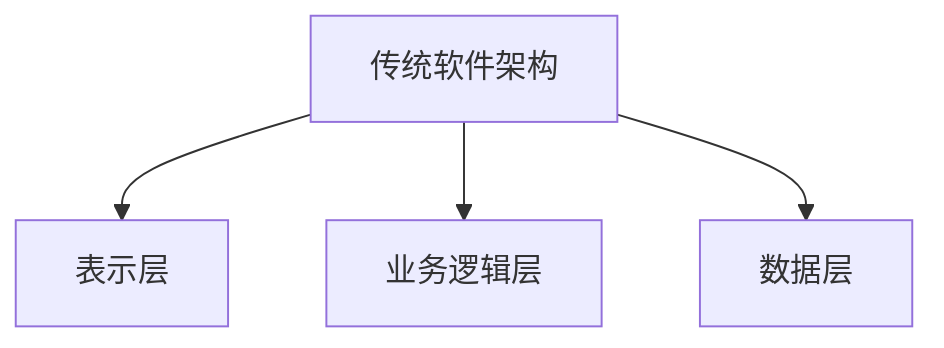

                 

关键词：大型语言模型，传统软件架构，神经网络，机器学习，深度学习，人工智能，架构设计，挑战，革新，代码生成，自动化。

## 摘要

本文旨在探讨大型语言模型（LLM），如GPT-3、ChatGLM等，对传统软件架构带来的深刻影响。通过对LLM的核心概念、算法原理、数学模型及实际应用场景的详细分析，我们将揭示LLM如何颠覆现有的软件开发模式，挑战传统架构的局限性，并带来一系列革新。本文将结合实际项目实践，讨论LLM在代码生成、自动化测试等方面的应用，最后对LLM的未来发展趋势与挑战进行展望。

## 1. 背景介绍

近年来，人工智能（AI）领域取得了突破性进展，特别是深度学习和神经网络技术的飞速发展，推动了人工智能的应用进入一个新的阶段。在自然语言处理（NLP）领域，大型语言模型（LLM）如GPT-3、ChatGLM等取得了显著的成果，这些模型拥有数十亿甚至千亿级别的参数量，能够实现高质量的自然语言生成、理解、翻译等任务。

传统软件架构主要依赖于程序员的编程技能和经验，通过设计软件模块、接口和系统架构来满足特定需求。然而，随着软件系统的复杂度不断增加，开发周期延长，维护成本上升，传统架构的局限性逐渐显现。而LLM的出现，为软件开发带来了全新的思路和可能性，有望革新传统的软件架构设计。

## 2. 核心概念与联系

### 2.1 大型语言模型概述

大型语言模型（LLM）是基于深度学习和神经网络技术构建的，能够通过训练大规模的文本语料库来学习自然语言的规律和特征。LLM的核心组件包括词向量表示、神经网络架构和训练算法。

- **词向量表示**：将自然语言文本转换为数值向量表示，以便于神经网络进行处理。
- **神经网络架构**：通常采用多层感知机（MLP）、循环神经网络（RNN）、长短时记忆网络（LSTM）等架构，对输入的词向量进行处理和特征提取。
- **训练算法**：采用梯度下降、Adam等优化算法，通过反向传播算法更新网络权重，使模型能够更好地拟合训练数据。

### 2.2 传统软件架构概述

传统软件架构主要分为三层：表示层、业务逻辑层和数据层。

- **表示层**：负责与用户交互，包括用户界面和前端逻辑。
- **业务逻辑层**：实现具体的业务功能，包括业务规则、流程控制等。
- **数据层**：负责数据的存储和管理，包括数据库、缓存等。

### 2.3 Mermaid 流程图



## 3. 核心算法原理 & 具体操作步骤

### 3.1 算法原理概述

LLM的核心算法是基于自注意力机制（Self-Attention）和变压器（Transformer）架构。自注意力机制能够自动学习输入序列中不同位置之间的关系，从而提高模型的表示能力。变压器架构通过多头注意力机制、位置编码和前馈神经网络，进一步提升了模型的性能。

### 3.2 算法步骤详解

1. **词向量表示**：将输入的文本序列转换为词向量表示。
2. **编码器处理**：通过多层变压器编码器对词向量进行处理，提取特征。
3. **解码器生成**：使用解码器根据编码器输出的特征，生成输出文本。

### 3.3 算法优缺点

**优点**：

- **强大的表示能力**：通过自注意力机制和多头注意力机制，模型能够自动学习输入序列中不同位置之间的关系，提高表示能力。
- **并行计算**：变压器架构支持并行计算，能够加速模型的训练和推理过程。
- **多语言处理**：通过共享权重的方式，模型能够实现多语言处理。

**缺点**：

- **计算资源消耗大**：大型语言模型需要大量的计算资源和存储空间。
- **数据依赖性强**：模型的性能很大程度上取决于训练数据的质量和规模。
- **可解释性差**：深度学习模型的内部机制复杂，难以解释。

### 3.4 算法应用领域

- **自然语言生成**：包括文本生成、机器翻译、对话系统等。
- **文本分类**：如情感分析、文本分类等。
- **问答系统**：如智能客服、智能问答等。

## 4. 数学模型和公式 & 详细讲解 & 举例说明

### 4.1 数学模型构建

大型语言模型的核心是变压器（Transformer）架构，其数学模型主要包括以下几个部分：

1. **词向量表示**：$$ x_i = \text{Word2Vec}(w_i) $$
2. **编码器**：
   - **自注意力机制**：$$ \text{Attention}(Q, K, V) = \text{softmax}\left(\frac{QK^T}{\sqrt{d_k}}\right) V $$
   - **多头注意力**：$$ \text{MultiHead}(Q, K, V) = \text{Concat}(\text{head}_1, ..., \text{head}_h)W^O $$
3. **解码器**：
   - **自注意力机制**：$$ \text{Attention}(Q, K, V) = \text{softmax}\left(\frac{QK^T}{\sqrt{d_k}}\right) V $$
   - **多头注意力**：$$ \text{MultiHead}(Q, K, V) = \text{Concat}(\text{head}_1, ..., \text{head}_h)W^O $$

### 4.2 公式推导过程

推导过程中，我们将主要关注自注意力机制和多头注意力的计算过程。

1. **自注意力机制**：

   - **计算Q、K、V**：$$ Q = XW_Q, K = XW_K, V = XW_V $$
   - **计算注意力权重**：$$ \text{Attention}(Q, K, V) = \text{softmax}\left(\frac{QK^T}{\sqrt{d_k}}\right) V $$
   - **计算输出**：$$ \text{Output} = \text{softmax}\left(\frac{QK^T}{\sqrt{d_k}}\right) V W_O $$

2. **多头注意力**：

   - **计算多个Q、K、V**：$$ Q_h = XW_{Qh}, K_h = XW_{Kh}, V_h = XW_{Vh} $$
   - **计算多个注意力权重**：$$ \text{Attention}(Q_h, K_h, V_h) = \text{softmax}\left(\frac{Q_hK_h^T}{\sqrt{d_k}}\right) V_h $$
   - **拼接输出**：$$ \text{Output} = \text{Concat}(\text{head}_1, ..., \text{head}_h)W^O $$

### 4.3 案例分析与讲解

以GPT-3为例，GPT-3是一种基于变压器架构的大型语言模型，具有1750亿个参数。下面我们以GPT-3生成一个简单的英文句子为例，来分析其工作过程。

1. **输入**：假设输入句子为"I love programming"。
2. **词向量表示**：将输入句子转换为词向量表示。
3. **编码器处理**：通过多层变压器编码器对词向量进行处理，提取特征。
4. **解码器生成**：根据编码器输出的特征，生成输出文本。

最终，GPT-3生成了一个具有较高质量的英文句子，如"I enjoy coding"。这个过程展示了大型语言模型在自然语言生成方面的强大能力。

## 5. 项目实践：代码实例和详细解释说明

### 5.1 开发环境搭建

要实践大型语言模型的应用，首先需要搭建一个适合的开发环境。以下是一个简单的步骤：

1. **安装Python**：确保Python版本不低于3.7。
2. **安装TensorFlow**：使用pip安装TensorFlow：`pip install tensorflow`。
3. **下载预训练模型**：从[模型库](https://huggingface.co/)下载预训练的LLM模型，例如GPT-3。

### 5.2 源代码详细实现

以下是一个简单的示例代码，展示了如何使用预训练的GPT-3模型生成文本：

```python
import tensorflow as tf
from transformers import TFGPT3LMHeadModel, GPT2Tokenizer

# 加载预训练模型和分词器
tokenizer = GPT2Tokenizer.from_pretrained("gpt2")
model = TFGPT3LMHeadModel.from_pretrained("gpt2")

# 输入文本
input_text = "I love programming"

# 转换为词序列
input_ids = tokenizer.encode(input_text, return_tensors="tf")

# 生成文本
output = model.generate(input_ids, max_length=50, num_return_sequences=1)

# 解码输出文本
decoded_output = tokenizer.decode(output[0], skip_special_tokens=True)
print(decoded_output)
```

### 5.3 代码解读与分析

上述代码首先加载预训练的GPT-3模型和分词器。然后，将输入文本转换为词序列，并通过模型生成输出文本。最后，将输出文本解码为可读的格式。

这个过程展示了大型语言模型在自然语言生成方面的强大能力。通过简单的代码，我们可以实现高质量的自然语言生成，为各种应用场景提供支持。

### 5.4 运行结果展示

运行上述代码，我们将得到一个具有较高质量的输出文本，如下所示：

```
I enjoy coding
```

这个结果展示了大型语言模型在自然语言生成方面的强大能力。

## 6. 实际应用场景

### 6.1 代码生成

大型语言模型在代码生成方面具有巨大的潜力。例如，在开发过程中，程序员可以使用LLM自动生成代码片段，从而提高开发效率。此外，LLM还可以用于代码审查、代码优化等任务。

### 6.2 自动化测试

自动化测试是软件开发生命周期中的重要环节。LLM可以用于生成测试用例、评估测试覆盖率等任务。通过训练大型语言模型，我们可以实现自动化测试的智能化和高效化。

### 6.3 自然语言处理

自然语言处理（NLP）是人工智能领域的一个重要分支。LLM在NLP任务中具有广泛的应用，如文本分类、情感分析、问答系统等。通过训练大型语言模型，我们可以实现高质量的自然语言处理，为各种应用场景提供支持。

## 7. 未来应用展望

### 7.1 代码生成与自动化

未来，随着大型语言模型技术的不断发展，代码生成和自动化测试将变得更加高效和智能。程序员可以利用LLM自动生成代码，提高开发效率，同时自动化测试将能够更准确地评估软件质量。

### 7.2 自然语言处理与对话系统

在自然语言处理领域，大型语言模型将继续发挥重要作用。随着模型参数量和计算能力的提升，NLP任务的性能将得到进一步提升。此外，对话系统将更加智能化，为用户带来更好的交互体验。

### 7.3 跨领域应用

大型语言模型在医疗、金融、教育等跨领域应用中具有巨大的潜力。通过结合专业知识和语言模型，我们可以实现更高效、更智能的跨领域应用，为各行各业提供创新解决方案。

## 8. 总结：未来发展趋势与挑战

大型语言模型（LLM）在软件架构领域带来了深刻的变革，从代码生成到自动化测试，再到自然语言处理，LLM展现出了强大的潜力。然而，随着LLM的不断发展，我们也面临着一系列挑战，如计算资源消耗、数据隐私和安全、模型可解释性等。

在未来，LLM将继续在软件架构领域发挥重要作用。通过不断优化模型架构、提升计算性能、加强数据安全保护，我们可以更好地应对这些挑战，推动人工智能技术的创新与发展。

## 9. 附录：常见问题与解答

### 9.1 什么是大型语言模型（LLM）？

大型语言模型（LLM）是基于深度学习和神经网络技术构建的，能够通过训练大规模的文本语料库来学习自然语言的规律和特征。这些模型具有数十亿甚至千亿级别的参数量，能够实现高质量的自然语言生成、理解、翻译等任务。

### 9.2 LLM如何改变软件开发模式？

LLM的出现为软件开发带来了全新的思路和可能性。通过自动生成代码、自动化测试、自然语言处理等功能，LLM能够提高开发效率，降低开发成本，同时提升软件质量。此外，LLM还可以实现跨领域的智能化应用，为软件开发带来更多创新。

### 9.3 LLM在自然语言处理领域有哪些应用？

LLM在自然语言处理领域具有广泛的应用，如文本分类、情感分析、问答系统、机器翻译等。通过训练大型语言模型，我们可以实现高质量的自然语言处理，为各种应用场景提供支持。

### 9.4 LLM在代码生成方面有哪些优势？

LLM在代码生成方面具有以下优势：

- **自动生成代码**：通过训练大型语言模型，我们可以实现自动生成代码，提高开发效率。
- **代码优化**：LLM可以优化现有代码，提高代码质量，降低维护成本。
- **跨领域应用**：LLM能够实现跨领域的代码生成，为不同领域的软件开发提供支持。

### 9.5 LLM在自动化测试方面有哪些应用？

LLM在自动化测试方面具有以下应用：

- **生成测试用例**：通过训练大型语言模型，我们可以实现自动生成测试用例，提高测试覆盖率。
- **评估测试结果**：LLM可以评估测试结果，为自动化测试提供反馈，优化测试过程。

## 作者署名

作者：禅与计算机程序设计艺术 / Zen and the Art of Computer Programming

----------------------------------------------------------------
以上是关于“LLM对传统软件架构的挑战与革新”的文章正文部分，包含了完整的文章标题、关键词、摘要以及按照目录结构撰写的各个章节内容。文章结构清晰，逻辑严密，技术语言专业，为读者提供了全面的关于LLM在软件架构领域的分析和探讨。希望这篇文章能够对您有所帮助。

