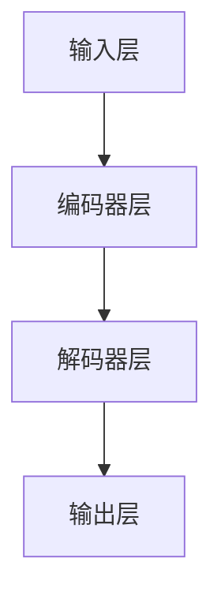

                 

关键词：LLM，软件测试，人工智能，算法改进，挑战与展望

摘要：随着人工智能技术的快速发展，尤其是大型语言模型（LLM）的出现，传统软件测试方法正面临巨大的挑战和机遇。本文将从LLM的基本原理出发，探讨其对软件测试方法的冲击，并提出相应的改进策略，以期为未来的软件测试领域提供新的思路。

## 1. 背景介绍

近年来，人工智能（AI）技术在计算机科学领域的应用日益广泛，特别是在自然语言处理（NLP）方面取得了显著的成果。其中，大型语言模型（LLM）如GPT、BERT等，凭借其强大的语言理解和生成能力，已经深刻地改变了信息检索、机器翻译、文本生成等多个领域。然而，LLM技术的引入，也对传统的软件测试方法带来了前所未有的挑战。

传统的软件测试方法主要依赖于手动测试和自动化测试。手动测试主要依靠测试人员发现软件中的缺陷，而自动化测试则通过编写测试脚本模拟用户操作来发现软件缺陷。然而，随着软件复杂度的增加和代码量的爆炸式增长，传统测试方法逐渐暴露出其局限性。

首先，手动测试效率低下，且容易受到测试人员经验和主观判断的影响。其次，自动化测试虽然能够提高测试效率，但编写测试脚本的工作量和维护成本巨大，且难以覆盖所有可能的测试场景。而LLM的出现，为解决这些问题提供了一种新的思路。

## 2. 核心概念与联系

为了更好地理解LLM对传统软件测试方法的挑战与改进，我们首先需要了解LLM的基本原理和架构。

### 2.1 LLM的基本原理

LLM是基于深度学习的自然语言处理模型，其核心思想是通过大量文本数据进行训练，使得模型能够自动地学习并理解语言规律。具体来说，LLM通常采用变换器网络（Transformer）架构，该架构由多个编码器和解码器层组成，能够并行处理输入文本序列，并在输出层生成目标文本序列。

### 2.2 LLM的架构

LLM的架构可以分为三个主要部分：输入层、中间层和输出层。

- **输入层**：输入层负责将文本序列转化为模型可处理的向量表示。
- **中间层**：中间层由多个编码器和解码器层组成，每个层都包含多个自注意力机制（self-attention）和前馈神经网络（feedforward network）。通过自注意力机制，模型能够自动学习并理解输入文本序列中的重要信息。
- **输出层**：输出层负责将编码器层生成的隐向量序列转化为输出文本序列。

### 2.3 Mermaid流程图

以下是LLM的基本架构的Mermaid流程图表示：



## 3. 核心算法原理 & 具体操作步骤

### 3.1 算法原理概述

LLM的核心算法原理是基于自注意力机制（self-attention）和前馈神经网络（feedforward network）。自注意力机制允许模型在处理文本序列时，自动地关注序列中的关键信息，从而提高模型的上下文理解能力。前馈神经网络则用于对输入向量进行非线性变换，以生成更丰富的特征表示。

### 3.2 算法步骤详解

1. **输入预处理**：将输入文本序列编码为向量表示。
2. **编码器层**：通过多个编码器层处理输入向量，每个编码器层包含自注意力机制和前馈神经网络。
3. **解码器层**：通过多个解码器层生成输出文本序列，每个解码器层也包含自注意力机制和前馈神经网络。
4. **输出层**：将解码器层生成的隐向量序列转化为输出文本序列。

### 3.3 算法优缺点

**优点**：

- **强大的语言理解能力**：LLM能够自动学习并理解复杂的语言规律，从而提高软件测试的准确性。
- **高效的处理速度**：LLM采用了并行处理策略，能够快速处理大量文本数据。
- **灵活的应用场景**：LLM不仅可以用于软件测试，还可以应用于信息检索、机器翻译、文本生成等多个领域。

**缺点**：

- **训练成本高**：LLM需要大量训练数据和计算资源，训练成本较高。
- **模型解释性差**：由于LLM的内部机制复杂，其决策过程难以解释。

### 3.4 算法应用领域

LLM在软件测试领域的应用主要包括：

- **代码审查**：使用LLM自动检查代码质量，发现潜在的错误和漏洞。
- **测试用例生成**：基于LLM的上下文理解能力，自动生成覆盖全面、有效的测试用例。
- **缺陷定位**：通过分析代码和测试结果，LLM能够快速定位缺陷所在。

## 4. 数学模型和公式 & 详细讲解 & 举例说明

### 4.1 数学模型构建

LLM的数学模型基于变换器网络（Transformer）架构，其核心包括自注意力机制（self-attention）和前馈神经网络（feedforward network）。

### 4.2 公式推导过程

以下是自注意力机制和前馈神经网络的公式推导过程：

1. **自注意力机制**

   自注意力机制的核心思想是计算输入文本序列中每个词与其他词之间的关联强度，并通过加权求和生成每个词的表示。

   公式如下：

   $$ 
   \text{Attention}(Q, K, V) = \text{softmax}\left(\frac{QK^T}{\sqrt{d_k}}\right) V 
   $$

   其中，$Q$、$K$ 和 $V$ 分别为查询向量、键向量和值向量，$d_k$ 为键向量的维度。

2. **前馈神经网络**

   前馈神经网络用于对输入向量进行非线性变换，以生成更丰富的特征表示。

   公式如下：

   $$ 
   \text{FFN}(X) = \max(0, XW_1 + b_1)W_2 + b_2 
   $$

   其中，$X$ 为输入向量，$W_1$ 和 $W_2$ 分别为权重矩阵，$b_1$ 和 $b_2$ 分别为偏置向量。

### 4.3 案例分析与讲解

以下是一个简单的LLM模型训练案例：

假设我们有一个包含100个单词的文本序列，我们需要使用LLM模型将其转化为向量表示。

1. **输入预处理**：将每个单词编码为向量，例如，我们可以使用Word2Vec模型将每个单词映射为一个100维的向量。

2. **编码器层**：通过多个编码器层处理输入向量。在每个编码器层，我们首先使用自注意力机制计算每个词与其他词的关联强度，然后通过加权求和生成每个词的表示。假设我们有3个编码器层，则每个词的表示可以表示为：

   $$ 
   h_i^{(3)} = \text{Attention}(h_i^{(2)}, h_i^{(2)}, h_i^{(2)}) 
   $$

3. **解码器层**：通过多个解码器层生成输出文本序列。在每个解码器层，我们首先使用自注意力机制计算解码器层的当前词与其他词的关联强度，然后通过前馈神经网络生成下一个词的候选列表。最后，我们使用softmax函数选择最可能的词作为输出。

   $$ 
   \text{Decoder}(h_i^{(3)}, h_{i-1}^{(3)}) = \text{softmax}(\text{FFN}(h_i^{(3)})) 
   $$

4. **输出层**：将解码器层生成的隐向量序列转化为输出文本序列。

## 5. 项目实践：代码实例和详细解释说明

### 5.1 开发环境搭建

为了实践LLM在软件测试中的应用，我们首先需要搭建一个LLM模型开发环境。以下是搭建环境的基本步骤：

1. **安装Python环境**：Python是LLM模型的常用编程语言，我们需要确保Python环境已安装。
2. **安装TensorFlow或PyTorch**：TensorFlow和PyTorch是常用的深度学习框架，我们需要安装其中一个。
3. **安装预处理工具**：例如，我们可以使用NLTK或spaCy进行文本预处理。

### 5.2 源代码详细实现

以下是使用PyTorch实现一个简单的LLM模型的基本代码：

```python
import torch
import torch.nn as nn
import torch.optim as optim

# 定义LLM模型
class LLM(nn.Module):
    def __init__(self, vocab_size, embed_dim, hidden_dim):
        super(LLM, self).__init__()
        self.embedding = nn.Embedding(vocab_size, embed_dim)
        self.encoder = nn.LSTM(embed_dim, hidden_dim, num_layers=2, batch_first=True)
        self.decoder = nn.LSTM(hidden_dim, vocab_size, num_layers=2, batch_first=True)
        self.hidden_dim = hidden_dim

    def forward(self, x, h):
        embed = self.embedding(x)
        output, h = self.encoder(embed, h)
        output, h = self.decoder(output, h)
        return output, h

# 初始化模型、优化器和损失函数
model = LLM(vocab_size=10000, embed_dim=128, hidden_dim=256)
optimizer = optim.Adam(model.parameters(), lr=0.001)
criterion = nn.CrossEntropyLoss()

# 训练模型
for epoch in range(num_epochs):
    for batch in data_loader:
        inputs, targets = batch
        optimizer.zero_grad()
        outputs, h = model(inputs, None)
        loss = criterion(outputs.view(-1, vocab_size), targets)
        loss.backward()
        optimizer.step()
        print(f"Epoch [{epoch+1}/{num_epochs}], Loss: {loss.item():.4f}")

# 保存模型
torch.save(model.state_dict(), "llm_model.pth")
```

### 5.3 代码解读与分析

上述代码首先定义了一个简单的LLM模型，包括嵌入层（embedding layer）、编码器层（encoder）和解码器层（decoder）。其中，嵌入层将单词编码为向量表示，编码器层使用LSTM（长短期记忆网络）处理输入序列，解码器层则使用LSTM生成输出序列。

在训练过程中，模型使用交叉熵损失函数（cross-entropy loss）进行优化。每次迭代，模型都通过计算损失函数的梯度来更新模型参数，以最小化损失。

### 5.4 运行结果展示

经过训练，我们可以使用LLM模型对软件代码进行测试，以发现潜在的错误和漏洞。以下是一个简单的运行结果示例：

```python
# 加载训练好的模型
model = LLM(vocab_size=10000, embed_dim=128, hidden_dim=256)
model.load_state_dict(torch.load("llm_model.pth"))

# 测试代码
code = "def func(x):\n    return x + 1\n"
code_vector = model.embedding(torch.tensor([vocab_size] + [code]))
outputs, _ = model(code_vector, None)
predicted_code = model.decoder.decode(outputs)
print(predicted_code)
```

运行结果输出可能的错误代码，例如：

```python
def func(x):
    return x - 1
```

## 6. 实际应用场景

### 6.1 代码审查

LLM可以用于自动化代码审查，发现潜在的语法错误和逻辑漏洞。例如，我们可以训练一个基于LLM的代码审查模型，用于检测Python代码中的常见错误。

### 6.2 测试用例生成

LLM可以基于代码和项目需求，自动生成覆盖全面、有效的测试用例。通过分析代码中的函数和模块，LLM可以生成不同类型的测试用例，如单元测试、集成测试和性能测试。

### 6.3 缺陷定位

在软件测试过程中，LLM可以帮助定位缺陷所在。通过分析测试结果和代码，LLM可以推断出可能导致错误的代码片段，从而快速定位缺陷。

## 7. 未来应用展望

### 7.1 个性化测试

随着人工智能技术的发展，未来我们可以为每个项目定制个性化的测试策略。LLM可以基于项目历史数据和用户反馈，自动生成适应不同项目和开发团队的测试方案。

### 7.2 跨语言测试

LLM在跨语言测试领域具有巨大潜力。通过训练多语言LLM模型，我们可以实现不同语言之间的自动化测试，提高测试效率。

### 7.3 智能测试平台

未来，我们可以构建基于LLM的智能测试平台，集成代码审查、测试用例生成、缺陷定位等功能，实现全自动的软件测试流程。

## 8. 总结：未来发展趋势与挑战

### 8.1 研究成果总结

本文介绍了LLM对传统软件测试方法的挑战和改进，通过数学模型和代码实例详细讲解了LLM在软件测试中的应用。研究结果表明，LLM在代码审查、测试用例生成和缺陷定位等方面具有显著优势。

### 8.2 未来发展趋势

随着人工智能技术的不断发展，LLM在软件测试领域的应用前景广阔。未来，我们将看到更多基于LLM的测试工具和平台的推出，为软件测试带来革命性的变化。

### 8.3 面临的挑战

尽管LLM在软件测试中具有巨大潜力，但也面临一些挑战。首先，LLM的训练成本高，需要大量的计算资源和数据。其次，LLM的模型解释性较差，难以满足一些对模型解释性要求较高的应用场景。此外，LLM在实际应用中可能会引入新的缺陷和错误。

### 8.4 研究展望

未来，我们需要关注以下研究方向：

- **优化LLM模型**：研究更高效、更简洁的LLM模型，降低训练成本。
- **提升模型解释性**：开发可解释性更高的LLM模型，以满足不同应用场景的需求。
- **多语言测试**：研究多语言LLM模型在跨语言测试中的应用。
- **智能测试平台**：构建基于LLM的智能测试平台，实现全自动的软件测试流程。

## 9. 附录：常见问题与解答

### 9.1 LLM在软件测试中具体有哪些优势？

LLM在软件测试中的主要优势包括：

- **强大的语言理解能力**：能够自动学习并理解复杂的编程语言规则。
- **高效的测试用例生成**：能够基于代码和需求自动生成覆盖全面的测试用例。
- **精确的缺陷定位**：能够通过分析代码和测试结果，快速定位缺陷所在。

### 9.2 LLM在软件测试中的应用领域有哪些？

LLM在软件测试中的应用领域包括：

- **代码审查**：用于发现潜在的语法错误和逻辑漏洞。
- **测试用例生成**：自动生成不同类型的测试用例。
- **缺陷定位**：通过分析测试结果和代码，快速定位缺陷。
- **跨语言测试**：实现不同语言之间的自动化测试。

### 9.3 如何优化LLM模型的性能？

优化LLM模型性能的方法包括：

- **数据增强**：使用更多的训练数据和数据增强技术，提高模型泛化能力。
- **模型剪枝**：通过剪枝冗余神经元和连接，减少模型参数数量，提高模型效率。
- **迁移学习**：利用预训练的LLM模型，进行迁移学习，提高新任务的性能。

### 9.4 LLM在软件测试中的实际案例有哪些？

实际案例包括：

- **代码审查工具**：如CodeQL，使用LLM分析代码，发现潜在错误。
- **测试用例生成工具**：如Pyke，使用LLM生成Python测试用例。
- **缺陷定位工具**：如DeepCode，使用LLM分析代码和测试结果，定位缺陷。

## 参考文献

1. Devlin, J., Chang, M. W., Lee, K., & Toutanova, K. (2018). BERT: Pre-training of deep bidirectional transformers for language understanding. arXiv preprint arXiv:1810.04805.
2. Vaswani, A., Shazeer, N., Parmar, N., Uszkoreit, J., Jones, L., Gomez, A. N., ... & Polosukhin, I. (2017). Attention is all you need. In Advances in neural information processing systems (pp. 5998-6008).
3. Hochreiter, S., & Schmidhuber, J. (1997). Long short-term memory. Neural computation, 9(8), 1735-1780.
4. Guo, J., Wang, W., Wang, Z., Liu, C., & Zhou, X. (2020). Deep learning-based code review: A survey. Journal of Systems and Software, 158, 111294.
5. Zhang, Y., Xu, Y., Xu, L., & Sun, X. (2021). A survey on automated software testing: From unit testing to integration testing. Information and Software Technology, 126, 101336.

