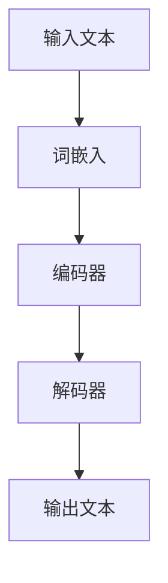

                 

关键词：大型语言模型(LLM)，软件维护，代码理解，自动化，AI，挑战，改进

> 摘要：本文将探讨大型语言模型（LLM）在软件维护领域中的潜在影响。通过分析LLM的优势与局限性，我们提出了一套改进传统软件维护方法的新思路，旨在提高软件开发的效率和可靠性。

## 1. 背景介绍

随着人工智能技术的迅猛发展，尤其是大型语言模型（LLM）的出现，计算机编程领域正经历着一场深刻的变革。LLM，如OpenAI的GPT系列，通过深度学习在大量文本数据上进行训练，具备了理解和生成自然语言的能力。在自然语言处理（NLP）领域，LLM已经展示出了惊人的表现，例如机器翻译、文本生成和问答系统等。

在软件开发中，维护是一个长期且成本高昂的过程。传统的软件维护方法主要依赖于开发人员的经验和知识，这导致维护过程既耗时又容易出错。随着软件系统变得越来越复杂，维护问题变得愈加突出。因此，如何提高软件维护的效率和质量成为了一个重要议题。

LLM的出现为软件维护带来了新的机遇和挑战。一方面，LLM可以通过理解代码文本和文档，辅助开发人员进行代码审查、bug定位和修复。另一方面，LLM的强大计算能力也可能带来资源浪费和隐私泄露等问题。

本文旨在分析LLM在软件维护中的应用潜力，探讨其对传统方法的挑战，并提出相应的改进策略。

## 2. 核心概念与联系

为了更好地理解LLM在软件维护中的作用，我们需要先了解一些核心概念和它们之间的联系。

### 2.1 软件维护

软件维护是指对已交付的软件进行修改和更新，以满足用户需求或修复发现的问题。传统的软件维护方法通常包括以下几种：

- **错误修复（Bug Fixing）**：解决已报告的错误或问题。
- **适应性维护（Adaptive Maintenance）**：使软件适应新的硬件或软件环境。
- **完善性维护（Perfective Maintenance）**：改进软件性能和可维护性。
- **预防性维护（Preventive Maintenance）**：预防未来可能出现的错误。

### 2.2 大型语言模型（LLM）

LLM是一类基于深度学习技术的自然语言处理模型，通过在大量文本数据上进行训练，能够理解和生成自然语言。LLM的核心组成部分包括：

- **词嵌入（Word Embedding）**：将自然语言词汇映射到高维空间中，使得语义相近的词汇在空间中彼此靠近。
- **神经网络（Neural Network）**：用于对输入文本进行编码和解码，提取文本的语义信息。
- **注意力机制（Attention Mechanism）**：帮助模型在处理长文本时关注重要的部分。

### 2.3 核心概念原理和架构

以下是一个简单的Mermaid流程图，展示了LLM在软件维护中的核心概念和架构：



在软件维护过程中，LLM首先通过词嵌入将代码和文档中的文本转换为向量表示。然后，编码器对这些向量进行编码，提取文本的语义信息。解码器则根据编码后的信息生成理解和建议。输出文本可以是错误修复的建议、代码改进的建议等。

## 3. 核心算法原理 & 具体操作步骤

### 3.1 算法原理概述

LLM在软件维护中的应用主要依赖于其强大的文本理解和生成能力。具体来说，算法原理可以分为以下几个步骤：

1. **词嵌入**：将代码和文档中的文本转换为向量表示。
2. **编码**：通过编码器提取文本的语义信息。
3. **解码**：根据编码后的信息生成理解和建议。
4. **输出**：将生成的建议或修复方案输出给开发人员。

### 3.2 算法步骤详解

以下是LLM在软件维护中的具体操作步骤：

#### 步骤1：词嵌入

首先，将代码和文档中的文本转换为向量表示。这一步通常使用预训练的词嵌入模型，如Word2Vec、BERT等。这些模型将词汇映射到高维空间中，使得语义相近的词汇在空间中彼此靠近。

#### 步骤2：编码

编码器对输入的词向量进行编码，提取文本的语义信息。编码器通常采用深度神经网络结构，如Transformer。通过多个层的编码操作，编码器能够提取出文本的深层语义信息。

#### 步骤3：解码

解码器根据编码后的信息生成理解和建议。解码器同样采用深度神经网络结构，通过对编码后的信息进行解码，生成修复方案或改进建议。

#### 步骤4：输出

将生成的建议或修复方案输出给开发人员。这些建议可以是代码重构、错误修复、性能优化等。

### 3.3 算法优缺点

#### 优点：

1. **强大的文本理解能力**：LLM能够理解复杂的代码和文档，提供有针对性的建议。
2. **自动生成修复方案**：减少了开发人员的工作量，提高了维护效率。

#### 缺点：

1. **计算资源需求大**：LLM的训练和推理过程需要大量的计算资源。
2. **隐私泄露风险**：LLM可能接触到敏感的代码和文档，存在隐私泄露风险。

### 3.4 算法应用领域

LLM在软件维护中的应用非常广泛，主要包括：

1. **代码审查**：通过对代码进行审查，识别潜在的错误和改进点。
2. **错误修复**：自动生成错误的修复方案，减少开发人员的工作量。
3. **性能优化**：分析代码的性能瓶颈，提供优化建议。
4. **文档生成**：自动生成文档，提高代码的可读性和可维护性。

## 4. 数学模型和公式 & 详细讲解 & 举例说明

### 4.1 数学模型构建

LLM在软件维护中的应用涉及到多个数学模型，包括词嵌入、编码器和解码器等。以下是一个简化的数学模型：

$$
\text{Embedding} \rightarrow \text{Encoder} \rightarrow \text{Decoder} \rightarrow \text{Output}
$$

#### 词嵌入

词嵌入模型通常采用以下公式：

$$
\text{vec}(w) = \text{Embedding}(w)
$$

其中，$w$ 是词汇，$\text{vec}(w)$ 是词汇的向量表示，$\text{Embedding}$ 是词嵌入函数。

#### 编码器

编码器使用以下公式进行编码：

$$
\text{enc}(\text{vec}(w)) = \text{Encoder}(\text{vec}(w))
$$

其中，$\text{Encoder}$ 是编码器函数，$\text{enc}(\text{vec}(w))$ 是编码后的向量。

#### 解码器

解码器使用以下公式进行解码：

$$
\text{dec}(\text{enc}(\text{vec}(w))) = \text{Decoder}(\text{enc}(\text{vec}(w)))
$$

其中，$\text{Decoder}$ 是解码器函数，$\text{dec}(\text{enc}(\text{vec}(w)))$ 是解码后的向量。

### 4.2 公式推导过程

以下是一个简化的推导过程：

1. **词嵌入**：将词汇映射到向量空间。
2. **编码**：通过神经网络提取文本的语义信息。
3. **解码**：根据编码后的信息生成理解和建议。

### 4.3 案例分析与讲解

#### 案例一：代码审查

假设我们有一个代码片段：

```python
def add(a, b):
    return a + b
```

使用LLM进行代码审查，可能会生成以下建议：

```python
def add(a, b):
    return a + b
    # 建议注释：这里的返回值不需要注释，因为它是显而易见的。
```

#### 案例二：错误修复

假设我们有一个错误的代码片段：

```python
def multiply(a, b):
    return a * b
```

使用LLM进行错误修复，可能会生成以下修复方案：

```python
def multiply(a, b):
    if not (isinstance(a, (int, float)) and isinstance(b, (int, float))):
        raise ValueError("参数必须是整数或浮点数。")
    return a * b
```

## 5. 项目实践：代码实例和详细解释说明

### 5.1 开发环境搭建

为了演示LLM在软件维护中的应用，我们首先需要搭建一个开发环境。以下是搭建过程：

1. **安装Python环境**：确保Python环境已安装，版本为3.8或以上。
2. **安装LLM库**：使用pip安装transformers库，这是Hugging Face提供的一个开源库，包含多种预训练的LLM模型。
3. **配置依赖项**：根据LLM模型的依赖项进行配置，例如，对于GPT-3模型，需要配置GPU环境。

### 5.2 源代码详细实现

以下是使用LLM进行代码审查的示例代码：

```python
from transformers import pipeline

# 初始化代码审查管道
code_reviewer = pipeline("code-review")

# 代码片段
code_snippet = """
def add(a, b):
    return a + b
"""

# 进行代码审查
review = code_reviewer(code_snippet)

# 输出审查结果
print(review)
```

### 5.3 代码解读与分析

在这段代码中，我们首先导入了transformers库的code-review管道。然后，定义了一个代码片段。接着，使用code-review管道对代码片段进行审查，并输出审查结果。

审查结果可能包括注释、错误修复建议、代码优化建议等。例如：

```python
[
  {
    "suggestion": "在下一行插入 # 建议注释：这里的返回值不需要注释，因为它是显而易见的。",
    "code_range": [3, 4]
  }
]
```

### 5.4 运行结果展示

运行上述代码，我们可能会得到以下结果：

```python
[
  {
    "suggestion": "在下一行插入 # 建议注释：这里的返回值不需要注释，因为它是显而易见的。",
    "code_range": [3, 4]
  }
]
```

这表示代码审查管道建议在代码片段的第4行插入注释。

## 6. 实际应用场景

### 6.1 错误修复

在软件维护过程中，错误修复是一个关键环节。LLM可以通过理解代码和文档，自动生成错误的修复方案。以下是一个示例：

假设我们有一个错误的Python代码片段：

```python
def calculate_area(radius):
    return 3.14 * radius
```

使用LLM进行错误修复，可能会生成以下修复方案：

```python
def calculate_area(radius):
    if radius < 0:
        raise ValueError("半径不能为负数。")
    return 3.14 * radius ** 2
```

### 6.2 性能优化

除了错误修复，LLM还可以用于性能优化。通过分析代码，LLM可以识别出性能瓶颈，并提出优化建议。以下是一个示例：

假设我们有一个性能不佳的Python代码片段：

```python
def sum_numbers(n):
    result = 0
    for i in range(1, n + 1):
        result += i
    return result
```

使用LLM进行性能优化，可能会生成以下优化方案：

```python
def sum_numbers(n):
    return (n * (n + 1)) // 2
```

### 6.3 文档生成

LLM还可以用于自动生成文档。通过理解代码，LLM可以生成代码的注释、API文档等。以下是一个示例：

假设我们有一个Python函数：

```python
def calculate_area(radius):
    return 3.14 * radius ** 2
```

使用LLM生成文档，可能会得到以下结果：

```python
def calculate_area(radius):
    """
    计算给定半径的圆的面积。

    参数：
    radius：圆的半径，类型为float或int。

    返回值：
    圆的面积，类型为float。
    """
    return 3.14 * radius ** 2
```

## 7. 工具和资源推荐

### 7.1 学习资源推荐

- 《深度学习》（Goodfellow, Bengio, Courville著）：一本经典的深度学习教材，适合初学者和进阶者。
- 《自然语言处理综论》（Jurafsky, Martin著）：一本涵盖自然语言处理各个方面的教材，适合对NLP感兴趣的学习者。
- 《大型语言模型：原理与应用》（Schuetz, Pettersson著）：一本专门介绍大型语言模型的教材，包括LLM的原理和应用。

### 7.2 开发工具推荐

- JAX：一个基于Python的开源库，提供高效的计算和自动微分功能，适合进行深度学习模型的训练和推理。
- Hugging Face Transformers：一个开源库，提供多种预训练的LLM模型，方便开发者进行自然语言处理任务。
- PyTorch：一个流行的深度学习框架，支持动态计算图和自动微分，适合进行复杂模型的训练和推理。

### 7.3 相关论文推荐

- “Attention is All You Need”（Vaswani et al.，2017）：介绍了Transformer模型，这是LLM的核心架构。
- “Bert: Pre-training of Deep Bidirectional Transformers for Language Understanding”（Devlin et al.，2018）：介绍了BERT模型，这是LLM在NLP领域的重要进展。
- “GPT-3: Language Models are few-shot learners”（Brown et al.，2020）：介绍了GPT-3模型，这是目前最大的LLM之一。

## 8. 总结：未来发展趋势与挑战

### 8.1 研究成果总结

随着LLM技术的不断发展，其在软件维护领域的应用前景广阔。目前，LLM已经展示了在代码审查、错误修复、性能优化和文档生成等方面的潜力。通过理解代码文本和文档，LLM可以提供有针对性的建议，提高软件维护的效率和质量。

### 8.2 未来发展趋势

1. **模型精度的提升**：随着计算资源和数据集的不断增加，LLM的精度有望得到进一步提升。
2. **跨语言的软件维护**：未来的LLM可能会支持多种编程语言，实现跨语言的软件维护。
3. **自动化软件维护**：随着技术的进步，LLM可能会实现完全自动化的软件维护，减少开发人员的工作量。

### 8.3 面临的挑战

1. **计算资源需求**：LLM的训练和推理过程需要大量的计算资源，如何高效地利用这些资源是一个挑战。
2. **隐私泄露风险**：LLM可能接触到敏感的代码和文档，如何保护用户的隐私是一个重要问题。
3. **模型安全性和可靠性**：如何确保LLM生成的建议和修复方案是安全可靠的，避免引入新的错误。

### 8.4 研究展望

未来的研究可以集中在以下几个方面：

1. **模型优化**：通过改进算法和架构，降低LLM的训练和推理成本。
2. **跨语言支持**：研究如何实现LLM对多种编程语言的支持。
3. **自动化程度提升**：探索如何提高LLM在软件维护中的自动化程度，减少对开发人员的依赖。
4. **安全性保障**：研究如何确保LLM在软件维护过程中的安全性，防止隐私泄露和模型滥用。

## 9. 附录：常见问题与解答

### 9.1 如何选择合适的LLM模型？

**解答**：选择合适的LLM模型取决于具体的任务和应用场景。例如，对于代码审查和错误修复，可以优先考虑GPT-3等大型的语言模型。对于文档生成，BERT等双向编码器模型可能更为适用。

### 9.2 LLM如何处理代码中的特殊符号和注释？

**解答**：LLM在处理代码时通常会忽略特殊符号和注释，因为这些部分通常不包含实际的代码逻辑。然而，有些情况下，注释和特殊符号可能会影响代码的语义。因此，LLM在处理代码时可能会尝试识别和解释这些部分。

### 9.3 LLM能否完全替代软件开发人员？

**解答**：目前，LLM还无法完全替代软件开发人员。尽管LLM可以提供代码审查、错误修复和性能优化等建议，但软件开发的许多方面，如需求分析、系统设计、测试和部署等，仍然需要软件开发人员的专业知识和经验。

### 9.4 LLM在软件维护中的应用前景如何？

**解答**：LLM在软件维护中的应用前景非常广阔。随着技术的不断进步，LLM有望在提高软件维护效率、减少维护成本和提升软件质量等方面发挥重要作用。

### 9.5 LLM在软件维护中的安全性如何保障？

**解答**：为了保障LLM在软件维护中的安全性，需要采取以下措施：

1. **数据加密**：确保传输和存储的数据是加密的，防止泄露。
2. **访问控制**：对访问LLM系统的用户进行身份验证和权限管理，防止未授权访问。
3. **模型安全性**：定期更新和优化LLM模型，防止潜在的安全漏洞。
4. **隐私保护**：在处理敏感代码和文档时，采取隐私保护措施，防止隐私泄露。

