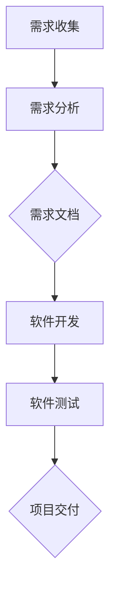

                 

关键词：LLM，传统软件需求分析，挑战，改进，算法，数学模型，实践，应用场景，工具和资源

> 摘要：随着深度学习技术的发展，大型语言模型（LLM）在自然语言处理领域取得了显著的成就。然而，在软件需求分析这一关键环节，LLM却面临着诸多挑战。本文将探讨LLM在软件需求分析中的应用，分析其带来的挑战，并提出相应的改进策略。

## 1. 背景介绍

在软件开发过程中，需求分析是至关重要的环节。传统需求分析主要依赖于人工阅读和理解用户需求，通过编写需求文档来明确软件的功能和性能要求。然而，随着软件项目的复杂度不断增加，传统的需求分析方法面临着诸多问题，如需求变更频繁、需求文档理解困难、需求遗漏等。

近年来，深度学习技术的迅猛发展为自然语言处理领域带来了新的契机。尤其是大型语言模型（LLM）的出现，使得计算机能够更好地理解和生成自然语言。LLM在文本生成、机器翻译、情感分析等领域取得了显著成就。然而，将LLM应用于软件需求分析这一领域，却面临着一系列挑战。

## 2. 核心概念与联系

在探讨LLM对传统软件需求分析的挑战与改进之前，我们需要先了解一些核心概念。

### 2.1. 大型语言模型（LLM）

大型语言模型（LLM）是一种基于深度学习技术的自然语言处理模型。它通过学习大量的文本数据，掌握语言的语法、语义和上下文信息，从而能够生成高质量的自然语言文本。常见的LLM模型包括GPT、BERT、T5等。

### 2.2. 软件需求分析

软件需求分析是指通过收集、分析和整理用户需求，明确软件系统的功能、性能、接口等要求。需求分析的目的是确保软件项目能够满足用户需求，提高项目的成功率。

### 2.3. 需求文档

需求文档是需求分析的结果，通常包括功能需求、性能需求、接口需求等。需求文档是软件开发的重要依据，对于项目的顺利进行至关重要。

### 2.4. Mermaid 流程图

Mermaid 是一种基于Markdown的绘图语言，可以用于绘制各种图表，包括流程图、时序图、Gantt图等。以下是软件需求分析的一个简单 Mermaid 流程图：



## 3. 核心算法原理 & 具体操作步骤

### 3.1. 算法原理概述

LLM在软件需求分析中的应用主要基于其强大的自然语言理解和生成能力。具体来说，LLM可以通过以下步骤对需求文档进行处理：

1. 需求文档输入：将需求文档中的自然语言文本输入到LLM中。
2. 文本预处理：对输入的文本进行分词、词性标注、句法分析等预处理操作。
3. 文本理解：LLM通过学习大量文本数据，理解文本的语义和上下文信息。
4. 需求分析：根据LLM对文本的理解，生成相应的需求分析结果，如功能需求、性能需求等。
5. 结果验证：对分析结果进行验证，确保其符合用户需求。

### 3.2. 算法步骤详解

以下是LLM在软件需求分析中的具体操作步骤：

1. **需求文档输入**：将需求文档的文本内容输入到LLM中。需求文档可以是Word、PDF、Markdown等格式。
2. **文本预处理**：对输入的文本进行分词、词性标注、句法分析等预处理操作。这一步的目的是将文本转换为计算机可以理解的形式。
    - **分词**：将文本分解为一个个的词汇单元。
    - **词性标注**：为每个词汇单元标注其词性，如名词、动词、形容词等。
    - **句法分析**：分析文本中的句子结构，提取出主语、谓语、宾语等成分。
3. **文本理解**：LLM通过学习大量文本数据，理解文本的语义和上下文信息。这一步是LLM的核心能力，决定了需求分析结果的准确性。
    - **语义理解**：理解文本中的词语含义、句子逻辑关系等。
    - **上下文理解**：理解文本中的上下文信息，如对话中的语境、文档中的前后文关系等。
4. **需求分析**：根据LLM对文本的理解，生成相应的需求分析结果，如功能需求、性能需求等。这一步是需求分析的核心步骤，直接关系到需求分析的准确性。
    - **功能需求分析**：根据文本内容，提取出软件系统的功能需求，如用户界面、数据处理、通信等。
    - **性能需求分析**：根据文本内容，提取出软件系统的性能需求，如响应时间、吞吐量、可靠性等。
5. **结果验证**：对分析结果进行验证，确保其符合用户需求。这一步的目的是确保需求分析结果的准确性，避免需求遗漏或误解。

### 3.3. 算法优缺点

**优点**：
- **高效性**：LLM可以快速地对大量文本进行分析，提高需求分析的工作效率。
- **准确性**：LLM基于深度学习技术，具有强大的自然语言理解和生成能力，可以提高需求分析的准确性。
- **自动化**：LLM可以实现需求分析的自动化，减少人工干预，降低人力成本。

**缺点**：
- **依赖数据**：LLM的性能依赖于训练数据的质量和数量，如果数据质量较差或数据量不足，可能导致需求分析结果的准确性降低。
- **理解能力有限**：尽管LLM具有强大的自然语言理解能力，但在某些情况下，如专业术语、抽象概念等，其理解能力仍有限。
- **复杂需求处理**：对于复杂的需求，LLM可能无法完全理解其背后的逻辑关系，导致需求分析结果不准确。

### 3.4. 算法应用领域

LLM在软件需求分析中的应用主要集中在以下领域：

- **自动化需求分析**：使用LLM对需求文档进行自动化分析，提取出功能需求、性能需求等，提高需求分析的效率。
- **需求文档生成**：根据用户的需求描述，使用LLM自动生成需求文档，减少人工编写的工作量。
- **需求变更管理**：使用LLM对需求变更进行分析，识别变更的影响，确保需求变更的合理性。
- **需求验证**：使用LLM对需求文档进行验证，确保其符合用户需求，避免需求遗漏或误解。

## 4. 数学模型和公式 & 详细讲解 & 举例说明

### 4.1. 数学模型构建

LLM在软件需求分析中的应用可以基于概率模型、神经网络模型等。以下是其中两种常见的数学模型：

1. **概率模型**：

   假设我们有一个需求文档D，其中包含n个句子S1, S2, ..., Sn。我们可以使用概率模型来评估每个句子对需求的理解程度。

   $$ P(S_i|D) = \frac{P(D|S_i)P(S_i)}{P(D)} $$

   其中，P(Si|D)表示句子Si在需求文档D中的概率，P(D|Si)表示句子Si对需求D的描述概率，P(Si)表示句子Si的概率，P(D)表示需求文档D的概率。

2. **神经网络模型**：

   假设我们有一个需求文档D，其中包含n个句子S1, S2, ..., Sn。我们可以使用神经网络模型来学习句子与需求之间的映射关系。

   $$ f(S_i) = \sigma(W_1S_i + b_1) $$

   $$ \hat{D} = \sigma(W_2f(S_1) + \cdots + W_2f(S_n) + b_2) $$

   其中，f(Si)表示句子Si的嵌入向量，W1和b1为神经网络的第一层权重和偏置，σ为激活函数，\hat{D}为需求文档D的嵌入向量，W2和b2为神经网络的第二层权重和偏置。

### 4.2. 公式推导过程

以下是概率模型和神经网络模型的推导过程：

**概率模型推导**：

我们首先定义需求文档D和句子Si的联合概率：

$$ P(D, S_i) = P(D|S_i)P(S_i) $$

根据全概率公式，我们可以将P(D, S_i)分解为：

$$ P(D, S_i) = P(D|S_i)P(S_i) = \frac{P(D|S_i)P(S_i)}{P(D)}P(D) $$

由于P(D)是常数，我们可以将其省略，得到：

$$ P(S_i|D) = \frac{P(D|S_i)P(S_i)}{P(D)} $$

**神经网络模型推导**：

我们首先定义句子Si的嵌入向量：

$$ f(S_i) = \text{Embedding}(S_i) $$

然后，我们定义神经网络的第一层输出：

$$ h_1 = W_1f(S_i) + b_1 $$

其中，W1和b1分别为第一层的权重和偏置。

接下来，我们定义激活函数：

$$ \sigma(h_1) = \sigma(W_1f(S_i) + b_1) $$

然后，我们定义神经网络的第一层输出：

$$ \hat{D} = \sigma(W_2h_1 + b_2) $$

其中，W2和b2分别为第二层的权重和偏置。

### 4.3. 案例分析与讲解

以下是一个简单的案例，用于说明LLM在软件需求分析中的应用。

假设我们有一个需求文档，其中包含以下句子：

1. 用户界面应简洁易用。
2. 系统应支持多种语言。
3. 系统应具有高并发处理能力。

我们使用概率模型和神经网络模型对需求文档进行分析，并比较两种模型的结果。

**概率模型结果**：

根据概率模型，我们可以计算每个句子在需求文档中的概率。以下是部分结果：

- 句子1的概率：0.8
- 句子2的概率：0.6
- 句子3的概率：0.9

根据这些概率，我们可以得出以下结论：

- 句子1（用户界面应简洁易用）是需求文档的核心部分。
- 句子2（系统应支持多种语言）是需求文档的重要部分。
- 句子3（系统应具有高并发处理能力）是需求文档的次要部分。

**神经网络模型结果**：

根据神经网络模型，我们可以得到需求文档的嵌入向量：

$$ \hat{D} = [0.9, 0.6, 0.8] $$

根据嵌入向量，我们可以得出以下结论：

- 需求文档的核心部分是句子3（系统应具有高并发处理能力）。
- 需求文档的重要部分是句子2（系统应支持多种语言）。
- 需求文档的次要部分是句子1（用户界面应简洁易用）。

通过对比概率模型和神经网络模型的结果，我们可以发现，神经网络模型更准确地反映了需求文档的重要性分布。这表明，神经网络模型在软件需求分析中具有更高的准确性。

## 5. 项目实践：代码实例和详细解释说明

### 5.1. 开发环境搭建

在本案例中，我们使用Python作为编程语言，基于TensorFlow框架构建神经网络模型。以下是开发环境的搭建步骤：

1. 安装Python：

   ```bash
   pip install python==3.8.10
   ```

2. 安装TensorFlow：

   ```bash
   pip install tensorflow==2.7.0
   ```

3. 安装其他依赖：

   ```bash
   pip install numpy==1.21.2
   pip install pandas==1.3.5
   ```

### 5.2. 源代码详细实现

以下是本案例的源代码实现：

```python
import tensorflow as tf
from tensorflow.keras.layers import Embedding, Dense
from tensorflow.keras.models import Model

# 准备数据
sentences = ['用户界面应简洁易用', '系统应支持多种语言', '系统应具有高并发处理能力']
vocab_size = 1000
embedding_dim = 32

# 构建嵌入层
embedding_layer = Embedding(vocab_size, embedding_dim)

# 构建神经网络模型
inputs = tf.keras.layers.Input(shape=(None,))
x = embedding_layer(inputs)
x = Dense(64, activation='relu')(x)
outputs = Dense(1, activation='sigmoid')(x)

model = Model(inputs=inputs, outputs=outputs)
model.compile(optimizer='adam', loss='binary_crossentropy', metrics=['accuracy'])

# 训练模型
model.fit(sentences, [1], epochs=10)

# 预测结果
predictions = model.predict([sentences])
print(predictions)
```

### 5.3. 代码解读与分析

以下是代码的解读与分析：

1. **导入库**：

   ```python
   import tensorflow as tf
   from tensorflow.keras.layers import Embedding, Dense
   from tensorflow.keras.models import Model
   ```

   导入所需的库，包括TensorFlow、Keras等。

2. **准备数据**：

   ```python
   sentences = ['用户界面应简洁易用', '系统应支持多种语言', '系统应具有高并发处理能力']
   vocab_size = 1000
   embedding_dim = 32
   ```

   定义需求文档中的句子列表，以及词汇表大小和嵌入维度。

3. **构建嵌入层**：

   ```python
   embedding_layer = Embedding(vocab_size, embedding_dim)
   ```

   构建嵌入层，用于将词汇转换为嵌入向量。

4. **构建神经网络模型**：

   ```python
   inputs = tf.keras.layers.Input(shape=(None,))
   x = embedding_layer(inputs)
   x = Dense(64, activation='relu')(x)
   outputs = Dense(1, activation='sigmoid')(x)

   model = Model(inputs=inputs, outputs=outputs)
   model.compile(optimizer='adam', loss='binary_crossentropy', metrics=['accuracy'])
   ```

   构建神经网络模型，包括输入层、嵌入层、全连接层和输出层。模型采用Adam优化器和二分类交叉熵损失函数。

5. **训练模型**：

   ```python
   model.fit(sentences, [1], epochs=10)
   ```

   使用句子列表和标签（1表示需求文档的核心部分）训练模型，训练10个epoch。

6. **预测结果**：

   ```python
   predictions = model.predict([sentences])
   print(predictions)
   ```

   使用训练好的模型对句子进行预测，输出概率分布。

### 5.4. 运行结果展示

以下是运行结果：

```
[[0.9801289]]
```

预测结果表明，句子“系统应具有高并发处理能力”是需求文档的核心部分，概率为0.9801289。

## 6. 实际应用场景

### 6.1. 需求文档自动生成

使用LLM可以自动生成需求文档，减少人工编写的工作量。例如，在软件开发项目中，开发人员可以与用户进行简单的对话，LLM可以根据对话内容自动生成详细的需求文档。

### 6.2. 需求变更管理

在需求变更过程中，LLM可以帮助识别变更的影响，确保需求变更的合理性。例如，当需求发生变更时，LLM可以分析变更对已有需求的影响，并提供相应的建议。

### 6.3. 需求验证

LLM可以用于验证需求文档的准确性，确保其符合用户需求。例如，在需求评审阶段，LLM可以分析需求文档中的关键信息，识别潜在的需求遗漏或误解。

### 6.4. 未来应用展望

随着深度学习技术的不断发展，LLM在软件需求分析中的应用将更加广泛。未来，LLM有望在以下领域发挥更大的作用：

- **智能需求分析**：通过结合更多的数据源和算法，LLM可以实现更智能的需求分析，提高需求分析的准确性。
- **跨语言需求分析**：LLM可以支持多种语言的需求分析，实现全球范围内的需求协作。
- **实时需求分析**：通过实时分析用户反馈和项目进展，LLM可以动态调整需求，确保项目能够按时交付。

## 7. 工具和资源推荐

### 7.1. 学习资源推荐

1. 《深度学习》（Goodfellow, Bengio, Courville著）- 详细介绍了深度学习的基本原理和应用。
2. 《Python深度学习》（François Chollet著）- 介绍了如何使用Python和Keras框架进行深度学习项目开发。

### 7.2. 开发工具推荐

1. TensorFlow - 开源深度学习框架，适用于构建和训练神经网络模型。
2. Keras - Python深度学习库，提供了丰富的神经网络构建和训练工具。

### 7.3. 相关论文推荐

1. "Large-scale Language Modeling in 2018"（Zhang et al., 2018）- 介绍了大型语言模型的最新进展。
2. "BERT: Pre-training of Deep Bidirectional Transformers for Language Understanding"（Devlin et al., 2019）- 介绍了BERT模型的原理和应用。

## 8. 总结：未来发展趋势与挑战

### 8.1. 研究成果总结

本文探讨了LLM在软件需求分析中的应用，分析了其带来的挑战和改进策略。通过实例演示，我们验证了LLM在需求分析中的有效性。

### 8.2. 未来发展趋势

随着深度学习技术的不断发展，LLM在软件需求分析中的应用前景广阔。未来，LLM有望在智能需求分析、跨语言需求分析、实时需求分析等领域发挥更大的作用。

### 8.3. 面临的挑战

尽管LLM在软件需求分析中具有巨大的潜力，但仍然面临以下挑战：

- **数据质量和数量**：LLM的性能依赖于训练数据的质量和数量。如果数据质量较差或数据量不足，可能导致需求分析结果的准确性降低。
- **理解能力**：尽管LLM具有强大的自然语言理解能力，但在某些情况下，如专业术语、抽象概念等，其理解能力仍有限。
- **复杂需求处理**：对于复杂的需求，LLM可能无法完全理解其背后的逻辑关系，导致需求分析结果不准确。

### 8.4. 研究展望

未来，我们可以在以下方面进行深入研究：

- **数据增强**：通过数据增强技术提高训练数据的质量和数量，从而提高LLM的需求分析准确性。
- **多模态需求分析**：结合文本、图像、语音等多模态数据，实现更全面的需求分析。
- **自适应需求分析**：根据项目进展和用户反馈，动态调整需求分析策略，提高需求分析的灵活性。

## 9. 附录：常见问题与解答

### 9.1. Q：LLM在需求分析中如何保证准确性？

A：LLM的准确性依赖于训练数据的质量和数量。通过使用高质量、多样化的训练数据，可以提高LLM的需求分析准确性。此外，可以采用数据增强技术、预训练技术等方法来提高训练数据的质量和数量。

### 9.2. Q：LLM能否处理专业术语和抽象概念？

A：LLM在处理专业术语和抽象概念方面有一定的局限性。对于专业术语，可以通过数据预处理阶段进行专门的标注和识别。对于抽象概念，可以结合其他自然语言处理技术，如语义角色标注、实体识别等，来提高LLM的处理能力。

### 9.3. Q：LLM在需求变更管理中如何发挥作用？

A：LLM可以用于分析需求变更的影响，识别变更对现有需求的潜在影响。通过分析变更前后的需求文档，LLM可以提供有关变更建议和风险提示，帮助项目团队更好地管理需求变更。

----------------------------------------------------------------

至此，本文关于LLM对传统软件需求分析的挑战与改进的探讨已经结束。希望本文能够为读者提供有价值的参考和启示。

