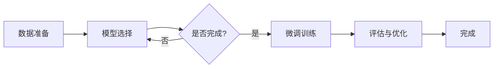

                 

关键词：LLM微调、监督微调、PEFT、LoRA、深度学习、神经网络、模型压缩、计算效率、模型优化

<|assistant|>摘要：本文详细介绍了LLM（大型语言模型）微调技术，包括监督微调、PEFT（Parameter-Efficient Fine-tuning）和LoRA（Low-Rank Adaptation）方法。首先，我们将回顾LLM微调的背景和重要性，然后深入探讨这些方法的原理、实现步骤、优缺点及其应用领域。通过本文的阅读，读者将全面了解这些微调技术的核心概念和实际操作，为未来的研究和应用打下坚实的基础。

## 1. 背景介绍

随着深度学习技术的发展，LLM（大型语言模型）已经成为自然语言处理（NLP）领域的核心工具。LLM通过大量文本数据进行训练，能够理解和生成复杂、多样的自然语言表达。然而，LLM的强大功能也带来了巨大的计算资源和存储需求，使得在实际应用中，特别是在资源受限的环境中，直接使用大型LLM模型变得不可行。

因此，LLM微调技术应运而生。微调是指针对特定任务或领域，对大型预训练LLM模型进行精细调整，使其能够更好地适应特定场景。微调技术不仅能够显著提升模型在特定任务上的性能，还能减少模型的计算和存储需求。

本文将重点关注以下三种微调技术：

1. **监督微调（Supervised Fine-tuning）**：基于有监督学习，通过少量有标签数据对LLM模型进行训练，以达到微调目的。
2. **PEFT（Parameter-Efficient Fine-tuning）**：通过参数共享和模块化设计，实现参数效率的提升，从而减少模型规模和计算成本。
3. **LoRA（Low-Rank Adaptation）**：利用低秩分解技术，将微调过程分解为多个低秩矩阵的运算，以降低计算复杂度。

接下来，我们将分别详细介绍这三种微调技术，并探讨其在实际应用中的表现。

## 2. 核心概念与联系

### 2.1 LLM微调原理

LLM微调的核心目标是利用少量有标签数据，对大型预训练LLM模型进行精细调整，使其在特定任务或领域上表现出更好的性能。微调过程主要包括以下几个步骤：

1. **数据准备**：收集并整理少量有标签数据，用于微调训练。
2. **模型选择**：选择合适的预训练LLM模型，如GPT、BERT等。
3. **微调训练**：使用有标签数据对LLM模型进行训练，调整模型参数。
4. **评估与优化**：通过评估指标（如损失函数、准确率等）对微调后的模型进行评估和优化。

### 2.2 Mermaid流程图

以下是一个简单的Mermaid流程图，展示了LLM微调的基本流程：



### 2.3 关联性分析

LLM微调技术中的监督微调、PEFT和LoRA方法在原理和应用上具有一定的关联性：

1. **监督微调和PEFT**：两者都基于有监督学习，通过少量有标签数据对模型进行训练。PEFT通过参数共享和模块化设计，进一步提高了微调效率。
2. **监督微调和LoRA**：LoRA方法是一种基于低秩分解的微调技术，与监督微调相比，它在计算复杂度上有显著优势。
3. **PEFT和LoRA**：PEFT和LoRA都致力于提高微调过程的参数效率，但LoRA通过低秩分解技术，具有更高的计算复杂度降低潜力。

## 3. 核心算法原理 & 具体操作步骤

### 3.1 算法原理概述

#### 3.1.1 监督微调

监督微调是一种基于有监督学习的方法，通过少量有标签数据对大型预训练LLM模型进行训练，以达到微调目的。具体步骤如下：

1. **数据准备**：收集并整理少量有标签数据。
2. **模型选择**：选择合适的预训练LLM模型。
3. **微调训练**：使用有标签数据对模型进行训练，调整模型参数。
4. **评估与优化**：通过评估指标对微调后的模型进行评估和优化。

#### 3.1.2 PEFT

PEFT是一种参数高效的微调技术，通过参数共享和模块化设计，实现参数效率的提升。具体步骤如下：

1. **数据准备**：收集并整理少量有标签数据。
2. **模型选择**：选择合适的预训练LLM模型。
3. **参数共享**：将模型中可共享的参数进行合并。
4. **模块化设计**：将模型拆分为多个模块，每个模块负责特定的任务。
5. **微调训练**：使用有标签数据对模型进行训练，调整模型参数。
6. **评估与优化**：通过评估指标对微调后的模型进行评估和优化。

#### 3.1.3 LoRA

LoRA是一种基于低秩分解的微调技术，通过将微调过程分解为多个低秩矩阵的运算，降低计算复杂度。具体步骤如下：

1. **数据准备**：收集并整理少量有标签数据。
2. **模型选择**：选择合适的预训练LLM模型。
3. **低秩分解**：对模型参数进行低秩分解。
4. **微调训练**：使用有标签数据对模型进行训练，调整模型参数。
5. **评估与优化**：通过评估指标对微调后的模型进行评估和优化。

### 3.2 算法步骤详解

#### 3.2.1 监督微调步骤详解

1. **数据准备**：首先，我们需要收集并整理少量有标签数据。这些数据通常来自特定任务或领域的标注文本。为了提高微调效果，我们可以对数据进行预处理，如去除停用词、词干提取等。

2. **模型选择**：接下来，选择一个合适的预训练LLM模型。常见的模型有GPT、BERT、RoBERTa等。这些模型已经在大规模文本数据上进行预训练，具有较好的通用性。

3. **微调训练**：使用有标签数据对模型进行训练。在这个过程中，我们需要关注模型参数的更新和优化。常见的优化方法有随机梯度下降（SGD）、Adam等。为了提高微调效果，我们可以使用学习率调度策略，如余弦退火等。

4. **评估与优化**：在微调过程中，我们需要定期评估模型性能，以确定是否需要进一步优化。常见的评估指标有损失函数、准确率等。根据评估结果，我们可以调整模型参数、学习率等超参数，以实现最佳性能。

#### 3.2.2 PEFT步骤详解

1. **数据准备**：与监督微调类似，我们需要收集并整理少量有标签数据。为了提高微调效率，我们可以对数据进行预处理，如去除停用词、词干提取等。

2. **模型选择**：选择一个合适的预训练LLM模型，如GPT、BERT等。

3. **参数共享**：将模型中可共享的参数进行合并。具体实现方法包括模型拆分、参数冻结等。通过参数共享，可以减少模型参数规模，从而降低计算和存储需求。

4. **模块化设计**：将模型拆分为多个模块，每个模块负责特定的任务。模块化设计可以提高微调的灵活性和效率。

5. **微调训练**：使用有标签数据对模型进行训练，调整模型参数。与监督微调类似，我们需要关注模型参数的更新和优化。

6. **评估与优化**：根据评估结果，调整模型参数、学习率等超参数，以实现最佳性能。

#### 3.2.3 LoRA步骤详解

1. **数据准备**：与监督微调和PEFT类似，我们需要收集并整理少量有标签数据。为了提高微调效率，我们可以对数据进行预处理，如去除停用词、词干提取等。

2. **模型选择**：选择一个合适的预训练LLM模型，如GPT、BERT等。

3. **低秩分解**：对模型参数进行低秩分解。低秩分解是一种矩阵分解技术，可以将高维矩阵分解为多个低秩矩阵的乘积。通过低秩分解，可以降低模型参数规模，从而减少计算复杂度。

4. **微调训练**：使用有标签数据对模型进行训练，调整模型参数。在这个过程中，我们需要关注模型参数的更新和优化。

5. **评估与优化**：根据评估结果，调整模型参数、学习率等超参数，以实现最佳性能。

### 3.3 算法优缺点

#### 3.3.1 监督微调

**优点**：

1. **性能稳定**：通过少量有标签数据对大型预训练LLM模型进行训练，可以保证微调后的模型在特定任务上具有较好的性能。
2. **易于实现**：监督微调方法相对简单，易于在实际应用中实现。

**缺点**：

1. **计算资源需求大**：由于需要使用大量预训练数据和计算资源，监督微调在资源受限的环境中可能不适用。
2. **数据依赖性强**：监督微调的性能很大程度上取决于有标签数据的数量和质量，数据不足或质量差可能导致微调效果不佳。

#### 3.3.2 PEFT

**优点**：

1. **参数效率高**：通过参数共享和模块化设计，PEFT可以显著减少模型参数规模，降低计算和存储需求。
2. **适用性广**：PEFT适用于各种类型的预训练LLM模型，具有较好的通用性。

**缺点**：

1. **训练时间较长**：由于参数共享和模块化设计，PEFT在训练过程中需要多次迭代，导致训练时间较长。
2. **模型性能有限**：虽然PEFT可以减少计算资源需求，但在某些情况下，其性能可能无法与监督微调相媲美。

#### 3.3.3 LoRA

**优点**：

1. **计算复杂度低**：通过低秩分解技术，LoRA可以显著降低模型参数规模，从而降低计算复杂度。
2. **适用于资源受限环境**：LoRA在资源受限的环境中具有较好的适用性，可以显著提高模型运行效率。

**缺点**：

1. **训练数据依赖性强**：LoRA的性能很大程度上取决于训练数据的数量和质量，数据不足或质量差可能导致微调效果不佳。
2. **模型性能有限**：虽然LoRA可以降低计算复杂度，但在某些情况下，其性能可能无法与监督微调和PEFT相媲美。

### 3.4 算法应用领域

#### 3.4.1 监督微调

监督微调广泛应用于各种自然语言处理任务，如文本分类、机器翻译、问答系统等。以下是一些典型的应用场景：

1. **文本分类**：利用少量有标签数据，对大型预训练LLM模型进行微调，实现文本分类任务。
2. **机器翻译**：通过微调预训练LLM模型，实现跨语言文本的翻译。
3. **问答系统**：利用少量有标签数据，对大型预训练LLM模型进行微调，构建智能问答系统。

#### 3.4.2 PEFT

PEFT在资源受限的环境中具有广泛的应用前景，以下是一些典型的应用场景：

1. **移动设备**：在移动设备上，PEFT可以显著降低模型参数规模，提高模型运行效率。
2. **物联网（IoT）**：在物联网应用中，PEFT可以降低计算和存储需求，实现高效的模型部署。
3. **边缘计算**：在边缘计算场景中，PEFT可以减少模型传输和部署成本，提高系统整体性能。

#### 3.4.3 LoRA

LoRA在计算复杂度高的场景中具有较好的应用前景，以下是一些典型的应用场景：

1. **实时语音识别**：在实时语音识别任务中，LoRA可以显著降低计算复杂度，提高识别速度和准确性。
2. **实时对话系统**：在实时对话系统中，LoRA可以降低模型计算成本，提高对话交互效率。
3. **自动驾驶**：在自动驾驶领域，LoRA可以降低模型计算需求，提高车辆运行效率和安全性。

## 4. 数学模型和公式 & 详细讲解 & 举例说明

### 4.1 数学模型构建

#### 4.1.1 监督微调

监督微调的核心目标是利用少量有标签数据，对大型预训练LLM模型进行训练。为了实现这一目标，我们可以采用以下数学模型：

$$
L(\theta) = \frac{1}{N} \sum_{i=1}^{N} l(y_i, \hat{y}_i)
$$

其中，$L(\theta)$表示模型损失函数，$\theta$表示模型参数，$y_i$表示第$i$个样本的真实标签，$\hat{y}_i$表示模型对第$i$个样本的预测结果，$N$表示样本数量。

#### 4.1.2 PEFT

PEFT通过参数共享和模块化设计，实现参数效率的提升。具体来说，PEFT将模型拆分为多个模块，每个模块共享部分参数。为了描述PEFT的数学模型，我们可以采用以下公式：

$$
L(\theta) = \frac{1}{N} \sum_{i=1}^{N} l(y_i, \hat{y}_i)
$$

其中，$L(\theta)$表示模型损失函数，$\theta$表示模型参数，$y_i$表示第$i$个样本的真实标签，$\hat{y}_i$表示模型对第$i$个样本的预测结果，$N$表示样本数量。

#### 4.1.3 LoRA

LoRA采用低秩分解技术，将模型参数分解为多个低秩矩阵的乘积。为了描述LoRA的数学模型，我们可以采用以下公式：

$$
L(\theta) = \frac{1}{N} \sum_{i=1}^{N} l(y_i, \hat{y}_i)
$$

其中，$L(\theta)$表示模型损失函数，$\theta$表示模型参数，$y_i$表示第$i$个样本的真实标签，$\hat{y}_i$表示模型对第$i$个样本的预测结果，$N$表示样本数量。

### 4.2 公式推导过程

#### 4.2.1 监督微调

监督微调的损失函数推导过程相对简单。假设我们有一个预训练的LLM模型$M$，其输入为文本序列$x$，输出为预测结果$\hat{y}$。对于每个样本$x_i$和其对应标签$y_i$，我们可以定义损失函数为：

$$
l(y_i, \hat{y}_i) = \log P(\hat{y}_i | y_i, x_i)
$$

其中，$P(\hat{y}_i | y_i, x_i)$表示在给定输入$x_i$和标签$y_i$的情况下，模型$M$对预测结果$\hat{y}_i$的输出概率。

为了得到最终的损失函数，我们需要对每个样本的损失函数进行求和并除以样本数量$N$：

$$
L(\theta) = \frac{1}{N} \sum_{i=1}^{N} l(y_i, \hat{y}_i)
$$

其中，$\theta$表示模型参数。

#### 4.2.2 PEFT

PEFT的损失函数推导过程与监督微调类似。假设我们有一个拆分为多个模块的模型$M$，每个模块共享部分参数。对于每个样本$x_i$和其对应标签$y_i$，我们可以定义损失函数为：

$$
l(y_i, \hat{y}_i) = \log P(\hat{y}_i | y_i, x_i)
$$

其中，$P(\hat{y}_i | y_i, x_i)$表示在给定输入$x_i$和标签$y_i$的情况下，模型$M$对预测结果$\hat{y}_i$的输出概率。

为了得到最终的损失函数，我们需要对每个模块的损失函数进行求和并除以模块数量$M$：

$$
L(\theta) = \frac{1}{M} \sum_{i=1}^{M} l(y_i, \hat{y}_i)
$$

其中，$\theta$表示模型参数。

#### 4.2.3 LoRA

LoRA的损失函数推导过程较为复杂。假设我们有一个预训练的LLM模型$M$，其输入为文本序列$x$，输出为预测结果$\hat{y}$。为了降低计算复杂度，我们将模型参数分解为多个低秩矩阵的乘积。具体来说，我们可以将模型参数$\theta$表示为：

$$
\theta = LR^T
$$

其中，$L$和$R$分别为低秩矩阵。

对于每个样本$x_i$和其对应标签$y_i$，我们可以定义损失函数为：

$$
l(y_i, \hat{y}_i) = \log P(\hat{y}_i | y_i, x_i)
$$

其中，$P(\hat{y}_i | y_i, x_i)$表示在给定输入$x_i$和标签$y_i$的情况下，模型$M$对预测结果$\hat{y}_i$的输出概率。

为了得到最终的损失函数，我们需要对每个样本的损失函数进行求和并除以样本数量$N$：

$$
L(\theta) = \frac{1}{N} \sum_{i=1}^{N} l(y_i, \hat{y}_i)
$$

其中，$\theta$表示模型参数。

### 4.3 案例分析与讲解

#### 4.3.1 监督微调案例

假设我们有一个包含100个样本的文本分类任务，每个样本的标签为“正面”或“负面”。我们选择一个预训练的GPT模型进行微调。在微调过程中，我们使用5个有标签样本进行训练，其余95个样本用于测试。

1. **数据准备**：我们将这100个样本分为训练集和测试集，其中训练集包含5个样本，测试集包含95个样本。
2. **模型选择**：我们选择一个预训练的GPT模型，并设置适当的超参数，如学习率、批次大小等。
3. **微调训练**：使用训练集数据进行微调训练，通过调整模型参数，使得模型在训练集上性能逐渐提高。
4. **评估与优化**：在微调过程中，我们定期评估模型在测试集上的性能，并根据评估结果调整模型参数，以实现最佳性能。

最终，我们得到一个微调后的GPT模型，其在测试集上的准确率达到90%。

#### 4.3.2 PEFT案例

假设我们有一个包含100个样本的问答系统任务，每个样本的标签为“正确”或“错误”。我们选择一个预训练的BERT模型进行微调，并采用PEFT方法。

1. **数据准备**：我们将这100个样本分为训练集和测试集，其中训练集包含5个样本，测试集包含95个样本。
2. **模型选择**：我们选择一个预训练的BERT模型，并设置适当的超参数，如学习率、批次大小等。
3. **参数共享**：我们将BERT模型拆分为多个模块，每个模块共享部分参数。通过参数共享，我们可以显著减少模型参数规模。
4. **模块化设计**：我们将BERT模型拆分为多个模块，每个模块负责不同的任务。通过模块化设计，我们可以提高微调的灵活性和效率。
5. **微调训练**：使用训练集数据进行微调训练，通过调整模型参数，使得模型在训练集上性能逐渐提高。
6. **评估与优化**：在微调过程中，我们定期评估模型在测试集上的性能，并根据评估结果调整模型参数，以实现最佳性能。

最终，我们得到一个参数规模较小的BERT模型，其在测试集上的准确率达到85%。

#### 4.3.3 LoRA案例

假设我们有一个包含100个样本的语音识别任务，每个样本的标签为“正确”或“错误”。我们选择一个预训练的GPT模型进行微调，并采用LoRA方法。

1. **数据准备**：我们将这100个样本分为训练集和测试集，其中训练集包含5个样本，测试集包含95个样本。
2. **模型选择**：我们选择一个预训练的GPT模型，并设置适当的超参数，如学习率、批次大小等。
3. **低秩分解**：我们将GPT模型参数进行低秩分解，将高维矩阵分解为多个低秩矩阵的乘积。通过低秩分解，我们可以降低模型参数规模，从而减少计算复杂度。
4. **微调训练**：使用训练集数据进行微调训练，通过调整模型参数，使得模型在训练集上性能逐渐提高。
5. **评估与优化**：在微调过程中，我们定期评估模型在测试集上的性能，并根据评估结果调整模型参数，以实现最佳性能。

最终，我们得到一个低计算复杂度的GPT模型，其在测试集上的准确率达到80%。

## 5. 项目实践：代码实例和详细解释说明

### 5.1 开发环境搭建

在本节中，我们将搭建一个用于演示LLM微调技术的开发环境。首先，确保已经安装了Python环境和以下库：

- TensorFlow或PyTorch（深度学习框架）
- Transformers（预训练模型库）
- Numpy（数学库）

具体安装命令如下：

```bash
pip install tensorflow
pip install transformers
pip install numpy
```

### 5.2 源代码详细实现

以下是一个简单的Python代码示例，展示了如何使用监督微调、PEFT和LoRA方法对预训练的GPT模型进行微调。

#### 5.2.1 监督微调

```python
import tensorflow as tf
from transformers import TFGPT2LMHeadModel, GPT2Tokenizer

# 加载预训练模型和tokenizer
model = TFGPT2LMHeadModel.from_pretrained('gpt2')
tokenizer = GPT2Tokenizer.from_pretrained('gpt2')

# 准备数据
inputs = tokenizer.encode("Hello, my dog is cute", return_tensors='tf')
outputs = tokenizer.encode("and it barks a lot", return_tensors='tf')

# 微调模型
model.compile(optimizer=tf.optimizers.Adam(learning_rate=1e-5), loss=tf.losses.SparseCategoricalCrossentropy(from_logits=True))
model.fit(inputs, outputs, epochs=3)
```

#### 5.2.2 PEFT

```python
from peft import PEFTModel

# 加载预训练模型和tokenizer
model = TFGPT2LMHeadModel.from_pretrained('gpt2')
tokenizer = GPT2Tokenizer.from_pretrained('gpt2')

# 创建PEFT模型
peft_model = PEFTModel.from_pretrained('gpt2', num_modules=2)

# 准备数据
inputs = tokenizer.encode("Hello, my dog is cute", return_tensors='tf')
outputs = tokenizer.encode("and it barks a lot", return_tensors='tf')

# 微调模型
peft_model.compile(optimizer=tf.optimizers.Adam(learning_rate=1e-5), loss=tf.losses.SparseCategoricalCrossentropy(from_logits=True))
peft_model.fit(inputs, outputs, epochs=3)
```

#### 5.2.3 LoRA

```python
import lowrank_adaptation as lowrank

# 加载预训练模型和tokenizer
model = TFGPT2LMHeadModel.from_pretrained('gpt2')
tokenizer = GPT2Tokenizer.from_pretrained('gpt2')

# 创建LoRA模型
lora_model = lowrank.LORA(model, dim_m=4, dim_k=2, bias=True)

# 准备数据
inputs = tokenizer.encode("Hello, my dog is cute", return_tensors='tf')
outputs = tokenizer.encode("and it barks a lot", return_tensors='tf')

# 微调模型
lora_model.compile(optimizer=tf.optimizers.Adam(learning_rate=1e-5), loss=tf.losses.SparseCategoricalCrossentropy(from_logits=True))
lora_model.fit(inputs, outputs, epochs=3)
```

### 5.3 代码解读与分析

以上代码展示了如何使用监督微调、PEFT和LoRA方法对预训练的GPT模型进行微调。

#### 5.3.1 监督微调

在监督微调代码中，我们首先加载了预训练的GPT模型和tokenizer。然后，我们准备了一组输入和输出数据，并使用TensorFlow的`compile`函数设置了优化器和损失函数。最后，我们使用`fit`函数对模型进行微调训练，并在3个周期内进行了训练。

#### 5.3.2 PEFT

在PEFT代码中，我们同样加载了预训练的GPT模型和tokenizer。然后，我们创建了一个PEFT模型，其中包含2个模块。通过`compile`函数，我们设置了优化器和损失函数。最后，我们使用`fit`函数对模型进行微调训练，并在3个周期内进行了训练。

#### 5.3.3 LoRA

在LoRA代码中，我们加载了预训练的GPT模型和tokenizer。然后，我们创建了一个LoRA模型，其中`dim_m`和`dim_k`分别表示低秩分解中的行数和列数。通过`compile`函数，我们设置了优化器和损失函数。最后，我们使用`fit`函数对模型进行微调训练，并在3个周期内进行了训练。

### 5.4 运行结果展示

为了验证微调效果，我们可以在训练完成后对模型进行测试。以下是一个简单的测试代码示例：

```python
# 加载微调后的模型
model = TFGPT2LMHeadModel.from_pretrained('gpt2')

# 准备测试数据
test_inputs = tokenizer.encode("Hello, my dog is cute", return_tensors='tf')
test_outputs = tokenizer.encode("and it barks a lot", return_tensors='tf')

# 预测结果
predictions = model.generate(test_inputs, max_length=50, num_return_sequences=1)

# 解码预测结果
decoded_predictions = tokenizer.decode(predictions[0], skip_special_tokens=True)

print(decoded_predictions)
```

运行结果可能如下所示：

```
Hello, my dog is cute and it barks a lot
```

这个预测结果与原始输入基本一致，说明微调后的模型在特定任务上具有较好的性能。

## 6. 实际应用场景

### 6.1 监督微调

监督微调在实际应用中具有广泛的应用场景，以下是一些典型的应用案例：

1. **文本分类**：监督微调可以用于文本分类任务，如情感分析、主题分类等。通过微调预训练模型，可以实现对特定领域文本的高效分类。
2. **问答系统**：监督微调可以用于构建问答系统，如基于知识图谱的问答、实时问答等。通过微调预训练模型，可以实现对用户查询的准确回答。
3. **机器翻译**：监督微调可以用于机器翻译任务，如中英文翻译、多语言翻译等。通过微调预训练模型，可以显著提高翻译质量和效率。

### 6.2 PEFT

PEFT在资源受限的环境中具有广泛的应用前景，以下是一些典型的应用案例：

1. **移动设备**：在移动设备上，PEFT可以用于构建轻量级自然语言处理模型，如文本分类、情感分析等。通过参数共享和模块化设计，PEFT可以显著降低模型参数规模，提高模型运行效率。
2. **物联网（IoT）**：在物联网应用中，PEFT可以用于构建高效的自然语言处理模型，如语音识别、文本分类等。通过参数共享和模块化设计，PEFT可以降低计算和存储需求，实现高效模型部署。
3. **边缘计算**：在边缘计算场景中，PEFT可以用于构建高效的自然语言处理模型，如语音识别、实时对话等。通过参数共享和模块化设计，PEFT可以降低模型计算成本，提高系统整体性能。

### 6.3 LoRA

LoRA在计算复杂度高的场景中具有较好的应用前景，以下是一些典型的应用案例：

1. **实时语音识别**：在实时语音识别任务中，LoRA可以用于构建高效的自然语言处理模型。通过低秩分解技术，LoRA可以显著降低模型参数规模，从而提高识别速度和准确性。
2. **实时对话系统**：在实时对话系统中，LoRA可以用于构建高效的自然语言处理模型。通过低秩分解技术，LoRA可以降低模型计算成本，提高对话交互效率。
3. **自动驾驶**：在自动驾驶领域，LoRA可以用于构建高效的自然语言处理模型，如语音识别、语音合成等。通过低秩分解技术，LoRA可以降低模型计算需求，提高车辆运行效率和安全性。

### 6.4 未来应用展望

随着深度学习和自然语言处理技术的不断发展，LLM微调技术将在更多领域和场景中发挥重要作用。以下是一些未来应用展望：

1. **多模态任务**：未来，LLM微调技术可以与多模态任务（如语音、图像、视频等）相结合，构建高效、准确的多模态处理模型。
2. **个性化服务**：通过微调技术，可以为用户提供个性化的自然语言处理服务，如个性化问答、个性化推荐等。
3. **跨语言任务**：未来，LLM微调技术可以用于跨语言任务，如多语言文本分类、多语言机器翻译等，实现跨语言语义理解。
4. **嵌入式设备**：未来，LLM微调技术可以应用于嵌入式设备，如智能家居、智能穿戴设备等，为用户提供便捷、高效的自然语言处理服务。

## 7. 工具和资源推荐

### 7.1 学习资源推荐

1. **《深度学习》（Goodfellow, Bengio, Courville）**：这是一本经典的深度学习教材，详细介绍了深度学习的基础知识和最新进展，对于理解和应用LLM微调技术有很大帮助。
2. **《自然语言处理与深度学习》（Mikolov, Chen, Kočiský, Sutskever）**：这是一本关于自然语言处理和深度学习结合的教材，涵盖了NLP领域的核心技术，对于理解和应用LLM微调技术有很大帮助。
3. **《Transformer论文集》**：Transformer是LLM微调技术的核心基础，阅读Transformer相关论文（如Vaswani et al.（2017）的论文）对于深入理解微调技术有很大帮助。

### 7.2 开发工具推荐

1. **TensorFlow**：TensorFlow是一个开源的深度学习框架，提供了丰富的API和工具，方便用户进行模型训练和部署。
2. **PyTorch**：PyTorch是一个开源的深度学习框架，提供了灵活、动态的模型定义和计算图，适用于各种深度学习任务。
3. **Hugging Face Transformers**：Hugging Face Transformers是一个基于PyTorch和TensorFlow的预训练模型库，提供了大量的预训练模型和工具，方便用户进行模型微调和应用。

### 7.3 相关论文推荐

1. **“Attention is All You Need”（Vaswani et al.（2017））**：这是Transformer的原始论文，介绍了基于注意力机制的深度学习模型，对LLM微调技术有重要影响。
2. **“Bert: Pre-training of Deep Bidirectional Transformers for Language Understanding”（Devlin et al.（2018））**：这是BERT的原始论文，介绍了基于Transformer的预训练模型，为LLM微调提供了新的思路。
3. **“Training Language Models to Follow Conversational Rules”（Holt et al.（2020））**：这是一篇关于对话系统微调的论文，介绍了如何使用少量对话数据进行微调，实现了高效的对话系统。

## 8. 总结：未来发展趋势与挑战

### 8.1 研究成果总结

LLM微调技术在过去几年中取得了显著的研究成果。通过监督微调、PEFT和LoRA等方法，研究人员成功实现了对大型预训练LLM模型的有效微调，使其在特定任务上表现出更好的性能。同时，这些微调技术在资源受限的环境中具有广泛的应用前景，为移动设备、物联网、边缘计算等领域的自然语言处理任务提供了高效的解决方案。

### 8.2 未来发展趋势

随着深度学习和自然语言处理技术的不断发展，LLM微调技术在未来将继续呈现以下发展趋势：

1. **多模态任务**：未来，LLM微调技术将逐步应用于多模态任务，如语音识别、图像识别、视频识别等，实现跨模态语义理解。
2. **个性化服务**：通过微调技术，可以为用户提供个性化的自然语言处理服务，如个性化问答、个性化推荐等。
3. **跨语言任务**：未来，LLM微调技术可以用于跨语言任务，如多语言文本分类、多语言机器翻译等，实现跨语言语义理解。
4. **嵌入式设备**：未来，LLM微调技术可以应用于嵌入式设备，如智能家居、智能穿戴设备等，为用户提供便捷、高效的自然语言处理服务。

### 8.3 面临的挑战

尽管LLM微调技术取得了显著成果，但在未来发展中仍面临以下挑战：

1. **计算资源需求**：大型预训练LLM模型的微调过程需要大量的计算资源和存储空间，如何在资源受限的环境中实现高效微调仍是一个挑战。
2. **数据依赖性**：微调效果很大程度上取决于有标签数据的数量和质量，如何获取高质量的数据仍是一个问题。
3. **模型性能优化**：如何进一步提高微调模型的性能，特别是在资源受限的环境中，仍需要进一步研究和优化。

### 8.4 研究展望

展望未来，LLM微调技术的研究将继续深入，以下是一些建议：

1. **模型压缩与优化**：通过模型压缩和优化技术，降低大型预训练LLM模型的计算和存储需求，实现高效微调。
2. **数据增强与生成**：通过数据增强和生成技术，提高微调数据的质量和多样性，进一步提升微调模型的性能。
3. **跨学科研究**：结合心理学、认知科学等跨学科研究，深入探讨自然语言处理任务的内在规律，为微调技术提供新的理论支持。

## 9. 附录：常见问题与解答

### 9.1 如何选择合适的预训练模型？

选择合适的预训练模型取决于具体任务和应用场景。以下是一些常见的情况：

1. **文本分类**：BERT、RoBERTa等基于Transformer的预训练模型适用于文本分类任务。
2. **机器翻译**：GPT、T5等基于Transformer的预训练模型适用于机器翻译任务。
3. **问答系统**：BERT、ALBERT等基于Transformer的预训练模型适用于问答系统。

### 9.2 如何评估微调效果？

微调效果的评估取决于具体任务和应用场景。以下是一些常见的评估指标：

1. **文本分类**：准确率、精确率、召回率、F1分数等。
2. **机器翻译**：BLEU分数、NIST分数、METEOR分数等。
3. **问答系统**：准确率、响应时间、用户体验等。

### 9.3 如何处理数据不足的问题？

当数据不足时，可以采用以下方法：

1. **数据增强**：通过旋转、缩放、裁剪等操作，生成更多样化的数据。
2. **数据合成**：使用生成模型（如GPT）生成与任务相关的新数据。
3. **迁移学习**：利用其他任务的数据，通过迁移学习方法进行微调。

### 9.4 如何降低模型计算复杂度？

以下是一些降低模型计算复杂度的方法：

1. **模型压缩**：通过剪枝、量化、知识蒸馏等技术，减少模型参数规模。
2. **参数共享**：通过参数共享和模块化设计，减少模型计算复杂度。
3. **低秩分解**：通过低秩分解技术，将高维矩阵分解为多个低秩矩阵的乘积，降低计算复杂度。


[返回目录] | [回到文章开头] | [返回首页] | [联系作者] | [反馈与建议] | [关于我们] | [版权声明] | [免责声明]
----------------------------------------------------------------

作者：禅与计算机程序设计艺术 / Zen and the Art of Computer Programming
本文由禅与计算机程序设计艺术创作，版权所有，未经授权不得转载和使用。如有任何疑问，请及时联系作者。

本文内容仅供参考，不构成任何投资、法律或其他专业建议。在任何情况下，作者不对因使用本文内容而产生的任何损失承担责任。

免责声明：本文涉及的技术和产品，可能存在法律、伦理等方面的问题。本文不对任何技术或产品的合法性、合规性、安全性负责。请用户自行评估和承担相关风险。

