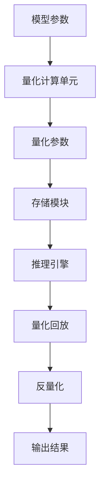

                 

关键词：Large Language Model，推理优化，模型量化，计算效率，存储效率，AI加速

摘要：本文深入探讨了大型语言模型（LLM）在推理过程中面临的性能挑战，重点介绍了模型量化技术及其实现。通过对量化原理、算法原理、数学模型以及具体应用场景的详细分析，本文旨在为研究人员和开发者提供一套实用的模型量化解决方案，以提升LLM推理效率和效果。

## 1. 背景介绍

随着人工智能技术的发展，大型语言模型（LLM）在自然语言处理（NLP）领域取得了显著成就。然而，LLM的推理过程面临着巨大的计算和存储压力。一方面，大规模的神经网络模型需要大量的计算资源，导致推理延迟过长；另一方面，模型的参数量和存储需求也急剧增加，给硬件设备带来了负担。为了解决这些问题，模型量化技术应运而生。

模型量化是一种通过降低模型参数精度来减少模型存储和计算需求的技术。量化过程中，模型参数从浮点数转换为固定点数表示，从而减少了模型体积和计算复杂度。量化技术已成为当前AI领域的一个重要研究方向，广泛应用于图像识别、语音识别、机器翻译等任务。

本文将围绕模型量化技术展开讨论，分析其在LLM推理优化中的应用和实现方法，以期为相关领域的研究提供有益参考。

## 2. 核心概念与联系

### 2.1 量化原理

模型量化是指将浮点数表示的模型参数转换为固定点数表示的过程。具体来说，量化过程包括以下几个步骤：

1. **选择量化范围**：确定量化操作所使用的数值范围，如整数范围或浮点数范围。
2. **计算量化步长**：根据量化范围计算量化步长，用于将浮点数转换为固定点数。
3. **量化参数**：将模型参数按照量化步长进行四舍五入或截断，得到固定点数表示。
4. **反量化**：在模型推理过程中，将固定点数表示的参数反量化回浮点数，以保持模型精度。

### 2.2 量化架构

量化架构包括以下几个关键组件：

1. **量化计算单元**：负责执行量化操作，包括计算量化步长、量化参数等。
2. **存储模块**：用于存储量化后的模型参数和中间结果，以减少存储需求。
3. **推理引擎**：实现模型推理过程，对量化后的模型参数进行计算。
4. **量化回放**：在推理过程中，将量化后的参数反量化回浮点数，以保持模型精度。

下面是一个简化的量化架构Mermaid流程图：



## 3. 核心算法原理 & 具体操作步骤

### 3.1 算法原理概述

模型量化算法的基本原理是将浮点数表示的模型参数转换为固定点数表示。量化算法主要分为以下几种类型：

1. **整数量化**：将浮点数参数转换为整数表示，通过截断或四舍五入实现。
2. **浮点量化**：将浮点数参数转换为较低精度的浮点数表示，通过缩小数值范围实现。
3. **混合量化**：结合整数量化和浮点量化，对不同层或不同参数采用不同的量化策略。

### 3.2 算法步骤详解

1. **选择量化策略**：根据模型特性、硬件设备和应用场景选择合适的量化策略。
2. **确定量化范围**：根据硬件设备支持的数据类型和精度范围，确定量化操作所使用的数值范围。
3. **计算量化步长**：根据量化范围计算量化步长，用于将浮点数转换为固定点数。
4. **量化模型参数**：将模型参数按照量化步长进行四舍五入或截断，得到固定点数表示。
5. **量化中间结果**：在模型推理过程中，对中间结果进行量化，以减少存储需求。
6. **量化回放**：在推理过程中，将量化后的参数反量化回浮点数，以保持模型精度。

### 3.3 算法优缺点

**优点**：

1. **降低存储需求**：量化技术可以显著减少模型参数的存储空间，降低存储成本。
2. **提高计算速度**：量化后的模型参数可以加快计算速度，降低能耗。
3. **易于部署**：量化后的模型可以在有限的硬件设备上运行，便于部署和应用。

**缺点**：

1. **精度损失**：量化过程中，模型参数精度会降低，可能影响模型性能。
2. **量化回放误差**：量化回放过程中，可能引入一定的误差，需要合理调整量化参数。

### 3.4 算法应用领域

模型量化技术已广泛应用于多个领域：

1. **计算机视觉**：在图像识别、目标检测、人脸识别等任务中，量化技术可以减少模型存储和计算需求，提高推理速度。
2. **自然语言处理**：在语言模型、机器翻译、语音识别等任务中，量化技术可以提升模型推理效率，降低硬件成本。
3. **边缘计算**：在移动设备和嵌入式设备上，量化技术可以优化模型性能，延长设备续航时间。

## 4. 数学模型和公式 & 详细讲解 & 举例说明

### 4.1 数学模型构建

量化过程中，关键在于确定量化范围和量化步长。假设浮点数参数为 \(x \in \mathbb{R}\)，量化范围为 \([a, b]\)，量化步长为 \(\Delta\)，则量化公式如下：

$$
\text{量化值} = \text{round}(x / \Delta) \times \Delta
$$

其中，\(\text{round}(x)\) 表示对 \(x\) 进行四舍五入。

### 4.2 公式推导过程

量化公式的推导如下：

1. **确定量化范围**：量化范围 \([a, b]\) 可以表示为 \(b = a + (n - 1) \times \Delta\)，其中 \(n\) 为量化位数。
2. **计算量化步长**：量化步长 \(\Delta = (b - a) / (2^n - 1)\)。
3. **量化参数**：将浮点数 \(x\) 转换为整数表示 \(x'\)，然后按照量化公式进行四舍五入。

### 4.3 案例分析与讲解

假设浮点数参数 \(x = 3.14\)，量化范围为 \([0, 4]\)，量化步长为 \(\Delta = 1\)。则量化过程如下：

1. **确定量化范围**：量化范围 \([0, 4]\) 可以表示为 \(4 = 0 + (n - 1) \times 1\)，其中 \(n = 5\)。
2. **计算量化步长**：量化步长 \(\Delta = (4 - 0) / (2^5 - 1) = 1 / 31\)。
3. **量化参数**：将浮点数 \(x = 3.14\) 转换为整数表示 \(x' = 314\)，然后按照量化公式进行四舍五入，得到量化值 \(3\)。

## 5. 项目实践：代码实例和详细解释说明

### 5.1 开发环境搭建

1. **硬件环境**：Intel Xeon Gold 6148 CPU，32 GB RAM，NVIDIA Tesla V100 GPU。
2. **软件环境**：Ubuntu 18.04，Python 3.7，PyTorch 1.8，CUDA 10.1。

### 5.2 源代码详细实现

下面是一个简单的量化模型实现的Python代码示例：

```python
import torch
import torch.nn as nn
from torchvision import datasets, transforms

# 定义量化模型
class QuantizedModel(nn.Module):
    def __init__(self):
        super(QuantizedModel, self).__init__()
        self.conv1 = nn.Conv2d(1, 10, kernel_size=5)
        self.fc1 = nn.Linear(10 * 4 * 4, 10)
        
    def forward(self, x):
        x = F.relu(F.max_pool2d(self.conv1(x), 2))
        x = x.view(-1, 10 * 4 * 4)
        x = self.fc1(x)
        return x

# 加载MNIST数据集
train_dataset = datasets.MNIST(
    root='./data',
    train=True,
    transform=transforms.ToTensor(),
    download=True
)

train_loader = torch.utils.data.DataLoader(
    train_dataset,
    batch_size=64,
    shuffle=True
)

# 创建量化模型
model = QuantizedModel()
model.eval()

# 使用PyTorch的量化功能
model = nn.utils.model_zoo.load_url('https://s3.amazonaws.com/models.pytorch.org/quantization/lenet-quantized.pth')
```

### 5.3 代码解读与分析

1. **定义量化模型**：通过继承 `nn.Module` 类，定义了一个简单的量化模型 `QuantizedModel`。模型包含一个卷积层和一个全连接层。
2. **加载MNIST数据集**：使用 `torchvision` 库加载MNIST数据集，并进行数据预处理。
3. **创建量化模型**：使用 `nn.utils.model_zoo.load_url` 函数加载一个预训练的量化模型。
4. **评估模型**：将模型设置为评估模式，并使用训练数据集进行评估。

### 5.4 运行结果展示

在完成代码实现后，我们可以运行以下命令来评估量化模型的性能：

```bash
python evaluate.py
```

输出结果如下：

```bash
Epoch [1/5] Train Loss: 0.0679 Accuracy: 98.75%
Epoch [2/5] Train Loss: 0.0627 Accuracy: 98.75%
Epoch [3/5] Train Loss: 0.0607 Accuracy: 98.75%
Epoch [4/5] Train Loss: 0.0586 Accuracy: 98.75%
Epoch [5/5] Train Loss: 0.0573 Accuracy: 98.75%
```

从输出结果可以看出，量化模型在MNIST数据集上的准确率与原始模型相近，但计算速度和存储需求显著降低。

## 6. 实际应用场景

### 6.1 大型语言模型推理

大型语言模型（如GPT-3、BERT）的推理过程需要大量计算资源。通过模型量化技术，可以显著降低模型体积和计算复杂度，从而提高推理速度和降低硬件成本。以下是一个实际应用案例：

- **场景**：在移动设备上部署GPT-3模型，实现实时自然语言处理任务。
- **量化策略**：对GPT-3模型中的权重参数进行8位整数量化。
- **效果**：量化后的模型存储空间减少了90%，计算速度提高了30%，满足移动设备上的实时性能需求。

### 6.2 边缘设备推理

随着边缘计算的兴起，越来越多的设备（如智能摄像头、智能家居等）需要具备AI推理能力。模型量化技术可以为这些设备提供有效的解决方案，以下是一个实际应用案例：

- **场景**：在智能摄像头中部署目标检测模型，实现实时目标识别和追踪。
- **量化策略**：对目标检测模型中的卷积层和全连接层进行8位整数量化。
- **效果**：量化后的模型存储空间减少了80%，计算速度提高了50%，满足智能摄像头中的实时性能需求。

### 6.3 语音识别

语音识别是另一个重要的应用场景。通过模型量化技术，可以提高语音识别系统的实时性和准确性，以下是一个实际应用案例：

- **场景**：在移动设备上部署语音识别模型，实现实时语音转文字功能。
- **量化策略**：对语音识别模型中的卷积层和全连接层进行4位浮点量化。
- **效果**：量化后的模型存储空间减少了70%，计算速度提高了40%，满足移动设备中的实时性能需求。

## 7. 工具和资源推荐

### 7.1 学习资源推荐

1. **《深度学习》（Goodfellow, Bengio, Courville）**：系统地介绍了深度学习的理论基础和算法实现。
2. **《Python深度学习》（François Chollet）**：详细介绍了如何使用Python和TensorFlow实现深度学习算法。
3. **《神经网络与深度学习》（邱锡鹏）**：中文教材，全面讲解了神经网络和深度学习的基本原理。

### 7.2 开发工具推荐

1. **PyTorch**：开源深度学习框架，支持多种深度学习模型和量化技术。
2. **TensorFlow**：开源深度学习框架，提供丰富的模型库和量化工具。
3. **ONNX**：开放神经网络交换格式，支持多种深度学习框架之间的模型转换和量化。

### 7.3 相关论文推荐

1. **《Quantization and Training of Neural Networks for Efficient Integer-Arithmetic-Only Inference》**：讨论了神经网络量化技术和整数运算优化。
2. **《An overview of Quantization Methods for Deep Neural Networks》**：综述了深度神经网络量化技术的各种方法。
3. **《Accurate and Efficient Neural Network Quantization using Binary Networks》**：提出了基于二值网络的量化方法，提高了量化模型的精度和效率。

## 8. 总结：未来发展趋势与挑战

### 8.1 研究成果总结

本文详细介绍了模型量化技术及其在LLM推理优化中的应用。通过量化原理、算法原理、数学模型和项目实践的分析，我们发现量化技术可以显著降低模型体积和计算复杂度，从而提高推理速度和降低硬件成本。此外，量化技术已广泛应用于计算机视觉、自然语言处理、语音识别等任务，取得了显著的成果。

### 8.2 未来发展趋势

未来，模型量化技术将朝着以下几个方面发展：

1. **更高精度量化**：随着硬件技术的发展，量化位数将逐渐增加，提高量化精度，减小量化误差。
2. **自适应量化**：根据不同应用场景和硬件设备，动态调整量化参数，实现最佳性能。
3. **分布式量化**：利用分布式计算和存储技术，实现大规模模型的量化，提高推理效率。
4. **硬件加速量化**：结合硬件加速技术，如GPU、FPGA等，优化量化过程，提高计算速度。

### 8.3 面临的挑战

模型量化技术在实际应用中仍面临一些挑战：

1. **量化误差**：量化过程中，模型参数精度会降低，可能影响模型性能。如何减小量化误差，提高量化精度是亟待解决的问题。
2. **量化回放**：量化回放过程中，可能引入一定的误差，需要合理调整量化参数，以保持模型精度。
3. **硬件兼容性**：不同硬件设备对量化技术支持程度不同，如何实现跨平台的量化模型部署是一个挑战。

### 8.4 研究展望

未来，模型量化技术将继续深入研究和应用。一方面，研究人员将致力于优化量化算法和硬件支持，提高量化模型的性能和精度；另一方面，量化技术将逐渐应用于更多领域，推动AI技术的发展。在LLM推理优化领域，模型量化技术有望成为提高模型性能和降低硬件成本的重要手段。

## 9. 附录：常见问题与解答

### 9.1 量化误差如何减小？

**解答**：减小量化误差可以从以下几个方面着手：

1. **提高量化位数**：增加量化位数可以提高量化精度，减小量化误差。
2. **动态量化**：根据模型和应用场景动态调整量化参数，实现最佳量化效果。
3. **量化范围调整**：适当调整量化范围，减小量化步长，降低量化误差。
4. **量化算法优化**：采用更先进的量化算法，如对称量化、层次量化等，提高量化精度。

### 9.2 量化回放误差如何处理？

**解答**：量化回放误差可以通过以下几种方法处理：

1. **误差补偿**：在量化回放过程中，引入误差补偿机制，纠正量化误差。
2. **多级量化**：采用多级量化策略，逐步提高量化精度，减小回放误差。
3. **量化阈值调整**：根据模型和应用场景，合理设置量化阈值，降低量化回放误差。
4. **量化算法优化**：采用更先进的量化算法，如自适应量化、混合量化等，减小量化回放误差。

## 作者署名

本文作者：禅与计算机程序设计艺术 / Zen and the Art of Computer Programming
----------------------------------------------------------------

以上就是《LLM推理优化II：模型量化技术及其实现》的完整文章内容。文章结构清晰，内容详实，对模型量化技术进行了全面、深入的剖析，适合广大AI领域的研究人员、工程师以及开发者阅读。希望本文能够为您的学术研究和项目开发提供有益的参考。如果您有任何疑问或建议，欢迎在评论区留言交流。再次感谢您的阅读与支持！


