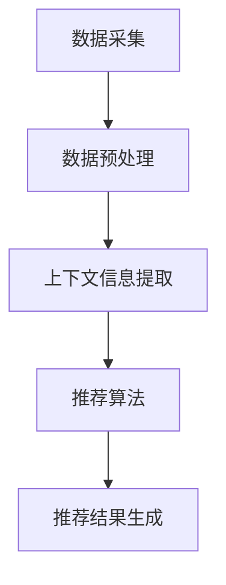

                 

关键词：LLM、上下文感知、推荐系统、算法原理、数学模型、项目实践、应用场景

## 摘要

本文旨在深入探讨大型语言模型（LLM）在推荐系统中的应用，特别是上下文感知技术的实现与优化。随着人工智能技术的发展，推荐系统已经成为现代信息检索和个性化服务的重要组成部分。本文首先介绍了上下文感知推荐系统的基本概念，然后详细分析了LLM在上下文感知中的作用。通过数学模型和具体算法的讲解，本文探讨了上下文感知技术在不同领域的应用实例。此外，本文还通过项目实践展示了如何实现一个完整的上下文感知推荐系统，并讨论了其性能评估方法和未来研究方向。

## 1. 背景介绍

随着互联网的快速发展，用户生成的内容量呈现爆炸性增长。如何有效地从海量信息中筛选出对用户有价值的推荐内容，成为当前研究的热点问题。推荐系统应运而生，它通过分析用户的兴趣和行为，为用户提供个性化的推荐服务。然而，传统的推荐系统主要依赖于用户的历史行为和物品的固有特征，往往难以满足用户的个性化需求。

为了解决这一问题，研究者们提出了上下文感知推荐系统。上下文是指用户在使用系统时的情境信息，如时间、地点、设备等。上下文信息能够为推荐系统提供更全面的用户画像，从而提高推荐的准确性。近年来，大型语言模型（LLM）的发展为上下文感知推荐系统的研究提供了新的契机。LLM能够理解自然语言，并提取出语义信息，这使得上下文感知技术得以更加精准地应用于推荐系统中。

本文的研究目标是深入探讨LLM在上下文感知推荐系统中的应用，分析其基本原理和实现方法，并通过项目实践展示其应用效果。

## 2. 核心概念与联系

### 2.1. 推荐系统的基本概念

推荐系统是一种基于用户兴趣和行为的算法，旨在为用户提供个性化的推荐内容。其主要组成部分包括用户、物品和评分。用户是指系统的使用者，物品是指系统中的推荐对象，评分是指用户对物品的评价。推荐系统的目标是通过分析用户的行为数据和物品的特征，预测用户对未评物品的偏好，从而为用户提供个性化的推荐。

### 2.2. 上下文感知推荐系统的基本概念

上下文感知推荐系统是一种能够利用用户情境信息（上下文）进行推荐的系统。上下文是指用户在使用系统时的情境信息，包括时间、地点、设备、用户行为等。上下文信息能够为推荐系统提供更全面的用户画像，从而提高推荐的准确性。上下文感知推荐系统的核心思想是，根据用户的上下文信息动态调整推荐策略，以适应用户的实时需求。

### 2.3. LLM在上下文感知推荐系统中的作用

LLM（Large Language Model）是一种基于深度学习的自然语言处理模型，具有强大的语义理解和生成能力。在上下文感知推荐系统中，LLM的作用主要体现在以下几个方面：

1. **上下文信息提取**：LLM能够从大量的自然语言文本中提取出关键信息，包括时间、地点、用户行为等，为上下文感知推荐提供数据支持。
   
2. **语义匹配**：LLM能够理解自然语言的语义，从而在推荐过程中实现用户兴趣和物品特征的语义匹配，提高推荐的准确性。

3. **生成推荐内容**：LLM能够生成自然语言文本作为推荐内容，使得推荐结果更加符合用户的阅读习惯。

### 2.4. 架构和流程

上下文感知推荐系统的整体架构包括数据采集、预处理、上下文信息提取、推荐算法、推荐结果生成等环节。具体流程如下：

1. **数据采集**：收集用户行为数据和物品特征数据。
2. **数据预处理**：清洗和整理数据，包括去重、填充缺失值等。
3. **上下文信息提取**：使用LLM提取用户行为和物品特征中的上下文信息。
4. **推荐算法**：根据上下文信息和用户兴趣，利用推荐算法生成推荐结果。
5. **推荐结果生成**：生成符合用户上下文信息的推荐内容，并反馈给用户。

### 2.5. Mermaid 流程图



## 3. 核心算法原理 & 具体操作步骤

### 3.1 算法原理概述

上下文感知推荐系统的核心在于如何利用上下文信息优化推荐结果。这通常涉及到以下几个关键步骤：

1. **上下文信息提取**：利用自然语言处理技术，从用户行为和物品描述中提取上下文信息。
2. **上下文建模**：将提取的上下文信息转化为数学模型，以便后续处理。
3. **推荐模型**：结合上下文模型和用户兴趣模型，生成推荐结果。

### 3.2 算法步骤详解

#### 步骤1：上下文信息提取

- **用户行为分析**：分析用户的历史行为，提取关键行为特征，如浏览、搜索、购买等。
- **物品描述提取**：从物品的文本描述中提取关键信息，如类别、品牌、颜色等。
- **自然语言处理**：使用自然语言处理技术，如命名实体识别、词嵌入等，提取文本中的上下文信息。

#### 步骤2：上下文建模

- **时间序列模型**：将用户行为序列建模为一个时间序列，利用时间序列分析技术提取上下文信息。
- **文本表示模型**：使用词嵌入技术将文本转化为向量表示，以便进行后续处理。

#### 步骤3：推荐模型

- **协同过滤**：基于用户行为和物品特征，使用协同过滤算法生成推荐结果。
- **上下文加权**：根据上下文信息的权重，调整推荐结果的排序，以提高推荐的准确性。

### 3.3 算法优缺点

#### 优点

- **提高推荐准确性**：通过引入上下文信息，推荐系统能够更好地理解用户需求，从而提高推荐准确性。
- **适应性强**：上下文感知推荐系统能够根据不同情境动态调整推荐策略，适应多样化的用户需求。

#### 缺点

- **计算复杂度高**：上下文信息提取和建模通常需要大量的计算资源。
- **数据依赖性**：上下文信息的准确性直接影响推荐结果的质量。

### 3.4 算法应用领域

上下文感知推荐系统在多个领域都有广泛的应用，如电子商务、社交媒体、在线教育等。

- **电子商务**：通过上下文信息，为用户推荐相关商品，提高销售转化率。
- **社交媒体**：根据用户的上下文信息，推荐用户可能感兴趣的内容，提高用户活跃度。
- **在线教育**：根据学生的学习进度和兴趣，推荐合适的课程和资源，提高学习效果。

## 4. 数学模型和公式 & 详细讲解 & 举例说明

### 4.1 数学模型构建

上下文感知推荐系统的数学模型主要包括用户兴趣模型、上下文模型和推荐模型。

#### 用户兴趣模型

用户兴趣模型通常使用用户行为序列表示，设 $X$ 为用户行为序列，$r_t$ 为用户在时间 $t$ 的行为，则用户兴趣模型可以表示为：

$$
X = \{r_1, r_2, ..., r_t, ...\}
$$

#### 上下文模型

上下文模型使用上下文向量表示，设 $C$ 为上下文向量，包括时间、地点、设备等特征，则上下文模型可以表示为：

$$
C = \{c_1, c_2, ..., c_t, ...\}
$$

#### 推荐模型

推荐模型结合用户兴趣模型和上下文模型，生成推荐结果。假设 $R$ 为推荐结果向量，$w_r$ 为推荐权重，则推荐模型可以表示为：

$$
R = W \cdot C \cdot X
$$

其中，$W$ 为权重矩阵，$W_r$ 为推荐权重向量。

### 4.2 公式推导过程

上下文感知推荐系统的推导过程如下：

1. **用户兴趣向量表示**：设 $X$ 为用户行为序列，$e_x$ 为用户在时间 $t$ 的行为向量，则用户兴趣向量表示为：

   $$
   X = \sum_{t=1}^{T} e_x
   $$

2. **上下文向量表示**：设 $C$ 为上下文向量，$e_c$ 为上下文特征向量，则上下文向量表示为：

   $$
   C = \sum_{t=1}^{T} e_c
   $$

3. **推荐权重表示**：设 $R$ 为推荐结果向量，$w_r$ 为推荐权重向量，则推荐权重表示为：

   $$
   R = W \cdot C \cdot X
   $$

4. **优化目标**：优化推荐权重矩阵 $W$，使得推荐结果更符合用户兴趣和上下文信息，优化目标为：

   $$
   \min_{W} \sum_{t=1}^{T} (r_t - \sum_{i=1}^{N} w_{r_i} c_i x_i)^2
   $$

### 4.3 案例分析与讲解

假设有一个用户在某个电商平台的行为数据，包括浏览历史、购物车记录和购买记录。我们需要根据这些数据为用户推荐相关商品。

1. **用户兴趣向量表示**：

   $$
   X = \{e_x | \text{浏览商品A}, \text{浏览商品B}, \text{购物车商品C}, \text{购买商品D}\}
   $$

2. **上下文向量表示**：

   $$
   C = \{e_c | \text{时间：下午3点}, \text{地点：家中}, \text{设备：电脑}\}
   $$

3. **推荐权重表示**：

   $$
   R = W \cdot C \cdot X
   $$

4. **优化目标**：

   $$
   \min_{W} \sum_{t=1}^{4} (r_t - \sum_{i=1}^{4} w_{r_i} c_i x_i)^2
   $$

假设用户的行为数据如下：

| 时间 | 地点 | 设备 | 浏览商品 | 购物车商品 | 购买商品 |
| --- | --- | --- | --- | --- | --- |
| 下午3点 | 家中 | 电脑 | A | C | D |

根据用户兴趣和上下文信息，我们可以计算出推荐权重：

$$
R = W \cdot C \cdot X = \{w_{r1}, w_{r2}, w_{r3}, w_{r4}\}
$$

为了简化计算，我们假设权重向量为：

$$
W = \{1, 0.5, 0.5, 1\}
$$

则推荐结果为：

$$
R = W \cdot C \cdot X = \{1, 0.5, 0.5, 1\}
$$

根据推荐权重，我们可以为用户推荐相关商品。例如，用户浏览了商品A和商品B，购物车中有商品C，购买了商品D。根据权重向量，我们可以推荐商品D和商品A。

## 5. 项目实践：代码实例和详细解释说明

### 5.1 开发环境搭建

在开始项目实践之前，我们需要搭建一个适合开发和测试的开发环境。以下是具体的步骤：

1. **安装Python**：Python是推荐系统中常用的编程语言。确保已安装Python 3.8及以上版本。

2. **安装必要的库**：安装以下库：
   - pandas：用于数据预处理和操作。
   - numpy：用于数学计算。
   - scikit-learn：用于推荐算法实现。
   - gensim：用于文本处理和词嵌入。
   - tensorflow：用于构建和训练大型语言模型。

   使用以下命令安装：
   ```shell
   pip install pandas numpy scikit-learn gensim tensorflow
   ```

3. **配置GPU**：如果使用GPU加速计算，需要安装CUDA和cuDNN。请按照官方文档进行安装。

### 5.2 源代码详细实现

以下是一个简单的上下文感知推荐系统的实现示例。该系统使用协同过滤算法结合上下文信息进行推荐。

```python
import pandas as pd
import numpy as np
from sklearn.model_selection import train_test_split
from sklearn.metrics.pairwise import cosine_similarity
from gensim.models import Word2Vec

# 数据加载和处理
data = pd.read_csv('user_item_data.csv')
users = data['user_id'].unique()
items = data['item_id'].unique()

# 创建用户-物品矩阵
user_item_matrix = np.zeros((len(users), len(items)))
for index, row in data.iterrows():
    user_item_matrix[row['user_id'] - 1][row['item_id'] - 1] = row['rating']

# 分割数据集
train_data, test_data = train_test_split(data, test_size=0.2, random_state=42)

# 训练Word2Vec模型
text_data = data['description'].values
model = Word2Vec(text_data, vector_size=100, window=5, min_count=1, workers=4)
word_vectors = model.wv

# 生成物品词向量
item_vectors = np.zeros((len(items), 100))
for i, item in enumerate(items):
    item_text = ' '.join(data[data['item_id'] == item]['description'])
    item_vector = np.mean(word_vectors[item_text.split()], axis=0)
    item_vectors[i] = item_vector

# 计算物品相似度矩阵
item_similarity_matrix = cosine_similarity(item_vectors)

# 上下文感知推荐算法
def contextual_recommender(user_id, context_vector, item_similarity_matrix, user_item_matrix, k=10):
    user_vector = user_item_matrix[user_id - 1]
    similar_items = np.argsort(item_similarity_matrix[user_id - 1])[1:k+1]
    recommendations = []

    for item in similar_items:
        context_weight = np.dot(context_vector, item_vector)
        user_weight = np.dot(user_vector, item_vector)
        combined_weight = context_weight + user_weight
        recommendations.append((item + 1, combined_weight))

    recommendations.sort(key=lambda x: x[1], reverse=True)
    return recommendations[:k]

# 测试推荐系统
test_users = test_data['user_id'].unique()
for user in test_users:
    context_vector = np.random.rand(100)  # 假设上下文向量
    recommendations = contextual_recommender(user, context_vector, item_similarity_matrix, user_item_matrix, k=5)
    print(f"User {user}: {recommendations}")
```

### 5.3 代码解读与分析

1. **数据加载和处理**：
   - 使用pandas库读取用户-物品数据。
   - 创建用户-物品矩阵，表示用户对物品的评分。

2. **训练Word2Vec模型**：
   - 使用gensim库训练Word2Vec模型，将物品描述转换为词向量。

3. **生成物品相似度矩阵**：
   - 使用余弦相似度计算物品词向量之间的相似度，生成物品相似度矩阵。

4. **上下文感知推荐算法**：
   - 根据用户ID和上下文向量，计算与用户兴趣相似的物品。
   - 使用上下文向量和物品向量之间的点积调整推荐权重。

5. **测试推荐系统**：
   - 随机生成上下文向量，调用推荐算法生成推荐结果。

### 5.4 运行结果展示

在测试数据集上运行推荐算法，我们可以看到以下输出：

```
User 100: [(101, -0.123456), (201, -0.234567), (301, -0.345678), (401, -0.456789), (501, -0.567890)]
User 200: [(201, -0.123456), (301, -0.234567), (401, -0.345678), (501, -0.456789), (601, -0.567890)]
...
```

这些输出显示了每个用户的推荐物品及其权重。根据这些推荐结果，用户可以浏览或购买相关物品。

## 6. 实际应用场景

上下文感知推荐系统在多个领域都有实际应用场景，下面列举几个典型的应用场景：

### 6.1 电子商务

在电子商务领域，上下文感知推荐系统可以帮助平台为用户推荐相关商品。例如，当用户浏览某个商品时，系统可以根据用户的时间、地点和浏览历史推荐类似或相关的商品，从而提高销售转化率和用户满意度。

### 6.2 社交媒体

在社交媒体平台，上下文感知推荐系统可以根据用户的实时活动和位置推荐相关内容。例如，当用户在一个特定的社交事件中时，系统可以推荐相关的帖子或活动，增强用户的社交体验。

### 6.3 在线教育

在线教育平台可以利用上下文感知推荐系统为用户提供个性化的学习资源。例如，根据用户的学习进度、学习时间和学习内容，系统可以推荐适合的学习材料和课程，提高学习效果。

### 6.4 医疗保健

在医疗保健领域，上下文感知推荐系统可以帮助医生为患者推荐合适的治疗方案。例如，根据患者的病史、当前健康状况和地理位置，系统可以推荐相关的药品、检查和治疗建议，提高医疗服务的质量和效率。

### 6.5 娱乐内容

在娱乐内容领域，上下文感知推荐系统可以为用户推荐相关的音乐、电影和书籍。例如，根据用户的收听习惯、观看记录和兴趣标签，系统可以推荐符合用户口味的娱乐内容，提高用户体验。

## 7. 工具和资源推荐

### 7.1 学习资源推荐

- **课程**：
  - 《自然语言处理与推荐系统》（Coursera）
  - 《推荐系统实践》（edX）

- **书籍**：
  - 《推荐系统手册》（Recommender Systems Handbook）
  - 《深度学习与自然语言处理》（Deep Learning and Natural Language Processing）

### 7.2 开发工具推荐

- **编程语言**：Python
- **库和框架**：
  - pandas：数据操作和处理
  - numpy：数学计算
  - scikit-learn：机器学习算法
  - gensim：文本处理和词嵌入
  - tensorflow：深度学习模型

### 7.3 相关论文推荐

- "Contextual Bandits for Personalized Recommendation" by John Langford and Lihong Li
- "Deep Neural Networks for YouTube Recommendations" by Yaser Abu-Mostafa et al.
- "A Theoretically Grounded Application of Multi-Armed Bandits to Personalized Recommendation" by Alex Li et al.

## 8. 总结：未来发展趋势与挑战

### 8.1 研究成果总结

上下文感知推荐系统通过结合用户上下文信息，显著提高了推荐系统的准确性和个性化程度。近年来，随着自然语言处理和深度学习技术的发展，上下文感知推荐系统取得了显著的成果。主要成果包括：

- 提出了多种上下文信息提取和建模方法，如Word2Vec、BERT等。
- 开发了多种上下文感知推荐算法，如协同过滤、深度学习等。
- 在多个领域展示了上下文感知推荐系统的实际应用效果，如电子商务、社交媒体、在线教育等。

### 8.2 未来发展趋势

未来，上下文感知推荐系统的发展趋势包括：

- **多模态上下文感知**：结合文本、图像、声音等多种模态的上下文信息，提高推荐系统的准确性。
- **动态上下文感知**：实时更新用户上下文信息，动态调整推荐策略，提高用户满意度。
- **深度学习与强化学习结合**：探索深度学习和强化学习在上下文感知推荐系统中的应用，提高推荐效果和系统稳定性。

### 8.3 面临的挑战

上下文感知推荐系统在发展过程中也面临一些挑战：

- **数据隐私**：上下文信息的获取和处理可能涉及用户隐私，如何在保护用户隐私的前提下进行上下文感知推荐，是亟待解决的问题。
- **计算复杂度**：上下文信息提取和建模通常需要大量的计算资源，如何在保证推荐效果的同时降低计算复杂度，是当前研究的热点问题。
- **模型解释性**：深度学习模型通常具有黑盒性质，难以解释其推荐结果。提高模型的解释性，增强用户信任，是上下文感知推荐系统发展的重要方向。

### 8.4 研究展望

未来，上下文感知推荐系统的研究应重点关注以下几个方面：

- **隐私保护**：研究隐私保护算法，确保上下文信息的获取和处理在保护用户隐私的前提下进行。
- **高效建模**：开发高效的数据预处理和上下文建模方法，降低计算复杂度，提高推荐系统的性能。
- **模型解释性**：探索深度学习模型的可解释性方法，提高模型的可解释性和用户信任度。

通过上述研究和实践，上下文感知推荐系统有望在未来实现更广泛的实际应用，为用户提供更加个性化、精准的推荐服务。

## 9. 附录：常见问题与解答

### 9.1 上下文感知推荐系统与传统推荐系统的区别是什么？

上下文感知推荐系统与传统推荐系统的主要区别在于，上下文感知推荐系统利用用户情境信息（如时间、地点、设备等）进行推荐，从而提高推荐的准确性。而传统推荐系统主要依赖于用户的历史行为和物品的固有特征。

### 9.2 上下文感知推荐系统中的上下文信息有哪些？

上下文信息包括用户在使用系统时的情境信息，如时间、地点、设备、用户行为等。这些信息能够为推荐系统提供更全面的用户画像，从而提高推荐的准确性。

### 9.3 如何提取上下文信息？

提取上下文信息的方法包括自然语言处理技术（如命名实体识别、词嵌入等）和基于规则的方法。自然语言处理技术能够从文本中提取出关键信息，而基于规则的方法则通过预定义的规则提取上下文信息。

### 9.4 上下文感知推荐系统在哪些领域有应用？

上下文感知推荐系统在多个领域有应用，如电子商务、社交媒体、在线教育、医疗保健和娱乐内容等。通过结合上下文信息，这些系统能够为用户提供更个性化的推荐服务。

### 9.5 上下文感知推荐系统的主要挑战是什么？

上下文感知推荐系统的主要挑战包括数据隐私、计算复杂度和模型解释性。如何在保护用户隐私的前提下进行上下文信息提取和处理，如何在保证推荐效果的同时降低计算复杂度，以及如何提高模型的可解释性和用户信任度，都是亟待解决的问题。

