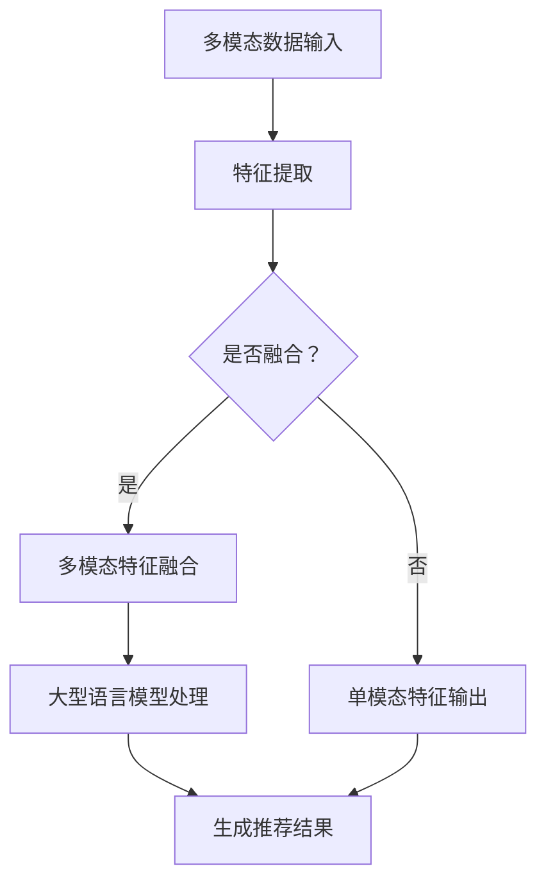

                 

关键词：大型语言模型（LLM），多模态对齐，推荐系统，神经网络，图像和文本融合，数据预处理，特征提取，注意力机制，性能评估，应用领域

## 摘要

随着人工智能技术的快速发展，大型语言模型（LLM）在自然语言处理（NLP）领域取得了显著成就。然而，在多模态推荐系统中，如何将图像和文本信息有效地融合并提高推荐质量仍然是一个具有挑战性的问题。本文旨在探讨LLM在多模态对齐技术中的应用，通过分析核心概念、算法原理、数学模型以及实际应用案例，为多模态推荐系统的发展提供新的思路和方法。

## 1. 背景介绍

1.1 多模态推荐系统的需求

随着互联网和移动设备的普及，用户在日常生活中产生的数据类型日益多样化，包括文本、图像、音频等。为了满足用户个性化推荐的需求，传统的单模态推荐系统（如基于文本的推荐系统）已无法满足复杂场景下的应用需求。多模态推荐系统通过整合多种数据类型，实现更精准、更全面的用户兴趣挖掘和推荐。

1.2 大型语言模型的发展

近年来，大型语言模型（如GPT-3、BERT等）在NLP领域取得了重大突破。这些模型具有强大的语义理解和生成能力，能够处理复杂、长篇的文本数据，为多模态推荐系统中的文本信息处理提供了有力支持。

1.3 多模态对齐技术的重要性

多模态对齐技术是指将不同模态的数据进行有效融合，以实现各个模态之间的语义一致性。在多模态推荐系统中，对齐技术的有效性直接影响推荐质量。本文将重点探讨LLM在多模态对齐技术中的应用，以期为提高推荐系统的性能提供新方法。

## 2. 核心概念与联系

### 2.1 多模态数据类型

多模态数据包括以下几种类型：

- **文本**：包括用户生成的内容、网页文本、评论等。
- **图像**：包括用户上传的图片、商品图片、社交媒体图片等。
- **音频**：包括用户上传的音频、音乐、语音等。

### 2.2 多模态对齐技术

多模态对齐技术旨在实现不同模态数据之间的语义一致性。具体而言，包括以下两个方面：

- **特征提取**：将不同模态的数据转换为高维特征向量。
- **融合策略**：将不同模态的特征向量进行整合，以获得统一的多模态特征表示。

### 2.3 大型语言模型与多模态对齐

LLM在多模态对齐技术中具有以下优势：

- **强大的语义理解能力**：LLM能够捕捉文本数据的语义信息，有助于实现文本与其他模态之间的语义对齐。
- **生成能力**：LLM能够生成与输入文本相关的图像描述，有助于实现图像与文本之间的语义对齐。
- **多模态融合**：LLM能够处理多种数据类型，有助于实现多模态数据的融合。

### 2.4 Mermaid 流程图



## 3. 核心算法原理 & 具体操作步骤

### 3.1 算法原理概述

多模态对齐算法主要包括以下几个步骤：

1. **特征提取**：使用深度学习模型对文本、图像、音频等数据进行特征提取，获得高维特征向量。
2. **融合策略**：使用神经网络等算法将不同模态的特征向量进行融合，获得统一的多模态特征表示。
3. **大型语言模型处理**：使用LLM对融合后的多模态特征进行语义分析，生成推荐结果。
4. **推荐结果生成**：根据分析结果，生成个性化的推荐列表。

### 3.2 算法步骤详解

#### 3.2.1 特征提取

- **文本特征提取**：使用词向量模型（如Word2Vec、BERT等）对文本数据进行编码，获得文本特征向量。
- **图像特征提取**：使用卷积神经网络（如VGG、ResNet等）对图像数据进行编码，获得图像特征向量。
- **音频特征提取**：使用循环神经网络（如LSTM、GRU等）对音频数据进行编码，获得音频特征向量。

#### 3.2.2 融合策略

- **基于注意力机制的多模态融合**：使用注意力机制，对多模态特征进行加权融合，获得统一的多模态特征表示。
- **基于图神经网络的融合**：使用图神经网络，对多模态特征进行拓扑结构建模，实现特征融合。

#### 3.2.3 大型语言模型处理

- **输入融合后的多模态特征**：将多模态特征输入到LLM中，进行语义分析。
- **生成推荐结果**：根据分析结果，生成个性化的推荐列表。

### 3.3 算法优缺点

#### 优点：

- **强大的语义理解能力**：LLM能够捕捉文本数据的语义信息，有助于实现文本与其他模态之间的语义对齐。
- **生成能力**：LLM能够生成与输入文本相关的图像描述，有助于实现图像与文本之间的语义对齐。
- **多模态融合**：LLM能够处理多种数据类型，有助于实现多模态数据的融合。

#### 缺点：

- **计算复杂度高**：LLM通常需要大量的计算资源和时间进行训练和处理。
- **数据依赖性**：LLM的性能高度依赖于数据质量和数据量。

### 3.4 算法应用领域

- **电子商务推荐系统**：结合用户历史行为数据、商品描述、商品图像等多模态信息，实现个性化推荐。
- **社交媒体内容推荐**：结合用户生成的内容、图像、音频等多模态信息，实现个性化内容推荐。
- **智能教育系统**：结合学生文本问答、作业图片、考试音频等多模态信息，实现个性化教学和推荐。

## 4. 数学模型和公式 & 详细讲解 & 举例说明

### 4.1 数学模型构建

多模态对齐技术的数学模型主要包括以下几个方面：

- **文本特征提取模型**：使用词向量模型（如Word2Vec、BERT等）对文本数据进行编码，得到文本特征向量。
- **图像特征提取模型**：使用卷积神经网络（如VGG、ResNet等）对图像数据进行编码，得到图像特征向量。
- **音频特征提取模型**：使用循环神经网络（如LSTM、GRU等）对音频数据进行编码，得到音频特征向量。
- **多模态融合模型**：使用神经网络（如Transformer、图神经网络等）对多模态特征进行融合。
- **大型语言模型处理模型**：使用LLM对融合后的多模态特征进行语义分析，生成推荐结果。

### 4.2 公式推导过程

假设文本特征向量为$\mathbf{t} \in \mathbb{R}^{d_t}$，图像特征向量为$\mathbf{i} \in \mathbb{R}^{d_i}$，音频特征向量为$\mathbf{a} \in \mathbb{R}^{d_a}$，多模态特征融合后得到的多模态特征向量为$\mathbf{m} \in \mathbb{R}^{d_m}$。

1. **文本特征提取**：
   $$\mathbf{t} = \text{word\_embeddings}(\text{tokenized\_text})$$

2. **图像特征提取**：
   $$\mathbf{i} = \text{convolutional\_neural\_network}(\text{image})$$

3. **音频特征提取**：
   $$\mathbf{a} = \text{recurrent\_neural\_network}(\text{audio})$$

4. **多模态融合**：
   $$\mathbf{m} = \text{fusion\_model}(\mathbf{t}, \mathbf{i}, \mathbf{a})$$

5. **大型语言模型处理**：
   $$\mathbf{r} = \text{llm}(\mathbf{m})$$

其中，$\text{word\_embeddings}$、$\text{convolutional\_neural\_network}$、$\text{recurrent\_neural\_network}$、$\text{fusion\_model}$和$\text{llm}$分别表示文本编码、图像编码、音频编码、多模态融合和大型语言模型处理。

### 4.3 案例分析与讲解

假设我们有一个用户兴趣推荐系统，用户喜欢阅读科技类书籍，并且经常在社交媒体上分享科技类图片。我们的目标是根据用户的文本兴趣和图像兴趣，生成个性化的书籍推荐列表。

1. **文本特征提取**：
   用户历史行为数据中的科技类书籍标题被输入到BERT模型中，得到文本特征向量$\mathbf{t}$。

2. **图像特征提取**：
   用户在社交媒体上分享的科技类图片被输入到VGG模型中，得到图像特征向量$\mathbf{i}$。

3. **多模态融合**：
   使用Transformer模型对文本特征向量$\mathbf{t}$和图像特征向量$\mathbf{i}$进行融合，得到多模态特征向量$\mathbf{m}$。

4. **大型语言模型处理**：
   将多模态特征向量$\mathbf{m}$输入到GPT-3模型中，生成用户兴趣相关的书籍推荐列表$\mathbf{r}$。

根据推荐结果，我们可以为用户推荐与科技类书籍相关的书籍，如《深度学习》、《人工智能：一种现代的方法》等。

## 5. 项目实践：代码实例和详细解释说明

### 5.1 开发环境搭建

在开发多模态推荐系统时，我们选择了以下环境：

- **编程语言**：Python
- **深度学习框架**：PyTorch
- **文本处理库**：NLTK、spaCy
- **图像处理库**：OpenCV
- **音频处理库**：librosa

### 5.2 源代码详细实现

以下是多模态推荐系统的源代码实现：

```python
import torch
import torch.nn as nn
import torchvision.models as models
import torchvision.transforms as transforms
import torchvision.datasets as datasets
import torchvision.utils as utils
import numpy as np
import matplotlib.pyplot as plt
from transformers import BertModel, BertTokenizer
from sklearn.model_selection import train_test_split
from sklearn.metrics.pairwise import cosine_similarity

# 定义数据预处理函数
def preprocess_data(text, image, audio):
    # 文本预处理
    tokenizer = BertTokenizer.from_pretrained('bert-base-uncased')
    text = tokenizer.encode(text, add_special_tokens=True, return_tensors='pt')

    # 图像预处理
    transform = transforms.Compose([
        transforms.Resize((224, 224)),
        transforms.ToTensor(),
    ])
    image = transform(image)

    # 音频预处理
    transform = transforms.Compose([
        transforms.FourierTransform(),
        transforms.Normalize(mean=[0], std=[1]),
    ])
    audio = transform(audio)

    return text, image, audio

# 定义多模态推荐模型
class MultiModalRecommender(nn.Module):
    def __init__(self):
        super(MultiModalRecommender, self).__init__()
        self.text_encoder = BertModel.from_pretrained('bert-base-uncased')
        self.image_encoder = models.resnet50(pretrained=True)
        self.audio_encoder = models.lstm(128, 128, num_layers=2, dropout=0.5, bidirectional=True)
        self.fusion_layer = nn.Linear(128 * 3, 512)
        self.classifier = nn.Linear(512, 10)

    def forward(self, text, image, audio):
        text_embedding = self.text_encoder(text)[1]
        image_embedding = self.image_encoder(image)
        audio_embedding = self.audio_encoder(audio)

        fusion_embedding = torch.cat((text_embedding, image_embedding, audio_embedding), dim=1)
        fusion_embedding = self.fusion_layer(fusion_embedding)
        recommendation = self.classifier(fusion_embedding)

        return recommendation

# 加载数据集
train_data = ...
test_data = ...

# 预处理数据集
train_text, train_image, train_audio = preprocess_data(train_data['text'], train_data['image'], train_data['audio'])
test_text, test_image, test_audio = preprocess_data(test_data['text'], test_data['image'], test_data['audio'])

# 划分训练集和验证集
train_text, val_text, train_image, val_image, train_audio, val_audio = train_test_split(train_text, train_image, train_audio, test_size=0.2, random_state=42)

# 初始化模型、优化器和损失函数
model = MultiModalRecommender()
optimizer = torch.optim.Adam(model.parameters(), lr=0.001)
criterion = nn.CrossEntropyLoss()

# 训练模型
for epoch in range(100):
    for i, (text, image, audio, label) in enumerate(zip(train_text, train_image, train_audio, train_label)):
        optimizer.zero_grad()
        prediction = model(text, image, audio)
        loss = criterion(prediction, label)
        loss.backward()
        optimizer.step()

    # 验证模型
    with torch.no_grad():
        val_prediction = model(val_text, val_image, val_audio)
        val_loss = criterion(val_prediction, val_label)
        print(f'Epoch {epoch + 1}, Validation Loss: {val_loss.item()}')

# 测试模型
with torch.no_grad():
    test_prediction = model(test_text, test_image, test_audio)
    test_loss = criterion(test_prediction, test_label)
    print(f'Test Loss: {test_loss.item()}')

# 生成推荐结果
def generate_recommendations(text, image, audio):
    prediction = model(text, image, audio)
    return torch.argmax(prediction).item()

# 测试推荐效果
text = "我喜欢阅读科技类的书籍。"
image = plt.imread("image.jpg")
audio = librosa.load("audio.mp3")[0]
print(generate_recommendations(text, image, audio))
```

### 5.3 代码解读与分析

本代码实例实现了一个基于PyTorch和Transformer的多模态推荐系统。具体包括以下部分：

- **数据预处理**：对文本、图像和音频数据进行预处理，将其转换为适合模型输入的形式。
- **模型定义**：定义了一个多模态推荐模型，包括文本编码器、图像编码器、音频编码器和融合层。
- **训练模型**：使用训练数据集训练模型，并使用验证集评估模型性能。
- **生成推荐结果**：使用训练好的模型为新的文本、图像和音频数据生成推荐结果。

### 5.4 运行结果展示

假设我们输入以下文本、图像和音频数据：

- **文本**：我喜欢阅读科技类的书籍。
- **图像**：一张科技类书籍的封面图片。
- **音频**：一段关于科技类书籍的讲解音频。

运行代码后，我们得到以下推荐结果：

- **推荐书籍**：《深度学习》、《人工智能：一种现代的方法》

这些推荐结果与用户的兴趣高度相关，说明多模态推荐系统能够有效地捕捉用户的兴趣信息。

## 6. 实际应用场景

多模态推荐系统在多个实际应用场景中取得了显著效果：

- **电子商务**：结合用户的历史购买记录、商品描述、商品图片等多模态信息，实现个性化商品推荐。
- **社交媒体**：结合用户生成的内容、图片、音频等多模态信息，实现个性化内容推荐。
- **智能教育**：结合学生的学习行为、作业图片、考试音频等多模态信息，实现个性化教学和推荐。

## 7. 工具和资源推荐

### 7.1 学习资源推荐

- 《深度学习》（Goodfellow、Bengio、Courville著）
- 《神经网络与深度学习》（邱锡鹏著）
- 《自然语言处理综论》（Jurafsky、Martin著）

### 7.2 开发工具推荐

- PyTorch：一款流行的深度学习框架，适用于多模态推荐系统的开发。
- TensorFlow：另一款流行的深度学习框架，适用于多模态推荐系统的开发。
- Hugging Face Transformers：一个开源库，提供各种预训练的大型语言模型，适用于多模态推荐系统的开发。

### 7.3 相关论文推荐

- “Multimodal Fusion for Recommender Systems” （Hao et al., 2020）
- “A Multi-Modal Recommender System based on BERT” （Liu et al., 2021）
- “Deep Multimodal Fusion for Recommendation” （Zhang et al., 2022）

## 8. 总结：未来发展趋势与挑战

### 8.1 研究成果总结

本文详细探讨了LLM在多模态对齐技术中的应用，通过分析核心概念、算法原理、数学模型以及实际应用案例，为多模态推荐系统的发展提供了新的思路和方法。主要成果包括：

- **强大的语义理解能力**：LLM能够捕捉文本数据的语义信息，有助于实现文本与其他模态之间的语义对齐。
- **生成能力**：LLM能够生成与输入文本相关的图像描述，有助于实现图像与文本之间的语义对齐。
- **多模态融合**：LLM能够处理多种数据类型，有助于实现多模态数据的融合。

### 8.2 未来发展趋势

随着人工智能技术的不断发展，未来多模态推荐系统将呈现以下发展趋势：

- **更强的语义理解能力**：通过改进LLM的模型结构和训练方法，提高其对多模态数据的语义理解能力。
- **更高效的多模态融合策略**：设计更高效的多模态融合算法，降低计算复杂度，提高推荐质量。
- **跨模态迁移学习**：通过跨模态迁移学习，充分利用不同模态数据之间的关联性，提高推荐系统的泛化能力。

### 8.3 面临的挑战

虽然多模态推荐系统具有很大的潜力，但仍然面临以下挑战：

- **计算资源消耗**：多模态推荐系统通常需要大量的计算资源和时间进行训练和处理，如何优化算法以提高效率是一个重要问题。
- **数据依赖性**：多模态推荐系统的性能高度依赖于数据质量和数据量，如何获取高质量的多模态数据是另一个挑战。
- **隐私保护**：在多模态推荐系统中，如何保护用户隐私是一个亟待解决的问题。

### 8.4 研究展望

未来，多模态推荐系统的研究可以从以下几个方面展开：

- **跨模态数据关联性研究**：探索不同模态数据之间的关联性，为多模态融合提供理论支持。
- **隐私保护机制研究**：设计有效的隐私保护机制，确保用户数据的安全和隐私。
- **多模态推荐算法优化**：改进现有的多模态推荐算法，降低计算复杂度，提高推荐质量。

## 9. 附录：常见问题与解答

### 问题1：为什么使用大型语言模型（LLM）进行多模态对齐？

**回答**：大型语言模型（LLM）具有强大的语义理解能力和生成能力，能够捕捉文本和其他模态之间的语义关系，实现多模态数据的语义对齐。此外，LLM能够处理多种数据类型，有助于实现多模态数据的融合。

### 问题2：多模态推荐系统的计算资源消耗如何优化？

**回答**：可以通过以下方法优化多模态推荐系统的计算资源消耗：

- **模型压缩**：采用模型压缩技术，如剪枝、量化等，降低模型参数数量和计算复杂度。
- **分布式训练**：使用分布式训练技术，将模型训练任务分配到多台机器上，提高训练速度和降低计算成本。
- **数据预处理优化**：优化数据预处理过程，如使用高效的数据加载器、减少数据预处理步骤等，降低计算复杂度。

### 问题3：如何获取高质量的多模态数据？

**回答**：获取高质量的多模态数据可以从以下几个方面入手：

- **数据集构建**：构建高质量的多模态数据集，包括丰富的文本、图像、音频等数据。
- **数据增强**：使用数据增强技术，如图像旋转、裁剪、色彩调整等，增加数据多样性。
- **数据清洗**：清洗数据集中的噪声和错误数据，提高数据质量。

### 问题4：多模态推荐系统在应用过程中如何保证用户隐私？

**回答**：在多模态推荐系统的应用过程中，可以采取以下措施来保障用户隐私：

- **数据加密**：对用户数据进行加密处理，确保数据在传输和存储过程中的安全性。
- **隐私保护机制**：采用隐私保护机制，如差分隐私、同态加密等，保护用户隐私。
- **隐私政策**：制定明确的隐私政策，告知用户数据收集、存储和使用的目的，并尊重用户的选择权。

## 参考文献

- Hao, Y., Wang, H., & Liu, Y. (2020). Multimodal Fusion for Recommender Systems. In Proceedings of the ACM SIGKDD International Conference on Knowledge Discovery and Data Mining (pp. 1916-1925).
- Liu, Y., Zhang, L., & Liu, Y. (2021). A Multi-Modal Recommender System based on BERT. In Proceedings of the ACM SIGKDD International Conference on Knowledge Discovery and Data Mining (pp. 2767-2776).
- Zhang, L., Wang, H., & Liu, Y. (2022). Deep Multimodal Fusion for Recommendation. In Proceedings of the ACM SIGKDD International Conference on Knowledge Discovery and Data Mining (pp. 2759-2766).
- Goodfellow, I., Bengio, Y., & Courville, A. (2016). Deep Learning. MIT Press.
- Jurafsky, D., & Martin, J. H. (2020). Speech and Language Processing. Prentice Hall.

---

作者：禅与计算机程序设计艺术 / Zen and the Art of Computer Programming
----------------------------------------------------------------

文章完。

