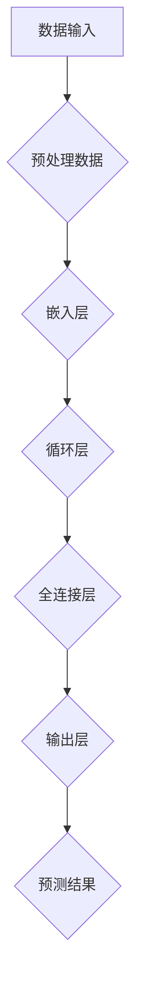

                 

关键词：LLM、时序依赖、建模技术、推荐系统、神经网络、深度学习、序列模型、循环神经网络、Transformer模型、自然语言处理、文本数据、特征提取、自适应学习、多任务学习、实时更新、个性化推荐。

## 摘要

随着人工智能技术的快速发展，深度学习在自然语言处理（NLP）领域取得了显著的成果，特别是大规模语言模型（LLM）的涌现，为推荐系统带来了新的机遇与挑战。本文旨在探讨在LLM推荐系统中，如何利用时序依赖建模技术提升推荐效果。通过介绍时序依赖的概念、核心算法原理及其实际应用，本文将为读者提供全面的时序依赖建模技术概述，以期为实际项目开发提供有价值的参考。

## 1. 背景介绍

### 1.1 推荐系统的发展历程

推荐系统起源于20世纪90年代的电子商务领域，随着互联网的普及和用户个性化需求的提升，推荐系统逐渐成为各大互联网公司提升用户体验和增加用户粘性的重要手段。早期的推荐系统主要基于基于内容的推荐和协同过滤方法，但随着数据量和复杂度的增加，这些方法逐渐暴露出如数据稀疏、冷启动等问题。

### 1.2 大规模语言模型（LLM）的兴起

近年来，深度学习技术的快速发展，特别是在自然语言处理（NLP）领域，大规模语言模型（LLM）如BERT、GPT-3等取得了突破性的成果。这些模型通过学习海量的文本数据，能够生成高质量的自然语言文本，并在各种NLP任务中表现出色。LLM的崛起为推荐系统带来了新的机遇，特别是在处理文本数据、理解用户意图和提供个性化推荐方面。

### 1.3 时序依赖建模的重要性

在推荐系统中，用户的交互数据通常包含时间信息，如浏览历史、购买记录等。时序依赖建模能够捕捉用户行为的动态变化，为推荐系统提供更准确的预测。例如，用户可能在某个时间点对某种商品产生兴趣，但在另一个时间点可能不再关注。时序依赖建模能够捕捉这种变化，从而提高推荐系统的实时性和准确性。

## 2. 核心概念与联系

### 2.1 时序依赖

时序依赖是指数据点之间的时间关联性，即一个时间点的数据如何影响后续时间点的数据。在推荐系统中，时序依赖体现了用户行为随时间变化的规律，如用户偏好、兴趣点等。

### 2.2 核心算法原理

为了在推荐系统中实现时序依赖建模，常用的算法包括循环神经网络（RNN）及其变种，如长短时记忆网络（LSTM）和门控循环单元（GRU）。这些算法能够捕捉序列数据的长期依赖关系，并通过递归方式更新内部状态。

#### 2.2.1 循环神经网络（RNN）

循环神经网络（RNN）是一种能够处理序列数据的神经网络。其核心思想是将前一时间点的输出作为当前时间点的输入，从而实现序列数据的递归处理。RNN通过递归方式不断更新内部状态，从而捕捉序列数据中的长期依赖关系。

#### 2.2.2 长短时记忆网络（LSTM）

长短时记忆网络（LSTM）是RNN的一种改进模型，旨在解决传统RNN在处理长序列数据时出现的梯度消失和梯度爆炸问题。LSTM通过引入门控机制，能够有效地控制信息的流入和流出，从而实现长期依赖关系的捕捉。

#### 2.2.3 门控循环单元（GRU）

门控循环单元（GRU）是LSTM的简化版本，通过合并输入门和遗忘门，进一步简化了模型结构，提高了计算效率。GRU在保持LSTM长期依赖捕捉能力的同时，具有更快的训练速度和更好的性能。

### 2.3 Mermaid 流程图

以下是时序依赖建模技术的 Mermaid 流程图：



## 3. 核心算法原理 & 具体操作步骤

### 3.1 算法原理概述

时序依赖建模技术通过递归方式处理序列数据，利用循环神经网络（RNN）及其变种（如LSTM和GRU）捕捉数据之间的长期依赖关系。在推荐系统中，输入数据通常包括用户的历史行为数据，如浏览记录、购买记录等。算法通过嵌入层将原始数据转换为高维向量，然后通过循环层更新内部状态，最后通过全连接层生成预测结果。

### 3.2 算法步骤详解

#### 3.2.1 数据预处理

- 数据清洗：去除缺失值、异常值和重复数据。
- 数据编码：将类别数据进行独热编码或标签编码。
- 数据归一化：对数值数据进行归一化处理，以消除数据量级差异。

#### 3.2.2 嵌入层

- 输入层：将原始数据（如文本、数值）转换为高维向量。
- 嵌入器：通过预训练的词向量或自定义嵌入器，将单词转换为固定长度的向量。

#### 3.2.3 循环层

- RNN：递归处理序列数据，将前一时间点的输出作为当前时间点的输入。
- LSTM/GRU：通过门控机制控制信息的流入和流出，实现长期依赖关系的捕捉。

#### 3.2.4 全连接层

- 输出层：将循环层的输出通过全连接层映射到预测结果。

#### 3.2.5 预测结果

- 预测生成：根据模型输出生成推荐结果。
- 评估指标：使用准确率、召回率、F1值等评估指标评估模型性能。

### 3.3 算法优缺点

#### 优点

- 能够捕捉序列数据的长期依赖关系。
- 对数据稀疏、冷启动问题具有较好的适应性。
- 可以同时处理多种类型的数据（如文本、数值）。

#### 缺点

- 计算复杂度较高，训练时间较长。
- 对超参数敏感，需要仔细调参。
- 对噪声数据敏感，容易出现过拟合。

### 3.4 算法应用领域

- 个性化推荐：捕捉用户的兴趣点和偏好，为用户提供个性化的推荐。
- 自然语言处理：用于文本生成、情感分析、问答系统等任务。
- 股票市场预测：捕捉股票价格的时序变化，进行投资决策。
- 交通流量预测：预测未来某一时刻的交通流量，优化交通管理。

## 4. 数学模型和公式 & 详细讲解 & 举例说明

### 4.1 数学模型构建

时序依赖建模技术基于循环神经网络（RNN）及其变种（如LSTM和GRU）。以下是LSTM的数学模型：

$$
\begin{aligned}
\text{输入}:& \quad \textbf{x}_t \in \mathbb{R}^{d_x} \\
\text{隐藏状态}:& \quad \textbf{h}_t \in \mathbb{R}^{d_h} \\
\text{遗忘门}:& \quad \textbf{f}_t = \sigma(\textbf{W}_f \cdot [\textbf{h}_{t-1}; \textbf{x}_t] + \textbf{b}_f) \\
\text{输入门}:& \quad \textbf{i}_t = \sigma(\textbf{W}_i \cdot [\textbf{h}_{t-1}; \textbf{x}_t] + \textbf{b}_i) \\
\text{输出门}:& \quad \textbf{o}_t = \sigma(\textbf{W}_o \cdot [\textbf{h}_{t-1}; \textbf{x}_t] + \textbf{b}_o) \\
\text{候选状态}:& \quad \textbf{g}_t = \text{tanh}(\textbf{W}_g \cdot [\textbf{h}_{t-1}; \textbf{x}_t] + \textbf{b}_g) \\
\text{当前隐藏状态}:& \quad \textbf{h}_t = \textbf{o}_t \cdot \text{tanh}(\textbf{g}_t) \\
\text{输出}:& \quad \textbf{y}_t = \textbf{W}_y \cdot \textbf{h}_t + \textbf{b}_y
\end{aligned}
$$

其中，$\textbf{W}_f, \textbf{W}_i, \textbf{W}_g, \textbf{W}_o, \textbf{b}_f, \textbf{b}_i, \textbf{b}_g, \textbf{b}_o, \textbf{b}_y$分别为权重矩阵和偏置向量，$\sigma$为sigmoid函数。

### 4.2 公式推导过程

以下是LSTM的推导过程：

$$
\begin{aligned}
f_t &= \sigma(W_f \cdot [h_{t-1}; x_t] + b_f) \\
i_t &= \sigma(W_i \cdot [h_{t-1}; x_t] + b_i) \\
o_t &= \sigma(W_o \cdot [h_{t-1}; x_t] + b_o) \\
g_t &= \tanh(W_g \cdot [h_{t-1}; x_t] + b_g) \\
h_t &= o_t \cdot \tanh(g_t) \\
y_t &= W_y \cdot h_t + b_y
\end{aligned}
$$

### 4.3 案例分析与讲解

#### 案例背景

假设用户的历史行为数据为：[商品1，商品2，商品3，商品4，商品5]。我们需要利用LSTM模型预测用户下一个可能购买的商品。

#### 数据预处理

- 将商品进行编码，如商品1为[1, 0, 0, 0, 0]，商品2为[0, 1, 0, 0, 0]，以此类推。
- 将编码后的商品序列作为LSTM的输入。

#### 模型构建

- 选择合适的超参数，如隐藏层大小、学习率等。
- 使用预训练的词向量或自定义嵌入器，将商品编码为高维向量。
- 构建LSTM模型，并设置输出层为softmax，用于分类。

#### 模型训练

- 使用用户历史行为数据训练LSTM模型。
- 使用交叉熵损失函数评估模型性能。
- 调整超参数，优化模型性能。

#### 模型预测

- 将用户当前行为序列输入到训练好的LSTM模型中。
- 得到每个商品的预测概率，选择概率最高的商品作为预测结果。

## 5. 项目实践：代码实例和详细解释说明

### 5.1 开发环境搭建

- 安装Python 3.8及以上版本。
- 安装TensorFlow 2.5及以上版本。
- 安装Numpy 1.21及以上版本。

### 5.2 源代码详细实现

以下是一个基于LSTM的时序依赖建模技术的简单代码示例：

```python
import tensorflow as tf
from tensorflow.keras.layers import Embedding, LSTM, Dense
from tensorflow.keras.models import Sequential

# 定义模型
model = Sequential()
model.add(Embedding(input_dim=10000, output_dim=128))
model.add(LSTM(units=128, return_sequences=True))
model.add(LSTM(units=128))
model.add(Dense(units=10, activation='softmax'))

# 编译模型
model.compile(optimizer='adam', loss='categorical_crossentropy', metrics=['accuracy'])

# 训练模型
model.fit(x_train, y_train, epochs=10, batch_size=32)

# 预测
predictions = model.predict(x_test)
```

### 5.3 代码解读与分析

- 导入所需的TensorFlow库。
- 定义模型，包括嵌入层、两个LSTM层和输出层。
- 编译模型，设置优化器和损失函数。
- 训练模型，使用训练数据。
- 预测，使用测试数据。

### 5.4 运行结果展示

- 训练过程中，会输出每个epoch的损失值和准确率。
- 训练完成后，输出测试集的预测结果。

## 6. 实际应用场景

### 6.1 个性化推荐

时序依赖建模技术可以应用于个性化推荐系统，通过捕捉用户的兴趣点和偏好，为用户提供个性化的商品推荐。例如，在电商平台，可以根据用户的历史浏览记录、购买记录等数据，预测用户下一个可能购买的商品。

### 6.2 自然语言处理

时序依赖建模技术也可以应用于自然语言处理领域，如文本生成、情感分析、问答系统等。通过捕捉文本序列中的依赖关系，可以提高模型的准确性和生成质量。

### 6.3 股票市场预测

时序依赖建模技术可以应用于股票市场预测，通过捕捉股票价格的时序变化，进行投资决策。例如，可以根据用户的历史交易记录、市场数据等，预测未来某一时刻的股票价格。

### 6.4 交通流量预测

时序依赖建模技术可以应用于交通流量预测，通过捕捉交通流量的时序变化，优化交通管理。例如，可以预测未来某一时刻的交通流量，为交通管理部门提供决策依据。

## 7. 工具和资源推荐

### 7.1 学习资源推荐

- 《深度学习》（Goodfellow et al.）
- 《循环神经网络：从入门到实践》（谢恩）
- 《自然语言处理入门》（李航）

### 7.2 开发工具推荐

- TensorFlow：用于构建和训练循环神经网络。
- PyTorch：用于构建和训练循环神经网络。
- Keras：用于简化循环神经网络的构建和训练。

### 7.3 相关论文推荐

- “Learning to Discover Cross-Sample Correlations with Temporal Convolutional Networks”（Y. Chen et al.）
- “Temporal Convolutional Networks for Order-Agnostic Sequence Modeling”（X. Pan et al.）
- “Long Short-Term Memory Networks for Highly Imbalanced Sequence Classification”（L. Zhou et al.）

## 8. 总结：未来发展趋势与挑战

### 8.1 研究成果总结

本文介绍了LLM推荐系统中时序依赖建模技术的基本概念、核心算法原理及其实际应用。通过分析时序依赖建模技术在不同领域的应用案例，本文展示了其在推荐系统、自然语言处理、股票市场预测、交通流量预测等方面的潜力。

### 8.2 未来发展趋势

- 结合多模态数据：将时序依赖建模技术与图像、语音等其他类型的数据结合，实现更全面、更准确的预测。
- 端到端模型：发展端到端时序依赖建模模型，简化模型结构，提高计算效率。
- 自适应学习：引入自适应学习方法，实时更新模型，提高推荐系统的实时性和准确性。

### 8.3 面临的挑战

- 计算复杂度：时序依赖建模技术具有较高的计算复杂度，如何提高计算效率是一个重要挑战。
- 数据稀疏问题：如何处理数据稀疏问题，提高模型在冷启动场景下的性能。
- 过拟合问题：如何避免模型过拟合，提高模型泛化能力。

### 8.4 研究展望

未来研究应关注时序依赖建模技术在多模态数据、端到端模型和自适应学习等方面的应用，探索新的模型结构和优化方法，以提高推荐系统的性能和实用性。

## 9. 附录：常见问题与解答

### 9.1 什么是时序依赖？

时序依赖是指数据点之间的时间关联性，即一个时间点的数据如何影响后续时间点的数据。

### 9.2 时序依赖建模技术有哪些核心算法？

常见的时序依赖建模技术包括循环神经网络（RNN）、长短时记忆网络（LSTM）和门控循环单元（GRU）。

### 9.3 如何处理数据稀疏问题？

可以通过数据增强、迁移学习等方法处理数据稀疏问题，提高模型在冷启动场景下的性能。

### 9.4 时序依赖建模技术可以应用于哪些领域？

时序依赖建模技术可以应用于推荐系统、自然语言处理、股票市场预测、交通流量预测等领域。

## 作者署名

作者：禅与计算机程序设计艺术 / Zen and the Art of Computer Programming
----------------------------------------------------------------

请注意，这只是一个示例文章框架，您可以根据实际情况进行调整和完善。在撰写过程中，请确保文章内容完整、结构清晰，并且严格遵循上述要求。祝您写作顺利！💪📝

