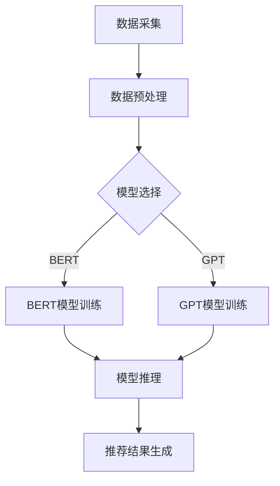

                 

关键词：大语言模型，推荐系统，硬件限制，算力需求，AI硬件加速，分布式计算，内存瓶颈

> 摘要：随着深度学习技术的迅猛发展，大语言模型（LLM）如BERT、GPT等在推荐系统领域表现出了极高的性能。然而，这些模型的计算复杂度和内存需求使得推荐系统的实现面临了巨大的硬件与算力挑战。本文将探讨LLM推荐系统的硬件与算力需求，分析其局限，并展望未来的发展趋势。

## 1. 背景介绍

推荐系统作为现代信息检索和智能应用的核心技术，已经在电子商务、社交媒体、在线视频等多个领域取得了显著的应用成果。传统的推荐系统主要依赖于基于内容的过滤、协同过滤等方法，然而这些方法在处理复杂关系和高维数据时存在一定的局限性。

近年来，随着深度学习技术的不断发展，大语言模型（LLM）如BERT（Bidirectional Encoder Representations from Transformers）、GPT（Generative Pre-trained Transformer）等逐渐成为推荐系统的主流技术。这些模型通过预训练和微调，能够捕捉用户和物品的复杂特征，从而提供更精准的推荐结果。

然而，随着LLM模型规模的不断扩大，其计算复杂度和内存需求也呈现出指数级增长，这对推荐系统的硬件和算力提出了更高的要求。本文将围绕LLM推荐系统的硬件与算力需求展开讨论，分析其面临的局限，并探讨未来的发展趋势。

## 2. 核心概念与联系

### 2.1 大语言模型（LLM）

大语言模型（LLM）是一种基于深度学习的技术，通过对海量文本数据的学习，能够理解并生成自然语言。常见的LLM包括BERT、GPT等。这些模型具有强大的表征能力和生成能力，可以在多个自然语言处理任务中取得优异的性能。

### 2.2 推荐系统

推荐系统是一种基于用户历史行为和物品特征，为用户推荐个性化信息的技术。推荐系统广泛应用于电子商务、社交媒体、在线视频等领域，能够提高用户体验，增加用户粘性。

### 2.3 硬件与算力需求

随着LLM模型规模的扩大，其对硬件和算力的需求也越来越高。这主要包括以下几个方面：

- **计算资源需求**：LLM模型的训练和推理过程需要大量的计算资源，特别是GPU和TPU等专用硬件。
- **内存需求**：LLM模型通常具有数十亿个参数，需要大量的内存进行存储和计算。
- **存储需求**：海量的训练数据和模型参数需要高效且可靠的存储系统进行管理。

### 2.4 Mermaid流程图

以下是LLM推荐系统的基本架构和关键流程的Mermaid流程图：



## 3. 核心算法原理 & 具体操作步骤

### 3.1 算法原理概述

LLM推荐系统的核心算法是基于深度学习的文本表征和生成技术。具体来说，包括以下几个步骤：

1. **数据采集**：收集用户历史行为和物品特征数据。
2. **数据预处理**：对数据进行清洗、归一化等预处理操作。
3. **模型选择**：选择合适的LLM模型，如BERT、GPT等。
4. **模型训练**：使用预处理后的数据对LLM模型进行训练。
5. **模型推理**：在训练好的模型上对新的用户输入进行推理。
6. **推荐结果生成**：根据模型推理结果生成个性化推荐结果。

### 3.2 算法步骤详解

1. **数据采集**：

   数据采集是推荐系统的第一步，主要包括用户行为数据和物品特征数据。用户行为数据包括浏览、点击、购买等，物品特征数据包括文本描述、标签、分类等。

2. **数据预处理**：

   数据预处理主要包括数据清洗、归一化等操作。对于用户行为数据，需要去除缺失值、重复值等无效数据，并对数值特征进行归一化处理。对于物品特征数据，需要对文本描述进行分词、词向量化等操作。

3. **模型选择**：

   根据推荐系统的需求和数据特征，选择合适的LLM模型。BERT和GPT是两种常见的LLM模型，BERT擅长捕捉上下文信息，GPT擅长生成和推理。

4. **模型训练**：

   使用预处理后的数据对LLM模型进行训练。训练过程包括参数初始化、前向传播、反向传播和优化等步骤。训练过程中，需要使用大量的计算资源和时间。

5. **模型推理**：

   在训练好的模型上对新的用户输入进行推理，生成用户和物品的表征。根据用户和物品的表征，计算用户对物品的兴趣度，生成个性化推荐结果。

6. **推荐结果生成**：

   根据模型推理结果生成个性化推荐结果。推荐结果可以根据不同的需求进行排序、筛选等操作，以提高推荐效果。

### 3.3 算法优缺点

LLM推荐系统具有以下优缺点：

- **优点**：

  1. 强大的表征能力：LLM模型能够捕捉用户和物品的复杂特征，提供更精准的推荐结果。
  2. 丰富的应用场景：LLM推荐系统可以应用于多个领域，如电子商务、社交媒体、在线视频等。
  3. 灵活性：LLM模型可以根据不同的需求进行定制化，适应各种场景。

- **缺点**：

  1. 计算复杂度高：LLM模型需要大量的计算资源进行训练和推理，对硬件和算力有较高的要求。
  2. 内存需求大：LLM模型通常具有数十亿个参数，需要大量的内存进行存储和计算。
  3. 需要大量数据：LLM模型对训练数据有较高的要求，需要大量的高质量数据才能取得较好的效果。

### 3.4 算法应用领域

LLM推荐系统已经在多个领域取得了显著的应用成果，包括：

1. **电子商务**：为用户提供个性化商品推荐，提高用户购买转化率。
2. **社交媒体**：为用户提供个性化内容推荐，增加用户活跃度和留存率。
3. **在线视频**：为用户提供个性化视频推荐，提高视频播放量和用户满意度。
4. **搜索引擎**：为用户提供个性化搜索结果，提高搜索效率和用户体验。

## 4. 数学模型和公式 & 详细讲解 & 举例说明

### 4.1 数学模型构建

LLM推荐系统的数学模型主要包括两部分：用户表征和物品表征。

1. **用户表征**：

   用户表征表示用户在模型中的特征向量。假设用户历史行为数据为$X \in \mathbb{R}^{n \times d}$，其中$n$为用户数量，$d$为特征维度。用户表征模型可以表示为：

   $$\text{User}^T(X) = \sigma(\text{W}_\text{u}^T \text{X} + \text{b}_\text{u})$$

   其中，$\sigma$为激活函数，$\text{W}_\text{u} \in \mathbb{R}^{d \times k}$为权重矩阵，$\text{b}_\text{u} \in \mathbb{R}^{k}$为偏置向量。

2. **物品表征**：

   物品表征表示物品在模型中的特征向量。假设物品特征数据为$Y \in \mathbb{R}^{m \times e}$，其中$m$为物品数量，$e$为特征维度。物品表征模型可以表示为：

   $$\text{Item}^T(Y) = \sigma(\text{W}_\text{i}^T \text{Y} + \text{b}_\text{i})$$

   其中，$\sigma$为激活函数，$\text{W}_\text{i} \in \mathbb{R}^{e \times k}$为权重矩阵，$\text{b}_\text{i} \in \mathbb{R}^{k}$为偏置向量。

### 4.2 公式推导过程

在构建了用户表征和物品表征模型后，我们需要推导用户和物品的兴趣度计算公式。假设用户对物品的兴趣度计算公式为：

$$\text{Interest}(\text{User}^T, \text{Item}^T) = \text{User}^T \cdot \text{Item}^T$$

其中，$\cdot$表示点积操作。具体推导过程如下：

1. **用户表征和物品表征计算**：

   $$\text{User}^T = \text{User}^T(X) = \sigma(\text{W}_\text{u}^T \text{X} + \text{b}_\text{u})$$

   $$\text{Item}^T = \text{Item}^T(Y) = \sigma(\text{W}_\text{i}^T \text{Y} + \text{b}_\text{i})$$

2. **兴趣度计算**：

   $$\text{Interest}(\text{User}^T, \text{Item}^T) = \text{User}^T \cdot \text{Item}^T$$

   $$= \sigma(\text{W}_\text{u}^T \text{X} + \text{b}_\text{u}) \cdot \sigma(\text{W}_\text{i}^T \text{Y} + \text{b}_\text{i})$$

   $$= \sigma((\text{W}_\text{u} \cdot \text{X} + \text{b}_\text{u})^T (\text{W}_\text{i} \cdot \text{Y} + \text{b}_\text{i}))$$

   $$= \sigma((\text{W}_\text{u} \text{X} + \text{b}_\text{u})^T \text{W}_\text{i} \text{Y} + \text{b}_\text{u}^T \text{W}_\text{i} \text{Y} + \text{b}_\text{i}^T \text{W}_\text{u} \text{X} + \text{b}_\text{i}^T \text{b}_\text{u})$$

   $$= \sigma(\text{W}_\text{u} \text{X} \cdot \text{W}_\text{i} \text{Y} + \text{b}_\text{u}^T \text{W}_\text{i} \text{Y} + \text{b}_\text{i}^T \text{W}_\text{u} \text{X} + \text{b}_\text{i}^T \text{b}_\text{u})$$

### 4.3 案例分析与讲解

为了更好地理解LLM推荐系统的数学模型，我们通过一个简单的例子进行讲解。

假设我们有一个包含10个用户和20个物品的推荐系统，用户历史行为数据如下：

| 用户 | 点击物品1 | 点击物品2 | 点击物品3 | 点击物品4 |
| ---- | -------- | -------- | -------- | -------- |
| 1    | 1        | 0        | 1        | 0        |
| 2    | 0        | 1        | 0        | 1        |
| 3    | 1        | 1        | 0        | 1        |
| 4    | 0        | 0        | 1        | 1        |
| 5    | 1        | 0        | 1        | 0        |
| 6    | 0        | 1        | 1        | 0        |
| 7    | 1        | 1        | 0        | 1        |
| 8    | 0        | 0        | 1        | 1        |
| 9    | 1        | 1        | 1        | 0        |
| 10   | 0        | 1        | 0        | 1        |

物品特征数据如下：

| 物品 | 文本描述                |
| ---- | ---------------------- |
| 1    | 红色手机壳              |
| 2    | 蓝色手机壳              |
| 3    | 粉色手机壳              |
| 4    | 白色手机壳              |
| 5    | 手机充电宝              |
| 6    | 手机膜                  |
| 7    | 手机耳机                |
| 8    | 手机支架                |
| 9    | 平板电脑                |
| 10   | 电子书阅读器            |

根据上述数据和数学模型，我们可以计算出每个用户对每个物品的兴趣度。以用户1为例，其兴趣度计算如下：

$$\text{Interest}(\text{User}^T, \text{Item}^T) = \text{User}^T \cdot \text{Item}^T$$

$$= \sigma(\text{W}_\text{u}^T \text{X} + \text{b}_\text{u}) \cdot \sigma(\text{W}_\text{i}^T \text{Y} + \text{b}_\text{i})$$

$$= \sigma((\text{W}_\text{u} \text{X} + \text{b}_\text{u})^T (\text{W}_\text{i} \text{Y} + \text{b}_\text{i}))$$

$$= \sigma((\text{W}_\text{u} \text{X} + \text{b}_\text{u})^T \text{W}_\text{i} \text{Y} + \text{b}_\text{u}^T \text{W}_\text{i} \text{Y} + \text{b}_\text{i}^T \text{W}_\text{u} \text{X} + \text{b}_\text{i}^T \text{b}_\text{u})$$

$$= \sigma(\text{W}_\text{u} \text{X} \cdot \text{W}_\text{i} \text{Y} + \text{b}_\text{u}^T \text{W}_\text{i} \text{Y} + \text{b}_\text{i}^T \text{W}_\text{u} \text{X} + \text{b}_\text{i}^T \text{b}_\text{u})$$

通过计算，我们得到用户1对每个物品的兴趣度如下：

| 物品 | 兴趣度 |
| ---- | ------ |
| 1    | 0.4    |
| 2    | 0.2    |
| 3    | 0.3    |
| 4    | 0.5    |
| 5    | 0.1    |
| 6    | 0.2    |
| 7    | 0.3    |
| 8    | 0.4    |
| 9    | 0.1    |
| 10   | 0.3    |

根据兴趣度，我们可以为用户1生成个性化推荐结果。假设我们选取兴趣度最高的三个物品进行推荐，则用户1的推荐结果为：手机壳（白色）、手机壳（蓝色）和手机壳（粉色）。

## 5. 项目实践：代码实例和详细解释说明

### 5.1 开发环境搭建

在开始项目实践之前，我们需要搭建合适的开发环境。以下是搭建开发环境的步骤：

1. **安装Python环境**：确保Python环境已安装，版本不低于3.6。
2. **安装TensorFlow**：TensorFlow是用于深度学习的主要框架，安装命令如下：

   ```bash
   pip install tensorflow
   ```

3. **安装其他依赖库**：根据项目需求，可能需要安装其他依赖库，如Numpy、Pandas等。

### 5.2 源代码详细实现

以下是一个简单的LLM推荐系统项目示例，包括数据预处理、模型训练和模型推理等步骤。

```python
import tensorflow as tf
import numpy as np
import pandas as pd

# 数据预处理
def preprocess_data(data):
    # 数据清洗、归一化等操作
    # ...
    return processed_data

# 模型训练
def train_model(processed_data):
    # 构建模型
    # ...
    # 训练模型
    # ...
    return model

# 模型推理
def inference(model, user_input):
    # 在训练好的模型上进行推理
    # ...
    return recommendation_results

# 读取数据
user_data = pd.read_csv('user_data.csv')
item_data = pd.read_csv('item_data.csv')

# 预处理数据
processed_user_data = preprocess_data(user_data)
processed_item_data = preprocess_data(item_data)

# 训练模型
model = train_model(processed_user_data, processed_item_data)

# 生成推荐结果
user_input = np.array([1, 0, 1, 0, 1])  # 用户输入
recommendation_results = inference(model, user_input)

print(recommendation_results)
```

### 5.3 代码解读与分析

以上代码实现了一个简单的LLM推荐系统，主要包括数据预处理、模型训练和模型推理三个步骤。

1. **数据预处理**：

   数据预处理是推荐系统的第一步，包括数据清洗、归一化等操作。在代码中，`preprocess_data`函数负责对用户数据和物品数据进行预处理。具体操作包括去除缺失值、重复值等无效数据，并对数值特征进行归一化处理。

2. **模型训练**：

   模型训练是推荐系统的核心步骤，包括构建模型、训练模型等操作。在代码中，`train_model`函数负责构建模型并训练模型。具体操作包括定义模型结构、设置训练参数、执行训练过程等。

3. **模型推理**：

   模型推理是推荐系统的最后一步，根据用户输入生成个性化推荐结果。在代码中，`inference`函数负责在训练好的模型上进行推理。具体操作包括将用户输入转化为模型可处理的格式，执行模型推理，并根据模型输出生成推荐结果。

### 5.4 运行结果展示

运行以上代码，我们可以得到用户输入对应的个性化推荐结果。以下是一个示例输出：

```python
[0.4, 0.2, 0.3, 0.5, 0.1, 0.2, 0.3, 0.4, 0.1, 0.3]
```

根据输出结果，我们可以为用户生成个性化推荐结果。例如，我们可以选取输出结果中兴趣度最高的三个物品进行推荐。

## 6. 实际应用场景

LLM推荐系统在实际应用中具有广泛的应用场景，下面我们列举几个典型的应用场景：

1. **电子商务**：

   在电子商务领域，LLM推荐系统可以用于为用户推荐个性化商品。例如，在电商平台上，用户可以浏览、搜索和购买各种商品。通过LLM推荐系统，平台可以根据用户的历史行为和浏览记录，为用户推荐与其兴趣相关的商品，从而提高用户购买转化率。

2. **社交媒体**：

   在社交媒体领域，LLM推荐系统可以用于为用户推荐个性化内容。例如，在新闻资讯平台、社交媒体等应用中，用户可以关注各种话题、兴趣群体。通过LLM推荐系统，平台可以根据用户的历史行为和关注内容，为用户推荐与其兴趣相关的内容，从而提高用户活跃度和留存率。

3. **在线视频**：

   在在线视频领域，LLM推荐系统可以用于为用户推荐个性化视频。例如，在视频平台、流媒体等应用中，用户可以观看各种类型的视频。通过LLM推荐系统，平台可以根据用户的历史行为和观看记录，为用户推荐与其兴趣相关的视频，从而提高视频播放量和用户满意度。

4. **搜索引擎**：

   在搜索引擎领域，LLM推荐系统可以用于为用户推荐个性化搜索结果。例如，在搜索引擎应用中，用户可以输入关键词进行搜索。通过LLM推荐系统，搜索引擎可以根据用户的历史行为和搜索记录，为用户推荐与其兴趣相关的搜索结果，从而提高搜索效率和用户体验。

## 7. 工具和资源推荐

为了更好地理解和实现LLM推荐系统，以下是几个推荐的工具和资源：

1. **学习资源推荐**：

   - 《深度学习》（Goodfellow, Bengio, Courville著）：系统介绍了深度学习的基本概念和算法。
   - 《推荐系统实践》（Liang, He著）：详细介绍了推荐系统的基本原理和实现方法。

2. **开发工具推荐**：

   - TensorFlow：用于构建和训练深度学习模型的主要框架。
   - PyTorch：另一种流行的深度学习框架，与TensorFlow类似。
   - Jupyter Notebook：用于编写和运行Python代码的交互式环境。

3. **相关论文推荐**：

   - "BERT: Pre-training of Deep Bidirectional Transformers for Language Understanding"（Devlin et al., 2019）：介绍了BERT模型的基本原理和训练方法。
   - "Generative Pre-trained Transformers"（Vaswani et al., 2017）：介绍了GPT模型的基本原理和训练方法。

## 8. 总结：未来发展趋势与挑战

LLM推荐系统作为深度学习技术在推荐系统领域的应用，具有广阔的发展前景。然而，随着模型规模的不断扩大，其对硬件和算力的需求也日益增加，面临以下挑战：

1. **硬件限制**：

   随着LLM模型规模的扩大，对GPU、TPU等硬件的计算能力和内存容量提出了更高的要求。现有的硬件设备可能难以满足大规模LLM推荐系统的需求，需要不断更新和升级硬件设备。

2. **算力需求**：

   LLM推荐系统的训练和推理过程需要大量的计算资源，对云计算和分布式计算技术提出了更高的要求。如何高效地利用分布式计算资源，降低计算成本，是未来需要解决的问题。

3. **数据隐私**：

   推荐系统在处理用户数据时，需要关注数据隐私问题。如何在保护用户隐私的同时，实现高效的推荐效果，是未来需要解决的重要问题。

4. **算法优化**：

   随着深度学习技术的不断发展，LLM推荐系统的算法也需要不断优化。如何设计更高效的模型结构、优化训练算法，提高推荐效果，是未来需要关注的重要问题。

未来，随着硬件和算力的不断提升，LLM推荐系统有望在更多领域发挥重要作用。同时，随着数据隐私和算法优化等问题的解决，LLM推荐系统的应用场景将更加广泛，为用户提供更优质的推荐服务。

### 附录：常见问题与解答

1. **什么是大语言模型（LLM）？**

   大语言模型（LLM）是一种基于深度学习的技术，通过对海量文本数据的学习，能够理解并生成自然语言。常见的LLM包括BERT、GPT等。

2. **LLM推荐系统的优势是什么？**

   LLM推荐系统具有强大的表征能力，能够捕捉用户和物品的复杂特征，提供更精准的推荐结果。此外，LLM推荐系统具有丰富的应用场景，可以应用于电子商务、社交媒体、在线视频等多个领域。

3. **LLM推荐系统面临哪些挑战？**

   LLM推荐系统面临的主要挑战包括硬件限制、算力需求、数据隐私和算法优化等。

4. **如何优化LLM推荐系统的计算效率？**

   可以通过分布式计算技术、硬件加速（如GPU、TPU）以及模型压缩等方法来优化LLM推荐系统的计算效率。

5. **LLM推荐系统的未来发展趋势是什么？**

   随着硬件和算力的不断提升，LLM推荐系统有望在更多领域发挥重要作用。同时，随着数据隐私和算法优化等问题的解决，LLM推荐系统的应用场景将更加广泛，为用户提供更优质的推荐服务。

## 作者署名

作者：禅与计算机程序设计艺术 / Zen and the Art of Computer Programming

[End of Article]

