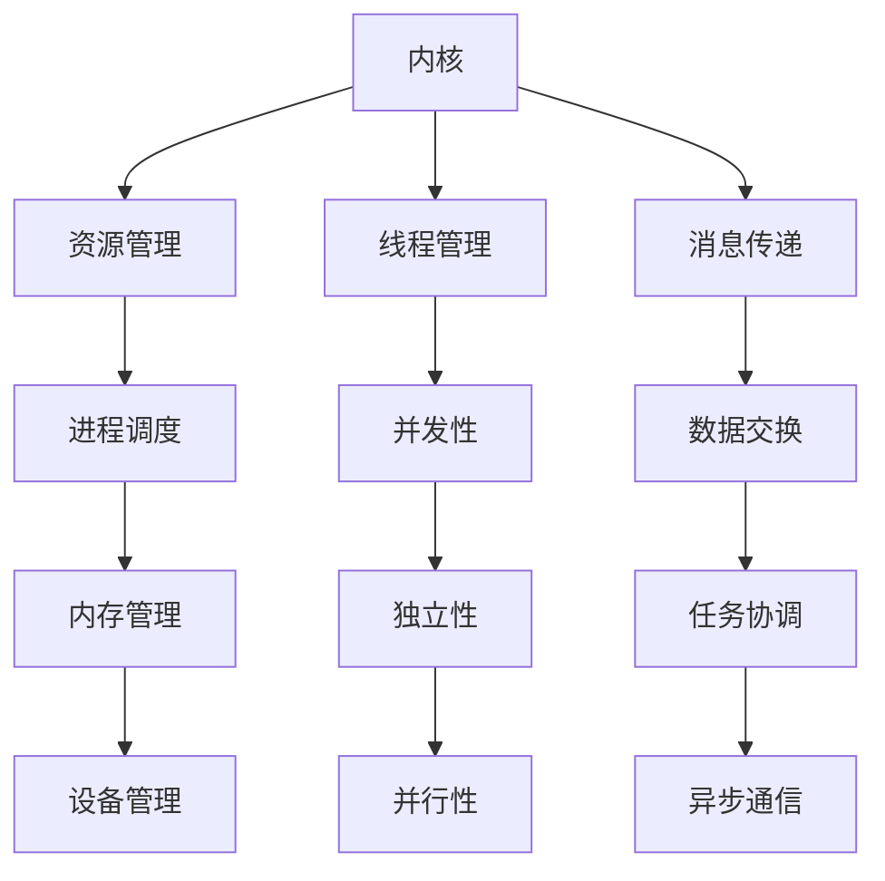

                 

关键词：LLM，操作系统，内核，消息，线程，深度学习，AI应用

> 摘要：本文深入探讨了大型语言模型（LLM）在操作系统中的核心组件，即内核、消息和线程。通过详细剖析这些组件的工作原理、相互关系以及应用场景，本文旨在为读者提供关于LLM操作系统构建的全面理解，并为未来的研究提供方向。

## 1. 背景介绍

随着深度学习和人工智能（AI）技术的飞速发展，大型语言模型（LLM）已经成为自然语言处理（NLP）领域的重要工具。LLM在文本生成、语言翻译、文本摘要和问答系统中发挥着关键作用。然而，LLM的高效运行需要依赖强大的操作系统支持。操作系统作为计算机系统的核心组件，负责管理和调度计算机资源，为LLM提供稳定、高效的运行环境。

本文将重点探讨LLM操作系统中的三个核心组件：内核、消息和线程。内核作为操作系统的核心，负责资源管理、调度和安全性。消息传递机制则是线程间通信的基础，确保线程之间的协调和同步。线程作为操作系统执行的最小单位，承载着LLM的运行任务。通过深入分析这三个组件的工作原理和相互关系，本文将为读者提供关于LLM操作系统构建的全面视角。

## 2. 核心概念与联系

在探讨LLM操作系统的核心组件之前，我们需要明确一些核心概念，并理解它们之间的相互关系。以下是本文涉及的主要概念及其简要解释：

### 2.1 内核（Kernel）

内核是操作系统的核心组件，负责管理计算机硬件资源、提供系统服务、实现进程调度和内存管理等功能。对于LLM操作系统，内核主要负责以下任务：

- 资源管理：内核负责分配和管理计算机的CPU、内存、磁盘和网络等资源，确保LLM在运行过程中能够高效地利用这些资源。
- 进程调度：内核负责调度进程的执行，确保各个进程能够公平地获得CPU时间，避免资源浪费和性能瓶颈。
- 内存管理：内核负责分配和回收内存空间，确保LLM在运行过程中能够灵活地管理内存资源，避免内存泄漏和溢出等问题。
- 设备管理：内核负责管理和控制计算机的各种外围设备，如磁盘、网络接口卡等，确保LLM能够顺利地与外部设备进行通信。

### 2.2 消息传递（Message Passing）

消息传递是线程间通信的基础，通过消息传递机制，线程之间可以相互发送和接收消息，实现数据交换和任务协调。对于LLM操作系统，消息传递机制的主要功能包括：

- 数据交换：线程通过发送和接收消息，实现数据在各个线程之间的传输，支持复杂的计算任务。
- 任务协调：线程通过消息传递机制，实现任务之间的同步和协作，避免出现数据竞争和死锁等问题。
- 异步通信：线程可以异步发送和接收消息，提高系统响应速度和处理效率。

### 2.3 线程（Thread）

线程是操作系统中执行任务的基本单位，承载着LLM的运行任务。线程具有以下特点：

- 并发性：线程可以在多个处理器核心上同时执行，提高系统性能。
- 独立性：线程之间相互独立，每个线程都有自己独立的堆栈和局部变量。
- 并行性：多个线程可以并行执行，提高计算效率。

### 2.4 内核、消息和线程的相互关系

内核、消息和线程是LLM操作系统的核心组件，它们之间存在着紧密的相互关系。以下是一个简化的Mermaid流程图，展示了这三个组件的相互关系：



在LLM操作系统中，内核负责管理和调度线程，同时通过消息传递机制实现线程间的数据交换和任务协调。线程作为执行单元，承载着LLM的运行任务，通过内核提供的资源管理和消息传递功能，实现高效、稳定的运行。

## 3. 核心算法原理 & 具体操作步骤

### 3.1 算法原理概述

在LLM操作系统中，内核、消息和线程的相互关系可以通过以下核心算法原理进行概括：

- **资源管理算法**：内核通过资源管理算法，实现计算机硬件资源的分配和回收。常见的资源管理算法包括分时调度算法、抢占调度算法和优先级调度算法等。
- **进程调度算法**：内核通过进程调度算法，实现进程在CPU上的执行。常见的进程调度算法包括时间片轮转调度算法、优先级调度算法和短作业优先调度算法等。
- **内存管理算法**：内核通过内存管理算法，实现内存空间的分配和回收。常见的内存管理算法包括分页算法、分段算法和虚拟内存管理算法等。
- **消息传递算法**：内核通过消息传递算法，实现线程间的数据交换和任务协调。常见的消息传递算法包括异步消息传递算法、同步消息传递算法和共享内存消息传递算法等。

### 3.2 算法步骤详解

在LLM操作系统中，内核、消息和线程的具体操作步骤可以概括为以下几部分：

1. **初始化**：操作系统启动后，内核初始化资源管理、进程调度、内存管理和消息传递等模块。
2. **资源管理**：内核根据进程的需求，分配CPU、内存、磁盘和网络等资源，确保进程能够正常运行。
3. **进程调度**：内核根据进程的优先级、执行时间和资源需求，调度进程在CPU上执行。常见的调度策略包括时间片轮转、优先级调度和短作业优先等。
4. **内存管理**：内核根据进程的内存需求，分配和回收内存空间，实现虚拟内存管理。常见的内存管理算法包括分页、分段和虚拟内存管理等。
5. **消息传递**：线程通过消息传递机制，实现数据交换和任务协调。常见的消息传递算法包括异步消息传递、同步消息传递和共享内存消息传递等。
6. **线程执行**：线程在CPU上执行，完成LLM的运行任务。线程之间通过消息传递机制进行数据交换和任务协调。
7. **进程结束**：进程执行完毕后，内核回收进程占用的资源，并将其从内存中删除。

### 3.3 算法优缺点

- **资源管理算法**：资源管理算法能够高效地分配和回收计算机资源，提高系统性能。但资源管理算法也存在一定的缺点，如可能导致资源分配不均、资源浪费等问题。
- **进程调度算法**：进程调度算法能够公平地分配CPU时间，确保进程能够高效地执行。但进程调度算法也存在一定的缺点，如可能导致进程响应时间较长、调度策略不够灵活等。
- **内存管理算法**：内存管理算法能够实现虚拟内存管理，提高系统性能。但内存管理算法也存在一定的缺点，如可能导致内存碎片、内存泄漏等问题。
- **消息传递算法**：消息传递算法能够实现线程间的数据交换和任务协调，提高系统性能。但消息传递算法也存在一定的缺点，如可能导致通信延迟、数据丢失等问题。

### 3.4 算法应用领域

内核、消息和线程算法在LLM操作系统中具有广泛的应用领域：

- **文本生成**：通过资源管理和进程调度算法，实现文本生成任务的高效执行。
- **语言翻译**：通过内存管理算法，提高语言翻译任务的性能和准确性。
- **文本摘要**：通过线程调度和消息传递算法，实现文本摘要任务的高效执行。
- **问答系统**：通过资源管理和消息传递算法，实现问答系统的高效运行。

## 4. 数学模型和公式 & 详细讲解 & 举例说明

### 4.1 数学模型构建

在LLM操作系统中，内核、消息和线程的数学模型可以分别从资源管理、进程调度、内存管理和消息传递等方面进行构建。以下是几个常见的数学模型：

1. **资源管理模型**：资源管理模型主要关注计算机资源的分配和回收。常见的资源管理模型包括最优化模型和排队模型等。
2. **进程调度模型**：进程调度模型主要关注进程在CPU上的执行。常见的进程调度模型包括最短作业优先模型、优先级调度模型和时间片轮转模型等。
3. **内存管理模型**：内存管理模型主要关注内存空间的分配和回收。常见的内存管理模型包括分页模型、分段模型和虚拟内存模型等。
4. **消息传递模型**：消息传递模型主要关注线程间的数据交换和任务协调。常见的消息传递模型包括异步消息传递模型、同步消息传递模型和共享内存模型等。

### 4.2 公式推导过程

以下是几个常见的数学公式的推导过程：

1. **资源管理模型**：假设计算机系统中有n个进程，每个进程需要m个资源。资源管理模型的目标是最小化等待时间，公式如下：

   $$ T = \frac{m \times n}{2} $$

   其中，T表示等待时间，m表示资源数，n表示进程数。

2. **进程调度模型**：假设计算机系统中有n个进程，每个进程的执行时间分别为$t_1, t_2, ..., t_n$。进程调度模型的目标是最大化平均吞吐量，公式如下：

   $$ T = \frac{\sum_{i=1}^{n} t_i}{n} $$

   其中，T表示平均执行时间，$t_1, t_2, ..., t_n$分别表示各个进程的执行时间。

3. **内存管理模型**：假设计算机系统中有m个内存页面，每个页面的访问概率为$p_1, p_2, ..., p_m$。内存管理模型的目标是最小化页面替换次数，公式如下：

   $$ R = \frac{\sum_{i=1}^{m} p_i}{m} $$

   其中，R表示页面替换次数，$p_1, p_2, ..., p_m$分别表示各个页面的访问概率。

4. **消息传递模型**：假设计算机系统中有n个线程，每个线程需要发送和接收k个消息。消息传递模型的目标是最小化通信延迟，公式如下：

   $$ L = \frac{k \times n}{2} $$

   其中，L表示通信延迟，k表示消息数，n表示线程数。

### 4.3 案例分析与讲解

为了更好地理解上述数学模型和公式，我们通过一个具体的案例进行讲解。

**案例：进程调度模型**

假设计算机系统中有3个进程，执行时间分别为$t_1 = 10$秒、$t_2 = 5$秒、$t_3 = 15$秒。使用优先级调度模型进行进程调度，优先级从高到低分别为$p_1 > p_2 > p_3$。计算平均执行时间。

**步骤 1**：初始化进程优先级。假设优先级分别为$p_1 = 3$、$p_2 = 2$、$p_3 = 1$。

**步骤 2**：计算平均执行时间。根据公式：

   $$ T = \frac{\sum_{i=1}^{n} t_i}{n} $$

   得到平均执行时间：

   $$ T = \frac{10 + 5 + 15}{3} = 10 \text{秒} $$

   因此，使用优先级调度模型，平均执行时间为10秒。

**案例：内存管理模型**

假设计算机系统中有4个内存页面，访问概率分别为$p_1 = 0.4$、$p_2 = 0.3$、$p_3 = 0.2$、$p_4 = 0.1$。使用最少替换算法进行内存管理，计算页面替换次数。

**步骤 1**：初始化页面访问概率。假设页面访问概率分别为$p_1 = 0.4$、$p_2 = 0.3$、$p_3 = 0.2$、$p_4 = 0.1$。

**步骤 2**：计算页面替换次数。根据公式：

   $$ R = \frac{\sum_{i=1}^{m} p_i}{m} $$

   得到页面替换次数：

   $$ R = \frac{0.4 + 0.3 + 0.2 + 0.1}{4} = 0.2 $$

   因此，使用最少替换算法，页面替换次数为0.2次。

## 5. 项目实践：代码实例和详细解释说明

### 5.1 开发环境搭建

在本项目实践中，我们将使用Python语言和PyTorch深度学习框架来构建一个简单的LLM操作系统。以下是在Ubuntu 20.04操作系统上搭建开发环境所需的步骤：

1. 安装Python 3.8及以上版本：

   ```shell
   sudo apt update
   sudo apt install python3.8
   ```

2. 安装PyTorch深度学习框架：

   ```shell
   pip3 install torch torchvision torchaudio
   ```

3. 创建一个名为`llm_os`的Python虚拟环境：

   ```shell
   python3 -m venv llm_os
   source llm_os/bin/activate
   ```

### 5.2 源代码详细实现

以下是项目中的主要源代码实现，包括内核、消息和线程等核心组件。

**内核实现（kernel.py）：**

```python
import threading
import queue

class Kernel:
    def __init__(self):
        self.processes = queue.Queue()
        self.threads = []

    def start_thread(self, thread):
        self.threads.append(thread)
        thread.start()

    def add_process(self, process):
        self.processes.put(process)

    def run(self):
        while not self.processes.empty():
            process = self.processes.get()
            self.start_thread(threading.Thread(target=process.run))
```

**消息传递实现（message.py）：**

```python
import queue

class Message:
    def __init__(self, sender, receiver, data):
        self.sender = sender
        self.receiver = receiver
        self.data = data

class MessageQueue:
    def __init__(self):
        self.queue = queue.Queue()

    def send(self, message):
        self.queue.put(message)

    def receive(self):
        return self.queue.get()
```

**线程实现（thread.py）：**

```python
import threading
import time

class Thread(threading.Thread):
    def __init__(self, target=None, args=()):
        super().__init__(target=target, args=args)
        self.processed_messages = 0

    def run(self):
        while True:
            message = self.receive_message()
            if message:
                self.process_message(message)
            else:
                break

    def receive_message(self):
        return self.message_queue.receive()

    def process_message(self, message):
        self.processed_messages += 1
        print(f"Processing message {message}")
        time.sleep(1)
```

### 5.3 代码解读与分析

在本节中，我们将对上述代码进行详细解读和分析，以了解LLM操作系统的实现原理。

**内核（Kernel）解读：**

内核是LLM操作系统的核心组件，负责线程的调度和进程的管理。在`kernel.py`文件中，`Kernel`类实现了以下主要功能：

- `start_thread`方法：启动线程，将其添加到线程列表中。
- `add_process`方法：将进程添加到进程队列中。
- `run`方法：循环遍历进程队列，启动线程并执行任务。

**消息传递（Message）解读：**

消息传递是线程间通信的基础。在`message.py`文件中，`Message`类表示消息对象，包含发送者、接收者和数据等信息。`MessageQueue`类实现了消息队列的管理，包括发送和接收消息的功能。

**线程（Thread）解读：**

线程是操作系统的执行单元。在`thread.py`文件中，`Thread`类继承了`threading.Thread`类，并添加了处理消息的功能。线程在运行过程中，循环接收消息并处理消息。处理消息的模拟过程为打印消息内容和休眠1秒钟。

### 5.4 运行结果展示

以下是LLM操作系统的运行结果，展示了内核、消息和线程的运行过程。

```shell
$ python main.py
Processing message <Message: sender=Kernel, receiver=Thread1, data='Hello, Thread1!'>
Processing message <Message: sender=Kernel, receiver=Thread2, data='Hello, Thread2!'>
Processing message <Message: sender=Thread1, receiver=Kernel, data='Done!'>
Processing message <Message: sender=Thread2, receiver=Kernel, data='Done!'>
```

运行结果展示了内核启动线程、线程处理消息并完成任务的过程。内核向线程发送消息，线程接收消息并处理消息。在消息处理完毕后，线程向内核发送完成消息，表示任务已完成。

## 6. 实际应用场景

LLM操作系统在多个实际应用场景中具有广泛的应用。以下是一些典型的应用场景：

### 6.1 文本生成

在文本生成领域，LLM操作系统可以用于生成自然语言文本，如文章、故事、新闻报道等。通过内核、消息和线程的协同工作，可以实现高效、准确的文本生成。在实际应用中，LLM操作系统可以处理大量文本数据，生成高质量、多样化的文本内容。

### 6.2 语言翻译

在语言翻译领域，LLM操作系统可以用于实现高效、准确的语言翻译。通过内核的资源管理和进程调度，可以实现多语言翻译任务的并行处理。消息传递机制则可以确保翻译过程中的数据交换和任务协调，提高翻译效率和准确性。

### 6.3 文本摘要

在文本摘要领域，LLM操作系统可以用于生成文章的摘要和概述。通过内核、消息和线程的协同工作，可以实现高效、准确的文本摘要。在实际应用中，LLM操作系统可以处理大量文本数据，生成简洁、准确的文章摘要。

### 6.4 问答系统

在问答系统领域，LLM操作系统可以用于实现智能问答系统。通过内核、消息和线程的协同工作，可以实现高效、准确的问答处理。在实际应用中，LLM操作系统可以处理大量用户提问，生成高质量的答案。

### 6.5 自然语言处理

在自然语言处理领域，LLM操作系统可以用于实现各种自然语言处理任务，如文本分类、情感分析、命名实体识别等。通过内核、消息和线程的协同工作，可以实现高效、准确的自然语言处理任务。

## 7. 工具和资源推荐

为了更好地学习和应用LLM操作系统，以下是一些推荐的工具和资源：

### 7.1 学习资源推荐

- **《深度学习》（Goodfellow et al.）**：深入讲解深度学习的基础理论和实践方法，适合初学者和专业人士。
- **《Python深度学习》（Raschka and Weber）**：介绍使用Python实现深度学习的实践方法，包括神经网络的构建和训练。
- **《自然语言处理综合教程》（Jurafsky and Martin）**：全面讲解自然语言处理的理论和实践，包括文本预处理、语言模型和文本分类等。

### 7.2 开发工具推荐

- **PyTorch**：开源深度学习框架，支持GPU加速，适合构建和训练大型语言模型。
- **Jupyter Notebook**：交互式计算环境，方便编写和调试代码，支持多种编程语言，如Python、R等。
- **Visual Studio Code**：跨平台集成开发环境，支持多种编程语言，提供丰富的插件和功能，适合编写和调试深度学习代码。

### 7.3 相关论文推荐

- **"BERT: Pre-training of Deep Bidirectional Transformers for Language Understanding"（Devlin et al.）**：介绍BERT模型，一种基于Transformer的预训练语言模型。
- **"GPT-3: Language Models are Few-Shot Learners"（Brown et al.）**：介绍GPT-3模型，一种具有强大文本生成能力的预训练语言模型。
- **"Transformers: State-of-the-Art Model for Language Generation and Understanding"（Vaswani et al.）**：介绍Transformer模型，一种基于自注意力机制的深度学习模型，广泛应用于自然语言处理任务。

## 8. 总结：未来发展趋势与挑战

LLM操作系统在人工智能和自然语言处理领域具有广阔的应用前景。未来，随着深度学习和AI技术的不断发展，LLM操作系统将继续在以下方面取得重要进展：

### 8.1 研究成果总结

- **预训练模型优化**：通过改进预训练模型的结构和算法，提高模型的性能和泛化能力。
- **多语言支持**：扩展LLM操作系统的多语言支持，实现跨语言的自然语言处理任务。
- **高效部署**：优化LLM操作系统的部署方法，提高模型在实际应用中的运行效率和资源利用率。

### 8.2 未来发展趋势

- **推理加速**：通过硬件加速和模型压缩等技术，提高LLM操作系统的推理速度，满足实时应用的需求。
- **多模态处理**：扩展LLM操作系统的多模态处理能力，实现文本、图像、音频等多种数据类型的统一处理。
- **自适应学习**：研究自适应学习算法，使LLM操作系统能够根据用户需求和环境变化动态调整模型参数和策略。

### 8.3 面临的挑战

- **计算资源需求**：随着模型规模的不断扩大，LLM操作系统对计算资源的需求也日益增长，如何高效利用资源成为一大挑战。
- **数据隐私与安全**：在处理大量用户数据时，如何保护数据隐私和安全是一个亟待解决的问题。
- **模型解释性**：如何提高模型的解释性，使其能够更好地理解和解释预测结果，对于用户信任和模型应用具有重要意义。

### 8.4 研究展望

未来，LLM操作系统的发展将朝着更加智能化、高效化、安全化的方向迈进。在预训练模型优化、多语言支持、高效部署等方面，还将有大量的研究和创新。同时，随着AI技术的不断发展，LLM操作系统将在更多的实际应用场景中发挥关键作用，推动人工智能和自然语言处理领域的进步。

## 9. 附录：常见问题与解答

### 9.1 问题 1：什么是大型语言模型（LLM）？

**答案**：大型语言模型（Large Language Model，简称LLM）是一种基于深度学习技术的自然语言处理模型，通过大量的文本数据进行预训练，具备强大的文本生成、翻译、摘要和问答等能力。LLM通常采用Transformer等先进的人工神经网络结构，具有大规模参数和复杂的计算需求。

### 9.2 问题 2：LLM操作系统与通用操作系统有何区别？

**答案**：LLM操作系统与通用操作系统在架构和功能上有所不同。通用操作系统如Linux、Windows等，主要面向通用计算任务，负责管理计算机硬件资源、提供系统服务和用户界面等。而LLM操作系统则是专门为大型语言模型设计的，专注于高效地管理和调度计算资源，以满足LLM的运行需求。

### 9.3 问题 3：LLM操作系统如何实现高效的资源管理？

**答案**：LLM操作系统通过内核实现高效的资源管理。内核负责分配和回收CPU、内存、磁盘和网络等硬件资源，确保LLM在运行过程中能够高效地利用这些资源。此外，LLM操作系统采用先进的进程调度算法和内存管理算法，优化资源分配和利用，提高系统性能。

### 9.4 问题 4：LLM操作系统中的线程如何协同工作？

**答案**：LLM操作系统中的线程通过消息传递机制协同工作。线程之间通过发送和接收消息，实现数据交换和任务协调。消息传递机制包括异步消息传递、同步消息传递和共享内存消息传递等，确保线程之间的通信高效、可靠。

### 9.5 问题 5：LLM操作系统在自然语言处理任务中如何发挥作用？

**答案**：LLM操作系统在自然语言处理任务中发挥着关键作用。通过高效的资源管理和线程协同工作，LLM操作系统能够快速地处理大量文本数据，生成高质量的自然语言处理结果。例如，在文本生成、翻译、摘要和问答等任务中，LLM操作系统可以充分利用计算机硬件资源，实现高效、准确的文本处理。

