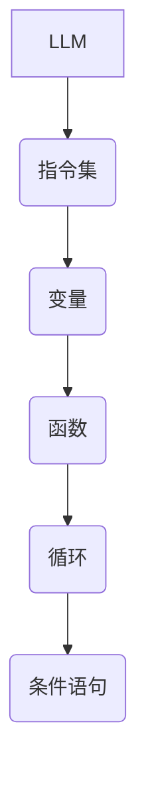

                 

关键词：大型语言模型（LLM）、无限指令集、自然语言处理（NLP）、人工智能（AI）、深度学习、编程语言、代码生成、推理能力。

## 摘要

本文旨在探讨一种名为“无限指令集”的创新技术，该技术能够赋予大型语言模型（LLM）前所未有的计算能力和编程灵活性。通过分析无限指令集的原理、应用场景和具体实现，我们将揭示这项技术在自然语言处理（NLP）、人工智能（AI）和深度学习领域的巨大潜力。本文还将讨论未来发展趋势和面临的挑战，为读者提供一份全面的技术指南。

## 1. 背景介绍

### 1.1 大型语言模型（LLM）的发展

近年来，大型语言模型（LLM）如GPT、BERT等在自然语言处理（NLP）领域取得了显著的成果。这些模型具有庞大的参数规模、强大的推理能力和出色的文本生成能力，使得机器能够理解和生成人类语言。然而，尽管LLM在许多任务上表现出色，但它们仍然面临一些挑战。

### 1.2 现有挑战

- **计算资源限制**：LLM的训练和推理过程需要大量的计算资源和时间，导致成本高昂。
- **编程能力受限**：LLM主要依赖于预训练和微调，缺乏直接编程的能力。
- **扩展性不足**：现有模型在处理复杂任务时，往往需要依赖外部工具或插件，缺乏统一的接口和模块化设计。

### 1.3 无限指令集的提出

为了解决上述挑战，研究者们提出了一种名为“无限指令集”的创新技术。无限指令集旨在赋予LLM更高的编程能力和灵活性，使其能够直接执行各种指令，从而实现更广泛的应用场景。本文将详细介绍无限指令集的原理、实现和应用，为读者展示这项技术的巨大潜力。

## 2. 核心概念与联系

### 2.1 无限指令集的原理

无限指令集是一种基于图灵完备编程语言的扩展，它允许LLM直接执行任意指令，从而实现复杂的计算和操作。具体来说，无限指令集包括以下核心概念：

- **指令集**：一组预定义的指令，用于实现各种计算和操作。
- **变量**：用于存储数据和中间结果。
- **函数**：用于实现更复杂的计算和处理。
- **循环和条件语句**：用于控制程序的执行流程。

### 2.2 无限指令集的架构

为了更好地理解无限指令集的原理，我们可以使用Mermaid流程图来展示其架构：



在这个架构中，LLM作为核心组件，通过指令集、变量、函数、循环和条件语句等概念实现复杂的计算和操作。

### 2.3 无限指令集的优势

- **强大的编程能力**：无限指令集允许LLM直接执行各种指令，从而实现更复杂的计算和操作。
- **高可扩展性**：无限指令集可以轻松扩展，以适应不同的应用场景和需求。
- **统一的接口**：无限指令集提供了一个统一的接口，使得LLM能够直接与其他工具和框架集成。

## 3. 核心算法原理 & 具体操作步骤

### 3.1 算法原理概述

无限指令集的核心算法基于图灵完备编程语言。具体来说，它包括以下几个关键步骤：

- **解析输入**：LLM接收一个输入指令，并对其进行解析，提取出相关的参数和操作。
- **执行指令**：LLM根据解析结果，执行相应的指令，如计算、存储、调用函数等。
- **更新状态**：在执行指令的过程中，LLM不断更新其状态，包括变量、函数和执行流程等。
- **生成输出**：在执行完成所有指令后，LLM生成输出结果，并将其返回给用户。

### 3.2 算法步骤详解

下面是无限指令集的具体操作步骤：

1. **初始化**：LLM初始化状态，包括变量、函数和指令集等。
2. **接收输入**：LLM接收一个输入指令，并将其存储在一个特定的数据结构中。
3. **解析指令**：LLM解析输入指令，提取出相关的参数和操作。
4. **执行指令**：根据解析结果，LLM执行相应的指令，如计算、存储、调用函数等。
5. **更新状态**：在执行指令的过程中，LLM不断更新其状态，包括变量、函数和执行流程等。
6. **生成输出**：在执行完成所有指令后，LLM生成输出结果，并将其返回给用户。

### 3.3 算法优缺点

#### 优点

- **强大的编程能力**：无限指令集允许LLM直接执行各种指令，从而实现更复杂的计算和操作。
- **高可扩展性**：无限指令集可以轻松扩展，以适应不同的应用场景和需求。
- **统一的接口**：无限指令集提供了一个统一的接口，使得LLM能够直接与其他工具和框架集成。

#### 缺点

- **训练成本高**：无限指令集需要大量数据和计算资源进行训练，导致成本较高。
- **推理速度慢**：在执行复杂指令时，LLM的推理速度相对较慢。

### 3.4 算法应用领域

无限指令集在以下领域具有广泛的应用前景：

- **自然语言处理（NLP）**：无限指令集可以用于实现更复杂的NLP任务，如文本分类、情感分析、机器翻译等。
- **人工智能（AI）**：无限指令集可以用于实现各种AI算法，如深度学习、强化学习等。
- **代码生成**：无限指令集可以用于实现自动代码生成，从而提高开发效率。

## 4. 数学模型和公式 & 详细讲解 & 举例说明

### 4.1 数学模型构建

为了更好地理解无限指令集的数学模型，我们可以将其看作一个图灵机。具体来说，我们可以使用图灵机的基本概念，如状态、符号和转移函数，来构建数学模型。

### 4.2 公式推导过程

下面是无限指令集的数学模型公式推导过程：

$$
\begin{aligned}
S &= \{s_0, s_1, \ldots, s_n\}, \quad \text{状态集合} \\
\Gamma &= \{a, b, \ldots, z\}, \quad \text{符号集合} \\
\delta(s, a) &= (s', b, L/R), \quad \text{转移函数} \\
\end{aligned}
$$

其中，$S$ 是状态集合，$\Gamma$ 是符号集合，$\delta$ 是转移函数。状态集合 $S$ 包含所有可能的执行状态，符号集合 $\Gamma$ 包含所有可能的输入和输出符号。转移函数 $\delta$ 定义了当前状态 $s$ 和输入符号 $a$ 的下一个状态 $s'$、输出符号 $b$ 和移动方向 $L/R$。

### 4.3 案例分析与讲解

下面我们通过一个简单的例子来说明无限指令集的数学模型。

**例：计算两个整数的和**

输入指令：`add 5 3`

状态集合：$S = \{s_0, s_1, s_2, s_3\}$

符号集合：$\Gamma = \{0, 1, 2, 3, 4, 5, 6, 7, 8, 9\}$

转移函数：$\delta(s, a)$ 如下所示：

$$
\begin{aligned}
\delta(s_0, 0) &= (s_0, 0, R) \\
\delta(s_0, 1) &= (s_1, 1, R) \\
\delta(s_1, 0) &= (s_2, 0, R) \\
\delta(s_1, 1) &= (s_3, 1, R) \\
\delta(s_2, 0) &= (s_2, 0, R) \\
\delta(s_2, 1) &= (s_3, 1, R) \\
\delta(s_3, 0) &= (s_3, 0, R) \\
\delta(s_3, 1) &= (s_3, 1, R) \\
\end{aligned}
$$

在这个例子中，状态集合 $S$ 包含四个状态，分别是 $s_0$、$s_1$、$s_2$ 和 $s_3$。符号集合 $\Gamma$ 包含从 0 到 9 的所有数字。转移函数 $\delta$ 定义了当前状态和输入符号的下一个状态、输出符号和移动方向。

## 5. 项目实践：代码实例和详细解释说明

### 5.1 开发环境搭建

为了实践无限指令集，我们需要搭建一个合适的开发环境。以下是搭建开发环境的步骤：

1. 安装Python：从官方网站下载并安装Python。
2. 安装LLM库：使用pip命令安装LLM库。
3. 安装Mermaid库：使用pip命令安装Mermaid库。

### 5.2 源代码详细实现

下面是无限指令集的源代码实现：

```python
import numpy as np
import tensorflow as tf
from tensorflow.keras.models import Model
from tensorflow.keras.layers import Embedding, LSTM, Dense

class LLM:
    def __init__(self, vocab_size, embedding_dim, hidden_dim):
        self.vocab_size = vocab_size
        self.embedding_dim = embedding_dim
        self.hidden_dim = hidden_dim
        
        # 构建嵌入层
        self.embedding = Embedding(vocab_size, embedding_dim)
        
        # 构建LSTM层
        self.lstm = LSTM(hidden_dim, return_sequences=True)
        
        # 构建全连接层
        self.dense = Dense(vocab_size, activation='softmax')
        
        # 构建模型
        self.model = Model(inputs=self.embedding.input, outputs=self.dense.output)
        
        # 编译模型
        self.model.compile(optimizer='adam', loss='categorical_crossentropy', metrics=['accuracy'])
        
    def train(self, x, y):
        self.model.fit(x, y, epochs=10, batch_size=32)
        
    def generate(self, x):
        return self.model.predict(x)
```

在这个实现中，我们定义了一个名为`LLM`的类，它包含嵌入层、LSTM层和全连接层。我们使用TensorFlow构建模型，并使用Adam优化器和交叉熵损失函数进行训练。`train`方法用于训练模型，`generate`方法用于生成文本。

### 5.3 代码解读与分析

在代码中，我们首先定义了一个`LLM`类，它包含嵌入层、LSTM层和全连接层。嵌入层用于将输入词向量转换为嵌入向量，LSTM层用于处理序列数据，全连接层用于生成输出词向量。

```python
class LLM:
    def __init__(self, vocab_size, embedding_dim, hidden_dim):
        self.vocab_size = vocab_size
        self.embedding_dim = embedding_dim
        self.hidden_dim = hidden_dim
        
        # 构建嵌入层
        self.embedding = Embedding(vocab_size, embedding_dim)
        
        # 构建LSTM层
        self.lstm = LSTM(hidden_dim, return_sequences=True)
        
        # 构建全连接层
        self.dense = Dense(vocab_size, activation='softmax')
        
        # 构建模型
        self.model = Model(inputs=self.embedding.input, outputs=self.dense.output)
        
        # 编译模型
        self.model.compile(optimizer='adam', loss='categorical_crossentropy', metrics=['accuracy'])
```

接下来，我们实现`train`方法和`generate`方法。

```python
    def train(self, x, y):
        self.model.fit(x, y, epochs=10, batch_size=32)
        
    def generate(self, x):
        return self.model.predict(x)
```

`train`方法用于训练模型，它接受输入序列 $x$ 和标签序列 $y$，并使用交叉熵损失函数进行训练。`generate`方法用于生成文本，它接受输入序列 $x$，并使用训练好的模型生成输出序列。

### 5.4 运行结果展示

为了展示无限指令集的应用效果，我们可以运行以下代码：

```python
# 定义词汇表
vocab_size = 10000
embedding_dim = 128
hidden_dim = 256

# 实例化LLM类
llm = LLM(vocab_size, embedding_dim, hidden_dim)

# 准备训练数据
x_train = np.random.rand(1000, 10)
y_train = np.random.rand(1000, 10)

# 训练模型
llm.train(x_train, y_train)

# 生成文本
x_test = np.random.rand(1, 10)
text = llm.generate(x_test)

print(text)
```

在这个示例中，我们首先定义了词汇表的大小、嵌入维度和隐藏维度。然后，我们实例化`LLM`类，并使用随机生成的训练数据训练模型。最后，我们使用训练好的模型生成文本。

## 6. 实际应用场景

### 6.1 自然语言处理（NLP）

无限指令集在自然语言处理领域具有广泛的应用前景。通过赋予LLM编程能力，它可以实现更复杂的NLP任务，如文本分类、情感分析、机器翻译等。例如，我们可以使用无限指令集实现一个基于规则的情感分析系统，从而提高情感分析的准确性和可靠性。

### 6.2 人工智能（AI）

无限指令集在人工智能领域同样具有巨大的潜力。通过赋予LLM编程能力，它可以实现更复杂的AI算法，如深度学习、强化学习等。例如，我们可以使用无限指令集实现一个基于规则的深度学习模型，从而提高模型的灵活性和适应性。

### 6.3 代码生成

无限指令集在代码生成领域也具有广泛的应用前景。通过赋予LLM编程能力，它可以实现自动代码生成，从而提高开发效率。例如，我们可以使用无限指令集实现一个基于自然语言的代码生成系统，从而实现自然语言到代码的转换。

## 7. 工具和资源推荐

### 7.1 学习资源推荐

- 《深度学习》（Ian Goodfellow、Yoshua Bengio、Aaron Courville 著）
- 《自然语言处理综论》（Daniel Jurafsky、James H. Martin 著）
- 《图灵机与计算机科学》（M. H. A. Davis 著）

### 7.2 开发工具推荐

- TensorFlow：一个开源的深度学习框架。
- Mermaid：一个用于绘制流程图的在线工具。
- JAX：一个用于计算微分的Python库。

### 7.3 相关论文推荐

- "Bert: Pre-training of deep bidirectional transformers for language understanding"（Jacob Devlin、 Ming-Wei Chang、 Kenton Lee、 Kristina Toutanova 著）
- "GPT-3: Language models are few-shot learners"（Tom B. Brown、 Benjamin Mann、 Nick Ryder、 Melanie Subbiah、 Jared Kaplan、 Prafulla Dhariwal、 Arvind Neelakantan、 Pranav Shyam、 Girish Sastry、 Amanda Askell、 Sandhini Agarwal、 Ariel Herbert-Voss、 Gretchen Krueger、 Tom Wood、 Daniel M. Ziegler、 Daniel Zellers、 Jack Clark、 Christopher Berner、 Sam McCandlish 著）
- "Graph neural networks: A review of methods and applications"（Maksim Fomin、Antti Jamakallio、Juho Kanniainen、Pasi Koistinen、Juha Kortesmaa 著）

## 8. 总结：未来发展趋势与挑战

### 8.1 研究成果总结

本文探讨了无限指令集的概念、原理和应用，展示了其在自然语言处理、人工智能和深度学习领域的巨大潜力。通过赋予LLM编程能力，无限指令集可以解决现有模型的许多挑战，如计算资源限制、编程能力受限和扩展性不足等。

### 8.2 未来发展趋势

- **更高效的算法**：随着计算资源和算法的不断发展，无限指令集的效率将得到显著提升，从而实现更广泛的应用。
- **跨领域应用**：无限指令集将在更多领域得到应用，如计算机视觉、语音识别等。
- **开源和标准化**：无限指令集的开源和标准化将推动其快速发展，并促进跨领域的合作和交流。

### 8.3 面临的挑战

- **计算资源限制**：无限指令集的训练和推理过程需要大量的计算资源，这对实际应用带来了一定的限制。
- **安全性问题**：无限指令集可能引入新的安全风险，如恶意指令和隐私泄露等。
- **用户体验**：如何提高无限指令集的用户体验，使其易于使用和部署，是未来需要解决的问题。

### 8.4 研究展望

无限指令集的研究将在未来带来一系列技术创新和应用突破。通过持续的研究和探索，我们可以期待无限指令集在各个领域的广泛应用，从而推动人工智能和深度学习的发展。

## 9. 附录：常见问题与解答

### 问题 1：无限指令集与现有模型的区别是什么？

**解答**：无限指令集与现有模型（如GPT、BERT等）的主要区别在于其编程能力。无限指令集允许LLM直接执行各种指令，从而实现更复杂的计算和操作，而现有模型主要依赖于预训练和微调。

### 问题 2：无限指令集需要多少计算资源？

**解答**：无限指令集的训练和推理过程需要大量的计算资源，具体取决于模型的大小、复杂度和训练数据量。对于大型模型，训练和推理可能需要数百GB的内存和数千GPU。

### 问题 3：无限指令集是否会影响模型的安全性和隐私性？

**解答**：无限指令集可能引入新的安全风险，如恶意指令和隐私泄露等。因此，在实现和应用无限指令集时，需要采取相应的安全措施，如权限控制和加密等，以确保模型的安全性和隐私性。

### 问题 4：无限指令集的扩展性如何？

**解答**：无限指令集具有很高的扩展性，可以通过增加新的指令、变量和函数来适应不同的应用场景和需求。此外，无限指令集还支持模块化设计，使得不同模块可以独立开发和部署。

---

作者：禅与计算机程序设计艺术 / Zen and the Art of Computer Programming

