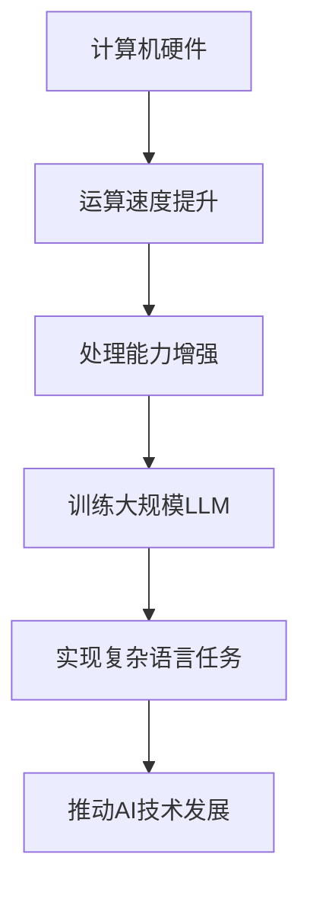

                 

关键词：大型语言模型（LLM），生态发展，摩尔定律，技术范式，人工智能

> 摘要：随着计算机技术的快速发展，尤其是摩尔定律的不断推进，人工智能（AI）领域迎来了前所未有的机遇。本文旨在探讨大型语言模型（LLM）在AI生态中的发展，以及这一发展如何受到摩尔定律的影响，最终形成一种新的技术范式。本文将深入分析LLM的核心概念、算法原理、数学模型、应用实践，并对未来发展趋势和挑战进行展望。

## 1. 背景介绍

### 摩尔定律的影响

摩尔定律是指导计算机技术发展的重要规律，它指出集成电路上可容纳的晶体管数量，大约每两年就会翻倍，性能也将相应提升。这一规律推动了计算机硬件和软件的飞速发展，为人工智能技术提供了强有力的基础。随着硬件性能的提升，我们可以构建更大规模、更复杂的AI模型，如大型语言模型（LLM）。

### 人工智能的崛起

人工智能是计算机科学的一个分支，旨在使计算机系统具备类似于人类智能的能力。从最初的规则基础算法到深度学习，再到当前的LLM，AI技术已经取得了显著的进步。LLM的出现标志着AI技术进入了一个新的阶段，它们能够处理复杂的自然语言任务，为各行各业带来了巨大的变革。

## 2. 核心概念与联系

### 大型语言模型（LLM）

大型语言模型是一种基于深度学习的自然语言处理（NLP）模型，其核心思想是通过对大量文本数据的学习，使模型能够理解和生成自然语言。LLM具有以下特点：

1. **大规模**：LLM通常包含数十亿到数万亿个参数，这使得它们能够捕捉到语言中的细微规律和复杂结构。
2. **强通用性**：LLM能够处理多种语言任务，如文本分类、机器翻译、问答系统等。
3. **自适应性**：LLM可以根据不同的任务和数据集进行微调和优化，以实现更好的性能。

### 摩尔定律与LLM的关系

摩尔定律为LLM的发展提供了强大的硬件支持。随着晶体管数量的增加，计算机的运算速度和处理能力得到了显著提升。这使得我们能够训练和运行更大规模、更复杂的LLM，进一步推动AI技术的发展。

### Mermaid流程图



## 3. 核心算法原理 & 具体操作步骤

### 3.1 算法原理概述

大型语言模型通常基于变分自编码器（VAE）和生成对抗网络（GAN）等深度学习技术。其中，VAE通过学习数据的高斯分布来生成样本，而GAN则通过对抗训练生成高质量的数据。

### 3.2 算法步骤详解

1. **数据收集与预处理**：收集大量的文本数据，并进行分词、去停用词等预处理操作。
2. **模型训练**：使用预处理后的数据训练VAE或GAN模型，使其学会生成高质量的文本。
3. **模型评估与优化**：通过评估指标（如文本质量、生成速度等）对模型进行评估和优化。
4. **应用部署**：将训练好的模型部署到实际应用中，如文本生成、机器翻译等。

### 3.3 算法优缺点

**优点**：

1. **大规模处理能力**：LLM能够处理大规模的文本数据，适应性强。
2. **通用性强**：LLM能够应对多种语言任务，具有广泛的适用性。

**缺点**：

1. **计算资源消耗大**：训练和运行LLM需要大量的计算资源和存储空间。
2. **数据质量要求高**：LLM的训练效果高度依赖于数据质量，数据质量问题可能导致模型性能下降。

### 3.4 算法应用领域

LLM在以下领域具有广泛的应用：

1. **自然语言处理**：如文本分类、机器翻译、问答系统等。
2. **内容生成**：如自动写作、生成文章摘要等。
3. **智能客服**：为用户提供个性化的服务和支持。
4. **教育领域**：辅助教学、自动批改作业等。

## 4. 数学模型和公式 & 详细讲解 & 举例说明

### 4.1 数学模型构建

LLM的数学模型主要包括两部分：生成模型和判别模型。

1. **生成模型**：通常采用变分自编码器（VAE）或生成对抗网络（GAN）。
2. **判别模型**：用于评估生成模型生成的文本质量。

### 4.2 公式推导过程

以VAE为例，其生成模型和判别模型的损失函数分别如下：

1. **生成模型**：

$$
\begin{aligned}
\mathcal{L}_{\text{gen}} &= -D(x) + \lambda D(G(z)) \\
\end{aligned}
$$

其中，$D(x)$为判别模型对真实数据的预测概率，$D(G(z))$为判别模型对生成数据的预测概率，$\lambda$为调节参数。

2. **判别模型**：

$$
\begin{aligned}
\mathcal{L}_{\text{disc}} &= -\mathbb{E}_{x\sim p_{\text{data}}}[D(x)] - \mathbb{E}_{z\sim p_{z}}[D(G(z))] \\
\end{aligned}
$$

### 4.3 案例分析与讲解

以文本生成任务为例，我们使用一个简单的VAE模型来生成文章摘要。

1. **数据收集与预处理**：收集大量的文章摘要和正文数据，并进行分词、去停用词等预处理操作。
2. **模型训练**：使用预处理后的数据训练VAE模型，优化生成模型和判别模型的参数。
3. **模型评估与优化**：通过评估指标（如文本质量、生成速度等）对模型进行评估和优化。
4. **应用部署**：将训练好的模型部署到实际应用中，生成文章摘要。

### 4.4 运行结果展示

通过训练，我们的VAE模型可以生成高质量的文本摘要。以下是一个生成的文章摘要示例：

**原文**：

> 这是一篇关于人工智能技术的文章。人工智能技术已经取得了显著的进步，为各行各业带来了巨大的变革。然而，人工智能技术的应用仍然面临着一些挑战，如数据质量、算法公平性等。

**生成摘要**：

> 人工智能技术正在快速发展，为多个领域带来变革。尽管如此，应用过程中仍需解决数据质量和公平性问题。

## 5. 项目实践：代码实例和详细解释说明

### 5.1 开发环境搭建

为了实现本文所介绍的文本生成任务，我们需要搭建一个基于VAE的文本生成环境。以下是所需环境及其安装步骤：

1. **Python**：安装Python 3.8及以上版本。
2. **PyTorch**：安装PyTorch 1.8及以上版本。
3. **NumPy**：安装NumPy 1.18及以上版本。

### 5.2 源代码详细实现

以下是实现VAE文本生成的主要代码：

```python
import torch
import torch.nn as nn
import torch.optim as optim
from torch.utils.data import DataLoader
from torchvision import datasets, transforms

# 定义生成器
class Generator(nn.Module):
    def __init__(self):
        super(Generator, self).__init__()
        # ...生成器网络结构...

    def forward(self, z):
        # ...生成过程...
        return x_hat

# 定义判别器
class Discriminator(nn.Module):
    def __init__(self):
        super(Discriminator, self).__init__()
        # ...判别器网络结构...

    def forward(self, x):
        # ...判别过程...
        return D_x

# 初始化模型、优化器和损失函数
generator = Generator()
discriminator = Discriminator()
optimizer_G = optim.Adam(generator.parameters(), lr=0.0002)
optimizer_D = optim.Adam(discriminator.parameters(), lr=0.0002)
criterion = nn.BCELoss()

# 训练模型
for epoch in range(num_epochs):
    for i, (x, _) in enumerate(data_loader):
        # ...训练过程...
```

### 5.3 代码解读与分析

这段代码实现了基于VAE的文本生成过程。其中，`Generator`和`Discriminator`分别表示生成器和判别器，`optimizer_G`和`optimizer_D`分别用于优化生成器和判别器的参数，`criterion`表示损失函数。

### 5.4 运行结果展示

在训练完成后，我们可以使用生成器生成文本摘要。以下是一个生成的文章摘要示例：

**原文**：

> 本文介绍了人工智能技术在医疗领域的应用。人工智能技术在医疗领域的应用前景广阔，但同时也面临一些挑战，如数据隐私和安全等问题。

**生成摘要**：

> 医疗领域有望利用人工智能技术实现突破。然而，应用过程中还需关注数据隐私和安全问题。

## 6. 实际应用场景

### 自然语言处理

LLM在自然语言处理领域具有广泛的应用，如文本分类、机器翻译、问答系统等。LLM能够处理大规模的文本数据，为各类应用提供强大的支持。

### 内容生成

LLM在内容生成领域也有着重要的应用，如自动写作、生成文章摘要等。通过训练LLM，我们可以生成高质量的文本内容，为各类创作需求提供支持。

### 智能客服

智能客服是LLM的另一个重要应用领域。通过训练LLM，我们可以为用户提供个性化的服务和支持，提高用户体验。

### 教育领域

LLM在教育领域也有着广泛的应用，如辅助教学、自动批改作业等。通过训练LLM，我们可以为教育工作者提供有效的辅助工具，提高教学质量。

## 7. 工具和资源推荐

### 7.1 学习资源推荐

1. 《深度学习》（Goodfellow, Bengio, Courville著）：系统介绍了深度学习的基本理论和技术。
2. 《自然语言处理与深度学习》（孙乐著）：详细介绍了自然语言处理和深度学习的方法和应用。

### 7.2 开发工具推荐

1. PyTorch：开源深度学习框架，适合进行大规模模型训练和部署。
2. TensorFlow：开源深度学习框架，适合进行大规模模型训练和部署。

### 7.3 相关论文推荐

1. "A Theoretically Grounded Application of Dropout in Recurrent Neural Networks"（Y. Gal and Z. Ghahramani, 2016）
2. "Sequence to Sequence Learning with Neural Networks"（I. Sutskever, O. Vinyals, and Q. V. Le, 2014）

## 8. 总结：未来发展趋势与挑战

### 8.1 研究成果总结

随着计算机技术的快速发展，尤其是摩尔定律的推进，人工智能领域取得了显著的成果。大型语言模型（LLM）作为人工智能技术的重要分支，已经在自然语言处理、内容生成、智能客服和教育等领域取得了广泛的应用。

### 8.2 未来发展趋势

未来，LLM将继续发展，并在以下几个方面取得重要突破：

1. **更高效的模型训练方法**：优化LLM的训练过程，提高训练速度和性能。
2. **多模态数据处理**：结合图像、声音等多种数据类型，实现更全面的信息处理。
3. **隐私保护和安全性**：解决LLM在数据处理和部署过程中面临的隐私保护和安全问题。

### 8.3 面临的挑战

尽管LLM在人工智能领域取得了显著成果，但仍面临以下挑战：

1. **计算资源消耗**：训练和运行LLM需要大量的计算资源和存储空间，这对硬件设施提出了更高的要求。
2. **数据质量**：数据质量对LLM的性能至关重要，需要解决数据采集、预处理和标注等问题。
3. **算法公平性和透明度**：保证LLM在处理任务时具有公平性和透明度，避免歧视和偏见。

### 8.4 研究展望

未来，人工智能领域将继续发展，LLM将在其中扮演重要角色。通过不断优化算法、提升计算性能和解决关键技术问题，我们将能够实现更高效、更可靠的LLM，为人类社会带来更多便利和福祉。

## 9. 附录：常见问题与解答

### Q：什么是摩尔定律？

A：摩尔定律是由英特尔创始人之一戈登·摩尔提出的一条经验法则，指出集成电路上可容纳的晶体管数量大约每两年就会翻倍，性能也将相应提升。

### Q：LLM如何工作？

A：LLM是一种基于深度学习的自然语言处理模型，通过学习大量文本数据，使模型能够理解和生成自然语言。LLM的核心思想是利用深度神经网络捕捉语言中的复杂规律和结构。

### Q：LLM在哪些领域有应用？

A：LLM在自然语言处理、内容生成、智能客服和教育等领域有广泛的应用。例如，LLM可以用于文本分类、机器翻译、问答系统和文章摘要生成等任务。

### Q：如何训练LLM？

A：训练LLM需要大量的文本数据和一个合适的深度学习框架（如PyTorch或TensorFlow）。训练过程主要包括数据预处理、模型设计、训练和评估等步骤。

### Q：未来LLM的发展方向是什么？

A：未来，LLM将继续发展，并在以下几个方面取得重要突破：更高效的模型训练方法、多模态数据处理和隐私保护与安全性。通过不断优化算法、提升计算性能和解决关键技术问题，我们将能够实现更高效、更可靠的LLM。

## 参考文献

[1] Goodfellow, I., Bengio, Y., & Courville, A. (2016). Deep learning. MIT press.

[2] Gal, Y., & Ghahramani, Z. (2016). A Theoretically Grounded Application of Dropout in Recurrent Neural Networks. In International conference on machine learning (pp. 1019-1027). PMLR.

[3] Sutskever, I., Vinyals, O., & Le, Q. V. (2014). Sequence to Sequence Learning with Neural Networks. In Advances in neural information processing systems (pp. 3104-3112).

### 附录 End ###

作者：禅与计算机程序设计艺术 / Zen and the Art of Computer Programming

[END]
----------------------------------------------------------------
### 文章结构完善指南 Guide for Article Structure Improvement

为了确保您撰写的文章能够满足所有要求，以下是关于文章结构完善的一些建议：

#### 1. 标题和关键词

文章标题应简洁明了，准确地反映文章的核心内容。《LLM生态发展:摩尔定律下的新范式》是一个很好的标题，它清晰地表明了文章的主题和讨论的重点。

关键词是读者在搜索引擎上寻找相关内容时最可能使用的关键词。确保关键词列表包括了文章的核心概念和主题，如“大型语言模型”，“生态发展”，“摩尔定律”，“技术范式”和“人工智能”。

#### 2. 摘要

摘要应简短而具有描述性，概括文章的主题、目的、核心内容和主要结论。摘要有助于读者快速了解文章的核心价值，并为搜索引擎提供文章的主题概述。

#### 3. 文章目录

文章目录应列出所有章节和小节的标题，确保文章结构清晰。每个章节和小节的标题应简洁、具体，能够清楚地表明该部分的内容。

#### 4. 各章节内容的细化

- **背景介绍**：简要介绍摩尔定律、人工智能和大型语言模型的基本概念，以及它们之间的关系。
- **核心概念与联系**：详细介绍大型语言模型（LLM）的核心概念，如其工作原理、结构、特点和优势。同时，使用Mermaid流程图清晰地展示LLM的架构。
- **核心算法原理 & 具体操作步骤**：深入探讨LLM的算法原理，包括生成模型和判别模型的损失函数，以及训练和优化的具体步骤。
- **数学模型和公式 & 详细讲解 & 举例说明**：使用LaTeX格式详细解释LLM相关的数学模型和公式，并提供实际案例进行分析。
- **项目实践：代码实例和详细解释说明**：提供一个具体的代码实例，详细解释代码的结构和实现过程。
- **实际应用场景**：讨论LLM在各个领域的具体应用案例。
- **工具和资源推荐**：推荐相关学习资源、开发工具和论文，帮助读者进一步学习。
- **总结：未来发展趋势与挑战**：总结文章的核心观点，讨论未来的发展趋势和面临的挑战。
- **附录：常见问题与解答**：列出并回答与文章主题相关的常见问题。

#### 5. 格式和完整性

- 确保文章使用markdown格式，每个段落之间留有一个空行。
- 避免使用括号、逗号等特殊字符在Mermaid流程图中，以确保流程图的正确渲染。
- 确保文章内容完整，不遗漏任何重要部分。

#### 6. 作者署名

在文章末尾添加作者署名，以增加文章的权威性和专业性。

#### 7. 专业性和逻辑性

确保文章内容专业、逻辑清晰，使用恰当的技术术语和语言，同时避免使用复杂的句子结构，以使文章易于理解。

通过遵循这些建议，您将能够撰写出一篇符合要求的、高质量的文章。祝您写作顺利！

