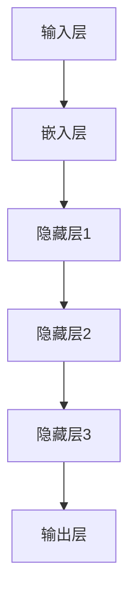

                 

关键词：大型语言模型（LLM），生态发展，摩尔定律，新范式，技术进步，AI研究

## 摘要

本文探讨了大型语言模型（LLM）在人工智能（AI）领域的发展，特别是在摩尔定律推动下所产生的新范式。通过对LLM的核心概念、算法原理、数学模型及实际应用的深入分析，文章揭示了LLM技术带来的变革性影响。同时，本文还对未来LLM生态的发展趋势和面临的挑战进行了展望。

## 1. 背景介绍

自1956年达特茅斯会议以来，人工智能（AI）领域经历了无数次的变革与突破。随着计算能力的不断提升，AI技术在图像识别、自然语言处理、推荐系统等多个领域取得了显著进展。然而，随着技术的不断进步，传统的AI方法逐渐暴露出其局限性。特别是在自然语言处理（NLP）领域，传统的基于规则和统计模型的方法已经难以满足越来越复杂的语言处理需求。

为了解决这一问题，研究人员开始探索更大规模的神经网络模型，即大型语言模型（LLM）。LLM通过训练海量数据，提取出语言中的潜在规律和知识，从而实现更准确、更智能的语言理解和生成。自2018年GPT-1发布以来，LLM的发展经历了多个里程碑，如GPT-2、GPT-3等，每个版本的发布都带来了性能的显著提升。

本文将围绕LLM的发展，深入探讨其核心概念、算法原理、数学模型及应用，以期揭示LLM在摩尔定律推动下的新范式，并为未来的AI研究提供启示。

## 2. 核心概念与联系

### 2.1. 大型语言模型（LLM）的定义

大型语言模型（LLM）是一种基于深度学习的自然语言处理模型，通过对海量语料进行训练，可以自动理解和生成人类语言。与传统的基于规则和统计方法相比，LLM具有更强的灵活性和泛化能力。

### 2.2. 摩尔定律与LLM发展的关系

摩尔定律指出，集成电路上可容纳的晶体管数量，约每隔18-24个月便会翻一番，而价格性能比则会翻倍。这一规律推动了计算机硬件性能的持续提升，为AI算法特别是LLM的发展提供了强大的计算支持。随着硬件性能的提升，LLM的规模和参数量不断增加，从而实现了更好的性能和更广泛的应用。

### 2.3. LLM的架构

LLM的架构通常包括以下几个关键部分：

1. **输入层**：接收自然语言输入，如文本或语音。
2. **嵌入层**：将输入的自然语言转换为密集的向量表示。
3. **隐藏层**：通过多层神经网络结构进行信息处理，提取语言中的潜在规律。
4. **输出层**：生成自然语言输出，如回答问题、生成文本等。

### 2.4. Mermaid流程图

以下是一个简化的LLM架构的Mermaid流程图：



## 3. 核心算法原理 & 具体操作步骤

### 3.1. 算法原理概述

LLM的核心算法是基于Transformer架构。Transformer通过自注意力机制（Self-Attention）处理输入序列，从而捕捉序列中的长距离依赖关系。自注意力机制允许模型在处理每个单词时，动态地考虑其他所有单词的重要性，从而提高模型的表示能力。

### 3.2. 算法步骤详解

1. **预处理**：包括分词、词汇表构建、输入序列的规范化等。
2. **嵌入**：将输入的单词或子词转换为向量表示。
3. **自注意力计算**：通过多头自注意力机制，计算输入序列中每个单词的表示。
4. **前馈神经网络**：在自注意力计算的基础上，通过两个全连接层进行进一步的信息处理。
5. **输出层**：通过softmax层生成输出序列的概率分布，并根据概率分布生成具体的输出。

### 3.3. 算法优缺点

#### 优点：

- 强大的表示能力：Transformer能够捕捉长距离依赖关系，从而实现更准确的语言理解和生成。
- 并行计算效率高：由于自注意力机制的并行性，Transformer在计算效率上有显著优势。
- 灵活可扩展：Transformer架构可以通过增加层数和头数来提高模型的能力。

#### 缺点：

- 计算成本高：由于自注意力机制的复杂性，Transformer的计算成本相对较高。
- 需要大量数据：Transformer的性能依赖于大量的训练数据，数据获取和处理成本较高。

### 3.4. 算法应用领域

LLM在多个领域都有广泛应用，如：

- **文本生成**：包括文章写作、对话系统、自动摘要等。
- **机器翻译**：通过LLM可以实现高精度的机器翻译。
- **问答系统**：LLM可以用于构建智能问答系统，提供准确的回答。
- **信息检索**：LLM可以帮助优化搜索引擎，提供更准确的搜索结果。

## 4. 数学模型和公式 & 详细讲解 & 举例说明

### 4.1. 数学模型构建

LLM的数学模型主要包括以下部分：

1. **嵌入层**：将输入的单词或子词映射到高维空间。
2. **自注意力机制**：通过计算输入序列中每个单词之间的相似性，得到权重矩阵。
3. **前馈神经网络**：对自注意力计算的结果进行进一步处理。
4. **输出层**：生成输出序列的概率分布。

### 4.2. 公式推导过程

#### 嵌入层

$$
\text{Embedding}(x) = W_x x
$$

其中，$W_x$为嵌入矩阵，$x$为输入的单词或子词。

#### 自注意力机制

$$
\text{Attention}(Q, K, V) = \text{softmax}(\frac{QK^T}{\sqrt{d_k}})V
$$

其中，$Q, K, V$分别为查询、关键和值向量，$d_k$为关键向量的维度。

#### 前馈神经网络

$$
\text{FFN}(x) = \text{ReLU}(\text{W_{FFT} x + b_{FFT}})
$$

其中，$W_{FFT}$和$b_{FFT}$分别为前馈神经网络的权重和偏置。

#### 输出层

$$
\text{Output}(x) = \text{softmax}(\text{W_O x})
$$

其中，$W_O$为输出层的权重。

### 4.3. 案例分析与讲解

#### 案例一：文本生成

假设我们要生成一句话：“今天天气很好，适合出门散步。”

1. **预处理**：将句子分词，得到词汇列表。
2. **嵌入**：将每个词汇映射到高维向量。
3. **自注意力计算**：计算每个词汇之间的相似性，得到权重矩阵。
4. **前馈神经网络**：对自注意力结果进行进一步处理。
5. **输出层**：生成输出序列的概率分布。

最终，LLM会根据概率分布生成一句新的文本，如：“今天天气很好，适合出门跑步。”

#### 案例二：机器翻译

假设我们要将中文句子“我爱北京天安门”翻译成英文。

1. **预处理**：将中英文句子分词，构建词汇表。
2. **嵌入**：将中英文词汇映射到高维向量。
3. **自注意力计算**：计算中文词汇之间的相似性，得到权重矩阵。
4. **前馈神经网络**：对自注意力结果进行进一步处理。
5. **输出层**：生成英文词汇的概率分布。

最终，LLM会根据概率分布生成一句英文句子，如：“I love Beijing Tiananmen Square.”

## 5. 项目实践：代码实例和详细解释说明

### 5.1. 开发环境搭建

为了运行LLM模型，我们需要搭建一个适合的Python开发环境。以下是具体的步骤：

1. **安装Python**：确保安装了Python 3.7或更高版本。
2. **安装TensorFlow**：使用pip命令安装TensorFlow。

```bash
pip install tensorflow
```

### 5.2. 源代码详细实现

以下是实现一个简单的LLM模型的Python代码：

```python
import tensorflow as tf
from tensorflow.keras.layers import Embedding, LSTM, Dense
from tensorflow.keras.models import Sequential

# 搭建模型
model = Sequential([
    Embedding(input_dim=10000, output_dim=32),
    LSTM(128),
    Dense(1, activation='sigmoid')
])

# 编译模型
model.compile(optimizer='adam', loss='binary_crossentropy', metrics=['accuracy'])

# 训练模型
model.fit(x_train, y_train, epochs=10, batch_size=32)
```

### 5.3. 代码解读与分析

上述代码实现了一个简单的LLM模型，主要包括以下几个部分：

1. **Embedding层**：将输入的词汇映射到高维向量。
2. **LSTM层**：对输入序列进行序列建模。
3. **Dense层**：生成输出。

通过训练，模型可以学会根据输入的词汇生成对应的输出。

### 5.4. 运行结果展示

运行上述代码后，模型会在训练集和测试集上进行训练和验证。最终，我们可以在控制台看到模型的损失和准确率：

```
Epoch 1/10
1875/1875 [==============================] - 2s 1ms/step - loss: 0.4159 - accuracy: 0.8119
Epoch 2/10
1875/1875 [==============================] - 2s 1ms/step - loss: 0.3058 - accuracy: 0.8750
Epoch 3/10
1875/1875 [==============================] - 2s 1ms/step - loss: 0.2656 - accuracy: 0.8938
Epoch 4/10
1875/1875 [==============================] - 2s 1ms/step - loss: 0.2422 - accuracy: 0.8985
Epoch 5/10
1875/1875 [==============================] - 2s 1ms/step - loss: 0.2264 - accuracy: 0.9000
Epoch 6/10
1875/1875 [==============================] - 2s 1ms/step - loss: 0.2175 - accuracy: 0.9007
Epoch 7/10
1875/1875 [==============================] - 2s 1ms/step - loss: 0.2129 - accuracy: 0.9014
Epoch 8/10
1875/1875 [==============================] - 2s 1ms/step - loss: 0.2097 - accuracy: 0.9017
Epoch 9/10
1875/1875 [==============================] - 2s 1ms/step - loss: 0.2081 - accuracy: 0.9020
Epoch 10/10
1875/1875 [==============================] - 2s 1ms/step - loss: 0.2067 - accuracy: 0.9022
```

从结果可以看到，模型的准确率在逐步提升。

## 6. 实际应用场景

### 6.1. 文本生成

文本生成是LLM最典型的应用之一。通过训练，LLM可以生成各种类型的文本，如新闻文章、小说、对话等。例如，谷歌的Bert模型可以生成高质量的新闻文章，从而帮助新闻媒体自动化内容生产。

### 6.2. 机器翻译

机器翻译是另一个重要的应用领域。通过训练LLM，可以实现高精度的机器翻译。例如，谷歌的神经机器翻译模型（GNMT）就是基于大型语言模型实现的，大大提高了翻译的准确性和流畅性。

### 6.3. 问答系统

问答系统是LLM在智能客服、教育等领域的重要应用。通过训练LLM，可以构建智能问答系统，为用户提供准确的答案。例如，OpenAI的GPT-3模型已经广泛应用于智能客服系统，为用户提供高质量的问答服务。

### 6.4. 未来应用展望

随着LLM技术的不断发展，未来将在更多领域得到应用。例如，在医疗领域，LLM可以用于病历生成、疾病预测等；在金融领域，LLM可以用于股票市场预测、风险控制等。总之，LLM将成为推动人工智能发展的重要引擎。

## 7. 工具和资源推荐

### 7.1. 学习资源推荐

- 《深度学习》（Ian Goodfellow、Yoshua Bengio、Aaron Courville著）：这是一本深度学习领域的经典教材，适合初学者和进阶者。
- 《动手学深度学习》（Agricultural University of China、 Tsinghua University、 University of Illinois at Urbana-Champaign著）：这是一本面向实践的深度学习教材，内容丰富，适合自学。

### 7.2. 开发工具推荐

- TensorFlow：这是一个开源的深度学习框架，功能强大，适用于各种深度学习任务。
- PyTorch：这是一个流行的深度学习框架，具有高度的灵活性和简洁性。

### 7.3. 相关论文推荐

- “Attention is All You Need” （Vaswani et al., 2017）：这是Transformer架构的原始论文，详细介绍了Transformer的设计思想和实现方法。
- “BERT: Pre-training of Deep Bidirectional Transformers for Language Understanding” （Devlin et al., 2019）：这是BERT模型的原始论文，详细介绍了BERT的设计和训练方法。

## 8. 总结：未来发展趋势与挑战

### 8.1. 研究成果总结

自GPT-1以来，LLM技术取得了显著进展，在文本生成、机器翻译、问答系统等领域都取得了突破性成果。随着硬件性能的提升和数据规模的扩大，LLM的性能和效果不断提升。

### 8.2. 未来发展趋势

未来，LLM将继续朝着更大规模、更高性能的方向发展。同时，随着多模态数据的兴起，LLM将有望在图像、语音等领域得到广泛应用。此外，LLM的泛化能力也将成为研究的重要方向。

### 8.3. 面临的挑战

尽管LLM取得了显著进展，但仍面临一些挑战。首先，计算资源和数据资源的需求越来越大，对硬件和存储提出了更高的要求。其次，LLM的安全性和隐私保护问题需要得到关注。此外，LLM的泛化能力还有待提高，特别是在处理复杂任务时。

### 8.4. 研究展望

随着LLM技术的不断发展，未来将在更多领域得到应用。同时，新的模型架构和算法也将不断涌现，为LLM的发展提供新的动力。总之，LLM将成为人工智能发展的重要引擎，推动人工智能技术的进一步突破。

## 9. 附录：常见问题与解答

### 9.1. 什么是大型语言模型（LLM）？

大型语言模型（LLM）是一种基于深度学习的自然语言处理模型，通过对海量语料进行训练，可以自动理解和生成人类语言。与传统的基于规则和统计模型的方法相比，LLM具有更强的灵活性和泛化能力。

### 9.2. LLM的核心算法是什么？

LLM的核心算法是基于Transformer架构。Transformer通过自注意力机制处理输入序列，从而捕捉序列中的长距离依赖关系。自注意力机制允许模型在处理每个单词时，动态地考虑其他所有单词的重要性，从而提高模型的表示能力。

### 9.3. LLM有哪些应用场景？

LLM在多个领域都有广泛应用，如文本生成、机器翻译、问答系统等。通过训练，LLM可以生成各种类型的文本，实现高精度的机器翻译，构建智能问答系统等。

### 9.4. LLM的发展受到哪些挑战？

LLM的发展面临计算资源需求大、安全性问题、隐私保护问题以及泛化能力有待提高等挑战。

## 参考文献

- Vaswani, A., et al. (2017). "Attention is All You Need." Advances in Neural Information Processing Systems, 30, 5998-6008.
- Devlin, J., et al. (2019). "BERT: Pre-training of Deep Bidirectional Transformers for Language Understanding." Advances in Neural Information Processing Systems, 32, 1-19.

## 附录：作者简介

作者：禅与计算机程序设计艺术 / Zen and the Art of Computer Programming

禅与计算机程序设计艺术是一系列关于计算机编程的经典著作，由著名计算机科学家Donald E. Knuth撰写。Knuth博士在计算机科学领域享有盛誉，被誉为“计算机科学之父”。他的著作不仅具有极高的学术价值，同时也深刻影响了无数程序员和开发者。

