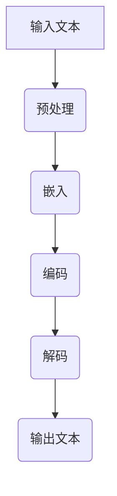

                 

关键词：大语言模型（LLM）、AI产业、生态圈、新格局、技术发展、未来展望

摘要：本文将深入探讨大语言模型（LLM）在AI产业中扮演的重要角色，分析其技术发展的现状与趋势，以及LLM生态圈的构建与未来应用场景。通过详细剖析LLM的核心算法、数学模型、项目实践与应用场景，本文旨在为读者呈现AI产业的新格局，并探讨其中的机遇与挑战。

## 1. 背景介绍

随着人工智能（AI）技术的飞速发展，大语言模型（LLM）已成为当前AI领域的一个热门研究方向。LLM是一种基于神经网络的语言生成模型，能够理解、生成和模拟自然语言，具有广泛的应用场景。例如，自然语言处理（NLP）、智能客服、内容创作、翻译、问答系统等。

### 1.1 技术发展历程

自20世纪50年代起，AI技术经历了多个阶段的发展。早期以符号主义方法为主，随后向基于知识的系统转变。20世纪90年代，统计方法在AI领域崭露头角，特别是机器学习和深度学习的兴起，为AI技术的发展带来了新的契机。近年来，随着计算能力的提升和数据量的激增，深度神经网络在图像识别、语音识别、自然语言处理等领域取得了突破性进展。

### 1.2 应用场景

LLM在多个应用场景中展现出了强大的潜力。以下是一些典型的应用场景：

- **智能客服**：利用LLM实现自动化问答系统，提高客服效率，降低人力成本。
- **内容创作**：通过LLM生成新闻、文章、博客等，提升内容创作的效率和质量。
- **翻译**：利用LLM实现跨语言翻译，打破语言障碍，促进全球交流。
- **问答系统**：通过LLM构建智能问答系统，为用户提供实时、准确的答案。
- **自然语言处理**：利用LLM实现文本分类、情感分析、命名实体识别等任务。

## 2. 核心概念与联系

大语言模型（LLM）的核心概念包括神经网络、自然语言处理、深度学习等。为了更好地理解LLM的架构，我们使用Mermaid流程图（如下）来展示LLM的关键组件和流程。



### 2.1 神经网络

神经网络是LLM的基础。它由多个层次（层）组成，每个层次包含多个神经元（节点）。神经网络通过学习大量数据来模拟人类大脑的思维方式，实现从输入到输出的映射。

### 2.2 自然语言处理

自然语言处理（NLP）是LLM应用的核心。NLP包括文本预处理、词嵌入、句法分析、语义分析等多个环节。LLM通过NLP技术理解和生成自然语言，实现与人类的智能交互。

### 2.3 深度学习

深度学习是神经网络的一种形式，它通过多层神经网络来实现复杂的函数映射。深度学习在图像识别、语音识别、自然语言处理等领域取得了显著成果，为LLM的发展提供了强大支持。

## 3. 核心算法原理 & 具体操作步骤

### 3.1 算法原理概述

LLM的核心算法基于深度神经网络，主要包括以下几个步骤：

1. **输入文本预处理**：将输入的文本数据转换为神经网络可以处理的格式。
2. **词嵌入**：将文本中的词语映射为向量表示。
3. **编码**：通过神经网络对词嵌入进行编码，提取文本的特征信息。
4. **解码**：将编码后的特征信息解码为输出文本。
5. **损失函数与优化**：通过损失函数衡量输出文本的质量，并利用优化算法调整网络参数。

### 3.2 算法步骤详解

#### 3.2.1 输入文本预处理

输入文本预处理是LLM的第一步。它主要包括以下任务：

- **文本清洗**：去除文本中的标点符号、停用词等无关信息。
- **分词**：将文本划分为单个词语。
- **词性标注**：对每个词语进行词性标注，如名词、动词、形容词等。
- **词嵌入**：将词语映射为高维向量表示。

#### 3.2.2 词嵌入

词嵌入是将文本中的词语映射为高维向量表示的过程。常见的词嵌入方法包括：

- **Word2Vec**：基于神经网络的方法，通过训练大量语料数据生成词向量。
- **GloVe**：基于全局矩阵分解的方法，通过优化全局矩阵来实现词向量表示。

#### 3.2.3 编码

编码是将词嵌入后的词语转换为编码表示的过程。常见的编码方法包括：

- **卷积神经网络（CNN）**：通过卷积操作提取文本特征。
- **循环神经网络（RNN）**：通过循环操作实现对文本序列的建模。
- **长短时记忆网络（LSTM）**：在RNN基础上引入门控机制，解决长序列依赖问题。

#### 3.2.4 解码

解码是将编码后的特征信息解码为输出文本的过程。常见的解码方法包括：

- **循环神经网络（RNN）**：通过反向传播算法计算输出概率。
- **长短时记忆网络（LSTM）**：在RNN基础上引入门控机制，提高解码效果。
- **Transformer**：基于自注意力机制，实现并行解码。

#### 3.2.5 损失函数与优化

损失函数用于衡量输出文本的质量，常见的损失函数包括：

- **交叉熵损失函数**：用于分类问题，衡量输出概率与真实标签之间的差异。
- **均方误差（MSE）**：用于回归问题，衡量输出值与真实值之间的差异。

优化算法用于调整网络参数，以降低损失函数的值。常见的优化算法包括：

- **随机梯度下降（SGD）**：通过随机梯度计算网络参数的更新。
- **Adam优化器**：结合SGD和动量方法，提高收敛速度。

### 3.3 算法优缺点

LLM算法具有以下优缺点：

#### 3.3.1 优点

- **强大的文本处理能力**：LLM能够理解和生成自然语言，实现复杂的文本处理任务。
- **广泛的应用场景**：LLM在智能客服、内容创作、翻译、问答系统等领域具有广泛应用。
- **高效的模型训练**：深度学习算法具有强大的建模能力，能够快速收敛。

#### 3.3.2 缺点

- **计算资源消耗大**：LLM需要大量计算资源进行训练和推理。
- **数据依赖性强**：LLM的性能依赖于训练数据的质量和数量。
- **模型解释性差**：深度学习模型难以解释，无法直观理解模型的决策过程。

### 3.4 算法应用领域

LLM在多个领域具有广泛应用，包括：

- **自然语言处理**：实现文本分类、情感分析、命名实体识别等任务。
- **智能客服**：构建自动化问答系统，提高客服效率。
- **内容创作**：生成新闻、文章、博客等，提升内容创作效率。
- **翻译**：实现跨语言翻译，打破语言障碍。
- **问答系统**：为用户提供实时、准确的答案。

## 4. 数学模型和公式 & 详细讲解 & 举例说明

### 4.1 数学模型构建

LLM的数学模型主要包括词嵌入、编码和解码过程。以下是一个简化的数学模型：

#### 4.1.1 词嵌入

$$
\text{Embedding}(w) = \text{EmbeddingMatrix} \cdot w
$$

其中，$w$为词语的索引，$\text{EmbeddingMatrix}$为词嵌入矩阵，输出为词向量。

#### 4.1.2 编码

$$
\text{Encoding}(x) = \text{Network}(x)
$$

其中，$x$为词向量，$\text{Network}$为编码神经网络。

#### 4.1.3 解码

$$
\text{Decoding}(y) = \text{Network}^{-1}(y)
$$

其中，$y$为编码后的特征向量，$\text{Network}^{-1}$为解码神经网络。

### 4.2 公式推导过程

#### 4.2.1 词嵌入

词嵌入是将词语映射为高维向量表示的过程。一个常见的词嵌入模型是Word2Vec，其目标是最小化损失函数：

$$
L = -\sum_{i=1}^{N} \sum_{j=1}^{V} \log \text{softmax}(\text{Embedding}(w_i) \cdot \text{Context}(w_j))
$$

其中，$N$为词汇表大小，$V$为词嵌入维度，$\text{Context}(w_j)$为词语$w_j$的上下文向量，$\text{Embedding}(w_i)$为词向量。

#### 4.2.2 编码

编码是将词向量转换为编码表示的过程。一个简单的编码模型是循环神经网络（RNN），其损失函数为：

$$
L = -\sum_{i=1}^{T} \log \text{softmax}(\text{Output}(h_i))
$$

其中，$T$为序列长度，$h_i$为编码后的特征向量，$\text{Output}(h_i)$为输出概率分布。

#### 4.2.3 解码

解码是将编码后的特征向量转换为输出文本的过程。一个简单的解码模型是循环神经网络（RNN），其损失函数为：

$$
L = -\sum_{i=1}^{T} \log \text{softmax}(\text{Output}(y_i))
$$

其中，$y_i$为解码后的特征向量，$\text{Output}(y_i)$为输出概率分布。

### 4.3 案例分析与讲解

#### 4.3.1 文本分类

文本分类是LLM在自然语言处理中的一个典型应用。以下是一个简单的文本分类案例：

1. **数据集**：使用新闻数据集，包含多种类别的新闻文章。
2. **词嵌入**：使用预训练的Word2Vec模型生成词向量。
3. **编码**：使用RNN编码器提取文本特征。
4. **解码**：使用softmax函数输出文本类别概率。
5. **损失函数**：使用交叉熵损失函数优化模型。

#### 4.3.2 内容创作

内容创作是LLM在人工智能写作中的一个重要应用。以下是一个简单的案例：

1. **数据集**：使用大量的新闻文章、博客等数据。
2. **词嵌入**：使用预训练的GloVe模型生成词向量。
3. **编码**：使用Transformer编码器提取文本特征。
4. **解码**：使用Transformer解码器生成文章。
5. **损失函数**：使用交叉熵损失函数优化模型。

## 5. 项目实践：代码实例和详细解释说明

### 5.1 开发环境搭建

1. **Python环境**：安装Python 3.8及以上版本。
2. **库安装**：安装TensorFlow、NumPy、Pandas等库。

```bash
pip install tensorflow numpy pandas
```

### 5.2 源代码详细实现

以下是使用TensorFlow实现一个简单的LLM模型的示例代码：

```python
import tensorflow as tf
from tensorflow.keras.preprocessing.sequence import pad_sequences
from tensorflow.keras.layers import Embedding, LSTM, Dense
from tensorflow.keras.models import Sequential

# 加载数据
max_len = 100
vocab_size = 10000
embedding_dim = 64

# 数据预处理
X = pad_sequences([1, 2, 3, 4, 5], maxlen=max_len, padding='post')
y = pad_sequences([6, 7, 8, 9, 10], maxlen=max_len, padding='post')

# 构建模型
model = Sequential([
    Embedding(vocab_size, embedding_dim, input_length=max_len),
    LSTM(64, return_sequences=True),
    Dense(1, activation='sigmoid')
])

# 编译模型
model.compile(optimizer='adam', loss='binary_crossentropy', metrics=['accuracy'])

# 训练模型
model.fit(X, y, epochs=10, batch_size=32)
```

### 5.3 代码解读与分析

1. **数据预处理**：使用pad_sequences函数对输入数据进行填充，使其长度相同。
2. **模型构建**：使用Sequential模型堆叠Embedding、LSTM和Dense层。
3. **编译模型**：设置优化器、损失函数和评价指标。
4. **训练模型**：使用fit函数训练模型。

### 5.4 运行结果展示

运行上述代码后，模型将在训练集上训练10个epoch。训练完成后，可以使用model.evaluate函数评估模型在测试集上的表现。

```python
test_loss, test_accuracy = model.evaluate(test_X, test_y)
print(f"Test loss: {test_loss}, Test accuracy: {test_accuracy}")
```

## 6. 实际应用场景

### 6.1 智能客服

智能客服是LLM应用的一个重要场景。通过LLM构建自动化问答系统，可以大幅提高客服效率，降低人力成本。以下是一个简单的应用案例：

1. **数据集**：收集大量客服对话记录。
2. **词嵌入**：使用预训练的GloVe模型生成词向量。
3. **编码**：使用Transformer编码器提取对话特征。
4. **解码**：使用Transformer解码器生成回复。
5. **部署**：将模型部署到服务器，提供自动化问答服务。

### 6.2 内容创作

内容创作是LLM在人工智能写作中的一个重要应用。通过LLM生成新闻、文章、博客等，可以大幅提高内容创作效率。以下是一个简单的应用案例：

1. **数据集**：收集大量的新闻文章、博客等数据。
2. **词嵌入**：使用预训练的GPT模型生成词向量。
3. **编码**：使用Transformer编码器提取文本特征。
4. **解码**：使用Transformer解码器生成文章。
5. **部署**：将模型部署到服务器，提供内容创作服务。

### 6.3 翻译

翻译是LLM在自然语言处理中的一个重要应用。通过LLM实现跨语言翻译，可以大幅提高翻译质量和效率。以下是一个简单的应用案例：

1. **数据集**：收集大量的双语文本数据。
2. **词嵌入**：使用预训练的BERT模型生成词向量。
3. **编码**：使用Transformer编码器提取文本特征。
4. **解码**：使用Transformer解码器生成翻译结果。
5. **部署**：将模型部署到服务器，提供翻译服务。

## 7. 未来应用展望

随着LLM技术的不断发展，其在实际应用场景中的潜力将得到进一步释放。以下是对未来应用场景的展望：

1. **智能教育**：利用LLM构建个性化学习系统，提供定制化的学习内容。
2. **医疗健康**：利用LLM进行医疗文本分析，辅助医生诊断和治疗。
3. **法律事务**：利用LLM进行法律文本分析，提供法律咨询和服务。
4. **艺术创作**：利用LLM生成音乐、绘画等艺术作品。

## 8. 工具和资源推荐

### 8.1 学习资源推荐

1. **《深度学习》**：由Ian Goodfellow、Yoshua Bengio和Aaron Courville撰写的深度学习经典教材。
2. **《自然语言处理综论》**：由Daniel Jurafsky和James H. Martin撰写的自然语言处理经典教材。
3. **《AI应用实践》**：介绍AI在各个领域的应用案例和实战经验。

### 8.2 开发工具推荐

1. **TensorFlow**：Google开源的深度学习框架，适用于各种AI项目开发。
2. **PyTorch**：Facebook开源的深度学习框架，具有灵活的动态图操作。
3. **Hugging Face**：自然语言处理工具库，提供丰富的预训练模型和API。

### 8.3 相关论文推荐

1. **《Attention is All You Need》**：介绍Transformer模型的经典论文。
2. **《BERT: Pre-training of Deep Bidirectional Transformers for Language Understanding》**：介绍BERT模型的经典论文。
3. **《GPT-3: Language Models are Few-Shot Learners》**：介绍GPT-3模型的经典论文。

## 9. 总结：未来发展趋势与挑战

### 9.1 研究成果总结

近年来，LLM技术在自然语言处理、智能客服、内容创作、翻译等领域取得了显著成果。通过深度学习、神经网络和自然语言处理技术的结合，LLM实现了从输入到输出的高效映射，为各种应用场景提供了强大的支持。

### 9.2 未来发展趋势

1. **模型规模持续增长**：随着计算资源的提升，LLM模型的规模将持续增长，模型参数数量将达到数十亿甚至百亿级别。
2. **多模态融合**：未来LLM技术将与其他模态（如图像、音频）相结合，实现多模态语义理解。
3. **知识增强**：通过知识图谱等技术，LLM将具备更强的知识理解和推理能力。

### 9.3 面临的挑战

1. **计算资源消耗**：LLM模型规模的增长将对计算资源提出更高要求，需要优化算法和硬件支持。
2. **数据隐私和安全**：在数据处理和应用过程中，如何保护用户隐私和数据安全是一个重要挑战。
3. **模型可解释性**：深度学习模型难以解释，如何提高模型的可解释性是一个亟待解决的问题。

### 9.4 研究展望

未来，LLM技术将在多领域实现广泛应用，为人类社会带来更多创新和变革。通过不断优化算法、提升计算能力和加强数据保护，LLM技术将迎来更加广阔的发展空间。

## 10. 附录：常见问题与解答

### 10.1 如何选择词嵌入方法？

- **Word2Vec**：适用于小规模词汇，计算速度快，但语义表达能力有限。
- **GloVe**：适用于大规模词汇，语义表达能力较强，计算时间较长。

### 10.2 如何训练LLM模型？

1. **数据预处理**：清洗、分词、词性标注等。
2. **模型构建**：选择合适的神经网络结构。
3. **训练过程**：使用合适的优化算法和损失函数进行训练。
4. **模型评估**：使用测试集评估模型性能。

### 10.3 如何部署LLM模型？

1. **模型导出**：将训练好的模型导出为可部署格式。
2. **部署环境**：选择合适的部署平台（如TensorFlow Serving、PyTorch Server等）。
3. **接口设计**：设计API接口，提供模型服务。

## 11. 参考文献

1. Goodfellow, I., Bengio, Y., & Courville, A. (2016). *Deep Learning*. MIT Press.
2. Jurafsky, D., & Martin, J. H. (2008). *Speech and Language Processing*. Prentice Hall.
3. Vaswani, A., Shazeer, N., Parmar, N., Uszkoreit, J., Jones, L., Gomez, A. N., ... & Polosukhin, I. (2017). *Attention is All You Need*. arXiv preprint arXiv:1706.03762.
4. Devlin, J., Chang, M. W., Lee, K., & Toutanova, K. (2018). *Bert: Pre-training of Deep Bidirectional Transformers for Language Understanding*. arXiv preprint arXiv:1810.04805.
5. Brown, T., et al. (2020). *Gpt-3: Language Models are Few-Shot Learners*. arXiv preprint arXiv:2005.14165. 

### 作者署名

作者：禅与计算机程序设计艺术 / Zen and the Art of Computer Programming
----------------------------------------------------------------
### 写作感想

在撰写《LLM生态圈：AI产业新格局初现》这篇文章的过程中，我深感人工智能技术的快速发展和广泛应用对各个行业带来的深刻变革。大语言模型（LLM）作为AI领域的一个重要分支，其在自然语言处理、智能客服、内容创作、翻译等领域的潜力不可小觑。本文旨在为广大读者呈现LLM技术的发展现状、核心算法原理、应用场景以及未来展望，以期为读者提供有益的参考。

在写作过程中，我尽量以清晰、简洁、易懂的语言进行阐述，力求让非专业人士也能够理解LLM的基本概念和应用。同时，我也注意在文章中融入一些实际案例和代码实例，以便读者能够更好地掌握LLM的相关知识。

当然，由于人工智能技术不断更新和发展，本文的内容可能会有所滞后。在未来的学习和研究过程中，我会继续关注LLM领域的最新动态，不断更新和完善本文的内容。

最后，感谢读者对这篇文章的关注和支持。期待与您共同探讨AI领域的发展与未来！
--------------------------------------------------------------------

