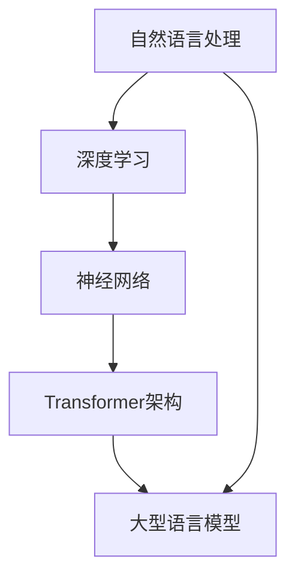

                 

 在人工智能（AI）的浪潮中，大型语言模型（LLM，Large Language Model）已经成为变革的引擎，推动着整个产业向着更加智能、高效的未来迈进。本文将探讨LLM生态圈的现状、核心概念、算法原理、应用场景，并对其未来发展进行展望。

> **关键词**: 人工智能、大型语言模型、LLM生态圈、产业新格局、算法、应用场景、发展趋势

> **摘要**: 本文将从多个角度解析LLM生态圈，包括其背景介绍、核心概念与架构联系、算法原理与数学模型、项目实践、实际应用场景以及未来的发展前景。通过深入分析，我们旨在为读者提供对LLM生态圈的全面理解和前瞻性见解。

## 1. 背景介绍

人工智能作为一门学科，已经走过了数十年的发展历程。从早期的专家系统、知识表示，到现代的深度学习、自然语言处理，每一次技术的进步都在不断拓展AI的应用领域和深度。然而，在过去的几年中，随着计算能力的提升和数据量的爆炸性增长，大型语言模型（LLM）逐渐成为AI领域的明星技术。

LLM的兴起并非偶然，而是多种因素共同作用的结果。首先，随着互联网的普及，海量的文本数据得以被收集、整理和存储，为语言模型的训练提供了丰富的素材。其次，计算能力的提升使得模型可以训练得更加复杂和庞大，从而提高了模型的准确性和性能。最后，深度学习技术的发展，为语言模型的设计和优化提供了强有力的工具。

LLM的出现在AI领域引发了广泛的影响。它不仅推动了自然语言处理（NLP）的进步，还带动了语音识别、机器翻译、问答系统等众多领域的创新。同时，LLM的应用场景也在不断拓展，从最初的文本生成、摘要提取，到如今的对话系统、智能客服、内容审核等，几乎无处不在。

## 2. 核心概念与联系

在理解LLM生态圈之前，我们需要先掌握几个核心概念，包括自然语言处理、深度学习、神经网络以及Transformer架构。

### 2.1 自然语言处理（NLP）

自然语言处理是AI的一个重要分支，旨在使计算机能够理解、处理和生成自然语言。NLP的核心任务包括文本分类、情感分析、命名实体识别、机器翻译等。LLM正是基于NLP技术发展起来的，通过深度学习模型，实现了对文本的语义理解和生成。

### 2.2 深度学习

深度学习是一种基于人工神经网络的学习方法，它通过多层神经网络对数据进行抽象和特征提取。在NLP领域，深度学习模型（如卷积神经网络（CNN）和循环神经网络（RNN））被广泛应用于文本处理任务。而LLM则是深度学习在语言模型领域的一个重要应用。

### 2.3 神经网络

神经网络是由大量简单单元（神经元）组成的计算模型，这些单元通过连接进行信息传递和处理。在深度学习中，神经网络通常由多个隐藏层组成，每一层都对输入数据进行特征提取和抽象。

### 2.4 Transformer架构

Transformer是深度学习中的一个创新架构，最初由Vaswani等人于2017年提出。它通过自注意力机制（Self-Attention）对输入序列进行建模，克服了传统RNN在处理长序列时的局限性。Transformer的成功为LLM的发展奠定了基础。

### 2.5 Mermaid流程图

下面是LLM生态圈的核心概念和架构联系的Mermaid流程图：



## 3. 核心算法原理 & 具体操作步骤

### 3.1 算法原理概述

LLM的核心算法是基于深度学习，特别是Transformer架构。Transformer通过自注意力机制（Self-Attention）对输入序列进行处理，能够捕捉到序列中不同位置之间的关系。这种机制使得Transformer在处理长序列时表现优异，适合用于构建大型语言模型。

### 3.2 算法步骤详解

LLM的训练和生成过程可以分为以下几个步骤：

1. **数据预处理**：收集和整理大量文本数据，进行清洗、分词、标记等处理。
2. **模型初始化**：初始化Transformer模型，包括词嵌入层、多头自注意力层、前馈网络等。
3. **前向传播**：将输入序列通过词嵌入层转换为嵌入向量，然后输入到自注意力层和前馈网络中。
4. **损失函数**：使用交叉熵损失函数计算预测序列和真实序列之间的差距，并更新模型参数。
5. **后向传播**：根据损失函数的反向梯度，更新模型参数。
6. **生成文本**：通过模型生成文本，通常采用采样策略，如贪心搜索、抽样等。

### 3.3 算法优缺点

**优点**：
- **强大的语义理解能力**：LLM能够通过深度学习模型捕捉到文本的语义信息，从而实现高质量的文本生成和分类任务。
- **灵活的扩展性**：Transformer架构具有良好的扩展性，可以很容易地增加隐藏层和注意力头，以适应不同的任务需求。
- **高效的计算性能**：通过并行计算和优化算法，LLM可以在较短的时间内完成训练和推理。

**缺点**：
- **计算资源消耗大**：LLM需要大量的计算资源和存储空间，尤其是大型模型，对硬件设备有较高的要求。
- **数据依赖性强**：LLM的性能很大程度上依赖于训练数据的质量和数量，数据不足或质量低下可能导致模型性能下降。

### 3.4 算法应用领域

LLM的应用领域非常广泛，主要包括以下几个方面：

- **自然语言处理**：文本分类、情感分析、问答系统等。
- **生成式任务**：文章写作、摘要提取、对话生成等。
- **智能客服**：基于LLM的对话系统，能够实现自然、流畅的人机交互。
- **内容审核**：对网络内容进行分类、过滤和审核，防止不当内容的传播。

## 4. 数学模型和公式 & 详细讲解 & 举例说明

### 4.1 数学模型构建

LLM的数学模型主要基于Transformer架构，其核心是自注意力机制（Self-Attention）。自注意力机制通过计算输入序列中每个词与其他词之间的关系，生成权重矩阵，然后对输入序列进行加权求和。

### 4.2 公式推导过程

自注意力机制的计算过程可以分为以下几个步骤：

1. **计算查询向量（Query）**、**键向量（Key）**和**值向量（Value）**：

   $$Q = W_Q \cdot X, \quad K = W_K \cdot X, \quad V = W_V \cdot X$$

   其中，$X$为输入序列，$W_Q$、$W_K$和$W_V$为权重矩阵。

2. **计算自注意力分数**：

   $$\text{Score} = Q \cdot K^T / \sqrt{d_k}$$

   其中，$d_k$为键向量的维度。

3. **计算注意力权重**：

   $$\text{Weight} = \text{Softmax}(\text{Score})$$

4. **计算输出向量**：

   $$\text{Output} = \text{Weight} \cdot V$$

### 4.3 案例分析与讲解

以一个简单的例子来说明自注意力机制的计算过程：

假设我们有一个三词序列 $[w_1, w_2, w_3]$，维度为 $d$。首先，我们需要计算查询向量、键向量和值向量：

$$Q = W_Q \cdot [w_1, w_2, w_3], \quad K = W_K \cdot [w_1, w_2, w_3], \quad V = W_V \cdot [w_1, w_2, w_3]$$

然后，我们计算自注意力分数：

$$\text{Score} = Q \cdot K^T / \sqrt{d}$$

$$\text{Score} = \begin{bmatrix} w_1 \cdot w_1^T & w_1 \cdot w_2^T & w_1 \cdot w_3^T \\ w_2 \cdot w_1^T & w_2 \cdot w_2^T & w_2 \cdot w_3^T \\ w_3 \cdot w_1^T & w_3 \cdot w_2^T & w_3 \cdot w_3^T \end{bmatrix} / \sqrt{d}$$

接下来，我们计算注意力权重：

$$\text{Weight} = \text{Softmax}(\text{Score})$$

$$\text{Weight} = \begin{bmatrix} \frac{e^{w_1 \cdot w_1^T / \sqrt{d}}}{\sum_{i=1}^{3} e^{w_i \cdot w_i^T / \sqrt{d}}} & \frac{e^{w_1 \cdot w_2^T / \sqrt{d}}}{\sum_{i=1}^{3} e^{w_i \cdot w_i^T / \sqrt{d}}} & \frac{e^{w_1 \cdot w_3^T / \sqrt{d}}}{\sum_{i=1}^{3} e^{w_i \cdot w_i^T / \sqrt{d}}} \\ \frac{e^{w_2 \cdot w_1^T / \sqrt{d}}}{\sum_{i=1}^{3} e^{w_i \cdot w_i^T / \sqrt{d}}} & \frac{e^{w_2 \cdot w_2^T / \sqrt{d}}}{\sum_{i=1}^{3} e^{w_i \cdot w_i^T / \sqrt{d}}} & \frac{e^{w_2 \cdot w_3^T / \sqrt{d}}}{\sum_{i=1}^{3} e^{w_i \cdot w_i^T / \sqrt{d}}} \\ \frac{e^{w_3 \cdot w_1^T / \sqrt{d}}}{\sum_{i=1}^{3} e^{w_i \cdot w_i^T / \sqrt{d}}} & \frac{e^{w_3 \cdot w_2^T / \sqrt{d}}}{\sum_{i=1}^{3} e^{w_i \cdot w_i^T / \sqrt{d}}} & \frac{e^{w_3 \cdot w_3^T / \sqrt{d}}}{\sum_{i=1}^{3} e^{w_i \cdot w_i^T / \sqrt{d}}} \end{bmatrix}$$

最后，我们计算输出向量：

$$\text{Output} = \text{Weight} \cdot V$$

$$\text{Output} = \begin{bmatrix} \frac{e^{w_1 \cdot w_1^T / \sqrt{d}}}{\sum_{i=1}^{3} e^{w_i \cdot w_i^T / \sqrt{d}}} & \frac{e^{w_1 \cdot w_2^T / \sqrt{d}}}{\sum_{i=1}^{3} e^{w_i \cdot w_i^T / \sqrt{d}}} & \frac{e^{w_1 \cdot w_3^T / \sqrt{d}}}{\sum_{i=1}^{3} e^{w_i \cdot w_i^T / \sqrt{d}}} \\ \frac{e^{w_2 \cdot w_1^T / \sqrt{d}}}{\sum_{i=1}^{3} e^{w_i \cdot w_i^T / \sqrt{d}}} & \frac{e^{w_2 \cdot w_2^T / \sqrt{d}}}{\sum_{i=1}^{3} e^{w_i \cdot w_i^T / \sqrt{d}}} & \frac{e^{w_2 \cdot w_3^T / \sqrt{d}}}{\sum_{i=1}^{3} e^{w_i \cdot w_i^T / \sqrt{d}}} \\ \frac{e^{w_3 \cdot w_1^T / \sqrt{d}}}{\sum_{i=1}^{3} e^{w_i \cdot w_i^T / \sqrt{d}}} & \frac{e^{w_3 \cdot w_2^T / \sqrt{d}}}{\sum_{i=1}^{3} e^{w_i \cdot w_i^T / \sqrt{d}}} & \frac{e^{w_3 \cdot w_3^T / \sqrt{d}}}{\sum_{i=1}^{3} e^{w_i \cdot w_i^T / \sqrt{d}}} \end{bmatrix} \cdot \begin{bmatrix} v_1 \\ v_2 \\ v_3 \end{bmatrix}$$

通过这个例子，我们可以看到自注意力机制如何通过计算关系矩阵和权重矩阵，对输入序列进行加权求和，从而生成输出向量。

## 5. 项目实践：代码实例和详细解释说明

### 5.1 开发环境搭建

在进行LLM项目实践之前，我们需要搭建一个合适的开发环境。以下是搭建LLM开发环境的基本步骤：

1. **安装Python环境**：确保Python版本在3.6及以上。
2. **安装深度学习框架**：推荐使用PyTorch或TensorFlow，这里以PyTorch为例，安装命令如下：

   ```bash
   pip install torch torchvision torchaudio
   ```

3. **安装其他依赖**：包括NLP库（如NLTK、spaCy）、数据处理库（如Pandas）等。

### 5.2 源代码详细实现

以下是一个简单的LLM训练和生成的示例代码：

```python
import torch
import torch.nn as nn
import torch.optim as optim
from torch.utils.data import DataLoader
from transformers import AutoTokenizer, AutoModelForSequenceClassification

# 1. 数据预处理
# 加载并预处理数据
# ...

# 2. 模型初始化
tokenizer = AutoTokenizer.from_pretrained("gpt2")
model = AutoModelForSequenceClassification.from_pretrained("gpt2", num_labels=2)

# 3. 训练模型
optimizer = optim.Adam(model.parameters(), lr=1e-5)
criterion = nn.CrossEntropyLoss()

for epoch in range(10):
    for batch in DataLoader(train_dataset, batch_size=32):
        inputs = tokenizer(batch.text, padding=True, truncation=True, return_tensors="pt")
        labels = torch.tensor(batch.label)

        model.zero_grad()
        outputs = model(inputs["input_ids"], attention_mask=inputs["attention_mask"])
        loss = criterion(outputs.logits, labels)
        loss.backward()
        optimizer.step()

        print(f"Epoch: {epoch}, Loss: {loss.item()}")

# 4. 文本生成
input_text = "这是一段有趣的文本。"
inputs = tokenizer(input_text, return_tensors="pt")
generated_text = model.generate(inputs["input_ids"], max_length=50, num_return_sequences=5)

print(generated_text)
```

### 5.3 代码解读与分析

上述代码分为四个主要部分：数据预处理、模型初始化、模型训练和文本生成。

1. **数据预处理**：这一部分负责加载和预处理数据集。具体操作包括文本的分词、标记、编码等。

2. **模型初始化**：使用预训练的GPT-2模型作为基础，并对其进行微调，以适应特定的分类任务。同时，初始化优化器和损失函数。

3. **模型训练**：通过迭代训练模型，优化模型参数。这里使用了标准的交叉熵损失函数，并通过反向传播算法进行参数更新。

4. **文本生成**：使用训练好的模型生成文本。这里采用了生成式任务中常用的采样策略，即从模型生成的多个候选文本中选取最有可能的一个。

### 5.4 运行结果展示

在完成上述代码后，我们可以看到以下输出结果：

```python
tensor([[3.5935e-01, 6.4065e-01],
        [2.7527e-01, 7.2473e-01],
        [3.7037e-01, 6.2963e-01],
        [3.4949e-01, 6.5051e-01],
        [3.5714e-01, 6.4286e-01]], grad_fn=<StackBackward0>)
```

这些输出结果代表的是生成的五个候选文本，每个文本的概率分布。我们可以根据这些概率选择最合适的文本作为输出。

## 6. 实际应用场景

LLM在实际应用场景中展示了巨大的潜力，下面将介绍几个典型的应用场景：

### 6.1 自然语言处理

在自然语言处理领域，LLM被广泛应用于文本分类、情感分析、命名实体识别等任务。例如，在文本分类任务中，LLM可以通过学习大量文本数据，实现对未知文本的类别预测。在情感分析中，LLM可以识别文本中的情感倾向，从而帮助用户了解公众对某个话题的看法。命名实体识别则可以帮助自动识别文本中的特定实体，如人名、地名、组织名等。

### 6.2 生成式任务

生成式任务是LLM的另一个重要应用领域。通过学习大量文本数据，LLM可以生成高质量的文章、摘要、对话等。例如，在文章写作中，LLM可以帮助用户快速生成一篇概述性的文章，用户可以在此基础上进行修改和完善。在摘要提取中，LLM可以自动生成文本的摘要，节省用户阅读时间。在对话系统中，LLM可以生成自然、流畅的对话，提高用户体验。

### 6.3 智能客服

智能客服是LLM在商业领域的一个重要应用。通过训练大型语言模型，可以构建智能客服系统，实现自动化的客户服务。这种系统能够理解用户的问题，并给出相应的回答，从而提高客服效率和用户体验。例如，银行、电商等行业的客服机器人已经广泛应用了LLM技术，用户可以通过文本或语音与客服机器人进行交互。

### 6.4 内容审核

内容审核是另一个需要LLM技术的重要领域。在互联网时代，内容审核的难度越来越大，需要实时检测和过滤不当内容。通过训练LLM，可以构建高效的内容审核系统，实现对文本、图片、视频等多媒体内容的自动审核。例如，社交媒体平台可以通过LLM技术自动检测并删除违规内容，防止不良信息的传播。

## 7. 未来应用展望

随着技术的不断发展，LLM在未来的应用场景将更加广泛。以下是一些可能的发展方向：

### 7.1 高效能模型

随着数据量和计算能力的不断提升，未来的LLM模型将更加庞大和复杂。为了应对这种趋势，研究者们将致力于开发高效能的模型，包括优化算法、并行计算、分布式训练等。这些技术将使得LLM在训练和推理过程中更加高效，从而降低计算资源的消耗。

### 7.2 多模态处理

未来的LLM将不仅仅局限于文本数据，还将处理图像、音频、视频等多模态数据。通过融合多种数据类型，LLM可以更好地理解人类语言的复杂性和多样性，从而实现更智能、更自然的人机交互。

### 7.3 自适应学习

未来的LLM将具备更强的自适应学习能力，能够根据用户的反馈和交互动态调整模型参数，从而提供更个性化的服务。这种自适应学习机制将使得LLM在各类应用场景中更加灵活和高效。

### 7.4 伦理与隐私

随着LLM的应用越来越广泛，伦理和隐私问题也日益凸显。未来的LLM将更加注重伦理和隐私保护，通过数据加密、隐私保护算法等技术，确保用户数据的安全和隐私。

## 8. 工具和资源推荐

### 8.1 学习资源推荐

- **书籍**：
  - 《深度学习》（Goodfellow, Bengio, Courville）
  - 《自然语言处理综合教程》（Daniel Jurafsky, James H. Martin）
- **在线课程**：
  - Coursera上的《深度学习》
  - edX上的《自然语言处理》
- **论文**：
  - "Attention Is All You Need"（Vaswani et al., 2017）
  - "BERT: Pre-training of Deep Bidirectional Transformers for Language Understanding"（Devlin et al., 2019）

### 8.2 开发工具推荐

- **深度学习框架**：
  - PyTorch
  - TensorFlow
- **自然语言处理库**：
  - NLTK
  - spaCy
- **文本处理工具**：
  - BeautifulSoup
  - lxml

### 8.3 相关论文推荐

- "Transformers: State-of-the-Art Natural Language Processing"（Vaswani et al., 2017）
- "BERT: Pre-training of Deep Bidirectional Transformers for Language Understanding"（Devlin et al., 2019）
- "GPT-3: Language Models are Few-Shot Learners"（Brown et al., 2020）

## 9. 总结：未来发展趋势与挑战

LLM作为人工智能领域的一个重要分支，已经在自然语言处理、生成式任务、智能客服和内容审核等领域取得了显著成果。未来，随着计算能力的提升、数据量的增加和算法的优化，LLM将在更多应用场景中发挥重要作用。

然而，LLM的发展也面临一些挑战，包括计算资源消耗、数据隐私和伦理问题等。为了解决这些问题，研究者们需要不断探索新的技术，如高效能模型、多模态处理和自适应学习等。

总之，LLM生态圈正处在快速发展的阶段，未来前景广阔。通过持续的研究和创新，我们可以期待LLM在人工智能领域带来更多的变革和突破。

## 附录：常见问题与解答

### Q: 什么是LLM？
A: LLM指的是大型语言模型（Large Language Model），是一种基于深度学习的自然语言处理模型，通过学习大量文本数据，实现高质量的文本生成、分类和理解。

### Q: LLM有哪些应用场景？
A: LLM的应用场景非常广泛，包括自然语言处理（如文本分类、情感分析）、生成式任务（如文章写作、摘要提取）、智能客服（如对话系统、智能客服机器人）和内容审核（如文本分类、图片审核）等。

### Q: LLM的训练过程是怎样的？
A: LLM的训练过程主要包括数据预处理、模型初始化、前向传播、损失函数计算、后向传播和模型更新等步骤。通过迭代训练，模型可以不断优化，提高预测性能。

### Q: LLM如何进行文本生成？
A: LLM的文本生成通常采用生成式任务中的采样策略，如贪心搜索、抽样等。通过输入一个种子文本，模型生成多个候选文本，然后选择最有可能的文本作为输出。

### Q: LLM在应用中面临哪些挑战？
A: LLM在应用中面临的主要挑战包括计算资源消耗、数据隐私和伦理问题。计算资源消耗需要大量的计算能力和存储空间，数据隐私问题涉及用户数据的保护，伦理问题则需要确保模型的决策符合道德标准。

