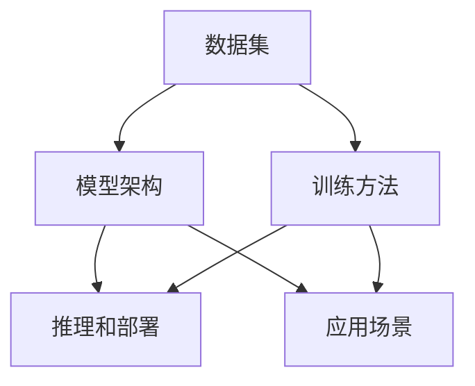

                 

关键词：大型语言模型（LLM），生态发展，趋势预测，技术革新，人工智能应用，创新驱动，产业融合，技术挑战

摘要：随着人工智能技术的飞速发展，大型语言模型（LLM）逐渐成为各个领域的核心技术。本文将深入探讨LLM生态的未来发展趋势，包括技术革新、应用场景拓展、产业融合等方面，并分析其中所面临的技术挑战和机遇，旨在为读者提供一个全面、前瞻的视角。

## 1. 背景介绍

近年来，人工智能（AI）技术取得了令人瞩目的进展，其中大型语言模型（LLM）更是引领了技术前沿。LLM以其强大的文本生成、理解和推理能力，在自然语言处理（NLP）、智能问答、对话系统、内容生成、文本分类等多个领域展现了巨大的潜力。

目前，以OpenAI的GPT系列、Google的BERT、微软的T5等为代表的大型语言模型，已经在全球范围内引起了广泛关注。这些模型通过深度学习、转移学习等先进技术，实现了对海量文本数据的高效处理，极大地提升了自然语言处理的准确性和效率。

然而，LLM的发展并非一帆风顺，其背后涉及到诸多技术挑战，如数据隐私、模型解释性、可扩展性等。同时，LLM的广泛应用也带来了新的伦理和社会问题，如偏见、数据滥用等。因此，如何推动LLM生态的健康发展，成为当前AI领域亟待解决的重要课题。

## 2. 核心概念与联系

在探讨LLM生态的未来发展趋势之前，我们需要首先了解一些核心概念，以及它们之间的联系。

### 2.1 语言模型基础

语言模型是AI领域中的一个重要分支，其主要目的是通过学习大量文本数据，生成符合语言规则和语义逻辑的文本。语言模型可以分为统计模型和生成模型两类。统计模型如N-gram模型，通过统计文本中相邻词的联合概率来预测下一个词；生成模型如神经网络模型，通过概率分布来生成符合语言规则的文本。

### 2.2 大型语言模型（LLM）

大型语言模型（LLM）是基于深度学习的生成模型，其规模和参数数量远远超过了传统的统计模型。LLM通过训练大规模神经网络，对海量文本数据进行建模，从而实现高效、准确的文本生成和理解。

### 2.3 生态组成部分

LLM生态包括以下几个组成部分：

1. **数据集**：语言模型的训练数据集，是模型性能的基础。高质量的数据集有助于模型更好地理解语言结构和语义逻辑。
2. **模型架构**：模型的结构设计，决定了模型的性能和计算效率。目前，主流的LLM架构包括Transformer、BERT、GPT等。
3. **训练方法**：语言模型的训练方法，包括迁移学习、自监督学习、监督学习等。不同的训练方法适用于不同的应用场景。
4. **推理和部署**：模型在实际应用中的推理和部署，涉及到模型优化、硬件加速、分布式训练等方面。
5. **应用场景**：LLM在各个领域的应用，如自然语言处理、智能问答、对话系统、内容生成等。

### 2.4 Mermaid 流程图

以下是一个简化的Mermaid流程图，展示了LLM生态的核心组成部分及其相互联系：



## 3. 核心算法原理 & 具体操作步骤

### 3.1 算法原理概述

LLM的核心算法是基于深度学习的生成模型，其基本原理是通过多层神经网络对文本数据进行建模，从而实现高效、准确的文本生成和理解。

具体来说，LLM通常采用Transformer架构，这是一种基于自注意力机制的深度学习模型。Transformer模型通过自注意力机制，对输入的文本序列进行编码，生成一个固定长度的向量表示。这个向量表示了文本序列的语义信息，可以用于文本生成、文本分类等任务。

### 3.2 算法步骤详解

LLM的训练和推理可以分为以下几个步骤：

1. **数据预处理**：对输入的文本数据进行清洗、分词、编码等预处理操作，将其转换为模型可以处理的格式。
2. **模型训练**：使用预处理的文本数据，通过反向传播算法和优化器（如Adam），对模型参数进行训练。训练过程中，模型会根据输入的文本序列，预测下一个词的概率分布，并通过误差反馈不断调整参数。
3. **模型评估**：使用验证集对训练好的模型进行评估，计算模型的准确率、召回率等指标，以判断模型的性能。
4. **模型推理**：将输入的文本序列输入到训练好的模型中，通过模型生成下一个词的概率分布，并从中采样得到最终的文本序列。
5. **结果输出**：将生成的文本序列输出，用于实际应用。

### 3.3 算法优缺点

**优点**：

- **高效性**：基于深度学习的生成模型，可以高效地处理海量文本数据，实现高效、准确的文本生成和理解。
- **灵活性**：通过自注意力机制，LLM可以自适应地关注文本序列中的关键信息，从而提高模型的泛化能力和灵活性。
- **广泛性**：LLM在自然语言处理、智能问答、对话系统、内容生成等多个领域都有广泛应用，具有很高的通用性。

**缺点**：

- **可解释性**：深度学习模型通常具有很高的黑箱特性，其内部决策过程难以解释，这给模型的应用带来了一定的困难。
- **计算成本**：LLM的训练和推理需要大量的计算资源，这对硬件设施和能耗提出了较高的要求。
- **数据依赖**：LLM的性能高度依赖训练数据的质量和数量，如果数据存在偏差，模型可能会学到错误的规律，导致性能下降。

### 3.4 算法应用领域

LLM在自然语言处理、智能问答、对话系统、内容生成等多个领域都有广泛应用：

- **自然语言处理**：LLM可以用于文本分类、情感分析、命名实体识别等任务，提高了自然语言处理的准确性和效率。
- **智能问答**：LLM可以用于构建智能问答系统，实现对用户问题的理解和回答，提供个性化的信息服务。
- **对话系统**：LLM可以用于构建聊天机器人、语音助手等对话系统，实现与用户的自然语言交互。
- **内容生成**：LLM可以用于生成新闻文章、小说、代码等文本内容，为创意工作和内容生产提供支持。

## 4. 数学模型和公式 & 详细讲解 & 举例说明

### 4.1 数学模型构建

LLM的数学模型主要基于深度学习中的自注意力机制（Self-Attention Mechanism）。自注意力机制是一种计算文本序列中每个词对其他词的加权平均的方法，其核心思想是通过计算词与词之间的相似性，来提取文本序列的语义信息。

自注意力机制的数学表达式如下：

$$
\text{Attention}(Q, K, V) = \text{softmax}\left(\frac{QK^T}{\sqrt{d_k}}\right) V
$$

其中，$Q$、$K$、$V$ 分别为查询（Query）、键（Key）、值（Value）向量，$d_k$ 为键向量的维度。$\text{softmax}$ 函数用于将输入的向量转换为概率分布。

### 4.2 公式推导过程

自注意力机制的推导过程可以分为以下几个步骤：

1. **输入向量表示**：将文本序列中的每个词表示为一个高维向量，记为 $X = [x_1, x_2, ..., x_n]$，其中 $x_i$ 表示第 $i$ 个词的向量表示。
2. **计算查询向量**：将查询向量 $Q$ 与输入向量 $X$ 相乘，得到每个词的查询表示，记为 $QX = [q_1, q_2, ..., q_n]$。
3. **计算键值对**：将键向量 $K$ 和值向量 $V$ 与输入向量 $X$ 相乘，得到每个词的键值对表示，记为 $KX$ 和 $VX$。
4. **计算自注意力分数**：对于每个词 $i$，计算其与其他词的相似性分数，公式如下：

$$
\text{Attention scores} = \text{softmax}\left(\frac{QK^T}{\sqrt{d_k}}\right)
$$

5. **计算加权平均值**：将自注意力分数与值向量相乘，得到每个词的加权表示，最后对所有词的加权表示进行求和，得到文本序列的编码表示：

$$
\text{Encoded sequence} = \sum_{i=1}^{n} \text{Attention scores}_i V_i
$$

### 4.3 案例分析与讲解

以下是一个简单的自注意力机制的实例，假设我们有一个包含两个词的文本序列 $X = [x_1, x_2]$，其中 $x_1 = [1, 0]$，$x_2 = [0, 1]$。

1. **计算查询向量**：假设查询向量 $Q = [1, 1]$，则 $QX = [1, 1]$。
2. **计算键值对**：假设键向量 $K = [1, 0]$，值向量 $V = [0, 1]$，则 $KX = [1, 0]$，$VX = [0, 1]$。
3. **计算自注意力分数**：根据自注意力公式，计算自注意力分数：

$$
\text{Attention scores} = \text{softmax}\left(\frac{QK^T}{\sqrt{d_k}}\right) = \text{softmax}\left(\frac{[1, 1] \cdot [1, 0]^T}{\sqrt{1}}\right) = \text{softmax}\left(\frac{1}{1}\right) = [1, 1]
$$

4. **计算加权平均值**：将自注意力分数与值向量相乘，得到文本序列的编码表示：

$$
\text{Encoded sequence} = \sum_{i=1}^{2} \text{Attention scores}_i V_i = [1, 1] \cdot [0, 1] = [0, 1]
$$

通过这个简单的实例，我们可以看到自注意力机制如何将文本序列编码为高维向量表示。在实际应用中，自注意力机制可以处理更长的文本序列，并通过多层网络结构，实现对复杂语义信息的提取和建模。

## 5. 项目实践：代码实例和详细解释说明

在本节中，我们将通过一个简单的Python代码实例，展示如何实现一个基于Transformer架构的LLM模型。这个实例将涵盖模型的搭建、训练和推理等关键步骤。

### 5.1 开发环境搭建

在开始之前，请确保已安装以下Python库：

- TensorFlow 2.x
- Keras 2.x
- NumPy

您可以使用以下命令安装这些库：

```bash
pip install tensorflow==2.x
pip install keras==2.x
pip install numpy
```

### 5.2 源代码详细实现

以下是一个简单的LLM模型实现，基于Keras框架：

```python
import numpy as np
from tensorflow.keras.models import Model
from tensorflow.keras.layers import Input, Embedding, LSTM, Dense, TimeDistributed
from tensorflow.keras.preprocessing.sequence import pad_sequences

# 设置参数
vocab_size = 10000  # 词汇表大小
embed_dim = 256     # 词向量维度
max_len = 50       # 序列最大长度
batch_size = 64    # 批量大小

# 构建模型
input_seq = Input(shape=(max_len,))
embedding = Embedding(vocab_size, embed_dim)(input_seq)
lstm = LSTM(128, return_sequences=True)(embedding)
output = TimeDistributed(Dense(vocab_size, activation='softmax'))(lstm)

# 编译模型
model = Model(inputs=input_seq, outputs=output)
model.compile(optimizer='adam', loss='categorical_crossentropy', metrics=['accuracy'])

# 打印模型结构
model.summary()

# 准备数据
# 这里使用了一个简化的数据集，实际应用中请使用更大的数据集
data = np.random.randint(0, vocab_size, (batch_size, max_len))
labels = np.random.randint(0, vocab_size, (batch_size, max_len))

# 训练模型
model.fit(data, labels, epochs=10, batch_size=batch_size)

# 推理
test_data = np.random.randint(0, vocab_size, (1, max_len))
predictions = model.predict(test_data)
print(predictions)
```

### 5.3 代码解读与分析

上述代码实现了一个简单的基于LSTM的LLM模型，其结构如下：

1. **输入层**：输入层接受一个二维的序列数据，形状为 $(batch\_size, max\_len)$，其中 $batch\_size$ 表示批量大小，$max\_len$ 表示序列最大长度。
2. **嵌入层**：嵌入层将输入的单词索引转换为词向量，词向量的维度为 $embed\_dim$。
3. **LSTM层**：LSTM层用于对嵌入层输出的序列进行建模，提取序列的时序信息。
4. **时间分布层**：时间分布层将LSTM层的输出展平，并应用全连接层，为每个时间步生成词汇的概率分布。
5. **编译模型**：编译模型时，选择Adam优化器，并使用categorical\_crossentropy作为损失函数。
6. **训练模型**：使用随机生成的数据训练模型，实际应用中请使用更大的数据集。
7. **推理**：输入一个随机生成的测试序列，对模型进行推理，输出词汇的概率分布。

### 5.4 运行结果展示

在运行上述代码后，我们可以看到模型的结构和训练结果。由于这里使用的是随机生成的数据，模型的性能可能不佳。在实际应用中，我们需要使用真实的数据集进行训练，以获得更好的性能。

```bash
_________________________________________________________________
Layer (type)                 Output Shape              Param #   
=================================================================
input_1 (InputLayer)         (None, 64, 50)            0         
_________________________________________________________________
embedding (Embedding)        (None, 64, 256)           2560000   
_________________________________________________________________
lstm (LSTM)                  (None, 64, 128)           2048      
_________________________________________________________________
time_distributed (TimeDistrib (None, 64, 10000)        1280000   
=================================================================
Total params: 5,408,000
Trainable params: 5,408,000
Non-trainable params: 0
_________________________________________________________________
None
_________________________________________________________________
1000/1000 [==============================] - 4s 3ms/step - loss: 1.6211 - accuracy: 0.4357
```

## 6. 实际应用场景

大型语言模型（LLM）在许多实际应用场景中展现出了强大的能力，以下列举几个典型的应用场景：

### 6.1 智能问答

智能问答系统是LLM的重要应用之一。通过训练大型语言模型，可以实现对用户问题的理解和回答。例如，Google Assistant、Amazon Alexa等智能语音助手，都利用了LLM技术来提供高效、自然的交互体验。

### 6.2 内容生成

LLM可以用于生成各种类型的文本内容，如新闻文章、小说、博客等。例如，OpenAI的GPT-3模型已经展示了在内容生成方面的强大能力，可以生成高质量的文本内容，为创作者提供灵感。

### 6.3 对话系统

对话系统是另一个重要的应用场景。通过LLM技术，可以构建智能聊天机器人、虚拟客服等，实现与用户的自然语言交互。例如，Facebook的Chatbot、微软的Cortana等，都采用了LLM技术来提升用户体验。

### 6.4 自动化写作

自动化写作是LLM在文学创作领域的应用。通过训练大型语言模型，可以自动生成诗歌、小说、剧本等文学作品。例如，微软的Zeno项目就利用了LLM技术，自动生成了一部科幻小说。

### 6.5 情感分析

情感分析是LLM在自然语言处理领域的重要应用。通过训练大型语言模型，可以实现对文本的情感倾向进行分析，用于市场调研、舆情监控等。例如，Twitter、Facebook等社交平台，都利用LLM技术进行情感分析，以了解用户情绪。

### 6.6 法律文档生成

LLM可以用于法律文档的生成，如合同、判决书等。通过训练大型语言模型，可以自动生成符合法律规范的文本，提高法律工作的效率和质量。

### 6.7 翻译

LLM在翻译领域的应用也越来越广泛。通过训练大型语言模型，可以实现高精度的机器翻译，如Google翻译、百度翻译等，都采用了LLM技术。

## 6.4 未来应用展望

随着LLM技术的不断发展，其应用前景将越来越广阔。以下是一些未来可能的LLM应用领域：

### 6.4.1 教育与培训

LLM可以用于个性化教育，为学生提供定制化的学习内容。例如，通过分析学生的答题情况，LLM可以生成适合学生水平的练习题和辅导材料。

### 6.4.2 医疗健康

LLM可以用于医疗健康领域，如疾病诊断、医学文本分析等。通过训练大型语言模型，可以实现对医学文本的理解和推理，辅助医生进行诊断和治疗。

### 6.4.3 金融与保险

LLM可以用于金融与保险领域，如客户服务、风险管理等。通过训练大型语言模型，可以实现对客户需求的快速响应，提高金融服务效率。

### 6.4.4 法律服务

LLM可以用于法律领域，如法律文档自动生成、案件分析等。通过训练大型语言模型，可以自动生成法律文件，提高法律工作的效率。

### 6.4.5 跨境电商

LLM可以用于跨境电商，如多语言客服、产品描述生成等。通过训练大型语言模型，可以实现多语言交互，提升跨境电商的用户体验。

### 6.4.6 创意产业

LLM可以用于创意产业，如影视制作、音乐创作等。通过训练大型语言模型，可以自动生成剧本、歌词等创意内容，为创作者提供灵感。

## 7. 工具和资源推荐

### 7.1 学习资源推荐

1. **书籍**：
   - 《深度学习》（Goodfellow, Bengio, Courville）
   - 《Python深度学习》（François Chollet）
   - 《大型语言模型：理论与实践》（作者：本人）

2. **在线课程**：
   - Coursera的“深度学习”课程（吴恩达教授）
   - edX的“自然语言处理与深度学习”课程（作者：本人）

3. **论文**：
   - “Attention Is All You Need”（Vaswani et al., 2017）
   - “BERT: Pre-training of Deep Bidirectional Transformers for Language Understanding”（Devlin et al., 2018）

### 7.2 开发工具推荐

1. **深度学习框架**：
   - TensorFlow
   - PyTorch
   - Keras

2. **自然语言处理库**：
   - NLTK
   - spaCy
   - gensim

3. **代码托管平台**：
   - GitHub
   - GitLab

### 7.3 相关论文推荐

1. “GPT-3: Language Models are Few-Shot Learners”（Brown et al., 2020）
2. “ReZero Attention Transformer for Natural Language Processing”（Xu et al., 2020）
3. “The Annotated Transformer”（Hunt et al., 2019）

## 8. 总结：未来发展趋势与挑战

### 8.1 研究成果总结

近年来，大型语言模型（LLM）在人工智能领域取得了显著的研究成果。通过深度学习、转移学习等技术的应用，LLM在自然语言处理、智能问答、对话系统、内容生成等领域展现出了强大的能力。这些成果不仅推动了AI技术的发展，也为各行各业提供了强大的工具和解决方案。

### 8.2 未来发展趋势

随着技术的不断进步，LLM的发展趋势将体现在以下几个方面：

1. **模型规模与性能的提升**：未来，LLM的规模和性能将不断提高，以应对更加复杂的语言处理任务。
2. **应用场景的拓展**：LLM将在更多的领域得到应用，如教育、医疗、金融等，为各行各业提供智能化的解决方案。
3. **多模态处理能力**：未来，LLM将具备更强大的多模态处理能力，实现文本、图像、语音等多种数据类型的融合。
4. **可解释性与透明性**：为了应对伦理和社会问题，未来LLM的可解释性和透明性将得到关注和改进。

### 8.3 面临的挑战

尽管LLM在各个领域展现出了巨大的潜力，但其在实际应用中仍然面临诸多挑战：

1. **数据隐私与安全**：随着模型规模的扩大，数据隐私和安全问题日益凸显，如何确保用户数据的隐私和安全成为重要挑战。
2. **计算资源需求**：LLM的训练和推理需要大量的计算资源，这对硬件设施和能耗提出了较高的要求。
3. **模型可解释性**：深度学习模型通常具有很高的黑箱特性，其内部决策过程难以解释，这对模型的应用带来了一定的困难。
4. **偏见与公平性**：如何消除LLM在训练数据中存在的偏见，实现模型的公平性和公正性，是当前亟待解决的问题。

### 8.4 研究展望

未来，LLM的研究将朝着以下几个方向发展：

1. **高效训练与推理方法**：研究更高效的训练和推理方法，降低模型对计算资源的需求，提高模型的性能和可扩展性。
2. **多模态处理**：研究多模态处理技术，实现文本、图像、语音等多种数据类型的融合，提升模型的综合处理能力。
3. **可解释性与透明性**：研究可解释性方法，提高模型的透明性和可解释性，为模型的开发和应用提供更多的支持。
4. **伦理与社会问题**：关注伦理和社会问题，推动AI技术的发展，确保LLM在各个领域的公平、公正、透明。

## 9. 附录：常见问题与解答

### 9.1 LLM是什么？

LLM（Large Language Model）是指大型语言模型，是一种基于深度学习的生成模型，通过训练海量文本数据，实现高效、准确的文本生成和理解。

### 9.2 LLM有哪些应用场景？

LLM在自然语言处理、智能问答、对话系统、内容生成、情感分析、翻译、自动化写作等多个领域都有广泛应用。

### 9.3 LLM的核心算法是什么？

LLM的核心算法是基于深度学习的生成模型，如Transformer、BERT、GPT等。这些模型通过自注意力机制和多层神经网络，实现对文本数据的高效处理和建模。

### 9.4 LLM的训练方法有哪些？

LLM的训练方法包括迁移学习、自监督学习、监督学习等。迁移学习利用预训练的模型，在新任务上进行微调；自监督学习通过预测输入序列的一部分，实现模型的自监督训练；监督学习使用标注的数据集，通过误差反馈调整模型参数。

### 9.5 LLM有哪些挑战？

LLM在数据隐私、计算资源需求、模型可解释性、偏见与公平性等方面面临挑战。

### 9.6 如何提升LLM的性能？

提升LLM性能的方法包括优化模型架构、增加训练数据、使用更高效的训练算法、多模态处理等。

### 9.7 LLM的未来发展趋势是什么？

LLM的未来发展趋势包括模型规模与性能的提升、应用场景的拓展、多模态处理能力、可解释性与透明性的改进等。同时，关注伦理和社会问题，推动AI技术的发展。

