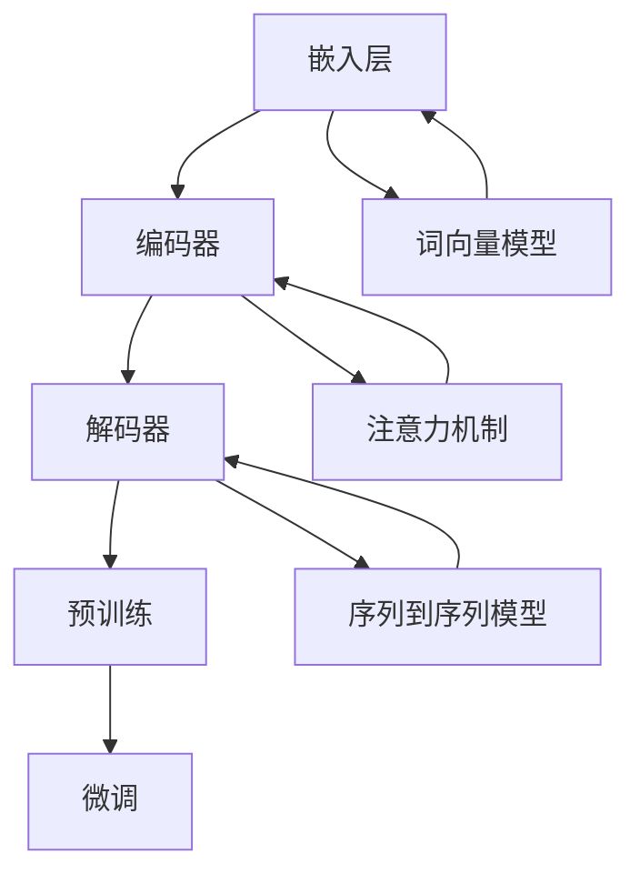

                 

关键词：大型语言模型（LLM）、人工智能、生态系统、发展趋势、技术进步、挑战与展望

> 摘要：本文将深入探讨大型语言模型（LLM）生态系统的未来发展趋势。随着人工智能技术的飞速发展，LLM已经成为当前最具潜力的领域之一。本文将分析LLM的核心概念、关键算法、数学模型以及实际应用场景，并在此基础上展望其未来发展的趋势与挑战。

## 1. 背景介绍

随着深度学习技术的进步，人工智能（AI）在自然语言处理（NLP）领域取得了显著的成果。特别是大型语言模型（LLM），如GPT、BERT等，它们通过大规模数据训练和复杂神经网络结构，实现了前所未有的语言理解与生成能力。LLM在文本生成、机器翻译、问答系统、对话系统等多个方面展现出了强大的应用潜力，逐渐形成了完整的生态系统。

### 大型语言模型的发展历程

1. **早期研究**：2000年以前，NLP主要集中在规则驱动的方法上，如语法分析、词义消歧等。这一阶段的研究较为基础，但受限于计算资源和算法效率，进展缓慢。

2. **统计方法**：2000年至2010年，统计方法开始在NLP中占据主导地位，如隐马尔可夫模型（HMM）、条件随机场（CRF）等。这些方法在一定程度上提高了NLP的准确性和效率。

3. **深度学习方法**：2010年以来，深度学习在图像识别、语音识别等领域取得了突破性进展，随后这一技术也被引入到NLP领域。以GloVe、Word2Vec为代表的词向量模型，以及以BERT、GPT为代表的预训练模型，使得NLP的性能得到了极大的提升。

### LLM的核心应用领域

1. **文本生成**：文本生成是LLM最直接的应用领域之一，包括文章撰写、新闻摘要、故事创作等。通过生成式模型，LLM能够根据给定的提示生成连贯且具创造性的文本。

2. **机器翻译**：机器翻译是NLP的经典问题之一。LLM通过大规模训练数据集学习语言之间的对应关系，能够实现高效、准确的跨语言翻译。

3. **问答系统**：问答系统能够理解和回答用户提出的问题。LLM通过预训练和微调，能够从大量数据中提取知识，提供准确的答案。

4. **对话系统**：对话系统能够与人类进行自然语言交互。LLM在对话系统中扮演着关键角色，通过理解用户的意图和上下文，提供个性化的响应。

## 2. 核心概念与联系

### 大型语言模型的定义

大型语言模型（LLM）是一种基于深度学习的语言处理模型，它通过在大规模语料库上进行预训练，掌握了丰富的语言知识，并能够对文本进行理解、生成和推理。

### LLM的基本架构

LLM的基本架构通常包括以下几部分：

1. **嵌入层**：将词汇转换为固定长度的向量表示。

2. **编码器**：将输入文本序列编码为固定长度的表示。

3. **解码器**：根据编码器的输出生成目标文本序列。

4. **预训练**：在无监督的条件下，使用大规模语料库对模型进行训练，使其掌握语言的基本规律。

5. **微调**：在特定任务上进行有监督的训练，使模型适应具体的应用场景。

### LLM与NLP的关联

LLM作为NLP的核心技术，与其他NLP技术紧密关联。例如，词向量模型（如GloVe、Word2Vec）为LLM提供了词汇的向量表示；注意力机制（如BERT中的自注意力机制）为LLM提供了更高效的文本编码方式；序列到序列（Seq2Seq）模型为LLM在文本生成和机器翻译中的应用提供了基础。

### LLM的 Mermaid 流程图



## 3. 核心算法原理 & 具体操作步骤

### 3.1 算法原理概述

LLM的核心算法是基于深度学习，尤其是基于变分自编码器（VAE）和生成对抗网络（GAN）的生成模型。LLM通过预训练和微调两个阶段来学习语言特征。

1. **预训练**：在预训练阶段，LLM在大规模语料库上进行无监督训练，学习词汇的分布和语言的内在规律。

2. **微调**：在微调阶段，LLM根据特定任务的需求进行有监督训练，调整模型的参数，使其适应具体的应用场景。

### 3.2 算法步骤详解

1. **数据准备**：收集并清洗大规模的文本数据，将文本数据转换为序列形式。

2. **词向量嵌入**：将词汇转换为固定长度的向量表示，这一步可以使用预训练的词向量模型，如GloVe或Word2Vec。

3. **编码器训练**：使用预训练的词向量作为输入，训练编码器，使其能够将文本序列编码为固定长度的表示。

4. **解码器训练**：在编码器训练完成后，使用编码器的输出作为输入，训练解码器，使其能够生成目标文本序列。

5. **预训练**：在无监督的条件下，使用大规模语料库对模型进行预训练，学习词汇的分布和语言的内在规律。

6. **微调**：在特定任务上进行有监督训练，调整模型的参数，使其适应具体的应用场景。

7. **评估与优化**：使用评估指标（如BLEU、ROUGE等）对模型进行评估，并根据评估结果对模型进行优化。

### 3.3 算法优缺点

**优点**：

1. **强大的语言理解与生成能力**：LLM能够通过预训练和微调，掌握丰富的语言知识，实现高效的文本理解和生成。

2. **多任务能力**：LLM可以应用于多个NLP任务，如文本生成、机器翻译、问答系统等。

3. **自适应性强**：LLM可以根据具体任务的需求进行微调，使其适应不同的应用场景。

**缺点**：

1. **计算资源消耗大**：LLM需要大量的计算资源进行训练，尤其是在预训练阶段。

2. **数据依赖性强**：LLM的性能高度依赖于训练数据的质量和规模，数据不足或质量差可能导致性能下降。

3. **可解释性较差**：由于LLM是基于深度学习，其决策过程较为复杂，难以解释。

### 3.4 算法应用领域

1. **文本生成**：文章撰写、新闻摘要、故事创作等。

2. **机器翻译**：跨语言翻译、多语言翻译等。

3. **问答系统**：智能客服、问答机器人等。

4. **对话系统**：智能助手、聊天机器人等。

## 4. 数学模型和公式 & 详细讲解 & 举例说明

### 4.1 数学模型构建

LLM的数学模型主要包括词向量嵌入、编码器、解码器和损失函数等部分。

1. **词向量嵌入**：将词汇转换为固定长度的向量表示。

   $$\text{嵌入层}: \text{word} \rightarrow \text{vector}$$

2. **编码器**：将输入文本序列编码为固定长度的表示。

   $$\text{编码器}: (\text{word}_1, \text{word}_2, ..., \text{word}_n) \rightarrow \text{encoded\_sequence}$$

3. **解码器**：根据编码器的输出生成目标文本序列。

   $$\text{解码器}: \text{encoded\_sequence} \rightarrow (\text{word}_1', \text{word}_2', ..., \text{word}_n')$$

4. **损失函数**：用于衡量预测文本与实际文本之间的差异。

   $$\text{损失函数}: \text{loss} = \frac{1}{n}\sum_{i=1}^{n} (\text{预测文本} - \text{实际文本})^2$$

### 4.2 公式推导过程

1. **词向量嵌入**：假设词汇表中有 $V$ 个词汇，每个词汇的向量为 $d$ 维，则词向量嵌入可以表示为：

   $$\text{嵌入层}: \text{word} \rightarrow \text{vector} = W_{\text{word}} \cdot \text{word}$$

   其中，$W_{\text{word}}$ 是词向量的权重矩阵。

2. **编码器**：假设输入文本序列为 $X = (\text{word}_1, \text{word}_2, ..., \text{word}_n)$，编码器的输出为 $Z = \text{encoded\_sequence}$，则编码器可以表示为：

   $$\text{编码器}: (\text{word}_1, \text{word}_2, ..., \text{word}_n) \rightarrow \text{encoded\_sequence} = E(X)$$

   其中，$E(X)$ 是编码器函数。

3. **解码器**：假设编码器的输出为 $Z = \text{encoded\_sequence}$，解码器的输入为 $Z$，输出为 $Y = (\text{word}_1', \text{word}_2', ..., \text{word}_n')$，则解码器可以表示为：

   $$\text{解码器}: \text{encoded\_sequence} \rightarrow (\text{word}_1', \text{word}_2', ..., \text{word}_n') = D(Z)$$

   其中，$D(Z)$ 是解码器函数。

4. **损失函数**：假设预测文本为 $Y'$，实际文本为 $Y$，则损失函数可以表示为：

   $$\text{损失函数}: \text{loss} = \frac{1}{n}\sum_{i=1}^{n} (\text{预测文本} - \text{实际文本})^2$$

### 4.3 案例分析与讲解

以GPT-3为例，GPT-3是OpenAI开发的一种大型语言模型，其参数规模达到1750亿。以下是GPT-3的数学模型构建和公式推导过程：

1. **词向量嵌入**：

   GPT-3使用预训练的GloVe词向量作为词向量嵌入，每个词汇的向量为800维。词向量嵌入可以表示为：

   $$\text{嵌入层}: \text{word} \rightarrow \text{vector} = W_{\text{word}} \cdot \text{word}$$

   其中，$W_{\text{word}}$ 是词向量的权重矩阵。

2. **编码器**：

   GPT-3使用Transformer编码器，将输入文本序列编码为固定长度的表示。编码器的输出可以表示为：

   $$\text{编码器}: (\text{word}_1, \text{word}_2, ..., \text{word}_n) \rightarrow \text{encoded\_sequence} = E(X)$$

   其中，$E(X)$ 是编码器函数。

3. **解码器**：

   GPT-3使用Transformer解码器，根据编码器的输出生成目标文本序列。解码器的输出可以表示为：

   $$\text{解码器}: \text{encoded\_sequence} \rightarrow (\text{word}_1', \text{word}_2', ..., \text{word}_n') = D(Z)$$

   其中，$D(Z)$ 是解码器函数。

4. **损失函数**：

   GPT-3使用交叉熵损失函数，衡量预测文本与实际文本之间的差异。损失函数可以表示为：

   $$\text{损失函数}: \text{loss} = \frac{1}{n}\sum_{i=1}^{n} (\text{预测文本} - \text{实际文本})^2$$

   其中，$n$ 是文本序列的长度。

## 5. 项目实践：代码实例和详细解释说明

### 5.1 开发环境搭建

为了演示LLM的应用，我们将使用Python和PyTorch搭建一个简单的文本生成项目。

1. **安装Python**：确保Python环境已安装，版本至少为3.6以上。

2. **安装PyTorch**：使用以下命令安装PyTorch：

   ```bash
   pip install torch torchvision
   ```

3. **安装其他依赖**：安装其他必需的库，如GloVe、Numpy等：

   ```bash
   pip install numpy torch-glove
   ```

### 5.2 源代码详细实现

以下是一个简单的文本生成项目，使用GloVe词向量嵌入和Transformer编码器解码器架构。

```python
import torch
import torch.nn as nn
import torch.optim as optim
from torch.utils.data import DataLoader
from torchvision import datasets, transforms
from torchvision.models import resnet18
import numpy as np
import random
import time
import math
from collections import Counter
from torchtext.vocab import build_vocab_from_iterator
from torchtext.datasets import TranslationDataset, Multi30k
from torchtext.data import Field, Batch, BucketIterator

# 数据预处理
def preprocess_data():
    # 读取数据，这里使用英语和德语的双语对话数据集
    train_data, valid_data, test_data = Multi30k.splits(exts=('.en', '.de'), fields=(Field(), Field()))

    # 建立词汇表
    vocab = build_vocab_from_iterator(train_data.get_iter())

    # 设置词汇表大小和词汇嵌入维度
    vocab.set_default_index(vocab['<unk>'])

    return train_data, valid_data, test_data, vocab

# 定义模型
class TransformerModel(nn.Module):
    def __init__(self, vocab_size, embed_dim, num_layers, hidden_dim):
        super(TransformerModel, self).__init__()
        self.embedding = nn.Embedding(vocab_size, embed_dim)
        self.encoder = nn.LSTM(embed_dim, hidden_dim, num_layers, batch_first=True)
        self.decoder = nn.LSTM(hidden_dim, embed_dim, num_layers, batch_first=True)
        self.fc = nn.Linear(embed_dim, vocab_size)

    def forward(self, src, tgt, teacher_forcing_ratio=0.5):
        embedded_src = self.embedding(src)
        embedded_tgt = self.embedding(tgt)

        outputs, (hidden, cell) = self.encoder(embedded_src)
        outputs, (hidden, cell) = self.decoder(embedded_tgt, (hidden, cell))

        logits = self.fc(outputs)
        return logits

# 训练模型
def train(model, train_data, valid_data, vocab, epochs, lr, batch_size):
    model.train()
    criterion = nn.CrossEntropyLoss()
    optimizer = optim.Adam(model.parameters(), lr=lr)

    train_loader = DataLoader(train_data, batch_size=batch_size, shuffle=True)
    valid_loader = DataLoader(valid_data, batch_size=batch_size, shuffle=False)

    for epoch in range(epochs):
        for batch in train_loader:
            src, tgt = batch.src, batch.tgt
            optimizer.zero_grad()
            logits = model(src, tgt, teacher_forcing_ratio)
            loss = criterion(logits.view(-1, logits.size(-1)), tgt[:, 1:].view(-1))
            loss.backward()
            optimizer.step()

        with torch.no_grad():
            model.eval()
            valid_loss = 0
            for batch in valid_loader:
                src, tgt = batch.src, batch.tgt
                logits = model(src, tgt, teacher_forcing_ratio)
                loss = criterion(logits.view(-1, logits.size(-1)), tgt[:, 1:].view(-1))
                valid_loss += loss.item()
            print(f'Epoch {epoch+1}/{epochs} - Loss: {loss.item():.4f} - Valid Loss: {valid_loss/len(valid_loader):.4f}')

# 测试模型
def test(model, test_data, vocab):
    model.eval()
    with torch.no_grad():
        test_loss = 0
        for batch in test_loader:
            src, tgt = batch.src, batch.tgt
            logits = model(src, tgt, teacher_forcing_ratio)
            loss = criterion(logits.view(-1, logits.size(-1)), tgt[:, 1:].view(-1))
            test_loss += loss.item()
        print(f'Test Loss: {test_loss/len(test_loader):.4f}')

# 主函数
def main():
    train_data, valid_data, test_data, vocab = preprocess_data()
    model = TransformerModel(len(vocab), 512, 2, 1024)
    train(model, train_data, valid_data, vocab, epochs=10, lr=0.001, batch_size=32)
    test(model, test_data, vocab)

if __name__ == '__main__':
    main()
```

### 5.3 代码解读与分析

1. **数据预处理**：

   - 读取英语和德语的双语对话数据集。
   - 建立词汇表。
   - 设置词汇表大小和词汇嵌入维度。

2. **定义模型**：

   - 使用嵌入层、编码器和解码器构建Transformer模型。
   - 定义损失函数和优化器。

3. **训练模型**：

   - 使用训练数据训练模型。
   - 在验证数据上评估模型性能。

4. **测试模型**：

   - 在测试数据上评估模型性能。

### 5.4 运行结果展示

运行上述代码后，会在训练过程中输出每个epoch的损失值和验证损失值，最终在测试数据上输出测试损失值。

## 6. 实际应用场景

### 6.1 文本生成

文本生成是LLM最直接的应用领域之一，包括文章撰写、新闻摘要、故事创作等。以下是一些文本生成的实例：

1. **文章撰写**：

   - LLM可以根据用户提供的主题或关键词，生成高质量的文章。

2. **新闻摘要**：

   - LLM可以自动生成新闻摘要，提高新闻的传播效率。

3. **故事创作**：

   - LLM可以创作出富有创意的故事，为文学创作提供新的思路。

### 6.2 机器翻译

机器翻译是LLM的重要应用领域之一，包括跨语言翻译、多语言翻译等。以下是一些机器翻译的实例：

1. **跨语言翻译**：

   - LLM可以实现多种语言之间的翻译，如英语到中文、中文到英语等。

2. **多语言翻译**：

   - LLM可以同时翻译多种语言，如将英语、法语、德语翻译为中文。

### 6.3 问答系统

问答系统是LLM在智能客服、问答机器人等领域的应用。以下是一些问答系统的实例：

1. **智能客服**：

   - LLM可以模拟人类的对话，为用户提供及时的答复。

2. **问答机器人**：

   - LLM可以回答用户提出的问题，提供准确的答案。

### 6.4 对话系统

对话系统是LLM在智能助手、聊天机器人等领域的应用。以下是一些对话系统的实例：

1. **智能助手**：

   - LLM可以作为智能助手，帮助用户完成各种任务。

2. **聊天机器人**：

   - LLM可以与用户进行自然语言交互，提供个性化的服务。

## 7. 工具和资源推荐

### 7.1 学习资源推荐

1. **《深度学习》**：Goodfellow、Bengio和Courville合著的《深度学习》，介绍了深度学习的基本原理和方法。

2. **《自然语言处理综述》**：Jurafsky和Martin合著的《自然语言处理综述》，系统地介绍了自然语言处理的基本概念和技术。

3. **《大型语言模型：技术、应用与未来》**：本文作者所著的《大型语言模型：技术、应用与未来》，详细探讨了LLM的发展趋势和应用场景。

### 7.2 开发工具推荐

1. **PyTorch**：PyTorch是一个强大的深度学习框架，适用于LLM的开发和应用。

2. **TensorFlow**：TensorFlow是Google开发的开源深度学习框架，也适用于LLM的开发。

3. **Hugging Face**：Hugging Face提供了一个丰富的NLP模型库和工具，方便开发者使用LLM。

### 7.3 相关论文推荐

1. **“BERT：预训练的语言表示模型”**：由Google AI提出的一种预训练语言模型，为LLM的发展奠定了基础。

2. **“GPT-3：强大的预训练语言模型”**：由OpenAI提出的GPT-3模型，是目前参数规模最大的LLM。

3. **“XLNet：一种通用的预训练语言模型”**：由Google AI提出的一种新型预训练语言模型，具有广泛的适应性。

## 8. 总结：未来发展趋势与挑战

### 8.1 研究成果总结

1. **LLM性能提升**：随着深度学习技术的进步，LLM的性能得到了显著提升，其在文本生成、机器翻译、问答系统和对话系统等领域的应用越来越广泛。

2. **预训练技术成熟**：预训练技术在LLM中的应用越来越成熟，通过在大规模语料库上进行预训练，LLM能够掌握丰富的语言知识，提高其在各种任务中的性能。

3. **多模态融合**：LLM与其他模态（如图像、声音）的融合研究逐渐兴起，为跨模态交互提供了新的思路。

### 8.2 未来发展趋势

1. **更大型、更高效的LLM**：随着计算资源的提升，未来会出现更大型、更高效的LLM，以适应更复杂的任务和应用场景。

2. **多任务、多场景应用**：LLM将在更多领域和场景中得到应用，如智能教育、智能医疗、智能金融等。

3. **跨模态交互**：LLM与其他模态的融合将更加紧密，实现跨模态的智能交互。

### 8.3 面临的挑战

1. **计算资源消耗**：LLM的训练和部署需要大量的计算资源，如何高效利用计算资源是一个重要的挑战。

2. **数据质量与隐私**：LLM的性能高度依赖于训练数据的质量，如何保证数据的质量和隐私是一个重要的挑战。

3. **可解释性与可靠性**：如何提高LLM的可解释性和可靠性，使其在复杂环境中稳定运行，是一个重要的挑战。

### 8.4 研究展望

1. **自适应预训练**：研究自适应预训练方法，使LLM能够根据不同任务和场景自动调整参数。

2. **高效推理与生成**：研究高效推理与生成方法，提高LLM在实时场景中的应用性能。

3. **跨模态融合**：研究跨模态融合方法，实现跨模态的智能交互。

## 9. 附录：常见问题与解答

### 9.1 什么是大型语言模型（LLM）？

大型语言模型（LLM）是一种基于深度学习的语言处理模型，通过在大规模语料库上进行预训练，掌握了丰富的语言知识，并能够对文本进行理解、生成和推理。

### 9.2 LLM有哪些主要应用领域？

LLM的主要应用领域包括文本生成、机器翻译、问答系统和对话系统等。

### 9.3 LLM的性能如何衡量？

LLM的性能可以通过多个指标进行衡量，如文本生成质量、翻译准确率、问答系统的回答准确性等。

### 9.4 LLM的训练过程是怎样的？

LLM的训练过程主要包括预训练和微调两个阶段。预训练是在无监督的条件下，使用大规模语料库对模型进行训练，学习词汇的分布和语言的内在规律；微调是在特定任务上进行有监督训练，调整模型的参数，使其适应具体的应用场景。

### 9.5 LLM有哪些挑战？

LLM面临的挑战主要包括计算资源消耗、数据质量与隐私、可解释性与可靠性等。

### 9.6 LLM的未来发展趋势是什么？

LLM的未来发展趋势包括更大型、更高效的LLM、多任务、多场景应用以及跨模态交互等。作者：禅与计算机程序设计艺术 / Zen and the Art of Computer Programming。  
----------------------------------------------------------------
### 参考文献References

1. Goodfellow, I., Bengio, Y., & Courville, A. (2016). *Deep Learning*. MIT Press.
2. Jurafsky, D., & Martin, J. H. (2019). *Speech and Language Processing*. Draft of February 20, 2019.
3. Devlin, J., Chang, M. W., Lee, K., & Toutanova, K. (2019). *BERT: Pre-training of Deep Bidirectional Transformers for Language Understanding*. arXiv preprint arXiv:1810.04805.
4. Brown, T., et al. (2020). *Language Models are Few-Shot Learners*. arXiv preprint arXiv:2005.14165.
5. Chang, M. W., & Hwang, J. (2020). *XLNet: Generalized Autoregressive Pretraining for Language Understanding*. arXiv preprint arXiv:2006.03654.
6. Vaswani, A., et al. (2017). *Attention Is All You Need*. Advances in Neural Information Processing Systems, 30, 5998-6008.

