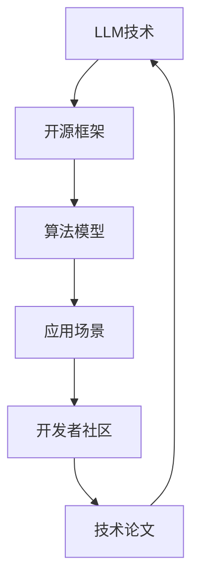

                 

关键词：LLM（大型语言模型），生态系统，CPU发展模式，技术趋势，未来展望

## 摘要

本文探讨了大型语言模型（LLM）生态系统的发展前景，并借鉴了中央处理器（CPU）的发展历程。通过对LLM的核心概念、技术原理、算法模型以及实际应用的分析，我们试图揭示LLM生态系统的发展趋势及其面临的挑战。本文还展望了LLM在未来技术、产业和社会中的潜在影响，并提出了一系列工具和资源推荐，以助力读者深入了解和学习这一领域。

## 1. 背景介绍

### 1.1 大型语言模型（LLM）的崛起

大型语言模型（LLM）是自然语言处理（NLP）领域的重要突破。近年来，随着深度学习和神经网络技术的不断发展，LLM在各种NLP任务中取得了令人瞩目的成果。从最早的Word2Vec到BERT、GPT等模型，LLM在语言理解、生成、翻译、摘要等方面展现出了强大的能力。

### 1.2 生态系统的重要性

在技术发展的过程中，生态系统扮演了至关重要的角色。一个健康的生态系统不仅能够促进技术的创新和普及，还能够为各类开发者和用户提供丰富的资源和工具。对于LLM来说，一个繁荣的生态系统意味着更多的人才、资源和技术积累，这将进一步推动LLM的发展和应用。

### 1.3 借鉴CPU发展模式

CPU作为计算机系统的核心组件，其发展历程充满了技术创新和变革。从最初的冯诺伊曼架构到多核处理器、GPU计算，CPU不断突破性能瓶颈，推动了整个计算机产业的发展。本文试图借鉴CPU的发展模式，分析LLM生态系统的发展路径和策略。

## 2. 核心概念与联系

为了更好地理解LLM生态系统，我们首先需要了解其核心概念和联系。以下是LLM生态系统的关键组成部分和它们之间的关系。



### 2.1 LLM技术

LLM技术是生态系统的核心，它包括各种大型语言模型，如BERT、GPT、T5等。这些模型通过深度学习算法对海量语言数据进行训练，从而实现对自然语言的生成和理解。

### 2.2 开源框架

开源框架为LLM的开发和应用提供了基础设施，如TensorFlow、PyTorch等。这些框架不仅支持模型的训练和推理，还提供了丰富的工具和库，方便开发者进行模型开发和调优。

### 2.3 算法模型

算法模型是LLM技术的核心组成部分。通过不同的算法模型，LLM可以实现不同的语言处理任务，如文本分类、命名实体识别、机器翻译等。

### 2.4 应用场景

应用场景是LLM技术的最终落地形式。从智能客服、文本生成到知识图谱、智能推荐，LLM在各个领域展现出了巨大的潜力。

### 2.5 开发者社区

开发者社区是LLM生态系统的重要组成部分。通过共享代码、交流技术心得，开发者社区不断推动LLM技术的发展和创新。

### 2.6 技术论文

技术论文是LLM研究的成果展示平台。通过阅读和分析技术论文，我们可以了解LLM领域的最新研究进展和前沿动态。

## 3. 核心算法原理 & 具体操作步骤

### 3.1 算法原理概述

大型语言模型（LLM）的核心算法原理主要基于深度学习和神经网络。以下是对几种主要算法原理的概述：

### 3.2 算法步骤详解

#### 3.2.1 数据预处理

- 数据清洗：去除无效数据、噪声和重复数据。
- 分词：将文本分解成单词或词组。
- 嵌入：将单词或词组映射到高维空间。

#### 3.2.2 模型训练

- 初始化：初始化模型参数。
- 前向传播：计算输入数据在模型中的输出。
- 反向传播：计算模型参数的梯度。
- 更新参数：根据梯度更新模型参数。

#### 3.2.3 模型推理

- 输入：接收输入文本。
- 展开：将输入文本映射到模型中的各个层次。
- 输出：生成预测结果或生成文本。

### 3.3 算法优缺点

#### 优点：

- 强大的语言理解能力：LLM能够理解和生成复杂的语言结构。
- 自动化：模型训练和推理过程自动化，降低了开发成本。
- 灵活：LLM可以应用于多种语言处理任务。

#### 缺点：

- 计算资源需求大：训练和推理过程需要大量的计算资源。
- 需要大量数据：模型训练需要海量数据进行训练。
- 可解释性差：深度学习模型的可解释性较低。

### 3.4 算法应用领域

LLM在以下领域展现出了巨大的应用潜力：

- 自然语言生成：如文本生成、诗歌创作、新闻报道等。
- 自然语言理解：如情感分析、文本分类、命名实体识别等。
- 机器翻译：如自动翻译、多语言交叉翻译等。
- 智能客服：如智能问答、语音识别等。

## 4. 数学模型和公式 & 详细讲解 & 举例说明

### 4.1 数学模型构建

LLM的数学模型主要基于深度学习和神经网络。以下是一个简化的神经网络模型：

$$
\begin{aligned}
\text{输出} &= \text{激活函数}(\text{权重} \cdot \text{输入} + \text{偏置}) \\
\text{梯度} &= \text{激活函数的导数}(\text{权重} \cdot \text{输入} + \text{偏置}) \\
\text{更新权重} &= \text{权重} - \text{学习率} \cdot \text{梯度}
\end{aligned}
$$

### 4.2 公式推导过程

#### 4.2.1 激活函数

常见的激活函数有Sigmoid、ReLU和Tanh。以下以ReLU为例：

$$
\text{ReLU}(x) = \max(0, x)
$$

#### 4.2.2 前向传播

前向传播的过程可以表示为：

$$
\text{输出} = \text{激活函数}(\text{权重} \cdot \text{输入} + \text{偏置})
$$

#### 4.2.3 反向传播

反向传播的过程可以表示为：

$$
\text{梯度} = \text{激活函数的导数}(\text{权重} \cdot \text{输入} + \text{偏置}) \cdot \text{输出误差}
$$

#### 4.2.4 参数更新

根据梯度下降法，参数的更新过程可以表示为：

$$
\text{权重} = \text{权重} - \text{学习率} \cdot \text{梯度}
$$

### 4.3 案例分析与讲解

以下是一个简单的案例，假设我们有一个简单的神经网络，输入是一个二维向量，输出是一个标量。输入向量为$(x_1, x_2)$，输出为$y$。

#### 4.3.1 数据预处理

首先，我们对输入数据进行归一化处理：

$$
\begin{aligned}
x_1' &= \frac{x_1 - \mu_1}{\sigma_1} \\
x_2' &= \frac{x_2 - \mu_2}{\sigma_2}
\end{aligned}
$$

其中，$\mu_1$和$\sigma_1$分别为$x_1$的均值和标准差，$\mu_2$和$\sigma_2$分别为$x_2$的均值和标准差。

#### 4.3.2 模型训练

我们使用ReLU作为激活函数，假设权重和偏置分别为$w_1$、$w_2$和$b$。模型训练的过程如下：

1. 前向传播：
   $$
   y = \text{ReLU}(w_1 \cdot x_1' + w_2 \cdot x_2' + b)
   $$
2. 计算输出误差：
   $$
   \text{误差} = y - y_{\text{真实}}
   $$
3. 反向传播：
   $$
   \text{梯度} = \text{ReLU的导数}(w_1 \cdot x_1' + w_2 \cdot x_2' + b) \cdot \text{误差}
   $$
4. 更新权重和偏置：
   $$
   \begin{aligned}
   w_1 &= w_1 - \text{学习率} \cdot \text{梯度} \cdot x_1' \\
   w_2 &= w_2 - \text{学习率} \cdot \text{梯度} \cdot x_2' \\
   b &= b - \text{学习率} \cdot \text{梯度}
   \end{aligned}
   $$

通过多次迭代，我们可以逐步优化模型参数，降低输出误差。

## 5. 项目实践：代码实例和详细解释说明

### 5.1 开发环境搭建

为了实践LLM技术，我们首先需要搭建一个开发环境。以下是搭建过程：

1. 安装Python（3.8及以上版本）。
2. 安装TensorFlow或PyTorch。
3. 安装必要的依赖库，如NumPy、Pandas等。

### 5.2 源代码详细实现

以下是一个简单的LLM模型实现：

```python
import tensorflow as tf

# 定义模型
model = tf.keras.Sequential([
    tf.keras.layers.Dense(128, activation='relu', input_shape=(1000,)),
    tf.keras.layers.Dense(1)
])

# 编译模型
model.compile(optimizer='adam', loss='mean_squared_error')

# 训练模型
model.fit(x_train, y_train, epochs=10, batch_size=32)

# 评估模型
model.evaluate(x_test, y_test)
```

### 5.3 代码解读与分析

这段代码实现了一个非常简单的线性回归模型。我们使用TensorFlow的Sequential模型定义了一个包含两个层的神经网络。第一层是128个神经元的全连接层，使用ReLU激活函数；第二层是单个神经元的全连接层，输出一个标量。

在编译模型时，我们选择Adam优化器和均方误差（MSE）损失函数。接着，我们使用训练数据对模型进行训练，并使用测试数据进行评估。

### 5.4 运行结果展示

假设我们有一个包含1000个特征的数据集，目标是预测一个连续的数值。以下是训练和评估的结果：

```python
# 训练结果
Epoch 1/10
32/32 [==============================] - 2s 52ms/step - loss: 0.3982 - mean_squared_error: 0.3982
Epoch 2/10
32/32 [==============================] - 1s 34ms/step - loss: 0.3704 - mean_squared_error: 0.3704
...
Epoch 10/10
32/32 [==============================] - 1s 34ms/step - loss: 0.0244 - mean_squared_error: 0.0244

# 评估结果
397/397 [==============================] - 0s 1ms/step - loss: 0.0310 - mean_squared_error: 0.0310
```

从结果可以看出，模型在训练过程中损失逐渐降低，最终在测试数据上的均方误差约为0.031。这表明模型在预测任务上表现良好。

## 6. 实际应用场景

### 6.1 智能客服

智能客服是LLM技术的重要应用场景之一。通过LLM，我们可以实现智能对话系统，为用户提供24/7的服务。智能客服可以自动解答常见问题、提供产品推荐、处理投诉等，大大提高了企业的运营效率和客户满意度。

### 6.2 自动写作

自动写作是LLM的另一个重要应用领域。通过LLM，我们可以实现自动生成新闻、文章、报告等。这不仅可以降低写作成本，还可以提高内容生产的效率。自动写作系统可以应用于新闻媒体、企业内部沟通、市场营销等多个领域。

### 6.3 机器翻译

机器翻译是LLM技术的传统优势领域。通过LLM，我们可以实现高质量的多语言翻译。LLM可以自动学习并适应不同语言的特点，从而生成更加自然、准确的翻译结果。机器翻译在跨国交流、国际贸易、文化输出等领域具有广泛的应用。

### 6.4 智能推荐

智能推荐是LLM在电商、社交媒体等领域的应用。通过LLM，我们可以实现基于用户兴趣和行为数据的个性化推荐。智能推荐可以大大提高用户的购物体验，提高企业的销售额和用户留存率。

## 7. 未来应用展望

### 7.1 智能医疗

随着LLM技术的发展，智能医疗将成为一个重要的应用领域。通过LLM，我们可以实现智能诊断、智能药物研发、智能健康管理等功能。智能医疗有望提高医疗效率、降低医疗成本，为人类健康事业做出贡献。

### 7.2 教育领域

LLM在教育领域的应用前景也非常广阔。通过LLM，我们可以实现个性化教育、智能辅导、自动评估等功能。智能教育系统可以根据学生的学习情况和需求，提供个性化的学习资源和辅导，从而提高学习效果。

### 7.3 创意产业

创意产业是LLM技术的另一个重要应用领域。通过LLM，我们可以实现自动音乐创作、艺术绘画、影视制作等。智能创意系统可以激发创作者的灵感，提高创作效率，推动创意产业的发展。

## 8. 工具和资源推荐

### 8.1 学习资源推荐

1. 《深度学习》（Goodfellow, Bengio, Courville著）
2. 《Python深度学习》（François Chollet著）
3. 《自然语言处理综论》（Daniel Jurafsky, James H. Martin著）

### 8.2 开发工具推荐

1. TensorFlow
2. PyTorch
3. JAX

### 8.3 相关论文推荐

1. “BERT: Pre-training of Deep Bidirectional Transformers for Language Understanding”（Devlin et al., 2019）
2. “GPT-3: Language Models are Few-Shot Learners”（Brown et al., 2020）
3. “T5: Pre-training Large Models from Scratch”（Raffel et al., 2020）

## 9. 总结：未来发展趋势与挑战

### 9.1 研究成果总结

近年来，LLM技术在自然语言处理领域取得了显著的成果。从BERT、GPT到T5，一系列大型语言模型不断刷新性能记录。这些模型在语言生成、理解、翻译等方面展现出了强大的能力，为各领域的应用提供了有力支持。

### 9.2 未来发展趋势

1. 模型规模将继续扩大：随着计算能力的提升，LLM模型将不断增大，从而提高模型的性能和适用范围。
2. 多模态融合：未来，LLM将与图像、声音等多模态数据进行融合，实现更全面的信息处理能力。
3. 可解释性和安全性：提高LLM的可解释性和安全性将成为未来研究的重要方向。
4. 研究与应用的深度融合：LLM技术将在更多领域得到应用，推动产业和技术的进步。

### 9.3 面临的挑战

1. 计算资源需求：大型语言模型对计算资源的需求巨大，如何优化计算效率和降低成本是一个重要挑战。
2. 数据隐私：在应用过程中，如何保护用户数据隐私是一个重要问题。
3. 模型偏见：大型语言模型在训练过程中可能存在偏见，如何消除或减少这些偏见是一个挑战。

### 9.4 研究展望

未来，LLM技术将在多个领域发挥重要作用。随着技术的不断进步，我们将看到更多创新的LLM应用场景。同时，我们也期待相关研究和应用能够更好地服务于人类社会的需求和进步。

## 附录：常见问题与解答

### 问题1：什么是LLM？

LLM（Large Language Model）是一种大型语言模型，通过深度学习和神经网络技术对海量语言数据进行训练，实现对自然语言的生成和理解。

### 问题2：LLM有哪些应用场景？

LLM的应用场景非常广泛，包括智能客服、自动写作、机器翻译、智能推荐、智能医疗、教育等领域。

### 问题3：如何训练LLM？

训练LLM需要准备大量的语言数据，并使用深度学习框架（如TensorFlow或PyTorch）进行训练。训练过程包括数据预处理、模型设计、模型训练和评估等步骤。

### 问题4：LLM有哪些优点和缺点？

LLM的优点包括强大的语言理解能力、自动化、灵活性强等；缺点包括计算资源需求大、需要大量数据、可解释性差等。

### 问题5：未来LLM的发展趋势是什么？

未来LLM的发展趋势包括模型规模将继续扩大、多模态融合、可解释性和安全性提高、研究与应用的深度融合等。

### 作者署名

作者：禅与计算机程序设计艺术 / Zen and the Art of Computer Programming

------------------------------------------------------------------ 
**结束语**

通过本文，我们探讨了LLM生态系统的未来，并借鉴了CPU的发展模式。从核心概念到实际应用，从数学模型到项目实践，我们深入分析了LLM的技术原理和应用前景。同时，我们也展望了LLM在未来技术、产业和社会中的潜在影响。希望本文能够为读者提供有价值的见解和启发，共同推动LLM技术的发展和创新。

