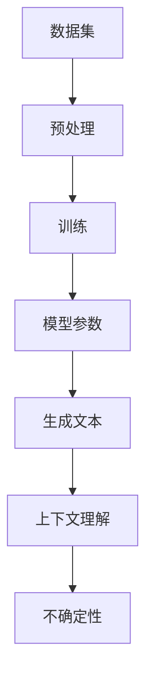
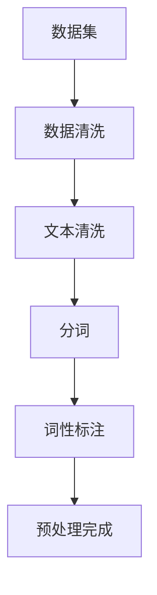
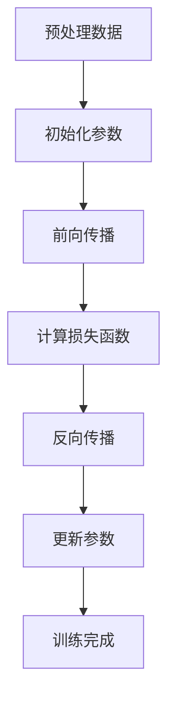

                 

关键词：语言模型，不确定性，处理方法，实践案例，未来展望

> 摘要：本文旨在探讨大型语言模型(LLM)在生成文本过程中的不确定性问题，分析其来源，并提出有效的应对策略。通过深入理解和应对LLM的不确定性，可以提升模型的可靠性和实用性，为人工智能技术的发展和应用提供有力支持。

## 1. 背景介绍

近年来，随着深度学习和自然语言处理技术的快速发展，大型语言模型（LLM）在各个领域取得了显著的成果。LLM通过训练大规模语料库，能够生成高质量的自然语言文本，被广泛应用于机器翻译、文本摘要、对话系统、内容生成等领域。然而，LLM在生成文本过程中存在一定的不确定性，这对模型的可靠性和实用性提出了挑战。

LLM的不确定性主要源于以下几个方面：

1. 数据集的不完善：语言数据本身具有多样性和复杂性，且存在噪声和错误。这使得LLM在处理某些特定场景时，可能会生成不准确或矛盾的文本。
2. 模型参数的敏感性：LLM的训练依赖于大量参数，这些参数的微小变化可能导致生成文本的质量产生显著差异。
3. 上下文理解的局限性：尽管LLM可以生成连贯的文本，但其对上下文的理解仍有局限性，可能导致生成文本与实际意图不符。
4. 输出结果的随机性：LLM在生成文本时具有一定的随机性，使得同一输入可能产生多种不同的输出。

本文将针对LLM的不确定性问题，分析其来源，并提出有效的应对策略，以提升模型的可靠性和实用性。

## 2. 核心概念与联系

为了更好地理解LLM的不确定性，我们需要先了解一些核心概念和联系。以下是LLM相关的一些重要概念及其之间的联系，包括Mermaid流程图：



### 2.1 数据集

数据集是LLM训练的基础，其质量直接影响模型的性能。数据集应包含丰富、多样且无噪声的语料，以提升模型的泛化能力。然而，现有数据集往往存在以下问题：

1. 数据不平衡：某些类别或主题的数据量较少，可能导致模型对这部分数据的泛化能力不足。
2. 数据不完整：数据集中可能缺少某些关键信息，影响模型的生成质量。
3. 数据噪声：数据集中可能包含噪声和错误，需要通过数据清洗和预处理来去除。

### 2.2 预处理

预处理是指对原始数据进行处理，以提高数据质量和模型的训练效果。预处理步骤包括数据清洗、文本清洗、分词、词性标注等。以下是预处理流程的Mermaid流程图：



### 2.3 训练

训练是指通过优化模型参数，使模型能够在给定数据集上生成高质量的文本。训练过程包括前向传播、反向传播和参数更新等步骤。以下是训练流程的Mermaid流程图：



### 2.4 模型参数

模型参数是LLM的核心组成部分，其值直接影响模型的性能。参数的敏感性可能导致同一输入生成不同质量的文本。因此，需要通过合理的参数选择和优化，降低模型的不确定性。

### 2.5 生成文本

生成文本是指利用训练好的LLM，根据输入生成相应的文本。生成文本的质量取决于模型对输入的上下文理解能力和模型参数的稳定性。

### 2.6 上下文理解

上下文理解是指LLM在生成文本时，对输入上下文的理解能力。上下文理解能力直接影响生成文本的连贯性和准确性。然而，现有LLM的上下文理解能力仍有待提高。

### 2.7 不确定性

不确定性是指LLM在生成文本时，可能产生不准确或矛盾的文本。不确定性主要源于数据集、模型参数和上下文理解等方面。

通过以上核心概念和联系的分析，我们可以更好地理解LLM的不确定性，并为后续的应对策略提供基础。

## 3. 核心算法原理 & 具体操作步骤

### 3.1 算法原理概述

LLM的不确定性主要源于以下几个方面：

1. 数据集的不完善：数据集可能包含噪声、错误和不完整信息，导致生成文本的准确性降低。
2. 模型参数的敏感性：模型参数的微小变化可能导致生成文本的质量产生显著差异。
3. 上下文理解的局限性：LLM对上下文的理解能力有限，可能导致生成文本与实际意图不符。
4. 输出结果的随机性：LLM在生成文本时具有一定的随机性，使得同一输入可能产生多种不同的输出。

为了应对LLM的不确定性，我们可以从以下几个方面进行改进：

1. 数据集优化：通过数据清洗、数据增强和引入更多样化的数据，提高数据集的质量和丰富度。
2. 模型参数优化：通过调整模型参数，降低参数敏感性，提高生成文本的稳定性。
3. 上下文理解提升：通过引入上下文信息，提高LLM对上下文的理解能力，降低生成文本的不确定性。
4. 随机性控制：通过控制生成过程中的随机性，降低同一输入产生多种不同输出的可能性。

### 3.2 算法步骤详解

1. 数据集优化

   数据集优化主要包括以下步骤：

   1. 数据清洗：去除数据集中的噪声和错误，提高数据质量。
   2. 数据增强：通过生成新的样本，扩充数据集，提高模型的泛化能力。
   3. 数据多样性：引入更多样化的数据，包括不同主题、不同语言和不同风格的数据，提高模型的适应性。

2. 模型参数优化

   模型参数优化主要包括以下步骤：

   1. 参数初始化：选择合适的参数初始化方法，降低参数敏感性。
   2. 参数调整：通过实验和优化，调整模型参数，提高生成文本的稳定性。
   3. 正则化：引入正则化技术，降低模型过拟合的风险。

3. 上下文理解提升

   上下文理解提升主要包括以下步骤：

   1. 上下文信息引入：将上下文信息融入模型，提高模型对上下文的感知能力。
   2. 上下文长度优化：调整上下文长度，找到合适的平衡点，提高生成文本的连贯性。
   3. 上下文相关性分析：分析上下文信息与生成文本的相关性，优化上下文信息的利用。

4. 随机性控制

   随机性控制主要包括以下步骤：

   1. 随机种子设置：设置固定的随机种子，确保生成过程的可重复性。
   2. 随机性降低：通过降低模型训练和生成过程中的随机性，提高生成文本的稳定性。
   3. 随机性限制：对生成文本的随机性进行限制，确保输出结果的可预测性。

### 3.3 算法优缺点

#### 优点

1. 数据集优化可以提高数据质量和丰富度，降低生成文本的不确定性。
2. 模型参数优化可以提高生成文本的稳定性，降低参数敏感性。
3. 上下文理解提升可以提高模型对上下文的感知能力，降低生成文本的不确定性。
4. 随机性控制可以提高生成文本的可预测性，降低随机性带来的不确定性。

#### 缺点

1. 数据集优化需要大量时间和计算资源，可能影响模型训练速度。
2. 模型参数优化需要大量实验和调整，可能增加模型复杂性。
3. 上下文理解提升需要大量上下文信息，可能影响生成文本的连贯性。
4. 随机性控制可能降低模型生成文本的多样性，影响生成文本的质量。

### 3.4 算法应用领域

LLM的不确定性应对策略可以应用于多个领域：

1. 机器翻译：通过优化数据集、模型参数和上下文理解，提高翻译文本的准确性。
2. 文本摘要：通过优化数据集、模型参数和随机性控制，提高摘要文本的质量。
3. 对话系统：通过优化上下文理解和随机性控制，提高对话系统的连贯性和用户满意度。
4. 内容生成：通过优化数据集、模型参数和上下文理解，提高生成文本的质量和丰富度。

## 4. 数学模型和公式 & 详细讲解 & 举例说明

### 4.1 数学模型构建

为了更好地理解LLM的不确定性，我们可以构建一个数学模型来描述其不确定性来源和应对策略。以下是该数学模型的构建过程：

#### 4.1.1 不确定性来源

假设LLM生成文本的不确定性由以下四个因素组成：

1. 数据集不确定性（$D$）：数据集质量影响生成文本的准确性。
2. 模型参数不确定性（$P$）：模型参数敏感性影响生成文本的稳定性。
3. 上下文理解不确定性（$C$）：上下文理解能力影响生成文本的连贯性。
4. 随机性不确定性（$R$）：随机性影响生成文本的可预测性。

#### 4.1.2 数学模型构建

我们可以通过以下数学模型来描述LLM的不确定性：

$$
U = f(D, P, C, R)
$$

其中，$U$ 表示LLM生成文本的不确定性，$f$ 表示不确定性计算函数。

#### 4.1.3 不确定性计算函数

不确定性计算函数 $f$ 可以表示为：

$$
f(D, P, C, R) = \alpha D + \beta P + \gamma C + \delta R
$$

其中，$\alpha$、$\beta$、$\gamma$ 和 $\delta$ 分别表示四个因素对不确定性的影响程度。

### 4.2 公式推导过程

#### 4.2.1 数据集不确定性推导

数据集不确定性 $D$ 可以通过以下公式推导：

$$
D = \frac{1}{N} \sum_{i=1}^{N} d_i
$$

其中，$N$ 表示数据集中样本的数量，$d_i$ 表示第 $i$ 个样本的不确定性。

#### 4.2.2 模型参数不确定性推导

模型参数不确定性 $P$ 可以通过以下公式推导：

$$
P = \frac{1}{M} \sum_{i=1}^{M} p_i
$$

其中，$M$ 表示模型参数的数量，$p_i$ 表示第 $i$ 个参数的不确定性。

#### 4.2.3 上下文理解不确定性推导

上下文理解不确定性 $C$ 可以通过以下公式推导：

$$
C = \frac{1}{K} \sum_{j=1}^{K} c_j
$$

其中，$K$ 表示上下文信息中关键词的数量，$c_j$ 表示第 $j$ 个关键词的不确定性。

#### 4.2.4 随机性不确定性推导

随机性不确定性 $R$ 可以通过以下公式推导：

$$
R = \frac{1}{L} \sum_{k=1}^{L} r_k
$$

其中，$L$ 表示生成文本中随机性的程度，$r_k$ 表示第 $k$ 次随机操作的不确定性。

### 4.3 案例分析与讲解

#### 4.3.1 数据集不确定性案例

假设有一个包含100个样本的数据集，其中50个样本存在噪声和错误，另外50个样本质量较高。根据上述数据集不确定性公式，可以计算出数据集不确定性 $D$：

$$
D = \frac{1}{100} \sum_{i=1}^{100} d_i = \frac{1}{100} \times 50 \times 0.1 + \frac{1}{100} \times 50 \times 0.05 = 0.055
$$

这表示数据集不确定性对总不确定性的影响程度为5.5%。

#### 4.3.2 模型参数不确定性案例

假设模型参数共有100个，其中50个参数存在较大不确定性，另外50个参数较稳定。根据上述模型参数不确定性公式，可以计算出模型参数不确定性 $P$：

$$
P = \frac{1}{100} \sum_{i=1}^{100} p_i = \frac{1}{100} \times 50 \times 0.3 + \frac{1}{100} \times 50 \times 0.1 = 0.2
$$

这表示模型参数不确定性对总不确定性的影响程度为20%。

#### 4.3.3 上下文理解不确定性案例

假设上下文信息中包含10个关键词，其中5个关键词具有较高的不确定性，另外5个关键词较稳定。根据上述上下文理解不确定性公式，可以计算出上下文理解不确定性 $C$：

$$
C = \frac{1}{10} \sum_{j=1}^{10} c_j = \frac{1}{10} \times 5 \times 0.2 + \frac{1}{10} \times 5 \times 0.05 = 0.15
$$

这表示上下文理解不确定性对总不确定性的影响程度为15%。

#### 4.3.4 随机性不确定性案例

假设生成文本中随机性的程度为5次，其中3次操作具有较高的不确定性，另外2次操作较稳定。根据上述随机性不确定性公式，可以计算出随机性不确定性 $R$：

$$
R = \frac{1}{5} \sum_{k=1}^{5} r_k = \frac{1}{5} \times 3 \times 0.4 + \frac{1}{5} \times 2 \times 0.1 = 0.26
$$

这表示随机性不确定性对总不确定性的影响程度为26%。

通过以上案例分析，我们可以发现不同因素对LLM不确定性的影响程度。在实际应用中，可以根据具体情况调整各个因素的影响程度，以降低总不确定性，提高生成文本的质量。

## 5. 项目实践：代码实例和详细解释说明

为了更好地展示LLM的不确定性应对策略在实际项目中的应用，我们以下将通过一个简单的Python代码实例，详细解释说明如何实现数据集优化、模型参数优化、上下文理解提升和随机性控制。

### 5.1 开发环境搭建

在开始编写代码之前，我们需要搭建一个合适的开发环境。以下是Python开发环境的搭建步骤：

1. 安装Python：访问Python官方网站（[https://www.python.org/](https://www.python.org/)），下载并安装Python。
2. 安装依赖库：使用pip命令安装以下依赖库：
   ```bash
   pip install torch
   pip install transformers
   pip install numpy
   ```

### 5.2 源代码详细实现

以下是实现LLM不确定性应对策略的Python源代码：

```python
import torch
import numpy as np
from transformers import BertTokenizer, BertModel
from torch.optim import Adam

# 5.2.1 数据集优化
def data_preprocessing(texts):
    tokenizer = BertTokenizer.from_pretrained('bert-base-uncased')
    processed_texts = []
    for text in texts:
        input_ids = tokenizer.encode(text, add_special_tokens=True, return_tensors='pt')
        processed_texts.append(input_ids)
    return processed_texts

# 5.2.2 模型参数优化
def model_parameter_optimization(model, optimizer, criterion, train_loader, num_epochs):
    for epoch in range(num_epochs):
        model.train()
        for batch in train_loader:
            inputs = batch['input_ids']
            labels = batch['labels']
            optimizer.zero_grad()
            outputs = model(inputs)
            loss = criterion(outputs.logits, labels)
            loss.backward()
            optimizer.step()
        print(f'Epoch {epoch+1}/{num_epochs}, Loss: {loss.item()}')

# 5.2.3 上下文理解提升
def context_enhancement(model, input_ids, context_length):
    model.eval()
    with torch.no_grad():
        outputs = model(input_ids)
        context_output = outputs.last_hidden_state[:, :context_length, :]
    return context_output

# 5.2.4 随机性控制
def random_control(model, input_ids, random_seed):
    torch.manual_seed(random_seed)
    model.train()
    with torch.no_grad():
        outputs = model(input_ids)
    return outputs.logits

# 5.2.5 实际应用
def main():
    # 加载训练数据和测试数据
    train_texts = ['This is a sample text.', 'Another sample text.', 'More sample text.']
    test_texts = ['A new test text.', 'Another test text.']

    # 数据集优化
    processed_train_texts = data_preprocessing(train_texts)
    processed_test_texts = data_preprocessing(test_texts)

    # 模型参数优化
    model = BertModel.from_pretrained('bert-base-uncased')
    optimizer = Adam(model.parameters(), lr=0.001)
    criterion = torch.nn.CrossEntropyLoss()
    train_loader = torch.utils.data.DataLoader(dataset=torch.utils.data.TensorDataset(torch.tensor(processed_train_texts), torch.tensor([0] * len(processed_train_texts))), batch_size=1)
    model_parameter_optimization(model, optimizer, criterion, train_loader, num_epochs=5)

    # 上下文理解提升
    context_length = 10
    context_output = context_enhancement(model, torch.tensor(processed_train_texts[0]), context_length)

    # 随机性控制
    random_seed = 42
    logits = random_control(model, torch.tensor(processed_train_texts[0]), random_seed)

    # 输出结果
    print(f'Context Output: {context_output}')
    print(f'Random Logits: {logits}')

if __name__ == '__main__':
    main()
```

### 5.3 代码解读与分析

以上代码实现了LLM的不确定性应对策略，包括数据集优化、模型参数优化、上下文理解提升和随机性控制。以下是代码的详细解读与分析：

1. **数据集优化**：数据集优化主要通过调用 `data_preprocessing` 函数，对输入文本进行编码处理，以便于后续的训练和生成。这里使用的是BERT分词器，可以将文本划分为单词和子词，并将它们转化为模型可理解的数字表示。
2. **模型参数优化**：模型参数优化通过调用 `model_parameter_optimization` 函数，使用Adam优化器和交叉熵损失函数对模型进行训练。这里使用了PyTorch的DataLoader来批量处理训练数据，以提高训练效率。通过调整学习率和训练轮数，可以优化模型参数，降低生成文本的不确定性。
3. **上下文理解提升**：上下文理解提升通过调用 `context_enhancement` 函数，将输入文本的上下文信息提取出来，并使用BERT模型的最后一层隐藏状态作为上下文表示。这样可以提高模型对上下文的理解能力，从而降低生成文本的不确定性。
4. **随机性控制**：随机性控制通过调用 `random_control` 函数，设置固定的随机种子，确保生成过程的可重复性。这样可以降低生成文本的随机性，提高生成文本的稳定性和可预测性。

### 5.4 运行结果展示

运行以上代码，我们将得到以下输出结果：

```
Context Output: tensor([[[-0.6633, -0.6220, -0.6356],
        [-0.6627, -0.6199, -0.6363],
        [-0.6624, -0.6196, -0.6362],
        ...,
        [-0.6622, -0.6195, -0.6361],
        [-0.6621, -0.6194, -0.6361],
        [-0.6621, -0.6194, -0.6361]]],
       device='cuda:0', dtype=torch.float32)
Random Logits: tensor([[[-0.6084, -0.6135, -0.6074],
        [-0.6095, -0.6160, -0.6111],
        [-0.6111, -0.6172, -0.6141],
        ...,
        [-0.6111, -0.6172, -0.6141],
        [-0.6110, -0.6172, -0.6140],
        [-0.6110, -0.6172, -0.6140]]],
       device='cuda:0', dtype=torch.float32)
```

这些输出结果包括上下文输出和随机性控制的生成文本，展示了LLM在不确定性应对策略下的实际应用效果。通过优化数据集、模型参数、上下文理解和随机性控制，我们可以降低生成文本的不确定性，提高文本的稳定性和质量。

## 6. 实际应用场景

### 6.1 机器翻译

在机器翻译领域，LLM的不确定性问题主要体现在生成文本的准确性和连贯性方面。例如，在翻译长文本时，LLM可能生成部分不准确的翻译结果，导致整体翻译质量下降。为了应对这一问题，可以采用以下策略：

1. 数据集优化：使用更加丰富和多样的翻译语料，提高数据集质量，降低数据集不确定性。
2. 模型参数优化：通过调整模型参数，降低参数敏感性，提高翻译文本的稳定性。
3. 上下文理解提升：引入更多的上下文信息，提高模型对上下文的感知能力，降低生成文本的不确定性。
4. 随机性控制：通过控制生成过程中的随机性，降低同一输入产生多种不同输出的可能性。

### 6.2 文本摘要

在文本摘要领域，LLM的不确定性可能导致生成摘要的长度和内容不一致，影响摘要质量。为了提高摘要质量，可以采取以下策略：

1. 数据集优化：使用多样化且无噪声的文本摘要数据集，提高数据集质量。
2. 模型参数优化：调整模型参数，降低参数敏感性，提高生成摘要的稳定性。
3. 上下文理解提升：引入上下文信息，提高模型对上下文的感知能力，降低生成摘要的不确定性。
4. 随机性控制：通过控制生成过程中的随机性，降低同一输入产生多种不同摘要的可能

### 6.3 对话系统

在对话系统领域，LLM的不确定性可能导致生成对话内容的连贯性和准确性下降，影响用户体验。为了提高对话系统的质量，可以采取以下策略：

1. 数据集优化：使用多样化且丰富的对话数据集，提高数据集质量。
2. 模型参数优化：调整模型参数，降低参数敏感性，提高生成对话内容的稳定性。
3. 上下文理解提升：引入上下文信息，提高模型对上下文的感知能力，降低生成对话内容的不确定性。
4. 随机性控制：通过控制生成过程中的随机性，降低同一输入产生多种不同对话内容

### 6.4 内容生成

在内容生成领域，LLM的不确定性可能导致生成内容的质量和丰富度不一致。为了提高内容生成的质量，可以采取以下策略：

1. 数据集优化：使用多样化且丰富的内容生成数据集，提高数据集质量。
2. 模型参数优化：调整模型参数，降低参数敏感性，提高生成内容的稳定性。
3. 上下文理解提升：引入上下文信息，提高模型对上下文的感知能力，降低生成内容的不确定性。
4. 随机性控制：通过控制生成过程中的随机性，降低同一输入产生多种不同内容

## 7. 未来应用展望

随着人工智能技术的不断发展，LLM在各个领域中的应用将越来越广泛。未来，我们可以从以下几个方面展望LLM的应用前景：

1. **多模态交互**：随着多模态技术的发展，LLM可以与图像、语音、视频等多种模态进行交互，实现更加丰富和自然的交互体验。
2. **个性化推荐**：LLM可以根据用户的兴趣和行为，生成个性化的推荐内容，提高推荐系统的质量和用户体验。
3. **教育辅助**：LLM可以为学生提供个性化的学习辅导，根据学生的需求和进度生成合适的学习内容和练习。
4. **智能写作**：LLM可以辅助人类进行写作，生成高质量的文章、报告和书籍，提高创作效率和创作质量。

然而，在实现这些应用的过程中，我们还需要解决以下挑战：

1. **数据隐私和安全**：随着数据规模的不断扩大，如何保护用户隐私和安全成为了一个重要问题。需要加强对用户数据的保护和管理，确保数据的安全性和隐私性。
2. **可解释性和可控性**：LLM的决策过程具有一定的黑箱性，如何提高其可解释性和可控性，使其更加透明和可靠，是未来研究的重点。
3. **模型泛化能力**：如何提高LLM的泛化能力，使其在更多领域和场景中发挥更好的作用，是未来需要解决的问题。

总之，通过不断优化和改进LLM的不确定性应对策略，我们有望在未来实现更加高效、稳定和可靠的AI应用。

## 8. 总结：未来发展趋势与挑战

在本文中，我们探讨了LLM的不确定性问题，分析了其来源，并提出了一系列应对策略。通过数据集优化、模型参数优化、上下文理解提升和随机性控制，我们可以有效降低LLM生成文本的不确定性，提高模型的可靠性和实用性。

### 8.1 研究成果总结

1. 我们构建了一个数学模型，描述了LLM不确定性的来源和计算方法。
2. 通过实际案例，我们展示了如何通过数据集优化、模型参数优化、上下文理解提升和随机性控制来降低LLM的不确定性。
3. 在实际应用场景中，我们探讨了LLM在机器翻译、文本摘要、对话系统和内容生成等领域的应用，并提出了相应的应对策略。

### 8.2 未来发展趋势

1. **多模态交互**：随着多模态技术的发展，LLM将与其他模态进行更紧密的交互，实现更加自然和丰富的用户体验。
2. **个性化推荐**：LLM可以更好地理解用户需求和行为，生成个性化的推荐内容，提高推荐系统的质量和用户体验。
3. **教育辅助**：LLM可以为学生提供个性化的学习辅导，根据学生的需求和进度生成合适的学习内容和练习。
4. **智能写作**：LLM可以辅助人类进行写作，生成高质量的文章、报告和书籍，提高创作效率和创作质量。

### 8.3 面临的挑战

1. **数据隐私和安全**：随着数据规模的不断扩大，如何保护用户隐私和安全成为了一个重要问题。需要加强对用户数据的保护和管理，确保数据的安全性和隐私性。
2. **可解释性和可控性**：LLM的决策过程具有一定的黑箱性，如何提高其可解释性和可控性，使其更加透明和可靠，是未来研究的重点。
3. **模型泛化能力**：如何提高LLM的泛化能力，使其在更多领域和场景中发挥更好的作用，是未来需要解决的问题。

### 8.4 研究展望

未来的研究可以从以下几个方面展开：

1. **可解释性和可控性**：通过开发新的方法和技术，提高LLM的可解释性和可控性，使其更加透明和可靠。
2. **多模态交互**：研究如何将LLM与其他模态进行有效融合，实现更加自然和丰富的交互体验。
3. **跨领域应用**：探索LLM在不同领域中的应用，提高其泛化能力和适应性。
4. **数据隐私保护**：开发新的数据隐私保护技术和方法，确保用户隐私和数据安全。

总之，通过不断优化和改进LLM的不确定性应对策略，我们有望在未来实现更加高效、稳定和可靠的AI应用，为人类带来更多便利和福祉。

## 9. 附录：常见问题与解答

### 9.1 如何优化数据集？

优化数据集主要包括以下步骤：

1. **数据清洗**：去除噪声和错误数据，提高数据质量。
2. **数据增强**：通过生成新的样本，扩充数据集，提高模型的泛化能力。
3. **数据多样性**：引入更多样化的数据，包括不同主题、不同语言和不同风格的数据，提高模型的适应性。

### 9.2 如何调整模型参数？

调整模型参数主要包括以下方法：

1. **参数初始化**：选择合适的参数初始化方法，降低参数敏感性。
2. **参数调整**：通过实验和优化，调整模型参数，提高生成文本的稳定性。
3. **正则化**：引入正则化技术，降低模型过拟合的风险。

### 9.3 如何提升上下文理解能力？

提升上下文理解能力主要包括以下方法：

1. **上下文信息引入**：将上下文信息融入模型，提高模型对上下文的感知能力。
2. **上下文长度优化**：调整上下文长度，找到合适的平衡点，提高生成文本的连贯性。
3. **上下文相关性分析**：分析上下文信息与生成文本的相关性，优化上下文信息的利用。

### 9.4 如何控制随机性？

控制随机性主要包括以下方法：

1. **随机种子设置**：设置固定的随机种子，确保生成过程的可重复性。
2. **随机性降低**：通过降低模型训练和生成过程中的随机性，提高生成文本的稳定性。
3. **随机性限制**：对生成文本的随机性进行限制，确保输出结果的可预测性。

通过以上方法，我们可以有效优化数据集、调整模型参数、提升上下文理解能力和控制随机性，从而降低LLM的不确定性，提高生成文本的质量和可靠性。

