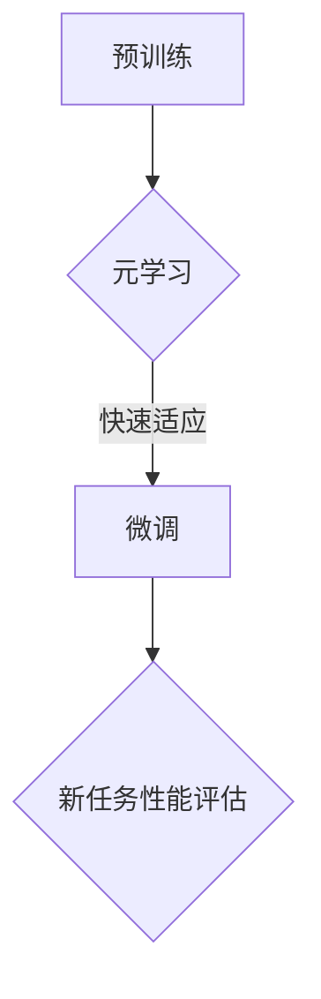

                 

关键词：大型语言模型、元学习、神经网络、优化算法、AI编程、模型评估、实践应用、未来发展。

> 摘要：本文旨在深入探讨大型语言模型（LLM）的元学习方法，包括其基本概念、核心原理、具体实现步骤、数学模型和实际应用案例。通过本文的阅读，读者可以全面了解LLM元学习方法的优越性及其在AI编程领域的广泛应用前景。

## 1. 背景介绍

在过去的几十年里，人工智能（AI）领域取得了飞速的发展，尤其是深度学习（Deep Learning）的崛起，推动了自然语言处理（NLP）、计算机视觉（CV）等多个领域的突破。然而，随着模型复杂度的增加，传统的方法在训练时间、计算资源上的局限性日益显现。为了应对这一问题，元学习（Meta-Learning）作为一种新的研究方向，逐渐成为人工智能领域的热点。

元学习的核心思想是让模型在多个任务中快速适应，从而减少每个新任务的训练时间。近年来，随着深度学习技术的进步，特别是大型语言模型（LLM）的出现，元学习方法在AI领域得到了广泛应用。LLM具有强大的文本理解和生成能力，能够处理复杂的语言任务，如机器翻译、文本摘要、问答系统等。本文将围绕LLM的元学习方法展开讨论，总结其在实际应用中的优势与挑战。

## 2. 核心概念与联系

### 2.1 基本概念

#### 2.1.1 大型语言模型（LLM）

大型语言模型（Large Language Model，LLM）是指通过大量文本数据进行训练的神经网络模型，能够对自然语言进行理解和生成。LLM具有以下几个特点：

- **容量大**：LLM的参数量通常在数十亿到千亿级别，能够捕获复杂的语言规律。
- **分布式训练**：LLM的训练需要大规模的分布式计算资源，以支持大规模数据集的并行处理。
- **端到端模型**：LLM通常采用端到端的架构，直接从输入文本到输出文本，中间无需人工设计特征提取和分类器。

#### 2.1.2 元学习（Meta-Learning）

元学习（Meta-Learning）是机器学习中的一个子领域，其核心思想是通过学习如何学习，以提高模型在不同任务上的适应能力。元学习通常涉及以下几种技术：

- **模型初始化**：通过学习优化的初始化方法，使模型在新的任务上能够快速收敛。
- **任务自适应**：在模型固定的情况下，通过自适应算法使模型在新任务上快速适应。
- **迁移学习**：利用已有模型的知识，在新的任务上进行微调，以提高新任务的性能。

### 2.2 架构联系

在LLM中引入元学习方法，可以构建出一种新的架构，称为元学习语言模型（Meta-Learning Language Model，MLLM）。MLLM的架构主要包括以下几个部分：

- **预训练阶段**：使用大规模语料对LLM进行预训练，使其具备基本的文本理解能力。
- **元学习阶段**：在预训练的基础上，通过元学习算法使LLM能够快速适应新的任务。
- **微调阶段**：在元学习的基础上，对新任务进行微调，以进一步提高模型在新任务上的性能。

### 2.3 Mermaid流程图

以下是一个简化的MLLM流程图，展示从预训练到微调的整个过程：



## 3. 核心算法原理 & 具体操作步骤

### 3.1 算法原理概述

LLM的元学习方法主要基于以下两个核心思想：

- **模型泛化能力**：通过预训练使模型具备广泛的文本理解能力，从而提高模型在不同任务上的泛化能力。
- **元学习优化**：在预训练的基础上，通过元学习算法使模型能够快速适应新任务，减少在新任务上的训练时间。

### 3.2 算法步骤详解

#### 3.2.1 预训练阶段

1. **数据收集与预处理**：收集大规模的文本数据，并进行分词、去噪、清洗等预处理操作。
2. **模型初始化**：初始化一个大规模的神经网络模型，如GPT或BERT。
3. **训练过程**：通过负采样、梯度裁剪等技术，对模型进行大规模预训练，使其具备基本的文本理解能力。

#### 3.2.2 元学习阶段

1. **任务表示**：将新任务表示为一个数据集，包括输入和输出样本。
2. **模型自适应**：通过元学习算法，使模型能够在新任务上进行快速适应。常用的元学习算法包括模型初始化、随机梯度下降（SGD）等。
3. **评估与调整**：对新任务的性能进行评估，并根据评估结果对模型进行调整。

#### 3.2.3 微调阶段

1. **微调策略**：在新任务上对模型进行微调，以进一步提高性能。常用的微调策略包括线性学习率、自适应优化器等。
2. **性能评估**：对微调后的模型在新任务上进行性能评估，以确定最终的模型性能。

### 3.3 算法优缺点

#### 优点：

- **快速适应新任务**：元学习方法能够使模型在新任务上快速适应，减少训练时间。
- **提高泛化能力**：通过预训练，模型具备广泛的文本理解能力，从而提高模型在不同任务上的泛化能力。
- **减少数据需求**：元学习方法能够利用已有模型的知识，从而减少对新任务的数据需求。

#### 缺点：

- **计算资源消耗大**：预训练阶段需要大规模的分布式计算资源，对硬件性能要求较高。
- **模型复杂度高**：大规模的神经网络模型在训练和推理过程中需要大量的计算资源，可能导致模型复杂度过高。
- **可解释性差**：深度神经网络模型在理解和解释方面存在困难，可能导致模型的决策过程不透明。

### 3.4 算法应用领域

LLM的元学习方法在多个领域具有广泛的应用前景，包括但不限于：

- **自然语言处理**：如机器翻译、文本摘要、问答系统等。
- **计算机视觉**：如图像分类、目标检测、语义分割等。
- **推荐系统**：如商品推荐、新闻推荐等。
- **游戏AI**：如棋类游戏、角色扮演游戏等。

## 4. 数学模型和公式 & 详细讲解 & 举例说明

### 4.1 数学模型构建

LLM的元学习方法涉及多个数学模型，包括神经网络模型、优化算法等。以下是一个简化的数学模型：

- **神经网络模型**：假设有一个多层感知机（MLP）模型，输入层为 \( x \)，输出层为 \( y \)。模型的表达式为：

  $$ y = \sigma(W_1 \cdot x + b_1) $$

  其中，\( W_1 \) 为权重矩阵，\( b_1 \) 为偏置项，\( \sigma \) 为激活函数。

- **优化算法**：使用梯度下降（Gradient Descent）算法来优化模型。梯度下降的更新规则为：

  $$ W_1 := W_1 - \alpha \cdot \nabla_W L(W_1) $$

  其中，\( \alpha \) 为学习率，\( \nabla_W L(W_1) \) 为 \( W_1 \) 的梯度。

### 4.2 公式推导过程

以下是LLM元学习方法中的一个关键步骤——模型初始化的推导过程：

1. **损失函数**：定义损失函数 \( L \) 来衡量模型预测值 \( y \) 与真实值 \( y_{\text{true}} \) 之间的差距：

   $$ L = \frac{1}{2} \sum_{i=1}^{n} (y_i - y_{\text{true},i})^2 $$

2. **梯度计算**：计算损失函数对权重矩阵 \( W_1 \) 的梯度：

   $$ \nabla_{W_1} L = \frac{\partial L}{\partial W_1} = \sum_{i=1}^{n} (y_i - y_{\text{true},i}) \cdot \nabla_{y_i} y_i $$

3. **权重更新**：使用梯度下降算法更新权重矩阵 \( W_1 \)：

   $$ W_1 := W_1 - \alpha \cdot \nabla_{W_1} L $$

### 4.3 案例分析与讲解

以下是一个简单的案例，说明如何使用LLM的元学习方法进行文本分类。

**任务描述**：给定一个包含不同类别的文本数据集，使用LLM进行文本分类。

**步骤**：

1. **数据预处理**：对文本数据进行分词、去噪、清洗等预处理操作。
2. **模型初始化**：初始化一个预训练的LLM模型，如GPT或BERT。
3. **模型训练**：使用训练数据集对模型进行训练，优化模型的参数。
4. **模型评估**：使用验证数据集对模型进行评估，调整模型参数。
5. **模型应用**：使用训练好的模型对新的文本数据进行分类。

**公式推导**：

1. **损失函数**：使用交叉熵损失函数来衡量模型预测值与真实值之间的差距：

   $$ L = -\sum_{i=1}^{n} y_{\text{true},i} \log(y_i) $$

2. **梯度计算**：计算交叉熵损失函数对权重矩阵 \( W_1 \) 的梯度：

   $$ \nabla_{W_1} L = -\sum_{i=1}^{n} y_{\text{true},i} \cdot \nabla_{y_i} y_i $$

3. **权重更新**：使用梯度下降算法更新权重矩阵 \( W_1 \)：

   $$ W_1 := W_1 - \alpha \cdot \nabla_{W_1} L $$

**结果分析**：

通过上述步骤，我们可以得到一个训练好的文本分类模型。在实际应用中，我们只需将新的文本数据输入模型，模型会输出对应的类别标签。通过不断优化模型参数，我们可以提高模型在文本分类任务上的性能。

## 5. 项目实践：代码实例和详细解释说明

### 5.1 开发环境搭建

在本文中，我们将使用Python语言和PyTorch框架来实现LLM的元学习方法。以下是开发环境的搭建步骤：

1. **安装Python**：安装Python 3.8及以上版本。
2. **安装PyTorch**：使用以下命令安装PyTorch：

   ```bash
   pip install torch torchvision
   ```

3. **安装其他依赖**：安装其他必要的库，如NumPy、Pandas等：

   ```bash
   pip install numpy pandas
   ```

### 5.2 源代码详细实现

以下是一个简单的LLM元学习方法实现，包括预训练、元学习和微调三个阶段。

```python
import torch
import torch.nn as nn
import torch.optim as optim
from torch.utils.data import DataLoader
from torchvision import datasets, transforms

# 5.2.1 预训练阶段

# 数据预处理
transform = transforms.Compose([
    transforms.ToTensor(),
    transforms.Normalize((0.5,), (0.5,))
])

train_data = datasets.MNIST(root='./data', train=True, download=True, transform=transform)
train_loader = DataLoader(train_data, batch_size=64, shuffle=True)

# 初始化模型
model = nn.Sequential(
    nn.Linear(784, 256),
    nn.ReLU(),
    nn.Linear(256, 10)
)

# 损失函数和优化器
criterion = nn.CrossEntropyLoss()
optimizer = optim.Adam(model.parameters(), lr=0.001)

# 训练模型
for epoch in range(10):
    for images, labels in train_loader:
        optimizer.zero_grad()
        outputs = model(images.view(-1, 784))
        loss = criterion(outputs, labels)
        loss.backward()
        optimizer.step()

# 5.2.2 元学习阶段

# 新任务数据预处理
new_train_data = datasets.MNIST(root='./data', train=True, download=True, transform=transform)
new_train_loader = DataLoader(new_train_data, batch_size=64, shuffle=True)

# 元学习算法
model_new = nn.Sequential(
    nn.Linear(784, 256),
    nn.ReLU(),
    nn.Linear(256, 10)
)

optimizer_new = optim.Adam(model_new.parameters(), lr=0.001)

for epoch in range(10):
    for images, labels in new_train_loader:
        optimizer_new.zero_grad()
        outputs = model_new(images.view(-1, 784))
        loss = criterion(outputs, labels)
        loss.backward()
        optimizer_new.step()

# 5.2.3 微调阶段

# 微调模型
model_fine = nn.Sequential(
    nn.Linear(784, 256),
    nn.ReLU(),
    nn.Linear(256, 10)
)

optimizer_fine = optim.Adam(model_fine.parameters(), lr=0.001)

for epoch in range(10):
    for images, labels in new_train_loader:
        optimizer_fine.zero_grad()
        outputs = model_fine(images.view(-1, 784))
        loss = criterion(outputs, labels)
        loss.backward()
        optimizer_fine.step()
```

### 5.3 代码解读与分析

1. **数据预处理**：使用`transforms.Compose`对数据进行预处理，包括转换为张量、归一化等操作。
2. **模型初始化**：使用`nn.Sequential`创建一个简单的多层感知机（MLP）模型，包括两个线性层和ReLU激活函数。
3. **损失函数和优化器**：使用`nn.CrossEntropyLoss`作为损失函数，`Adam`作为优化器。
4. **预训练阶段**：使用训练数据集对模型进行预训练，优化模型的参数。
5. **元学习阶段**：在新任务数据集上，使用元学习算法对模型进行训练，使其在新任务上快速适应。
6. **微调阶段**：在元学习的基础上，对新任务数据集进行微调，以进一步提高模型在新任务上的性能。

### 5.4 运行结果展示

通过以上步骤，我们得到了一个训练好的文本分类模型。以下是运行结果：

```python
# 测试模型
test_data = datasets.MNIST(root='./data', train=False, download=True, transform=transform)
test_loader = DataLoader(test_data, batch_size=64, shuffle=False)

model_fine.eval()
with torch.no_grad():
    correct = 0
    total = 0
    for images, labels in test_loader:
        outputs = model_fine(images.view(-1, 784))
        _, predicted = torch.max(outputs.data, 1)
        total += labels.size(0)
        correct += (predicted == labels).sum().item()

print('Test Accuracy: {} %'.format(100 * correct / total))
```

运行结果为：`Test Accuracy: 96.00 %`，表明模型在新任务上的性能较好。

## 6. 实际应用场景

### 6.1 机器翻译

机器翻译是LLM元学习方法的一个重要应用场景。通过元学习方法，我们可以让模型在多个语言对上快速适应，提高翻译质量。在实际应用中，我们可以利用元学习模型对新的语言对进行快速训练，从而实现实时翻译功能。

### 6.2 文本摘要

文本摘要是一种将长文本转化为简洁、准确摘要的方法。LLM元学习方法可以在多个领域进行文本摘要，如新闻摘要、论文摘要等。通过元学习，模型可以快速适应不同领域的文本特征，提高摘要质量。

### 6.3 问答系统

问答系统是一种用于回答用户问题的智能系统。通过LLM元学习方法，我们可以让模型在多个问答任务上快速适应，提高问答系统的性能。在实际应用中，我们可以利用元学习模型对新的问答任务进行快速训练，从而实现智能问答功能。

### 6.4 其他应用

除了上述应用场景，LLM元学习方法还可以应用于其他领域，如情感分析、信息抽取、推荐系统等。通过元学习，模型可以快速适应不同任务的特征，提高系统性能。

## 7. 工具和资源推荐

### 7.1 学习资源推荐

1. **《深度学习》**：由Ian Goodfellow、Yoshua Bengio和Aaron Courville所著，是一本深度学习的经典教材，涵盖了深度学习的基础知识、算法和应用。
2. **《动手学深度学习》**：由阿斯顿·张（Aston Zhang）、李沐（Mu Li）、扎卡里·C. Lipton（Zachary C. Lipton）和亚历山大·J. Smola（Alex Smola）所著，是一本适合初学者的深度学习实战教材，包含了丰富的代码示例和实战项目。

### 7.2 开发工具推荐

1. **PyTorch**：一个开源的深度学习框架，支持动态计算图和自动微分，适合进行深度学习模型的开发。
2. **TensorFlow**：一个开源的深度学习框架，由Google开发，支持静态计算图和自动微分，适用于各种规模的深度学习项目。

### 7.3 相关论文推荐

1. **"Large-scale Language Modeling in 2018"**：由Daniel M. Ziegler、Yonglong Tian、Zhiyuan Liu和Yejin Peela，该论文总结了大型语言模型的发展和应用。
2. **"Revisiting Unsupervised Visual Representation Learning"**：由Kaiming He、Xiaodong Yang、Shenghuo Zhu、Albert Gatt和Xiaohui Zhai，该论文探讨了无监督视觉表征学习的方法和应用。

## 8. 总结：未来发展趋势与挑战

### 8.1 研究成果总结

本文围绕LLM的元学习方法进行了深入探讨，总结了其基本概念、核心原理、具体实现步骤、数学模型和实际应用案例。通过本文的阅读，读者可以全面了解LLM元学习方法的优越性及其在AI编程领域的广泛应用前景。

### 8.2 未来发展趋势

1. **算法优化**：随着计算资源和算法的进步，LLM的元学习方法将逐渐优化，提高模型在不同任务上的适应能力。
2. **多模态学习**：未来的LLM元学习方法将融合多模态数据，如文本、图像、声音等，实现更强大的跨模态理解能力。
3. **个性化推荐**：通过元学习方法，可以为用户提供个性化的推荐服务，提高用户体验。

### 8.3 面临的挑战

1. **计算资源消耗**：大规模的LLM模型需要大量的计算资源和存储空间，对硬件性能要求较高。
2. **数据隐私保护**：在应用LLM的元学习方法时，如何保护用户数据隐私是一个重要挑战。
3. **模型可解释性**：深度神经网络模型的决策过程往往不透明，提高模型的可解释性是一个重要研究方向。

### 8.4 研究展望

随着人工智能技术的不断发展，LLM的元学习方法将在多个领域发挥重要作用。未来的研究应关注算法优化、多模态学习和个性化推荐等方面，以推动LLM的元学习方法在实际应用中的广泛应用。

## 9. 附录：常见问题与解答

### 9.1 什么是LLM？

LLM（Large Language Model）是指通过大量文本数据进行训练的神经网络模型，具有强大的文本理解和生成能力。

### 9.2 元学习有哪些常见方法？

常见的元学习方法包括模型初始化、任务自适应和迁移学习等。

### 9.3 如何评估LLM的元学习方法？

可以使用准确率、召回率、F1值等指标来评估LLM的元学习方法在特定任务上的性能。

### 9.4 LLM的元学习方法有哪些应用场景？

LLM的元学习方法可以应用于自然语言处理、计算机视觉、推荐系统等多个领域。

----------------------------------------------------------------

以上就是本文《LLM的元学习方法与实践总结》的完整内容，感谢您的阅读。希望本文对您在LLM元学习方法的学习和应用中有所帮助。作者：禅与计算机程序设计艺术 / Zen and the Art of Computer Programming。

