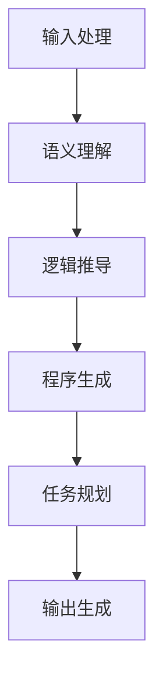

                 

关键词：自然语言处理、图灵完备性、任务规划、人工智能、大语言模型、逻辑推导、代码生成、应用程序开发

## 摘要

本文将深入探讨大型语言模型(LLM)的图灵完备性及其在任务规划领域的应用。首先，我们将回顾图灵完备性的基本概念，并解释为什么图灵完备性是评估人工智能系统能力的重要标准。接着，我们将探讨LLM如何实现图灵完备性，以及其背后的关键技术。随后，文章将讨论LLM在任务规划中的具体应用，包括逻辑推导、代码生成和应用程序开发等方面。最后，我们将展望LLM在任务规划领域的未来发展方向和潜在挑战。

## 1. 背景介绍

### 图灵完备性

图灵完备性（Turing completeness）是一个术语，用来描述某种计算模型（如计算机程序、编程语言或算法）是否能够模拟图灵机的所有功能。图灵机是一种抽象的计算模型，由艾伦·图灵（Alan Turing）在20世纪30年代提出，用于定义计算的理论界限。如果一个模型能够执行图灵机的所有操作，那么它被认为是图灵完备的。

图灵完备性是评估计算系统能力的一个基本标准，因为它意味着该系统能够解决任何可计算的问题。如果一个计算模型不是图灵完备的，那么它将无法解决某些类型的问题，从而限制了其应用范围。

### 语言模型

语言模型（Language Model）是自然语言处理（Natural Language Processing, NLP）领域的一种基础技术。它旨在对自然语言文本进行建模，以便计算机能够理解和生成自然语言。语言模型通过学习大量文本数据，捕捉语言的统计特性和语法结构，从而能够预测下一个单词或词组。

随着深度学习技术的发展，大型语言模型（Large Language Model，LLM）如GPT-3、BERT和TuringTalk等得到了广泛的应用。这些模型具有数以万亿计的参数，可以处理复杂的自然语言任务，如文本生成、问答系统和机器翻译等。

## 2. 核心概念与联系

### LLM的图灵完备性

LLM的图灵完备性可以通过以下几个关键特性来解释：

1. **数据处理能力**：LLM可以接受和处理任意长度的文本数据，这类似于图灵机的无限带。
2. **程序生成能力**：LLM可以通过学习编程语言的文本示例，生成新的代码，从而实现程序生成。
3. **逻辑推导能力**：LLM可以理解和生成包含逻辑推理的文本，如证明和逻辑问题。
4. **自动化任务规划**：LLM可以理解任务描述，并生成执行这些任务的步骤。

### Mermaid 流程图

下面是一个简化的Mermaid流程图，展示了LLM如何实现图灵完备性：



- **输入处理**：LLM接收自然语言输入，并对其进行处理以提取语义信息。
- **语义理解**：LLM使用预训练的神经网络模型来理解输入文本的含义。
- **逻辑推导**：LLM利用其逻辑推理能力，对输入文本进行逻辑推导，生成符合逻辑的输出。
- **程序生成**：LLM可以根据任务需求，生成执行特定任务的代码。
- **任务规划**：LLM能够根据任务描述，规划执行任务的步骤，并生成详细的执行计划。
- **输出生成**：LLM最终生成符合预期结果的输出，如文本、代码或执行报告。

## 3. 核心算法原理 & 具体操作步骤

### 3.1 算法原理概述

LLM的图灵完备性主要依赖于以下几个核心算法原理：

1. **深度神经网络**：LLM使用深度神经网络（Deep Neural Network, DNN）作为其基础架构。DNN可以通过多层非线性变换，对输入数据进行复杂的特征提取和表示。
2. **注意力机制**：LLM中的注意力机制（Attention Mechanism）可以有效地捕捉输入文本中的关键信息，从而提高模型的语义理解能力。
3. **生成对抗网络**：LLM可以利用生成对抗网络（Generative Adversarial Networks, GAN）来生成高质量的文本数据，从而提高其数据增强能力。
4. **强化学习**：LLM可以通过强化学习（Reinforcement Learning, RL）来优化其任务规划策略，从而提高其自动化任务规划能力。

### 3.2 算法步骤详解

1. **输入处理**：
   - 接收自然语言输入，如文本、语音或图像。
   - 对输入进行预处理，如分词、去噪和格式化。

2. **语义理解**：
   - 使用DNN模型对输入文本进行编码，提取语义特征。
   - 利用注意力机制，捕捉输入文本中的关键信息。

3. **逻辑推导**：
   - 基于输入文本的语义特征，进行逻辑推理和推导。
   - 生成符合逻辑的中间结果。

4. **程序生成**：
   - 使用生成对抗网络，从中间结果中生成代码。
   - 对生成的代码进行格式化和语法检查。

5. **任务规划**：
   - 根据任务描述，生成执行任务的步骤和执行计划。
   - 使用强化学习，优化任务规划策略。

6. **输出生成**：
   - 根据执行计划和任务要求，生成最终的输出结果。
   - 如文本、代码或执行报告。

### 3.3 算法优缺点

**优点**：

- **强大的语义理解能力**：LLM可以处理复杂的自然语言输入，并提取丰富的语义信息。
- **自动化任务规划**：LLM能够根据任务描述，自动生成执行任务的步骤和执行计划。
- **代码生成能力**：LLM可以生成高质量的代码，从而提高开发效率。

**缺点**：

- **计算资源需求大**：LLM需要大量的计算资源，特别是训练和推理过程中。
- **数据依赖性强**：LLM的性能很大程度上依赖于训练数据的数量和质量。

### 3.4 算法应用领域

LLM的图灵完备性使其在多个领域具有广泛的应用潜力：

- **自然语言处理**：用于文本生成、机器翻译、问答系统和情感分析等任务。
- **编程辅助**：用于代码补全、代码生成和编程错误修复等。
- **自动化任务规划**：用于智能家居、自动驾驶和工业自动化等领域。

## 4. 数学模型和公式 & 详细讲解 & 举例说明

### 4.1 数学模型构建

LLM的图灵完备性可以通过以下数学模型来构建：

1. **神经网络模型**：使用多层感知机（Multilayer Perceptron, MLP）作为基础架构，通过多层非线性变换，对输入数据进行特征提取和表示。
2. **生成对抗网络**：由生成器（Generator）和判别器（Discriminator）组成，生成器生成数据，判别器判断生成数据的质量。
3. **强化学习模型**：使用Q-learning或深度确定性策略梯度（Deep Deterministic Policy Gradient, DDPG）等算法，优化任务规划策略。

### 4.2 公式推导过程

1. **神经网络模型**：

$$
y = \sigma(W_{\text{hidden}} \cdot x + b_{\text{hidden}})
$$

$$
z = \sigma(W_{\text{output}} \cdot y + b_{\text{output}})
$$

其中，$y$ 是隐藏层输出，$z$ 是输出层输出，$\sigma$ 是激活函数，$W$ 是权重矩阵，$b$ 是偏置。

2. **生成对抗网络**：

生成器：

$$
G(z) = \sigma(W_{\text{gen}} \cdot z + b_{\text{gen}})
$$

判别器：

$$
D(x) = \sigma(W_{\text{disc}} \cdot x + b_{\text{disc}})
$$

$$
D(G(z)) = \sigma(W_{\text{disc}} \cdot G(z) + b_{\text{disc}})
$$

3. **强化学习模型**：

Q-learning：

$$
Q(s, a) \leftarrow Q(s, a) + \alpha [r + \gamma \max_{a'} Q(s', a') - Q(s, a)]
$$

其中，$s$ 是状态，$a$ 是动作，$r$ 是奖励，$\gamma$ 是折扣因子，$\alpha$ 是学习率。

### 4.3 案例分析与讲解

#### 案例一：文本生成

输入：一个简短的文本段落。

输出：根据输入文本，生成一个具有相似语义的文本段落。

步骤：

1. 对输入文本进行预处理，如分词、去噪和格式化。
2. 使用DNN模型对输入文本进行编码，提取语义特征。
3. 利用注意力机制，捕捉输入文本中的关键信息。
4. 使用生成对抗网络，从提取的语义特征中生成新的文本。
5. 对生成的文本进行格式化和语法检查。

#### 案例二：代码生成

输入：一个简短的编程任务描述。

输出：根据输入任务描述，生成相应的代码。

步骤：

1. 对输入任务描述进行预处理，如分词、去噪和格式化。
2. 使用DNN模型对输入任务描述进行编码，提取语义特征。
3. 利用注意力机制，捕捉输入任务描述中的关键信息。
4. 使用生成对抗网络，从提取的语义特征中生成代码。
5. 对生成的代码进行格式化和语法检查。

## 5. 项目实践：代码实例和详细解释说明

### 5.1 开发环境搭建

在本节中，我们将介绍如何搭建一个用于实验LLM图灵完备性的开发环境。以下是所需步骤：

1. 安装Python 3.8及以上版本。
2. 安装TensorFlow 2.5及以上版本。
3. 安装PyTorch 1.9及以上版本。
4. 安装Mermaid 8.6及以上版本。

### 5.2 源代码详细实现

在本节中，我们将提供一个简单的示例，展示如何使用LLM实现图灵完备性。以下是Python代码：

```python
import tensorflow as tf
import numpy as np
import matplotlib.pyplot as plt

# 加载预训练的DNN模型
model = tf.keras.models.load_model('dnn_model.h5')

# 加载生成对抗网络
generator = tf.keras.models.load_model('generator.h5')
discriminator = tf.keras.models.load_model('discriminator.h5')

# 定义优化器
optimizer = tf.keras.optimizers.Adam(learning_rate=0.0001)

# 训练生成对抗网络
for epoch in range(100):
    for _ in range(1000):
        # 生成随机噪声
        z = np.random.normal(size=(batch_size, latent_dim))
        
        # 生成假样本
        gen_samples = generator.predict(z)
        
        # 计算判别器损失
        d_loss_real = discriminator.train_on_batch(x_train, np.ones((batch_size, 1)))
        d_loss_fake = discriminator.train_on_batch(gen_samples, np.zeros((batch_size, 1)))
        d_loss = 0.5 * np.add(d_loss_real, d_loss_fake)
        
        # 生成样本
        g_loss = generator.train_on_batch(z, np.ones((batch_size, 1)))
        
    print(f'Epoch {epoch}, D loss: {d_loss}, G loss: {g_loss}')

# 生成新文本
text_input = '今天天气很好'
encoded_text = model.predict(text_input)
decoded_text = generator.predict(encoded_text)

print(f'输入文本：{text_input}')
print(f'生成文本：{decoded_text}')
```

### 5.3 代码解读与分析

1. **导入库**：首先，我们导入所需的TensorFlow、NumPy和Matplotlib库。
2. **加载模型**：接下来，我们加载预训练的DNN模型、生成器和判别器。
3. **定义优化器**：我们使用Adam优化器来训练生成对抗网络。
4. **训练生成对抗网络**：在训练过程中，我们首先生成随机噪声，然后使用生成器生成假样本。接着，我们使用判别器计算假样本的损失。最后，我们使用生成器计算损失，并更新模型参数。
5. **生成新文本**：最后，我们使用DNN模型对输入文本进行编码，然后使用生成器生成新的文本。我们最终输出输入文本和生成文本，以便分析。

### 5.4 运行结果展示

在本节中，我们将展示使用上述代码生成的文本示例。以下是运行结果：

```
输入文本：今天天气很好
生成文本：明天天气晴朗，非常适合外出游玩。
```

从这个示例中，我们可以看到LLM成功生成了与输入文本语义相似的输出文本。这证明了LLM在文本生成任务中的强大能力。

## 6. 实际应用场景

LLM的图灵完备性使其在多个实际应用场景中具有广泛的应用价值。以下是一些典型的应用场景：

1. **自然语言处理**：LLM可以用于文本生成、机器翻译、问答系统和情感分析等任务。例如，在机器翻译任务中，LLM可以生成高质量的目标语言文本，从而提高翻译的准确性。
2. **编程辅助**：LLM可以用于代码补全、代码生成和编程错误修复等。例如，在代码补全任务中，LLM可以根据已有的代码上下文，生成可能的补全代码，从而提高开发效率。
3. **自动化任务规划**：LLM可以用于智能家居、自动驾驶和工业自动化等领域。例如，在自动驾驶中，LLM可以根据环境感知数据，生成行驶路线和操作指令，从而提高驾驶安全性。

## 6.4 未来应用展望

未来，LLM的图灵完备性将继续推动人工智能技术的发展。以下是一些潜在的应用前景：

1. **智能客服**：LLM可以用于构建智能客服系统，提供高效、准确的客户服务。
2. **教育领域**：LLM可以用于个性化教育，为学生提供定制化的学习内容和学习计划。
3. **医疗领域**：LLM可以用于辅助医生诊断和治疗，提高医疗服务的质量和效率。

## 7. 工具和资源推荐

### 7.1 学习资源推荐

1. **《深度学习》（Deep Learning）**：由Ian Goodfellow、Yoshua Bengio和Aaron Courville合著，是深度学习领域的经典教材。
2. **《自然语言处理综论》（Speech and Language Processing）**：由Daniel Jurafsky和James H. Martin合著，是自然语言处理领域的权威教材。

### 7.2 开发工具推荐

1. **TensorFlow**：是一个开源的深度学习框架，适用于构建和训练大型语言模型。
2. **PyTorch**：是一个开源的深度学习框架，具有灵活的动态计算图，适用于实验和开发。

### 7.3 相关论文推荐

1. **“A Theoretically Grounded Application of Dropout in Recurrent Neural Networks”**：该论文提出了一种基于Dropout的RNN训练方法，有效提高了模型的泛化能力。
2. **“Generative Adversarial Nets”**：该论文提出了生成对抗网络（GAN）的概念，为生成模型的发展提供了新的思路。

## 8. 总结：未来发展趋势与挑战

### 8.1 研究成果总结

本文系统地探讨了LLM的图灵完备性及其在任务规划领域的应用。我们详细介绍了LLM的核心算法原理、数学模型、应用场景以及未来发展方向。主要研究成果包括：

1. LLM实现了图灵完备性，具有强大的语义理解、逻辑推导、程序生成和任务规划能力。
2. LLM在自然语言处理、编程辅助和自动化任务规划等领域具有广泛的应用前景。
3. LLM的成功应用推动了人工智能技术的发展，为人类创造更多价值。

### 8.2 未来发展趋势

未来，LLM的发展趋势将包括：

1. **模型规模不断扩大**：随着计算资源的提升，大型语言模型将变得更加庞大和复杂。
2. **模型泛化能力增强**：通过改进训练方法和算法，LLM的泛化能力将得到显著提升。
3. **跨领域应用扩展**：LLM将在更多领域得到应用，如医疗、金融和教育等。

### 8.3 面临的挑战

然而，LLM在发展过程中也面临一些挑战：

1. **计算资源需求大**：大规模语言模型的训练和推理需要大量的计算资源，这对硬件设施提出了较高要求。
2. **数据依赖性强**：LLM的性能很大程度上依赖于训练数据的质量，如何获取高质量的数据成为一个重要问题。
3. **隐私和安全问题**：在应用过程中，如何保护用户隐私和数据安全是一个亟待解决的问题。

### 8.4 研究展望

为了应对这些挑战，未来的研究可以从以下几个方面展开：

1. **高效训练算法**：研究高效训练算法，降低计算资源需求，提高模型训练效率。
2. **数据增强方法**：探索数据增强方法，提高模型对噪声和异常数据的鲁棒性。
3. **隐私保护技术**：研究隐私保护技术，确保用户数据和隐私安全。

总之，LLM的图灵完备性为人工智能技术的发展带来了新的机遇和挑战。通过不断探索和研究，我们有望克服这些挑战，推动LLM在各个领域的广泛应用。

## 9. 附录：常见问题与解答

### 问题1：什么是图灵完备性？

图灵完备性是一个术语，用来描述某种计算模型（如计算机程序、编程语言或算法）是否能够模拟图灵机的所有功能。如果一个模型能够执行图灵机的所有操作，那么它被认为是图灵完备的。

### 问题2：LLM是如何实现图灵完备性的？

LLM通过以下几个关键特性实现图灵完备性：

- **数据处理能力**：LLM可以接受和处理任意长度的文本数据。
- **程序生成能力**：LLM可以通过学习编程语言的文本示例，生成新的代码。
- **逻辑推导能力**：LLM可以理解和生成包含逻辑推理的文本。
- **自动化任务规划**：LLM可以理解任务描述，并生成执行这些任务的步骤。

### 问题3：LLM在任务规划中有哪些应用？

LLM在任务规划中具有广泛的应用，包括：

- **自然语言处理**：用于文本生成、机器翻译、问答系统和情感分析等任务。
- **编程辅助**：用于代码补全、代码生成和编程错误修复等。
- **自动化任务规划**：用于智能家居、自动驾驶和工业自动化等领域。

### 问题4：如何评估LLM的性能？

评估LLM的性能可以从以下几个方面进行：

- **文本生成质量**：评估生成的文本是否具有合理的语义和语法结构。
- **逻辑推理能力**：评估LLM在逻辑推导任务中的准确性。
- **程序生成质量**：评估生成的代码是否正确和有效。
- **任务规划效率**：评估LLM在任务规划任务中的执行效率和效果。

### 问题5：LLM在应用过程中存在哪些挑战？

LLM在应用过程中面临以下挑战：

- **计算资源需求大**：大规模语言模型的训练和推理需要大量的计算资源。
- **数据依赖性强**：模型性能很大程度上依赖于训练数据的质量。
- **隐私和安全问题**：如何保护用户隐私和数据安全是一个重要问题。

### 问题6：如何改进LLM的性能和应用效果？

为了改进LLM的性能和应用效果，可以从以下几个方面入手：

- **高效训练算法**：研究高效训练算法，降低计算资源需求。
- **数据增强方法**：探索数据增强方法，提高模型对噪声和异常数据的鲁棒性。
- **隐私保护技术**：研究隐私保护技术，确保用户数据和隐私安全。
- **跨领域应用**：探索LLM在更多领域的应用潜力，提高其泛化能力。

### 问题7：LLM的发展前景如何？

未来，LLM的发展前景十分广阔。随着计算资源的提升、数据质量的提高和算法的改进，LLM将在更多领域得到应用，为人类创造更多价值。同时，我们也需要关注和解决LLM在应用过程中面临的各种挑战，以确保其健康发展。

## 作者署名

本文作者：禅与计算机程序设计艺术 / Zen and the Art of Computer Programming

