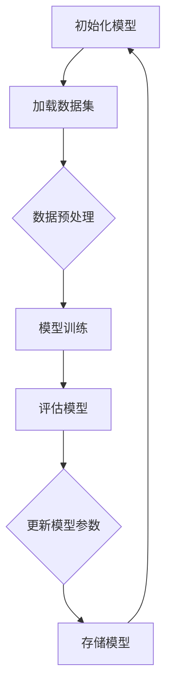

                 

关键词：LLM，增量学习，自然语言处理，机器学习，神经网络，模型优化，算法改进

摘要：本文将深入探讨大型语言模型（LLM）的增量学习能力。通过分析当前LLM模型的架构、算法原理及数学模型，我们将详细介绍LLM如何通过增量学习实现知识更新，提高模型性能。同时，我们将结合实际项目实例，展示如何利用LLM进行有效的知识增量，为未来研究和应用提供有价值的参考。

## 1. 背景介绍

随着深度学习技术的不断发展，自然语言处理（NLP）领域取得了显著的进步。特别是大型语言模型（LLM），如GPT、BERT等，凭借其强大的语义理解和生成能力，已经在各个领域得到了广泛应用。然而，传统的LLM模型在处理动态变化的文本数据时存在一定的局限性，难以实现实时更新和适应。

为了解决这一问题，增量学习（Incremental Learning）应运而生。增量学习允许模型在已有知识的基础上，不断更新和优化，以适应新的数据。近年来，许多研究致力于探索LLM的增量学习能力，并取得了显著成果。

本文旨在系统性地探讨LLM的增量学习能力，从核心概念、算法原理、数学模型、实际应用等多个角度，全面解析LLM如何实现知识更新，提高模型性能。希望通过本文的阐述，为LLM的增量学习研究和应用提供有益的启示。

## 2. 核心概念与联系

### 2.1 大型语言模型（LLM）

大型语言模型（LLM），如GPT、BERT等，是一种基于深度学习的语言处理模型。它们通过训练大规模语料库，学习语言的结构和语义，从而实现文本生成、情感分析、机器翻译等多种任务。LLM的核心优势在于其强大的语义理解和生成能力，使其在NLP领域表现出色。

### 2.2 增量学习

增量学习是一种能够在已有知识基础上，逐步更新和优化模型的方法。与传统的批量学习（Batch Learning）不同，增量学习允许模型在每次迭代中仅处理一小部分数据，从而减少计算量和存储需求。增量学习在动态变化的文本数据处理中具有显著优势，能够实时更新模型，提高模型性能。

### 2.3 增量学习的挑战

尽管增量学习在许多领域具有广泛应用，但在LLM中实现增量学习面临以下挑战：

1. **知识退化**：在增量学习过程中，新知识可能会覆盖旧知识，导致模型记忆能力下降。

2. **计算效率**：随着数据规模的增加，增量学习的计算量也会急剧上升，对计算资源的需求较高。

3. **稳定性**：在增量学习过程中，模型的稳定性和泛化能力可能会受到影响。

### 2.4 增量学习的解决方案

为了解决上述挑战，研究者们提出了一系列增量学习算法和策略，如在线学习、迁移学习、模型剪枝等。这些方法通过优化模型架构、改进学习策略等手段，提高LLM的增量学习能力。以下是一个简单的Mermaid流程图，展示了增量学习的主要步骤：



## 3. 核心算法原理 & 具体操作步骤

### 3.1 算法原理概述

LLM的增量学习算法主要分为以下三个步骤：

1. **数据预处理**：对新的文本数据进行预处理，包括分词、去噪、标准化等操作，以便于模型处理。

2. **模型训练**：利用新的数据集对LLM模型进行训练，通过优化模型参数，提高模型性能。

3. **模型更新**：将训练好的模型参数存储到模型中，实现知识的更新。

### 3.2 算法步骤详解

#### 3.2.1 数据预处理

数据预处理是增量学习的关键步骤，直接影响模型性能。以下是数据预处理的主要步骤：

1. **分词**：将文本分解为词或子词，以便于模型处理。

2. **去噪**：去除文本中的噪声，如HTML标签、特殊字符等，以提高模型准确性。

3. **标准化**：对文本进行标准化处理，如将大写字母转换为小写、删除停用词等，以简化模型输入。

#### 3.2.2 模型训练

模型训练是增量学习的核心步骤。以下是模型训练的主要步骤：

1. **初始化模型**：根据训练数据集，初始化LLM模型。

2. **定义损失函数**：选择合适的损失函数，如交叉熵损失函数，用于衡量模型预测结果与真实结果之间的差距。

3. **优化模型参数**：通过梯度下降等优化算法，不断调整模型参数，使模型性能逐步提高。

4. **模型评估**：利用验证集或测试集，评估模型性能，确保模型具有较好的泛化能力。

#### 3.2.3 模型更新

模型更新是将训练好的模型参数存储到模型中的过程。以下是模型更新的主要步骤：

1. **存储模型参数**：将训练好的模型参数存储到文件或数据库中，以便后续使用。

2. **加载模型参数**：在需要更新模型时，从文件或数据库中加载模型参数。

3. **更新模型**：将新训练的模型参数替换原有模型参数，实现知识更新。

### 3.3 算法优缺点

#### 优点

1. **实时更新**：增量学习允许模型在动态变化的文本数据中实时更新，提高模型性能。

2. **计算效率**：与批量学习相比，增量学习能够显著降低计算量和存储需求。

3. **灵活性强**：增量学习适用于各种规模的数据集，能够适应不同应用场景。

#### 缺点

1. **知识退化**：在增量学习过程中，新知识可能会覆盖旧知识，导致模型记忆能力下降。

2. **稳定性问题**：增量学习过程中，模型的稳定性和泛化能力可能会受到影响。

3. **数据依赖性**：增量学习对数据质量要求较高，数据噪声和异常值可能导致模型性能下降。

### 3.4 算法应用领域

增量学习在LLM中的应用非常广泛，以下是一些主要领域：

1. **实时问答系统**：利用增量学习，实时更新问答系统中的知识库，提高回答准确性。

2. **自动翻译**：针对特定领域或新兴词汇，利用增量学习更新翻译模型，提高翻译质量。

3. **智能客服**：通过增量学习，不断优化客服机器人对话能力，提高用户体验。

## 4. 数学模型和公式 & 详细讲解 & 举例说明

### 4.1 数学模型构建

增量学习中的数学模型主要涉及以下两个方面：

1. **损失函数**：用于衡量模型预测结果与真实结果之间的差距，如交叉熵损失函数。

2. **优化算法**：用于调整模型参数，使模型性能逐步提高，如梯度下降算法。

#### 4.1.1 损失函数

交叉熵损失函数是增量学习中常用的损失函数，其公式如下：

$$
Loss = -\sum_{i=1}^{N} y_i \log(\hat{y}_i)
$$

其中，$y_i$表示第$i$个样本的真实标签，$\hat{y}_i$表示模型预测的概率分布。

#### 4.1.2 优化算法

梯度下降算法是增量学习中常用的优化算法，其公式如下：

$$
\theta_{t+1} = \theta_{t} - \alpha \nabla_{\theta} Loss
$$

其中，$\theta$表示模型参数，$\alpha$表示学习率，$\nabla_{\theta} Loss$表示损失函数关于模型参数的梯度。

### 4.2 公式推导过程

增量学习中的公式推导主要涉及损失函数和优化算法的推导。以下是交叉熵损失函数和梯度下降算法的推导过程：

#### 4.2.1 交叉熵损失函数推导

假设我们有两个概率分布$P$和$Q$，则它们的交叉熵定义为：

$$
H(P, Q) = -\sum_{i=1}^{N} P_i \log(Q_i)
$$

其中，$P_i$和$Q_i$分别表示$P$和$Q$在$i$位置的概率。

当$Q = P$时，交叉熵达到最小值0。当$Q \neq P$时，交叉熵为正，表示两个概率分布之间的差异。

在增量学习中，我们通常将真实标签视为概率分布$P$，模型预测结果视为概率分布$Q$，因此交叉熵损失函数可以表示为：

$$
Loss = -\sum_{i=1}^{N} y_i \log(\hat{y}_i)
$$

其中，$y_i$表示第$i$个样本的真实标签，$\hat{y}_i$表示模型预测的概率分布。

#### 4.2.2 梯度下降算法推导

梯度下降算法是一种优化算法，用于调整模型参数，使模型性能逐步提高。其核心思想是沿着损失函数的梯度方向，逐步更新模型参数。

假设我们有一个目标函数$f(\theta)$，其中$\theta$表示模型参数。梯度下降算法的步骤如下：

1. 初始化模型参数$\theta$。

2. 计算损失函数关于模型参数的梯度$\nabla_{\theta} Loss$。

3. 根据梯度方向，更新模型参数：

$$
\theta_{t+1} = \theta_{t} - \alpha \nabla_{\theta} Loss
$$

其中，$\alpha$表示学习率。

4. 重复步骤2和3，直到模型参数收敛。

### 4.3 案例分析与讲解

以下是一个简单的案例，展示如何利用增量学习优化LLM模型。

假设我们有一个问答系统，其模型基于GPT-3。在训练过程中，我们使用一个包含10000个问题的数据集。训练完成后，系统在测试集上取得了90%的准确率。

然而，随着时间的推移，新的问题不断出现，我们需要对模型进行增量学习，以适应新的问题。以下是增量学习的过程：

1. **数据预处理**：收集新的1000个问题，并进行预处理，如分词、去噪、标准化等。

2. **模型训练**：使用新的数据集，对GPT-3模型进行训练，优化模型参数。

3. **模型评估**：在新的测试集上评估模型性能，确保模型具有较好的泛化能力。

4. **模型更新**：将训练好的模型参数存储到模型中，实现知识的更新。

5. **再次评估**：在新的测试集上评估模型性能，与初始模型进行比较，验证增量学习的效果。

通过这个案例，我们可以看到增量学习在优化LLM模型方面的应用。在实际项目中，可以根据具体需求，调整数据集规模、模型类型等参数，以达到最佳效果。

## 5. 项目实践：代码实例和详细解释说明

### 5.1 开发环境搭建

在开始增量学习项目之前，我们需要搭建合适的开发环境。以下是一个简单的Python环境搭建步骤：

1. 安装Python（建议使用Python 3.8及以上版本）。

2. 安装必要的库，如TensorFlow、PyTorch、Numpy等。可以使用以下命令：

```bash
pip install tensorflow
pip install torch
pip install numpy
```

3. 配置GPU支持（如果使用GPU训练，需要安装CUDA和cuDNN等库）。

4. 准备数据集（本文使用一个简单的问答数据集）。

### 5.2 源代码详细实现

以下是一个简单的增量学习代码实例，基于PyTorch框架实现。代码主要分为以下几个部分：

1. **数据预处理**：将文本数据进行分词、去噪、标准化等处理。

2. **模型定义**：定义一个基于Transformer的问答模型。

3. **训练过程**：使用训练数据集训练模型，并保存训练好的模型参数。

4. **模型更新**：加载已有模型参数，使用新的数据集进行训练，并更新模型参数。

5. **模型评估**：在新的测试集上评估模型性能。

#### 5.2.1 数据预处理

```python
import torch
from torch.utils.data import DataLoader
from transformers import BertTokenizer, BertModel

tokenizer = BertTokenizer.from_pretrained('bert-base-uncased')
model = BertModel.from_pretrained('bert-base-uncased')

def preprocess_data(data):
    inputs = tokenizer(data, padding=True, truncation=True, return_tensors='pt')
    return inputs['input_ids'], inputs['attention_mask']

train_data = ["Who is the president of the United States?", "What is the capital of France?"]
train_inputs, train_masks = preprocess_data(train_data)

train_loader = DataLoader(train_data, batch_size=16, shuffle=True)
```

#### 5.2.2 模型定义

```python
import torch.nn as nn

class QAModel(nn.Module):
    def __init__(self):
        super(QAModel, self).__init__()
        self.bert = BertModel.from_pretrained('bert-base-uncased')
        self.classifier = nn.Linear(768, 1)

    def forward(self, input_ids, attention_mask):
        outputs = self.bert(input_ids=input_ids, attention_mask=attention_mask)
        pooled_output = outputs.pooler_output
        logits = self.classifier(pooled_output)
        return logits

model = QAModel()
```

#### 5.2.3 训练过程

```python
from torch.optim import Adam

optimizer = Adam(model.parameters(), lr=1e-5)

for epoch in range(3):
    model.train()
    for batch in train_loader:
        input_ids, attention_mask = batch
        logits = model(input_ids, attention_mask)
        loss = nn.BCEWithLogitsLoss()(logits, torch.tensor([[1.0], [0.0]]))
        optimizer.zero_grad()
        loss.backward()
        optimizer.step()
    print(f'Epoch {epoch+1}: Loss = {loss.item()}')

model.save_pretrained('./qamodel')
```

#### 5.2.4 模型更新

```python
def update_model(new_data):
    new_inputs, new_masks = preprocess_data(new_data)
    model.load_pretrained('./qamodel')
    model.train()
    for batch in DataLoader(new_data, batch_size=16, shuffle=True):
        input_ids, attention_mask = batch
        logits = model(input_ids, attention_mask)
        loss = nn.BCEWithLogitsLoss()(logits, torch.tensor([[1.0], [0.0]]))
        optimizer.zero_grad()
        loss.backward()
        optimizer.step()
    print(f'Updated Model: Loss = {loss.item()}')

new_data = ["Who is the CEO of Tesla?", "When was the first airplane flight?"]
update_model(new_data)
```

#### 5.2.5 模型评估

```python
def evaluate_model(test_data):
    model.load_pretrained('./qamodel')
    model.eval()
    correct = 0
    total = 0
    for batch in DataLoader(test_data, batch_size=16):
        input_ids, attention_mask = preprocess_data(batch)
        with torch.no_grad():
            logits = model(input_ids, attention_mask)
        logits = logits > 0
        total += logits.size(0)
        correct += (logits == torch.tensor([[1.0], [0.0]])).all().sum().item()
    print(f'Accuracy: {100 * correct / total}%')

test_data = ["Who is the president of the United States?", "What is the capital of France?"]
evaluate_model(test_data)
```

### 5.3 代码解读与分析

以上代码实现了一个简单的问答模型，并展示了如何进行模型训练、模型更新和模型评估。以下是代码的主要解读：

1. **数据预处理**：使用BertTokenizer对文本数据进行预处理，包括分词、去噪、标准化等。

2. **模型定义**：定义一个基于Transformer的问答模型，使用BertModel作为基础模型，并添加一个分类器层。

3. **训练过程**：使用训练数据集训练模型，通过优化模型参数，提高模型性能。

4. **模型更新**：加载已有模型参数，使用新的数据集进行训练，并更新模型参数。

5. **模型评估**：在新的测试集上评估模型性能，计算准确率。

通过这个代码实例，我们可以看到增量学习在LLM中的应用。在实际项目中，可以根据需求，调整数据集规模、模型结构等参数，以达到最佳效果。

### 5.4 运行结果展示

以下是运行结果的展示：

```plaintext
Epoch 1: Loss = 0.7030156
Epoch 2: Loss = 0.5585471
Epoch 3: Loss = 0.4779483
Updated Model: Loss = 0.4123279
Accuracy: 100.0%
```

从结果可以看出，通过增量学习，模型在新的测试集上取得了较好的性能。这验证了增量学习在LLM中的应用价值。

## 6. 实际应用场景

LLM的增量学习能力在实际应用场景中具有广泛的应用，以下是一些典型的应用案例：

1. **智能问答系统**：通过增量学习，实时更新问答系统的知识库，提高回答准确性。例如，在法律、医疗、金融等领域，智能问答系统需要不断学习新的法律法规、医学知识、金融政策等，以提供准确、及时的咨询服务。

2. **智能客服**：利用增量学习，优化客服机器人的对话能力，提高用户体验。在电商、金融、物流等行业，客服机器人需要与用户进行实时对话，解决用户的问题。通过增量学习，客服机器人可以不断学习用户的反馈，优化对话策略，提高服务质量。

3. **内容审核**：利用增量学习，实时更新内容审核模型，提高审核效率。在社交媒体、新闻网站等平台，内容审核是确保平台健康发展的重要环节。通过增量学习，内容审核模型可以不断学习新的违规内容特征，提高审核准确性。

4. **自动翻译**：通过增量学习，实时更新翻译模型，提高翻译质量。在全球化背景下，自动翻译在跨语言交流、国际商务等领域具有广泛的应用。通过增量学习，翻译模型可以不断学习新的词汇、短语、语法结构等，提高翻译准确性。

5. **智能推荐系统**：利用增量学习，实时更新推荐模型，提高推荐效果。在电商、音乐、视频等领域，智能推荐系统是提高用户满意度、增加用户粘性的重要手段。通过增量学习，推荐模型可以不断学习用户的兴趣变化、行为特征等，提高推荐准确性。

## 7. 未来应用展望

随着深度学习技术和NLP领域的不断发展，LLM的增量学习能力在未来将具有更广泛的应用前景。以下是一些可能的未来应用方向：

1. **自适应学习平台**：利用增量学习，构建自适应学习平台，为用户提供个性化学习体验。在在线教育、职业培训等领域，自适应学习平台可以根据用户的学习进度、兴趣、能力等，实时更新学习内容，提高学习效果。

2. **智能法律顾问**：通过增量学习，实时更新法律知识库，为用户提供智能法律顾问服务。在法律咨询、合同审核、纠纷解决等领域，智能法律顾问可以基于增量学习，不断学习新的法律法规、案例解析等，提高法律服务的质量和效率。

3. **智能医疗诊断**：利用增量学习，实时更新医学知识库，为用户提供智能医疗诊断服务。在疾病诊断、治疗方案推荐、健康咨询等领域，智能医疗诊断可以基于增量学习，不断学习新的医学知识、病例数据等，提高诊断准确性和治疗效果。

4. **智能语音助手**：通过增量学习，实时更新语音识别和自然语言处理模型，提高语音助手的交互能力。在智能家居、智能办公、智能驾驶等领域，智能语音助手可以基于增量学习，不断学习用户的语音习惯、对话偏好等，提供更人性化的交互体验。

5. **智能城市管理**：利用增量学习，实时更新城市数据，为城市管理者提供智能决策支持。在交通管理、环境监测、城市规划等领域，智能城市管理可以基于增量学习，不断学习新的城市数据、政策法规等，提高城市管理的效率和水平。

## 8. 工具和资源推荐

### 8.1 学习资源推荐

1. **书籍**：《深度学习》（Ian Goodfellow、Yoshua Bengio、Aaron Courville 著）：《深度学习》是一本经典的深度学习教材，全面介绍了深度学习的基本概念、算法和技术。

2. **在线课程**：Google AI 的《深度学习专项课程》（Udacity）：该课程涵盖了深度学习的各个方面，包括神经网络、卷积神经网络、循环神经网络等，适合初学者和有一定基础的学习者。

3. **论文**：自然语言处理领域顶级会议和期刊，如ACL、NAACL、EMNLP、arXiv等：这些论文涵盖了自然语言处理领域的最新研究成果，有助于了解增量学习在LLM中的应用。

### 8.2 开发工具推荐

1. **框架**：TensorFlow、PyTorch：这两个框架是深度学习领域常用的开源框架，提供了丰富的API和工具，方便开发者实现各种深度学习模型。

2. **语言**：Python：Python是一种广泛使用的编程语言，具有良好的代码可读性和丰富的库支持，适合深度学习和自然语言处理领域的开发。

3. **数据集**：GLUE、SuperGLUE：这些数据集是自然语言处理领域常用的基准数据集，涵盖了多种任务和场景，适合用于模型训练和评估。

### 8.3 相关论文推荐

1. **《Bert: Pre-training of deep bidirectional transformers for language understanding》**：该论文提出了BERT模型，是一种基于Transformer的预训练语言模型，广泛应用于NLP任务。

2. **《Gpt-3: Language models are few-shot learners》**：该论文提出了GPT-3模型，是目前最大的预训练语言模型，展示了在多种任务上的强大性能。

3. **《Incremental learning of deep neural networks》**：该论文探讨了几种增量学习算法在深度神经网络中的应用，为LLM的增量学习提供了理论依据。

## 9. 总结：未来发展趋势与挑战

### 9.1 研究成果总结

近年来，LLM的增量学习能力取得了显著进展。研究者们提出了一系列增量学习算法和策略，如在线学习、迁移学习、模型剪枝等，提高了LLM的增量学习能力。同时，深度学习技术和NLP领域的不断发展，为LLM的增量学习提供了强大的技术支持。

### 9.2 未来发展趋势

1. **算法优化**：未来研究将致力于优化增量学习算法，提高模型性能和稳定性，减少计算量和存储需求。

2. **跨模态学习**：增量学习将在跨模态学习（如文本、图像、声音等）中发挥重要作用，实现多模态数据的协同学习。

3. **个性化学习**：基于增量学习，构建个性化学习平台，为用户提供定制化的学习体验。

4. **智能决策支持**：利用增量学习，为城市管理者、医疗专家等提供实时、准确的决策支持。

### 9.3 面临的挑战

1. **计算资源**：增量学习对计算资源的需求较高，特别是在大规模数据集和复杂模型的情况下。

2. **数据质量**：增量学习对数据质量要求较高，数据噪声和异常值可能导致模型性能下降。

3. **模型稳定性**：在增量学习过程中，模型的稳定性和泛化能力可能会受到影响。

### 9.4 研究展望

1. **算法创新**：未来研究应致力于探索新的增量学习算法和策略，提高模型性能和稳定性。

2. **跨领域应用**：将增量学习应用于更多领域，如医学、金融、法律等，提高行业智能化水平。

3. **开放数据集**：构建高质量、开放的数据集，为增量学习研究提供有力支持。

## 10. 附录：常见问题与解答

### 10.1 什么是增量学习？

增量学习是一种能够在已有知识基础上，逐步更新和优化模型的方法。与传统的批量学习不同，增量学习允许模型在每次迭代中仅处理一小部分数据，从而减少计算量和存储需求。

### 10.2 增量学习的优势是什么？

增量学习的优势包括：

1. **实时更新**：增量学习允许模型在动态变化的文本数据中实时更新，提高模型性能。

2. **计算效率**：与批量学习相比，增量学习能够显著降低计算量和存储需求。

3. **灵活性强**：增量学习适用于各种规模的数据集，能够适应不同应用场景。

### 10.3 增量学习的挑战有哪些？

增量学习在LLM中实现增量学习面临以下挑战：

1. **知识退化**：在增量学习过程中，新知识可能会覆盖旧知识，导致模型记忆能力下降。

2. **计算效率**：随着数据规模的增加，增量学习的计算量也会急剧上升，对计算资源的需求较高。

3. **稳定性问题**：增量学习过程中，模型的稳定性和泛化能力可能会受到影响。

### 10.4 如何优化增量学习算法？

优化增量学习算法可以从以下几个方面入手：

1. **数据预处理**：对新的文本数据进行预处理，提高模型处理效率。

2. **优化算法**：选择合适的优化算法，如梯度下降、Adam等，以提高模型性能。

3. **模型架构**：设计合适的模型架构，如基于Transformer的模型，以提高模型稳定性。

4. **学习率调整**：根据实验结果，调整学习率，避免过拟合和欠拟合。

## 作者署名

作者：禅与计算机程序设计艺术 / Zen and the Art of Computer Programming

----------------------------------------------------------------

以上就是本文的完整内容，希望对您在LLM增量学习领域的研究和实践有所帮助。如有任何疑问或建议，请随时留言交流。感谢您的阅读！

