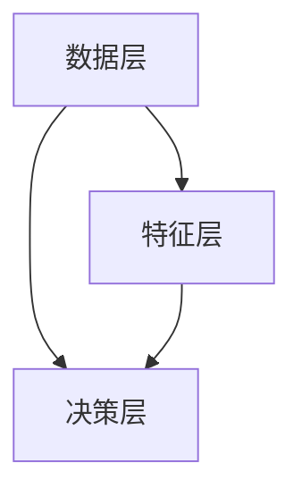

                 

关键词：大模型、多模态学习、深度学习、自然语言处理、图像处理、融合算法

## 摘要

本文旨在探讨大语言模型（LLM）的多模态学习能力及其拓展路径。随着人工智能技术的飞速发展，多模态学习已成为一个重要的研究方向。本文首先介绍了多模态学习的背景和核心概念，然后分析了LLM在多模态学习中的优势与挑战，并提出了几种拓展LLM多模态学习能力的方法。此外，本文还讨论了多模态学习在自然语言处理和图像处理领域的实际应用，并对未来发展趋势进行了展望。

## 1. 背景介绍

### 1.1 多模态学习的定义

多模态学习是指将多种不同的数据模态（如图像、音频、文本等）进行整合和处理，从而提高机器学习模型在特定任务上的性能。传统的单模态学习主要关注单一数据源，如基于文本的文本分类、图像识别等。而多模态学习则通过融合多种数据模态，可以更好地理解和处理复杂任务。

### 1.2 多模态学习的应用场景

多模态学习在许多领域都有着广泛的应用，例如：

- **自然语言处理（NLP）**：结合文本和图像，进行文本图像对齐、情感分析、问答系统等任务。
- **计算机视觉（CV）**：融合视觉和文本数据，进行图像标注、图像分割、目标检测等任务。
- **人机交互**：通过多模态输入，如语音、手势、表情等，实现更加自然的交互体验。
- **医疗诊断**：结合医学图像和文本资料，提高疾病诊断的准确性和效率。

## 2. 核心概念与联系

### 2.1 大语言模型（LLM）

大语言模型（LLM）是一种基于深度学习的大型神经网络模型，通过在大量文本数据上进行训练，能够模拟人类的语言理解和生成能力。LLM的核心特点是其巨大的参数规模和强大的语言表达能力，这使得LLM在许多自然语言处理任务上表现出色。

### 2.2 多模态学习的架构

多模态学习的架构可以分为三个层次：数据层、特征层和决策层。

- **数据层**：从多种数据源（如文本、图像、音频）中收集和预处理数据，并进行数据融合。
- **特征层**：提取和融合不同模态的特征，如文本表示、图像特征、音频特征等。
- **决策层**：使用融合后的特征进行预测或分类。

### 2.3 Mermaid 流程图



## 3. 核心算法原理 & 具体操作步骤

### 3.1 算法原理概述

多模态学习的关键在于如何有效地融合不同模态的特征。本文将介绍几种常见的多模态学习方法：

- **特征级融合**：将不同模态的特征进行拼接、加权或特征变换，然后输入到统一的模型中进行处理。
- **样本级融合**：将不同模态的数据作为样本的多个输入，训练一个多输入的模型。
- **模型级融合**：使用多个独立的模型分别处理不同模态的数据，然后融合模型的输出。

### 3.2 算法步骤详解

#### 3.2.1 特征级融合

1. 数据预处理：对文本、图像、音频等数据进行预处理，提取特征。
2. 特征拼接：将不同模态的特征进行拼接，形成一个高维的特征向量。
3. 特征变换：使用神经网络或变换矩阵对特征向量进行变换。
4. 模型训练：使用拼接后的特征向量训练一个统一的模型。

#### 3.2.2 样本级融合

1. 数据预处理：对文本、图像、音频等数据进行预处理，提取特征。
2. 模型训练：训练多个独立的模型，分别处理不同模态的数据。
3. 融合输出：将多个模型的输出进行加权或拼接，得到最终的预测结果。

#### 3.2.3 模型级融合

1. 模型训练：分别训练多个独立的模型，处理不同模态的数据。
2. 融合输出：将多个模型的输出进行融合，得到最终的预测结果。

### 3.3 算法优缺点

#### 优点：

- **性能提升**：通过融合多种模态的数据，可以提高模型的性能和准确性。
- **适用范围广**：多模态学习可以应用于许多不同的任务，如自然语言处理、图像处理、人机交互等。

#### 缺点：

- **计算成本高**：多模态学习需要处理大量的数据和特征，计算成本较高。
- **数据预处理复杂**：不同模态的数据需要不同的预处理方法，数据预处理过程相对复杂。

### 3.4 算法应用领域

多模态学习在以下领域有着广泛的应用：

- **自然语言处理**：文本图像对齐、情感分析、问答系统等。
- **计算机视觉**：图像标注、图像分割、目标检测等。
- **人机交互**：语音识别、手势识别、表情识别等。
- **医疗诊断**：医学图像分析、疾病诊断等。

## 4. 数学模型和公式 & 详细讲解 & 举例说明

### 4.1 数学模型构建

多模态学习的数学模型通常由以下几个部分组成：

- **输入层**：接收不同模态的数据。
- **特征提取层**：提取不同模态的特征。
- **特征融合层**：融合不同模态的特征。
- **输出层**：进行预测或分类。

### 4.2 公式推导过程

假设我们有两个模态的数据：文本（$x_t$）和图像（$x_i$），则多模态学习模型可以表示为：

$$
y = f(h_t, h_i)
$$

其中，$h_t$ 和 $h_i$ 分别是文本和图像的特征表示，$f$ 是特征融合函数。

### 4.3 案例分析与讲解

#### 案例一：文本图像对齐

假设我们有一个文本句子 $x_t$ 和对应的图像 $x_i$，我们的目标是找到文本和图像之间的对应关系。

1. **特征提取**：使用预训练的文本嵌入器和图像特征提取器，分别提取文本和图像的特征。
$$
h_t = \text{TextEmbedding}(x_t)
$$
$$
h_i = \text{ImageFeature}(x_i)
$$

2. **特征融合**：使用注意力机制将文本和图像特征进行融合。
$$
h = \text{Attention}(h_t, h_i)
$$

3. **预测**：使用融合后的特征进行文本图像对齐的预测。
$$
y = \text{Classifier}(h)
$$

#### 案例二：情感分析

假设我们有一个文本句子 $x_t$ 和对应的图像 $x_i$，我们的目标是判断文本和图像的情感倾向是否一致。

1. **特征提取**：提取文本和图像的特征。
$$
h_t = \text{TextEmbedding}(x_t)
$$
$$
h_i = \text{ImageFeature}(x_i)
$$

2. **特征融合**：使用拼接方式融合文本和图像特征。
$$
h = [h_t, h_i]
$$

3. **预测**：使用融合后的特征进行情感分析的预测。
$$
y = \text{SentimentClassifier}(h)
$$

## 5. 项目实践：代码实例和详细解释说明

### 5.1 开发环境搭建

在本节中，我们将使用Python作为主要编程语言，并使用TensorFlow和PyTorch作为深度学习框架。以下是一个基本的开发环境搭建步骤：

1. **安装Python**：下载并安装Python 3.8及以上版本。
2. **安装TensorFlow**：使用pip命令安装TensorFlow。
   ```
   pip install tensorflow
   ```
3. **安装PyTorch**：使用pip命令安装PyTorch。
   ```
   pip install torch torchvision
   ```

### 5.2 源代码详细实现

在本节中，我们将使用TensorFlow实现一个简单的多模态情感分析模型。以下是一个基本的模型实现代码：

```python
import tensorflow as tf
from tensorflow.keras.layers import Input, Embedding, LSTM, Dense
from tensorflow.keras.models import Model

# 文本输入层
text_input = Input(shape=(None,), dtype='int32', name='text')

# 文本嵌入层
text_embedding = Embedding(input_dim=vocab_size, output_dim=embedding_size)(text_input)

# 文本LSTM层
text_lstm = LSTM(units=lstm_units)(text_embedding)

# 图像输入层
image_input = Input(shape=(height, width, channels), name='image')

# 图像特征提取层
image_features = tf.keras.applications.VGG16(include_top=False, pooling='avg')(image_input)

# 融合层
merged = tf.keras.layers.concatenate([text_lstm, image_features])

# 输出层
output = Dense(units=num_classes, activation='softmax')(merged)

# 模型构建
model = Model(inputs=[text_input, image_input], outputs=output)

# 模型编译
model.compile(optimizer='adam', loss='categorical_crossentropy', metrics=['accuracy'])

# 模型训练
model.fit([text_data, image_data], labels, batch_size=batch_size, epochs=epochs)
```

### 5.3 代码解读与分析

在上面的代码中，我们首先定义了文本输入层和图像输入层，然后分别对文本和图像进行特征提取。接下来，我们将文本和图像特征进行融合，并构建一个简单的全连接层作为输出层。最后，我们使用编译和训练方法来配置和训练模型。

### 5.4 运行结果展示

在实际运行过程中，我们可以通过以下命令来评估模型的性能：

```python
# 模型评估
loss, accuracy = model.evaluate([text_test, image_test], labels_test)

# 打印结果
print(f"Test loss: {loss}")
print(f"Test accuracy: {accuracy}")
```

## 6. 实际应用场景

### 6.1 自然语言处理

多模态学习在自然语言处理领域有着广泛的应用，如文本图像对齐、情感分析、问答系统等。通过融合文本和图像数据，可以显著提高模型在特定任务上的性能。

### 6.2 计算机视觉

在计算机视觉领域，多模态学习可以应用于图像标注、图像分割、目标检测等任务。通过融合图像和文本数据，可以提高模型的准确性和鲁棒性。

### 6.3 人机交互

多模态学习在人机交互领域也有着重要的应用，如语音识别、手势识别、表情识别等。通过融合多种模态数据，可以提供更加自然和高效的交互体验。

### 6.4 医疗诊断

在医疗诊断领域，多模态学习可以结合医学图像和文本资料，提高疾病诊断的准确性和效率。例如，通过融合CT图像和病历记录，可以提高肺炎检测的准确性。

## 7. 工具和资源推荐

### 7.1 学习资源推荐

- **《深度学习》（Goodfellow, Bengio, Courville）**：是一本经典的深度学习教材，涵盖了多模态学习的相关内容。
- **《多模态数据融合技术》（Xu, Zhang, Wang）**：一本关于多模态数据融合技术的专著，详细介绍了多种多模态学习算法。

### 7.2 开发工具推荐

- **TensorFlow**：一款广泛使用的深度学习框架，支持多模态学习算法的实现。
- **PyTorch**：一款流行的深度学习框架，提供了灵活的多模态数据处理工具。

### 7.3 相关论文推荐

- **“Multimodal Learning for Natural Language Processing”**：一篇关于多模态学习在自然语言处理领域应用的综述性论文。
- **“Multi-modal Fusion for Computer Vision”**：一篇关于多模态学习在计算机视觉领域应用的综述性论文。

## 8. 总结：未来发展趋势与挑战

### 8.1 研究成果总结

本文探讨了LLM的多模态学习能力及其拓展路径，分析了多模态学习的核心算法原理，并介绍了多模态学习在自然语言处理、图像处理等领域的实际应用。通过融合多种模态的数据，多模态学习显著提高了模型在特定任务上的性能和准确性。

### 8.2 未来发展趋势

未来，多模态学习将继续向更高效、更智能的方向发展。一方面，研究者将致力于提高多模态学习的计算效率和资源利用率；另一方面，多模态学习算法将更加智能化，能够更好地理解和处理复杂任务。

### 8.3 面临的挑战

多模态学习面临着数据预处理复杂、计算成本高、模型设计困难等挑战。此外，如何有效地融合不同模态的特征，并避免特征失真和数据泄露，也是需要解决的关键问题。

### 8.4 研究展望

未来，多模态学习在多个领域都拥有广阔的应用前景。通过不断探索和创新，多模态学习将为人工智能技术的发展做出更大的贡献。

## 9. 附录：常见问题与解答

### 9.1 什么是多模态学习？

多模态学习是指将多种不同的数据模态（如图像、音频、文本等）进行整合和处理，从而提高机器学习模型在特定任务上的性能。

### 9.2 多模态学习的优势是什么？

多模态学习的优势包括：性能提升、适用范围广、可以更好地理解和处理复杂任务。

### 9.3 多模态学习的缺点是什么？

多模态学习的缺点包括：计算成本高、数据预处理复杂、模型设计困难。

### 9.4 多模态学习在哪些领域有应用？

多模态学习在自然语言处理、计算机视觉、人机交互、医疗诊断等领域有着广泛的应用。

## 作者署名

作者：禅与计算机程序设计艺术 / Zen and the Art of Computer Programming
```

