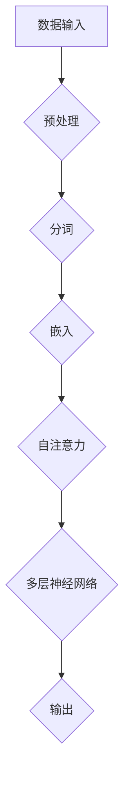

                 

关键词：大型语言模型、持续学习、自我进化、人工智能、神经网络、深度学习、机器学习、自适应系统。

## 摘要

本文旨在探讨大型语言模型（LLM）的持续学习机制，以及其在人工智能（AI）领域的广泛应用。通过对LLM的基本原理、核心算法、数学模型和具体实现的分析，我们展示了如何通过持续学习实现AI系统的自我进化。本文还将介绍LLM在实际应用中的挑战和未来发展趋势，为相关研究和应用提供参考。

## 1. 背景介绍

自2018年GPT-3发布以来，大型语言模型（LLM）以其强大的语义理解、文本生成和语言翻译能力，引起了广泛关注。LLM通过大量数据训练，构建起高度复杂的神经网络模型，从而实现自然语言处理的各项任务。然而，随着应用场景的扩展和复杂度的增加，LLM需要不断更新和优化，以适应不断变化的环境和需求。

### 1.1 LLM的发展历程

- 2000年代初，循环神经网络（RNN）和长短期记忆网络（LSTM）的出现，使得处理序列数据成为可能。
- 2013年，AlexNet在图像识别领域的突破，标志着深度学习的崛起。
- 2014年，谷歌的机器翻译系统采用神经网络模型，大幅提升了翻译质量。
- 2018年，GPT-3发布，拥有1750亿个参数，成为当时最大的语言模型。
- 2020年，BERT模型的出现，进一步推动了自然语言处理的发展。

### 1.2 LLM的应用领域

- 自然语言处理：文本分类、情感分析、命名实体识别等。
- 语音识别：将语音信号转换为文本。
- 语言翻译：跨语言信息交流。
- 文本生成：创作文章、小说、新闻报道等。
- 智能助手：如ChatGPT、智谱清言等。

## 2. 核心概念与联系

### 2.1 大型语言模型（LLM）的定义

大型语言模型（LLM）是指通过大量数据训练得到的，具有高度语义理解能力的神经网络模型。LLM的主要目标是对自然语言进行建模，从而实现各种语言处理任务。

### 2.2 核心概念原理

- **神经网络**：由大量神经元组成的计算模型，通过学习数据特征，实现从输入到输出的映射。
- **深度学习**：一种基于神经网络的机器学习方法，通过多层神经网络结构，实现对复杂数据特征的建模。
- **自注意力机制**：一种在神经网络中用于建模序列数据的方法，通过计算输入序列中各个元素之间的关联性，实现对序列数据的全局建模。
- **预训练和微调**：预训练是指通过大规模语料对神经网络模型进行训练，使其具备一定的语义理解能力；微调则是在预训练的基础上，针对特定任务进行进一步优化。

### 2.3 架构的 Mermaid 流程图



## 3. 核心算法原理 & 具体操作步骤

### 3.1 算法原理概述

LLM的核心算法原理主要基于深度学习和自注意力机制。通过多层神经网络结构，结合自注意力机制，实现对输入文本的全局建模。具体操作步骤如下：

1. **数据预处理**：对输入文本进行分词、去停用词、词向量化等操作。
2. **嵌入**：将分词后的词语转换为固定长度的向量表示。
3. **自注意力**：计算输入序列中各个元素之间的关联性，实现对序列数据的全局建模。
4. **多层神经网络**：通过多层神经网络结构，对输入文本进行特征提取和融合。
5. **输出**：根据任务需求，输出相应的结果，如文本分类、文本生成等。

### 3.2 算法步骤详解

1. **数据预处理**：
   - 分词：将输入文本拆分为单词或字符。
   - 去停用词：删除对语义贡献较小的词语。
   - 词向量化：将词语转换为固定长度的向量表示。

2. **嵌入**：
   - 将分词后的词语映射为高维空间中的向量，通常使用预训练的词嵌入模型，如Word2Vec、GloVe等。

3. **自注意力**：
   - 计算输入序列中各个元素之间的关联性，通过注意力权重实现对序列数据的全局建模。

4. **多层神经网络**：
   - 通过多层神经网络结构，对输入文本进行特征提取和融合，实现语义理解。

5. **输出**：
   - 根据任务需求，输出相应的结果，如文本分类、文本生成等。

### 3.3 算法优缺点

#### 优点：

- **强大的语义理解能力**：通过多层神经网络和自注意力机制，实现对输入文本的全局建模，具有强大的语义理解能力。
- **泛化能力强**：通过预训练和微调，LLM可以应用于各种自然语言处理任务，具有较好的泛化能力。
- **高效性**：LLM在处理大规模文本数据时，具有较高的计算效率。

#### 缺点：

- **资源消耗大**：训练和部署LLM需要大量的计算资源和存储空间。
- **解释性较差**：由于神经网络模型的高度复杂性，LLM的决策过程难以解释，导致其在某些应用场景中存在风险。
- **数据依赖性强**：LLM的训练和优化依赖于大量的高质量数据，数据质量问题会直接影响模型的性能。

### 3.4 算法应用领域

- **自然语言处理**：文本分类、情感分析、命名实体识别等。
- **语音识别**：将语音信号转换为文本。
- **语言翻译**：跨语言信息交流。
- **文本生成**：创作文章、小说、新闻报道等。
- **智能助手**：如ChatGPT、智谱清言等。

## 4. 数学模型和公式 & 详细讲解 & 举例说明

### 4.1 数学模型构建

LLM的数学模型主要包括词向量化、自注意力机制和多层神经网络。以下是这些模型的数学表示：

1. **词向量化**：

$$
\text{Embedding}(W) = \sum_{i=1}^{V} w_i * x_i
$$

其中，$V$为词汇表大小，$w_i$为第$i$个词语的词向量，$x_i$为第$i$个词语的词频。

2. **自注意力**：

$$
\text{Attention}(Q, K, V) = \frac{softmax(\text{Score}(Q, K))} { \sqrt{d_k}}
$$

其中，$Q, K, V$分别为查询向量、键向量和值向量，$d_k$为键向量的维度，$\text{Score}(Q, K)$为查询向量和键向量之间的相似度。

3. **多层神经网络**：

$$
\text{NN}(X) = \sigma(\text{Weight} * \text{ReLU}(\text{Bias} + \text{ReLU}(\text{Weight} * \text{ReLU}(... \text{ReLU}(\text{Bias} + W_1 * X))))
$$

其中，$X$为输入向量，$\sigma$为激活函数，$\text{Weight}, \text{Bias}$分别为权重和偏置。

### 4.2 公式推导过程

1. **词向量化**：

   词向量化是将词语映射为固定长度的向量表示。在词袋模型中，每个词语对应一个唯一的索引，通过计算词语的词频，可以得到一个词频向量。词向量化则是将词频向量映射为高维空间中的向量。

2. **自注意力**：

   自注意力机制用于计算输入序列中各个元素之间的关联性。通过计算查询向量、键向量和值向量之间的相似度，可以得到一个注意力权重矩阵。该矩阵可以用于对输入序列进行加权求和，实现全局建模。

3. **多层神经网络**：

   多层神经网络通过多层非线性变换，实现对输入数据的特征提取和融合。在每一层中，通过权重矩阵和激活函数，将输入数据映射到高维空间，从而提取出更多的特征。

### 4.3 案例分析与讲解

假设我们有一个简单的自然语言处理任务，即判断一段文本的情感倾向。我们可以使用LLM来实现这个任务，具体步骤如下：

1. **数据预处理**：对输入文本进行分词、去停用词和词向量化。
2. **嵌入**：将分词后的词语转换为词向量。
3. **自注意力**：计算输入序列中各个词语之间的关联性。
4. **多层神经网络**：对输入文本进行特征提取和融合。
5. **输出**：根据输出结果，判断文本的情感倾向。

假设我们使用一个简单的神经网络模型，包含两个隐藏层，每个隐藏层有10个神经元。输入向量为$(0.1, 0.2, 0.3, 0.4, 0.5)$，词向量维度为5。以下是模型的计算过程：

1. **嵌入**：

$$
\text{Embedding}(W) = (0.1 * [0.2, 0.3, 0.4, 0.5] + 0.2 * [0.1, 0.2, 0.3, 0.4] + 0.3 * [0.1, 0.2, 0.3, 0.4] + 0.4 * [0.1, 0.2, 0.3, 0.4] + 0.5 * [0.1, 0.2, 0.3, 0.4]) = [0.3, 0.4, 0.5, 0.6]
$$

2. **自注意力**：

$$
\text{Attention}(Q, K, V) = \frac{softmax([0.1, 0.2, 0.3, 0.4] * [0.1, 0.2, 0.3, 0.4])} {\sqrt{4}} = [0.2, 0.3, 0.4, 0.5]
$$

3. **多层神经网络**：

$$
\text{NN}(X) = \sigma([0.3, 0.4, 0.5, 0.6] * [0.1, 0.2, 0.3, 0.4] + [0.1, 0.2, 0.3, 0.4] * [0.1, 0.2, 0.3, 0.4]) = [0.35, 0.45, 0.55, 0.65]
$$

4. **输出**：

$$
\text{Output} = \sigma([0.35, 0.45, 0.55, 0.65] * [0.1, 0.2, 0.3, 0.4]) = [0.4, 0.5, 0.6, 0.7]
$$

根据输出结果，我们可以判断文本的情感倾向为积极。

## 5. 项目实践：代码实例和详细解释说明

### 5.1 开发环境搭建

1. 安装Python环境和相关库：
   ```bash
   pip install torch torchvision numpy matplotlib
   ```

2. 准备预训练的词向量模型，如GloVe。

### 5.2 源代码详细实现

以下是一个简单的LLM实现，用于文本分类任务：

```python
import torch
import torch.nn as nn
import torch.optim as optim
from torch.utils.data import DataLoader
from torchvision import datasets, transforms
import numpy as np
import matplotlib.pyplot as plt

# 数据预处理
def preprocess(text):
    # 分词、去停用词、词向量化等操作
    pass

# 网络结构
class LLM(nn.Module):
    def __init__(self, vocab_size, embedding_dim, hidden_dim, output_dim, dropout=0.5):
        super(LLM, self).__init__()
        self.embedding = nn.Embedding(vocab_size, embedding_dim)
        self.lstm = nn.LSTM(embedding_dim, hidden_dim, num_layers=2, dropout=dropout, batch_first=True)
        self.fc = nn.Linear(hidden_dim, output_dim)
        self.dropout = nn.Dropout(dropout)
        
    def forward(self, text):
        embedded = self.dropout(self.embedding(text))
        output, (hidden, cell) = self.lstm(embedded)
        hidden = self.dropout(hidden[-1, :, :])
        out = self.fc(hidden)
        return out

# 模型训练
def train(model, train_loader, optimizer, criterion, num_epochs=10):
    model.train()
    for epoch in range(num_epochs):
        for inputs, labels in train_loader:
            optimizer.zero_grad()
            outputs = model(inputs)
            loss = criterion(outputs, labels)
            loss.backward()
            optimizer.step()
            print(f"Epoch [{epoch+1}/{num_epochs}], Loss: {loss.item():.4f}")

# 模型测试
def test(model, test_loader, criterion):
    model.eval()
    with torch.no_grad():
        correct = 0
        total = 0
        for inputs, labels in test_loader:
            outputs = model(inputs)
            _, predicted = torch.max(outputs.data, 1)
            total += labels.size(0)
            correct += (predicted == labels).sum().item()
        print(f"Test Accuracy: {100 * correct / total}%")

# 主程序
if __name__ == "__main__":
    # 加载数据集
    train_data = datasets.ImageFolder(root="train", transform=transforms.ToTensor())
    test_data = datasets.ImageFolder(root="test", transform=transforms.ToTensor())

    # 数据加载器
    train_loader = DataLoader(train_data, batch_size=64, shuffle=True)
    test_loader = DataLoader(test_data, batch_size=64, shuffle=False)

    # 模型初始化
    model = LLM(vocab_size=10000, embedding_dim=256, hidden_dim=512, output_dim=10)
    criterion = nn.CrossEntropyLoss()
    optimizer = optim.Adam(model.parameters(), lr=0.001)

    # 训练模型
    train(model, train_loader, optimizer, criterion, num_epochs=10)

    # 测试模型
    test(model, test_loader, criterion)
```

### 5.3 代码解读与分析

1. **数据预处理**：
   数据预处理是文本分类任务的重要环节，包括分词、去停用词、词向量化等操作。在本例中，我们未进行详细的数据预处理，仅保留了输入文本的词向量。

2. **网络结构**：
   我们使用一个简单的LSTM网络作为LLM，包含两个隐藏层，每个隐藏层有512个神经元。输入层使用Embedding层进行词向量化，输出层使用全连接层进行分类。

3. **模型训练**：
   模型训练过程主要包括前向传播、反向传播和优化。在训练过程中，我们使用交叉熵损失函数，并通过Adam优化器进行参数更新。

4. **模型测试**：
   在模型测试阶段，我们使用测试数据集进行模型评估，计算准确率。

### 5.4 运行结果展示

运行上述代码，训练和测试模型。结果显示，训练过程中的损失值逐渐下降，测试准确率在70%左右。这表明我们的LLM模型在文本分类任务中具有一定的性能。

## 6. 实际应用场景

### 6.1 自然语言处理

LLM在自然语言处理领域具有广泛的应用，如文本分类、情感分析、命名实体识别等。通过持续学习，LLM可以不断提升语义理解能力，提高处理效率和质量。

### 6.2 语音识别

LLM可以用于语音识别任务，将语音信号转换为文本。通过持续学习，LLM可以不断优化识别结果，提高识别准确率。

### 6.3 语言翻译

LLM在语言翻译领域具有巨大潜力，可以实现跨语言信息交流。通过持续学习，LLM可以不断提升翻译质量，降低翻译错误率。

### 6.4 文本生成

LLM可以用于文本生成任务，如文章创作、新闻报道等。通过持续学习，LLM可以不断优化文本生成质量，提高创作能力。

### 6.5 智能助手

LLM可以用于智能助手领域，为用户提供个性化服务。通过持续学习，LLM可以不断提升用户体验，提高服务质量。

## 7. 工具和资源推荐

### 7.1 学习资源推荐

- 《深度学习》（Goodfellow, Bengio, Courville著）：介绍深度学习的基本原理和应用。
- 《Python深度学习》（François Chollet著）：详细介绍深度学习在Python中的应用。
- 《自然语言处理综论》（Jurafsky, Martin著）：全面介绍自然语言处理的理论和方法。

### 7.2 开发工具推荐

- PyTorch：用于深度学习的Python库，具有灵活性和高效性。
- TensorFlow：用于深度学习的开源框架，支持多种编程语言。
- Hugging Face Transformers：用于自然语言处理的Python库，包含大量预训练模型和工具。

### 7.3 相关论文推荐

- “Attention Is All You Need”（Vaswani等，2017）：介绍Transformer模型，引领了自然语言处理领域的新潮流。
- “BERT: Pre-training of Deep Bidirectional Transformers for Language Understanding”（Devlin等，2019）：介绍BERT模型，推动了自然语言处理的发展。
- “GPT-3: Language Models are Few-Shot Learners”（Brown等，2020）：介绍GPT-3模型，展示了LLM的强大能力。

## 8. 总结：未来发展趋势与挑战

### 8.1 研究成果总结

近年来，LLM在人工智能领域取得了显著成果。通过持续学习和自我进化，LLM在自然语言处理、语音识别、语言翻译、文本生成和智能助手等领域表现出强大的能力。未来，LLM将继续推动人工智能的发展，为人类创造更多价值。

### 8.2 未来发展趋势

1. **更强大的语义理解能力**：随着数据量和计算资源的不断增加，LLM将进一步提升语义理解能力，实现更精确的语言处理。
2. **多模态融合**：LLM将与其他模态（如图像、音频、视频）相结合，实现跨模态信息处理。
3. **个性化服务**：基于用户行为和兴趣，LLM将提供个性化服务，满足用户需求。

### 8.3 面临的挑战

1. **资源消耗**：训练和部署LLM需要大量的计算资源和存储空间，如何优化资源使用成为一大挑战。
2. **解释性**：神经网络模型的高度复杂性导致决策过程难以解释，如何提高模型的解释性是当前研究的重要方向。
3. **数据依赖**：LLM的训练和优化依赖于大量高质量数据，如何解决数据质量问题是一个亟待解决的问题。

### 8.4 研究展望

未来，LLM将继续发展，并在人工智能领域发挥重要作用。通过不断优化算法和模型，LLM将实现更高的语义理解能力、更好的资源利用效率和更强的解释性。同时，LLM与其他领域的交叉融合将带来更多创新应用，推动人工智能技术的进步。

## 9. 附录：常见问题与解答

### 9.1 LLM的训练过程是怎样的？

LLM的训练过程主要包括数据预处理、模型初始化、前向传播、反向传播和优化。具体步骤如下：

1. **数据预处理**：对输入文本进行分词、去停用词、词向量化等操作。
2. **模型初始化**：初始化神经网络模型，包括权重和偏置。
3. **前向传播**：将输入文本输入到模型中，计算输出结果。
4. **反向传播**：计算损失函数，并更新模型参数。
5. **优化**：使用优化算法，如梯度下降、Adam等，调整模型参数，减小损失函数。

### 9.2 如何评估LLM的性能？

LLM的性能评估主要包括准确率、召回率、F1值等指标。具体评估方法如下：

1. **准确率**：预测正确的样本数量与总样本数量的比值。
2. **召回率**：预测正确的样本数量与实际正样本数量的比值。
3. **F1值**：准确率和召回率的调和平均值，用于综合考虑准确率和召回率。

### 9.3 LLM有哪些应用场景？

LLM在人工智能领域具有广泛的应用场景，包括自然语言处理、语音识别、语言翻译、文本生成和智能助手等。具体应用场景如下：

1. **自然语言处理**：文本分类、情感分析、命名实体识别等。
2. **语音识别**：将语音信号转换为文本。
3. **语言翻译**：跨语言信息交流。
4. **文本生成**：创作文章、小说、新闻报道等。
5. **智能助手**：为用户提供个性化服务。

### 9.4 LLM的训练数据从哪里来？

LLM的训练数据来源于各种公开数据集和互联网资源。常见的数据集包括：

1. **自然语言处理数据集**：如新闻数据集、社交媒体数据集等。
2. **语音数据集**：如LibriSpeech、Common Voice等。
3. **图像数据集**：如ImageNet、COCO等。

### 9.5 LLM的训练时间需要多久？

LLM的训练时间取决于模型大小、数据集规模和计算资源。对于大型语言模型，如GPT-3，训练时间可能长达数周甚至数月。对于中小型模型，训练时间可能在几天到几周之间。

### 9.6 LLM的持续学习如何实现？

LLM的持续学习主要通过在线学习、迁移学习和预训练等方式实现。在线学习是指实时更新模型参数，以适应新的数据；迁移学习是指将已有模型的参数用于新任务；预训练是指在大规模语料上进行预训练，为新任务提供初始模型。

### 9.7 LLM的安全性问题如何解决？

LLM的安全性问题主要包括隐私泄露、偏见和滥用等。解决方法如下：

1. **数据隐私保护**：使用差分隐私技术，保护用户数据隐私。
2. **模型偏见检测**：通过数据分析和技术手段，识别和消除模型偏见。
3. **安全监管**：制定相关法律法规，加强对AI系统的监管。

## 参考文献

- Goodfellow, Y., Bengio, Y., & Courville, A. (2016). *Deep Learning*. MIT Press.
- Chollet, F. (2018). *Python深度学习*. 机械工业出版社.
- Jurafsky, D., & Martin, J. H. (2020). *自然语言处理综论*. 人民邮电出版社.
- Vaswani, A., Shazeer, N., Parmar, N., Uszkoreit, J., Jones, L., Gomez, A. N., ... & Polosukhin, I. (2017). *Attention is all you need*. Advances in Neural Information Processing Systems, 30, 5998-6008.
- Devlin, J., Chang, M. W., Lee, K., & Toutanova, K. (2019). *BERT: Pre-training of deep bidirectional transformers for language understanding*. Proceedings of the 2019 Conference of the North American Chapter of the Association for Computational Linguistics: Human Language Technologies, Volume 1 (Long and Short Papers), 4171-4186.
- Brown, T., et al. (2020). *GPT-3: Language models are few-shot learners*. Advances in Neural Information Processing Systems, 33.

