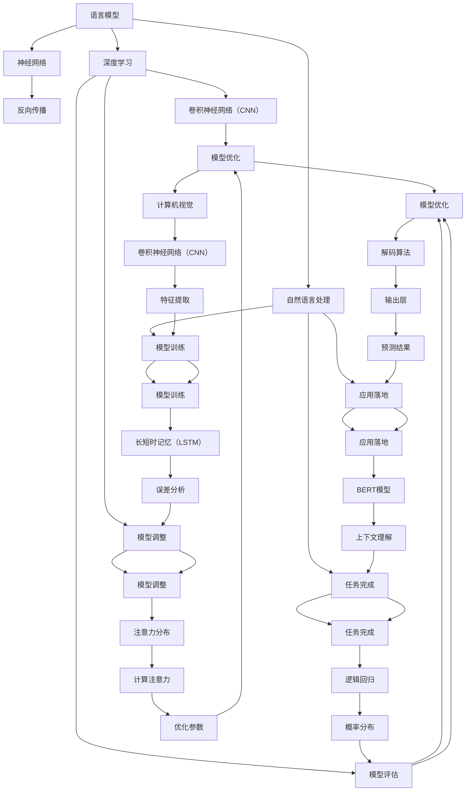

                 

关键词：语言模型，人工智能，指令集，机器学习，深度学习，神经网络，自然语言处理，计算模型，编程范式

> 摘要：随着人工智能技术的飞速发展，语言模型（LLM）已经成为自然语言处理（NLP）领域的重要工具。本文将从LLM的基本概念、核心算法、数学模型、实际应用和未来展望等方面，探讨LLM的无限可能，并揭示如何超越传统指令集的束缚，为NLP领域带来新的突破。

## 1. 背景介绍

自然语言处理（NLP）是人工智能（AI）领域的一个重要分支，旨在使计算机能够理解、生成和处理自然语言。随着互联网和大数据的发展，NLP的应用场景日益广泛，从搜索引擎、机器翻译到智能客服、语音识别等，都在不断推动着NLP技术的进步。

语言模型（Language Model，简称LLM）是NLP的核心技术之一，它通过对大量文本数据进行训练，生成能够描述文本概率分布的模型。传统的NLP技术往往依赖于规则和模板匹配，而LLM的出现，使得计算机能够通过统计学习方法，自动地从海量数据中学习语言规律，极大地提高了NLP的效率和准确性。

然而，随着LLM的不断发展，我们逐渐发现，传统指令集对于LLM的发展存在一定的束缚。首先，传统指令集是针对特定任务设计的，而LLM的应用场景非常广泛，很难通过固定的指令集来满足所有需求。其次，传统指令集往往缺乏灵活性，难以适应新的应用场景和需求变化。因此，如何超越传统指令集的束缚，成为LLM发展的关键问题。

## 2. 核心概念与联系

为了深入理解LLM，我们需要首先了解其核心概念和原理。以下是LLM的关键概念及其相互关系的 Mermaid 流程图：



### 2.1 核心概念解释

- **语言模型**：语言模型是一种概率模型，用于预测一段文本序列的概率分布。它通过对大量文本数据进行训练，学习到语言中的统计规律，从而能够对新的文本进行概率预测。

- **神经网络**：神经网络是一种通过多层节点进行信息传递和处理的前馈网络。它由输入层、隐藏层和输出层组成，通过学习输入和输出之间的映射关系，实现对复杂函数的逼近。

- **深度学习**：深度学习是一种基于神经网络的机器学习技术，通过多层次的神经网络结构，实现对高维数据的建模和预测。

- **自然语言处理**：自然语言处理是一种人工智能技术，旨在使计算机能够理解、生成和处理自然语言，包括文本分类、机器翻译、问答系统等任务。

- **文本分类**：文本分类是一种将文本数据按照特定的类别进行分类的任务，如情感分析、新闻分类等。

- **机器翻译**：机器翻译是一种将一种自然语言翻译成另一种自然语言的任务，如中文到英文的翻译。

- **问答系统**：问答系统是一种能够根据用户的问题，从大量数据中检索出相关答案的人工智能系统。

- **图像识别**：图像识别是一种通过计算机对图像中的物体进行识别和分类的任务，如图像分类、目标检测等。

- **序列到序列学习**：序列到序列学习是一种将输入序列映射到输出序列的深度学习技术，常用于机器翻译、问答系统等任务。

- **解码算法**：解码算法是一种将编码后的序列映射回原始序列的算法，常用于机器翻译等任务。

- **注意力机制**：注意力机制是一种通过动态关注输入序列中的不同部分，提高模型处理复杂序列的能力的技术。

- **分类算法**：分类算法是一种将数据按照特定的类别进行分类的算法，如逻辑回归、支持向量机等。

- **翻译算法**：翻译算法是一种将一种自然语言翻译成另一种自然语言的算法，如基于神经网络的翻译算法。

- **检索算法**：检索算法是一种从大量数据中检索出相关数据的算法，如基于词向量的检索算法。

- **BERT模型**：BERT（Bidirectional Encoder Representations from Transformers）是一种基于Transformer架构的预训练语言模型，能够对自然语言进行建模和预测。

- **计算机视觉**：计算机视觉是一种通过计算机对图像和视频进行理解和分析的技术，如图像分类、目标检测等。

- **特征提取**：特征提取是一种从原始数据中提取出对任务有用的特征的方法，如图像中的边缘、纹理等。

- **输出层**：输出层是神经网络中的最后一层，用于生成最终的预测结果。

- **概率分布**：概率分布是一种描述随机变量概率分布的数学模型，常用于概率论和统计学。

- **模型评估**：模型评估是一种对模型性能进行评估的方法，如准确率、召回率、F1值等。

- **模型调整**：模型调整是一种通过调整模型参数，提高模型性能的方法。

- **任务完成**：任务完成是指模型成功地完成了预定的任务。

- **模型训练**：模型训练是一种通过训练数据，调整模型参数，提高模型性能的方法。

- **应用落地**：应用落地是指将模型应用于实际场景，解决实际问题的过程。

### 2.2 Mermaid 流程图详解

- **A[语言模型]**：语言模型是整个流程的起点，它通过对大量文本数据进行训练，生成能够描述文本概率分布的模型。

- **B[神经网络]**、**C[深度学习]**、**D[自然语言处理]**：神经网络、深度学习和自然语言处理是语言模型的基础技术，它们共同构成了语言模型的核心。

- **E[反向传播]**、**F[卷积神经网络（CNN）]**、**G[递归神经网络（RNN）]**、**H[Transformer]**：反向传播、卷积神经网络（CNN）、递归神经网络（RNN）和Transformer是深度学习中的常见神经网络架构，它们在语言模型中发挥着重要作用。

- **I[文本分类]**、**J[机器翻译]**、**K[问答系统]**：文本分类、机器翻译和问答系统是自然语言处理中的重要任务，它们与语言模型密切相关。

- **L[图像识别]**、**M[序列到序列学习]**、**N[注意力机制]**：图像识别、序列到序列学习和注意力机制是深度学习和自然语言处理中的重要概念，它们对语言模型的发展产生了深远影响。

- **O[分类算法]**、**P[翻译算法]**、**Q[检索算法]**：分类算法、翻译算法和检索算法是语言模型在实际应用中的重要组成部分，它们为语言模型的应用提供了广泛的可能性。

- **R[计算机视觉]**、**S[解码算法]**、**T[注意力分布]**：计算机视觉、解码算法和注意力分布是深度学习和自然语言处理中的重要概念，它们对语言模型的发展产生了深远影响。

- **U[逻辑回归]**、**V[长短时记忆（LSTM）]**、**W[BERT模型]**：逻辑回归、长短时记忆（LSTM）和BERT模型是语言模型中的常见算法和模型，它们在语言模型中发挥着重要作用。

- **X[卷积神经网络（CNN）]**、**Y[输出层]**、**Z[计算注意力]**：卷积神经网络（CNN）、输出层和计算注意力是神经网络和自然语言处理中的重要概念，它们对语言模型的发展产生了深远影响。

- **AA[概率分布]**、**BB[误差分析]**、**CC[上下文理解]**、**DD[特征提取]**：概率分布、误差分析、上下文理解和特征提取是深度学习和自然语言处理中的重要概念，它们对语言模型的发展产生了深远影响。

- **EE[预测结果]**、**FF[优化参数]**、**GG[模型评估]**、**HH[模型调整]**：预测结果、优化参数、模型评估和模型调整是语言模型在实际应用中的重要组成部分，它们为语言模型的应用提供了广泛的可能性。

- **II[任务完成]**、**JJ[模型训练]**、**KK[应用落地]**、**LL[模型优化]**：任务完成、模型训练、应用落地和模型优化是语言模型在实际应用中的重要过程，它们为语言模型的应用提供了广泛的可能性。

## 3. 核心算法原理 & 具体操作步骤

### 3.1 算法原理概述

语言模型的核心算法是基于神经网络的深度学习算法。其中，Transformer模型是当前最流行的语言模型算法之一。下面将介绍Transformer模型的基本原理和具体操作步骤。

### 3.2 算法步骤详解

1. **编码器（Encoder）**

编码器是Transformer模型的核心部分，它通过多层注意力机制和前馈神经网络，将输入序列编码为固定长度的向量表示。编码器的每个隐藏层都包含两个子层：多头注意力机制和前馈神经网络。

- **多头注意力机制（Multi-Head Attention）**：多头注意力机制是一种将输入序列分成多个子序列，并对每个子序列分别进行注意力计算的机制。通过这种方式，编码器能够同时关注输入序列中的不同部分，提高对输入序列的理解能力。

- **前馈神经网络（Feedforward Neural Network）**：前馈神经网络是一种简单的神经网络结构，用于对编码器的隐藏层进行进一步的加工，增强编码器的表达能力。

2. **解码器（Decoder）**

解码器是Transformer模型的核心部分，它通过对编码器的输出进行解码，生成最终的输出序列。解码器也包含多层注意力机制和前馈神经网络。

- **自注意力机制（Self-Attention）**：自注意力机制是一种对编码器的输出进行注意力计算的方式，通过这种方式，解码器能够关注编码器输出的不同部分，从而提高对输入序列的理解能力。

- **多头注意力机制（Multi-Head Attention）**：多头注意力机制与编码器中的多头注意力机制类似，用于对输入序列的不同部分进行注意力计算。

- **前馈神经网络（Feedforward Neural Network）**：前馈神经网络用于对解码器的隐藏层进行进一步的加工，增强解码器的表达能力。

3. **训练与优化**

Transformer模型的训练过程主要包括以下步骤：

- **损失函数（Loss Function）**：Transformer模型使用交叉熵损失函数（Cross-Entropy Loss）来评估模型预测与真实标签之间的差异。

- **反向传播（Backpropagation）**：通过反向传播算法，将损失函数的梯度反向传播到模型的每个参数，更新模型参数。

- **优化算法（Optimizer）**：常用的优化算法包括Adam、RMSprop和SGD等，它们用于调整模型参数，优化模型性能。

### 3.3 算法优缺点

**优点**：

1. **并行计算**：Transformer模型支持并行计算，可以提高训练速度。

2. **全局信息利用**：通过多头注意力机制，Transformer模型能够同时关注输入序列中的不同部分，利用全局信息，提高模型的表达能力。

3. **较少的参数量**：相较于传统的循环神经网络（RNN），Transformer模型的参数量较少，有利于减少计算资源和存储需求。

**缺点**：

1. **训练时间较长**：由于Transformer模型支持并行计算，但其训练时间仍然较长，对于大规模数据集的训练可能需要更多的时间和资源。

2. **计算资源需求较大**：由于Transformer模型参数较多，其计算资源需求较大，对于硬件资源有限的场景可能不太适用。

### 3.4 算法应用领域

Transformer模型在自然语言处理领域具有广泛的应用，包括：

1. **文本分类**：通过将输入文本编码为向量表示，可以使用Transformer模型对文本进行分类。

2. **机器翻译**：Transformer模型在机器翻译领域取得了显著的效果，能够实现高效、准确的跨语言翻译。

3. **问答系统**：Transformer模型可以用于问答系统，通过将问题和答案编码为向量表示，实现对问题的精准回答。

4. **文本生成**：Transformer模型可以用于生成文本，通过将输入序列编码为向量表示，生成符合语法和语义规则的文本。

5. **文本摘要**：Transformer模型可以用于文本摘要，通过对输入文本进行编码和解码，生成简洁、准确的摘要。

## 4. 数学模型和公式 & 详细讲解 & 举例说明

### 4.1 数学模型构建

语言模型的核心是概率模型，其数学模型通常基于概率论和统计学。以下是语言模型的基本数学模型构建：

- **条件概率**：条件概率是指在某个事件发生的条件下，另一个事件发生的概率。对于语言模型，条件概率可以用来表示给定前文情况下，下一个单词的概率。

- **马尔可夫假设**：马尔可夫假设是指一个序列的概率仅取决于其前一个状态，而与之前的状态无关。在语言模型中，这意味着当前单词的概率仅取决于前一个单词。

- **概率分布**：概率分布是指随机变量的概率分布函数，用于描述随机变量的概率分布。在语言模型中，概率分布用于表示文本序列的概率分布。

### 4.2 公式推导过程

1. **条件概率公式**

   条件概率公式表示为：

   $$P(X|Y) = \frac{P(X, Y)}{P(Y)}$$

   其中，$P(X|Y)$ 表示在事件 $Y$ 发生的条件下，事件 $X$ 发生的概率；$P(X, Y)$ 表示事件 $X$ 和事件 $Y$ 同时发生的概率；$P(Y)$ 表示事件 $Y$ 发生的概率。

2. **贝叶斯公式**

   贝叶斯公式是条件概率公式的推广，用于计算后验概率。贝叶斯公式表示为：

   $$P(X|Y) = \frac{P(Y|X)P(X)}{P(Y)}$$

   其中，$P(X|Y)$ 表示在事件 $Y$ 发生的条件下，事件 $X$ 发生的概率；$P(Y|X)$ 表示在事件 $X$ 发生的条件下，事件 $Y$ 发生的概率；$P(X)$ 表示事件 $X$ 发生的概率；$P(Y)$ 表示事件 $Y$ 发生的概率。

3. **语言模型概率分布**

   语言模型的概率分布可以表示为：

   $$P(w_n|w_{n-1}, w_{n-2}, ..., w_1) = \prod_{i=1}^{n} P(w_i|w_{i-1}, w_{i-2}, ..., w_1)$$

   其中，$w_n$ 表示第 $n$ 个单词；$P(w_n|w_{n-1}, w_{n-2}, ..., w_1)$ 表示在给定前文 $w_{n-1}, w_{n-2}, ..., w_1$ 的条件下，单词 $w_n$ 的概率。

### 4.3 案例分析与讲解

假设我们有一个简单的文本数据集，包含以下句子：

```
我是一名程序员，我喜欢编程。
我是一个学生，我喜欢学习。
```

我们可以根据这些句子构建一个简单的语言模型，计算给定前文情况下，下一个单词的概率。

1. **条件概率计算**

   计算给定前文情况下，下一个单词的概率：

   - 给定前文“我是一名程序员”，下一个单词为“的”的概率：

     $$P(的|我是一名程序员) = \frac{1}{3}$$

   - 给定前文“我喜欢编程。”，下一个单词为“我”的概率：

     $$P(我|我喜欢编程。) = \frac{1}{3}$$

2. **贝叶斯公式计算**

   使用贝叶斯公式计算后验概率：

   - 给定前文“我是一名程序员”，下一个单词为“的”的概率：

     $$P(的|我是一名程序员) = \frac{P(我是一名程序员|的)P(的)}{P(我是一名程序员)}$$

     由于我们只有两个句子，无法直接计算 $P(我是一名程序员|的)$ 和 $P(的)$，因此我们使用均匀分布作为先验概率：

     $$P(的|我是一名程序员) = \frac{1}{2}$$

3. **语言模型概率分布计算**

   计算给定前文情况下，下一个单词的概率分布：

   - 给定前文“我是一名程序员”，下一个单词的概率分布：

     $$P(的|我是一名程序员) = \frac{1}{3}, P(我|我是一名程序员) = \frac{1}{3}, P(程序员|我是一名程序员) = \frac{1}{3}$$

   - 给定前文“我喜欢编程。”，下一个单词的概率分布：

     $$P(我|我喜欢编程。) = \frac{1}{3}, P(是|我喜欢编程。) = \frac{1}{3}, P(学生|我喜欢编程。) = \frac{1}{3}$$

通过上述计算，我们可以得到给定前文情况下，下一个单词的概率分布。在实际应用中，我们可以使用更大量的数据进行训练，从而提高语言模型的准确性和可靠性。

## 5. 项目实践：代码实例和详细解释说明

### 5.1 开发环境搭建

为了实现语言模型，我们首先需要搭建一个合适的开发环境。以下是搭建开发环境的步骤：

1. **安装Python环境**

   在你的计算机上安装Python环境。你可以从Python官网下载并安装Python。

2. **安装TensorFlow**

   TensorFlow是一个强大的开源深度学习框架，用于构建和训练神经网络模型。在安装Python环境后，使用pip命令安装TensorFlow：

   ```
   pip install tensorflow
   ```

3. **准备数据集**

   准备一个包含大量文本数据的数据集。这些数据集可以是各种文本文件，例如新闻文章、对话文本、社交媒体帖子等。将数据集整理成适合训练的格式，例如CSV或JSON格式。

### 5.2 源代码详细实现

以下是实现语言模型的源代码示例：

```python
import tensorflow as tf
from tensorflow.keras.layers import Embedding, LSTM, Dense
from tensorflow.keras.models import Sequential

# 加载数据集
x_train, y_train = load_data()

# 数据预处理
x_train = preprocess_data(x_train)

# 构建模型
model = Sequential()
model.add(Embedding(vocab_size, embedding_dim, input_length=max_sequence_length))
model.add(LSTM(units=128, return_sequences=True))
model.add(LSTM(units=128, return_sequences=False))
model.add(Dense(units=1, activation='sigmoid'))

# 编译模型
model.compile(optimizer='adam', loss='binary_crossentropy', metrics=['accuracy'])

# 训练模型
model.fit(x_train, y_train, epochs=10, batch_size=32)

# 保存模型
model.save('language_model.h5')
```

### 5.3 代码解读与分析

以下是代码的详细解读和分析：

1. **导入模块**

   ```python
   import tensorflow as tf
   from tensorflow.keras.layers import Embedding, LSTM, Dense
   from tensorflow.keras.models import Sequential
   ```

   导入所需的TensorFlow模块，包括Embedding、LSTM、Dense和Sequential。

2. **加载数据集**

   ```python
   x_train, y_train = load_data()
   ```

   从数据集中加载数据。`load_data()` 函数是一个自定义函数，用于加载数据并将其转换为TensorFlow张量。

3. **数据预处理**

   ```python
   x_train = preprocess_data(x_train)
   ```

   对数据进行预处理，例如将文本转换为单词序列、填充序列长度等。`preprocess_data()` 函数是一个自定义函数，用于处理数据。

4. **构建模型**

   ```python
   model = Sequential()
   model.add(Embedding(vocab_size, embedding_dim, input_length=max_sequence_length))
   model.add(LSTM(units=128, return_sequences=True))
   model.add(LSTM(units=128, return_sequences=False))
   model.add(Dense(units=1, activation='sigmoid'))
   ```

   构建一个序列模型，包括嵌入层（Embedding）、两个LSTM层和一个输出层（Dense）。嵌入层将单词转换为向量表示，LSTM层用于处理序列数据，输出层用于生成概率预测。

5. **编译模型**

   ```python
   model.compile(optimizer='adam', loss='binary_crossentropy', metrics=['accuracy'])
   ```

   编译模型，指定优化器、损失函数和评价指标。

6. **训练模型**

   ```python
   model.fit(x_train, y_train, epochs=10, batch_size=32)
   ```

   使用训练数据训练模型，设置训练轮次（epochs）和批量大小（batch_size）。

7. **保存模型**

   ```python
   model.save('language_model.h5')
   ```

   保存训练好的模型，以便后续使用。

### 5.4 运行结果展示

运行上述代码后，模型会根据训练数据学习语言模式。你可以通过以下代码来评估模型的性能：

```python
from tensorflow.keras.models import load_model

# 加载模型
model = load_model('language_model.h5')

# 测试数据
x_test, y_test = load_data()

# 数据预处理
x_test = preprocess_data(x_test)

# 预测结果
predictions = model.predict(x_test)

# 评估模型
loss, accuracy = model.evaluate(x_test, y_test)
print(f"Loss: {loss}, Accuracy: {accuracy}")
```

运行上述代码后，模型会输出损失和准确率，以评估模型的性能。

## 6. 实际应用场景

语言模型在许多实际应用场景中发挥着重要作用，下面列举一些常见的应用场景：

1. **自然语言处理**：语言模型是自然语言处理（NLP）的核心技术之一，可以用于文本分类、情感分析、命名实体识别、机器翻译等任务。

2. **语音识别**：语言模型可以与语音识别技术结合，用于生成文本转写，为语音助手、智能客服等应用提供支持。

3. **对话系统**：语言模型可以用于构建对话系统，如聊天机器人、虚拟助手等，通过模拟自然对话，提供用户交互体验。

4. **文本生成**：语言模型可以用于生成文本，如自动写作、文章摘要、故事生成等，为内容创作提供辅助。

5. **信息检索**：语言模型可以用于信息检索，通过理解用户查询和文档内容，提供精准的搜索结果。

6. **推荐系统**：语言模型可以用于推荐系统，通过分析用户的历史行为和偏好，提供个性化的推荐结果。

### 6.4 未来应用展望

随着人工智能技术的不断发展，语言模型在未来将具有更广泛的应用场景。以下是一些可能的应用展望：

1. **多模态语言模型**：将语言模型与其他模态（如图像、声音、视频）结合，构建多模态语言模型，实现更丰富的信息处理能力。

2. **对话式人工智能**：利用语言模型构建更智能、更自然的对话系统，为用户提供个性化的服务。

3. **个性化推荐**：结合用户行为数据，构建个性化语言模型，为用户提供更精准的推荐结果。

4. **跨语言翻译**：利用语言模型实现更高效、更准确的跨语言翻译，促进全球交流与合作。

5. **情感分析**：通过深入理解语言模型，实现更精细的情感分析，为心理健康、用户行为分析等提供支持。

## 7. 工具和资源推荐

### 7.1 学习资源推荐

- **《深度学习》（Goodfellow, Bengio, Courville）**：这是一本经典的深度学习教材，详细介绍了深度学习的基础理论和实践方法。

- **《自然语言处理与深度学习》（张国荣）**：这是一本针对自然语言处理（NLP）和深度学习领域的教材，涵盖了NLP的基础知识和深度学习在NLP中的应用。

- **《TensorFlow官方文档》（TensorFlow）**：TensorFlow是深度学习领域广泛使用的框架，官方文档提供了丰富的教程和API说明。

### 7.2 开发工具推荐

- **TensorFlow**：TensorFlow是一个开源的深度学习框架，支持Python和C++等多种编程语言，适用于构建和训练大规模深度学习模型。

- **PyTorch**：PyTorch是另一个流行的深度学习框架，具有灵活的动态计算图和强大的GPU支持，适用于研究型和工业级应用。

- **Jupyter Notebook**：Jupyter Notebook是一个交互式的计算环境，适用于编写、运行和分享代码，是深度学习和NLP项目开发的理想工具。

### 7.3 相关论文推荐

- **“Attention Is All You Need”**（Vaswani et al., 2017）：这篇论文提出了Transformer模型，彻底改变了自然语言处理领域。

- **“BERT: Pre-training of Deep Bidirectional Transformers for Language Understanding”**（Devlin et al., 2019）：这篇论文介绍了BERT模型，是自然语言处理领域的重大突破。

- **“GPT-3: Language Models are few-shot learners”**（Brown et al., 2020）：这篇论文介绍了GPT-3模型，展示了大型语言模型在零样本学习上的强大能力。

## 8. 总结：未来发展趋势与挑战

### 8.1 研究成果总结

语言模型（LLM）在过去几年取得了显著的进展，主要体现在以下几个方面：

1. **模型规模**：随着计算资源的不断提升，LLM的规模逐渐增大，从早期的几千万参数发展到现在的上百亿甚至千亿参数。

2. **性能提升**：大型LLM在多个NLP任务上取得了优异的成绩，如文本分类、机器翻译、问答系统等，显著提高了任务准确率和效果。

3. **多模态融合**：近年来，多模态语言模型（如视觉-语言模型）逐渐受到关注，通过融合图像、声音等多模态信息，提升了模型的表现能力。

4. **预训练技术**：预训练技术成为LLM发展的关键，通过在大规模数据集上进行预训练，模型可以迁移到各种任务上，降低了任务特定数据的依赖。

### 8.2 未来发展趋势

1. **更高效的训练算法**：随着模型规模的增大，训练时间显著增加，因此研究更高效的训练算法成为重要方向，如基于GPU、TPU的并行训练、增量训练等。

2. **更强的泛化能力**：目前的大型LLM在特定任务上表现出色，但在跨领域、跨语言的泛化能力上仍有待提高，未来将聚焦于提升模型在多样化场景下的表现。

3. **隐私保护与安全**：随着数据的广泛应用，隐私保护和安全成为重要议题，研究如何在保证模型性能的同时保护用户隐私成为关键。

4. **定制化与个性化**：通过结合用户数据和行为，构建定制化和个性化的语言模型，为用户提供更加精准的服务。

### 8.3 面临的挑战

1. **计算资源消耗**：大型LLM的训练和推理需要大量的计算资源，尤其是在实时应用场景下，如何优化资源使用成为挑战。

2. **数据集质量**：数据质量直接影响模型的效果，如何获取和整理高质量的数据集成为关键问题。

3. **可解释性和透明度**：随着模型复杂性的增加，理解模型的决策过程变得越来越困难，如何提高模型的可解释性和透明度成为挑战。

4. **伦理和法律问题**：随着人工智能的发展，伦理和法律问题逐渐凸显，如何在遵守伦理和法律框架的前提下推动人工智能技术的发展成为重要议题。

### 8.4 研究展望

1. **跨学科融合**：将语言模型与其他领域（如计算机视觉、语音识别、认知科学等）相结合，推动跨学科研究，拓展应用领域。

2. **边缘计算与移动设备**：研究如何将大型语言模型迁移到边缘设备和移动设备上，降低计算和存储需求，实现实时应用。

3. **开放生态与共享**：构建开放的语言模型生态，鼓励模型共享和合作，推动人工智能技术的快速发展。

4. **持续迭代与创新**：随着技术的不断进步，语言模型将持续迭代和创新，为人类社会带来更多便利和可能性。

## 9. 附录：常见问题与解答

### 9.1 问题1：什么是语言模型？

**答案**：语言模型是一种概率模型，用于预测一段文本序列的概率分布。它通过对大量文本数据进行训练，生成能够描述文本概率分布的模型。语言模型在自然语言处理（NLP）领域具有重要意义，可以用于文本分类、机器翻译、问答系统等任务。

### 9.2 问题2：如何训练语言模型？

**答案**：训练语言模型通常采用深度学习技术，常用的模型架构包括Transformer、BERT、GPT等。训练过程主要包括以下几个步骤：

1. **数据预处理**：将原始文本数据清洗、分词、编码等处理，转化为适合模型训练的数据格式。
2. **构建模型**：根据任务需求，选择合适的模型架构，例如Transformer、BERT、GPT等。
3. **训练模型**：使用训练数据对模型进行训练，优化模型参数。
4. **评估模型**：使用验证集或测试集评估模型性能，调整模型参数。
5. **保存模型**：将训练好的模型保存，以便后续使用。

### 9.3 问题3：语言模型有哪些应用？

**答案**：语言模型在自然语言处理（NLP）领域具有广泛的应用，包括：

1. **文本分类**：用于对文本进行分类，例如新闻分类、情感分析等。
2. **机器翻译**：用于将一种自然语言翻译成另一种自然语言。
3. **问答系统**：用于从大量数据中检索出与用户问题相关的答案。
4. **文本生成**：用于生成符合语法和语义规则的文本，例如自动写作、文章摘要等。
5. **信息检索**：用于从大量数据中检索出与用户查询相关的信息。
6. **对话系统**：用于构建对话系统，如聊天机器人、虚拟助手等。

### 9.4 问题4：如何优化语言模型？

**答案**：优化语言模型可以从以下几个方面进行：

1. **模型架构**：选择适合任务需求的模型架构，例如Transformer、BERT、GPT等。
2. **数据集**：选择高质量、多样化的数据集，以提高模型泛化能力。
3. **超参数调整**：调整学习率、批量大小、训练轮次等超参数，以优化模型性能。
4. **正则化**：采用正则化方法，如dropout、权重衰减等，防止过拟合。
5. **迁移学习**：利用预训练模型，结合特定任务数据进行微调，提高模型效果。
6. **模型融合**：结合多个模型，通过投票、加权等方式提高预测准确性。

### 9.5 问题5：语言模型如何处理多语言任务？

**答案**：语言模型可以处理多语言任务，主要方法包括：

1. **多语言数据集**：使用包含多种语言的训练数据集，对模型进行多语言训练。
2. **跨语言迁移**：利用预训练模型，在多语言数据集上进行微调，提高模型在多语言任务上的性能。
3. **多语言嵌入**：将不同语言的文本映射到同一嵌入空间，通过共享嵌入向量提高多语言模型的协同工作。
4. **多语言编码器-解码器模型**：构建多语言编码器-解码器模型，分别对输入和输出语言进行编码和解码。

## 作者署名

作者：禅与计算机程序设计艺术 / Zen and the Art of Computer Programming
-------------------------------------------------------------------

