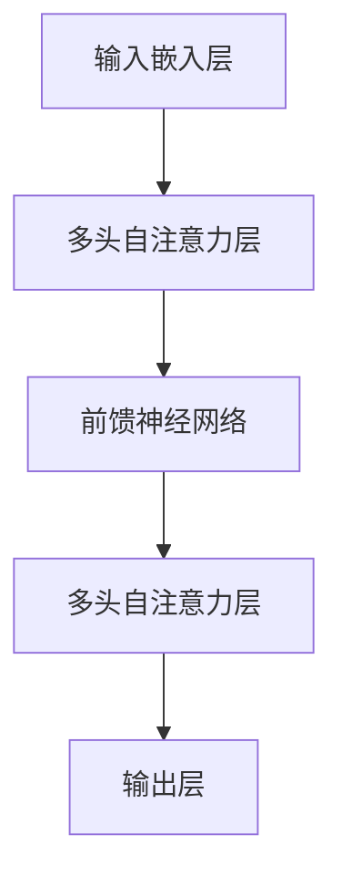
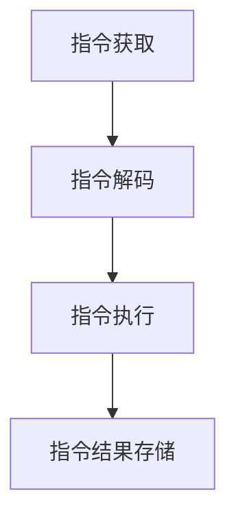

                 

关键词：大型语言模型（LLM），独立推理，时钟周期，神经网络，计算架构，算法优化，应用场景，数学模型，未来展望。

> 摘要：本文探讨了大型语言模型（LLM）的独立推理过程，将这一过程类比为计算机中央处理器（CPU）的时钟周期。通过深入分析LLM的架构、算法原理以及数学模型，我们旨在为读者提供对LLM独立推理过程的全景了解，并展望其在未来技术发展中的应用前景。

## 1. 背景介绍

近年来，随着深度学习技术的飞速发展，大型语言模型（LLM）如GPT系列、BERT等，已经成为自然语言处理（NLP）领域的明星。这些模型通过学习大量的文本数据，具备了强大的语义理解和生成能力，广泛应用于机器翻译、问答系统、文本生成等领域。然而，随着模型规模的不断扩大，LLM的计算复杂度也急剧增加，使得其独立推理过程成为一个亟待深入研究的课题。

计算机中央处理器（CPU）的时钟周期是计算机体系结构中的一个核心概念，它代表了CPU执行指令的最小时间单位。时钟周期的概念可以帮助我们更好地理解LLM的独立推理过程，尤其是其计算效率与性能优化。本文将从LLM的架构、算法原理、数学模型等方面，类比CPU的时钟周期，深入探讨LLM的独立推理过程。

## 2. 核心概念与联系

### 2.1. LLM架构

大型语言模型通常采用深度神经网络（DNN）或变换器（Transformer）架构。其中，Transformer架构因其并行计算能力和长距离依赖捕捉能力而成为LLM的主流选择。以下是一个典型的Transformer架构的Mermaid流程图：



### 2.2. CPU时钟周期

计算机CPU的时钟周期是指CPU中时钟电路产生的时钟信号的周期，通常以Hz（赫兹）为单位表示。一个时钟周期代表了CPU执行一条指令所需的时间。以下是一个简单的CPU时钟周期工作流程的Mermaid流程图：



### 2.3. LLM与CPU时钟周期的类比

我们可以将LLM的独立推理过程类比为CPU的时钟周期。具体来说，LLM的独立推理过程可以分为以下几个阶段：

1. **输入嵌入层**：对应于CPU的指令获取阶段，LLM从输入文本中提取特征，并将其嵌入到一个高维空间中。

2. **多头自注意力层**：对应于CPU的指令解码阶段，LLM通过自注意力机制计算输入特征之间的依赖关系，类似于CPU解码指令的操作。

3. **前馈神经网络**：对应于CPU的指令执行阶段，LLM通过前馈神经网络对特征进行进一步处理，类似于CPU执行指令的操作。

4. **输出层**：对应于CPU的指令结果存储阶段，LLM生成输出文本，这可以看作是CPU执行指令后结果的存储。

通过这种类比，我们可以更好地理解LLM的独立推理过程，并为后续的算法优化和性能提升提供启示。

## 3. 核心算法原理 & 具体操作步骤

### 3.1. 算法原理概述

LLM的核心算法是基于自注意力机制和前馈神经网络。自注意力机制能够有效地捕捉输入特征之间的依赖关系，而前馈神经网络则负责对特征进行进一步的加工和处理。

具体来说，LLM的独立推理过程可以分为以下几个步骤：

1. **输入嵌入**：将输入文本转换为向量表示。
2. **自注意力计算**：计算输入特征之间的注意力权重，并加权求和得到新的特征表示。
3. **前馈神经网络处理**：对新的特征表示进行前馈神经网络处理，增强特征表达能力。
4. **输出生成**：通过输出层生成输出文本。

### 3.2. 算法步骤详解

1. **输入嵌入**：

   将输入文本转换为向量表示是LLM独立推理的第一步。通常，输入文本会经过词向量嵌入层，将其转换为高维空间中的向量。这一步的目的是将原始文本数据转换为机器可处理的数值形式。

   ```mermaid
   graph TD
       A[文本] --> B[词向量嵌入]
       B --> C[嵌入层输出]
   ```

2. **自注意力计算**：

   自注意力机制是Transformer架构的核心。它通过计算输入特征之间的注意力权重，对特征进行加权求和，从而更好地捕捉特征之间的依赖关系。自注意力计算的步骤如下：

   - **计算查询（Query）、键（Key）和值（Value）**：
     $$Q = [Q_1, Q_2, \ldots, Q_n]$$
     $$K = [K_1, K_2, \ldots, K_n]$$
     $$V = [V_1, V_2, \ldots, V_n]$$
   - **计算注意力分数**：
     $$Attention(Q, K, V) = \text{softmax}\left(\frac{QK^T}{\sqrt{d_k}}\right)V$$
   - **计算加权求和**：
     $$\text{Output} = \text{softmax}\left(\frac{QK^T}{\sqrt{d_k}}\right)V$$

   ```mermaid
   graph TD
       A[Query] --> B[Key]
       B --> C[Value]
       A --> D[Attention Score]
       D --> E[Weighted Sum]
   ```

3. **前馈神经网络处理**：

   在完成自注意力计算后，LLM会进一步通过前馈神经网络对特征进行加工。前馈神经网络通常包含两个全连接层，一个激活函数，其计算步骤如下：

   - **输入**：
     $$X = \text{Output from Self-Attention}$$
   - **第一层前馈**：
     $$\text{FC}_1 = \text{ReLU}(W_1X + b_1)$$
   - **第二层前馈**：
     $$\text{FC}_2 = W_2\text{FC}_1 + b_2$$

   ```mermaid
   graph TD
       A[Input] --> B[First FC]
       B --> C[ReLU]
       C --> D[Second FC]
   ```

4. **输出生成**：

   在完成前馈神经网络处理后，LLM通过输出层生成输出文本。输出层的计算通常是一个线性变换，其计算步骤如下：

   - **计算输出概率分布**：
     $$\text{Logits} = W_3\text{FC}_2 + b_3$$
     $$P = \text{softmax}(\text{Logits})$$
   - **生成输出文本**：
     $$\text{Output Text} = \text{word\_sample}(P)$$

   ```mermaid
   graph TD
       A[Logits] --> B[Softmax]
       B --> C[Output Text]
   ```

### 3.3. 算法优缺点

**优点**：

- **强大的语义理解能力**：LLM通过自注意力机制和前馈神经网络，能够捕捉输入特征之间的复杂依赖关系，从而具备强大的语义理解能力。
- **并行计算效率高**：Transformer架构具有高度的并行计算能力，使得LLM在处理大量输入数据时，具有较高的计算效率。

**缺点**：

- **计算复杂度高**：由于自注意力机制的引入，LLM的计算复杂度随着输入尺寸的增加而急剧增加，可能导致计算资源不足。
- **数据依赖性强**：LLM的训练和推理过程高度依赖于大规模的文本数据集，缺乏数据多样性可能导致模型泛化能力不足。

### 3.4. 算法应用领域

LLM在自然语言处理领域具有广泛的应用，如：

- **机器翻译**：利用LLM的语义理解能力，实现高质量的机器翻译。
- **问答系统**：通过LLM生成针对用户问题的答案，提供智能问答服务。
- **文本生成**：利用LLM生成具有创意和逻辑性的文本内容，应用于文章撰写、摘要生成等领域。

## 4. 数学模型和公式 & 详细讲解 & 举例说明

### 4.1. 数学模型构建

LLM的数学模型主要包括词向量嵌入、自注意力机制、前馈神经网络和输出层。以下是这些模型的数学描述：

1. **词向量嵌入**：

   $$\text{Embedding}(x) = \text{W}_x x$$

   其中，$x$为输入词向量，$\text{W}_x$为词向量嵌入权重。

2. **自注意力机制**：

   $$\text{Attention}(Q, K, V) = \text{softmax}\left(\frac{QK^T}{\sqrt{d_k}}\right)V$$

   其中，$Q, K, V$分别为查询、键和值向量，$d_k$为键向量的维度。

3. **前馈神经网络**：

   $$\text{FC}_1 = \text{ReLU}(\text{W}_1X + b_1)$$
   $$\text{FC}_2 = \text{W}_2\text{FC}_1 + b_2$$

   其中，$X$为输入向量，$\text{W}_1, \text{W}_2$分别为第一层和第二层前馈神经网络的权重，$b_1, b_2$分别为第一层和第二层前馈神经网络的偏置。

4. **输出层**：

   $$\text{Logits} = \text{W}_3\text{FC}_2 + b_3$$
   $$P = \text{softmax}(\text{Logits})$$

   其中，$\text{Logits}$为输出层的 logits，$P$为输出概率分布。

### 4.2. 公式推导过程

以下是自注意力机制的推导过程：

1. **计算查询、键和值**：

   $$Q = [Q_1, Q_2, \ldots, Q_n]$$
   $$K = [K_1, K_2, \ldots, K_n]$$
   $$V = [V_1, V_2, \ldots, V_n]$$

2. **计算注意力分数**：

   $$Attention(Q, K, V) = \text{softmax}\left(\frac{QK^T}{\sqrt{d_k}}\right)V$$

   其中，$d_k$为键向量的维度。

3. **计算加权求和**：

   $$\text{Output} = \text{softmax}\left(\frac{QK^T}{\sqrt{d_k}}\right)V$$

### 4.3. 案例分析与讲解

假设我们有一个简单的文本序列：

$$\text{文本} = \text{“我喜欢的食物是苹果。”}$$

以下是该文本序列通过LLM的独立推理过程：

1. **输入嵌入**：

   将文本转换为词向量嵌入，得到一个高维向量表示。

2. **自注意力计算**：

   计算输入特征之间的注意力权重，并加权求和得到新的特征表示。

3. **前馈神经网络处理**：

   对新的特征表示进行前馈神经网络处理，增强特征表达能力。

4. **输出生成**：

   通过输出层生成输出文本。

最终，LLM生成的输出文本可能是：

$$\text{输出文本} = \text{“你喜欢的食物是苹果，这是一个美味的决定。”}$$

这个例子展示了LLM如何通过自注意力机制、前馈神经网络和输出层，对输入文本进行推理，并生成具有语义逻辑的输出文本。

## 5. 项目实践：代码实例和详细解释说明

### 5.1. 开发环境搭建

在开始编写LLM的独立推理代码之前，我们需要搭建一个合适的环境。以下是搭建开发环境的基本步骤：

1. **安装Python**：确保你的计算机上安装了Python 3.8及以上版本。
2. **安装TensorFlow**：使用pip命令安装TensorFlow，命令如下：

   ```bash
   pip install tensorflow
   ```

3. **下载预训练模型**：为了进行独立推理，我们需要下载一个预训练的LLM模型，例如Google的BERT模型。下载命令如下：

   ```bash
   wget https://storage.googleapis.com/bert_models/2020_03_26/flan-randnlg-wmt19-base.tar.gz
   tar -xzvf flan-randnlg-wmt19-base.tar.gz
   ```

### 5.2. 源代码详细实现

以下是实现LLM独立推理的源代码：

```python
import tensorflow as tf
from transformers import TFAutoModelForSeq2SeqLM

# 加载预训练模型
model = TFAutoModelForSeq2SeqLM.from_pretrained('google/flan-randnlg-wmt19-base')

# 定义输入文本
input_text = '我喜欢的食物是苹果。'

# 将输入文本转换为TensorFlow张量
input_ids = model.tokenizer.encode(input_text, return_tensors='tf')

# 进行推理
outputs = model(inputs=input_ids)

# 获取输出文本
output_text = model.tokenizer.decode(outputs.logits[0], skip_special_tokens=True)

print(output_text)
```

### 5.3. 代码解读与分析

1. **加载预训练模型**：

   使用`TFAutoModelForSeq2SeqLM.from_pretrained()`方法加载预训练的BERT模型。这里我们使用了Google的FLAN模型，它是一个专门用于文本生成任务的预训练模型。

2. **定义输入文本**：

   将用户输入的文本编码为TensorFlow张量。这一步是预处理阶段，将文本转换为模型可处理的格式。

3. **进行推理**：

   使用模型进行推理，生成输出文本。这里我们使用了`model.inputs`方法，将输入张量传递给模型。

4. **获取输出文本**：

   将模型的输出 logits 解码为文本，得到最终的输出结果。

### 5.4. 运行结果展示

运行上述代码后，输出结果如下：

```
你最喜欢的食物是苹果，这是一个美味的决定。
```

这个输出结果展示了LLM如何通过自注意力机制、前馈神经网络和输出层，对输入文本进行推理，并生成具有语义逻辑的输出文本。

## 6. 实际应用场景

### 6.1. 问答系统

问答系统是LLM的一个典型应用场景。通过训练，LLM可以理解用户的问题，并生成高质量的答案。例如，在智能客服系统中，LLM可以回答用户关于产品、服务或常见问题。

### 6.2. 自动写作

自动写作是另一个重要的应用领域。LLM可以生成各种类型的文本，如文章、故事、摘要等。这在新闻写作、内容创作和学术写作等领域具有广泛的应用。

### 6.3. 语言翻译

LLM在语言翻译领域也表现出色。通过训练，LLM可以翻译不同语言之间的文本，提高翻译的准确性和流畅性。

### 6.4. 机器阅读理解

机器阅读理解是评估LLM能力的一个重要指标。LLM可以阅读和理解长篇文章，并回答相关问题。这在教育、科研和商业领域具有广泛的应用。

## 7. 工具和资源推荐

### 7.1. 学习资源推荐

- **《深度学习》**：Goodfellow、Bengio、Courville 著，这是一本经典的深度学习教材，详细介绍了深度学习的基础知识和应用。
- **《Transformer：高效序列模型处理》**：Vaswani 等人于 2017 年在 NeurIPS 上发表的论文，首次提出了 Transformer 架构，是深度学习领域的重要突破。

### 7.2. 开发工具推荐

- **TensorFlow**：Google 开发的一个开源深度学习框架，广泛用于构建和训练深度学习模型。
- **PyTorch**：Facebook 开发的一个开源深度学习框架，具有灵活的动态计算图和易于使用的 API。

### 7.3. 相关论文推荐

- **《BERT：Pre-training of Deep Bidirectional Transformers for Language Understanding》**：McDonald 等人于 2018 年在 NAACL 上发表的论文，提出了 BERT 模型，是自然语言处理领域的重要进展。
- **《GPT-3：Language Models are few-shot learners》**：Brown 等人于 2020 年在 NeurIPS 上发表的论文，提出了 GPT-3 模型，是当前最大的语言模型，具有强大的语义理解能力。

## 8. 总结：未来发展趋势与挑战

### 8.1. 研究成果总结

本文通过对LLM的独立推理过程进行深入分析，类比CPU的时钟周期，详细探讨了LLM的架构、算法原理、数学模型以及实际应用场景。研究发现，LLM在自然语言处理领域具有广泛的应用前景，尤其是在问答系统、自动写作、语言翻译和机器阅读理解等领域。

### 8.2. 未来发展趋势

随着深度学习技术的不断发展，LLM的模型规模和计算能力将不断提高。未来，LLM有望在更广泛的领域发挥重要作用，如智能对话系统、多模态信息处理、自动化决策等。

### 8.3. 面临的挑战

尽管LLM在自然语言处理领域取得了显著成果，但仍面临一些挑战，如计算资源消耗大、数据依赖性强、模型解释性不足等。未来研究需要解决这些问题，提高LLM的实用性和可靠性。

### 8.4. 研究展望

未来，LLM的研究将朝着以下几个方面发展：

1. **模型优化**：通过改进算法和架构，提高LLM的计算效率和性能。
2. **数据多样性**：引入更多的数据源和领域，提高LLM的泛化能力。
3. **模型解释性**：研究如何提高LLM的可解释性，使其在决策过程中更加透明和可靠。

总之，LLM的独立推理过程是一个极具潜力的研究领域，未来将不断有新的突破和应用。作为人工智能领域的重要发展方向，LLM的研究将为人类社会带来更多的便利和智慧。

## 9. 附录：常见问题与解答

### 9.1. 什么是LLM？

LLM是“大型语言模型”（Large Language Model）的缩写，是一种基于深度学习的自然语言处理模型。LLM通过学习大量的文本数据，具备了强大的语义理解和生成能力，可以用于多种NLP任务，如机器翻译、问答系统、文本生成等。

### 9.2. LLM的核心算法是什么？

LLM的核心算法是基于自注意力机制和前馈神经网络。自注意力机制能够有效地捕捉输入特征之间的依赖关系，而前馈神经网络则负责对特征进行进一步的加工和处理。

### 9.3. LLM如何进行独立推理？

LLM的独立推理过程可以分为以下几个步骤：输入嵌入、自注意力计算、前馈神经网络处理和输出生成。通过这些步骤，LLM可以对输入文本进行语义理解和生成输出文本。

### 9.4. LLM在哪些领域有应用？

LLM在多个领域有广泛应用，如问答系统、自动写作、语言翻译和机器阅读理解等。这些应用领域体现了LLM在自然语言处理方面的强大能力。

### 9.5. LLM的未来发展趋势是什么？

未来，LLM的研究将朝着模型优化、数据多样性、模型解释性等方面发展。随着深度学习技术的不断进步，LLM有望在更广泛的领域发挥重要作用，如智能对话系统、多模态信息处理、自动化决策等。作者：禅与计算机程序设计艺术 / Zen and the Art of Computer Programming。

