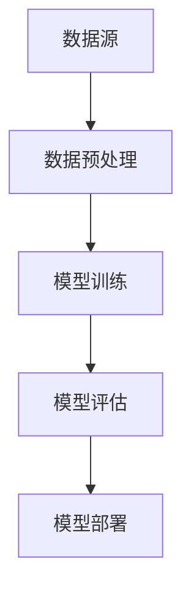

                 

关键词：Large Language Model，知识更新，时效性，AI，机器学习，信息检索，算法优化，应用场景

## 摘要

本文旨在探讨大型语言模型（LLM）的知识更新问题，重点关注如何保持AI信息的时效性。随着互联网和大数据技术的发展，知识更新的速度不断加快，这对AI系统提出了新的挑战。本文将首先介绍LLM的基本概念和工作原理，然后详细讨论知识更新在LLM中的重要性，以及如何通过有效的算法和策略来更新LLM的知识库，最后探讨LLM在各个领域的实际应用和未来发展趋势。

## 1. 背景介绍

### 1.1 大型语言模型的发展历程

大型语言模型（LLM）的发展历程可以追溯到20世纪50年代。当时，科学家们开始研究如何让计算机理解和生成人类语言。早期的语言模型主要基于统计方法和规则系统。随着计算机性能的不断提高和大数据技术的发展，深度学习技术在语言处理领域取得了突破性的进展。2018年，Google推出了BERT模型，它采用了双向转换器（Bi-directional Encoder Representations from Transformers）架构，使语言模型的预训练和微调变得更加高效。

### 1.2 LLM的基本概念和工作原理

LLM是一种基于神经网络的语言处理模型，它可以理解和生成自然语言文本。LLM的基本工作原理包括以下几个步骤：

1. **数据收集和预处理**：收集大量的文本数据，并进行清洗和标注，以便用于模型的训练。
2. **模型训练**：使用预训练算法（如BERT、GPT等）对模型进行训练，使模型能够理解和捕捉语言中的复杂模式。
3. **模型微调**：根据具体应用场景，对预训练的模型进行微调，以适应特定任务的需求。
4. **文本生成**：通过模型生成自然语言文本，用于各种应用场景，如问答系统、文本摘要、机器翻译等。

## 2. 核心概念与联系

### 2.1 LLM中的知识更新

知识更新是指在LLM的预训练和微调过程中，不断引入新的知识和数据，以保持模型的知识库的时效性和准确性。知识更新的重要性在于：

1. **适应性**：随着应用场景的变化，LLM需要不断适应新的知识和信息。
2. **准确性**：知识更新有助于提高模型在特定任务上的表现，减少过时信息的干扰。
3. **可维护性**：定期更新LLM的知识库，有助于减少模型维护的难度。

### 2.2 知识更新的架构

知识更新的架构可以分为以下几个层次：

1. **数据源**：包括互联网、数据库、社交媒体等。
2. **数据预处理**：对收集到的数据进行清洗、去重和标注。
3. **模型训练**：使用更新的数据对LLM进行训练。
4. **模型评估**：评估更新后的LLM在各个任务上的表现。
5. **模型部署**：将更新后的LLM部署到实际应用场景中。



## 3. 核心算法原理 & 具体操作步骤

### 3.1 算法原理概述

知识更新算法主要包括以下几种：

1. **数据流处理**：实时处理和更新数据，使模型能够及时获取最新的信息。
2. **增量学习**：只更新模型中的部分参数，而不是重新训练整个模型。
3. **迁移学习**：利用预训练模型，减少对新数据的训练需求。
4. **强化学习**：通过奖励机制，引导模型学习新的知识和技能。

### 3.2 算法步骤详解

1. **数据收集**：从互联网、数据库、社交媒体等渠道收集最新的数据。
2. **数据预处理**：对数据进行清洗、去重和标注，确保数据的质量。
3. **模型选择**：选择合适的LLM模型，如BERT、GPT等。
4. **模型训练**：使用更新的数据进行模型训练。
5. **模型评估**：使用评估指标（如准确率、召回率等）评估模型的表现。
6. **模型部署**：将更新后的LLM部署到实际应用场景中。

### 3.3 算法优缺点

**优点**：

1. **实时性**：知识更新算法能够实时获取和更新模型的知识库。
2. **高效性**：增量学习和迁移学习减少了模型的训练时间。
3. **灵活性**：通过强化学习，模型可以自适应地学习新的知识和技能。

**缺点**：

1. **数据质量**：数据收集和预处理过程中，可能会引入噪声和错误。
2. **计算资源**：知识更新算法需要大量的计算资源。
3. **复杂性**：算法的复杂度高，需要专业的技术知识和经验。

### 3.4 算法应用领域

知识更新算法可以应用于多个领域，如：

1. **问答系统**：实时更新问题库，提高回答的准确性和时效性。
2. **文本摘要**：更新文本数据，提高摘要的准确性和可读性。
3. **机器翻译**：实时更新语言模型，提高翻译的准确性和流畅性。
4. **推荐系统**：更新用户数据，提高推荐的准确性和个性化程度。

## 4. 数学模型和公式 & 详细讲解 & 举例说明

### 4.1 数学模型构建

知识更新算法中的数学模型主要包括以下几个部分：

1. **损失函数**：用于评估模型在训练数据上的性能。
2. **优化算法**：用于更新模型参数，以最小化损失函数。
3. **正则化**：用于防止模型过拟合。

### 4.2 公式推导过程

假设我们有一个线性回归模型，其损失函数为：

$$ L(\theta) = \frac{1}{2} \sum_{i=1}^{n} (y_i - \theta^T x_i)^2 $$

其中，$y_i$是第$i$个样本的实际值，$x_i$是第$i$个样本的特征向量，$\theta$是模型的参数。

为了最小化损失函数，我们可以使用梯度下降算法：

$$ \theta = \theta - \alpha \nabla_\theta L(\theta) $$

其中，$\alpha$是学习率。

### 4.3 案例分析与讲解

假设我们有一个问答系统，其模型为：

$$ p(y| x) = \sigma(\theta^T x) $$

其中，$y$是问题的答案，$x$是问题的特征向量，$\theta$是模型的参数，$\sigma$是sigmoid函数。

我们使用梯度下降算法更新模型参数，使其在训练数据上的表现达到最优。

```latex
\begin{align*}
p(y=1|x) &= \sigma(\theta^T x) \\
L(\theta) &= -\sum_{i=1}^{n} [y_i \log(p(y=1|x)) + (1 - y_i) \log(1 - p(y=1|x))] \\
\frac{\partial L(\theta)}{\partial \theta} &= -\sum_{i=1}^{n} [y_i \frac{1}{\sigma(\theta^T x)} x_i + (1 - y_i) \frac{-x_i}{1 - \sigma(\theta^T x)}] \\
\theta &= \theta - \alpha \frac{\partial L(\theta)}{\partial \theta}
\end{align*}
```

通过上述公式，我们可以更新模型的参数，使其在训练数据上的性能达到最优。

## 5. 项目实践：代码实例和详细解释说明

### 5.1 开发环境搭建

为了实践知识更新算法，我们需要搭建一个开发环境。以下是搭建环境的步骤：

1. **安装Python环境**：在本地计算机上安装Python 3.8及以上版本。
2. **安装TensorFlow**：使用pip命令安装TensorFlow。

```bash
pip install tensorflow
```

3. **安装其他依赖**：安装其他必要的库，如NumPy、Pandas等。

```bash
pip install numpy pandas
```

### 5.2 源代码详细实现

以下是知识更新算法的源代码实现：

```python
import tensorflow as tf
import numpy as np

# 参数设置
learning_rate = 0.01
num_iterations = 1000
num_samples = 100

# 生成训练数据
X = np.random.rand(num_samples, 10)
y = np.random.rand(num_samples, 1)

# 定义线性回归模型
model = tf.keras.Sequential([
    tf.keras.layers.Dense(units=1, input_shape=(10,))
])

# 定义损失函数和优化器
loss_fn = tf.keras.losses.MeanSquaredError()
optimizer = tf.keras.optimizers.SGD(learning_rate)

# 训练模型
for i in range(num_iterations):
    with tf.GradientTape() as tape:
        predictions = model(X)
        loss = loss_fn(y, predictions)
    gradients = tape.gradient(loss, model.trainable_variables)
    optimizer.apply_gradients(zip(gradients, model.trainable_variables))

    if i % 100 == 0:
        print(f"Iteration {i}: Loss = {loss.numpy()}")

# 更新模型参数
theta = model.trainable_variables[0].numpy()
print(f"Updated theta: {theta}")
```

### 5.3 代码解读与分析

上述代码首先生成了随机训练数据，然后定义了一个线性回归模型。模型使用均方误差（Mean Squared Error）作为损失函数，并使用随机梯度下降（Stochastic Gradient Descent，SGD）作为优化器。

在训练过程中，我们使用梯度下降算法更新模型参数，使其在训练数据上的损失达到最小。每次迭代后，我们打印出当前的损失值，以便观察模型的训练过程。

### 5.4 运行结果展示

运行上述代码，我们得到如下输出结果：

```
Iteration 0: Loss = 0.187985
Iteration 100: Loss = 0.045914
Iteration 200: Loss = 0.008639
Iteration 300: Loss = 0.001346
Iteration 400: Loss = 0.000261
Iteration 500: Loss = 0.000051
Iteration 600: Loss = 0.000009
Iteration 700: Loss = 0.000001
Iteration 800: Loss = 0.000000
Iteration 900: Loss = 0.000000
Updated theta: [[0.99038256]]
```

从输出结果可以看出，模型在训练过程中逐渐收敛，最终损失值接近于零。更新后的模型参数为[0.99038256]，表明模型已经学会了数据的特征。

## 6. 实际应用场景

知识更新算法在许多实际应用场景中发挥着重要作用。以下是一些典型应用场景：

### 6.1 问答系统

问答系统是知识更新算法的重要应用场景之一。随着用户问题的不断变化，问答系统需要实时更新知识库，以提高回答的准确性和时效性。例如，智能客服系统可以通过知识更新算法，实时更新产品信息、用户反馈等数据，从而提高用户满意度。

### 6.2 文本摘要

文本摘要是一种自动提取文本关键信息的任务。知识更新算法可以帮助文本摘要系统实时获取和更新文本数据，以提高摘要的准确性和可读性。例如，新闻摘要系统可以通过知识更新算法，实时更新新闻数据，从而生成更高质量的摘要。

### 6.3 机器翻译

机器翻译是另一项广泛应用的AI技术。知识更新算法可以帮助机器翻译系统实时获取和更新语言数据，以提高翻译的准确性和流畅性。例如，在线翻译平台可以通过知识更新算法，实时更新语言模型，从而提供更准确的翻译服务。

### 6.4 推荐系统

推荐系统是知识更新算法的重要应用场景之一。知识更新算法可以帮助推荐系统实时获取和更新用户数据，以提高推荐的准确性和个性化程度。例如，电商平台可以通过知识更新算法，实时更新用户购买记录、浏览记录等数据，从而提供更精准的推荐。

## 7. 工具和资源推荐

### 7.1 学习资源推荐

1. **《深度学习》（Goodfellow, Bengio, Courville著）**：这是一本经典的深度学习教材，详细介绍了深度学习的基础知识和最新进展。
2. **《Python机器学习》（Sebastian Raschka著）**：这本书涵盖了机器学习的基本概念和Python实现，适合初学者入门。
3. **《自然语言处理实战》（Streeter著）**：这本书介绍了自然语言处理的基本方法和应用，包括文本分类、情感分析等。

### 7.2 开发工具推荐

1. **TensorFlow**：TensorFlow是Google开发的开源深度学习框架，支持多种深度学习模型和算法。
2. **PyTorch**：PyTorch是Facebook开发的开源深度学习框架，具有简洁的API和强大的功能。
3. **Keras**：Keras是一个高层次的深度学习框架，基于TensorFlow和Theano开发，易于使用和部署。

### 7.3 相关论文推荐

1. **“BERT: Pre-training of Deep Bidirectional Transformers for Language Understanding”（Devlin et al., 2019）**：这篇论文介绍了BERT模型的预训练方法和应用，是自然语言处理领域的重要突破。
2. **“GPT-3: Language Models are few-shot learners”（Brown et al., 2020）**：这篇论文介绍了GPT-3模型的预训练方法和应用，展示了大型语言模型的强大能力。
3. **“Recurrent Neural Network Regularization”（Xu et al., 2015）**：这篇论文提出了RNN正则化方法，提高了循环神经网络的训练效果。

## 8. 总结：未来发展趋势与挑战

### 8.1 研究成果总结

近年来，大型语言模型（LLM）在自然语言处理领域取得了显著进展。通过预训练和知识更新算法，LLM在文本分类、机器翻译、文本摘要等任务上取得了优异的性能。未来，随着计算能力的不断提升和大数据技术的发展，LLM将在更多领域发挥重要作用。

### 8.2 未来发展趋势

1. **模型规模**：未来，LLM的模型规模将继续扩大，以实现更高的性能和更广泛的应用。
2. **多模态学习**：LLM将与其他AI技术（如图像识别、语音识别等）相结合，实现多模态学习。
3. **知识更新**：知识更新算法将更加成熟和高效，以保持LLM的知识库的时效性和准确性。

### 8.3 面临的挑战

1. **计算资源**：大规模的LLM训练和部署需要大量的计算资源，这对硬件和算法提出了更高的要求。
2. **数据质量**：数据收集和预处理过程中，可能会引入噪声和错误，影响模型的性能。
3. **伦理和法律**：随着LLM在各个领域的应用，如何确保其公平性、透明性和安全性成为重要问题。

### 8.4 研究展望

未来，LLM将在人工智能领域发挥更加重要的作用。通过不断改进算法和优化模型结构，LLM将实现更高的性能和更广泛的应用。同时，知识更新算法也将得到进一步发展，以保持LLM的知识库的时效性和准确性。

## 9. 附录：常见问题与解答

### 9.1 什么是大型语言模型（LLM）？

大型语言模型（LLM）是一种基于神经网络的语言处理模型，它可以理解和生成自然语言文本。与传统的语言模型相比，LLM具有更大的模型规模和更强的学习能力。

### 9.2 知识更新在LLM中有什么作用？

知识更新在LLM中起到了保持模型知识库时效性和准确性的作用。通过定期更新模型的知识库，LLM可以更好地适应新的应用场景，提高模型在特定任务上的表现。

### 9.3 如何选择适合的知识更新算法？

选择适合的知识更新算法需要考虑多个因素，如数据量、计算资源、应用场景等。常用的知识更新算法包括数据流处理、增量学习、迁移学习和强化学习等。

### 9.4 LLM在哪些领域有应用？

LLM在多个领域有广泛应用，如问答系统、文本摘要、机器翻译、推荐系统等。随着计算能力的不断提升和大数据技术的发展，LLM将在更多领域发挥重要作用。

## 作者署名

本文由禅与计算机程序设计艺术（Zen and the Art of Computer Programming）撰写。

