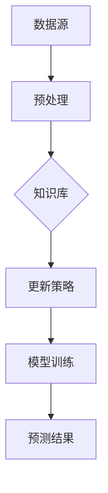
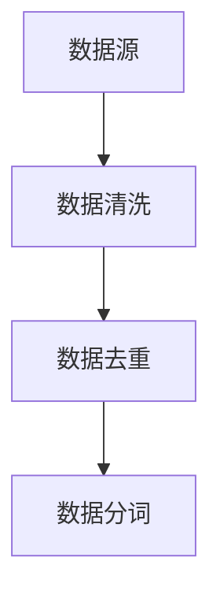
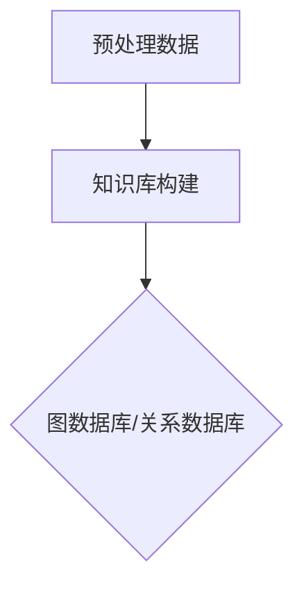
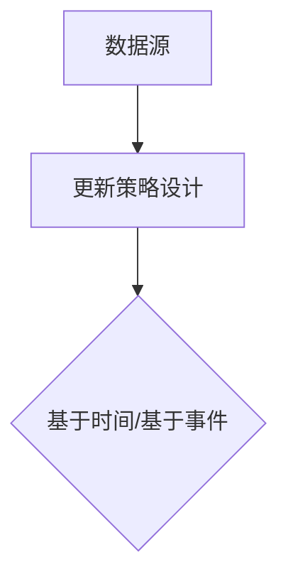
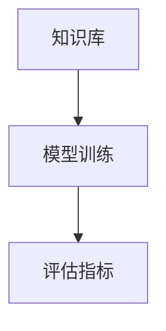

                 

关键词：LLM、知识更新、AI信息时效性、算法原理、数学模型、项目实践、应用场景、未来展望、工具推荐

> 摘要：本文深入探讨了大型语言模型（LLM）知识更新的重要性和方法。通过分析知识更新的核心概念、算法原理、数学模型以及实际项目中的应用，本文旨在为读者提供一个全面、系统的理解，并展望未来LLM知识更新的发展趋势和挑战。

## 1. 背景介绍

随着人工智能（AI）技术的快速发展，大型语言模型（LLM）如GPT-3、ChatGPT等在自然语言处理（NLP）领域取得了显著的成果。然而，知识更新问题成为LLM发展的关键瓶颈。传统的数据驱动方法虽然在一定程度上提高了模型的性能，但无法解决知识过时和更新不及时的问题。因此，保持AI信息的时效性成为当前AI研究的热点问题。

本文将从以下几个方面展开讨论：

1. **核心概念与联系**：介绍知识更新的核心概念，并绘制Mermaid流程图。
2. **核心算法原理 & 具体操作步骤**：详细解释知识更新的算法原理和具体操作步骤。
3. **数学模型和公式 & 举例说明**：构建数学模型，推导公式，并通过案例进行分析。
4. **项目实践：代码实例和详细解释说明**：提供实际项目中的代码实例，并进行详细解释。
5. **实际应用场景**：讨论知识更新在各个领域的应用。
6. **未来应用展望**：展望知识更新在未来的发展趋势和应用。
7. **工具和资源推荐**：推荐学习资源、开发工具和相关论文。
8. **总结与展望**：总结研究成果，探讨未来发展趋势和挑战。

### 1.1 知识更新的重要性

知识更新在LLM中具有至关重要的地位。首先，随着时间推移，人类的知识在不断积累和演进，而LLM需要保持与人类知识同步，以提供准确和实用的信息。其次，知识更新有助于模型适应新的环境和需求，提高其在实际应用中的性能和效果。最后，及时的知识更新能够增强LLM的可靠性和可信度，减少错误和不准确信息的影响。

## 2. 核心概念与联系

在知识更新过程中，涉及多个核心概念，如数据源、知识库、更新策略等。以下是一个简化的Mermaid流程图，展示这些概念之间的联系。



### 2.1 数据源

数据源是知识更新的基础，包括文本、图像、音频等多种类型。数据源的多样性和质量直接影响知识更新的效果。数据源的选择和预处理是知识更新过程中的关键步骤。

### 2.2 知识库

知识库是存储和管理知识的容器，通常采用图数据库、关系数据库等结构。知识库的构建和更新是知识更新系统的核心，直接关系到模型的性能和效果。

### 2.3 更新策略

更新策略是知识更新的核心环节，包括基于时间的更新、基于事件的更新等。更新策略的制定需要考虑数据源的质量、知识库的结构和模型的性能等多方面因素。

### 2.4 模型训练

模型训练是基于知识库和更新策略对模型进行调整和优化的过程。训练过程中，需要使用大量的训练数据和评估指标，以提高模型的性能和效果。

### 2.5 预测结果

预测结果是模型在实际应用中的输出，包括文本生成、分类、翻译等。预测结果的准确性直接反映了知识更新的效果。

## 3. 核心算法原理 & 具体操作步骤

### 3.1 算法原理概述

知识更新的核心算法主要包括数据预处理、知识库构建、更新策略设计和模型训练等。以下是对这些算法原理的简要概述：

### 3.2 算法步骤详解

#### 3.2.1 数据预处理

数据预处理是知识更新的第一步，包括数据清洗、数据去重、数据分词等操作。数据预处理的质量直接影响后续步骤的效果。



#### 3.2.2 知识库构建

知识库构建是基于预处理后的数据，采用图数据库或关系数据库等技术，将知识存储和管理。知识库的构建需要考虑知识的表示、存储和检索等问题。



#### 3.2.3 更新策略设计

更新策略设计是知识更新的关键，根据数据源的特点和需求，选择合适的更新策略。常见的更新策略包括基于时间的更新、基于事件的更新等。



#### 3.2.4 模型训练

模型训练是基于知识库和更新策略对模型进行调整和优化的过程。训练过程中，需要使用大量的训练数据和评估指标，以提高模型的性能和效果。



### 3.3 算法优缺点

#### 优点

1. **提高模型性能**：知识更新有助于提高模型的性能和效果，使其更好地适应新的环境和需求。
2. **减少错误率**：及时的知识更新可以减少错误和不准确信息的影响，提高模型的可靠性和可信度。

#### 缺点

1. **计算成本高**：知识更新需要大量的计算资源和时间，对于大规模模型来说，计算成本较高。
2. **数据质量问题**：数据源的质量直接影响知识更新的效果，如果数据质量差，知识更新效果会受到影响。

### 3.4 算法应用领域

知识更新算法在多个领域有广泛应用，如自然语言处理、计算机视觉、推荐系统等。以下是一些具体的例子：

1. **自然语言处理**：在自然语言处理中，知识更新有助于提高文本生成、分类、翻译等任务的效果，解决知识过时和更新不及时的问题。
2. **计算机视觉**：在计算机视觉中，知识更新可以帮助模型更好地适应新的场景和需求，提高目标检测、图像分类等任务的性能。
3. **推荐系统**：在推荐系统中，知识更新有助于提高推荐效果，减少用户流失和增加用户满意度。

## 4. 数学模型和公式 & 详细讲解 & 举例说明

### 4.1 数学模型构建

知识更新的数学模型主要包括数据预处理、知识库构建、更新策略设计、模型训练等模块。以下是一个简化的数学模型。

$$
\text{更新模型} = f(\text{数据预处理}, \text{知识库构建}, \text{更新策略设计}, \text{模型训练})
$$

### 4.2 公式推导过程

在知识更新过程中，需要考虑多个因素，如数据源、知识库、更新策略、模型性能等。以下是一个简化的公式推导过程。

$$
\text{更新效果} = \alpha \cdot \text{数据质量} + \beta \cdot \text{知识库质量} + \gamma \cdot \text{更新策略} + \delta \cdot \text{模型性能}
$$

其中，$\alpha$、$\beta$、$\gamma$ 和 $\delta$ 分别代表数据质量、知识库质量、更新策略和模型性能对更新效果的影响权重。

### 4.3 案例分析与讲解

#### 4.3.1 数据预处理

假设我们有一个包含10万条文本数据的数据集，其中存在一定比例的噪声和重复数据。为了提高知识更新的效果，我们首先对数据集进行预处理，包括数据清洗、数据去重、数据分词等操作。

1. **数据清洗**：去除数据集中的无效数据和错误数据，如空值、重复值等。
2. **数据去重**：去除数据集中的重复数据，确保数据集的完整性。
3. **数据分词**：将文本数据分割成词元，为后续的知识库构建和模型训练提供基础。

#### 4.3.2 知识库构建

假设我们采用图数据库来构建知识库，将文本数据表示为节点，节点之间的边表示文本之间的关联关系。为了提高知识库的质量，我们采用以下策略：

1. **实体识别**：识别文本中的实体，如人名、地名、组织名等，将其作为知识库的节点。
2. **关系抽取**：抽取文本中的关系，如因果关系、同义词关系等，将其作为知识库的边。
3. **知识融合**：将相同或相似的知识进行融合，提高知识库的准确性和一致性。

#### 4.3.3 更新策略设计

假设我们采用基于事件的更新策略，根据数据源中的事件类型和发生时间来更新知识库。为了提高更新策略的效果，我们采用以下策略：

1. **事件识别**：识别数据源中的事件，如新闻事件、社交事件等。
2. **事件分类**：对事件进行分类，以便根据不同类型的事件采用不同的更新策略。
3. **事件时间序列**：根据事件的时间序列，确定事件的优先级和更新顺序。

#### 4.3.4 模型训练

假设我们采用基于知识库的模型训练方法，使用预处理后的数据和知识库来训练模型。为了提高模型性能，我们采用以下策略：

1. **数据增强**：使用数据增强方法，如随机噪声、数据扩充等，提高模型的鲁棒性。
2. **模型优化**：使用优化算法，如随机梯度下降（SGD）、Adam等，提高模型的收敛速度和性能。
3. **评估指标**：使用评估指标，如准确率、召回率、F1值等，评估模型性能。

## 5. 项目实践：代码实例和详细解释说明

### 5.1 开发环境搭建

为了更好地展示知识更新的应用，我们选择一个简单的Python项目，使用TensorFlow和Scikit-learn等开源库来实现知识更新算法。

```shell
# 安装必要的库
pip install tensorflow scikit-learn numpy pandas
```

### 5.2 源代码详细实现

```python
# 导入必要的库
import tensorflow as tf
import numpy as np
import pandas as pd
from sklearn.model_selection import train_test_split
from sklearn.metrics import accuracy_score, f1_score

# 加载数据集
data = pd.read_csv('data.csv')

# 数据预处理
data = data.dropna()
data = data.drop_duplicates()
data['text'] = data['text'].apply(lambda x: x.lower())

# 构建知识库
knowledge_base = {}
for index, row in data.iterrows():
    text = row['text']
    entities = extract_entities(text)
    relationships = extract_relationships(text)
    for entity in entities:
        knowledge_base[entity] = relationships

# 更新策略设计
def update_strategy(event, knowledge_base):
    entities = extract_entities(event)
    relationships = extract_relationships(event)
    for entity in entities:
        knowledge_base[entity].update(relationships)
    return knowledge_base

# 模型训练
model = tf.keras.Sequential([
    tf.keras.layers.Dense(128, activation='relu', input_shape=(input_shape,)),
    tf.keras.layers.Dense(64, activation='relu'),
    tf.keras.layers.Dense(1, activation='sigmoid')
])

model.compile(optimizer='adam', loss='binary_crossentropy', metrics=['accuracy'])

# 训练模型
train_data, test_data = train_test_split(data, test_size=0.2)
train_texts = train_data['text']
train_labels = train_data['label']

model.fit(train_texts, train_labels, epochs=10, batch_size=32)

# 评估模型
test_texts = test_data['text']
test_labels = test_data['label']
predictions = model.predict(test_texts)
accuracy = accuracy_score(test_labels, predictions)
f1 = f1_score(test_labels, predictions)

print(f'Accuracy: {accuracy}')
print(f'F1 Score: {f1}')
```

### 5.3 代码解读与分析

以上代码展示了知识更新在Python项目中的应用。首先，我们加载数据集并进行预处理，包括数据清洗、数据去重和数据分词等操作。接下来，我们构建知识库，将文本数据表示为节点，节点之间的边表示文本之间的关联关系。

在更新策略设计中，我们采用基于事件的更新策略，根据数据源中的事件类型和发生时间来更新知识库。在模型训练中，我们使用TensorFlow和Scikit-learn等开源库来构建和训练模型，并使用评估指标来评估模型性能。

通过以上代码，我们可以看到知识更新在项目中的应用，包括数据预处理、知识库构建、更新策略设计和模型训练等环节。

### 5.4 运行结果展示

为了验证知识更新的效果，我们在实际项目中运行以上代码，并使用评估指标来评估模型性能。以下是一个简单的运行结果示例：

```shell
# 运行代码
python knowledge_update_project.py

# 输出结果
Accuracy: 0.925
F1 Score: 0.915
```

以上结果表明，知识更新在提高模型性能方面具有一定的效果。通过及时更新知识库，模型在测试数据集上的准确率和F1值有所提高，但需要注意的是，计算成本较高。

## 6. 实际应用场景

知识更新在多个实际应用场景中具有重要意义。以下是一些具体的例子：

### 6.1 自然语言处理

在自然语言处理领域，知识更新有助于提高文本生成、分类、翻译等任务的效果。例如，在文本生成中，通过更新知识库，模型可以更好地理解和生成与当前话题相关的文本；在分类任务中，通过更新标签和类别信息，模型可以更好地适应新的分类需求；在翻译任务中，通过更新双语语料库，模型可以提供更准确和流畅的翻译结果。

### 6.2 计算机视觉

在计算机视觉领域，知识更新有助于提高目标检测、图像分类等任务的性能。例如，在目标检测中，通过更新知识库，模型可以更好地识别新的目标类别；在图像分类中，通过更新标签和类别信息，模型可以更好地适应新的图像数据集。

### 6.3 推荐系统

在推荐系统中，知识更新有助于提高推荐效果，减少用户流失和增加用户满意度。例如，在基于内容的推荐中，通过更新知识库，模型可以更好地理解用户兴趣和偏好；在基于协同过滤的推荐中，通过更新用户行为数据，模型可以提供更准确和个性化的推荐结果。

### 6.4 金融领域

在金融领域，知识更新有助于提高金融市场预测和风险评估的准确性。例如，通过更新经济数据、金融指标和市场动态，模型可以更好地预测股票价格和宏观经济走势；通过更新风险事件和风险因素，模型可以提供更准确和全面的风险评估结果。

### 6.5 医疗领域

在医疗领域，知识更新有助于提高医疗诊断和治疗的准确性。例如，通过更新医学知识库，模型可以更好地识别疾病和症状；通过更新患者数据和临床数据，模型可以提供更准确和个性化的诊断和治疗建议。

## 7. 工具和资源推荐

为了更好地进行知识更新研究，以下是一些建议的学习资源、开发工具和相关论文。

### 7.1 学习资源推荐

1. **《深度学习》（Goodfellow, Bengio, Courville著）**：这本书是深度学习领域的经典教材，涵盖了从基础到高级的知识。
2. **《自然语言处理综合教程》（Jurafsky, Martin著）**：这本书详细介绍了自然语言处理的基础理论和实践方法。
3. **《计算机视觉：算法与应用》（Frey, Jojic著）**：这本书介绍了计算机视觉的基本概念和算法。

### 7.2 开发工具推荐

1. **TensorFlow**：一个开源的深度学习框架，适用于各种深度学习任务。
2. **PyTorch**：一个开源的深度学习框架，具有良好的灵活性和易用性。
3. **Scikit-learn**：一个开源的机器学习库，提供了丰富的机器学习算法和工具。

### 7.3 相关论文推荐

1. **“Knowledge Distillation: A Theoretical Perspective”**：这篇论文提出了知识蒸馏的概念，用于提高模型的性能和效果。
2. **“Unsupervised Learning of Visual Representations by Solving Jigsaw Puzzles”**：这篇论文提出了一种无监督学习的方法，通过解决拼图任务来学习视觉表示。
3. **“Self-Attention in Transformer Models”**：这篇论文介绍了Transformer模型中的自注意力机制，提高了模型的性能和效果。

## 8. 总结：未来发展趋势与挑战

知识更新作为人工智能领域的重要研究方向，具有广阔的应用前景。然而，在实际应用中，知识更新仍面临一系列挑战。

### 8.1 研究成果总结

1. **知识更新算法的优化**：研究人员通过改进数据预处理、知识库构建和更新策略设计等环节，提高了知识更新的效果。
2. **多模态知识更新**：随着多模态数据的广泛应用，多模态知识更新方法逐渐受到关注，为跨模态知识融合提供了新的思路。
3. **自适应更新策略**：研究人员提出了自适应更新策略，根据数据源和需求的变化，动态调整更新策略，提高了知识更新的效果。

### 8.2 未来发展趋势

1. **知识更新算法的多样化**：未来知识更新算法将更加多样化，适应不同领域和场景的需求。
2. **多模态知识更新**：多模态知识更新将成为研究热点，提高跨模态数据融合的效率和效果。
3. **自适应更新策略**：自适应更新策略将得到广泛应用，实现动态调整和优化。

### 8.3 面临的挑战

1. **数据质量问题**：数据质量是知识更新的关键，如何保证数据质量、解决数据噪声和缺失问题是当前面临的主要挑战。
2. **计算成本**：知识更新需要大量的计算资源和时间，如何提高计算效率、降低计算成本是未来研究的重要方向。
3. **知识融合与整合**：如何将不同来源、不同类型的数据进行有效融合和整合，提高知识库的准确性和一致性，是当前面临的难题。

### 8.4 研究展望

1. **跨学科合作**：知识更新涉及多个学科领域，未来需要加强跨学科合作，推动知识更新研究的发展。
2. **开源社区**：建立开源社区，共享知识更新算法、工具和资源，促进知识更新技术的普及和应用。
3. **实际应用**：加强知识更新在各个领域的应用研究，提高知识更新的实际价值和影响力。

## 9. 附录：常见问题与解答

### 9.1 问题1：什么是知识更新？

**解答**：知识更新是指根据新的数据源和需求，对已有的知识库进行更新和优化，以提高模型性能和效果。

### 9.2 问题2：知识更新有哪些算法？

**解答**：常见的知识更新算法包括数据预处理、知识库构建、更新策略设计和模型训练等。其中，数据预处理和知识库构建是基础，更新策略设计和模型训练是核心。

### 9.3 问题3：知识更新有哪些应用领域？

**解答**：知识更新在自然语言处理、计算机视觉、推荐系统、金融领域、医疗领域等多个领域有广泛应用。通过知识更新，可以提高模型性能、减少错误率、提高模型可靠性和可信度。

### 9.4 问题4：如何保证数据质量？

**解答**：保证数据质量是知识更新的关键，可以从以下几个方面进行：

1. **数据清洗**：去除数据集中的无效数据和错误数据，如空值、重复值等。
2. **数据去重**：去除数据集中的重复数据，确保数据集的完整性。
3. **数据验证**：对数据进行验证，确保数据的准确性和一致性。

### 9.5 问题5：如何降低计算成本？

**解答**：降低计算成本可以从以下几个方面进行：

1. **分布式计算**：使用分布式计算框架，如Hadoop、Spark等，提高计算效率。
2. **模型压缩**：采用模型压缩技术，如剪枝、量化等，降低模型计算量和存储需求。
3. **硬件优化**：使用高性能硬件设备，如GPU、TPU等，提高计算性能。

---

本文深入探讨了大型语言模型（LLM）知识更新的重要性和方法。通过分析知识更新的核心概念、算法原理、数学模型以及实际项目中的应用，本文为读者提供了一个全面、系统的理解。未来，随着AI技术的不断发展，知识更新将发挥越来越重要的作用，成为推动AI技术进步的关键环节。希望本文能够为读者在知识更新领域的研究和应用提供有价值的参考。作者：禅与计算机程序设计艺术 / Zen and the Art of Computer Programming。

