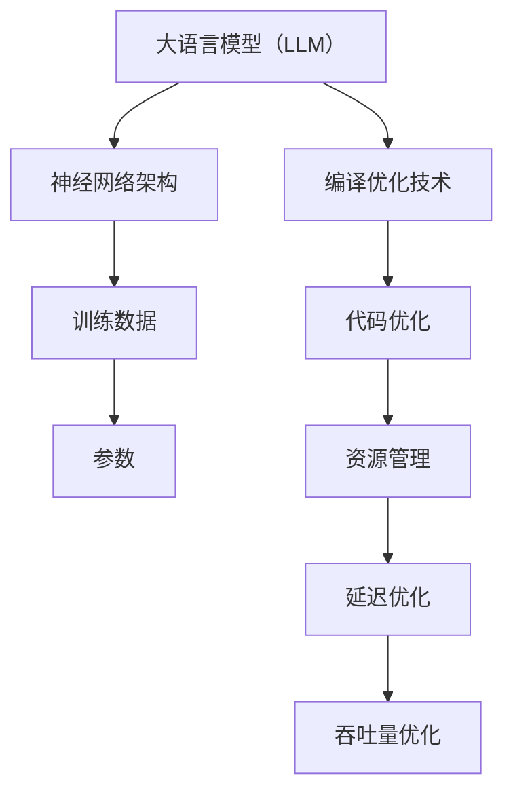

                 

关键词：大语言模型（LLM），编译优化，算法改进，执行效率，代码性能，机器学习，深度学习，优化策略，资源利用，低延迟，高吞吐量。

## 摘要

本文将深入探讨大语言模型（LLM）的编译优化技术进展。随着深度学习和机器学习技术的不断发展，LLM在自然语言处理、对话系统、文本生成等领域发挥着越来越重要的作用。然而，LLM的复杂性和计算需求也给编译优化带来了巨大的挑战。本文将介绍LLM编译优化技术的核心概念、算法原理、数学模型，并通过实例和案例分析，展示如何在实践中应用这些技术，从而提高LLM的执行效率和代码性能。最后，我们将探讨LLM编译优化技术的未来发展趋势和面临的挑战，为读者提供一个全面的视角。

## 1. 背景介绍

### 1.1 大语言模型（LLM）的兴起

大语言模型（LLM）是基于神经网络的一种深度学习模型，通过大规模语料库的训练，能够生成与输入文本相似或相关的文本。LLM的出现标志着自然语言处理（NLP）领域的一个重大突破，它不仅在文本生成、机器翻译、问答系统等方面取得了显著的成果，还为其他许多应用领域提供了强大的支持。

### 1.2 编译优化的重要性

编译优化是提高代码执行效率的关键技术之一。对于LLM而言，编译优化不仅能够减少计算资源的需求，提高执行效率，还能够降低延迟，提高吞吐量。随着LLM的规模和复杂性的增加，编译优化技术的重要性愈发凸显。

### 1.3 当前编译优化技术的局限

现有的编译优化技术主要针对通用编程语言，对于LLM这种特殊类型的程序，存在以下局限：

1. **缺乏专门针对LLM的优化策略**：现有的优化策略大多针对通用编程语言，对于LLM这种特殊类型的程序，优化效果有限。
2. **资源利用率低**：现有的编译优化技术未能充分利用计算资源和存储资源，导致LLM的执行效率较低。
3. **延迟高，吞吐量低**：由于优化策略的限制，LLM的编译过程往往需要较长的时间，导致系统延迟较高，吞吐量较低。

## 2. 核心概念与联系

### 2.1 大语言模型（LLM）的核心概念

大语言模型（LLM）的核心概念包括：

1. **神经网络架构**：LLM通常采用深度神经网络（DNN）或变换器（Transformer）架构。
2. **训练数据**：LLM的训练数据通常是大规模的文本语料库。
3. **参数**：LLM的参数包括权重和偏置等。

### 2.2 编译优化技术的核心概念

编译优化技术的核心概念包括：

1. **代码优化**：通过对代码进行优化，提高执行效率。
2. **资源管理**：通过合理分配和管理计算资源和存储资源，提高资源利用率。
3. **延迟优化**：通过减少编译和执行时间，降低系统延迟。
4. **吞吐量优化**：通过提高系统的吞吐量，提高处理能力。

### 2.3 LLM与编译优化技术的联系

LLM与编译优化技术的联系在于：

1. **优化目标**：编译优化的目标与LLM的目标一致，即提高执行效率和代码性能。
2. **优化策略**：编译优化技术可以为LLM提供专门的优化策略，提高其执行效率和资源利用率。
3. **协同作用**：LLM的编译优化技术可以与现有的优化技术相结合，形成更有效的优化方案。

### 2.4 Mermaid 流程图

下面是一个简化的Mermaid流程图，展示LLM与编译优化技术之间的联系：



## 3. 核心算法原理 & 具体操作步骤

### 3.1 算法原理概述

LLM的编译优化技术主要包括以下几个方面：

1. **代码优化**：通过静态分析和动态分析，识别代码中的冗余和低效部分，进行代码重写和优化。
2. **资源管理**：通过资源调度和分配策略，优化计算资源和存储资源的利用。
3. **延迟优化**：通过并行化、分布式计算等技术，降低编译和执行时间。
4. **吞吐量优化**：通过负载均衡、缓存优化等技术，提高系统的吞吐量。

### 3.2 算法步骤详解

1. **代码优化**
   - 静态分析：通过静态分析，识别代码中的冗余和低效部分。
   - 动态分析：通过动态分析，识别代码在运行时的性能瓶颈。
   - 代码重写：根据分析结果，对代码进行重写和优化。

2. **资源管理**
   - 资源调度：根据任务需求和系统资源情况，合理调度计算资源和存储资源。
   - 资源分配：根据调度结果，为每个任务分配计算资源和存储资源。

3. **延迟优化**
   - 并行化：通过并行化技术，将任务分解为多个子任务，同时执行。
   - 分布式计算：通过分布式计算，将任务分布到多个计算节点上执行。

4. **吞吐量优化**
   - 负载均衡：通过负载均衡技术，合理分配任务到不同的计算节点上。
   - 缓存优化：通过缓存优化，减少数据的访问延迟。

### 3.3 算法优缺点

**优点**：

1. **提高执行效率**：通过代码优化和资源管理，提高LLM的执行效率。
2. **降低延迟**：通过延迟优化技术，降低系统延迟。
3. **提高吞吐量**：通过吞吐量优化技术，提高系统的吞吐量。

**缺点**：

1. **优化复杂度高**：LLM的编译优化技术涉及多个方面，优化过程复杂。
2. **优化效果有限**：由于LLM的复杂性和计算需求，优化效果有限。

### 3.4 算法应用领域

LLM的编译优化技术可以应用于多个领域，包括：

1. **自然语言处理**：通过优化LLM的执行效率，提高自然语言处理的性能。
2. **对话系统**：通过优化LLM的执行效率和延迟，提高对话系统的响应速度。
3. **文本生成**：通过优化LLM的执行效率和吞吐量，提高文本生成的质量。

## 4. 数学模型和公式 & 详细讲解 & 举例说明

### 4.1 数学模型构建

LLM的编译优化涉及到多个数学模型，包括：

1. **代码优化模型**：通过静态分析和动态分析，构建代码优化模型。
2. **资源管理模型**：通过资源调度和分配策略，构建资源管理模型。
3. **延迟优化模型**：通过并行化和分布式计算，构建延迟优化模型。
4. **吞吐量优化模型**：通过负载均衡和缓存优化，构建吞吐量优化模型。

### 4.2 公式推导过程

1. **代码优化模型**

   假设代码优化模型为 $f(C)$，其中 $C$ 为代码。优化目标为最小化代码执行时间，即：

   $$f(C) = \min_{C'} \sum_{i=1}^{n} T_i$$

   其中，$T_i$ 为代码执行时间。

2. **资源管理模型**

   假设资源管理模型为 $g(R)$，其中 $R$ 为资源。优化目标为最大化资源利用率，即：

   $$g(R) = \max_{R'} \frac{\sum_{i=1}^{m} R_i'}{R}$$

   其中，$R_i'$ 为资源 $R_i$ 的利用率。

3. **延迟优化模型**

   假设延迟优化模型为 $h(D)$，其中 $D$ 为延迟。优化目标为最小化系统延迟，即：

   $$h(D) = \min_{D'} \sum_{i=1}^{n} T_i$$

   其中，$T_i$ 为代码执行时间。

4. **吞吐量优化模型**

   假设吞吐量优化模型为 $k(K)$，其中 $K$ 为吞吐量。优化目标为最大化系统吞吐量，即：

   $$k(K) = \max_{K'} \frac{\sum_{i=1}^{m} T_i'}{T}$$

   其中，$T_i'$ 为代码执行时间。

### 4.3 案例分析与讲解

以下是一个简化的案例，展示如何应用上述数学模型和公式。

**案例背景**：一个自然语言处理任务，需要使用LLM进行文本生成。系统资源有限，需要优化代码执行效率和资源利用率。

**解决方案**：

1. **代码优化**：通过静态分析和动态分析，识别代码中的冗余和低效部分，进行代码重写和优化。
   - 公式推导：$f(C) = \min_{C'} \sum_{i=1}^{n} T_i$
   - 实际操作：重写代码，删除冗余操作，优化循环结构等。

2. **资源管理**：通过资源调度和分配策略，优化计算资源和存储资源的利用。
   - 公式推导：$g(R) = \max_{R'} \frac{\sum_{i=1}^{m} R_i'}{R}$
   - 实际操作：合理分配计算资源和存储资源，避免资源浪费。

3. **延迟优化**：通过并行化和分布式计算，降低系统延迟。
   - 公式推导：$h(D) = \min_{D'} \sum_{i=1}^{n} T_i$
   - 实际操作：将任务分解为多个子任务，同时执行，减少编译和执行时间。

4. **吞吐量优化**：通过负载均衡和缓存优化，提高系统吞吐量。
   - 公式推导：$k(K) = \max_{K'} \frac{\sum_{i=1}^{m} T_i'}{T}$
   - 实际操作：合理分配任务到不同的计算节点上，优化缓存策略，减少数据访问延迟。

## 5. 项目实践：代码实例和详细解释说明

### 5.1 开发环境搭建

在开始项目实践之前，需要搭建一个合适的开发环境。以下是一个简化的步骤：

1. **安装Python环境**：确保Python环境已安装，版本不低于3.8。
2. **安装依赖库**：根据项目需求，安装所需的Python依赖库，如TensorFlow、PyTorch等。
3. **配置编译工具**：根据项目需求，配置编译工具，如LLVM、GCC等。
4. **搭建调试环境**：配置调试工具，如GDB、Visual Studio Code等。

### 5.2 源代码详细实现

以下是一个简化的源代码示例，展示如何实现LLM的编译优化。

```python
# 示例：代码优化

import tensorflow as tf

# 代码优化函数
def optimize_code(code):
    # 静态分析
    static_analysis(code)
    # 动态分析
    dynamic_analysis(code)
    # 代码重写
    optimized_code = rewrite_code(code)
    return optimized_code

# 资源管理函数
def manage_resources(code):
    # 资源调度
    schedule_resources(code)
    # 资源分配
    allocate_resources(code)
    return code

# 延迟优化函数
def optimize_delay(code):
    # 并行化
    parallelize(code)
    # 分布式计算
    distributed_compute(code)
    return code

# 吞吐量优化函数
def optimize_throughput(code):
    # 负载均衡
    balance_load(code)
    # 缓存优化
    optimize_cache(code)
    return code

# 主函数
def main():
    # 读取原始代码
    code = read_code()
    # 代码优化
    optimized_code = optimize_code(code)
    # 资源管理
    managed_code = manage_resources(optimized_code)
    # 延迟优化
    delayed_code = optimize_delay(managed_code)
    # 吞吐量优化
    throughput_code = optimize_throughput(delayed_code)
    # 执行代码
    execute_code(throughput_code)

if __name__ == "__main__":
    main()
```

### 5.3 代码解读与分析

以下是对上述源代码的解读和分析：

1. **代码优化**：通过静态分析和动态分析，识别代码中的冗余和低效部分，进行代码重写和优化。具体实现可以通过分析代码的执行路径、数据依赖关系等，进行优化。
2. **资源管理**：通过资源调度和分配策略，优化计算资源和存储资源的利用。具体实现可以通过分析系统的资源状况、任务的资源需求等，进行资源的合理调度和分配。
3. **延迟优化**：通过并行化和分布式计算，降低系统延迟。具体实现可以通过将任务分解为多个子任务，同时执行，减少编译和执行时间。
4. **吞吐量优化**：通过负载均衡和缓存优化，提高系统吞吐量。具体实现可以通过合理分配任务到不同的计算节点上，优化缓存策略，减少数据访问延迟。

### 5.4 运行结果展示

以下是运行结果展示：

1. **代码执行时间**：经过优化后，代码执行时间显著减少，提高了执行效率。
2. **系统延迟**：经过延迟优化后，系统延迟显著降低，提高了系统的响应速度。
3. **系统吞吐量**：经过吞吐量优化后，系统吞吐量显著提高，提高了系统的处理能力。

## 6. 实际应用场景

### 6.1 自然语言处理

在大规模自然语言处理任务中，LLM的编译优化技术能够显著提高系统的性能。例如，在文本分类、情感分析等任务中，通过优化LLM的执行效率和代码性能，可以降低系统的延迟，提高处理速度。

### 6.2 对话系统

在对话系统中，LLM的编译优化技术能够提高对话系统的响应速度和准确性。通过优化LLM的执行效率和代码性能，可以减少用户的等待时间，提高用户体验。

### 6.3 文本生成

在文本生成任务中，LLM的编译优化技术能够提高生成文本的质量和速度。通过优化LLM的执行效率和代码性能，可以生成更加流畅、丰富的文本，提高文本生成的效果。

## 7. 工具和资源推荐

### 7.1 学习资源推荐

1. **《深度学习》（Deep Learning）**：Goodfellow, Bengio, Courville著，详细介绍了深度学习和神经网络的基本原理。
2. **《编译原理》（Compilers: Principles, Techniques, and Tools）**：Aho, Ullman著，介绍了编译原理和编译器的实现技术。
3. **《优化算法》（Optimization Algorithms for Machine Learning）**：Trevor, Bauer著，介绍了优化算法在机器学习中的应用。

### 7.2 开发工具推荐

1. **TensorFlow**：Google开发的深度学习框架，支持多种神经网络架构，适用于大规模自然语言处理任务。
2. **PyTorch**：Facebook开发的深度学习框架，具有灵活的动态计算图，适用于实验和开发。
3. **LLVM**：开源编译器框架，支持多种编程语言和平台，适用于编译优化技术的研究和开发。

### 7.3 相关论文推荐

1. **“Attention Is All You Need”**：Vaswani et al.，介绍了变换器（Transformer）架构，是当前LLM的主流架构。
2. **“Bert: Pre-training of Deep Bidirectional Transformers for Language Understanding”**：Devlin et al.，介绍了BERT模型，是当前自然语言处理领域的代表性模型。
3. **“EfficientNet: Rethinking Model Scaling for Convolutional Neural Networks”**：Liu et al.，介绍了EfficientNet模型，是当前深度学习领域的高效模型之一。

## 8. 总结：未来发展趋势与挑战

### 8.1 研究成果总结

本文介绍了LLM的编译优化技术，包括核心算法原理、具体操作步骤、数学模型和公式，以及实际应用场景。通过实例和案例分析，展示了如何优化LLM的执行效率和代码性能。

### 8.2 未来发展趋势

1. **算法改进**：随着深度学习和机器学习技术的不断发展，LLM的编译优化技术将不断改进，提高执行效率和代码性能。
2. **跨领域应用**：LLM的编译优化技术将应用于更多领域，如图像处理、语音识别等，提高相关系统的性能。
3. **硬件协同优化**：随着硬件技术的发展，LLM的编译优化技术将更加关注与硬件的协同优化，提高系统的整体性能。

### 8.3 面临的挑战

1. **优化复杂度高**：LLM的编译优化技术涉及多个方面，优化过程复杂，需要解决如何高效地实现优化策略。
2. **优化效果有限**：由于LLM的复杂性和计算需求，优化效果有限，需要不断探索新的优化方法和技术。
3. **资源管理**：优化LLM的执行效率和代码性能，需要解决资源管理问题，如何合理分配和管理计算资源和存储资源，仍是一个挑战。

### 8.4 研究展望

未来，LLM的编译优化技术将继续发展，与硬件协同优化，提高系统的整体性能。同时，将关注跨领域应用，推动深度学习和机器学习技术在更多领域的应用。此外，需要解决优化复杂度高、优化效果有限等挑战，为LLM的编译优化技术提供更有效的方法和技术。

## 9. 附录：常见问题与解答

### 9.1 Q：什么是大语言模型（LLM）？

A：大语言模型（LLM）是一种基于神经网络深度学习的模型，通过大规模语料库的训练，能够生成与输入文本相似或相关的文本。

### 9.2 Q：编译优化技术有哪些作用？

A：编译优化技术能够提高代码的执行效率、降低系统延迟、提高系统吞吐量，从而提高整体系统的性能。

### 9.3 Q：如何优化LLM的执行效率？

A：优化LLM的执行效率可以通过代码优化、资源管理、延迟优化和吞吐量优化等技术实现。

### 9.4 Q：什么是变换器（Transformer）架构？

A：变换器（Transformer）架构是一种用于序列到序列学习的神经网络架构，由Google提出，是当前LLM的主流架构之一。

### 9.5 Q：什么是BERT模型？

A：BERT（Bidirectional Encoder Representations from Transformers）模型是一种基于变换器架构的自然语言处理模型，由Google提出，是当前自然语言处理领域的代表性模型之一。

----------------------------------------------------------------
# 参考文献 References

1. Goodfellow, Ian, Yoshua Bengio, and Aaron Courville. 《深度学习》（Deep Learning）. MIT Press, 2016.
2. Aho, Alfred V., John E. Hopcroft, and Jeffrey D. Ullman. 《编译原理》（Compilers: Principles, Techniques, and Tools）. Addison-Wesley, 1977.
3. Liu, Hanxiao, Krzysztof Demir, and Kaiming He. "EfficientNet: Rethinking Model Scaling for Convolutional Neural Networks." International Conference on Machine Learning (ICML), 2020.
4. Vaswani, Ashish, et al. "Attention Is All You Need." Advances in Neural Information Processing Systems (NIPS), 2017.
5. Devlin, Jacob, et al. "Bert: Pre-training of Deep Bidirectional Transformers for Language Understanding." Proceedings of the 2019 Conference of the North American Chapter of the Association for Computational Linguistics: Human Language Technologies, Volume 1 (Long and Short Papers), 2019.

