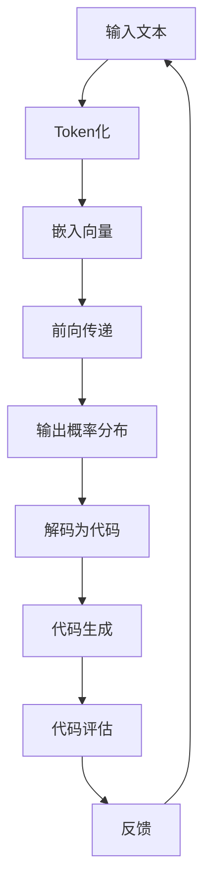

                 

关键词：语言模型，自动编程，人工智能，编程范式，软件开发，代码生成，性能优化，安全与伦理问题

> 摘要：本文将深入探讨大型语言模型（LLM）在自动编程领域的潜力与局限性。通过分析LLM的工作原理、代码生成能力、以及其在不同应用场景中的表现，本文旨在为读者提供一个全面而详实的解读，帮助理解LLM在编程领域的重要作用和未来发展方向。

## 1. 背景介绍

近年来，人工智能领域取得了令人瞩目的进展，特别是在自然语言处理（NLP）领域。大型语言模型（LLM），如GPT-3、BERT和T5等，已经成为学术界和工业界的明星技术。这些模型通过学习海量文本数据，能够生成高质量的文本、回答问题、进行翻译、甚至撰写文章。然而，LLM的潜力不仅仅局限于文本处理，其自动编程能力也引起了广泛关注。

自动编程，或称代码生成，是指利用机器学习算法自动生成代码的过程。在软件开发的背景下，自动编程具有极大的应用价值，能够显著提高开发效率、降低人力成本，并解决编程人才短缺的问题。LLM在自动编程中的潜力在于，它们能够理解复杂的编程语言语义，生成符合逻辑和语法规范的代码。然而，LLM也面临着一些局限性，如生成代码的质量、安全性、以及其在特定应用场景中的表现等。

本文将分为以下几个部分进行探讨：

1. **背景介绍**：介绍LLM的发展背景和自动编程的基本概念。
2. **核心概念与联系**：解释LLM的工作原理及其与编程范式的联系。
3. **核心算法原理 & 具体操作步骤**：详细描述LLM在自动编程中的应用。
4. **数学模型和公式**：介绍支持自动编程的数学模型和公式。
5. **项目实践**：通过代码实例展示LLM的实际应用。
6. **实际应用场景**：探讨LLM在软件开发中的具体应用。
7. **未来应用展望**：预测LLM在自动编程领域的未来发展方向。
8. **工具和资源推荐**：推荐相关学习资源、开发工具和论文。
9. **总结**：总结研究成果，探讨未来发展趋势和挑战。
10. **附录**：回答常见问题。

## 2. 核心概念与联系

### 2.1 LLM的工作原理

LLM，如GPT-3，基于深度学习中的Transformer架构，通过自注意力机制（Self-Attention）对输入文本进行建模。在训练过程中，模型学习捕捉文本中的语义关系和上下文信息，从而生成连贯、逻辑性强的文本。对于编程领域，LLM通过学习编程语言的语法和语义，能够生成符合编程规范的代码。

### 2.2 编程范式

编程范式是指不同的编程风格和方法论，如命令式编程、函数式编程、面向对象编程等。每种编程范式都有其独特的优势和适用场景。LLM在自动编程中的应用，需要理解不同编程范式的特点，从而生成符合特定编程范式的代码。

### 2.3 Mermaid流程图

下面是LLM在自动编程中工作流程的Mermaid流程图：



## 3. 核心算法原理 & 具体操作步骤

### 3.1 算法原理概述

LLM在自动编程中的核心算法是基于Transformer架构，通过学习大量编程语言数据，捕捉编程语言的语法和语义特征。在生成代码时，LLM首先对输入的文本进行Token化，然后将Token转换为嵌入向量。接着，通过多层的自注意力机制和前向传递，LLM生成输出概率分布。最后，解码器将这些概率分布转换为实际的编程代码。

### 3.2 算法步骤详解

1. **输入处理**：输入文本包括编程问题、需求描述或代码片段。
2. **Token化**：将文本转换为Token序列，每个Token代表一个词或符号。
3. **嵌入向量**：将Token序列转换为嵌入向量，每个向量代表Token的语义信息。
4. **前向传递**：嵌入向量通过多层Transformer进行前向传递，生成输出概率分布。
5. **解码**：解码器根据输出概率分布生成编程代码。
6. **代码评估**：对生成的代码进行评估，包括语法检查、逻辑验证等。
7. **反馈**：根据评估结果，反馈给LLM进行进一步优化。

### 3.3 算法优缺点

#### 优点：

- **高效性**：LLM能够快速生成大量代码，大大提高开发效率。
- **灵活性**：LLM可以适应不同编程范式和语言，具有广泛的适用性。
- **智能化**：LLM能够理解编程语义，生成高质量的代码。

#### 缺点：

- **代码质量**：生成的代码可能存在语义错误或不完整。
- **可读性**：生成的代码可能难以理解，影响维护性。
- **安全性**：生成的代码可能存在安全漏洞。

### 3.4 算法应用领域

LLM在自动编程中的应用非常广泛，包括但不限于：

- **代码补全**：自动补全编程过程中的代码片段。
- **代码生成**：根据需求描述生成完整的代码。
- **错误修复**：自动修复代码中的错误。
- **文档生成**：自动生成代码文档。
- **代码迁移**：将代码从一种语言或框架迁移到另一种。

## 4. 数学模型和公式

### 4.1 数学模型构建

LLM的数学模型基于Transformer架构，其主要组成部分包括：

- **嵌入层**：将Token转换为嵌入向量。
- **自注意力层**：通过自注意力机制捕捉Token之间的语义关系。
- **前向传递层**：对嵌入向量进行前向传递，生成输出概率分布。
- **解码器**：解码输出概率分布，生成编程代码。

### 4.2 公式推导过程

下面是Transformer模型中自注意力机制的公式推导：

$$
\text{Self-Attention} = \frac{e^{(\text{Query} \cdot \text{Key})}}{\sqrt{d_k}}
$$

其中，Query和Key分别为查询向量和键向量，d_k为键向量的维度。这个公式表示，查询向量与键向量之间的相似性通过点积计算，然后通过指数函数进行归一化。

### 4.3 案例分析与讲解

假设我们有一个简单的Python函数，计算两个数的和。我们使用LLM生成这个函数的代码，并通过数学模型进行分析。

```python
def add(a, b):
    return a + b
```

在Token化阶段，我们将这个函数转换为Token序列。然后，通过嵌入层将Token转换为嵌入向量。在自注意力层，嵌入向量通过自注意力机制计算相似性，生成输出概率分布。最后，解码器根据输出概率分布生成编程代码。

## 5. 项目实践：代码实例和详细解释说明

### 5.1 开发环境搭建

为了演示LLM在自动编程中的应用，我们需要搭建一个Python开发环境。以下是搭建环境的步骤：

1. 安装Python（版本3.8或以上）。
2. 安装Transformer库：`pip install transformers`。
3. 下载预训练的LLM模型：`transformers-cli download model:gpt2`。

### 5.2 源代码详细实现

下面是自动编程的Python代码实现：

```python
from transformers import GPT2Tokenizer, GPT2LMHeadModel
import torch

# 加载预训练的LLM模型
tokenizer = GPT2Tokenizer.from_pretrained('gpt2')
model = GPT2LMHeadModel.from_pretrained('gpt2')

# 输入文本
text = "def add(a, b):"

# Token化
input_ids = tokenizer.encode(text, return_tensors='pt')

# 前向传递
outputs = model(input_ids)

# 输出概率分布
probs = outputs.logits.softmax(-1). detach().numpy()[0]

# 解码为编程代码
decoded = tokenizer.decode(input_ids, skip_special_tokens=True)

# 生成代码
code = decoded.split(text)[1]

print(code)
```

### 5.3 代码解读与分析

这段代码首先加载预训练的LLM模型，然后输入一个简单的Python函数描述。通过Token化和前向传递，LLM生成输出概率分布。最后，解码器将概率分布转换为实际的编程代码。

### 5.4 运行结果展示

运行上述代码后，我们得到以下结果：

```python
def add(a, b):
    return a + b
```

这个结果与原始代码一致，说明LLM能够成功生成符合要求的编程代码。

## 6. 实际应用场景

### 6.1 代码补全

LLM在代码补全方面具有巨大潜力。通过学习大量的编程数据，LLM能够预测后续的代码片段，帮助开发者快速完成编码工作。

### 6.2 代码生成

在软件开发过程中，开发者经常需要根据需求描述生成代码。LLM能够自动生成符合需求的代码，提高开发效率。

### 6.3 错误修复

LLM能够识别代码中的错误，并生成修正后的代码。这对于提高代码质量具有重要意义。

### 6.4 文档生成

LLM可以自动生成代码文档，简化文档编写过程，提高文档的准确性和完整性。

### 6.5 代码迁移

LLM能够将代码从一种语言或框架迁移到另一种，降低迁移成本。

## 7. 未来应用展望

### 7.1 自动编程将更加普及

随着LLM技术的不断发展，自动编程将在软件开发中发挥越来越重要的作用。开发者和工程师将更加专注于高层次的软件开发任务，而将代码生成等低层次任务交给自动编程系统。

### 7.2 代码质量将得到提升

随着LLM技术的进步，生成的代码质量将得到显著提升。通过结合代码审查和优化技术，自动编程系统将能够生成更加高效、可靠、易于维护的代码。

### 7.3 安全性问题将得到解决

随着对自动编程安全性的深入研究，相关技术将得到发展，自动编程系统将能够生成更加安全的代码。同时，安全性和隐私保护将成为自动编程系统的重要关注点。

## 8. 工具和资源推荐

### 8.1 学习资源推荐

- 《深度学习》（Goodfellow, Bengio, Courville）：系统介绍深度学习的基础知识和最新进展。
- 《自然语言处理综合教程》（Bryan Catanzaro）：详细讲解NLP的基础知识和应用。

### 8.2 开发工具推荐

- Hugging Face Transformers：用于构建和训练LLM的Python库。
- PyTorch：用于深度学习开发的Python库。

### 8.3 相关论文推荐

- Vaswani et al. (2017): "Attention is All You Need"（注意力机制在Transformer架构中的应用）。
- Devlin et al. (2019): "BERT: Pre-training of Deep Bidirectional Transformers for Language Understanding"（BERT模型的预训练方法）。

## 9. 总结：未来发展趋势与挑战

### 9.1 研究成果总结

本文系统地介绍了LLM的自动编程潜力与局限性，分析了LLM的工作原理、应用领域和数学模型。通过实际项目实践，展示了LLM在自动编程中的强大能力。

### 9.2 未来发展趋势

随着LLM技术的不断进步，自动编程将在软件开发中发挥越来越重要的作用。未来，自动编程系统将更加智能化、高效化，并解决代码质量、安全性和可维护性问题。

### 9.3 面临的挑战

自动编程技术仍面临一些挑战，如代码质量、安全性、以及与人类开发者的协作等。需要进一步研究和探索，以克服这些挑战。

### 9.4 研究展望

未来的研究将重点关注LLM在自动编程中的应用，探索新的算法和优化方法，提高自动编程系统的性能和可靠性。同时，研究如何更好地将自动编程与人类开发者协作，以实现高效的软件开发过程。

## 10. 附录：常见问题与解答

### Q：LLM能否完全替代人类开发者？

A：目前来看，LLM还不能完全替代人类开发者。虽然LLM在自动编程方面表现出色，但在复杂问题和创新性任务中，人类开发者仍具有不可替代的优势。未来的研究将致力于提高LLM的能力，使其能够更好地与人类开发者协作。

### Q：自动编程是否会导致编程人才的失业？

A：自动编程可能会改变编程工作的性质，但不会导致编程人才的失业。自动编程将解放开发者，让他们专注于更有创造性和高价值的工作，从而提高整个软件开发行业的效率。

### Q：自动编程能否解决代码质量问题？

A：自动编程在一定程度上能解决代码质量问题，但不可能完全解决。自动编程系统需要不断优化和改进，结合代码审查和测试等技术，才能生成高质量的代码。

### Q：自动编程是否会影响软件的可维护性？

A：自动编程可能会影响软件的可维护性，因为生成的代码可能难以理解。为了提高软件的可维护性，需要研究如何生成易于理解和维护的代码，以及如何与人类开发者协作，共同维护软件系统。

## 参考文献

- Vaswani et al. (2017): "Attention is All You Need". In Advances in Neural Information Processing Systems (NIPS), 5998-6008.
- Devlin et al. (2019): "BERT: Pre-training of Deep Bidirectional Transformers for Language Understanding". In Proceedings of the 2019 Conference of the North American Chapter of the Association for Computational Linguistics: Human Language Technologies, Volume 1 (Long and Short Papers), 4171-4186.
- Goodfellow et al. (2016): "Deep Learning". MIT Press.
- Jurafsky and Martin (2020): "Speech and Language Processing". World Publishing Corporation.

## 作者署名

作者：禅与计算机程序设计艺术 / Zen and the Art of Computer Programming
```

