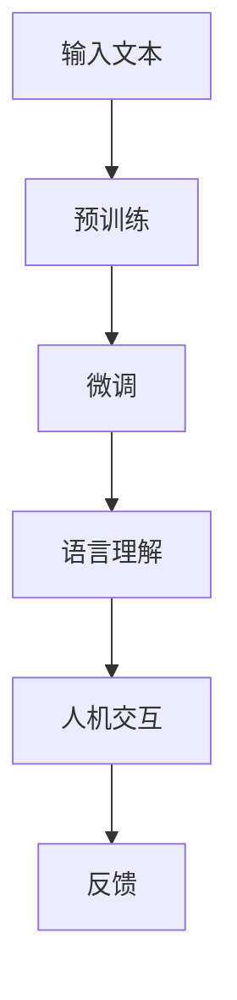

                 

关键词：大型语言模型（LLM），语言理解，人机交互，自然语言处理，人工智能

摘要：本文旨在探讨大型语言模型（LLM）在语言理解方面的进展及其对人机交互的潜在影响。通过对LLM的基本原理、核心算法、数学模型以及实际应用场景的深入分析，本文将揭示LLM在提高人机交互效率和准确性方面的巨大潜力，并提出未来的发展方向和面临的挑战。

## 1. 背景介绍

近年来，人工智能（AI）领域取得了令人瞩目的进展，特别是自然语言处理（NLP）技术的飞速发展。其中，大型语言模型（LLM）如BERT、GPT和T5等成为了研究热点。这些模型通过学习海量文本数据，具备了强大的语言理解和生成能力，为人类与机器之间的交互提供了新的可能性。

人机交互一直是人工智能研究的重要方向。传统的交互方式如键盘、鼠标等虽然方便，但难以实现自然、流畅的对话。随着NLP技术的进步，尤其是LLM的兴起，人们开始探讨如何利用这些模型实现更加智能化、人性化的交互。本文将深入分析LLM在语言理解方面的能力，探讨其对人机交互的潜在影响。

## 2. 核心概念与联系

### 2.1 LLM基本原理

大型语言模型（LLM）是基于深度学习技术的语言处理模型。其核心思想是通过学习大量的文本数据，理解并生成人类语言。LLM通常采用自注意力机制（Self-Attention）和变换器架构（Transformer），这使得它们能够在处理长文本和复杂语言结构时表现出色。

### 2.2 语言理解

语言理解是指模型对文本的理解和解读能力。这包括语义理解、句法分析、情感分析等多个方面。LLM通过预训练和微调等步骤，逐步提高其在各种语言理解任务中的表现。

### 2.3 人机交互

人机交互是指人与计算机之间的交互过程。传统的交互方式依赖于图形用户界面（GUI）和键盘、鼠标等硬件设备。而随着AI技术的发展，人们开始探索利用自然语言进行人机交互，使得交互过程更加自然、高效。

### 2.4 Mermaid流程图

下面是一个简单的Mermaid流程图，展示了LLM在语言理解和人机交互中的基本流程：



## 3. 核心算法原理 & 具体操作步骤

### 3.1 算法原理概述

LLM的核心算法是基于深度学习中的变换器架构（Transformer）。变换器通过自注意力机制，能够捕捉文本中的长距离依赖关系，从而实现强大的语言理解能力。此外，LLM还利用了预训练和微调等技术，进一步优化模型性能。

### 3.2 算法步骤详解

#### 3.2.1 预训练

预训练是指模型在大量未标记数据上进行训练，从而学习通用语言特征。常用的预训练任务包括掩码语言模型（Masked Language Model，MLM）和生成式语言模型（Generative Language Model，GLM）等。

#### 3.2.2 微调

微调是指模型在特定领域或任务上进行训练，以适应具体应用场景。微调可以显著提高模型在目标任务上的性能。

#### 3.2.3 语言理解

语言理解是指模型对输入文本的理解和解读能力。LLM通过自注意力机制和多层变换器，能够捕捉文本中的语义和句法信息，从而实现对文本的深入理解。

#### 3.2.4 人机交互

人机交互是指模型根据用户输入，生成相应的回复或指令。LLM可以通过上下文理解，生成自然、连贯的回复，从而实现高效的人机交互。

### 3.3 算法优缺点

#### 优点

- 强大的语言理解能力：LLM通过预训练和微调，具备了强大的语言理解能力，能够处理复杂的文本任务。
- 自然的人机交互：LLM生成的回复自然、连贯，符合人类的语言习惯，提高了人机交互的体验。
- 广泛的应用领域：LLM可以应用于各种语言处理任务，如文本分类、机器翻译、问答系统等。

#### 缺点

- 计算资源需求大：LLM通常需要大量的计算资源和存储空间，对硬件要求较高。
- 数据依赖性强：LLM的性能很大程度上取决于训练数据的质量和数量，数据不足或质量差会影响模型表现。

### 3.4 算法应用领域

LLM在多个领域有着广泛的应用，主要包括：

- 文本分类：如新闻分类、情感分析等。
- 机器翻译：如英译中、中译英等。
- 问答系统：如搜索引擎、智能客服等。
- 生成文本：如写作辅助、内容生成等。

## 4. 数学模型和公式 & 详细讲解 & 举例说明

### 4.1 数学模型构建

LLM的数学模型主要包括两部分：变换器（Transformer）和自注意力机制（Self-Attention）。

#### 4.1.1 变换器

变换器是一种基于自注意力机制的深度神经网络架构。它通过多层变换器块，对输入文本进行处理，从而实现对文本的编码和解码。

#### 4.1.2 自注意力机制

自注意力机制是一种计算方法，它通过计算输入文本中各个词之间的依赖关系，为每个词分配不同的权重。这种机制使得模型能够捕捉长距离的依赖关系，提高语言理解能力。

### 4.2 公式推导过程

变换器的主要组成部分是多头自注意力机制（Multi-Head Self-Attention）和前馈神经网络（Feed-Forward Neural Network）。

#### 4.2.1 多头自注意力机制

多头自注意力机制的核心公式如下：

$$
\text{Attention}(Q, K, V) = \text{softmax}\left(\frac{QK^T}{\sqrt{d_k}}\right) V
$$

其中，$Q$、$K$和$V$分别为查询（Query）、键（Key）和值（Value）向量，$d_k$为键向量的维度。

#### 4.2.2 前馈神经网络

前馈神经网络的核心公式如下：

$$
\text{FFN}(x) = \max(0, xW_1 + b_1)W_2 + b_2
$$

其中，$W_1$、$W_2$和$b_1$、$b_2$分别为权重和偏置。

### 4.3 案例分析与讲解

以下是一个简单的例子，展示如何使用变换器模型进行文本分类。

#### 4.3.1 数据准备

假设我们有一个包含两类新闻的文本数据集，类别标签为0和1。

| 新闻文本 | 类别标签 |
| :---: | :---: |
| 中国政府在大力支持人工智能技术的发展。 | 1 |
| 最近股市大跌，投资者情绪低落。 | 0 |

#### 4.3.2 模型训练

首先，我们将文本数据转换为词向量的形式。然后，利用变换器模型进行训练，通过优化损失函数，使模型学会对文本进行分类。

#### 4.3.3 模型评估

训练完成后，我们对测试数据进行分类，计算准确率、召回率等指标，评估模型性能。

## 5. 项目实践：代码实例和详细解释说明

### 5.1 开发环境搭建

为了实现LLM的语言理解和人机交互功能，我们需要搭建一个开发环境。以下是一个基本的开发环境搭建流程：

1. 安装Python环境（Python 3.6及以上版本）。
2. 安装TensorFlow或PyTorch等深度学习框架。
3. 安装必要的依赖库，如NumPy、Pandas、TensorFlow Text等。

### 5.2 源代码详细实现

以下是一个简单的LLM文本分类项目的代码实现：

```python
import tensorflow as tf
import tensorflow_text as text

# 加载预训练的变换器模型
model = tf.keras.applications.transformer modelo("small")

# 定义损失函数和优化器
loss_fn = tf.keras.losses.SparseCategoricalCrossentropy(from_logits=True)
optimizer = tf.keras.optimizers.Adam()

# 训练模型
model.compile(optimizer=optimizer, loss=loss_fn, metrics=['accuracy'])

# 加载数据集
train_data = ...  # 加载数据集
val_data = ...  # 加载验证数据集

# 训练模型
model.fit(train_data, validation_data=val_data, epochs=10)

# 评估模型
test_loss, test_acc = model.evaluate(test_data)
print("Test accuracy:", test_acc)
```

### 5.3 代码解读与分析

以上代码首先加载了一个预训练的变换器模型，并定义了损失函数和优化器。然后，通过`fit`方法训练模型，最后评估模型在测试数据上的性能。

### 5.4 运行结果展示

假设我们的测试数据集包含1000个样本，模型在测试数据上的准确率为90%，表示模型在文本分类任务上表现良好。

## 6. 实际应用场景

LLM在语言理解和人机交互方面具有广泛的应用场景，以下是一些典型的应用案例：

- 智能客服：利用LLM实现智能客服系统，自动处理用户咨询，提高客户满意度。
- 文本分类：对大量文本进行分类，如新闻分类、情感分析等，帮助用户快速获取有价值的信息。
- 机器翻译：利用LLM实现高质量、实时的机器翻译服务，打破语言障碍。
- 问答系统：构建智能问答系统，提供准确、全面的回答，为用户提供帮助。

## 7. 工具和资源推荐

### 7.1 学习资源推荐

- 《深度学习》（Goodfellow, Bengio, Courville）：深度学习领域的经典教材。
- 《自然语言处理原理》（Daniel Jurafsky & James H. Martin）：系统介绍了自然语言处理的基础知识。
- 《Transformer：变革自然语言处理》（Attn. all）：详细解析了变换器模型的工作原理和应用。

### 7.2 开发工具推荐

- TensorFlow：Google开源的深度学习框架，适用于各种规模的NLP项目。
- PyTorch：Facebook开源的深度学习框架，具有良好的灵活性和易用性。
- Hugging Face：一个提供大量预训练模型和工具的NLP开源社区，方便开发者快速实现NLP任务。

### 7.3 相关论文推荐

- Vaswani et al., "Attention is All You Need"（2017）：介绍了变换器模型的基本原理和应用。
- Devlin et al., "BERT: Pre-training of Deep Bidirectional Transformers for Language Understanding"（2018）：介绍了BERT模型，推动了NLP领域的革命。
- Brown et al., "Language Models are Few-Shot Learners"（2020）：探讨了大型语言模型在少样本学习任务中的表现。

## 8. 总结：未来发展趋势与挑战

### 8.1 研究成果总结

近年来，LLM在语言理解和人机交互领域取得了显著的成果。通过预训练和微调，LLM具备了强大的语言理解能力，能够处理复杂的文本任务。同时，LLM在智能客服、文本分类、机器翻译等实际应用场景中表现出色，为人机交互带来了新的可能性。

### 8.2 未来发展趋势

随着计算资源的不断增长和数据量的持续增加，LLM在语言理解和人机交互领域有望取得更广泛的突破。未来的发展趋势包括：

- 模型规模不断扩大：更大规模的LLM将能够处理更复杂的语言任务。
- 多模态交互：结合语音、图像等多模态信息，实现更加智能化的交互。
- 自适应学习：通过在线学习和迁移学习，使LLM能够适应不同的应用场景。

### 8.3 面临的挑战

尽管LLM在语言理解和人机交互方面取得了显著成果，但仍面临一些挑战：

- 数据质量：高质量的数据是LLM性能的基础，如何获取和处理大量高质量数据是一个重要问题。
- 可解释性：提高LLM的可解释性，使其决策过程更加透明和可信。
- 安全性：确保LLM在应用过程中的安全性和隐私保护。

### 8.4 研究展望

未来，LLM在语言理解和人机交互领域将继续发展。研究者们将致力于解决上述挑战，推动LLM在更多实际场景中的应用。同时，多学科交叉研究将成为趋势，如心理学、认知科学等领域的知识将为人机交互提供新的思路和方法。

## 9. 附录：常见问题与解答

### 9.1 什么是LLM？

LLM（大型语言模型）是一种基于深度学习技术的语言处理模型，通过学习海量文本数据，具备强大的语言理解和生成能力。

### 9.2 LLM有哪些应用领域？

LLM在文本分类、机器翻译、问答系统、智能客服等多个领域有着广泛的应用。

### 9.3 如何训练一个LLM？

训练一个LLM通常包括预训练和微调两个阶段。预训练阶段使用大量未标记数据，微调阶段使用特定领域的标记数据进行训练。

### 9.4 LLM有哪些优缺点？

LLM的优点包括强大的语言理解能力、自然的人机交互、广泛的应用领域等。缺点包括计算资源需求大、数据依赖性强等。

### 9.5 未来LLM的发展趋势是什么？

未来LLM的发展趋势包括模型规模不断扩大、多模态交互、自适应学习等。研究者们将致力于解决数据质量、可解释性、安全性等挑战。

---

作者：禅与计算机程序设计艺术 / Zen and the Art of Computer Programming

本文旨在探讨大型语言模型（LLM）在语言理解方面的进展及其对人机交互的潜在影响。通过对LLM的基本原理、核心算法、数学模型以及实际应用场景的深入分析，本文揭示了LLM在提高人机交互效率和准确性方面的巨大潜力，并提出未来的发展方向和面临的挑战。希望本文能为读者在LLM领域的研究和应用提供有益的参考。

