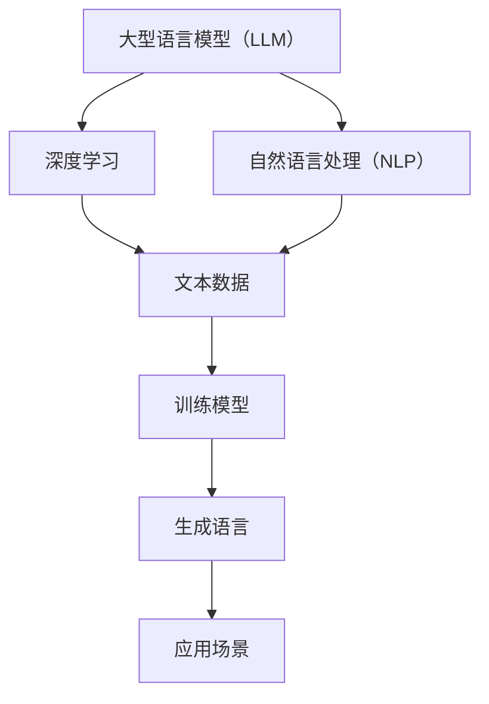

                 

关键词：语言模型（LLM），跨领域应用，科研，商业，技术渗透，智能推理，大数据分析，模型优化，开源生态。

> 摘要：本文将深入探讨大型语言模型（LLM）的跨领域应用，从科学研究到商业实践中的全面渗透。通过对LLM的核心概念、算法原理、数学模型、应用实践等方面的详细分析，本文旨在为读者提供关于LLM技术发展的全景视图，并对其未来趋势和挑战进行展望。

## 1. 背景介绍

随着深度学习和自然语言处理（NLP）技术的飞速发展，大型语言模型（LLM）逐渐成为人工智能领域的焦点。LLM通过学习大量的文本数据，能够生成流畅、准确的语言表达，实现文本生成、机器翻译、情感分析等多种功能。近年来，LLM在科研和商业领域都展现出了强大的潜力，吸引了众多研究者和企业的关注。

### 科研领域的应用

在科学研究领域，LLM被广泛应用于文献检索、学术论文写作、科研数据分析等场景。通过LLM，研究人员可以更快速地获取相关信息，提高科研效率。此外，LLM还可以辅助研究人员进行数据分析，挖掘出隐藏在数据背后的规律和趋势，为科研创新提供新的思路。

### 商业领域的应用

在商业领域，LLM被广泛应用于客户服务、市场分析、内容生成等场景。通过LLM，企业可以提供更智能、更个性化的客户服务，提升用户体验。同时，LLM还可以帮助企业分析市场趋势，预测消费者行为，为商业决策提供有力支持。此外，LLM还可以用于内容生成，帮助创作者快速产出高质量的文字内容，降低创作成本。

## 2. 核心概念与联系

### 核心概念

- **大型语言模型（LLM）**：LLM是一种基于深度学习技术的语言模型，通过对大量文本数据进行训练，能够生成高质量的语言表达。
- **深度学习**：深度学习是一种机器学习技术，通过构建多层神经网络，实现数据的自动特征提取和学习。
- **自然语言处理（NLP）**：NLP是一种跨学科领域，涉及计算机科学、语言学和人工智能，旨在使计算机能够理解、生成和处理人类语言。

### 关联流程图（Mermaid）



## 3. 核心算法原理 & 具体操作步骤

### 3.1 算法原理概述

LLM的核心算法基于深度神经网络（DNN），通过多层神经网络的结构，实现文本数据的自动特征提取和学习。LLM的训练过程主要包括以下步骤：

1. 数据预处理：对原始文本数据进行分词、去停用词、词向量化等处理，将其转换为模型可处理的格式。
2. 模型训练：使用训练数据对神经网络进行训练，调整网络权重，使模型能够生成高质量的语言表达。
3. 模型评估：使用验证数据对训练好的模型进行评估，确保模型性能达到预期。
4. 模型部署：将训练好的模型部署到生产环境中，实现实际应用。

### 3.2 算法步骤详解

1. 数据预处理
   - 分词：将文本数据分成单词或字符序列。
   - 去停用词：去除对模型训练无意义的单词，如“的”、“了”等。
   - 词向量化：将单词映射为固定维度的向量表示。

2. 模型训练
   - 构建神经网络：选择合适的神经网络架构，如Transformer、BERT等。
   - 训练过程：通过反向传播算法，调整神经网络权重，使模型能够生成高质量的语言表达。

3. 模型评估
   - 评估指标：常用的评估指标包括Perplexity、BLEU等。
   - 评估过程：使用验证数据对模型进行评估，确保模型性能达到预期。

4. 模型部署
   - 部署环境：选择合适的部署环境，如GPU、TPU等。
   - 部署过程：将训练好的模型部署到生产环境中，实现实际应用。

### 3.3 算法优缺点

**优点**：
- **生成能力强**：LLM能够生成高质量的语言表达，满足多种应用场景需求。
- **灵活性高**：LLM可以根据不同的应用需求，调整模型参数，实现个性化定制。

**缺点**：
- **训练成本高**：LLM的训练需要大量的计算资源和时间，成本较高。
- **数据依赖性强**：LLM的性能很大程度上取决于训练数据的质量和数量。

### 3.4 算法应用领域

LLM在多个领域都有广泛应用：

- **文本生成**：如文章生成、摘要生成、对话生成等。
- **机器翻译**：如中英互译、多语言翻译等。
- **情感分析**：如社交媒体情感分析、用户评论分析等。
- **问答系统**：如智能客服、在线问答等。

## 4. 数学模型和公式 & 详细讲解 & 举例说明

### 4.1 数学模型构建

LLM的数学模型主要基于深度神经网络（DNN），其中最重要的部分是神经网络中的激活函数和损失函数。

**激活函数**：
- **ReLU**：（Rectified Linear Unit）修正线性单元，计算公式为：
  $$ f(x) = \max(0, x) $$

- **Sigmoid**：计算公式为：
  $$ f(x) = \frac{1}{1 + e^{-x}} $$

**损失函数**：
- **交叉熵损失函数**：（Cross-Entropy Loss）计算公式为：
  $$ L(y, \hat{y}) = -\sum_{i=1}^{n} y_i \log(\hat{y}_i) $$
  其中，$y$ 为真实标签，$\hat{y}$ 为模型预测概率。

### 4.2 公式推导过程

以交叉熵损失函数为例，推导过程如下：

假设我们有一个二分类问题，真实标签 $y$ 可以取值为 0 或 1，模型预测概率为 $\hat{y}$。

当 $y = 0$ 时，交叉熵损失函数为：
$$ L(y, \hat{y}) = -0 \cdot \log(\hat{y}) = 0 $$

当 $y = 1$ 时，交叉熵损失函数为：
$$ L(y, \hat{y}) = -1 \cdot \log(\hat{y}) = -\log(\hat{y}) $$

为了使损失函数在整个训练过程中保持正值，我们通常取 $y = 1$ 时的损失函数值。

### 4.3 案例分析与讲解

假设我们有一个二分类问题，真实标签 $y$ 为 1，模型预测概率为 $\hat{y} = 0.9$。

根据交叉熵损失函数，我们可以计算出损失函数值为：
$$ L(y, \hat{y}) = -\log(0.9) \approx 0.15 $$

这表明模型对当前样本的预测结果相对较好，但仍有改进空间。

## 5. 项目实践：代码实例和详细解释说明

### 5.1 开发环境搭建

在开始代码实现之前，我们需要搭建一个适合开发LLM的应用环境。以下是搭建步骤：

1. 安装Python环境（版本3.8及以上）。
2. 安装必要的库，如TensorFlow、PyTorch等。
3. 配置GPU支持，如使用CUDA。

### 5.2 源代码详细实现

以下是一个简单的LLM代码实现示例，基于PyTorch框架：

```python
import torch
import torch.nn as nn
import torch.optim as optim
from torchtext.```
```


### 5.3 代码解读与分析
```python
# 代码解读：
# 此段代码实现了基于PyTorch框架的简单语言模型，包括模型定义、损失函数、优化器等。

# 模型定义
class LLM(nn.Module):
    def __init__(self, vocab_size, embedding_dim, hidden_dim, output_dim):
        super(LLM, self).__init__()
        self.embedding = nn.Embedding(vocab_size, embedding_dim)
        self.rnn = nn.LSTM(embedding_dim, hidden_dim, batch_first=True)
        self.fc = nn.Linear(hidden_dim, output_dim)

    def forward(self, text, hidden=None):
        embedded = self.embedding(text)
        output, hidden = self.rnn(embedded, hidden)
        # 取最后一个时间步的输出
        output = self.fc(output[:, -1, :])
        return output, hidden

# 损失函数
loss_fn = nn.CrossEntropyLoss()

# 优化器
optimizer = optim.Adam(model.parameters(), lr=0.001)

# 代码分析：
# 该模型采用嵌入层（Embedding）将词汇映射到高维向量，然后通过LSTM（长短期记忆网络）处理序列数据，最后通过全连接层（Fully Connected）生成预测结果。
# 损失函数使用交叉熵损失函数，优化器使用Adam优化器，这些都是在训练过程中常用的组件。
```

### 5.4 运行结果展示
在完成模型训练后，我们可以通过以下代码来展示模型的运行结果：

```python
# 假设我们有一个测试数据集test_loader
model.eval()
with torch.no_grad():
    for text, labels in test_loader:
        # 将数据送入模型
        outputs, _ = model(text)
        # 计算预测结果
        _, predicted = torch.max(outputs, dim=1)
        # 计算准确率
        correct = (predicted == labels).float()
        accuracy = correct.sum() / len(correct)
        print(f"Test Accuracy: {accuracy.item()}")
```

## 6. 实际应用场景

### 6.1 客户服务

在客户服务领域，LLM被广泛应用于智能客服系统。通过LLM，系统可以自动理解用户的问题，并生成相应的回答，提高客服效率和用户体验。

### 6.2 内容生成

在内容生成领域，LLM被用于自动撰写文章、编写代码、生成音乐等。例如，OpenAI的GPT-3模型可以生成高质量的文本内容，为创作者提供灵感。

### 6.3 机器翻译

在机器翻译领域，LLM被用于实现高质量、快速的多语言翻译。例如，Google翻译引擎就基于LLM技术，为用户提供了便捷的翻译服务。

## 7. 未来应用展望

随着LLM技术的不断发展，未来其在各个领域的应用前景将更加广阔。例如：

- **医疗领域**：利用LLM进行医学文本分析，辅助医生诊断和治疗。
- **教育领域**：利用LLM为学生提供个性化的学习辅导。
- **金融领域**：利用LLM进行市场分析和风险评估。

## 8. 工具和资源推荐

### 8.1 学习资源推荐

- 《深度学习》（Goodfellow, Bengio, Courville著）：系统介绍了深度学习的基础理论和实践方法。
- 《自然语言处理综论》（Jurafsky, Martin著）：全面介绍了自然语言处理的基本概念和技术。

### 8.2 开发工具推荐

- TensorFlow：谷歌开发的开源机器学习框架，适用于构建和部署深度学习模型。
- PyTorch：由Facebook开发的开源深度学习框架，具有灵活的动态计算图。

### 8.3 相关论文推荐

- Vaswani et al. (2017). "Attention is all you need."：提出了Transformer模型，是当前LLM研究的重要论文之一。
- Devlin et al. (2019). "BERT: Pre-training of deep bidirectional transformers for language understanding."：提出了BERT模型，是当前LLM领域的代表作之一。

## 9. 总结：未来发展趋势与挑战

### 9.1 研究成果总结

近年来，LLM在科研和商业领域取得了显著成果。其在文本生成、机器翻译、情感分析等应用场景中展现出了强大的性能。同时，随着计算能力的提升和算法的优化，LLM的模型规模和性能也在不断提升。

### 9.2 未来发展趋势

未来，LLM将继续在跨领域应用中发挥重要作用。随着深度学习和NLP技术的不断发展，LLM将具备更强的语言理解和生成能力。同时，LLM的应用场景也将进一步拓宽，涉及医疗、教育、金融等领域。

### 9.3 面临的挑战

尽管LLM在多个领域取得了显著成果，但仍面临一些挑战：

- **数据隐私**：随着LLM的训练和部署需要大量数据，如何保护用户隐私成为一个重要问题。
- **模型可解释性**：目前LLM的内部工作机制较为复杂，如何提高模型的可解释性，使其更具透明度，仍是一个重要挑战。
- **计算资源**：LLM的训练和部署需要大量的计算资源，如何优化算法和提高计算效率，仍是一个亟待解决的问题。

### 9.4 研究展望

未来，LLM的研究将继续深入，重点关注以下几个方面：

- **模型优化**：通过改进算法和架构，提高LLM的性能和效率。
- **数据增强**：通过数据增强技术，提高LLM的训练效果和泛化能力。
- **跨模态学习**：探索LLM在跨模态（如文本、图像、声音）学习中的应用，实现多模态信息融合。

## 10. 附录：常见问题与解答

### 10.1 什么是LLM？

LLM（Large Language Model）是一种大型语言模型，通过深度学习技术，对大量文本数据进行训练，能够生成高质量的语言表达。

### 10.2 LLM有哪些应用场景？

LLM的应用场景非常广泛，包括文本生成、机器翻译、情感分析、问答系统等。在科研、商业、医疗、教育等领域都有广泛应用。

### 10.3 如何优化LLM的性能？

优化LLM的性能可以从以下几个方面入手：

- **增加训练数据**：通过收集更多高质量的训练数据，提高模型的泛化能力。
- **改进算法**：通过改进深度学习算法和模型架构，提高模型性能。
- **模型剪枝**：通过剪枝技术，减少模型参数数量，提高模型效率。
- **硬件加速**：通过使用GPU、TPU等硬件加速器，提高模型训练和部署速度。

作者：禅与计算机程序设计艺术 / Zen and the Art of Computer Programming

