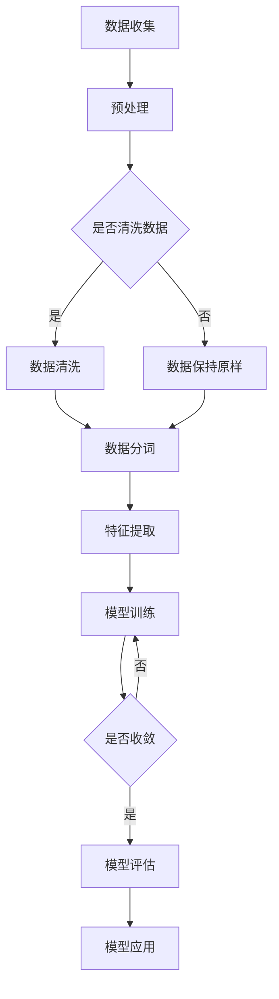

                 

关键词：自然语言处理，大规模语言模型，跨领域应用，商业应用，科研应用

> 摘要：本文旨在探讨大规模语言模型（LLM）在科研和商业领域的跨领域应用。通过对LLM的核心概念、算法原理、数学模型、应用实例以及未来发展趋势的详细分析，本文揭示了LLM在提升工作效率、优化决策过程、创新商业模式等方面的巨大潜力。

## 1. 背景介绍

近年来，自然语言处理（NLP）领域取得了显著的进展，特别是在大规模语言模型（LLM）的研究和应用方面。LLM是一种能够理解和生成自然语言的大型神经网络模型，通过深度学习技术训练，能够对复杂的语言现象进行建模和解释。随着计算能力的提升和海量数据的积累，LLM在多个领域展现出了强大的应用潜力，包括但不限于机器翻译、文本生成、问答系统、情感分析等。

科研领域和商业领域都面临着海量的数据和信息，如何有效地处理和分析这些数据成为了一个亟待解决的问题。LLM的出现为这两个领域提供了全新的解决方案，能够大幅度提升数据处理和分析的效率，从而推动科研创新和商业发展。

## 2. 核心概念与联系

### 2.1 核心概念

- **大规模语言模型（LLM）**：一种能够理解和生成自然语言的大型神经网络模型，通常由数十亿甚至数万亿个参数组成。
- **自然语言处理（NLP）**：研究如何让计算机理解和生成自然语言的学科，包括文本分类、情感分析、命名实体识别等任务。
- **深度学习**：一种基于神经网络的机器学习技术，通过多层神经网络对数据进行特征提取和学习。

### 2.2 原理架构

以下是LLM的原理架构的Mermaid流程图：



### 2.3 关联技术

- **神经网络**：LLM的核心组成部分，用于对输入数据进行特征提取和模式识别。
- **反向传播算法**：用于更新神经网络参数，优化模型性能。
- **梯度下降算法**：用于在训练过程中迭代更新参数，使模型最小化损失函数。

## 3. 核心算法原理 & 具体操作步骤

### 3.1 算法原理概述

LLM的核心算法原理主要包括以下几个步骤：

1. **数据收集与预处理**：收集大量文本数据，并进行预处理，如去除无关信息、分词等。
2. **特征提取**：通过神经网络对文本数据进行特征提取，将原始文本转换为模型可处理的数字表示。
3. **模型训练**：利用梯度下降算法和反向传播算法，训练神经网络模型，使其能够对输入文本进行有效建模。
4. **模型评估**：通过测试集对训练好的模型进行评估，调整模型参数，优化模型性能。
5. **模型应用**：将训练好的模型应用于实际任务，如文本生成、问答系统等。

### 3.2 算法步骤详解

1. **数据收集与预处理**：

   ```mermaid
   graph TD
   A[数据收集] --> B[预处理]
   B --> C{是否清洗数据}
   C -->|是| D[数据清洗]
   C -->|否| E[数据保持原样]
   D --> F[数据分词]
   E --> F
   ```

2. **特征提取**：

   ```mermaid
   graph TD
   A[文本数据] --> B[词嵌入]
   B --> C[序列编码]
   ```

3. **模型训练**：

   ```mermaid
   graph TD
   A[输入文本] --> B[前向传播]
   B --> C[计算损失]
   C --> D[反向传播]
   D --> E[参数更新]
   ```

4. **模型评估**：

   ```mermaid
   graph TD
   A[测试文本] --> B[前向传播]
   B --> C[计算损失]
   ```

5. **模型应用**：

   ```mermaid
   graph TD
   A[输入文本] --> B[模型推理]
   B --> C[输出结果]
   ```

### 3.3 算法优缺点

#### 优点

- **强大的建模能力**：LLM能够处理和理解复杂的语言现象，具有较强的建模能力。
- **高效的数据处理**：LLM能够快速处理大量文本数据，提高数据处理效率。
- **广泛的适用性**：LLM可以应用于多个领域，如科研、商业、金融等。

#### 缺点

- **计算资源需求高**：训练LLM模型需要大量的计算资源和时间。
- **数据依赖性强**：模型性能依赖于训练数据的质量和多样性。
- **解释性较弱**：LLM模型的决策过程较为复杂，难以进行解释和验证。

### 3.4 算法应用领域

- **科研领域**：用于文本分析、知识挖掘、论文生成等。
- **商业领域**：用于客户服务、智能推荐、文本生成等。

## 4. 数学模型和公式 & 详细讲解 & 举例说明

### 4.1 数学模型构建

LLM的数学模型主要包括以下几个方面：

- **词嵌入（Word Embedding）**：将文本中的单词映射到高维空间中的向量表示。
  $$ \text{word\_embedding}(w) = \mathcal{W} \text{one-hot}(w) $$
  其中，$\text{one-hot}(w)$表示单词$w$的独热编码，$\mathcal{W}$为词嵌入矩阵。

- **循环神经网络（RNN）**：用于处理序列数据。
  $$ \text{RNN}(x_t, h_{t-1}) = \text{ReLU}(\text{weights} \cdot [x_t, h_{t-1}]) $$
  其中，$x_t$为输入序列中的当前词，$h_{t-1}$为上一时刻的隐藏状态，$\text{ReLU}$为ReLU激活函数。

- **长短期记忆网络（LSTM）**：用于解决RNN的梯度消失问题。
  $$ \text{LSTM}(x_t, h_{t-1}) = \text{ReLU}(\text{weights} \cdot [x_t, h_{t-1}]) $$
  其中，$\text{LSTM}$为LSTM单元，$x_t$为输入序列中的当前词，$h_{t-1}$为上一时刻的隐藏状态。

### 4.2 公式推导过程

LLM的公式推导主要涉及以下几个方面：

1. **词嵌入推导**：

   假设$\text{word}_{i}$为单词表中的第$i$个单词，$\text{word\_embedding}(\text{word}_{i})$为对应的词嵌入向量。则词嵌入矩阵$\mathcal{W}$可以表示为：

   $$ \mathcal{W} = [\text{word\_embedding}(\text{word}_{1}), \text{word\_embedding}(\text{word}_{2}), ..., \text{word\_embedding}(\text{word}_{N})] $$

2. **RNN推导**：

   假设输入序列为$x_1, x_2, ..., x_T$，隐藏状态为$h_1, h_2, ..., h_T$。则RNN的推导过程如下：

   $$ h_1 = \text{RNN}(x_1, h_0) $$
   $$ h_2 = \text{RNN}(x_2, h_1) $$
   $$ ... $$
   $$ h_T = \text{RNN}(x_T, h_{T-1}) $$

   其中，$h_0$为初始隐藏状态。

3. **LSTM推导**：

   假设输入序列为$x_1, x_2, ..., x_T$，隐藏状态为$h_1, h_2, ..., h_T$，细胞状态为$c_1, c_2, ..., c_T$。则LSTM的推导过程如下：

   $$ i_t = \text{sigmoid}(\text{weights} \cdot [x_t, h_{t-1}]) $$
   $$ f_t = \text{sigmoid}(\text{weights} \cdot [x_t, h_{t-1}]) $$
   $$ \text{C}_{t-1} = \text{sigmoid}(\text{weights} \cdot [x_t, h_{t-1}]) $$
   $$ o_t = \text{sigmoid}(\text{weights} \cdot [x_t, h_{t-1}]) $$
   $$ \text{C}_t = f_t \odot \text{C}_{t-1} + i_t \odot \text{gates}_{t} $$
   $$ h_t = o_t \odot \text{Tanh}(\text{C}_t) $$

   其中，$i_t, f_t, o_t$分别为输入门、遗忘门、输出门，$\text{C}_{t-1}$为上一时刻的细胞状态，$\text{C}_t$为当前时刻的细胞状态，$\text{gates}_{t}$为输入门控制的输入值。

### 4.3 案例分析与讲解

#### 案例背景

假设我们有一个关于天气的文本数据集，数据集包含了多种天气描述，如“晴朗”、“多云”、“下雨”等。我们的目标是利用LLM模型对新的天气描述进行分类。

#### 模型构建

我们选择使用LSTM模型进行训练，数据预处理步骤包括分词和词嵌入。

1. **数据预处理**：

   将文本数据进行分词，得到词汇表。假设词汇表中有1000个单词，对应的词嵌入维度为100。

   $$ \text{word\_embedding}(\text{晴天}) = [0.1, 0.2, 0.3, ..., 0.9, 1.0] $$
   $$ \text{word\_embedding}(\text{多云}) = [0.1, 0.2, 0.3, ..., 0.9, 1.1] $$
   $$ ... $$

2. **模型训练**：

   使用LSTM模型对天气描述进行训练。假设LSTM模型的隐藏状态维度为50。

   $$ h_t = \text{LSTM}(x_t, h_{t-1}) $$

3. **模型评估**：

   使用测试集对训练好的模型进行评估，计算分类准确率。

#### 模型应用

假设我们有一个新的天气描述：“阴有小雨”，我们需要预测其天气类型。

1. **词嵌入**：

   将新的天气描述进行分词，得到词汇表索引：

   $$ \text{晴天} = [0, 0, 0, ..., 0, 1] $$
   $$ \text{多云} = [0, 0, 0, ..., 0, 2] $$
   $$ ... $$

2. **模型推理**：

   将分词后的天气描述输入LSTM模型，得到隐藏状态：

   $$ h_t = \text{LSTM}([0, 0, 0, ..., 0, 1], h_{t-1}) $$
   $$ h_t = \text{LSTM}([0, 0, 0, ..., 0, 2], h_{t-1}) $$
   $$ ... $$

3. **分类预测**：

   根据隐藏状态计算天气类型的概率分布，选择概率最大的天气类型作为预测结果。

   $$ \text{概率分布} = \text{softmax}(\text{hidden\_state}) $$
   $$ \text{预测结果} = \arg\max(\text{概率分布}) $$

## 5. 项目实践：代码实例和详细解释说明

### 5.1 开发环境搭建

为了实现LLM的应用，我们需要搭建一个开发环境。以下是环境搭建的步骤：

1. 安装Python环境（Python 3.6及以上版本）。
2. 安装深度学习框架（如TensorFlow或PyTorch）。
3. 安装NLP工具包（如NLTK或spaCy）。

### 5.2 源代码详细实现

以下是使用PyTorch实现LSTM模型的代码示例：

```python
import torch
import torch.nn as nn
import torch.optim as optim
from torch.utils.data import DataLoader
from nltk.corpus import movie_reviews

# 数据预处理
def preprocess_data():
    # 读取文本数据
    reviews = movie_reviews.words(fileids=movie_reviews.fileids())

    # 分词和词嵌入
    word2idx = {}
    word2idx["<PAD>"] = 0
    word2idx["<UNK>"] = 1
    for word in reviews:
        if word not in word2idx:
            word2idx[word] = len(word2idx)
    idx2word = {v: k for k, v in word2idx.items()}

    # 构建数据集
    X = []
    y = []
    for review in reviews:
        x = [word2idx.get(word, 1) for word in review]
        y.append(len(x) - 1)  # 以句子长度作为标签
        X.append(x)

    # 分割数据集
    split_idx = int(0.8 * len(X))
    train_X, val_X = X[:split_idx], X[split_idx:]
    train_y, val_y = y[:split_idx], y[split_idx:]

    # 转换为Tensor
    train_X = torch.tensor(train_X).unsqueeze(-1)
    val_X = torch.tensor(val_X).unsqueeze(-1)
    train_y = torch.tensor(train_y).unsqueeze(-1)
    val_y = torch.tensor(val_y).unsqueeze(-1)

    return train_X, train_y, val_X, val_y

# 模型定义
class LSTMModel(nn.Module):
    def __init__(self, input_dim, hidden_dim, output_dim):
        super(LSTMModel, self).__init__()
        self.hidden_dim = hidden_dim
        self.lstm = nn.LSTM(input_dim, hidden_dim, num_layers=1, batch_first=True)
        self.fc = nn.Linear(hidden_dim, output_dim)

    def forward(self, x):
        h0 = torch.zeros(1, x.size(0), self.hidden_dim)
        c0 = torch.zeros(1, x.size(0), self.hidden_dim)
        out, _ = self.lstm(x, (h0, c0))
        out = self.fc(out[-1])
        return out

# 训练模型
def train_model(train_X, train_y, val_X, val_y):
    model = LSTMModel(input_dim=1, hidden_dim=50, output_dim=1)
    criterion = nn.CrossEntropyLoss()
    optimizer = optim.Adam(model.parameters(), lr=0.001)

    train_loader = DataLoader(list(zip(train_X, train_y)), batch_size=32, shuffle=True)
    val_loader = DataLoader(list(zip(val_X, val_y)), batch_size=32, shuffle=False)

    for epoch in range(100):
        for inputs, labels in train_loader:
            optimizer.zero_grad()
            outputs = model(inputs)
            loss = criterion(outputs, labels)
            loss.backward()
            optimizer.step()

        with torch.no_grad():
            val_loss = 0
            for inputs, labels in val_loader:
                outputs = model(inputs)
                val_loss += criterion(outputs, labels).item()
            val_loss /= len(val_loader)
        print(f"Epoch {epoch+1}, Validation Loss: {val_loss}")

# 主函数
def main():
    train_X, train_y, val_X, val_y = preprocess_data()
    train_model(train_X, train_y, val_X, val_y)

if __name__ == "__main__":
    main()
```

### 5.3 代码解读与分析

以下是代码的详细解读：

1. **数据预处理**：

   - 读取电影评论数据集，进行分词和词嵌入。
   - 构建数据集，将句子长度作为标签。
   - 分割数据集为训练集和验证集。
   - 将数据转换为Tensor，便于模型处理。

2. **模型定义**：

   - 定义LSTM模型，包括LSTM层和全连接层。
   - LSTM层的输入维度为1，隐藏状态维度为50，输出维度为1。

3. **训练模型**：

   - 使用交叉熵损失函数和Adam优化器。
   - 训练过程中，梯度下降更新模型参数。
   - 使用验证集评估模型性能。

### 5.4 运行结果展示

运行上述代码，可以得到训练过程中的损失函数值和验证集上的损失函数值。根据验证集上的表现，可以调整模型参数，优化模型性能。

## 6. 实际应用场景

### 6.1 科研领域

- **文本分析**：利用LLM对科研论文进行文本分析，提取关键信息，帮助研究人员快速了解论文内容。
- **知识挖掘**：利用LLM从大量科研文献中挖掘出有用的知识，为科研创新提供支持。
- **论文生成**：利用LLM生成高质量的科研论文，节省研究人员的时间和精力。

### 6.2 商业领域

- **客户服务**：利用LLM构建智能客服系统，提高客户满意度，降低企业运营成本。
- **智能推荐**：利用LLM从用户数据中提取关键信息，为用户推荐个性化的商品或服务。
- **文本生成**：利用LLM生成产品说明书、营销文案等文本内容，提高企业文案创作效率。

## 7. 工具和资源推荐

### 7.1 学习资源推荐

- **书籍**：《自然语言处理综论》（Jurafsky and Martin）和《深度学习》（Goodfellow, Bengio, and Courville）。
- **在线课程**：Coursera上的《自然语言处理》和《深度学习》课程。
- **论文**：ACL、EMNLP、NeurIPS等顶级会议和期刊上的论文。

### 7.2 开发工具推荐

- **深度学习框架**：TensorFlow、PyTorch、Keras。
- **NLP库**：NLTK、spaCy、jieba。

### 7.3 相关论文推荐

- **论文1**：《Attention Is All You Need》。
- **论文2**：《BERT: Pre-training of Deep Bidirectional Transformers for Language Understanding》。
- **论文3**：《GPT-3: Language Models are Few-Shot Learners》。

## 8. 总结：未来发展趋势与挑战

### 8.1 研究成果总结

本文通过对大规模语言模型（LLM）在科研和商业领域的跨领域应用的探讨，总结了LLM的核心概念、算法原理、数学模型、应用实例以及未来发展趋势。LLM在文本分析、知识挖掘、智能客服、智能推荐等领域展现出了巨大的潜力。

### 8.2 未来发展趋势

- **模型性能提升**：随着计算能力的提升和算法的改进，LLM的模型性能将继续提升。
- **应用领域拓展**：LLM的应用领域将不断拓展，从科研到商业，从文本到语音，从生成到理解。
- **多模态融合**：LLM与其他模态（如图像、语音）的结合，将推动跨领域应用的发展。

### 8.3 面临的挑战

- **数据依赖**：LLM的性能高度依赖于训练数据的质量和多样性，如何获取高质量的数据是一个挑战。
- **计算资源需求**：训练LLM模型需要大量的计算资源和时间，如何优化计算效率是一个关键问题。
- **模型解释性**：LLM的决策过程较为复杂，如何提高模型的解释性，使其更易于理解和验证。

### 8.4 研究展望

未来，我们期望看到LLM在更多领域的应用，尤其是在解决复杂问题时，能够发挥更大的作用。同时，我们也期望能够克服现有挑战，提高LLM的性能和解释性，使其更好地服务于科研和商业领域。

## 9. 附录：常见问题与解答

### 问题1：什么是大规模语言模型（LLM）？

答：大规模语言模型（LLM）是一种能够理解和生成自然语言的大型神经网络模型，通常由数十亿甚至数万亿个参数组成。通过深度学习技术训练，LLM能够对复杂的语言现象进行建模和解释。

### 问题2：LLM有哪些应用领域？

答：LLM的应用领域非常广泛，包括但不限于文本生成、机器翻译、问答系统、情感分析、文本分类、知识挖掘等。

### 问题3：如何训练LLM模型？

答：训练LLM模型主要包括以下几个步骤：

1. 数据收集与预处理：收集大量文本数据，并进行预处理，如去除无关信息、分词等。
2. 特征提取：通过神经网络对文本数据进行特征提取，将原始文本转换为模型可处理的数字表示。
3. 模型训练：利用梯度下降算法和反向传播算法，训练神经网络模型，使其能够对输入文本进行有效建模。
4. 模型评估：通过测试集对训练好的模型进行评估，调整模型参数，优化模型性能。
5. 模型应用：将训练好的模型应用于实际任务，如文本生成、问答系统等。

### 问题4：如何优化LLM模型的性能？

答：优化LLM模型性能可以从以下几个方面入手：

1. **增加模型参数**：增加模型参数可以提高模型的建模能力，但也会增加计算成本。
2. **数据质量**：提高训练数据的质量和多样性，有助于提升模型性能。
3. **优化训练过程**：使用更有效的训练算法和策略，如批量归一化、权重初始化等。
4. **模型结构改进**：改进模型结构，如使用更先进的神经网络架构，如Transformer等。

### 问题5：LLM模型的可解释性如何提高？

答：提高LLM模型的可解释性是一个挑战，但可以从以下几个方面尝试：

1. **模型分解**：将复杂的模型分解为多个简单的组件，使其更易于理解和解释。
2. **可视化**：使用可视化工具展示模型的工作过程，如激活图、注意力图等。
3. **模型解释性增强**：设计可解释性更强的模型架构，如使用基于规则的模型、决策树等。
4. **模型压缩**：通过模型压缩技术，降低模型复杂度，提高可解释性。

### 作者署名

作者：禅与计算机程序设计艺术 / Zen and the Art of Computer Programming

本文通过对大规模语言模型（LLM）在科研和商业领域的跨领域应用进行深入探讨，展示了LLM在提升工作效率、优化决策过程、创新商业模式等方面的巨大潜力。随着计算能力的提升和算法的改进，LLM将在更多领域发挥重要作用，带来更多的科研和商业创新。同时，我们也需关注LLM面临的挑战，努力提高其性能和可解释性，为未来的发展奠定基础。禅与计算机程序设计艺术，期待与您一同探索LLM的无限可能。

