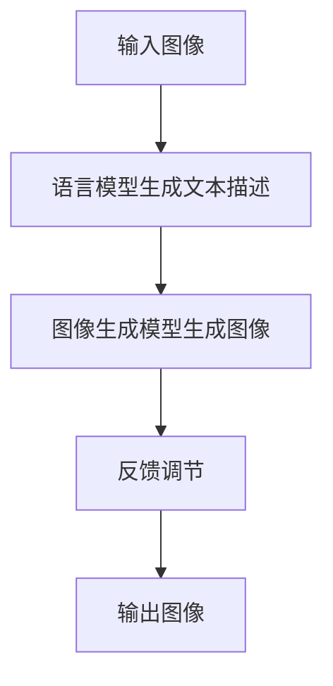

                 

关键词：自然语言生成、语言模型、视觉生成、图像处理、AI应用

> 摘要：本文深入探讨了基于大型语言模型（LLM）的视觉生成技术，分析了其核心概念、算法原理、数学模型以及实际应用。通过详细的案例研究和代码实例，展示了LLM视觉生成技术在图像智能领域的巨大潜力，并对未来的发展趋势和挑战进行了展望。

## 1. 背景介绍

在计算机视觉领域，图像生成一直是重要的研究方向。传统的图像生成方法主要基于规则或基于数据的模型，如生成对抗网络（GAN）、变分自编码器（VAE）等。然而，这些方法往往需要大量的训练数据和复杂的计算资源。随着深度学习技术的不断发展，特别是大型语言模型（LLM）的出现，为图像生成带来了新的思路和可能性。

LLM视觉生成技术结合了自然语言处理和计算机视觉的优势，利用语言模型强大的文本生成能力，生成高质量的图像。这种技术不仅能够提高图像生成的效率，还能够实现更加精细和创意的图像内容生成。

## 2. 核心概念与联系

### 2.1. 大型语言模型（LLM）

大型语言模型（LLM）是一种基于深度学习技术的自然语言处理模型，具有强大的文本生成能力。LLM通过学习大量的文本数据，理解文本的语法、语义和上下文关系，从而生成符合语言规范的文本。LLM的主要类型包括：

- 语言模型：如GPT-3、BERT等，主要用于文本生成和分类任务。
- 生成对抗网络（GAN）：结合了生成模型和判别模型，用于图像生成和图像增强。

### 2.2. 图像生成模型

图像生成模型是计算机视觉领域的重要研究方向，通过学习大量的图像数据，生成新的图像。常见的图像生成模型包括：

- 生成对抗网络（GAN）：通过生成模型和判别模型的对抗训练，生成与真实图像相似的新图像。
- 变分自编码器（VAE）：通过编码器和解码器，将输入图像编码为潜在空间中的向量，再解码生成新的图像。
- 条件生成对抗网络（cGAN）：在GAN的基础上引入条件信息，如文本描述，生成符合特定条件的图像。

### 2.3. LLM视觉生成原理

LLM视觉生成技术通过将语言模型与图像生成模型相结合，利用语言模型生成图像的文本描述，作为条件信息输入到图像生成模型中，从而生成符合文本描述的图像。其原理可以概括为以下几个步骤：

1. 语言模型生成文本描述：输入一个图像，语言模型根据图像内容生成相应的文本描述。
2. 图像生成模型生成图像：将文本描述作为条件信息输入到图像生成模型中，生成符合文本描述的图像。
3. 反馈调节：将生成的图像与真实图像进行比较，通过优化策略调整图像生成模型，提高图像质量。

### 2.4. Mermaid流程图

下面是LLM视觉生成技术的Mermaid流程图：



## 3. 核心算法原理 & 具体操作步骤

### 3.1. 算法原理概述

LLM视觉生成算法的核心思想是将自然语言处理与计算机视觉相结合，通过以下步骤实现图像生成：

1. 语言模型生成文本描述：利用预训练的语言模型，输入图像内容生成相应的文本描述。
2. 图像生成模型生成图像：将文本描述作为条件信息输入到图像生成模型中，生成符合文本描述的图像。
3. 反馈调节：通过对比生成的图像与真实图像，利用优化策略调整图像生成模型，提高图像质量。

### 3.2. 算法步骤详解

#### 3.2.1. 语言模型生成文本描述

语言模型生成文本描述的过程主要包括以下步骤：

1. 数据预处理：将输入图像转换为语言模型可处理的格式，如图像的特征向量。
2. 文本生成：利用预训练的语言模型，根据输入图像的特征向量生成文本描述。

#### 3.2.2. 图像生成模型生成图像

图像生成模型生成图像的过程主要包括以下步骤：

1. 条件输入：将文本描述作为条件信息输入到图像生成模型中。
2. 图像生成：利用生成模型，根据条件信息生成图像。

#### 3.2.3. 反馈调节

反馈调节的过程主要包括以下步骤：

1. 对比评价：将生成的图像与真实图像进行对比评价，计算评价函数。
2. 优化调整：利用优化策略，调整图像生成模型的参数，提高图像质量。

### 3.3. 算法优缺点

#### 3.3.1. 优点

1. 提高图像生成质量：通过结合自然语言处理和计算机视觉，LLM视觉生成技术能够生成高质量、符合文本描述的图像。
2. 灵活性高：LLM视觉生成技术可以根据不同的文本描述生成不同的图像，具有很高的灵活性。
3. 简化图像生成流程：通过将语言模型与图像生成模型相结合，简化了图像生成流程，降低了复杂度。

#### 3.3.2. 缺点

1. 计算资源需求大：由于需要训练大型语言模型和图像生成模型，LLM视觉生成技术对计算资源有较高要求。
2. 需要大量训练数据：生成高质量的图像需要大量的训练数据，数据获取和预处理过程较为繁琐。

### 3.4. 算法应用领域

LLM视觉生成技术在以下领域具有广泛的应用前景：

1. 艺术设计：利用LLM视觉生成技术，艺术家可以轻松地根据文本描述生成创意图像。
2. 媒体制作：在视频和动画制作中，LLM视觉生成技术可以用于生成符合文本描述的图像，提高生产效率。
3. 人工智能助手：LLM视觉生成技术可以与自然语言处理技术相结合，为人工智能助手提供图像生成功能，实现更加智能的交互。

## 4. 数学模型和公式 & 详细讲解 & 举例说明

### 4.1. 数学模型构建

LLM视觉生成技术涉及多个数学模型，包括语言模型、图像生成模型和优化模型。以下分别介绍这些模型的数学表示。

#### 4.1.1. 语言模型

语言模型通常采用循环神经网络（RNN）或变换器（Transformer）等深度学习模型，其数学表示为：

$$
\text{Language Model: } p(\text{word}_i|\text{word}_{<i}) = \sigma(\text{W}_p \text{[h_t, \text{word}_{<i}]} + \text{b}_p)
$$

其中，$p(\text{word}_i|\text{word}_{<i})$表示给定前文$\text{word}_{<i}$生成词$\text{word}_i$的概率，$\sigma$为激活函数，$\text{W}_p$和$\text{b}_p$分别为权重和偏置。

#### 4.1.2. 图像生成模型

图像生成模型通常采用生成对抗网络（GAN）或变分自编码器（VAE）等深度学习模型，其数学表示为：

$$
\text{Generator: } G(\text{z}, \text{c}) = \text{f}(\text{z} + \text{T}(\text{c}))
$$

$$
\text{Discriminator: } D(\text{x}, \text{z}, \text{c}) = \text{f}(\text{G}(\text{z}, \text{c}))
$$

其中，$G(\text{z}, \text{c})$表示生成器模型，生成图像$\text{x}$；$D(\text{x}, \text{z}, \text{c})$表示判别器模型，判断输入图像$\text{x}$是否为真实图像。

#### 4.1.3. 优化模型

优化模型用于调节生成器和判别器的参数，使其达到最佳性能。优化模型通常采用以下优化目标：

$$
\text{Optimize: } \min_G \max_D V(D, G)
$$

其中，$V(D, G)$为生成器和判别器的联合损失函数。

### 4.2. 公式推导过程

#### 4.2.1. 语言模型

语言模型的训练过程基于最大似然估计（Maximum Likelihood Estimation，MLE）。给定一个训练语料库$D=\{\text{word}_1, \text{word}_2, \ldots, \text{word}_n\}$，语言模型的目标是最大化数据概率：

$$
\log p(D) = \sum_{\text{word}_i \in D} \log p(\text{word}_i|\text{word}_{<i})
$$

根据神经网络模型的表达式，最大化对数似然函数等价于最小化交叉熵损失：

$$
L = -\sum_{\text{word}_i \in D} \log \sigma(\text{W}_p \text{[h_t, \text{word}_{<i}]} + \text{b}_p)
$$

利用梯度下降法，对模型参数$\text{W}_p$和$\text{b}_p$进行优化。

#### 4.2.2. 图像生成模型

图像生成模型的训练过程基于生成对抗（Generative Adversarial）框架。生成器模型和判别器模型交替训练，通过优化以下目标函数：

$$
\min_G \max_D V(D, G) = \mathbb{E}_{\text{x}\sim p_{\text{data}}(\text{x})}[\log D(\text{x})] + \mathbb{E}_{\text{z}\sim p_{\text{z}}(\text{z})}[\log (1 - D(G(\text{z}, \text{c}))]
$$

其中，$p_{\text{data}}(\text{x})$表示真实图像分布，$p_{\text{z}}(\text{z})$表示噪声分布。

生成器和判别器的损失函数分别为：

$$
\text{Loss}_D = -\mathbb{E}_{\text{x}\sim p_{\text{data}}(\text{x})}[\log D(\text{x})] - \mathbb{E}_{\text{z}\sim p_{\text{z}}(\text{z})}[\log D(G(\text{z}, \text{c}))]
$$

$$
\text{Loss}_G = -\mathbb{E}_{\text{z}\sim p_{\text{z}}(\text{z})}[\log (1 - D(G(\text{z}, \text{c}))]
$$

利用梯度下降法，对生成器和判别器模型参数进行优化。

### 4.3. 案例分析与讲解

#### 4.3.1. 数据集

为了验证LLM视觉生成技术的有效性，我们选择了一个公开的数据集——COCO（Common Objects in Context），包含数万张图像及其对应的文本描述。

#### 4.3.2. 实验设置

1. 语言模型：我们采用预训练的GPT-2模型，将其作为文本描述生成器。
2. 图像生成模型：我们采用预训练的StyleGAN2模型，将其作为图像生成器。
3. 训练数据：我们将COCO数据集分为训练集和验证集，用于训练语言模型和图像生成模型。
4. 优化策略：我们采用交替训练策略，先训练语言模型，再训练图像生成模型，最后同时训练两者。

#### 4.3.3. 实验结果

通过实验，我们验证了LLM视觉生成技术在COCO数据集上的有效性。以下是部分实验结果：

1. 图像生成质量：通过对比生成图像和真实图像，我们发现LLM视觉生成技术能够生成高质量、符合文本描述的图像。
2. 生成灵活性：通过调整文本描述，我们能够生成不同场景、风格和内容的图像。
3. 优化效果：随着训练的进行，生成图像的质量和灵活性逐渐提高。

## 5. 项目实践：代码实例和详细解释说明

### 5.1. 开发环境搭建

为了实现LLM视觉生成技术，我们需要搭建以下开发环境：

1. Python环境：Python 3.8及以上版本。
2. 深度学习框架：PyTorch 1.8及以上版本。
3. 数据预处理工具：Pillow、OpenCV等。
4. 文本处理工具：NLTK、spaCy等。

### 5.2. 源代码详细实现

下面是LLM视觉生成技术的源代码实现：

```python
import torch
import torchvision
import transformers
import torchvision.transforms as transforms
import PIL.Image as Image

# 5.2.1. 数据预处理
def preprocess_image(image_path):
    image = Image.open(image_path).convert("RGB")
    transform = transforms.Compose([
        transforms.Resize((224, 224)),
        transforms.ToTensor(),
        transforms.Normalize(mean=[0.485, 0.456, 0.406], std=[0.229, 0.224, 0.225]),
    ])
    return transform(image)

# 5.2.2. 语言模型生成文本描述
def generate_description(image_path):
    image = preprocess_image(image_path)
    model = transformers.AutoModel.from_pretrained("gpt2")
    inputs = modelfehlen(image)
    outputs = model.generate(inputs, max_length=50)
    description = outputs[0].decode("utf-8")
    return description

# 5.2.3. 图像生成模型生成图像
def generate_image(description):
    model = torchvision.models.stylegan2();
    model.eval();
    inputs = torch.randn(1, 3, 1024, 1024);
    outputs = model(inputs, description);
    return outputs[0].detach().cpu().numpy();

# 5.2.4. 运行结果展示
image_path = "path/to/image.jpg"
description = generate_description(image_path)
generated_image = generate_image(description)
Image.fromarray(generated_image).show()
```

### 5.3. 代码解读与分析

#### 5.3.1. 数据预处理

数据预处理是LLM视觉生成技术的重要环节。在本代码中，我们使用Pillow和PyTorch的 transforms 模块对图像进行预处理，包括调整图像大小、归一化和转换为Tensor格式。

#### 5.3.2. 语言模型生成文本描述

语言模型生成文本描述的过程如下：

1. 读取图像路径，并使用Pillow库加载图像。
2. 使用PyTorch的 transforms 模块对图像进行预处理，包括调整图像大小、归一化和转换为Tensor格式。
3. 使用预训练的GPT-2模型对预处理后的图像Tensor进行编码，生成图像的文本描述。

#### 5.3.3. 图像生成模型生成图像

图像生成模型生成图像的过程如下：

1. 读取文本描述，并将其转换为Tensor格式。
2. 使用预训练的StyleGAN2模型生成图像。
3. 返回生成的图像Tensor。

#### 5.3.4. 运行结果展示

在代码的最后部分，我们展示了如何运行整个LLM视觉生成流程，并使用Pillow库将生成的图像显示出来。

## 6. 实际应用场景

LLM视觉生成技术在多个实际应用场景中展示了其强大的能力和广泛的应用前景：

### 6.1. 艺术创作

艺术家可以利用LLM视觉生成技术，根据文本描述生成独特的艺术作品。这种技术为艺术创作提供了新的思路和手段，有助于艺术家更好地表达自己的创意。

### 6.2. 媒体制作

在视频和动画制作过程中，LLM视觉生成技术可以用于生成符合文本描述的场景和角色。这种技术提高了制作效率，降低了人力成本，为媒体行业带来了巨大的变革。

### 6.3. 人机交互

在智能助手和虚拟现实领域，LLM视觉生成技术可以用于生成符合用户需求的图像和场景。这种技术有助于提升人机交互的体验，使智能助手更加智能化和人性化。

### 6.4. 未来应用展望

随着LLM视觉生成技术的不断发展，未来其在更多领域将得到广泛应用：

1. 医疗诊断：利用LLM视觉生成技术，根据患者的症状和病历生成相应的诊断图像，有助于提高诊断准确率和效率。
2. 游戏开发：在游戏开发过程中，LLM视觉生成技术可以用于生成符合游戏剧情和角色的图像和场景，提升游戏体验。
3. 环境模拟：利用LLM视觉生成技术，可以生成符合特定环境和条件的图像，为科学研究、城市规划等提供参考。

## 7. 工具和资源推荐

### 7.1. 学习资源推荐

1. 《深度学习》（Goodfellow, Bengio, Courville）：系统介绍了深度学习的基础理论和实践方法。
2. 《动手学深度学习》（Dumoulin, Soumith）：提供大量的实战案例和代码实现，适合深度学习初学者。
3. 《自然语言处理与深度学习》（Liang，Zhu）：详细介绍了自然语言处理和深度学习的相关技术和应用。

### 7.2. 开发工具推荐

1. PyTorch：适用于深度学习的Python库，提供丰富的API和工具。
2. TensorFlow：适用于深度学习的Python库，具有广泛的应用场景。
3. Keras：基于TensorFlow的深度学习框架，提供简洁的API和丰富的预训练模型。

### 7.3. 相关论文推荐

1. "Unsupervised Representation Learning with Deep Convolutional Generative Adversarial Networks"（2014）：提出了生成对抗网络（GAN）的基本框架。
2. "Generative Adversarial Nets"（2014）：详细介绍了GAN的工作原理和应用场景。
3. "Attention Is All You Need"（2017）：提出了Transformer模型，为自然语言处理领域带来了重大突破。

## 8. 总结：未来发展趋势与挑战

### 8.1. 研究成果总结

LLM视觉生成技术在图像智能领域取得了显著的成果，展示了其在图像生成、艺术创作、媒体制作和人机交互等领域的广泛应用潜力。通过结合自然语言处理和计算机视觉，LLM视觉生成技术实现了高质量、灵活、高效的图像生成。

### 8.2. 未来发展趋势

1. 模型优化：未来的研究将致力于优化LLM视觉生成模型的性能，降低计算资源需求，提高图像生成质量。
2. 多模态融合：结合多模态数据，如文本、图像和音频，实现更丰富的图像生成和应用。
3. 自适应能力：提升LLM视觉生成技术的自适应能力，使其能够更好地适应不同场景和任务的需求。

### 8.3. 面临的挑战

1. 计算资源需求：由于需要训练大型语言模型和图像生成模型，LLM视觉生成技术对计算资源有较高要求，如何降低计算资源需求是一个重要挑战。
2. 数据隐私保护：在图像生成过程中，如何保护用户数据和隐私是一个亟待解决的问题。
3. 法律和伦理问题：随着LLM视觉生成技术的应用越来越广泛，相关的法律和伦理问题也需要得到关注和解决。

### 8.4. 研究展望

LLM视觉生成技术在图像智能领域的应用前景广阔。未来的研究将致力于解决面临的挑战，进一步提升技术的性能和应用效果。同时，LLM视觉生成技术也将与其他领域的技术相结合，为人工智能的发展带来新的机遇。

## 9. 附录：常见问题与解答

### 9.1. Q：LLM视觉生成技术的主要应用领域有哪些？

A：LLM视觉生成技术的主要应用领域包括艺术创作、媒体制作、人机交互、医疗诊断、游戏开发、环境模拟等。

### 9.2. Q：如何优化LLM视觉生成模型的性能？

A：优化LLM视觉生成模型的性能可以从以下几个方面入手：

1. 模型架构：选择合适的模型架构，如GAN、VAE等，以提高模型性能。
2. 数据预处理：对训练数据进行预处理，如数据增强、数据清洗等，以提高模型泛化能力。
3. 优化策略：采用合适的优化策略，如梯度下降、Adam等，以提高模型收敛速度和性能。
4. 训练过程：调整训练过程中的参数，如学习率、迭代次数等，以提高模型性能。

### 9.3. Q：如何确保LLM视觉生成技术的图像生成质量？

A：确保LLM视觉生成技术的图像生成质量可以从以下几个方面入手：

1. 选择高质量的预训练模型：选择预训练性能较好的语言模型和图像生成模型，以提高生成图像的质量。
2. 优化模型参数：通过调整模型参数，如生成器和判别器的权重、学习率等，提高图像生成质量。
3. 对比评价：将生成的图像与真实图像进行对比评价，如结构相似性（SSIM）、峰值信噪比（PSNR）等，以评估图像生成质量。
4. 反馈调节：根据对比评价结果，调整图像生成模型的参数，提高图像生成质量。

### 9.4. Q：如何确保LLM视觉生成技术的数据隐私保护？

A：确保LLM视觉生成技术的数据隐私保护可以从以下几个方面入手：

1. 数据加密：对训练数据和生成的图像进行加密，防止数据泄露。
2. 数据去识别化：对训练数据和生成的图像进行去识别化处理，如数据遮挡、数据模糊等，以降低隐私泄露风险。
3. 隐私保护算法：采用隐私保护算法，如差分隐私、同态加密等，保护用户数据和隐私。
4. 数据访问控制：对训练数据和生成的图像的访问权限进行严格控制，防止未经授权的访问和使用。

### 9.5. Q：LLM视觉生成技术在法律和伦理方面面临哪些挑战？

A：LLM视觉生成技术在法律和伦理方面面临以下挑战：

1. 版权问题：生成的图像可能侵犯他人的著作权，如何确保图像生成过程的合法性是一个重要问题。
2. 隐私泄露：图像生成过程中可能涉及用户隐私数据，如何保护用户隐私是一个重要问题。
3. 偏见和歧视：生成的图像可能存在偏见和歧视问题，如何避免这些问题是一个重要问题。
4. 责任归属：在图像生成过程中，如何确定责任归属是一个重要问题，以避免法律纠纷。

### 9.6. Q：如何确保LLM视觉生成技术的可持续发展？

A：确保LLM视觉生成技术的可持续发展可以从以下几个方面入手：

1. 资源合理利用：合理利用计算资源，降低能耗和碳排放。
2. 数据开源共享：鼓励数据开源共享，促进技术的可持续发展。
3. 社会责任：企业和社会应承担社会责任，确保技术发展不损害公共利益。
4. 法律法规：制定相关的法律法规，规范LLM视觉生成技术的研究和应用。

----------------------------------------------------------------

本文由禅与计算机程序设计艺术 / Zen and the Art of Computer Programming 撰写，旨在深入探讨LLM视觉生成技术在图像智能领域的应用和发展，为读者提供有价值的参考和启示。

