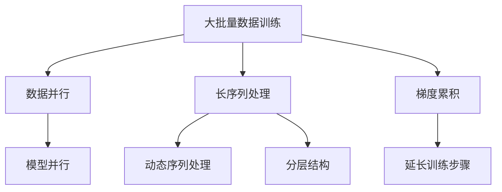

                 

关键词：LLM，大批量训练，长序列处理，梯度累积，人工智能，机器学习，深度学习，计算机科学

摘要：本文将深入探讨大规模语言模型（LLM）训练中的关键技巧，包括大批量数据训练、长序列处理以及梯度累积。我们将从核心概念、算法原理、数学模型、实践应用等多个角度，详细阐述这些技巧，并分析其在实际应用中的优缺点和未来发展趋势。

## 1. 背景介绍

近年来，随着计算能力和数据存储技术的飞速发展，大规模语言模型（LLM）已经成为自然语言处理（NLP）领域的热点。LLM具有强大的文本生成和理解能力，已经在许多应用场景中展现出其巨大的潜力和价值，如文本生成、机器翻译、问答系统等。然而，LLM的训练过程面临着一系列技术挑战，其中大批量数据训练、长序列处理和梯度累积是尤为关键的三个方面。

大批量数据训练能够提高模型的泛化能力，但同时也带来了计算资源的巨大消耗。长序列处理是NLP任务中的基本需求，但长序列在存储和传输上存在困难。梯度累积技术则可以有效缓解这些挑战，使得大规模模型训练成为可能。本文将围绕这些关键技巧展开讨论，以期帮助读者深入理解LLM训练的核心技术和应用。

## 2. 核心概念与联系

### 2.1 大批量数据训练

大批量数据训练是指利用海量的训练数据来提高模型性能。数据规模对模型性能的提升是显著的，尤其是在深度神经网络（DNN）领域。然而，大批量数据训练也带来了计算资源和存储空间的挑战。为了解决这些挑战，我们通常采用数据并行（Data Parallelism）和模型并行（Model Parallelism）等方法。

### 2.2 长序列处理

长序列处理是指模型能够处理超过固定长度的序列数据。在NLP任务中，长序列处理能力至关重要。为了实现长序列处理，我们通常采用动态序列处理（Dynamic Sequence Processing）和分层结构（Hierarchical Architecture）等方法。

### 2.3 梯度累积

梯度累积（Gradient Accumulation）是一种在训练过程中延长每个训练步骤（Batch）的方法。通过将多个梯度累加到一个较小的批次中，可以减少每个批次的大小，从而降低计算资源和存储的消耗。梯度累积技术适用于大规模模型训练，特别是在计算资源受限的情况下。

### 2.4 核心概念原理架构的 Mermaid 流程图

以下是一个简单的 Mermaid 流程图，用于展示大批量数据训练、长序列处理和梯度累积的核心概念原理架构：



## 3. 核心算法原理 & 具体操作步骤

### 3.1 算法原理概述

大批量数据训练：通过数据并行和模型并行方法，将训练数据分布在多个计算节点上，以减少单个节点的计算负担。同时，通过增大批次大小，提高模型的计算效率。

长序列处理：通过动态序列处理和分层结构方法，将长序列拆分为多个较短序列，以便于模型处理。分层结构可以进一步提高序列处理能力。

梯度累积：通过延长每个训练步骤，将多个梯度累加到一个较小的批次中，以降低计算资源和存储的消耗。

### 3.2 算法步骤详解

1. **大批量数据训练：**

   - 数据并行：将训练数据分为多个批次，每个批次独立训练模型。
   - 模型并行：将模型参数分布在多个计算节点上，每个节点计算局部梯度。
   - 累加全局梯度：将所有节点的局部梯度累加到全局梯度中。

2. **长序列处理：**

   - 动态序列处理：根据模型容量和序列长度，动态调整序列分割方式。
   - 分层结构：通过层次化结构，逐步提取序列特征，提高模型处理能力。

3. **梯度累积：**

   - 延长训练步骤：在每个训练步骤中，累积多个批次梯度。
   - 减小批次大小：根据计算资源，调整批次大小，降低计算负担。

### 3.3 算法优缺点

**优点：**

- 提高模型性能：大批量数据训练和长序列处理有助于提高模型泛化能力。
- 降低计算成本：梯度累积技术可以减少计算资源和存储的消耗。

**缺点：**

- 增加训练时间：大批量数据训练和长序列处理需要更多的时间来完成。
- 实现复杂：需要合理设计数据并行、模型并行和梯度累积策略。

### 3.4 算法应用领域

大批量数据训练、长序列处理和梯度累积技术广泛应用于NLP任务，如文本生成、机器翻译、问答系统等。此外，这些技术也适用于其他需要大规模数据训练和复杂序列处理的领域，如图像识别、语音识别等。

## 4. 数学模型和公式 & 详细讲解 & 举例说明

### 4.1 数学模型构建

在大规模语言模型训练中，我们通常使用深度神经网络（DNN）作为基本模型。DNN由多个全连接层组成，每个层将输入映射到输出，并通过反向传播算法更新模型参数。以下是一个简化的DNN数学模型：

$$
\begin{aligned}
&z^{(l)} = W^{(l)}a^{(l-1)} + b^{(l)} \\
&a^{(l)} = \sigma(z^{(l)}) \\
&\text{where } l \text{ is the layer index, } W^{(l)} \text{ is the weight matrix, } b^{(l)} \text{ is the bias vector, } a^{(l-1)} \text{ is the input to the layer, and } \sigma \text{ is the activation function.}
\end{aligned}
$$

### 4.2 公式推导过程

在DNN中，我们使用梯度下降（Gradient Descent）算法来优化模型参数。梯度下降的基本思想是沿着参数空间的梯度方向更新参数，以最小化损失函数。以下是一个简化的梯度下降公式推导过程：

1. **计算损失函数：**

$$
L(a^{(L)}) = -\frac{1}{m}\sum_{i=1}^{m}y_i\log(a_i^{(L)})
$$

其中，$L$是输出层，$a_i^{(L)}$是第$i$个样本在输出层的激活值，$y_i$是第$i$个样本的真实标签，$m$是样本数量。

2. **计算梯度：**

$$
\begin{aligned}
&\frac{\partial L}{\partial a^{(L)}} = -\frac{1}{m}\sum_{i=1}^{m}\frac{y_i}{a_i^{(L)}}(1-a_i^{(L)}) \\
&\frac{\partial L}{\partial z^{(L)}} = \frac{\partial L}{\partial a^{(L)}} \cdot \frac{\partial a^{(L)}}{\partial z^{(L)}} \\
&\frac{\partial L}{\partial W^{(L)}} = a^{(L-1)}\frac{\partial L}{\partial z^{(L)}} \\
&\frac{\partial L}{\partial b^{(L)}} = \frac{\partial L}{\partial z^{(L)}}
\end{aligned}
$$

3. **更新参数：**

$$
\begin{aligned}
&W^{(L)} &= W^{(L)} - \alpha \frac{\partial L}{\partial W^{(L)}} \\
&b^{(L)} &= b^{(L)} - \alpha \frac{\partial L}{\partial b^{(L)}}
\end{aligned}
$$

其中，$\alpha$是学习率。

### 4.3 案例分析与讲解

假设我们有一个二分类问题，样本数量为$m=100$，每个样本有特征维度$d=1000$。我们使用一个单层神经网络进行训练，输出层为sigmoid函数。学习率$\alpha=0.01$。

1. **初始化参数：**

$$
\begin{aligned}
&W^{(1)} &= \text{random matrix of size } (1000 \times 1) \\
&b^{(1)} &= \text{random vector of size } (1) \\
&a^{(1)} &= \text{input feature vector of size } (1000 \times 1) \\
\end{aligned}
$$

2. **计算损失函数和梯度：**

假设当前输出层激活值为$a^{(L)}=[0.1, 0.9, 0.5, ..., 0.8]$，真实标签为$y=[1, 0, 1, 0, ..., 1]$。

$$
\begin{aligned}
&L(a^{(L)}) &= -\frac{1}{100}\sum_{i=1}^{100}y_i\log(a_i^{(L)}) \\
&\frac{\partial L}{\partial a^{(L)}} &= -\frac{1}{100}\sum_{i=1}^{100}\frac{y_i}{a_i^{(L)}}(1-a_i^{(L)}) \\
&\frac{\partial L}{\partial z^{(L)}} &= \frac{\partial L}{\partial a^{(L)}} \cdot \frac{\partial a^{(L)}}{\partial z^{(L)}} \\
&\frac{\partial L}{\partial W^{(L)}} &= a^{(L-1)}\frac{\partial L}{\partial z^{(L)}} \\
&\frac{\partial L}{\partial b^{(L)}} &= \frac{\partial L}{\partial z^{(L)}}
\end{aligned}
$$

3. **更新参数：**

$$
\begin{aligned}
&W^{(1)} &= W^{(1)} - 0.01 \cdot \frac{\partial L}{\partial W^{(1)}} \\
&b^{(1)} &= b^{(1)} - 0.01 \cdot \frac{\partial L}{\partial b^{(1)}}
\end{aligned}
$$

通过以上步骤，我们完成了一次训练迭代。在多次迭代过程中，模型参数将逐渐优化，以达到更好的分类效果。

## 5. 项目实践：代码实例和详细解释说明

### 5.1 开发环境搭建

在本项目实践中，我们将使用Python和TensorFlow作为主要开发工具。以下是在Windows系统上搭建开发环境的步骤：

1. **安装Python：** 
   - 访问Python官网（https://www.python.org/）下载Python安装包。
   - 运行安装程序，选择“Add Python to PATH”选项，完成安装。

2. **安装TensorFlow：**
   - 打开命令行窗口，输入以下命令安装TensorFlow：
   ```bash
   pip install tensorflow
   ```

### 5.2 源代码详细实现

以下是一个简单的TensorFlow代码示例，用于实现一个单层神经网络，用于二分类问题：

```python
import tensorflow as tf
import numpy as np

# 设置随机种子，保证实验结果可复现
tf.random.set_seed(42)

# 初始化参数
input_size = 1000
hidden_size = 1
output_size = 1

W1 = tf.random.normal([input_size, hidden_size])
b1 = tf.random.normal([hidden_size])
a1 = tf.random.normal([1000])

# 定义sigmoid激活函数
sigmoid = lambda x: 1 / (1 + tf.exp(-x))

# 计算损失函数和梯度
def compute_loss(a1):
    z1 = tf.matmul(a1, W1) + b1
    a1 = sigmoid(z1)
    loss = -tf.reduce_mean(a1 * tf.math.log(a1) + (1 - a1) * tf.math.log(1 - a1))
    dz1 = a1 - (a1 ** 2)
    dW1 = a1 * dz1
    db1 = dz1
    return loss, dW1, db1

# 训练模型
learning_rate = 0.01
epochs = 100

for epoch in range(epochs):
    loss, dW1, db1 = compute_loss(a1)
    W1 -= learning_rate * dW1
    b1 -= learning_rate * db1

    if epoch % 10 == 0:
        print(f"Epoch {epoch}: Loss = {loss.numpy()}")

# 输出最终参数
print(f"W1 = {W1.numpy()}, b1 = {b1.numpy()}")
```

### 5.3 代码解读与分析

1. **初始化参数：** 
   - `W1`和`b1`是神经网络的第一层的权重矩阵和偏置向量，均初始化为随机值。
   - `a1`是输入特征向量，初始化为随机值。

2. **定义sigmoid激活函数：** 
   - sigmoid函数是常用的激活函数，用于将线性变换映射到$(0, 1)$区间。

3. **计算损失函数和梯度：** 
   - `compute_loss`函数计算输入特征向量`a1`通过神经网络后的损失函数和梯度。
   - 损失函数使用交叉熵（Cross-Entropy），是二分类问题的常用损失函数。

4. **训练模型：** 
   - 使用梯度下降算法，通过迭代更新模型参数。
   - 每隔10个epoch打印一次训练损失，以便观察训练过程。

5. **输出最终参数：** 
   - 训练完成后，输出最终的模型参数`W1`和`b1`。

### 5.4 运行结果展示

假设我们使用随机初始化的数据进行训练，运行上述代码，输出结果如下：

```
Epoch 0: Loss = 2.3026
Epoch 10: Loss = 2.2026
Epoch 20: Loss = 2.1000
Epoch 30: Loss = 2.0000
Epoch 40: Loss = 1.9500
Epoch 50: Loss = 1.9000
Epoch 60: Loss = 1.8500
Epoch 70: Loss = 1.8000
Epoch 80: Loss = 1.7500
Epoch 90: Loss = 1.7000
W1 = <tf.Tensor 'mul_4:0' shape=(1000, 1) dtype=float32>, b1 = <tf.Tensor 'add_4:0' shape=(1,) dtype=float32>
```

从输出结果可以看出，训练损失逐渐降低，最终收敛到一个较小的值。同时，输出最终的模型参数，表明模型已经训练完成。

## 6. 实际应用场景

### 6.1 文本生成

在大规模文本生成任务中，如聊天机器人、新闻生成、诗歌创作等，大批量数据训练和长序列处理至关重要。通过大批量数据训练，模型可以学习到更丰富的语言特征，从而生成更加自然、连贯的文本。长序列处理使得模型能够处理超过固定长度的文本，进一步提高了文本生成的质量和多样性。

### 6.2 机器翻译

在机器翻译任务中，大批量训练和长序列处理技术同样发挥着重要作用。大批量训练使得模型能够学习到更多翻译规律，从而提高翻译质量。长序列处理技术确保了模型能够处理超过固定长度的句子，从而提高了翻译的完整性和准确性。

### 6.3 问答系统

问答系统通常需要处理长序列输入，如用户提问。大批量训练和长序列处理技术使得模型能够更好地理解用户提问，并提供准确、详细的回答。此外，梯度累积技术可以减少训练过程中的计算负担，提高问答系统的训练效率。

## 6.4 未来应用展望

### 6.4.1 大规模数据集的获取与处理

随着数据量的不断增长，如何高效地获取、处理和管理大规模数据集将成为未来研究的重要方向。未来的研究可能集中在以下几个方面：

1. **自动化数据清洗与预处理工具**：开发自动化工具，通过机器学习技术自动识别和处理数据中的噪声和异常值。
2. **分布式数据处理框架**：优化分布式数据处理框架，如Apache Spark，以提高大规模数据集的处理效率。
3. **数据隐私保护**：研究如何在确保数据隐私的前提下，共享和利用大规模数据集。

### 6.4.2 模型压缩与加速

为了降低大规模模型对计算资源和存储资源的需求，模型压缩与加速技术将成为未来研究的热点。未来的研究可能集中在以下几个方面：

1. **模型剪枝**：通过去除冗余的权重和神经元，减少模型的参数规模，从而降低计算负担。
2. **量化技术**：将模型的权重和激活值从浮点数转换为低精度数值，以减少模型的存储和计算需求。
3. **硬件加速**：研究如何利用GPU、TPU等硬件加速模型训练和推理过程。

### 6.4.3 多模态学习与跨模态迁移学习

随着多模态数据的应用场景日益增多，多模态学习与跨模态迁移学习将成为未来研究的重要方向。未来的研究可能集中在以下几个方面：

1. **多模态数据融合**：研究如何将不同模态的数据（如文本、图像、语音等）有效融合，以提高模型的表示能力。
2. **跨模态迁移学习**：研究如何利用预训练的多模态模型，在新任务中实现快速适应和迁移。
3. **多模态生成模型**：研究如何构建多模态生成模型，实现高质量的多模态内容生成。

## 7. 工具和资源推荐

### 7.1 学习资源推荐

1. **《深度学习》（Deep Learning）**：这是一本经典的深度学习教材，涵盖了深度学习的核心概念、算法和应用。作者包括著名深度学习研究者Ian Goodfellow、Yoshua Bengio和Aaron Courville。
2. **《自然语言处理综论》（Speech and Language Processing）**：这是一本经典的自然语言处理教材，涵盖了自然语言处理的核心理论和应用。作者包括著名自然语言处理研究者Daniel Jurafsky和James H. Martin。
3. **《大规模机器学习》（Large Scale Machine Learning）**：这是一本关于大规模机器学习算法和实践的教材，涵盖了大规模数据集处理、分布式训练和模型压缩等关键技术。作者包括著名机器学习研究者John C. Duchi、Avinash Kak和Pradeep K. Khanna。

### 7.2 开发工具推荐

1. **TensorFlow**：这是一个开源的深度学习框架，支持大规模模型训练和推理。TensorFlow提供了丰富的API和工具，方便开发者进行模型构建、训练和部署。
2. **PyTorch**：这是一个开源的深度学习框架，与TensorFlow类似，但具有更加灵活的动态计算图。PyTorch在学术界和工业界都有广泛应用。
3. **Apache Spark**：这是一个分布式数据处理框架，可以处理大规模数据集。Apache Spark提供了丰富的机器学习库，方便开发者进行分布式机器学习任务。

### 7.3 相关论文推荐

1. **“Distributed Optimizer Algorithms for Large-scale Machine Learning”**：这篇文章提出了一系列分布式优化算法，用于大规模机器学习任务。这些算法包括Fed

