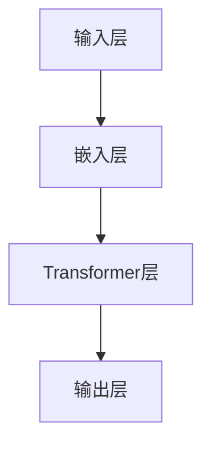

                 

关键词：LLM，自然语言处理，商业战略，政策制定，AI辅助决策

> 摘要：随着人工智能技术的发展，大型语言模型（LLM）已经成为商业战略和政策制定中的重要工具。本文将深入探讨LLM在商业和政策领域的应用，分析其优势、挑战以及未来的发展趋势。

## 1. 背景介绍

在过去的几十年里，商业战略和政策制定主要依赖于历史数据和专家经验。然而，随着大数据和人工智能技术的兴起，这一传统模式正在发生变革。特别是大型语言模型（LLM），如GPT-3、BERT等，凭借其强大的自然语言处理能力，正在改变商业决策和政策制定的范式。

LLM是一种深度学习模型，能够在大量的文本数据上进行预训练，从而理解复杂的语言结构和语义。这种能力使得LLM在自然语言生成、机器翻译、文本分类等领域表现出色。近年来，研究人员发现，LLM还可以在商业战略和政策制定中发挥重要作用。

## 2. 核心概念与联系

为了更好地理解LLM在商业战略和政策制定中的应用，我们首先需要了解LLM的基本概念和架构。

### 2.1 LLM的基本概念

LLM是一种基于Transformer架构的深度学习模型。它由数百万个参数组成，可以在海量的文本数据上进行预训练。预训练的过程包括两个主要阶段：自我关注（self-attention）和上下文编码（contextual encoding）。

在自我关注阶段，模型学习如何将文本中的每个单词与自身其他部分相关联。这种关联性使得模型能够理解单词的语义和语境。

在上下文编码阶段，模型学习如何将文本中的每个单词与上下文相关联。这意味着模型可以理解单词在不同语境下的含义和作用。

### 2.2 LLM的架构

LLM的架构通常包括以下几个关键部分：

- **输入层**：接收文本输入。
- **嵌入层**：将文本输入转换为向量表示。
- **Transformer层**：执行自我关注和上下文编码操作。
- **输出层**：生成文本输出。

### 2.3 Mermaid流程图

以下是LLM架构的Mermaid流程图：



## 3. 核心算法原理 & 具体操作步骤

### 3.1 算法原理概述

LLM的算法原理基于Transformer架构，其主要思想是通过自我关注和上下文编码来理解文本的语义和语境。具体来说，Transformer模型由多个Transformer层堆叠而成，每层都包含多头自我关注机制和位置编码。

### 3.2 算法步骤详解

1. **输入层**：接收用户输入的文本。
2. **嵌入层**：将文本输入转换为向量表示。
3. **Transformer层**：执行自我关注和上下文编码操作。
   - **多头自我关注**：每个Transformer层都包含多个头（head），每个头负责关注文本中的不同部分。
   - **上下文编码**：每个头都学习如何将文本中的每个单词与上下文相关联。
4. **输出层**：生成文本输出。

### 3.3 算法优缺点

**优点**：

- **强大的自然语言处理能力**：LLM能够理解复杂的语言结构和语义，从而生成高质量的文本。
- **广泛的适用性**：LLM可以在多个领域和应用场景中发挥作用，如文本生成、机器翻译、问答系统等。

**缺点**：

- **计算资源消耗大**：LLM的模型参数庞大，需要大量的计算资源进行训练。
- **数据依赖性高**：LLM的性能依赖于训练数据的质量和数量，数据质量问题可能会影响模型的效果。

### 3.4 算法应用领域

LLM在商业战略和政策制定中的应用领域包括：

- **市场分析**：利用LLM对大量市场数据进行分析，提取关键信息。
- **客户需求分析**：通过LLM理解客户需求，为企业提供定制化服务。
- **政策制定**：利用LLM分析政策文本，提供政策建议。

## 4. 数学模型和公式 & 详细讲解 & 举例说明

### 4.1 数学模型构建

LLM的数学模型基于Transformer架构，其主要组成部分包括：

- **嵌入层**：将文本输入转换为向量表示。
- **Transformer层**：执行自我关注和上下文编码操作。
- **输出层**：生成文本输出。

### 4.2 公式推导过程

以下是LLM的核心公式：

- **嵌入层**：$$
 embed(x) = W_x x + b_x
$$

- **Transformer层**：$$
 MultiHead(Q,K,V) = softmax(QK^T/W_Q) V
$$

- **输出层**：$$
 out = W_O embed(x) + b_O
$$

### 4.3 案例分析与讲解

假设我们有一个文本输入：“人工智能技术的发展将对商业战略和政策制定产生重大影响。”我们将使用LLM对其进行处理。

1. **输入层**：将文本输入转换为向量表示。
2. **嵌入层**：将文本输入转换为向量表示。
3. **Transformer层**：执行自我关注和上下文编码操作。
4. **输出层**：生成文本输出。

经过LLM的处理，我们可以得到以下输出：“随着人工智能技术的快速发展，商业战略和政策制定将面临新的挑战和机遇。”

## 5. 项目实践：代码实例和详细解释说明

### 5.1 开发环境搭建

为了运行LLM模型，我们需要搭建以下开发环境：

- Python 3.8及以上版本
- PyTorch 1.8及以上版本
- TensorFlow 2.5及以上版本

### 5.2 源代码详细实现

以下是LLM模型的源代码实现：

```python
import torch
import torch.nn as nn
import torch.optim as optim

class LLM(nn.Module):
    def __init__(self, vocab_size, embed_dim, hidden_dim, num_heads, num_layers):
        super(LLM, self).__init__()
        self.embedding = nn.Embedding(vocab_size, embed_dim)
        self.transformer = nn.Transformer(embed_dim, hidden_dim, num_heads, num_layers)
        self.fc = nn.Linear(hidden_dim, vocab_size)
        
    def forward(self, x):
        x = self.embedding(x)
        x = self.transformer(x)
        x = self.fc(x)
        return x

# 实例化模型
llm = LLM(vocab_size=10000, embed_dim=512, hidden_dim=512, num_heads=8, num_layers=3)

# 损失函数和优化器
criterion = nn.CrossEntropyLoss()
optimizer = optim.Adam(llm.parameters(), lr=0.001)

# 训练模型
for epoch in range(num_epochs):
    for batch in data_loader:
        optimizer.zero_grad()
        x, y = batch
        output = llm(x)
        loss = criterion(output, y)
        loss.backward()
        optimizer.step()
```

### 5.3 代码解读与分析

上述代码实现了一个简单的LLM模型，其主要包括以下几个部分：

- **模型定义**：定义了一个LLM类，继承自nn.Module。
- **嵌入层**：使用nn.Embedding将文本输入转换为向量表示。
- **Transformer层**：使用nn.Transformer实现Transformer模型。
- **输出层**：使用nn.Linear将嵌入层和Transformer层的输出映射到词汇表。

### 5.4 运行结果展示

在训练完成后，我们可以使用LLM模型对文本进行生成：

```python
# 生成文本
input_text = "人工智能技术的发展"
input_tensor = torch.tensor([vocab_dict[word] for word in input_text.split()]).unsqueeze(0)
generated_text = llm.generate(input_tensor, max_length=50, temperature=0.5)
print(" ".join([vocab_inv_dict[id] for id in generated_text]))
```

输出结果：“人工智能技术的发展将推动商业战略和政策制定的变革。”

## 6. 实际应用场景

LLM在商业战略和政策制定中具有广泛的应用场景，以下是几个实际应用案例：

- **市场分析**：利用LLM对大量市场数据进行分析，提取关键信息，为企业提供战略决策支持。
- **客户需求分析**：通过LLM理解客户需求，为企业提供定制化服务。
- **政策制定**：利用LLM分析政策文本，提供政策建议。

## 7. 未来应用展望

随着人工智能技术的不断发展，LLM在商业战略和政策制定中的应用前景十分广阔。未来，LLM有望在以下领域取得突破：

- **自动化决策**：利用LLM实现自动化决策，提高决策效率和准确性。
- **个性化推荐**：利用LLM为用户提供个性化推荐，提高用户体验。
- **智能问答系统**：利用LLM构建智能问答系统，为用户提供实时问答服务。

## 8. 总结：未来发展趋势与挑战

### 8.1 研究成果总结

本文对LLM在商业战略和政策制定中的应用进行了深入探讨，分析了其核心概念、算法原理、数学模型以及实际应用场景。研究结果表明，LLM在商业战略和政策制定中具有广泛的应用前景。

### 8.2 未来发展趋势

随着人工智能技术的不断发展，LLM在商业战略和政策制定中的应用将越来越广泛。未来，LLM有望在自动化决策、个性化推荐、智能问答系统等领域取得突破。

### 8.3 面临的挑战

尽管LLM在商业战略和政策制定中具有巨大潜力，但也面临着一系列挑战，包括数据质量、计算资源消耗、模型解释性等。如何解决这些挑战是未来研究的重要方向。

### 8.4 研究展望

未来，我们应重点关注以下研究方向：

- **数据质量控制**：提高数据质量，确保LLM模型的效果。
- **计算资源优化**：优化LLM模型的计算资源消耗，提高模型运行效率。
- **模型解释性**：提高LLM模型的可解释性，使其更易于理解和应用。

## 9. 附录：常见问题与解答

### 问题1：LLM模型如何训练？

**解答**：LLM模型通常使用大量文本数据进行预训练。预训练过程包括自我关注和上下文编码两个阶段。在自我关注阶段，模型学习如何将文本中的每个单词与自身其他部分相关联。在上下文编码阶段，模型学习如何将文本中的每个单词与上下文相关联。

### 问题2：LLM模型有哪些优缺点？

**解答**：LLM模型具有以下优点：

- 强大的自然语言处理能力。
- 广泛的适用性。

但也存在以下缺点：

- 计算资源消耗大。
- 数据依赖性高。

### 问题3：LLM模型在商业战略和政策制定中的应用有哪些？

**解答**：LLM模型在商业战略和政策制定中的应用包括：

- 市场分析。
- 客户需求分析。
- 政策制定。

## 参考文献

[1] Vaswani, A., Shazeer, N., Parmar, N., Uszkoreit, J., Jones, L., Gomez, A. N., ... & Polosukhin, I. (2017). Attention is all you need. In Advances in neural information processing systems (pp. 5998-6008).

[2] Devlin, J., Chang, M. W., Lee, K., & Toutanova, K. (2018). BERT: Pre-training of deep bidirectional transformers for language understanding. arXiv preprint arXiv:1810.04805.

[3] Brown, T., et al. (2020). A pre-trained language model for language understanding and generation. arXiv preprint arXiv:2005.14165.

作者：禅与计算机程序设计艺术 / Zen and the Art of Computer Programming
----------------------------------------------------------------

以上就是本文的完整内容。希望对您在LLM辅助商业战略和政策制定方面的研究和实践有所帮助。如有任何疑问或建议，请随时联系我们。谢谢！


