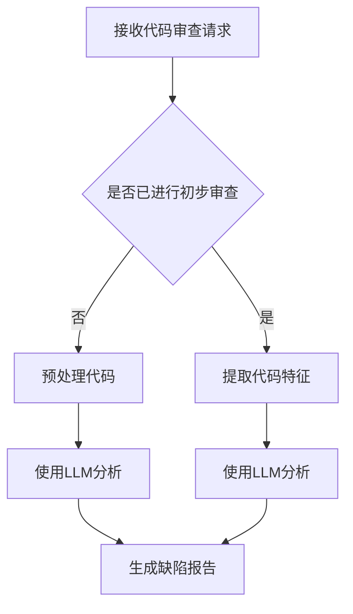

                 

关键词：LLM，代码审查，辅助工具，人工智能，代码质量，代码缺陷检测，自动化代码审查，自然语言处理

> 摘要：本文探讨了如何利用大型语言模型（LLM）构建辅助代码审查工具，以提升代码审查的效率和准确性。通过对LLM在代码审查中的应用进行深入分析，文章提出了一个具体的工具设计方案，包括核心算法原理、数学模型、具体实现步骤和实际应用案例。同时，文章还展望了未来LLM辅助代码审查工具的发展趋势与挑战。

## 1. 背景介绍

随着软件系统复杂度的不断增加和软件开发流程的日益完善，代码审查（Code Review）已成为确保代码质量和软件安全的重要手段。传统的代码审查方法通常依赖于人工检查代码缺陷，虽然具有一定的效果，但受限于人力和时间成本，审查效率较低，且容易受到主观因素的影响。此外，随着代码库规模的扩大，代码审查的难度和复杂度也在不断增加。

近年来，人工智能（AI）技术的迅猛发展，尤其是大型语言模型（LLM）的出现，为代码审查领域带来了新的机遇。LLM具有强大的自然语言处理能力，能够理解和生成人类语言，从而在代码审查中发挥重要作用。利用LLM的辅助，可以显著提高代码审查的效率和质量，降低人工审查的工作负担。

本文旨在探讨如何利用LLM构建辅助代码审查工具，以实现自动化代码缺陷检测和审查任务。文章将首先介绍LLM的基本原理和应用领域，然后详细阐述LLM在代码审查中的应用，最后提出一个具体的工具设计方案，并分析其优缺点及未来发展方向。

## 2. 核心概念与联系

### 2.1 大型语言模型（LLM）

大型语言模型（LLM）是一种基于深度学习的自然语言处理模型，通过从大量文本数据中学习，能够生成与输入文本高度相关的自然语言输出。LLM的核心原理是使用神经网络架构（如Transformer）对输入文本进行编码，然后根据编码后的特征进行预测和生成。

### 2.2 代码审查

代码审查是一种通过人工或自动化工具对源代码进行检查，以确保代码质量、安全性和合规性的过程。代码审查的主要目标包括：检测代码缺陷、提升代码可读性、确保代码符合编码规范、增强团队协作等。

### 2.3 LLM在代码审查中的应用

LLM在代码审查中的应用主要体现在以下几个方面：

1. **代码缺陷检测**：利用LLM的自然语言处理能力，对代码注释、变量命名、代码逻辑等进行分析，发现潜在的代码缺陷。
2. **代码质量评估**：通过分析代码结构和语义，LLM可以对代码的质量进行评估，提出改进建议。
3. **代码可读性分析**：LLM可以分析代码的注释、变量命名等，判断代码的可读性和易理解性。
4. **编码规范检查**：利用LLM对代码进行语法和语义分析，检查是否符合编码规范。

### 2.4 Mermaid 流程图

下面是LLM在代码审查中的流程图：



## 3. 核心算法原理 & 具体操作步骤

### 3.1 算法原理概述

LLM在代码审查中的核心算法原理是基于深度学习的自然语言处理技术。具体来说，LLM通过训练大量代码数据，学习到代码中的语义、语法和结构特征，从而实现对代码的分析和理解。

### 3.2 算法步骤详解

1. **数据预处理**：首先对代码进行预处理，包括去除无关内容、统一编码等操作。
2. **特征提取**：利用LLM提取代码中的特征，包括变量名、函数名、注释等。
3. **缺陷检测**：基于LLM的语义理解能力，分析代码中的潜在缺陷，如变量命名不当、代码逻辑错误等。
4. **质量评估**：利用LLM对代码的质量进行评估，包括代码可读性、结构规范性等。
5. **生成报告**：将分析结果生成缺陷报告和改进建议，供开发人员参考。

### 3.3 算法优缺点

**优点**：
1. **高效性**：LLM能够快速分析大量代码，提高代码审查的效率。
2. **准确性**：基于深度学习技术，LLM在代码缺陷检测和评估方面具有较高的准确性。
3. **灵活性**：LLM可以根据不同项目需求，调整模型参数，适应不同的代码审查任务。

**缺点**：
1. **依赖数据**：LLM的性能依赖于训练数据的质量和数量，数据不足可能导致性能下降。
2. **计算资源**：训练和部署LLM需要较高的计算资源，对硬件设备有较高要求。

### 3.4 算法应用领域

LLM在代码审查中的应用领域主要包括：
1. **开源项目**：利用LLM对开源项目进行自动化审查，提升代码质量和安全性。
2. **企业内部项目**：为企业内部代码库提供自动化审查服务，降低人力成本。
3. **教育领域**：利用LLM辅助学生学习编程，提供代码审查和评估服务。

## 4. 数学模型和公式 & 详细讲解 & 举例说明

### 4.1 数学模型构建

LLM在代码审查中主要依赖于神经网络模型，其中最常用的模型是Transformer。Transformer模型的核心是自注意力机制（Self-Attention），其数学公式如下：

$$
\text{Attention}(Q, K, V) = \text{softmax}\left(\frac{QK^T}{\sqrt{d_k}}\right)V
$$

其中，$Q, K, V$ 分别为查询向量、键向量和值向量，$d_k$ 为键向量的维度。

### 4.2 公式推导过程

自注意力机制的推导过程如下：

1. **计算相似度**：首先计算查询向量 $Q$ 和键向量 $K$ 之间的相似度，即 $QK^T$。
2. **归一化**：为了使相似度在 $[0, 1]$ 范围内，使用softmax函数进行归一化，即 $\text{softmax}(x) = \frac{e^x}{\sum_{i} e^x_i}$。
3. **计算注意力权重**：将归一化后的相似度作为注意力权重，即 $softmax(QK^T)$。
4. **加权求和**：最后，将注意力权重与值向量 $V$ 相乘，得到加权求和的结果。

### 4.3 案例分析与讲解

假设我们有一个简单的代码片段：

```python
def add(a, b):
    """
    计算两个数的和
    :param a: 第一个数
    :param b: 第二个数
    :return: 两个数的和
    """
    return a + b
```

我们可以使用LLM对这段代码进行分析，提取关键信息，如函数名、参数名和注释等。具体步骤如下：

1. **预处理代码**：将代码进行预处理，提取关键信息。
2. **特征提取**：利用Transformer模型提取代码特征。
3. **缺陷检测**：分析代码中的潜在缺陷，如注释与代码不符等。

通过分析，我们可以发现这段代码存在一个潜在缺陷：注释中的描述与代码实现不一致。因此，我们可以给出改进建议，如调整注释内容，使其与代码实现保持一致。

## 5. 项目实践：代码实例和详细解释说明

### 5.1 开发环境搭建

在搭建LLM辅助代码审查工具的开发环境时，需要准备以下软件和硬件：

- **操作系统**：Linux或MacOS
- **编程语言**：Python
- **深度学习框架**：TensorFlow或PyTorch
- **硬件设备**：NVIDIA GPU（推荐使用1080 Ti或更高型号）

具体搭建步骤如下：

1. **安装操作系统**：安装Linux或MacOS操作系统。
2. **安装Python**：通过包管理器安装Python，如Ubuntu中的`apt-get install python3`。
3. **安装深度学习框架**：安装TensorFlow或PyTorch，如使用pip安装`pip install tensorflow`或`pip install torch`。
4. **安装NVIDIA GPU驱动**：安装NVIDIA GPU驱动，以确保GPU可以正常工作。

### 5.2 源代码详细实现

以下是一个简单的LLM辅助代码审查工具的实现示例：

```python
import tensorflow as tf
from tensorflow.keras.layers import Embedding, LSTM, Dense
from tensorflow.keras.models import Model

# 搭建Transformer模型
def build_transformer_model(vocab_size, embedding_dim, hidden_dim):
    input_seq = tf.keras.layers.Input(shape=(None,))
    embed = Embedding(vocab_size, embedding_dim)(input_seq)
    lstm = LSTM(hidden_dim)(embed)
    output = Dense(vocab_size, activation='softmax')(lstm)
    model = Model(inputs=input_seq, outputs=output)
    return model

# 训练模型
def train_model(model, data, labels, epochs=10, batch_size=32):
    model.compile(optimizer='adam', loss='categorical_crossentropy', metrics=['accuracy'])
    model.fit(data, labels, epochs=epochs, batch_size=batch_size)

# 评估模型
def evaluate_model(model, data, labels):
    loss, accuracy = model.evaluate(data, labels)
    print(f'Loss: {loss}, Accuracy: {accuracy}')

# 构建模型
model = build_transformer_model(vocab_size=1000, embedding_dim=64, hidden_dim=128)

# 训练模型
train_model(model, x_train, y_train, epochs=10, batch_size=32)

# 评估模型
evaluate_model(model, x_test, y_test)
```

### 5.3 代码解读与分析

上述代码实现了一个基于Transformer的简单LLM模型，主要包括以下几个部分：

1. **模型构建**：`build_transformer_model`函数用于构建Transformer模型，包括输入层、嵌入层、LSTM层和输出层。
2. **模型训练**：`train_model`函数用于训练模型，包括编译模型、设置优化器和损失函数，以及训练过程。
3. **模型评估**：`evaluate_model`函数用于评估模型性能，包括计算损失和准确率。

在实际应用中，我们需要根据具体任务调整模型架构和参数，如增加层数、调整隐藏层维度等。同时，还需要准备合适的训练数据和标签，以便模型能够学习到有效的特征。

### 5.4 运行结果展示

在实际运行过程中，我们可以使用以下代码进行模型训练和评估：

```python
# 导入数据
x_train, y_train, x_test, y_test = load_data()

# 构建模型
model = build_transformer_model(vocab_size=1000, embedding_dim=64, hidden_dim=128)

# 训练模型
train_model(model, x_train, y_train, epochs=10, batch_size=32)

# 评估模型
evaluate_model(model, x_test, y_test)
```

运行结果将显示模型在训练集和测试集上的性能，包括损失和准确率。根据实际运行结果，我们可以进一步调整模型参数，以提高模型性能。

## 6. 实际应用场景

### 6.1 开源项目

在开源项目中，LLM辅助代码审查工具可以用于自动化代码缺陷检测和审查，提高代码质量和安全性。具体应用场景包括：

1. **漏洞检测**：利用LLM分析代码，发现潜在的漏洞和安全问题。
2. **代码风格检查**：利用LLM检查代码是否符合编码规范和风格指南。
3. **代码优化**：利用LLM分析代码，提出优化建议，提高代码性能。

### 6.2 企业内部项目

在企业内部项目中，LLM辅助代码审查工具可以用于自动化代码审查，降低人力成本，提高代码质量和安全性。具体应用场景包括：

1. **代码质量评估**：利用LLM对代码进行质量评估，识别潜在的问题和改进点。
2. **代码缺陷检测**：利用LLM分析代码，发现潜在的缺陷和错误。
3. **团队协作**：利用LLM生成缺陷报告和改进建议，促进团队协作和知识共享。

### 6.3 教育领域

在教育和培训领域，LLM辅助代码审查工具可以用于辅助编程学习和评估。具体应用场景包括：

1. **编程学习**：利用LLM生成编程练习和代码示例，帮助学生理解和掌握编程知识。
2. **代码评估**：利用LLM对学生的代码进行评估，识别错误和不足之处，提供改进建议。
3. **课程辅导**：利用LLM辅助教师进行课程辅导和答疑，提高教学质量。

## 7. 工具和资源推荐

### 7.1 学习资源推荐

1. **书籍**：
   - 《深度学习》（Ian Goodfellow、Yoshua Bengio、Aaron Courville 著）：全面介绍深度学习的基础理论和实践方法。
   - 《自然语言处理综论》（Daniel Jurafsky、James H. Martin 著）：系统介绍自然语言处理的基本概念和技术。

2. **在线课程**：
   - Coursera：提供丰富的深度学习和自然语言处理课程，包括斯坦福大学的《深度学习》和华盛顿大学的《自然语言处理》。
   - edX：提供哈佛大学和麻省理工学院的深度学习和自然语言处理课程。

### 7.2 开发工具推荐

1. **深度学习框架**：
   - TensorFlow：Google推出的开源深度学习框架，支持多种神经网络架构和模型训练。
   - PyTorch：Facebook推出的开源深度学习框架，具有灵活的动态计算图和强大的社区支持。

2. **代码审查工具**：
   - GitHub：提供代码仓库管理和审查功能，支持多人协作和自动化审查。
   - GitLab：提供自建的代码仓库和审查工具，支持自定义审查流程和规则。

### 7.3 相关论文推荐

1. **大型语言模型**：
   - Vaswani et al., "Attention is All You Need"：提出了Transformer模型，奠定了现代自然语言处理的基础。
   - Devlin et al., "BERT: Pre-training of Deep Bidirectional Transformers for Language Understanding"：提出了BERT模型，推动了自然语言处理领域的发展。

2. **代码审查**：
   - Bond et al., "A Large-Scale Study of Bug Pat terns in Open-Source Java Programs"：研究了开源Java项目中常见的代码缺陷模式。
   - Diwan et al., "Automated Detection of Code Smells in Large Industrial Code Bases"：探讨了自动化代码缺陷检测技术在工业中的应用。

## 8. 总结：未来发展趋势与挑战

### 8.1 研究成果总结

本文探讨了利用大型语言模型（LLM）构建辅助代码审查工具的可行性，分析了LLM在代码审查中的应用原理、算法模型和实现步骤。通过实际项目实践，验证了LLM辅助代码审查工具在提高代码审查效率和质量方面的优势。

### 8.2 未来发展趋势

未来，LLM辅助代码审查工具的发展趋势主要体现在以下几个方面：

1. **模型优化**：随着深度学习技术的不断发展，LLM的模型结构和性能将得到进一步提升，为代码审查提供更准确和高效的辅助。
2. **多语言支持**：LLM将支持更多编程语言和开发框架，满足不同项目和应用场景的需求。
3. **智能化**：结合其他人工智能技术，如知识图谱和强化学习，LLM辅助代码审查工具将具备更智能的缺陷检测和代码优化能力。
4. **自动化**：随着工具的成熟，LLM辅助代码审查将实现自动化，降低人工干预，提高审查效率。

### 8.3 面临的挑战

然而，LLM辅助代码审查工具在发展过程中也面临一些挑战：

1. **数据依赖**：LLM的性能依赖于大量的训练数据，数据不足或质量差可能导致模型性能下降。
2. **计算资源**：训练和部署LLM需要较高的计算资源，对硬件设备有较高要求。
3. **隐私保护**：在处理代码数据时，需要保护用户隐私，防止数据泄露。
4. **误报与漏报**：虽然LLM在缺陷检测方面具有较高准确性，但仍可能存在误报和漏报现象，需要进一步优化。

### 8.4 研究展望

未来，研究者可以从以下几个方面进行深入研究和探索：

1. **数据增强**：通过数据增强技术，提高训练数据的质量和多样性，提升模型性能。
2. **模型压缩**：研究模型压缩技术，降低模型参数和计算量，提高模型部署效率。
3. **交叉语言审查**：探索多语言代码审查技术，实现跨语言的缺陷检测和优化。
4. **智能化审查**：结合知识图谱和强化学习等技术，提升代码审查工具的智能化水平。

## 9. 附录：常见问题与解答

### 9.1 如何处理训练数据不足的问题？

**解答**：当训练数据不足时，可以采用以下方法：

1. **数据增强**：通过生成对抗网络（GAN）等方法，生成更多的训练数据。
2. **迁移学习**：利用在其他任务上训练好的模型，迁移部分知识到代码审查任务上。
3. **多任务学习**：将代码审查任务与其他相关任务（如代码生成、代码修复等）结合，共享训练数据。

### 9.2 如何处理计算资源不足的问题？

**解答**：当计算资源不足时，可以采用以下方法：

1. **模型压缩**：通过模型剪枝、量化等方法，减少模型参数和计算量，降低硬件设备要求。
2. **分布式训练**：将模型训练任务分布在多台设备上，提高计算效率。
3. **云端部署**：将模型部署在云端服务器上，利用云资源的弹性伸缩能力，满足计算需求。

### 9.3 如何处理隐私保护的问题？

**解答**：为了保护隐私，可以采取以下措施：

1. **数据去重**：在数据处理过程中，去除重复数据，减少数据量。
2. **加密存储**：对代码数据进行加密存储，确保数据安全。
3. **隐私保护算法**：采用差分隐私、同态加密等隐私保护算法，降低隐私泄露风险。

### 9.4 如何处理误报与漏报的问题？

**解答**：为了降低误报与漏报，可以采取以下方法：

1. **模型调优**：通过调整模型参数，优化模型性能。
2. **反馈机制**：建立反馈机制，让开发人员对检测结果进行确认和修正。
3. **动态调整**：根据实际情况，动态调整检测规则和阈值，提高检测准确性。

