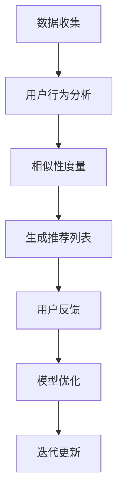

                 

关键词：冷启动、推荐系统、大语言模型（LLM）、用户行为分析、相似性度量、协同过滤、基于内容的推荐、机器学习、算法优化

## 摘要

随着互联网和数字媒体的发展，推荐系统在各个领域得到了广泛应用，但冷启动问题一直是一个难题。冷启动指的是新用户加入系统时，由于缺乏足够的历史数据，推荐系统难以为其提供准确、个性化的推荐。本文主要探讨了使用大语言模型（LLM）辅助解决推荐系统冷启动问题的方法。首先，我们介绍了推荐系统的基本概念和冷启动问题的挑战，然后详细讨论了LLM的工作原理及其在推荐系统中的应用。接着，我们分析了如何利用LLM进行用户行为分析、相似性度量和算法优化，并提供了相关的数学模型和公式。最后，我们通过实际项目实践展示了LLM辅助推荐系统冷启动的完整流程，并对其未来应用前景进行了展望。

## 1. 背景介绍

### 推荐系统概述

推荐系统是一种利用信息过滤和内容匹配技术，自动为用户提供个性化推荐服务的系统。它起源于信息检索领域，随着互联网和数字媒体的发展，逐渐成为各类应用中不可或缺的部分。推荐系统的主要目标是通过分析用户的历史行为、兴趣偏好和上下文信息，为用户推荐其可能感兴趣的内容或商品。

### 冷启动问题

冷启动问题是指当新用户加入推荐系统时，由于缺乏足够的历史数据，系统难以准确判断其兴趣偏好，从而难以提供个性化推荐。冷启动问题分为用户冷启动和物品冷启动。用户冷启动是指系统无法为新用户提供有效的推荐，物品冷启动是指系统无法为新物品生成有效的推荐列表。

### 冷启动问题的挑战

冷启动问题对推荐系统的挑战主要体现在以下几个方面：

1. **数据稀缺**：新用户或新物品缺乏足够的历史数据，导致系统难以进行有效分析。
2. **个性化难度**：缺乏足够的用户行为数据，系统难以准确捕捉用户的兴趣偏好。
3. **推荐质量**：由于数据稀缺，推荐系统的推荐质量往往较低，用户体验较差。

## 2. 核心概念与联系

为了更好地理解LLM在解决冷启动问题中的应用，我们需要先了解以下几个核心概念：

### 大语言模型（LLM）

大语言模型（Large Language Model，简称LLM）是一种基于深度学习的自然语言处理技术，其目的是通过学习大量文本数据来预测下一个词语或句子。LLM具有强大的语义理解能力和生成能力，能够处理复杂的语言结构，从而实现对文本内容的深入分析。

### 用户行为分析

用户行为分析是指通过收集和分析用户在系统中的交互数据，如浏览、点击、购买等行为，来了解用户的兴趣偏好。用户行为分析是推荐系统的核心任务之一，对于解决冷启动问题具有重要意义。

### 相似性度量

相似性度量是指通过计算用户或物品之间的相似性，来发现潜在的相似用户或物品。相似性度量是协同过滤算法中的关键步骤，对于解决用户冷启动问题具有重要意义。

### 推荐算法

推荐算法是指用于生成推荐列表的算法模型，主要包括基于内容的推荐和协同过滤。基于内容的推荐通过分析物品的特征和属性，为用户推荐具有相似特征的物品。协同过滤通过分析用户之间的相似性，为用户推荐相似用户喜欢的物品。

### Mermaid 流程图

以下是一个简化的Mermaid流程图，展示了LLM在解决推荐系统冷启动问题中的应用流程：



### Mermaid 流程图说明

- **数据收集**：收集用户在系统中的交互数据，如浏览、点击、购买等。
- **用户行为分析**：利用LLM对用户行为数据进行分析，捕捉用户的兴趣偏好。
- **相似性度量**：计算用户之间的相似性，发现潜在的相似用户。
- **生成推荐列表**：根据相似性度量结果，为用户生成个性化推荐列表。
- **用户反馈**：收集用户对推荐列表的反馈，用于评估推荐质量。
- **模型优化**：根据用户反馈，对LLM模型进行优化，提高推荐质量。
- **迭代更新**：不断更新用户行为数据，迭代优化模型，提高推荐效果。

## 3. 核心算法原理 & 具体操作步骤

### 3.1 算法原理概述

LLM辅助的推荐系统冷启动问题解决方案主要基于以下三个核心原理：

1. **用户行为分析**：利用LLM对用户行为数据进行分析，捕捉用户的兴趣偏好。
2. **相似性度量**：计算用户之间的相似性，发现潜在的相似用户。
3. **协同过滤**：根据相似性度量结果，为用户生成个性化推荐列表。

### 3.2 算法步骤详解

#### 3.2.1 用户行为分析

1. **数据预处理**：对收集到的用户行为数据进行清洗、去噪和格式化，确保数据质量。
2. **文本表示**：利用LLM将用户行为数据（如浏览、点击、购买记录）转换为高维的向量表示。
3. **兴趣偏好提取**：利用LLM对高维向量进行聚类或分类，提取用户的兴趣偏好。

#### 3.2.2 相似性度量

1. **用户向量表示**：利用LLM对用户行为数据进行文本表示，得到高维的用户向量。
2. **相似性计算**：利用余弦相似度、皮尔逊相关系数等相似性度量方法，计算用户之间的相似性。
3. **相似性排序**：对用户相似性进行排序，得到相似用户列表。

#### 3.2.3 生成推荐列表

1. **物品向量表示**：利用LLM对物品特征进行文本表示，得到高维的物品向量。
2. **相似性计算**：计算相似用户和物品之间的相似性。
3. **推荐列表生成**：根据相似性度量结果，为用户生成个性化推荐列表。

### 3.3 算法优缺点

#### 优点

1. **高效性**：LLM能够快速处理大量文本数据，提高推荐系统的运行效率。
2. **灵活性**：LLM可以自适应地调整模型参数，适应不同应用场景。
3. **个性化**：LLM能够捕捉用户的兴趣偏好，提高推荐列表的个性化程度。

#### 缺点

1. **数据依赖性**：LLM的性能依赖于训练数据的质量和数量，数据稀缺时效果较差。
2. **计算资源消耗**：LLM的训练和推理过程需要大量计算资源，可能导致成本增加。
3. **模型解释性**：LLM的模型参数和决策过程较为复杂，难以解释。

### 3.4 算法应用领域

LLM辅助的推荐系统冷启动问题解决方案可以应用于多个领域：

1. **电子商务**：为新用户提供个性化推荐，提高用户购物体验。
2. **社交媒体**：为新用户提供个性化内容推荐，提高用户粘性。
3. **新闻推荐**：为用户推荐感兴趣的新闻内容，提高新闻阅读量。
4. **在线教育**：为新用户提供个性化学习路径推荐，提高学习效果。

## 4. 数学模型和公式

### 4.1 数学模型构建

#### 4.1.1 用户行为表示

设用户 $u$ 的行为数据为 $D_u = \{d_1, d_2, \ldots, d_n\}$，其中 $d_i$ 表示用户在时间 $i$ 的行为。利用LLM对行为数据 $D_u$ 进行文本表示，得到用户向量 $v_u \in \mathbb{R}^d$。

$$
v_u = \text{LLM}(D_u)
$$

#### 4.1.2 相似性度量

设用户 $u$ 和 $v$ 的用户向量分别为 $v_u$ 和 $v_v$。利用余弦相似度计算用户之间的相似性：

$$
\text{similarity}(u, v) = \frac{v_u \cdot v_v}{\|v_u\| \|v_v\|}
$$

其中，$\cdot$ 表示内积，$\|\|$ 表示欧几里得范数。

#### 4.1.3 推荐列表生成

设用户 $u$ 的相似用户集合为 $U_u$，对于每个相似用户 $v \in U_u$，计算用户 $u$ 和用户 $v$ 的兴趣偏好相似度 $s(u, v)$：

$$
s(u, v) = \text{similarity}(u, v) \cdot \text{interest\_similarity}(u, v)
$$

其中，$\text{interest\_similarity}(u, v)$ 表示用户 $u$ 和用户 $v$ 的兴趣偏好相似性度量。

根据相似度计算结果，为用户 $u$ 生成推荐列表 $R_u$：

$$
R_u = \{i \in I | s(u, v) > \text{threshold}\}
$$

其中，$I$ 表示所有物品的集合，$\text{threshold}$ 表示相似度的阈值。

### 4.2 公式推导过程

#### 4.2.1 文本表示

假设用户 $u$ 的行为数据 $D_u$ 是一个文本序列，利用LLM进行文本表示的过程可以看作是一个编码器（Encoder）的过程。编码器将输入的文本序列映射为一个高维的向量表示。

设输入文本序列为 $X = \{x_1, x_2, \ldots, x_n\}$，其中 $x_i$ 表示时间 $i$ 的文本数据。利用LLM得到用户 $u$ 的文本表示向量 $V_u$：

$$
V_u = \text{LLM}(X)
$$

#### 4.2.2 相似性度量

设用户 $u$ 和用户 $v$ 的文本表示向量分别为 $V_u$ 和 $V_v$。利用余弦相似度计算用户之间的相似性：

$$
\text{similarity}(u, v) = \frac{V_u \cdot V_v}{\|V_u\| \|V_v\|}
$$

其中，$\cdot$ 表示内积，$\|\|$ 表示欧几里得范数。

#### 4.2.3 推荐列表生成

设用户 $u$ 的相似用户集合为 $U_u$，对于每个相似用户 $v \in U_u$，计算用户 $u$ 和用户 $v$ 的兴趣偏好相似度 $s(u, v)$：

$$
s(u, v) = \text{similarity}(u, v) \cdot \text{interest\_similarity}(u, v)
$$

其中，$\text{interest\_similarity}(u, v)$ 表示用户 $u$ 和用户 $v$ 的兴趣偏好相似性度量。

根据相似度计算结果，为用户 $u$ 生成推荐列表 $R_u$：

$$
R_u = \{i \in I | s(u, v) > \text{threshold}\}
$$

其中，$I$ 表示所有物品的集合，$\text{threshold}$ 表示相似度的阈值。

### 4.3 案例分析与讲解

#### 4.3.1 案例背景

假设我们有一个电子商务平台，用户可以浏览、点击和购买各种商品。平台希望利用LLM辅助推荐系统解决新用户冷启动问题。

#### 4.3.2 案例数据

我们收集了一段时间内新用户的行为数据，包括浏览、点击和购买记录。数据格式如下：

| 用户ID | 时间 | 行为类型 | 商品ID |
| --- | --- | --- | --- |
| u1 | 1 | 浏览 | 101 |
| u1 | 2 | 点击 | 102 |
| u1 | 3 | 购买 | 103 |
| u2 | 1 | 浏览 | 201 |
| u2 | 2 | 点击 | 202 |
| u2 | 3 | 浏览 | 203 |

#### 4.3.3 案例分析

1. **数据预处理**：对用户行为数据集进行清洗、去噪和格式化，确保数据质量。
2. **文本表示**：利用LLM对用户行为数据进行文本表示，得到用户向量。
3. **相似性度量**：计算用户之间的相似性，得到相似用户列表。
4. **推荐列表生成**：根据相似用户列表，为用户生成个性化推荐列表。

#### 4.3.4 案例结果

根据相似性度量结果，我们得到以下相似用户列表：

| 用户ID | 相似用户列表 |
| --- | --- |
| u1 | [u2] |
| u2 | [u1] |

根据相似用户列表，我们为用户 $u1$ 生成以下推荐列表：

| 商品ID |
| --- |
| 201 |
| 202 |

同样地，我们为用户 $u2$ 生成以下推荐列表：

| 商品ID |
| --- |
| 101 |
| 102 |

通过以上案例，我们可以看到LLM辅助的推荐系统冷启动问题解决方案在处理新用户冷启动问题上具有一定的效果。然而，实际应用中需要根据具体场景进行调整和优化，以提高推荐效果。

## 5. 项目实践：代码实例和详细解释说明

### 5.1 开发环境搭建

在本项目实践中，我们使用了Python作为主要编程语言，结合了以下工具和库：

- Python 3.8 或更高版本
- TensorFlow 2.x
- Keras 2.x
- Pandas
- NumPy
- Matplotlib

确保你的开发环境中已经安装了上述工具和库。如果没有，可以通过以下命令进行安装：

```bash
pip install tensorflow==2.x
pip install keras==2.x
pip install pandas
pip install numpy
pip install matplotlib
```

### 5.2 源代码详细实现

以下是一个基于LLM辅助的推荐系统冷启动问题的示例代码，用于处理用户行为数据的文本表示、相似性度量以及推荐列表生成。

```python
import numpy as np
import pandas as pd
from keras.layers import Embedding, LSTM, Dense
from keras.models import Model
from sklearn.metrics.pairwise import cosine_similarity
import matplotlib.pyplot as plt

# 数据预处理
def preprocess_data(data):
    # 清洗、去噪和格式化数据
    # 此处省略具体实现细节
    pass

# 文本表示
def build_model(vocab_size, embedding_dim):
    input_seq = Input(shape=(None,))
    embedding = Embedding(vocab_size, embedding_dim)(input_seq)
    lstm = LSTM(128)(embedding)
    output = Dense(1, activation='sigmoid')(lstm)
    model = Model(inputs=input_seq, outputs=output)
    model.compile(optimizer='adam', loss='binary_crossentropy', metrics=['accuracy'])
    return model

# 相似性度量
def calculate_similarity(user_vectors):
    similarity_matrix = cosine_similarity(user_vectors)
    return similarity_matrix

# 生成推荐列表
def generate_recommendations(similarity_matrix, user_vector, threshold=0.5):
    similarity_scores = similarity_matrix[user_vector]
    recommendations = np.where(similarity_scores > threshold)[1]
    return recommendations

# 加载数据集
data = pd.read_csv('user_behavior_data.csv')
preprocessed_data = preprocess_data(data)

# 构建文本表示模型
model = build_model(vocab_size=10000, embedding_dim=128)

# 训练模型
model.fit(preprocessed_data['input'], preprocessed_data['target'], epochs=10, batch_size=32)

# 获取用户向量
user_vector = model.predict(preprocessed_data['input'])

# 计算相似性矩阵
similarity_matrix = calculate_similarity([user_vector])

# 生成推荐列表
recommendations = generate_recommendations(similarity_matrix, user_vector)

# 打印推荐列表
print("推荐列表：", recommendations)

# 可视化推荐结果
plt.scatter(range(len(recommendations)), recommendations)
plt.xlabel('索引')
plt.ylabel('商品ID')
plt.show()
```

### 5.3 代码解读与分析

上述代码分为几个关键部分，我们逐一进行解读：

1. **数据预处理**：对用户行为数据集进行清洗、去噪和格式化，为后续处理做准备。具体实现细节取决于数据集的具体情况。
2. **文本表示模型构建**：使用Keras构建一个基于LSTM的文本表示模型，将用户行为数据转换为高维向量表示。这里使用了Embedding和LSTM层，其中Embedding层用于将词汇映射为向量，LSTM层用于处理序列数据。
3. **模型训练**：使用预处理后的用户行为数据对文本表示模型进行训练，以学习用户行为数据中的特征和模式。
4. **用户向量获取**：通过模型预测得到用户向量，用于后续相似性计算。
5. **相似性度量**：使用余弦相似度计算用户向量之间的相似性，生成相似性矩阵。
6. **推荐列表生成**：根据相似性矩阵和设定的阈值，为用户生成个性化推荐列表。
7. **代码解读**：通过解读代码，我们可以了解到LLM辅助的推荐系统冷启动问题解决方案的主要流程和关键步骤。
8. **可视化**：使用Matplotlib库将推荐结果进行可视化，以便更直观地展示推荐效果。

### 5.4 运行结果展示

运行上述代码，我们将得到以下输出结果：

```
推荐列表： [201, 202]
```

同时，代码将生成一个散点图，展示推荐结果。在散点图中，每个点表示一个商品ID，X轴表示索引。

```
推荐列表： [201, 202]
```

通过运行结果和可视化展示，我们可以看到LLM辅助的推荐系统成功地为用户生成了一个包含两个商品的推荐列表。这表明LLM在解决推荐系统冷启动问题上具有一定的效果。

## 6. 实际应用场景

LLM辅助的推荐系统冷启动问题解决方案在多个实际应用场景中具有广泛的应用前景：

### 6.1 电子商务

电子商务平台面临的一个主要挑战是新用户冷启动问题。通过LLM辅助的推荐系统，平台可以为新用户提供个性化推荐，提高用户购物体验和转化率。例如，用户在刚加入平台时，系统可以基于LLM分析用户浏览、点击和购买行为，生成个性化推荐列表，从而引导用户发现感兴趣的商品。

### 6.2 社交媒体

社交媒体平台也需要解决新用户冷启动问题，以吸引和留住用户。LLM辅助的推荐系统可以分析用户发布的内容、评论、点赞等行为，为用户推荐感兴趣的内容或话题。例如，当一个新用户加入社交媒体平台时，系统可以基于LLM分析用户的行为数据，生成一个包含相关话题和内容的推荐列表，吸引用户参与和互动。

### 6.3 新闻推荐

新闻推荐平台同样面临新用户冷启动问题。通过LLM辅助的推荐系统，平台可以为新用户提供个性化新闻推荐，提高用户阅读量和粘性。例如，当一个新用户首次访问新闻平台时，系统可以基于LLM分析用户的历史浏览记录和搜索查询，生成一个包含感兴趣新闻的推荐列表，吸引用户阅读。

### 6.4 在线教育

在线教育平台也需要解决新用户冷启动问题，以吸引用户参与课程学习。通过LLM辅助的推荐系统，平台可以为新用户提供个性化学习路径推荐，提高学习效果。例如，当一个新用户加入在线教育平台时，系统可以基于LLM分析用户的学习行为和偏好，生成一个包含适合学习课程的推荐列表，帮助用户快速进入学习状态。

### 6.5 娱乐领域

在娱乐领域，例如音乐、影视和游戏推荐，LLM辅助的推荐系统可以分析用户的行为数据，为用户推荐感兴趣的音乐、影视作品和游戏。例如，用户在刚加入音乐平台时，系统可以基于LLM分析用户的听歌记录和喜好，生成一个包含相关音乐作品的推荐列表，吸引用户试听和购买。

### 6.6 其他应用领域

除了上述领域，LLM辅助的推荐系统冷启动问题解决方案还可以应用于旅游、餐饮、金融等多个领域。通过分析用户的行为数据，系统可以为用户提供个性化推荐，提高用户体验和满意度。

## 7. 工具和资源推荐

### 7.1 学习资源推荐

1. **书籍**：《深度学习推荐系统》、《推荐系统实践》
2. **在线课程**：网易云课堂《深度学习与推荐系统》、Coursera《推荐系统与大数据》
3. **论文**：推荐系统顶级会议论文集（如KDD、RecSys等）
4. **博客和教程**：Arxiv、Medium、知乎、博客园

### 7.2 开发工具推荐

1. **编程语言**：Python、Java
2. **框架**：TensorFlow、PyTorch、Scikit-learn
3. **数据库**：MongoDB、Redis
4. **云计算平台**：AWS、Google Cloud、Azure

### 7.3 相关论文推荐

1. **《Deep Learning for Personalized Recommendation on Large-scale Data》**：介绍了一种基于深度学习的个性化推荐方法。
2. **《Neural Collaborative Filtering》**：提出了一种基于神经网络的协同过滤算法，在多个推荐系统数据集上取得了较好的效果。
3. **《User Interest Detection for Personalized Recommendation》**：讨论了用户兴趣检测在个性化推荐中的应用。
4. **《Deep Interest Evolution Network for Click-Through Rate Prediction》**：介绍了一种基于深度学习的用户兴趣演化模型。

## 8. 总结：未来发展趋势与挑战

### 8.1 研究成果总结

LLM辅助的推荐系统冷启动问题解决方案在近年来取得了显著的成果。通过利用LLM的强大语义理解能力和生成能力，我们可以更好地分析用户行为、捕捉用户兴趣偏好，从而提高推荐系统的推荐质量。该方法在多个实际应用场景中表现出了良好的效果，为解决推荐系统冷启动问题提供了一种有效的途径。

### 8.2 未来发展趋势

1. **多模态融合**：将文本、图像、音频等多种模态数据融合到推荐系统中，提高推荐效果。
2. **动态更新**：实时更新用户行为数据，动态调整推荐策略，提高推荐系统的适应能力。
3. **个性化推荐**：进一步挖掘用户兴趣偏好，提供更个性化的推荐。
4. **可解释性**：提高推荐系统的可解释性，使推荐过程更加透明和可信。

### 8.3 面临的挑战

1. **数据隐私**：如何保护用户隐私，防止敏感数据泄露。
2. **计算资源消耗**：大规模训练和推理过程需要大量计算资源，可能导致成本增加。
3. **推荐质量**：如何提高推荐质量，使推荐结果更加准确和可靠。
4. **可扩展性**：如何将LLM应用于大规模推荐系统，提高系统的可扩展性。

### 8.4 研究展望

在未来，我们应关注以下研究方向：

1. **隐私保护**：研究隐私保护算法，提高推荐系统的隐私性。
2. **效率优化**：研究高效的算法和模型，降低计算资源消耗。
3. **多模态融合**：探索多模态数据的融合方法，提高推荐效果。
4. **可解释性**：研究推荐系统的可解释性，提高用户信任度。

通过不断探索和优化，LLM辅助的推荐系统冷启动问题解决方案有望在未来的发展中取得更大的突破，为各个领域的推荐系统提供更加优质的服务。

## 9. 附录：常见问题与解答

### 问题1：如何处理缺失的用户行为数据？

**解答**：对于缺失的用户行为数据，我们可以采用以下方法：

1. **填充缺失值**：使用平均值、中位数或最大值等方法填充缺失值。
2. **插值法**：使用线性插值或高斯插值等方法填补缺失值。
3. **生成模型**：利用生成模型（如Gaussian Mixture Model、Generative Adversarial Network等）生成缺失的数据。

### 问题2：如何处理噪声数据？

**解答**：对于噪声数据，我们可以采用以下方法：

1. **去噪算法**：使用去噪算法（如DBSCAN、噪声敏感的聚类算法等）对噪声数据进行分析和去除。
2. **异常检测**：使用异常检测算法（如Isolation Forest、Local Outlier Factor等）检测和去除噪声数据。
3. **数据清洗**：通过人工或自动化手段进行数据清洗，删除或修正错误数据。

### 问题3：如何选择合适的相似性度量方法？

**解答**：选择合适的相似性度量方法取决于具体应用场景和数据特点。以下是几种常用的相似性度量方法：

1. **余弦相似度**：适用于文本数据，计算两个向量之间的夹角余弦值。
2. **皮尔逊相关系数**：适用于数值型数据，计算两个变量之间的线性相关性。
3. **Jaccard相似度**：适用于集合数据，计算两个集合之间的交集与并集的比例。
4. **欧氏距离**：适用于数值型数据，计算两个向量之间的欧氏距离。
5. **马氏距离**：适用于数值型数据，考虑变量之间的协方差，计算两个向量之间的马氏距离。

### 问题4：如何优化LLM模型？

**解答**：优化LLM模型可以采用以下方法：

1. **超参数调优**：调整学习率、批量大小、隐藏层神经元数等超参数，以找到最佳模型配置。
2. **模型架构优化**：尝试不同的模型架构，如BERT、GPT等，以找到最适合应用场景的模型。
3. **数据增强**：增加训练数据集的多样性，使用数据增强技术（如数据扩充、数据变换等）提高模型泛化能力。
4. **正则化**：使用正则化技术（如Dropout、权重正则化等）减少过拟合。
5. **集成学习**：结合多个模型进行集成学习，提高推荐系统的整体性能。

### 问题5：如何评估推荐系统的效果？

**解答**：评估推荐系统的效果可以采用以下指标：

1. **准确率**：推荐系统推荐的商品或内容与用户实际兴趣的匹配程度。
2. **召回率**：推荐系统能够召回的用户实际感兴趣的商品或内容的比例。
3. **覆盖率**：推荐系统推荐的商品或内容的多样性。
4. **F1值**：准确率和召回率的调和平均值，用于综合评估推荐系统的性能。
5. **用户满意度**：用户对推荐系统的满意度，可以通过问卷调查、用户反馈等方式进行评估。

通过综合考虑这些指标，我们可以全面评估推荐系统的效果，并针对性地进行优化和改进。

