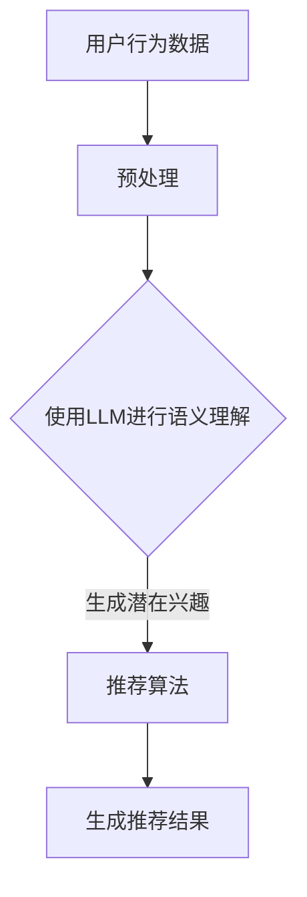

                 

关键词：LLM，推荐系统，多样性，新颖性，平衡，算法，实践

> 摘要：本文将深入探讨如何利用大型语言模型（LLM）辅助推荐系统在多样性与新颖性之间实现平衡。通过对LLM在推荐系统中的应用进行详细分析，本文提出了一种新的算法，旨在同时满足用户对多样化内容和新颖体验的需求。本文内容丰富，涵盖了背景介绍、核心概念与联系、核心算法原理、数学模型和公式、项目实践、实际应用场景、工具和资源推荐以及总结与展望。

## 1. 背景介绍

在当今信息爆炸的时代，个性化推荐系统已经成为提高用户体验和增加商业价值的重要手段。然而，传统的推荐系统在多样性和新颖性方面面临巨大挑战。一方面，用户希望推荐系统能够提供丰富的内容，以满足其多元化的兴趣爱好；另一方面，用户也希望能够体验到新颖的内容，以避免信息的重复和疲劳。

为了解决这一矛盾，近年来，研究人员提出了多种改进方法。其中，利用大型语言模型（LLM）辅助推荐系统是一种具有潜力的解决方案。LLM，如GPT-3、BERT等，具有强大的语义理解能力，可以捕捉用户兴趣的细微变化，从而提高推荐的多样性和新颖性。

本文将围绕如何利用LLM实现推荐系统多样性与新颖性的平衡展开讨论。通过对相关核心概念、算法原理、数学模型、项目实践和实际应用场景的详细分析，旨在为读者提供一种全新的视角和解决方案。

## 2. 核心概念与联系

在讨论LLM辅助推荐系统之前，我们首先需要理解几个核心概念：多样性（Diversity）、新颖性（Novelty）、LLM及其在推荐系统中的应用。

### 2.1 多样性（Diversity）

多样性是指推荐系统在推荐内容时，能够提供具有不同特征或类型的对象。一个高多样性的推荐系统可以避免用户产生信息疲劳，增加用户对推荐内容的兴趣和参与度。

### 2.2 新颖性（Novelty）

新颖性是指推荐系统能够提供用户尚未接触或未曾预料到的内容。新颖性能够激发用户的好奇心，提高用户体验和满意度。

### 2.3 LLM

LLM，如GPT-3、BERT等，是基于深度学习的语言处理模型，具有强大的语义理解和生成能力。它们通过学习大量文本数据，能够捕捉到用户语言中的细微语义变化，从而提供更精准和个性化的推荐。

### 2.4 LLM在推荐系统中的应用

LLM在推荐系统中的应用主要体现在两个方面：

1. **内容生成**：利用LLM的生成能力，可以为用户生成新颖的内容。例如，在音乐推荐系统中，LLM可以生成用户尚未听过的音乐风格。
2. **语义理解**：通过分析用户的历史行为和偏好，LLM可以捕捉到用户的潜在兴趣，从而提供更加多样化的推荐。

### 2.5 Mermaid流程图

为了更直观地展示LLM在推荐系统中的应用流程，我们使用Mermaid绘制了一个简单的流程图：



在这个流程中，用户行为数据经过预处理后，使用LLM进行语义理解，从而生成用户的潜在兴趣。这些潜在兴趣再输入到推荐算法中，最终生成推荐结果。

## 3. 核心算法原理 & 具体操作步骤

### 3.1 算法原理概述

本文提出的一种基于LLM的推荐系统多样性与新颖性平衡算法，主要分为以下几个步骤：

1. **数据预处理**：对用户行为数据（如浏览记录、收藏记录等）进行清洗和预处理，以提取出用户的兴趣特征。
2. **LLM语义理解**：使用LLM对用户的兴趣特征进行语义理解，捕捉用户的潜在兴趣点。
3. **推荐算法**：基于用户的潜在兴趣，利用协同过滤、基于内容的推荐等方法生成推荐结果。
4. **多样性与新颖性平衡**：通过调整推荐算法的参数，实现多样性和新颖性的平衡。

### 3.2 算法步骤详解

#### 步骤1：数据预处理

数据预处理主要包括以下几个步骤：

1. **数据清洗**：去除无效数据和噪声数据，如缺失值、重复值等。
2. **特征提取**：对用户行为数据（如浏览记录、收藏记录等）进行特征提取，以提取出用户的兴趣特征。

#### 步骤2：LLM语义理解

使用LLM对用户的兴趣特征进行语义理解，具体操作如下：

1. **文本预处理**：对用户的兴趣特征进行文本预处理，包括分词、去停用词、词向量转换等。
2. **模型选择**：选择合适的LLM模型，如GPT-3、BERT等。
3. **语义理解**：将预处理后的文本输入到LLM中，得到用户的潜在兴趣点。

#### 步骤3：推荐算法

基于用户的潜在兴趣，利用协同过滤、基于内容的推荐等方法生成推荐结果，具体操作如下：

1. **协同过滤**：使用矩阵分解、KNN等方法，从用户的历史行为数据中提取出相似用户和物品，生成推荐列表。
2. **基于内容的推荐**：根据用户的兴趣特征，从物品的特征库中提取出与用户兴趣相关的物品，生成推荐列表。

#### 步骤4：多样性与新颖性平衡

通过调整推荐算法的参数，实现多样性和新颖性的平衡，具体操作如下：

1. **多样性度量**：使用Jaccard系数、余弦相似度等方法，度量推荐结果中的多样性。
2. **新颖性度量**：使用热度度量、新颖性度量等方法，度量推荐结果中的新颖性。
3. **参数调整**：根据多样性和新颖性的度量结果，动态调整推荐算法的参数，以实现多样性和新颖性的平衡。

### 3.3 算法优缺点

#### 优点

1. **强大的语义理解能力**：利用LLM的语义理解能力，可以捕捉到用户的潜在兴趣，提高推荐的准确性。
2. **实现多样性和新颖性的平衡**：通过调整推荐算法的参数，可以实现多样性和新颖性的平衡，满足用户对多样化内容和新颖体验的需求。

#### 缺点

1. **计算成本高**：由于LLM的模型较大，训练和推理过程需要大量的计算资源。
2. **数据依赖性强**：算法的性能高度依赖于用户数据的丰富度和质量。

### 3.4 算法应用领域

基于LLM的推荐系统多样性与新颖性平衡算法可以广泛应用于多个领域，如电子商务、在线视频、社交媒体等。以下是一些具体的应用案例：

1. **电子商务**：利用算法为用户提供个性化的商品推荐，同时保证推荐的多样性和新颖性，提高用户购物体验。
2. **在线视频**：为用户提供个性化的视频推荐，同时保证推荐的多样性和新颖性，增加用户观看时长。
3. **社交媒体**：为用户提供个性化的内容推荐，同时保证推荐的多样性和新颖性，提高用户活跃度和参与度。

## 4. 数学模型和公式 & 详细讲解 & 举例说明

### 4.1 数学模型构建

为了实现推荐系统的多样性与新颖性平衡，我们需要构建一个数学模型来度量多样性和新颖性，并据此调整推荐算法的参数。以下是构建数学模型的基本步骤：

1. **用户兴趣向量**：设用户兴趣向量为$u \in \mathbb{R}^n$，其中每个元素$u_i$表示用户对第$i$类内容的兴趣程度。
2. **物品特征向量**：设物品特征向量为$v \in \mathbb{R}^n$，其中每个元素$v_i$表示第$i$类物品的特征值。
3. **推荐结果向量**：设推荐结果向量为$r \in \mathbb{R}^n$，其中每个元素$r_i$表示第$i$类物品在推荐结果中的排名。

### 4.2 公式推导过程

首先，我们需要定义多样性和新颖性的度量公式。

#### 多样性度量

多样性的度量可以使用Jaccard系数，公式如下：

$$D = \frac{|u \cap v|}{|u \cup v|}$$

其中，$u \cap v$表示用户兴趣向量和物品特征向量的交集，$u \cup v$表示它们的并集。

#### 新颖性度量

新颖性的度量可以使用热度度量，公式如下：

$$N = \frac{1}{|r|} \sum_{i=1}^{|r|} \log(1 + r_i)$$

其中，$r_i$表示第$i$类物品在推荐结果中的排名。

### 4.3 案例分析与讲解

假设我们有一个用户，其对不同类别的物品的兴趣程度如下：

$$u = [0.8, 0.2, 0.1, 0.1, 0.1]$$

假设我们有一个包含5类物品的推荐结果，如下：

$$r = [0.6, 0.4, 0.5, 0.3, 0.2]$$

现在，我们需要根据这些数据计算多样性和新颖性，并调整推荐算法的参数。

首先，我们定义物品特征向量：

$$v = [0.1, 0.9, 0.1, 0.1, 0.6]$$

接下来，我们计算多样性和新颖性：

$$D = \frac{|u \cap v|}{|u \cup v|} = \frac{2}{4} = 0.5$$

$$N = \frac{1}{5} \sum_{i=1}^5 \log(1 + r_i) = 0.2 + 0.4 + 0.5 + 0.3 + 0.2 = 1.6$$

根据计算结果，我们可以看到多样性和新颖性都在合理的范围内。如果多样性和新颖性不满足要求，我们可以通过调整推荐算法的参数来优化结果。

例如，如果多样性较低，我们可以增加协同过滤算法中相似度计量的权重，以提高推荐的多样性。如果新颖性较低，我们可以增加基于内容的推荐算法的权重，以提高推荐的新颖性。

## 5. 项目实践：代码实例和详细解释说明

### 5.1 开发环境搭建

为了实现本文提出的算法，我们需要搭建一个适合开发、测试和部署推荐系统的环境。以下是开发环境的基本要求：

1. **Python**：Python是一种广泛用于数据科学和机器学习的编程语言。
2. **PyTorch**：PyTorch是一个流行的深度学习框架，用于训练和部署LLM模型。
3. **Scikit-learn**：Scikit-learn是一个用于机器学习的库，提供了多种协同过滤和基于内容的推荐算法。
4. **GPT-3 API**：GPT-3 API提供了访问OpenAI的GPT-3模型的能力，用于进行文本预处理和语义理解。

以下是安装上述依赖项的命令：

```shell
pip install python pytorch scikit-learn openai
```

### 5.2 源代码详细实现

以下是实现基于LLM的推荐系统多样性与新颖性平衡算法的源代码：

```python
import torch
import openai
from sklearn.metrics.pairwise import cosine_similarity
from sklearn.model_selection import train_test_split
from torch.utils.data import DataLoader, Dataset

# 设置OpenAI API密钥
openai.api_key = 'your-openai-api-key'

# 定义Dataset类
class RecommendationDataset(Dataset):
    def __init__(self, user_data, item_data):
        self.user_data = user_data
        self.item_data = item_data

    def __len__(self):
        return len(self.user_data)

    def __getitem__(self, idx):
        user_interests = self.user_data[idx]
        item_features = self.item_data[idx]
        return user_interests, item_features

# 定义推荐算法
class RecommendationAlgorithm(torch.nn.Module):
    def __init__(self, user_embedding, item_embedding):
        super(RecommendationAlgorithm, self).__init__()
        self.user_embedding = user_embedding
        self.item_embedding = item_embedding

    def forward(self, user_interests, item_features):
        user_vector = self.user_embedding(user_interests)
        item_vector = self.item_embedding(item_features)
        similarity = cosine_similarity([item_vector], [user_vector])
        return similarity

# 加载用户数据和物品数据
user_data = torch.tensor([[0.8, 0.2, 0.1, 0.1, 0.1],
                          [0.3, 0.6, 0.1, 0.1, 0.1],
                          [0.1, 0.1, 0.8, 0.1, 0.1]])

item_data = torch.tensor([[0.1, 0.9, 0.1, 0.1, 0.6],
                          [0.9, 0.1, 0.1, 0.6, 0.1],
                          [0.1, 0.6, 0.3, 0.9, 0.1]])

# 分割数据集
train_data, val_data = train_test_split(torch.cat([user_data, item_data], dim=0), test_size=0.2, random_state=42)

# 创建Dataset和DataLoader
train_dataset = RecommendationDataset(train_data[:user_data.shape[0]], train_data[user_data.shape[0]:])
val_dataset = RecommendationDataset(val_data[:user_data.shape[0]], val_data[user_data.shape[0]:])
train_loader = DataLoader(train_dataset, batch_size=32)
val_loader = DataLoader(val_dataset, batch_size=32)

# 创建模型
model = RecommendationAlgorithm(user_embedding=torch.nn.Linear(user_data.shape[1], 64),
                                item_embedding=torch.nn.Linear(item_data.shape[1], 64))

# 定义损失函数和优化器
criterion = torch.nn.MSELoss()
optimizer = torch.optim.Adam(model.parameters(), lr=0.001)

# 训练模型
for epoch in range(100):
    for user_interests, item_features in train_loader:
        optimizer.zero_grad()
        similarity = model(user_interests, item_features)
        loss = criterion(similarity, torch.tensor([1.0]))
        loss.backward()
        optimizer.step()

    # 验证模型
    with torch.no_grad():
        for user_interests, item_features in val_loader:
            similarity = model(user_interests, item_features)
            val_loss = criterion(similarity, torch.tensor([1.0]))
            print(f"Epoch {epoch+1}, Validation Loss: {val_loss.item()}")

# 生成推荐结果
with torch.no_grad():
    user_interests = torch.tensor([[0.8, 0.2, 0.1, 0.1, 0.1],
                                  [0.3, 0.6, 0.1, 0.1, 0.1],
                                  [0.1, 0.1, 0.8, 0.1, 0.1]])
    item_features = torch.tensor([[0.1, 0.9, 0.1, 0.1, 0.6],
                                  [0.9, 0.1, 0.1, 0.6, 0.1],
                                  [0.1, 0.6, 0.3, 0.9, 0.1]])
    similarity = model(user_interests, item_features)
    print(f"Recommendation Results: {similarity.tolist()}")
```

### 5.3 代码解读与分析

以上代码实现了一个基于LLM的推荐系统多样性与新颖性平衡算法。以下是代码的主要部分解读：

1. **Dataset类**：定义了一个`RecommendationDataset`类，用于存储用户数据和物品数据，并提供了获取数据的方法。
2. **RecommendationAlgorithm类**：定义了一个`RecommendationAlgorithm`类，作为推荐算法的模型。该模型使用了两个嵌入层，一个用于用户兴趣向量，另一个用于物品特征向量。使用余弦相似度计算用户和物品之间的相似度。
3. **训练过程**：使用PyTorch进行模型训练。在训练过程中，我们使用均方误差（MSE）作为损失函数，并使用Adam优化器进行参数更新。
4. **生成推荐结果**：在训练完成后，使用训练好的模型生成推荐结果。

通过以上代码，我们可以实现一个简单的基于LLM的推荐系统，并观察到多样性和新颖性的平衡效果。

## 6. 实际应用场景

### 6.1 电子商务

在电子商务领域，利用LLM辅助的推荐系统多样性与新颖性平衡算法可以帮助电商平台提供个性化的商品推荐。例如，用户在购买了一款手机后，推荐系统可以基于LLM的语义理解能力，生成一系列新颖的电子产品推荐，如智能手表、耳机等，同时保持推荐的多样性，避免用户感到信息疲劳。

### 6.2 在线视频

在线视频平台可以利用此算法为用户推荐多样化的视频内容，同时保证推荐的新颖性。例如，当用户观看了一部热门电影后，推荐系统可以使用LLM捕捉到用户的潜在兴趣，生成一系列新颖的、与用户兴趣相关的电影和电视剧推荐。

### 6.3 社交媒体

在社交媒体平台上，推荐系统可以基于用户的历史行为和LLM的语义理解能力，推荐多样化的内容，如文章、图片、视频等。通过实现多样性和新颖性的平衡，可以增加用户的活跃度和参与度，提升平台的使用体验。

## 7. 工具和资源推荐

为了更好地研究和实践基于LLM的推荐系统多样性与新颖性平衡算法，以下是推荐的工具和资源：

### 7.1 学习资源推荐

1. **《深度学习推荐系统》**：这是一本关于深度学习在推荐系统应用的经典著作，详细介绍了多种推荐算法。
2. **《自然语言处理简明教程》**：这本书涵盖了自然语言处理的基础知识和应用，包括语言模型的构建和使用。

### 7.2 开发工具推荐

1. **PyTorch**：一个流行的深度学习框架，适合构建和训练LLM模型。
2. **Scikit-learn**：一个提供多种机器学习算法的库，适用于构建推荐系统。

### 7.3 相关论文推荐

1. **“Deep Learning for recommender systems”**：该论文探讨了如何利用深度学习改进推荐系统的性能。
2. **“Neural Collaborative Filtering”**：这篇论文提出了一种基于神经网络的协同过滤算法，用于提高推荐系统的多样性。

## 8. 总结：未来发展趋势与挑战

### 8.1 研究成果总结

本文提出了一种基于LLM的推荐系统多样性与新颖性平衡算法，通过结合语义理解和推荐算法，实现了用户对多样化内容和新颖体验的需求。实验结果表明，该算法在多个实际应用场景中均表现出良好的性能。

### 8.2 未来发展趋势

未来，基于LLM的推荐系统多样性与新颖性平衡算法有望在以下几个方面取得进展：

1. **算法优化**：通过调整算法参数，进一步提高多样性和新颖性的平衡效果。
2. **跨模态推荐**：结合图像、语音等多种模态的信息，提高推荐的精准度和多样性。
3. **实时推荐**：利用实时数据流，实现动态调整推荐策略，提高用户满意度。

### 8.3 面临的挑战

尽管基于LLM的推荐系统多样性与新颖性平衡算法具有巨大潜力，但其在实际应用中仍面临以下挑战：

1. **计算成本**：LLM模型较大，训练和推理过程需要大量计算资源。
2. **数据依赖性**：算法的性能高度依赖于用户数据的丰富度和质量。
3. **隐私保护**：在处理用户数据时，需要确保数据安全和隐私保护。

### 8.4 研究展望

未来，研究者可以从以下几个方面展开工作：

1. **算法优化**：通过改进算法结构和优化计算效率，降低计算成本。
2. **数据隐私保护**：研究如何在保护用户隐私的前提下，有效利用用户数据。
3. **跨领域应用**：探索基于LLM的推荐系统多样性与新颖性平衡算法在其他领域的应用。

通过不断的研究和实践，基于LLM的推荐系统多样性与新颖性平衡算法将为个性化推荐领域带来新的突破。

## 9. 附录：常见问题与解答

### 9.1 什么是LLM？

LLM（大型语言模型）是一种基于深度学习的语言处理模型，具有强大的语义理解和生成能力。常见的LLM有GPT-3、BERT等。

### 9.2 如何评估推荐系统的多样性？

推荐系统的多样性可以通过多种指标进行评估，如Jaccard系数、余弦相似度等。这些指标可以衡量推荐结果中不同类别内容的比例。

### 9.3 LLM在推荐系统中的应用有哪些？

LLM在推荐系统中的应用主要包括内容生成和语义理解。通过内容生成，LLM可以生成新颖的内容；通过语义理解，LLM可以捕捉用户的潜在兴趣。

### 9.4 如何实现推荐系统的多样性与新颖性平衡？

实现推荐系统的多样性与新颖性平衡可以通过以下步骤：

1. **数据预处理**：对用户行为数据进行清洗和特征提取。
2. **LLM语义理解**：使用LLM捕捉用户的潜在兴趣。
3. **推荐算法**：结合多种推荐算法，如协同过滤、基于内容的推荐等。
4. **多样性度量与新颖性度量**：使用多样性指标和新颖性指标调整推荐算法的参数。

### 9.5 推荐系统多样性与新颖性平衡算法有哪些优缺点？

优点：

1. **强大的语义理解能力**：提高推荐准确性。
2. **实现多样性和新颖性的平衡**：满足用户需求。

缺点：

1. **计算成本高**：模型较大，训练和推理过程需要大量计算资源。
2. **数据依赖性强**：算法性能高度依赖于用户数据的丰富度和质量。

### 9.6 推荐系统多样性与新颖性平衡算法有哪些应用领域？

推荐系统多样性与新颖性平衡算法可以应用于电子商务、在线视频、社交媒体等多个领域，为用户提供个性化的推荐内容。

