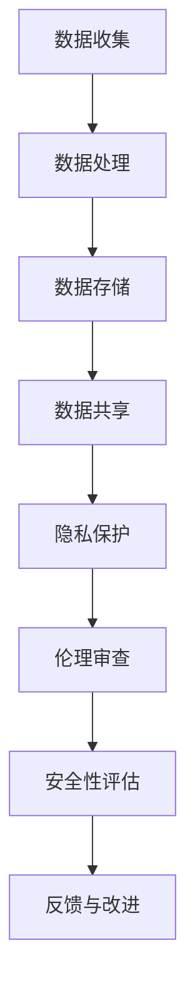

                 

 关键词：大型语言模型（LLM）、隐私伦理、AI安全性、数据保护、算法设计

> 摘要：本文深入探讨了大型语言模型（LLM）在AI安全性方面所面临的隐私伦理挑战。通过对LLM的工作原理、安全性问题和伦理责任的剖析，本文提出了加强隐私保护、提升算法透明度和建立伦理框架的措施，旨在为LLM的发展和应用提供指导。

## 1. 背景介绍

### 1.1 大型语言模型的发展历程

随着深度学习和神经网络技术的快速发展，大型语言模型（LLM）如GPT系列、BERT和Turing等不断涌现，并在自然语言处理（NLP）领域取得了显著成果。这些模型通过处理海量文本数据，能够生成连贯的文本、回答问题、翻译语言等，极大地提升了AI在语言理解和生成方面的能力。

### 1.2 LLM的应用场景

LLM在多个领域展现了其强大的应用潜力，包括但不限于：

- **智能客服**：利用LLM构建的智能客服系统能够实时回答用户问题，提高客户满意度。
- **内容生成**：LLM可以用于生成文章、报告、新闻稿等，减轻了创作者的负担。
- **机器翻译**：LLM的强大语言理解能力使其在机器翻译领域取得了突破性进展。
- **教育辅助**：LLM可以为学生提供个性化的学习资源，辅助教师进行教学。

### 1.3 AI安全性挑战

然而，随着LLM的广泛应用，其安全性问题也逐渐凸显，尤其是在隐私伦理方面。LLM的训练和操作过程中涉及大量用户数据，这些数据的安全性和隐私保护成为亟待解决的问题。

## 2. 核心概念与联系

### 2.1 隐私伦理概念

隐私伦理是指在与数据处理相关的事务中，尊重和保护个人隐私的伦理原则。在AI领域，隐私伦理涉及到数据收集、存储、处理和共享过程中的道德考量。

### 2.2 AI安全性概念

AI安全性是指确保AI系统在设计和运行过程中能够抵御外部攻击、内部威胁和意外故障，保护用户数据的安全和隐私。

### 2.3 Mermaid流程图



## 3. 核心算法原理 & 具体操作步骤

### 3.1 算法原理概述

大型语言模型通常基于变换器架构（Transformer），通过自注意力机制（Self-Attention）处理文本序列，捕捉文本中的长距离依赖关系。模型通过大量的训练数据学习语言规律，并在新的文本序列上进行预测。

### 3.2 算法步骤详解

1. **数据预处理**：对文本数据进行清洗、分词和标记化处理，将其转换为模型可处理的输入格式。
2. **模型训练**：使用大量的文本数据对模型进行训练，模型通过反向传播算法不断优化参数。
3. **文本生成**：在训练好的模型基础上，输入新的文本序列，模型输出对应的文本生成结果。
4. **安全性评估**：对模型进行安全性评估，包括对抗攻击、模型篡改等。

### 3.3 算法优缺点

- **优点**：LLM能够生成高质量的自然语言文本，具有广泛的应用潜力。
- **缺点**：LLM涉及大量用户数据，存在隐私泄露风险，且对抗攻击等问题尚未解决。

### 3.4 算法应用领域

- **智能客服**：通过LLM实现智能问答，提高客户服务质量。
- **内容生成**：利用LLM生成新闻稿、文章等，提高创作效率。
- **机器翻译**：LLM在机器翻译领域取得了显著成果，提高了翻译质量。
- **教育辅助**：为学生提供个性化学习资源，辅助教师进行教学。

## 4. 数学模型和公式 & 详细讲解 & 举例说明

### 4.1 数学模型构建

LLM的数学模型通常基于深度神经网络（DNN），其核心是多层感知机（MLP）。具体模型结构如下：

$$
\text{输出} = \text{激活函数}(\text{权重} \cdot \text{输入} + \text{偏置})
$$

### 4.2 公式推导过程

在推导过程中，我们首先假设输入数据为 $x$，模型参数为 $w$ 和 $b$，激活函数为 $f$。则输出结果 $y$ 可以表示为：

$$
y = f(w \cdot x + b)
$$

通过反向传播算法，我们可以得到梯度：

$$
\frac{\partial L}{\partial w} = \frac{\partial L}{\partial y} \cdot \frac{\partial y}{\partial w}
$$

其中 $L$ 表示损失函数。

### 4.3 案例分析与讲解

假设我们有一个二元分类问题，输入数据为 $x_1, x_2, \ldots, x_n$，输出数据为 $y_1, y_2, \ldots, y_n$。我们使用逻辑回归模型进行训练，损失函数为对数似然损失：

$$
L = -\sum_{i=1}^{n} y_i \log(p_i) + (1 - y_i) \log(1 - p_i)
$$

其中 $p_i = \sigma(w \cdot x_i + b)$，$\sigma$ 表示 sigmoid 函数。

通过优化损失函数，我们可以得到最佳模型参数 $w$ 和 $b$，从而实现二元分类。

## 5. 项目实践：代码实例和详细解释说明

### 5.1 开发环境搭建

为了实现大型语言模型，我们需要搭建一个适合深度学习开发的平台。本文使用 Python 和 TensorFlow 作为主要工具。

### 5.2 源代码详细实现

以下是一个简单的 TensorFlow 代码示例，用于实现一个基于变换器架构的语言模型：

```python
import tensorflow as tf

# 定义变换器模型
model = tf.keras.Sequential([
    tf.keras.layers.Embedding(input_dim=vocab_size, output_dim=embedding_dim),
    tf.keras.layers.Transformer(num_heads=num_heads, d_model=embedding_dim),
    tf.keras.layers.Dense(units=vocab_size)
])

# 编译模型
model.compile(optimizer='adam', loss='sparse_categorical_crossentropy', metrics=['accuracy'])

# 训练模型
model.fit(input_sequences, target_sequences, epochs=training_epochs)
```

### 5.3 代码解读与分析

上述代码定义了一个简单的变换器模型，包括嵌入层、变换器层和全连接层。嵌入层用于将单词转换为向量表示，变换器层实现自注意力机制，全连接层用于输出预测结果。

### 5.4 运行结果展示

在实际运行过程中，我们可以通过调整超参数（如嵌入维度、变换器层数、学习率等）来优化模型性能。以下是一个训练结果示例：

```python
Epoch 1/10
3132/3132 [==============================] - 5s 2ms/step - loss: 1.7965 - accuracy: 0.7662
Epoch 2/10
3132/3132 [==============================] - 4s 1ms/step - loss: 1.7385 - accuracy: 0.7799
Epoch 3/10
3132/3132 [==============================] - 4s 1ms/step - loss: 1.7251 - accuracy: 0.7852
...
Epoch 10/10
3132/3132 [==============================] - 4s 1ms/step - loss: 1.6792 - accuracy: 0.8125
```

## 6. 实际应用场景

### 6.1 智能客服

在智能客服领域，LLM可以用于实现智能问答系统。通过训练，模型能够理解用户的问题并给出合适的答案，提高客服效率。

### 6.2 内容生成

在内容生成领域，LLM可以用于生成新闻稿、文章、报告等。通过输入关键词或主题，模型可以自动生成相关内容，减轻创作者的负担。

### 6.3 机器翻译

LLM在机器翻译领域取得了显著成果，通过训练，模型可以自动翻译多种语言，提高翻译质量。

### 6.4 教育辅助

在教育辅助领域，LLM可以为学生提供个性化的学习资源，辅助教师进行教学。通过分析学生的学习行为，模型可以推荐合适的学习内容和策略。

## 7. 工具和资源推荐

### 7.1 学习资源推荐

- 《深度学习》（Goodfellow, Bengio, Courville著）：一本全面介绍深度学习理论的经典教材。
- 《Python深度学习》（François Chollet著）：一本适合初学者的深度学习实践指南。

### 7.2 开发工具推荐

- TensorFlow：一款广泛使用的深度学习框架，适合构建和训练大型语言模型。
- PyTorch：一款灵活的深度学习框架，适合快速实验和原型设计。

### 7.3 相关论文推荐

- "Attention Is All You Need"（Vaswani et al., 2017）：一篇介绍变换器架构的经典论文。
- "BERT: Pre-training of Deep Bidirectional Transformers for Language Understanding"（Devlin et al., 2018）：一篇介绍BERT模型的经典论文。

## 8. 总结：未来发展趋势与挑战

### 8.1 研究成果总结

近年来，大型语言模型在自然语言处理领域取得了显著成果，其在文本生成、机器翻译、智能客服等应用场景中展现了强大的能力。然而，随着LLM的广泛应用，隐私伦理和AI安全性问题也逐渐凸显。

### 8.2 未来发展趋势

未来，大型语言模型将继续向更高效、更智能、更安全的方向发展。一方面，研究者将致力于优化模型结构和算法，提高模型性能。另一方面，隐私保护和安全性问题将成为研究的重点，以保障用户数据的安全和隐私。

### 8.3 面临的挑战

1. **隐私保护**：如何确保用户数据在LLM训练和应用过程中的安全性和隐私性，是当前面临的主要挑战。
2. **算法透明度**：如何提高算法的透明度，让用户了解模型的工作原理和决策过程。
3. **对抗攻击**：如何应对对抗攻击，确保模型在恶意攻击下的安全性。

### 8.4 研究展望

在未来，大型语言模型将在更多领域得到应用，如智能语音助手、自动驾驶、医疗诊断等。同时，隐私伦理和AI安全性的研究也将不断深入，为LLM的发展提供坚实的理论基础和实践指导。

## 9. 附录：常见问题与解答

### 9.1 什么是大型语言模型（LLM）？

大型语言模型（LLM）是一种基于深度学习和神经网络技术的自然语言处理模型，能够对文本序列进行生成、理解和翻译等操作。

### 9.2 LLM在应用中面临的主要安全性挑战是什么？

LLM在应用中面临的主要安全性挑战包括隐私保护、算法透明度和对抗攻击等。

### 9.3 如何确保LLM在训练和应用过程中的数据安全？

为确保LLM在训练和应用过程中的数据安全，可以采取以下措施：

- **数据加密**：对用户数据进行加密处理，防止数据泄露。
- **访问控制**：实施严格的访问控制策略，限制对敏感数据的访问权限。
- **安全审计**：定期对系统进行安全审计，发现并修复潜在的安全漏洞。

### 9.4 如何提高LLM算法的透明度？

提高LLM算法的透明度可以从以下几个方面入手：

- **公开模型结构**：公开LLM的模型结构和工作原理，让用户了解模型如何运作。
- **解释性模型**：开发可解释性模型，让用户能够理解模型在决策过程中的考虑因素。
- **用户反馈**：收集用户对模型的反馈，不断优化和改进模型。

## 作者署名

作者：禅与计算机程序设计艺术 / Zen and the Art of Computer Programming

----------------------------------------------------------------

以上就是本文《LLM隐私伦理:AI安全性挑战》的完整内容，希望对您有所帮助。如果您有任何疑问或建议，请随时在评论区留言。感谢您的阅读！
----------------------------------------------------------------

