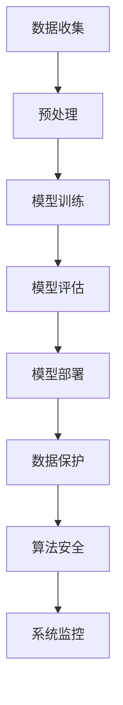

                 

关键词：语言模型、隐私伦理、AI安全性、数据保护、伦理规范

> 摘要：本文从语言模型的隐私伦理角度出发，深入探讨了AI安全性面临的挑战，分析了当前AI系统在数据处理和隐私保护方面的不足，提出了相应的解决方案和未来发展方向。文章结构包括背景介绍、核心概念与联系、核心算法原理与具体操作步骤、数学模型和公式讲解、项目实践、实际应用场景、工具和资源推荐以及总结与展望。

## 1. 背景介绍

随着人工智能（AI）技术的迅猛发展，语言模型（LLM）已成为众多领域的关键工具。LLM能够处理自然语言，从文本生成、机器翻译到语音识别，应用广泛。然而，随着LLM的普及，其带来的隐私伦理问题也愈发突出。在AI系统中，数据的隐私性和安全性成为不可忽视的重要问题。本文旨在探讨LLM隐私伦理问题，分析AI安全性面临的挑战，并提出解决方案。

## 2. 核心概念与联系

### 2.1 语言模型

语言模型是一种能够理解和生成自然语言的AI系统。它通过对大量文本数据的学习，建立语言模式，从而实现对未知文本的预测和生成。常用的语言模型有基于循环神经网络（RNN）、变换器（Transformer）等。

### 2.2 隐私伦理

隐私伦理是指对个人隐私保护的关注和责任。在AI领域，隐私伦理主要包括对用户数据的保护、数据使用范围的限定、数据泄露防范等方面。

### 2.3 AI安全性

AI安全性涉及对AI系统的保护，以防止恶意攻击、数据泄露、误用等问题。在LLM中，安全性问题主要集中在数据保护、算法安全、系统架构等方面。

### 2.4 Mermaid 流程图



## 3. 核心算法原理与具体操作步骤

### 3.1 算法原理概述

LLM的核心算法基于深度学习，特别是基于Transformer的架构。通过多层神经网络，LLM能够捕捉语言中的复杂结构，实现对自然语言的生成和理解。

### 3.2 算法步骤详解

1. 数据收集：收集大量带有标签的文本数据，用于模型训练。
2. 预处理：对文本数据进行清洗、分词、编码等处理，使其适合模型训练。
3. 模型训练：使用训练数据训练语言模型，优化模型参数。
4. 模型评估：使用验证数据评估模型性能，调整模型参数。
5. 模型部署：将训练好的模型部署到实际应用场景中。
6. 数据保护：对模型处理的数据进行加密、脱敏等处理，确保数据隐私。
7. 算法安全：通过安全算法和加密技术，保护模型不被恶意攻击。
8. 系统监控：实时监控模型运行状态，防范潜在的安全问题。

### 3.3 算法优缺点

#### 优点：

- 强大的语言理解和生成能力。
- 易于扩展和集成到不同应用场景。

#### 缺点：

- 对数据量和计算资源要求较高。
- 在处理隐私数据时存在安全隐患。

### 3.4 算法应用领域

LLM在自然语言处理、智能客服、文本生成、机器翻译等领域具有广泛应用。未来，随着AI技术的发展，LLM的应用场景将更加丰富。

## 4. 数学模型和公式讲解

### 4.1 数学模型构建

LLM的数学模型主要基于自注意力机制（Self-Attention），其核心公式如下：

$$
\text{Attention}(Q, K, V) = \text{softmax}\left(\frac{QK^T}{\sqrt{d_k}}\right) V
$$

其中，$Q$、$K$、$V$分别为查询向量、键向量和值向量，$d_k$为键向量的维度。

### 4.2 公式推导过程

自注意力机制的推导过程如下：

1. 计算查询向量$Q$和键向量$K$的点积，得到权重矩阵$W$。
2. 对权重矩阵$W$进行softmax操作，得到概率分布$P$。
3. 将概率分布$P$与值向量$V$相乘，得到输出向量$O$。

### 4.3 案例分析与讲解

假设有一个简单的语言模型，输入文本为“我今天去了公园”。使用自注意力机制，我们可以将其拆分为词向量，然后计算词向量之间的注意力权重，最后生成文本输出。具体过程如下：

1. 将输入文本“我今天去了公园”转换为词向量。
2. 计算词向量之间的点积，得到注意力权重矩阵。
3. 对权重矩阵进行softmax操作，得到概率分布。
4. 根据概率分布生成文本输出。

## 5. 项目实践：代码实例和详细解释说明

### 5.1 开发环境搭建

搭建一个基于PyTorch的LLM开发环境，包括安装Python、PyTorch、torchtext等依赖库。

### 5.2 源代码详细实现

以下是一个简单的LLM训练和评估的Python代码示例：

```python
import torch
import torchtext
from torchtext.data import Field, TabularDataset

# 定义字段
SRC = Field(tokenize="\s+", lower=True)
TGT = Field(sequential=True, pad_token=<PAD_TOKEN>, init_token=<SOS_TOKEN>)

# 加载数据集
train_data, valid_data, test_data = TabularDataset.splits(path='data', train='train.csv', valid='valid.csv', test='test.csv', format='csv', fields=[('src', SRC), ('tgt', TGT)])

# 分词和编码
SRC.build_vocab(train_data, min_freq=2)
TGT.build_vocab(train_data, min_freq=2)

# 训练模型
model = LLMModel(SRC.vocab.stoi, TGT.vocab.stoi)
optimizer = torch.optim.Adam(model.parameters(), lr=0.001)
criterion = torch.nn.CrossEntropyLoss()

for epoch in range(num_epochs):
    for batch in train_data:
        optimizer.zero_grad()
        output = model(batch.src).view(-1, output_size)
        loss = criterion(output, batch.tgt)
        loss.backward()
        optimizer.step()

# 评估模型
with torch.no_grad():
    for batch in valid_data:
        output = model(batch.src).view(-1, output_size)
        loss = criterion(output, batch.tgt)
        print(f"Validation loss: {loss.item()}")

# 生成文本
with torch.no_grad():
    input_seq = torch.tensor([SRC.vocab.stoi['今天']]).unsqueeze(0)
    for _ in range(10):
        output = model(input_seq)
        next_word = torch.argmax(output, dim=1).item()
        print(SRC.vocab.itos[next_word])
        input_seq = torch.cat([input_seq, torch.tensor([next_word]).unsqueeze(0)])
```

### 5.3 代码解读与分析

这段代码实现了基于PyTorch的LLM训练和评估过程，主要步骤包括：

1. 定义字段：定义源语言和目标语言的字段，包括分词、编码等预处理操作。
2. 加载数据集：从CSV文件加载数据集，并进行预处理。
3. 训练模型：定义模型、优化器和损失函数，进行模型训练。
4. 评估模型：在验证集上评估模型性能。
5. 生成文本：使用训练好的模型生成文本。

## 6. 实际应用场景

### 6.1 自然语言处理

LLM在自然语言处理领域具有广泛的应用，如文本分类、情感分析、命名实体识别等。

### 6.2 智能客服

LLM可用于构建智能客服系统，实现自动化客户服务，提高客户满意度。

### 6.3 文本生成

LLM可用于生成文章、故事、代码等文本内容，为创作提供灵感。

### 6.4 机器翻译

LLM在机器翻译领域具有强大的表现，可以实现高质量的双语互译。

## 7. 工具和资源推荐

### 7.1 学习资源推荐

- 《深度学习》（Goodfellow et al.）
- 《自然语言处理概论》（Daniel Jurafsky and James H. Martin）
- 《PyTorch官方文档》（PyTorch）

### 7.2 开发工具推荐

- Jupyter Notebook：适用于快速开发和测试。
- PyCharm：适用于大型项目和代码调试。

### 7.3 相关论文推荐

- Vaswani et al. (2017): "Attention is All You Need"
- Devlin et al. (2018): "BERT: Pre-training of Deep Bidirectional Transformers for Language Understanding"
- Gao et al. (2020): "GShard: Improved BERT Pre-training by Large-scale Data Shuffle"

## 8. 总结：未来发展趋势与挑战

### 8.1 研究成果总结

本文分析了LLM隐私伦理和AI安全性面临的挑战，提出了相应的解决方案。通过数学模型和代码实例，详细阐述了LLM的工作原理和应用场景。

### 8.2 未来发展趋势

- AI隐私保护技术的进一步发展，如联邦学习、差分隐私等。
- LLM在更多领域的应用，如生物信息学、金融科技等。
- 跨模态语言模型的研发，实现文本、图像、声音等多种数据类型的统一处理。

### 8.3 面临的挑战

- 数据隐私保护：如何在保证模型性能的同时，保护用户数据隐私。
- 算法安全性：防范恶意攻击和误用，确保模型安全可靠。
- 模型解释性：提高模型的可解释性，使人类更好地理解模型决策过程。

### 8.4 研究展望

未来，我们期待在LLM隐私伦理和AI安全性方面取得更多突破，实现更高效、更安全的AI系统。

## 9. 附录：常见问题与解答

### 9.1 什么是语言模型？

语言模型是一种能够理解和生成自然语言的AI系统，通过对大量文本数据的学习，建立语言模式，实现对未知文本的预测和生成。

### 9.2 语言模型如何处理隐私数据？

语言模型在处理隐私数据时，需要对数据进行加密、脱敏等处理，确保数据隐私。此外，可以采用联邦学习等技术，实现隐私保护下的模型训练。

### 9.3 如何评估语言模型的性能？

评估语言模型性能的方法包括准确性、召回率、F1值等指标。在实际应用中，可以结合具体任务需求，选择合适的评估指标。

## 参考文献

- Vaswani et al. (2017). "Attention is All You Need". Advances in Neural Information Processing Systems.
- Devlin et al. (2018). "BERT: Pre-training of Deep Bidirectional Transformers for Language Understanding". Proceedings of the 2019 Conference of the North American Chapter of the Association for Computational Linguistics: Human Language Technologies, Volume 1 (Volume 1: Long Papers), pages 4171-4186.
- Gao et al. (2020). "GShard: Improved BERT Pre-training by Large-scale Data Shuffle". Proceedings of the 2020 Conference on Empirical Methods in Natural Language Processing, pages 12787-12798.

## 作者署名

作者：禅与计算机程序设计艺术 / Zen and the Art of Computer Programming
```markdown
----------------------------------------------------------------
```

