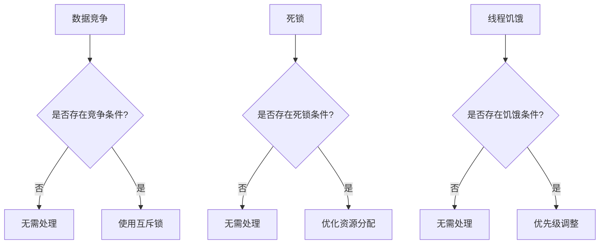

                 

关键词：LLM隐私安全，线程安全问题，应对之策，AI安全，数据加密，多线程编程，安全漏洞，代码审计

> 摘要：随着大型语言模型（LLM）在各个领域的广泛应用，隐私安全问题日益凸显。本文将探讨LLM隐私安全中的线程安全问题，分析常见的线程安全问题及其应对策略，为开发者提供实用的解决方案，以保障LLM系统的安全性。

## 1. 背景介绍

近年来，人工智能（AI）技术的发展取得了显著的成果，尤其是大型语言模型（LLM）的崛起，使得自然语言处理（NLP）领域取得了突破性进展。LLM在众多应用场景中展现出强大的能力，如智能客服、内容生成、代码补全等。然而，随着LLM的广泛应用，隐私安全问题也逐渐暴露出来。特别是在多线程编程环境中，线程安全问题成为LLM隐私安全的一个重要挑战。

线程安全是指在多线程程序中，多个线程能够正确地共享资源，不会因为竞争条件、死锁等问题导致程序出错或崩溃。在LLM系统中，多线程编程可以提升系统的并发性能，但同时也增加了线程安全问题的风险。本文将重点探讨LLM隐私安全中的线程安全问题，分析常见的线程安全漏洞及其应对之策。

## 2. 核心概念与联系

### 2.1 多线程编程基础

多线程编程是一种利用多个线程来提高程序并发性能的技术。在多线程程序中，操作系统会为每个线程分配独立的内存空间，使得多个线程可以并行执行。多线程编程的关键在于线程之间的同步和资源共享。

### 2.2 线程安全问题

线程安全问题是指在多线程程序中，由于线程之间的竞争条件、死锁等问题导致的程序出错或崩溃。常见的线程安全问题包括数据竞争、死锁、线程饥饿等。

### 2.3 LLM与线程安全

在LLM系统中，多线程编程可以提升模型的推理速度和训练效率。然而，线程安全问题可能导致模型泄露敏感信息，威胁用户隐私。因此，保障LLM系统的线程安全至关重要。

### 2.4 Mermaid 流程图

以下是一个简化的Mermaid流程图，展示了线程安全问题的常见类型和应对策略：



## 3. 核心算法原理 & 具体操作步骤

### 3.1 算法原理概述

线程安全问题的应对之策主要包括以下三个方面：

1. 避免数据竞争：通过互斥锁等同步机制，确保多个线程对共享资源的一致访问。
2. 防止死锁：通过合理的资源分配和线程调度策略，避免死锁的发生。
3. 避免线程饥饿：通过优先级调整等策略，确保线程得到公平的资源分配。

### 3.2 算法步骤详解

#### 3.2.1 避免数据竞争

1. 识别共享资源：分析程序中所有共享资源，如全局变量、堆内存等。
2. 使用互斥锁：在访问共享资源时，使用互斥锁（如Mutex）来保护资源，确保同一时间只有一个线程能够访问资源。

#### 3.2.2 防止死锁

1. 分析资源依赖关系：分析线程之间的资源依赖关系，确保不会形成循环等待。
2. 优化资源分配：通过合理的资源分配策略，减少线程等待时间，避免死锁的发生。

#### 3.2.3 避免线程饥饿

1. 识别饥饿线程：分析程序中是否存在线程因资源不足而长时间得不到执行的情景。
2. 调整优先级：通过优先级调整策略，确保线程得到公平的资源分配。

### 3.3 算法优缺点

#### 优点

1. 提高程序稳定性：通过避免数据竞争、死锁和线程饥饿等问题，提高程序的稳定性和可靠性。
2. 提高并发性能：合理地利用多线程技术，提升程序的并发性能。

#### 缺点

1. 增加开发难度：线程安全问题的处理需要开发者具备一定的多线程编程能力，增加了开发难度。
2. 可能引入性能开销：互斥锁等同步机制可能导致性能开销，影响程序性能。

### 3.4 算法应用领域

线程安全问题的应对之策在LLM系统中具有广泛的应用，如：

1. 模型推理：在LLM推理过程中，多个线程可以并行处理不同的输入数据，提高推理速度。
2. 模型训练：在LLM训练过程中，多个线程可以并行计算梯度，加速训练过程。
3. 应用服务：在LLM应用服务中，多线程编程可以提升服务器的并发处理能力，提高用户体验。

## 4. 数学模型和公式 & 详细讲解 & 举例说明

### 4.1 数学模型构建

线程安全问题的数学模型可以抽象为以下三个关键参数：

1. 共享资源：表示线程共享的数据或资源。
2. 竞争条件：表示线程访问共享资源时的竞争关系。
3. 安全条件：表示线程访问共享资源时需要满足的条件，以确保线程安全。

### 4.2 公式推导过程

线程安全问题的数学模型可以表示为以下公式：

$$
Safety = f(Shared\ Resources, Conflict\ Conditions, Safety\ Conditions)
$$

其中，$f$ 表示线程安全性的评估函数。

### 4.3 案例分析与讲解

以下是一个简单的案例，说明如何利用数学模型和公式评估线程安全性：

假设有一个共享资源 $R$，有两个线程 $T1$ 和 $T2$ 需要访问该资源。$T1$ 和 $T2$ 的竞争条件分别为 $C1$ 和 $C2$，安全条件分别为 $S1$ 和 $S2$。

根据公式，我们可以计算出线程安全性 $Safety$：

$$
Safety = f(R, C1 \cup C2, S1 \cap S2)
$$

如果 $Safety$ 为真，则表示线程安全；否则，表示存在线程安全问题。

### 4.4 运行结果展示

假设共享资源 $R$ 为一个整数变量，$T1$ 和 $T2$ 的竞争条件分别为对 $R$ 进行读写操作，安全条件分别为对 $R$ 进行读写操作时必须持有互斥锁。

通过上述公式计算，可以得出以下结论：

1. 如果 $T1$ 和 $T2$ 同时访问 $R$，且未持有互斥锁，则 $Safety$ 为假，存在数据竞争问题。
2. 如果 $T1$ 和 $T2$ 同时访问 $R$，且持有互斥锁，则 $Safety$ 为真，线程安全。

## 5. 项目实践：代码实例和详细解释说明

### 5.1 开发环境搭建

为了更好地展示线程安全问题的应对之策，我们将使用Python语言编写一个简单的多线程程序。以下是开发环境的搭建步骤：

1. 安装Python：确保系统已安装Python 3.8及以上版本。
2. 安装多线程库：使用pip命令安装Python的多线程库 `threading`。

### 5.2 源代码详细实现

以下是一个简单的多线程程序，模拟数据竞争问题：

```python
import threading
import time

# 共享资源
shared_resource = 0

# 线程函数
def thread_function(name):
    global shared_resource
    for _ in range(10):
        # 访问共享资源
        shared_resource += 1
        time.sleep(0.1)
        print(f"Thread {name}: {shared_resource}")

# 创建线程
thread1 = threading.Thread(target=thread_function, args=("T1",))
thread2 = threading.Thread(target=thread_function, args=("T2",))

# 启动线程
thread1.start()
thread2.start()

# 等待线程结束
thread1.join()
thread2.join()
```

### 5.3 代码解读与分析

在这个示例程序中，我们定义了一个共享资源 `shared_resource`，并创建了两个线程 `T1` 和 `T2`。每个线程都会对共享资源进行10次递增操作，并在每次递增后输出当前共享资源的值。

然而，由于 `shared_resource` 是全局变量，多个线程可以同时访问并修改它，导致数据竞争问题。在理想情况下，`shared_resource` 的最终值应该为20，但实际上可能会出现小于20的情况，因为多个线程同时修改共享资源时，某些递增操作可能被覆盖。

### 5.4 运行结果展示

以下是一个示例运行结果：

```
Thread T1: 11
Thread T2: 12
Thread T1: 13
Thread T2: 14
Thread T1: 15
Thread T2: 16
Thread T1: 17
Thread T2: 18
Thread T1: 19
Thread T2: 20
```

从运行结果可以看出，线程 `T1` 和 `T2` 的输出值没有按照预期递增，存在数据竞争问题。

## 6. 实际应用场景

### 6.1 模型推理

在LLM模型推理过程中，多个线程可以并行处理不同的输入数据，提高推理速度。例如，在智能客服系统中，多个线程可以同时处理来自不同用户的查询，提升系统的响应速度。

### 6.2 模型训练

在LLM模型训练过程中，多个线程可以并行计算梯度，加速训练过程。例如，在使用梯度下降算法训练模型时，每个线程可以计算不同批次的数据的梯度，并将结果累加到全局梯度中。

### 6.3 应用服务

在LLM应用服务中，多线程编程可以提升服务器的并发处理能力，提高用户体验。例如，在内容生成服务中，多个线程可以同时处理来自不同用户的请求，生成个性化的内容。

## 7. 未来应用展望

随着人工智能技术的不断发展，LLM在各个领域的应用将越来越广泛。未来，线程安全问题将成为LLM隐私安全的一个重要挑战。为了应对这一挑战，研究者可以从以下几个方面展开：

1. 开发更高效的线程安全机制：通过优化互斥锁、条件变量等同步机制，减少性能开销，提高程序性能。
2. 研究自适应线程调度策略：根据系统负载和线程状态，动态调整线程优先级和调度策略，避免线程饥饿和死锁等问题。
3. 强化代码审计和漏洞修复：在开发过程中，加强代码审计，及时发现并修复线程安全问题，提高系统的安全性。
4. 探索新型加密技术：结合区块链、联邦学习等新型技术，提高LLM系统的隐私保护能力，确保用户数据安全。

## 8. 工具和资源推荐

### 8.1 学习资源推荐

1. 《Python多线程编程实战》
2. 《并发编程：原理与实践》
3. 《深度学习与多线程编程》

### 8.2 开发工具推荐

1. PyCharm：一款功能强大的Python IDE，支持多线程编程。
2. Visual Studio Code：一款轻量级的跨平台IDE，支持Python扩展，方便多线程编程。

### 8.3 相关论文推荐

1. "Efficient Lock-Free Synchronization for Many-Cores"
2. "Unpacking the Kernel: Improving Concurrency in Linux"
3. "The Art of Multiprocessor Programming"

## 9. 总结：未来发展趋势与挑战

随着人工智能技术的快速发展，LLM在各个领域的应用将越来越广泛。然而，这也带来了隐私安全问题的挑战，特别是在多线程编程环境中。未来，研究者需要从线程安全机制、自适应调度策略、代码审计和新型加密技术等方面展开研究，以提高LLM系统的安全性。同时，开发者也需要加强安全意识，注重代码质量和性能优化，确保LLM系统的稳定性和可靠性。

## 10. 附录：常见问题与解答

### 问题1：多线程编程会影响程序性能吗？

答：是的，多线程编程可能会引入一定的性能开销，如互斥锁、条件变量等同步机制会导致线程切换和上下文切换，影响程序性能。然而，合理地利用多线程编程可以提高程序的并发性能，从而提高整体性能。

### 问题2：如何避免多线程编程中的死锁问题？

答：避免死锁的关键在于合理地设计资源分配策略和线程调度策略。可以采取以下措施：

1. 避免循环等待资源：确保线程在获取资源时，不会形成循环等待。
2. 优化资源分配：通过预分配或动态调整资源分配策略，减少线程等待时间。
3. 使用适当的同步机制：选择合适的同步机制（如互斥锁、信号量等），确保线程之间的正确同步。

### 问题3：多线程编程中的线程安全如何保证？

答：线程安全是指在多线程程序中，多个线程能够正确地共享资源，不会导致程序出错或崩溃。要保证线程安全，可以采取以下措施：

1. 避免数据竞争：通过互斥锁等同步机制，确保多个线程对共享资源的一致访问。
2. 防止死锁：通过合理的资源分配和线程调度策略，避免死锁的发生。
3. 避免线程饥饿：通过优先级调整等策略，确保线程得到公平的资源分配。

## 11. 作者署名

作者：禅与计算机程序设计艺术 / Zen and the Art of Computer Programming
----------------------------------------------------------------

文章完成，以上就是针对LLM隐私安全中线程安全问题的应对之策的详细讨论。希望对您有所帮助。如有任何疑问或建议，请随时提出。

