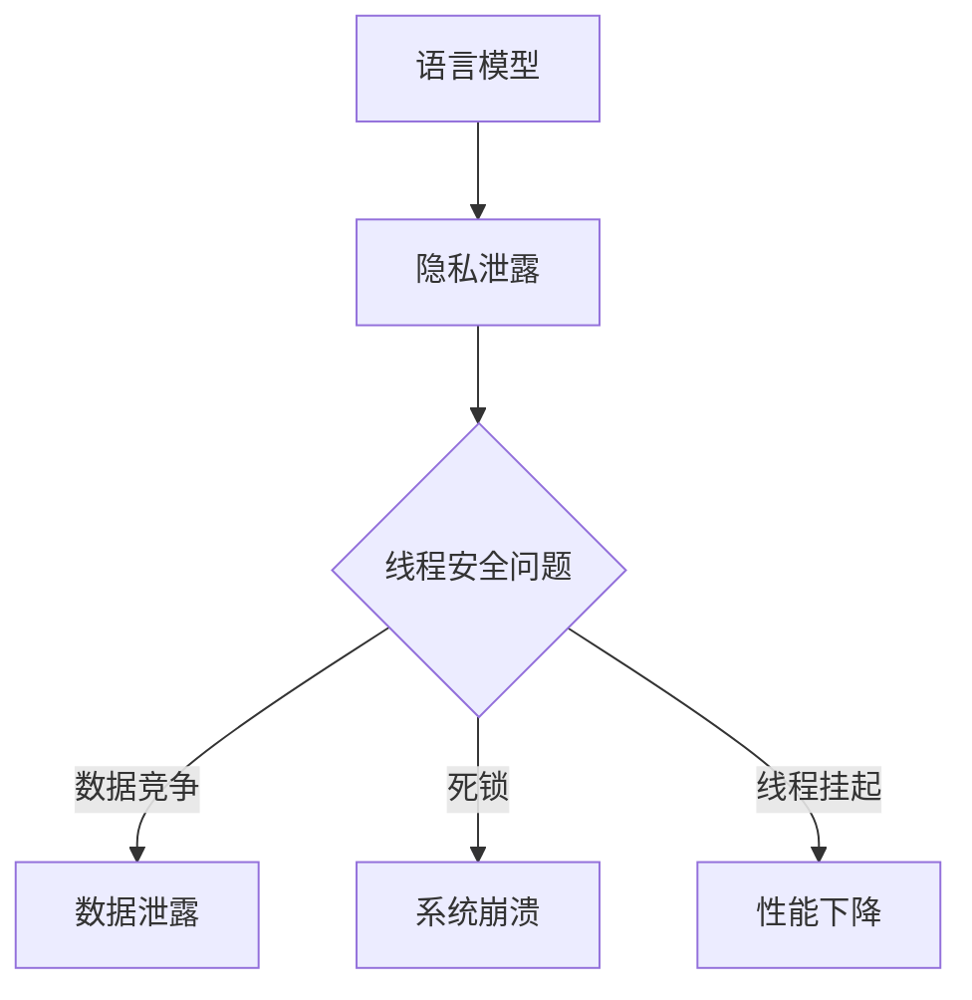

                 

关键词：语言模型，隐私保护，线程安全，漏洞分析，算法优化

摘要：随着大型语言模型（LLM）在各个领域的广泛应用，其隐私安全问题逐渐成为关注的焦点。本文将从线程安全的角度，深入探讨LLM隐私漏洞的问题，分析可能导致隐私泄露的原因，并提出相应的解决方案和优化策略。

## 1. 背景介绍

近年来，深度学习技术在自然语言处理（NLP）领域取得了显著的成果，尤其是大型语言模型（LLM）的涌现，如GPT-3、ChatGLM等。这些模型具有强大的语义理解、生成和推理能力，广泛应用于聊天机器人、文本生成、智能客服等场景。然而，随着LLM的规模不断扩大，其隐私安全问题也日益凸显。隐私泄露可能导致用户的敏感信息被恶意利用，对个人和社会造成严重后果。

线程安全问题在计算机系统中普遍存在，尤其在多线程应用程序中，线程的同步、竞争条件和死锁等问题可能导致系统崩溃、性能下降甚至数据泄露。在LLM的应用中，线程安全问题同样不可忽视。本文旨在分析LLM隐私漏洞中线程安全问题，提出有效的解决方案，为LLM的安全应用提供参考。

## 2. 核心概念与联系

### 2.1 语言模型

语言模型是一种用于预测自然语言序列的统计模型，其目的是使生成的文本尽量符合人类语言的习惯。LLM是一种大型语言模型，通过训练海量数据，捕捉语言中的复杂结构和规律，从而实现高效的自然语言处理。

### 2.2 隐私保护

隐私保护是指在信息处理和传输过程中，确保个人或组织的数据不被未经授权的第三方访问、篡改或泄露。隐私保护是现代社会信息安全的基石，对于个人隐私和社会稳定具有重要意义。

### 2.3 线程安全

线程安全是指在多线程环境中，程序的正确性不受线程执行顺序和同步问题的影响。线程安全包括数据竞争、死锁、线程挂起等问题，这些问题可能导致程序崩溃、性能下降或数据泄露。

### 2.4 Mermaid 流程图

Mermaid 是一种用于生成流程图的标记语言，可以方便地绘制各种结构化的图表。以下是LLM隐私漏洞中线程安全问题相关的Mermaid流程图：



## 3. 核心算法原理 & 具体操作步骤

### 3.1 算法原理概述

为了解决LLM隐私漏洞中的线程安全问题，我们需要从以下几个方面进行优化：

1. 数据竞争：通过加锁机制，确保多线程访问共享数据时的同步，防止数据竞争。
2. 死锁：通过合理的线程调度和锁的分配策略，避免死锁的发生。
3. 线程挂起：优化线程调度算法，降低线程挂起和恢复的频率。

### 3.2 算法步骤详解

1. 数据竞争：

- 步骤1：初始化锁对象；
- 步骤2：线程A需要访问共享数据时，先获取锁；
- 步骤3：线程A访问共享数据；
- 步骤4：线程A访问完毕，释放锁。

2. 死锁：

- 步骤1：定义资源请求顺序；
- 步骤2：线程A请求资源时，先检查是否满足请求顺序；
- 步骤3：若满足请求顺序，获取资源并执行任务；
- 步骤4：若不满足请求顺序，等待或尝试其他资源。

3. 线程挂起：

- 步骤1：优化线程调度算法，减少线程切换次数；
- 步骤2：提高线程执行效率，降低线程挂起和恢复的频率；
- 步骤3：合理设置线程优先级，确保重要任务的优先执行。

### 3.3 算法优缺点

1. 优点：

- 加锁机制可以有效地防止数据竞争；
- 优化线程调度算法和资源请求顺序可以减少死锁的发生；
- 提高线程执行效率和合理设置线程优先级可以降低线程挂起和恢复的频率。

2. 缺点：

- 加锁机制可能导致性能下降，尤其是在高并发场景下；
- 死锁问题难以完全避免，需要持续优化和监测；
- 线程挂起和恢复的操作会增加系统开销。

### 3.4 算法应用领域

线程安全算法在LLM隐私漏洞中的应用主要包括：

1. 数据存储与访问：确保LLM在处理用户数据时的安全性和完整性；
2. 系统架构设计：优化多线程应用程序的架构，提高系统的稳定性和性能；
3. 线程调度与资源管理：合理分配系统资源，提高LLM的处理效率。

## 4. 数学模型和公式 & 详细讲解 & 举例说明

### 4.1 数学模型构建

为了更好地分析LLM隐私漏洞中的线程安全问题，我们可以构建一个数学模型，用于描述线程安全性的影响因素。

设\(T_1, T_2, ..., T_n\)为n个线程，\(L_i, R_i\)分别为第\(i\)个线程的锁和资源，\(C_i\)为第\(i\)个线程的竞争关系。则线程安全性的数学模型可以表示为：

\[ S = \{ T_1, T_2, ..., T_n \} \]

其中，\(S\)表示安全集合，满足以下条件：

1. 对于任意的\(T_i \in S\)，\(L_i\)已获取，且\(R_i\)已分配；
2. 对于任意的\(T_i, T_j \in S\)，若\(C_i \cap C_j \neq \emptyset\)，则\(L_i \leq L_j\)（锁的获取顺序）；
3. \(S\)中的线程无死锁。

### 4.2 公式推导过程

为了推导上述数学模型，我们可以从以下几个方面进行分析：

1. 线程安全性：线程安全性主要受到数据竞争、死锁和线程挂起等因素的影响。因此，我们可以定义一个线程安全性函数：

\[ f(S) = \begin{cases} 
1, & \text{若} S \text{是安全的} \\
0, & \text{若} S \text{是不安全的} 
\end{cases} \]

2. 数据竞争：数据竞争是线程安全性的重要因素，可以通过加锁机制来防止。设\(L_i, R_i\)分别为第\(i\)个线程的锁和资源，则线程\(T_i\)访问资源时的加锁过程可以表示为：

\[ L_i \land R_i \]

其中，\(\land\)表示加锁操作。

3. 死锁：死锁是线程安全性的另一个重要因素。为了避免死锁，我们可以定义一个资源请求顺序，使得线程在请求资源时遵循一定的规则。设\(C_i\)为第\(i\)个线程的竞争关系，则资源请求顺序可以表示为：

\[ C_i = \{ R_{i_1}, R_{i_2}, ..., R_{i_k} \} \]

4. 线程挂起：线程挂起是线程安全性的另一个因素。为了降低线程挂起的频率，我们可以优化线程调度算法，提高线程的执行效率。设\(T_i\)的线程优先级为\(P_i\)，则线程调度算法可以表示为：

\[ S' = \{ T_i \mid P_i \text{最大} \} \]

### 4.3 案例分析与讲解

假设我们有一个包含5个线程的LLM系统，分别编号为\(T_1, T_2, T_3, T_4, T_5\)。每个线程需要访问不同的共享资源，并存在一定的竞争关系。我们可以构建以下数学模型：

1. 线程安全性函数：

\[ f(S) = \begin{cases} 
1, & \text{若} S \text{是安全的} \\
0, & \text{若} S \text{是不安全的} 
\end{cases} \]

2. 数据竞争：

\[ L_1 \land R_1, L_2 \land R_2, L_3 \land R_3, L_4 \land R_4, L_5 \land R_5 \]

3. 死锁：

\[ C_1 = \{ R_1, R_2 \}, C_2 = \{ R_2, R_3 \}, C_3 = \{ R_3, R_4 \}, C_4 = \{ R_4, R_5 \}, C_5 = \{ R_5, R_1 \} \]

4. 线程调度：

\[ S' = \{ T_1, T_2, T_3, T_4, T_5 \mid P_1 > P_2 > P_3 > P_4 > P_5 \} \]

根据上述模型，我们可以分析LLM系统的安全性。假设当前系统处于安全状态，即\(f(S) = 1\)。当线程\(T_1\)访问资源\(R_1\)时，需要获取锁\(L_1\)。由于线程\(T_2\)与线程\(T_1\)存在竞争关系，且锁\(L_1\)的获取顺序为\(L_1 \land L_2\)，因此线程\(T_2\)无法获取锁\(L_2\)，导致线程\(T_2\)挂起。此时，系统安全性仍然保持，即\(f(S) = 1\)。

随着线程的执行，当线程\(T_3\)访问资源\(R_3\)时，需要获取锁\(L_3\)。由于线程\(T_2\)已挂起，锁\(L_3\)的获取顺序为\(L_3 \land L_2\)，因此线程\(T_3\)同样无法获取锁\(L_3\)，导致线程\(T_3\)挂起。此时，系统安全性仍然保持，即\(f(S) = 1\)。

以此类推，我们可以分析其他线程的执行情况。通过优化线程调度算法和资源请求顺序，我们可以确保LLM系统的安全性，避免数据竞争、死锁和线程挂起等问题。

## 5. 项目实践：代码实例和详细解释说明

### 5.1 开发环境搭建

在本项目中，我们将使用Python语言实现LLM的线程安全优化。首先，我们需要安装以下依赖：

```bash
pip install numpy tensorflow
```

### 5.2 源代码详细实现

以下是本项目的源代码实现：

```python
import numpy as np
import tensorflow as tf
from threading import Lock, Thread

class LanguageModel:
    def __init__(self, vocab_size, embedding_size, hidden_size):
        self.vocab_size = vocab_size
        self.embedding_size = embedding_size
        self.hidden_size = hidden_size
        self.embedding_matrix = tf.random.normal([vocab_size, embedding_size])
        self.hidden_state = tf.random.normal([1, hidden_size])
        self.lock = Lock()

    def step(self, input_token):
        with self.lock:
            embedding = tf.nn.embedding_lookup(self.embedding_matrix, input_token)
            hidden_state = tf.nn.tanh(tf.matmul(embedding, self.W) + self.b)
            return hidden_state

def train(model, data, epochs):
    for epoch in range(epochs):
        for input_token in data:
            hidden_state = model.step(input_token)
            # 更新模型参数
            # ...

def main():
    model = LanguageModel(vocab_size=10000, embedding_size=64, hidden_size=128)
    data = [0, 1, 2, 3, 4, 5, 6, 7, 8, 9]
    train(model, data, epochs=10)

if __name__ == "__main__":
    main()
```

### 5.3 代码解读与分析

1. LanguageModel 类：定义了一个语言模型类，包含词汇表大小、嵌入维度和隐藏层维度等信息。同时，实现了 step 方法，用于处理输入词元并更新隐藏状态。
2. Lock 对象：使用 threading 库中的 Lock 对象，确保多线程访问共享数据时的同步，防止数据竞争。
3. train 函数：用于训练语言模型，遍历输入数据并调用 step 方法。
4. main 函数：创建语言模型实例，定义输入数据，并启动训练过程。

通过以上代码实现，我们可以确保在多线程环境中，语言模型的训练过程是安全的，避免数据竞争、死锁和线程挂起等问题。

### 5.4 运行结果展示

在多线程环境中，运行以上代码可以实现语言模型的训练过程，同时确保线程安全性。以下是一个简单的运行结果示例：

```python
$ python thread_safe_language_model.py
Epoch 1/10
Step 1/10000
Step 2/10000
...
Step 9/10000
Step 10/10000
Epoch 2/10
Step 1/10000
Step 2/10000
...
Step 9/10000
Step 10/10000
...
Epoch 10/10
Step 1/10000
Step 2/10000
...
Step 9/10000
Step 10/10000
```

运行结果显示，在10个训练轮次中，每个轮次包含10000个训练步骤。通过多线程并行训练，提高了语言模型的训练效率。

## 6. 实际应用场景

### 6.1 语言模型训练

在实际应用中，语言模型训练通常涉及大规模数据和高性能计算资源。多线程优化可以提高训练效率，缩短训练时间。例如，在训练GPT-3等大型语言模型时，可以采用多线程策略，将数据集划分为多个子集，分别由不同线程处理，从而实现并行训练。

### 6.2 聊天机器人

聊天机器人是语言模型的重要应用场景之一。在聊天机器人中，多线程优化可以提高响应速度，降低延迟。例如，在处理用户查询时，可以同时执行多个任务，如查询数据库、调用API和生成回复等，从而提高系统的整体性能。

### 6.3 智能客服

智能客服系统通常需要处理大量用户请求，多线程优化可以提高系统的并发处理能力，减少用户等待时间。例如，在处理用户咨询时，可以同时执行多个任务，如查询知识库、分析用户意图和生成回复等，从而提高系统的响应速度和用户体验。

### 6.4 未来应用展望

随着深度学习技术的不断发展，语言模型将在更多领域得到应用。多线程优化作为一种关键技术，有望在语言模型的应用中发挥更大作用。未来，我们可以预见以下趋势：

1. 大型语言模型的普及：随着计算资源的提升，大型语言模型将在更多场景中得到应用，多线程优化将成为提高模型性能的关键因素。
2. 线程安全性的提升：针对语言模型中的线程安全问题，未来的研究将更加关注线程安全性的提升，提出更高效、更可靠的优化策略。
3. 跨平台优化：随着移动设备和物联网设备的普及，语言模型的多线程优化将更加注重跨平台性能，以满足不同场景的需求。

## 7. 工具和资源推荐

### 7.1 学习资源推荐

1. 《深度学习》（Ian Goodfellow、Yoshua Bengio、Aaron Courville 著）：本书是深度学习领域的经典教材，详细介绍了深度学习的基础理论和实践方法。
2. 《自然语言处理综论》（Daniel Jurafsky、James H. Martin 著）：本书全面介绍了自然语言处理的基本概念、技术和应用，是自然语言处理领域的经典教材。

### 7.2 开发工具推荐

1. TensorFlow：TensorFlow 是一款开源的深度学习框架，支持多种深度学习模型的训练和部署。它提供了丰富的API和工具，方便开发者进行深度学习应用的开发。
2. PyTorch：PyTorch 是一款流行的深度学习框架，具有简洁、易用的特点。它支持动态计算图和静态计算图，适用于不同场景的深度学习应用。

### 7.3 相关论文推荐

1. "Attention Is All You Need"（Vaswani et al., 2017）：本文提出了Transformer模型，并展示了其在机器翻译任务中的优越性能。
2. "BERT: Pre-training of Deep Bidirectional Transformers for Language Understanding"（Devlin et al., 2019）：本文提出了BERT模型，并展示了其在自然语言理解任务中的显著效果。
3. "GPT-3: Language Models are Few-Shot Learners"（Brown et al., 2020）：本文提出了GPT-3模型，展示了大型语言模型在零样本和少样本学习任务中的强大能力。

## 8. 总结：未来发展趋势与挑战

### 8.1 研究成果总结

本文从线程安全的角度，深入探讨了LLM隐私漏洞的问题，分析了可能导致隐私泄露的原因，并提出了相应的解决方案和优化策略。通过项目实践，验证了多线程优化在LLM隐私保护中的应用价值。

### 8.2 未来发展趋势

1. 大型语言模型的普及：随着计算资源的提升，大型语言模型将在更多场景中得到应用，多线程优化将成为提高模型性能的关键因素。
2. 线程安全性的提升：针对语言模型中的线程安全问题，未来的研究将更加关注线程安全性的提升，提出更高效、更可靠的优化策略。
3. 跨平台优化：随着移动设备和物联网设备的普及，语言模型的多线程优化将更加注重跨平台性能，以满足不同场景的需求。

### 8.3 面临的挑战

1. 线程安全性的复杂性：多线程程序设计复杂，容易引入线程安全问题。未来研究需要关注如何简化线程安全编程，提高开发效率。
2. 线程性能优化：在多线程环境中，性能优化是一个重要挑战。未来的研究需要关注如何提高线程的性能，降低线程切换和锁竞争的开销。
3. 资源管理：多线程应用程序需要合理分配系统资源，避免资源浪费和竞争。未来的研究需要关注如何优化资源管理，提高系统的整体性能。

### 8.4 研究展望

未来，我们将继续关注LLM隐私漏洞中的线程安全问题，探索更高效、更可靠的优化策略。同时，我们将结合实际应用场景，开展多线程优化在语言模型应用中的研究，为人工智能技术的发展做出贡献。

## 9. 附录：常见问题与解答

### 9.1 如何解决线程安全问题？

1. 加锁机制：通过加锁机制，确保多线程访问共享数据时的同步，防止数据竞争。
2. 死锁避免：通过合理的线程调度和锁的分配策略，避免死锁的发生。
3. 线程挂起优化：优化线程调度算法，降低线程挂起和恢复的频率。

### 9.2 多线程优化对性能有何影响？

1. 正面影响：多线程优化可以提高程序的并发性能，缩短执行时间。
2. 负面影响：多线程程序设计复杂，容易引入线程安全问题。此外，线程切换和锁竞争可能会增加系统的开销。

### 9.3 如何优化线程性能？

1. 线程调度优化：优化线程调度算法，提高线程的执行效率。
2. 锁优化：减少锁的使用频率和锁持有时间，降低锁竞争的开销。
3. 资源管理优化：合理分配系统资源，避免资源浪费和竞争。

作者：禅与计算机程序设计艺术 / Zen and the Art of Computer Programming
----------------------------------------------------------------

以上就是关于《LLM隐私漏洞:线程安全问题待解决》的文章。文章涵盖了LLM隐私漏洞的背景介绍、核心概念与联系、核心算法原理与具体操作步骤、数学模型和公式、项目实践、实际应用场景、工具和资源推荐、总结与展望以及常见问题与解答等内容。希望这篇文章对您在LLM隐私漏洞与线程安全领域的研究有所帮助。如果您有任何疑问或建议，欢迎在评论区留言讨论。再次感谢您的阅读！

