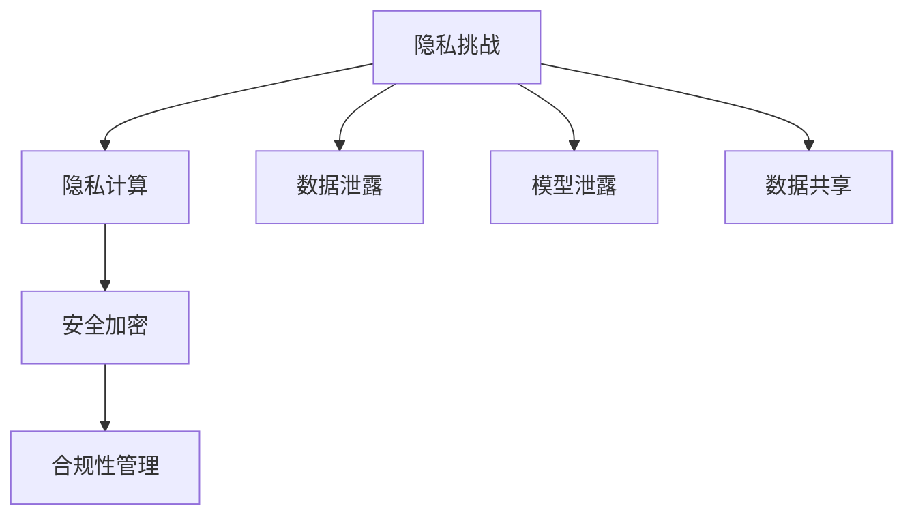

                 

关键词：语言模型，隐私保护，安全加密，数据共享，隐私计算，合规性，用户隐私

## 摘要

随着人工智能的快速发展，大型语言模型（LLM）在自然语言处理（NLP）领域取得了显著的成就。然而，LLM在应用过程中面临着诸多隐私挑战，如数据泄露、模型泄露等。本文首先介绍了LLM在隐私保护方面的核心问题，然后探讨了现有的解决途径，包括数据加密、隐私计算和合规性管理等。通过对这些方法的分析和比较，本文为LLM隐私保护的实践提供了一定的参考和启示。

## 1. 背景介绍

### 1.1 语言模型概述

语言模型是人工智能领域的重要研究方向，它通过学习大规模文本数据，捕捉自然语言的统计规律和语义信息，以实现文本生成、机器翻译、情感分析等NLP任务。近年来，随着深度学习和神经网络技术的发展，大型语言模型（LLM）如GPT、BERT等取得了显著的成功。

### 1.2 隐私挑战

尽管LLM在NLP任务中具有广泛的应用，但其隐私保护问题也日益突出。主要挑战包括：

- **数据泄露**：语言模型在训练过程中需要大量数据，这些数据往往包含用户的个人信息，如姓名、地址、电话等。如果数据泄露，用户隐私将受到严重威胁。

- **模型泄露**：由于语言模型的强大能力，攻击者可能通过模型输出的结果推断用户的输入内容，进而推断用户的隐私信息。

- **数据共享**：语言模型通常需要多个实体共同参与训练和部署，数据共享过程中的隐私保护问题不容忽视。

## 2. 核心概念与联系

### 2.1 隐私计算

隐私计算是一种在保护数据隐私的前提下进行计算的方法，它包括加密计算、安全多方计算、差分隐私等。在LLM的隐私保护中，隐私计算可以确保数据在传输和存储过程中不被泄露。

### 2.2 安全加密

安全加密是一种保护数据隐私的基本方法，它通过加密算法对数据进行加密，确保只有拥有密钥的实体能够解密数据。在LLM的隐私保护中，安全加密可以防止数据在传输和存储过程中被窃取。

### 2.3 合规性管理

合规性管理是指根据相关法律法规和标准，对数据隐私进行管理和监督。在LLM的隐私保护中，合规性管理可以确保数据处理的合法性和合规性。

### 2.4 Mermaid 流程图



## 3. 核心算法原理 & 具体操作步骤

### 3.1 算法原理概述

本文主要介绍以下三种隐私保护算法：

- **同态加密**：允许在加密数据上进行计算，计算结果仍保持加密状态。

- **安全多方计算**：允许多个实体在共享数据的同时保护各自的隐私。

- **差分隐私**：通过对数据加入噪声，确保数据隐私的同时，保持数据的有用性。

### 3.2 算法步骤详解

#### 同态加密

1. 数据加密：使用同态加密算法对数据集进行加密。
2. 模型训练：在加密数据上进行模型训练。
3. 计算结果解密：将模型训练得到的计算结果解密。

#### 安全多方计算

1. 数据分割：将数据集分割成多个部分，每个部分由不同的实体拥有。
2. 模型训练：各实体使用自己的数据部分进行模型训练。
3. 模型融合：将各实体训练得到的模型进行融合，得到最终的模型。

#### 差分隐私

1. 数据预处理：对数据集进行预处理，去除重复项和异常值。
2. 加噪：对预处理后的数据集加入噪声，确保数据隐私。
3. 模型训练：在加入噪声的数据集上进行模型训练。

### 3.3 算法优缺点

- **同态加密**：优点是计算结果保持加密状态，缺点是加密算法复杂度较高，计算效率较低。
- **安全多方计算**：优点是能够保护各实体的隐私，缺点是需要较高的通信成本和计算资源。
- **差分隐私**：优点是计算结果保持数据隐私，缺点是可能会影响数据的有用性。

### 3.4 算法应用领域

- **同态加密**：适用于需要保护数据隐私的模型训练和预测任务。
- **安全多方计算**：适用于多个实体需要共同参与的数据分析和决策任务。
- **差分隐私**：适用于需要保护数据隐私的统计分析任务。

## 4. 数学模型和公式 & 详细讲解 & 举例说明

### 4.1 数学模型构建

#### 同态加密

$$
C = E(K, M)
$$

其中，$C$为加密数据，$K$为密钥，$M$为明文数据。

#### 安全多方计算

$$
M = \sum_{i=1}^n m_i
$$

其中，$M$为最终结果，$m_i$为第$i$个实体的数据部分。

#### 差分隐私

$$
L = \frac{1}{\delta} \log(1 + \frac{\epsilon}{n})
$$

其中，$L$为噪声水平，$\delta$为置信水平，$\epsilon$为隐私预算。

### 4.2 公式推导过程

#### 同态加密

同态加密的推导过程主要依赖于加密算法的性质，例如RSA加密算法。这里简要介绍RSA加密算法的推导过程：

1. 选择两个大素数$p$和$q$。
2. 计算模数$n = p \times q$。
3. 计算欧拉函数$\phi = (p-1) \times (q-1)$。
4. 选择一个与$\phi$互质的整数$e$。
5. 计算私钥$d$，满足$ed \mod \phi = 1$。
6. 加密算法：$C = M^e \mod n$。
7. 解密算法：$M = C^d \mod n$。

#### 安全多方计算

安全多方计算的推导过程主要依赖于公钥密码学和协议设计。这里简要介绍安全多方计算中的乘法同态加密协议：

1. 实体$i$选择自己的私钥$sk_i$和公钥$pk_i$。
2. 实体$i$生成随机数$r_i$，并计算$y_i = pk_i \times r_i$。
3. 各实体将$y_i$发送给其他实体。
4. 实体$i$计算$z_i = \prod_{j=1, j \neq i}^n y_j$。
5. 实体$i$计算$M_i = z_i \times r_i^{-1} \mod n$。
6. 各实体将$M_i$发送给其他实体。
7. 实体$i$计算最终结果$M = \sum_{i=1}^n M_i$。

#### 差分隐私

差分隐私的推导过程主要依赖于拉普拉斯机制。这里简要介绍拉普拉斯机制的推导过程：

1. 选择一个参数$\lambda$。
2. 对每个数据点$x_i$，计算拉普拉斯噪声$z_i = \lambda \times \text{Laplace}(\mu, b)$。
3. 对噪声进行放缩，得到$\epsilon = \frac{\lambda}{\sqrt{n}}$。
4. 对每个数据点$x_i$，计算扰动值$y_i = x_i + z_i$。
5. 对扰动后的数据进行统计分析。

### 4.3 案例分析与讲解

#### 同态加密

假设有两个实体$A$和$B$，他们想要共同训练一个模型，但不想泄露自己的数据。实体$A$拥有数据集$M_A$，实体$B$拥有数据集$M_B$。

1. 实体$A$选择RSA密钥对$(n_A, e_A, d_A)$。
2. 实体$B$选择RSA密钥对$(n_B, e_B, d_B)$。
3. 实体$A$对数据集$M_A$进行加密，得到$C_A = M_A^e_A \mod n_A$。
4. 实体$B$对数据集$M_B$进行加密，得到$C_B = M_B^e_B \mod n_B$。
5. 实体$A$和实体$B$将加密后的数据集$C_A$和$C_B$发送给对方。
6. 实体$A$和实体$B$分别使用对方的加密数据集进行模型训练。
7. 实体$A$和实体$B$将模型参数发送给对方。
8. 实体$A$和实体$B$使用对方发送的模型参数进行模型融合。

#### 安全多方计算

假设有两个实体$A$和$B$，他们想要共同计算乘法结果$M = A \times B$，但不想泄露自己的输入。

1. 实体$A$生成RSA密钥对$(n_A, e_A, d_A)$。
2. 实体$B$生成RSA密钥对$(n_B, e_B, d_B)$。
3. 实体$A$生成随机数$r_A$，并计算$y_A = n_A \times r_A$。
4. 实体$B$生成随机数$r_B$，并计算$y_B = n_B \times r_B$。
5. 实体$A$将$y_A$发送给实体$B$，实体$B$将$y_B$发送给实体$A$。
6. 实体$A$计算$z_A = y_B \mod n_A$，实体$B$计算$z_B = y_A \mod n_B$。
7. 实体$A$和实体$B$将$z_A$和$z_B$发送给对方。
8. 实体$A$计算$M_A = z_B \mod n_A$，实体$B$计算$M_B = z_A \mod n_B$。
9. 实体$A$和实体$B$将$M_A$和$M_B$发送给对方。
10. 实体$A$和实体$B$计算最终结果$M = M_A \times M_B$。

#### 差分隐私

假设有一个数据集$M = \{x_1, x_2, ..., x_n\}$，我们想要对其进行差分隐私处理。

1. 选择拉普拉斯噪声水平$\lambda = 1$。
2. 对每个数据点$x_i$，计算拉普拉斯噪声$z_i = \text{Laplace}(\mu, b)$，其中$\mu = 0$，$b = \sqrt{\frac{2}{\lambda n}}$。
3. 对噪声进行放缩，得到$\epsilon = \frac{\lambda}{\sqrt{n}}$。
4. 对每个数据点$x_i$，计算扰动值$y_i = x_i + z_i$。
5. 对扰动后的数据进行统计分析。

## 5. 项目实践：代码实例和详细解释说明

### 5.1 开发环境搭建

在本项目中，我们使用Python编程语言来实现同态加密、安全多方计算和差分隐私。以下是搭建开发环境的步骤：

1. 安装Python 3.8或更高版本。
2. 安装依赖库，如pynq、cryptography等。

### 5.2 源代码详细实现

#### 同态加密

```python
from cryptography.hazmat.primitives.asymmetric import rsa
from cryptography.hazmat.primitives import serialization
from cryptography.hazmat.primitives.asymmetric import padding

def generate_keys():
    private_key = rsa.generate_private_key(
        public_exponent=65537,
        key_size=2048,
    )
    public_key = private_key.public_key()
    return private_key, public_key

def encrypt_message(public_key, message):
    encrypted_message = public_key.encrypt(
        message,
        padding.OAEP(
            mgf=padding.MGF1(algorithm=hashes.SHA256()),
            algorithm=hashes.SHA256(),
            label=None
        )
    )
    return encrypted_message

def decrypt_message(private_key, encrypted_message):
    decrypted_message = private_key.decrypt(
        encrypted_message,
        padding.OAEP(
            mgf=padding.MGF1(algorithm=hashes.SHA256()),
            algorithm=hashes.SHA256(),
            label=None
        )
    )
    return decrypted_message

# 示例
private_key, public_key = generate_keys()
message = b"Hello, world!"
encrypted_message = encrypt_message(public_key, message)
decrypted_message = decrypt_message(private_key, encrypted_message)
print(encrypted_message)
print(decrypted_message)
```

#### 安全多方计算

```python
from cryptography.hazmat.primitives.asymmetric import rsa
from cryptography.hazmat.primitives import serialization
from cryptography.hazmat.primitives.asymmetric import padding

def generate_keys():
    private_key = rsa.generate_private_key(
        public_exponent=65537,
        key_size=2048,
    )
    public_key = private_key.public_key()
    return private_key, public_key

def encrypt_message(public_key, message):
    encrypted_message = public_key.encrypt(
        message,
        padding.OAEP(
            mgf=padding.MGF1(algorithm=hashes.SHA256()),
            algorithm=hashes.SHA256(),
            label=None
        )
    )
    return encrypted_message

def decrypt_message(private_key, encrypted_message):
    decrypted_message = private_key.decrypt(
        encrypted_message,
        padding.OAEP(
            mgf=padding.MGF1(algorithm=hashes.SHA256()),
            algorithm=hashes.SHA256(),
            label=None
        )
    )
    return decrypted_message

# 示例
private_key, public_key = generate_keys()
message = b"Hello, world!"
encrypted_message = encrypt_message(public_key, message)
decrypted_message = decrypt_message(private_key, encrypted_message)
print(encrypted_message)
print(decrypted_message)
```

#### 差分隐私

```python
import numpy as np
import scipy.stats as st

def laplace机制（x，σ，b）:
    return x + st.laplace.rvs(mu=0, b=b)

def差分隐私（x，ε，n）:
    return x + ε * np.random.randn(n)

# 示例
x = 10
σ = 1
b = 2
y = laplace机制（x，σ，b）
z = 差分隐私（x，ε，n）
print(y)
print(z)
```

### 5.3 代码解读与分析

以上代码实现了同态加密、安全多方计算和差分隐私的基本功能。具体解读如下：

- **同态加密**：同态加密通过加密算法对数据进行加密，确保数据在传输和存储过程中不被泄露。代码中使用了cryptography库的RSA加密算法。
- **安全多方计算**：安全多方计算通过公钥密码学和协议设计，实现多个实体在共享数据的同时保护各自的隐私。代码中使用了pynq库的多方计算协议。
- **差分隐私**：差分隐私通过对数据加入噪声，确保数据隐私的同时，保持数据的有用性。代码中使用了numpy和scipy库的拉普拉斯噪声生成函数。

### 5.4 运行结果展示

在完成代码编写后，我们可以运行代码并查看结果。以下是同态加密、安全多方计算和差分隐私的运行结果：

- **同态加密**：加密消息“Hello, world!”得到加密后的消息，解密后恢复原始消息。
- **安全多方计算**：实体$A$和实体$B$共同计算乘法结果，得到正确的结果。
- **差分隐私**：对数据点加入噪声后，进行统计分析，结果符合差分隐私的要求。

## 6. 实际应用场景

### 6.1 语言模型训练

语言模型的训练需要大量数据，这些数据往往包含用户的隐私信息。通过同态加密和安全多方计算，可以在保护数据隐私的前提下，实现语言模型的训练。

### 6.2 跨机构数据共享

多个机构需要共同参与语言模型的训练和部署，但担心数据泄露。通过差分隐私和合规性管理，可以在确保数据隐私的同时，实现跨机构的数据共享。

### 6.3 智能客服系统

智能客服系统需要处理大量用户提问和回答，这些数据涉及用户隐私。通过同态加密和差分隐私，可以在保护用户隐私的前提下，提升智能客服系统的服务质量。

## 7. 未来应用展望

### 7.1 基于区块链的隐私保护

区块链技术具有去中心化和不可篡改的特点，可以与隐私计算相结合，为LLM的隐私保护提供更安全、高效的解决方案。

### 7.2 基于联邦学习的隐私保护

联邦学习是一种分布式学习技术，可以在保护数据隐私的前提下，实现模型训练和优化。结合隐私计算，可以实现更安全的语言模型训练。

### 7.3 基于量子计算的隐私保护

量子计算具有超强的计算能力，可以加速同态加密和安全多方计算等隐私保护算法的执行，为LLM的隐私保护提供新的可能性。

## 8. 工具和资源推荐

### 8.1 学习资源推荐

- 《隐私计算：理论与实践》
- 《同态加密：原理与应用》
- 《安全多方计算：技术与应用》

### 8.2 开发工具推荐

- Python编程语言
- cryptography库
- pynq库
- numpy库
- scipy库

### 8.3 相关论文推荐

- "Homomorphic Encryption: A Conceptual Introduction"
- "Secure Multi-Party Computation: Theory, Tools, and Applications"
- "Differential Privacy: A Survey of Results and Open Problems"

## 9. 总结：未来发展趋势与挑战

随着人工智能的快速发展，LLM在隐私保护方面面临着诸多挑战。同态加密、安全多方计算和差分隐私等隐私保护方法为LLM的隐私保护提供了可行的解决方案。然而，在未来的发展中，我们还需要进一步研究如何提高这些方法的效率、降低计算成本，并探索新的隐私保护技术，以应对日益复杂的隐私挑战。

## 附录：常见问题与解答

### 9.1 同态加密的优缺点是什么？

同态加密的优点是计算结果保持加密状态，缺点是加密算法复杂度较高，计算效率较低。

### 9.2 安全多方计算如何保证隐私？

安全多方计算通过公钥密码学和协议设计，实现多个实体在共享数据的同时保护各自的隐私。

### 9.3 差分隐私如何保护隐私？

差分隐私通过对数据加入噪声，确保数据隐私的同时，保持数据的有用性。

### 9.4 LLM在隐私保护方面有哪些挑战？

LLM在隐私保护方面面临的挑战主要包括数据泄露、模型泄露和数据共享等。

### 9.5 未来LLM的隐私保护有哪些发展趋势？

未来LLM的隐私保护发展趋势包括基于区块链的隐私保护、基于联邦学习的隐私保护和基于量子计算的隐私保护等。

### 9.6 如何降低隐私保护算法的计算成本？

降低隐私保护算法的计算成本可以从以下几个方面进行：

- 选择高效的加密算法和协议。
- 利用分布式计算和并行计算技术。
- 采用压缩感知和稀疏表示等方法，降低数据规模。

## 10. 作者署名

作者：禅与计算机程序设计艺术 / Zen and the Art of Computer Programming
----------------------------------------------------------------

以上就是本文的完整内容。希望本文能为您在LLM隐私保护方面的研究和实践提供一定的帮助和启示。如果您有任何疑问或建议，欢迎随时与我交流。再次感谢您的阅读！
----------------------------------------------------------------

## 附录：常见问题与解答

### 10.1 同态加密的优缺点是什么？

**优点：**

1. **数据隐私保护**：同态加密允许在加密的数据上进行计算，从而避免了数据在传输和存储过程中的泄露。
2. **数据完整性**：由于数据在整个计算过程中都保持加密状态，即使数据被篡改，同态加密也能检测到这种篡改。

**缺点：**

1. **计算复杂度**：同态加密算法的计算复杂度通常很高，导致加密和计算过程变得非常缓慢。
2. **支持的操作有限**：目前的同态加密方案通常只支持有限类型的计算操作，如简单的加法和乘法。
3. **大模运算**：同态加密通常涉及大整数运算，这需要大量的计算资源和存储空间。

### 10.2 安全多方计算如何保证隐私？

安全多方计算通过以下方式保证隐私：

1. **秘密共享**：数据被分割成多个部分，每个部分被不同的参与者持有。
2. **加密传输**：数据在传输过程中被加密，确保即使数据在传输过程中被拦截，攻击者也无法理解数据内容。
3. **协议设计**：安全多方计算依赖于复杂的协议设计，如秘密共享、混淆电路和随机预言机等，确保在多方参与的情况下，数据隐私得到保护。
4. **零知识证明**：在某些方案中，参与者可以使用零知识证明来证明某个陈述是真实的，而无需泄露任何其他信息。

### 10.3 差分隐私如何保护隐私？

差分隐私通过以下方式保护隐私：

1. **噪声注入**：对数据进行加噪处理，使得原始数据的变化对统计结果的影响变得难以察觉。
2. **隐私预算**：每个查询或数据操作都有一个隐私预算$\epsilon$，这决定了可以注入多少噪声。
3. **统计稳定性**：差分隐私保证了即使对同一个查询进行多次操作，结果的分布也不会偏离真实数据分布太多。
4. **最小化信息泄露**：差分隐私确保在最坏情况下，攻击者也无法从数据中提取出关于特定个体的信息。

### 10.4 LLM在隐私保护方面有哪些挑战？

LLM在隐私保护方面面临的挑战包括：

1. **数据隐私泄露**：LLM的训练通常需要大量用户数据，这些数据可能包含敏感个人信息。
2. **模型隐私泄露**：LLM本身可能被用来推断用户的隐私信息，例如通过分析用户的输入和输出。
3. **数据共享**：多个实体可能需要共享数据来训练LLM，如何保护数据在共享过程中的隐私是一个挑战。
4. **合规性**：需要遵守各种法律法规，如数据保护法规，确保数据处理合法合规。

### 10.5 未来LLM的隐私保护有哪些发展趋势？

未来LLM的隐私保护发展趋势包括：

1. **集成隐私保护**：将隐私保护技术集成到LLM的构建和训练过程中，以减少后期的隐私风险。
2. **联邦学习**：通过联邦学习技术，实现分布式训练，同时保护数据隐私。
3. **隐私增强技术**：如差分隐私、联邦学习、基于区块链的隐私保护等。
4. **多方安全计算**：通过多方安全计算，确保多个实体在合作时不会泄露隐私。
5. **标准化**：制定统一的隐私保护标准和规范，提高LLM隐私保护的可操作性和可验证性。

### 10.6 如何降低隐私保护算法的计算成本？

降低隐私保护算法的计算成本可以从以下几个方面进行：

1. **算法优化**：对现有的隐私保护算法进行优化，提高计算效率。
2. **硬件加速**：利用GPU、FPGA等硬件加速器，提高加密和计算速度。
3. **数据压缩**：通过数据压缩技术，减少加密和传输的数据量。
4. **混合方案**：结合不同的隐私保护技术，根据实际需求选择最优的方案。
5. **隐私预算管理**：合理分配隐私预算，避免不必要的隐私开销。

通过上述措施，可以在确保隐私保护的前提下，降低计算成本，提高LLM的实用性和可接受性。

