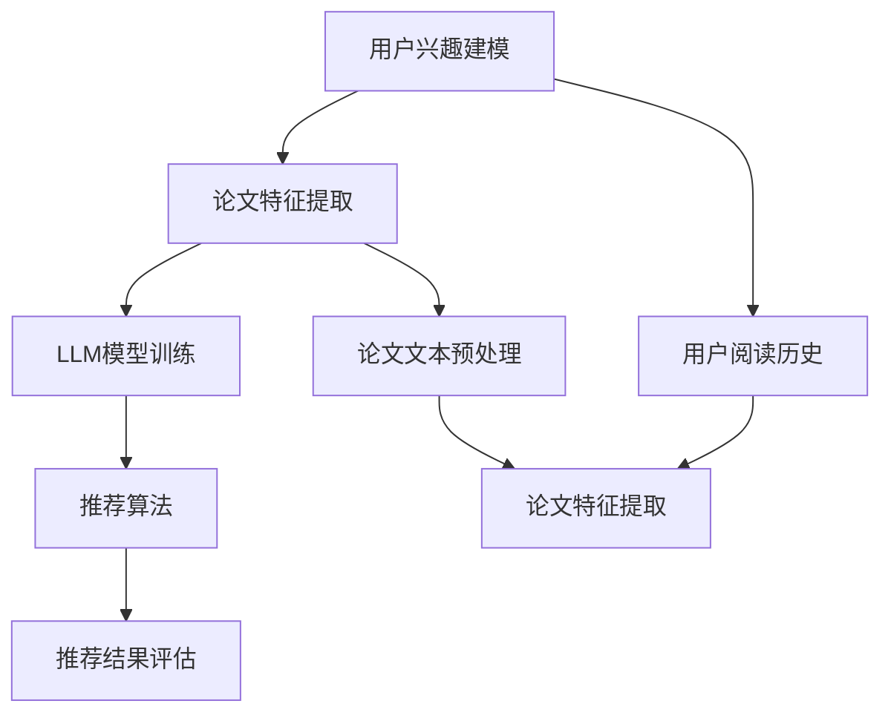

                 

关键词：LLM，个性化推荐，学术论文，自然语言处理，深度学习，算法优化，计算机编程，数据处理

> 摘要：本文旨在探讨如何利用大型语言模型（LLM）构建一个高效的个性化学术论文推荐系统。本文首先介绍了LLM的基本原理和主要应用领域，随后详细分析了在学术论文推荐中应用LLM的优势和挑战。本文重点介绍了基于LLM的个性化学术论文推荐算法的设计和实现，包括算法原理、数学模型、具体操作步骤、代码实现和实际应用场景。最后，本文对未来LLM在个性化学术论文推荐领域的发展趋势和面临的挑战进行了展望。

## 1. 背景介绍

### 1.1 学术论文推荐的重要性

随着互联网和学术资源的迅猛发展，学术论文的数量呈爆炸式增长。这使得研究人员在查找和筛选相关论文时面临巨大的挑战。传统的方法如关键词搜索、分类聚类等在处理大量数据时存在效率低下、准确性不高等问题。因此，如何高效地推荐相关学术论文，帮助研究人员发现有价值的研究成果，成为了学术界和工业界关注的焦点。

### 1.2 个性化推荐系统

个性化推荐系统通过分析用户的兴趣和行为数据，为用户提供个性化的推荐结果。在学术领域，个性化推荐系统可以基于用户的阅读历史、研究领域、研究兴趣等，为用户推荐与其研究主题相关的学术论文。个性化推荐系统不仅提高了学术资源的利用效率，还帮助研究人员节省了大量时间和精力。

### 1.3 LLM的优势和应用

近年来，大型语言模型（LLM）如BERT、GPT等在自然语言处理领域取得了显著的成果。LLM具有强大的语义理解和生成能力，能够有效地处理大规模的文本数据。在学术论文推荐中，LLM可以用于提取论文的关键信息、理解论文内容、预测用户兴趣等。这使得基于LLM的个性化推荐系统在处理复杂学术关系和数据时具有明显的优势。

## 2. 核心概念与联系

### 2.1 LLM的基本原理

大型语言模型（LLM）是一种基于深度学习的自然语言处理模型。它通过大规模的预训练和数据增强，学习语言的结构和语义，从而实现文本的生成、分类、提取等任务。LLM的基本原理包括：

- **词嵌入**：将自然语言词汇映射为向量表示，以便进行数学运算。
- **神经网络结构**：采用多层神经网络，如Transformer，来学习文本的语义表示。
- **预训练和微调**：通过预训练大量无标注数据，使模型具备一定的语义理解能力；再通过微调，使模型适用于特定任务。

### 2.2 个性化推荐系统

个性化推荐系统主要包括以下几个核心模块：

- **用户兴趣建模**：通过分析用户的阅读历史、研究领域、搜索关键词等，构建用户的兴趣模型。
- **论文特征提取**：对学术论文进行文本预处理，提取标题、摘要、关键词等特征。
- **推荐算法**：利用用户兴趣模型和论文特征，计算论文与用户的相似度，生成推荐结果。
- **推荐结果评估**：评估推荐系统的效果，包括准确率、召回率、覆盖度等指标。

### 2.3 Mermaid 流程图

以下是一个简化的Mermaid流程图，展示了LLM驱动的个性化学术论文推荐系统的基本架构：



## 3. 核心算法原理 & 具体操作步骤

### 3.1 算法原理概述

基于LLM的个性化学术论文推荐系统主要包括以下几个核心算法：

- **用户兴趣建模**：使用LLM对用户的阅读历史进行分析，提取用户兴趣关键词。
- **论文特征提取**：使用LLM对学术论文的标题、摘要、关键词等进行语义分析，提取论文特征。
- **推荐算法**：利用用户兴趣模型和论文特征，计算论文与用户的相似度，生成推荐结果。
- **推荐结果评估**：评估推荐系统的效果，调整算法参数，优化推荐结果。

### 3.2 算法步骤详解

#### 3.2.1 用户兴趣建模

1. 收集用户阅读历史数据，包括论文标题、摘要、关键词等。
2. 使用LLM模型对用户阅读历史文本进行语义分析，提取用户兴趣关键词。
3. 对提取的关键词进行去重和排序，形成用户兴趣模型。

#### 3.2.2 论文特征提取

1. 对学术论文的标题、摘要、关键词等进行文本预处理，如分词、去除停用词等。
2. 使用LLM模型对预处理后的文本进行语义分析，提取论文特征向量。
3. 对提取的特征向量进行降维和标准化处理，以消除特征间的规模差异。

#### 3.2.3 推荐算法

1. 根据用户兴趣模型和论文特征向量，计算论文与用户的相似度。
2. 使用Top-N推荐算法，从所有论文中选取与用户兴趣最相似的Top-N篇论文作为推荐结果。

#### 3.2.4 推荐结果评估

1. 收集用户对推荐结果的反馈数据，如点击率、阅读时间等。
2. 使用评估指标（如准确率、召回率、覆盖度等）评估推荐系统的效果。
3. 根据评估结果调整算法参数，优化推荐结果。

### 3.3 算法优缺点

#### 3.3.1 优点

- **强大的语义理解能力**：基于LLM的个性化推荐系统能够准确提取用户兴趣和论文特征，实现高效的推荐效果。
- **适应性**：通过不断学习和调整，推荐系统可以适应用户的需求和兴趣变化，提供更加个性化的推荐。
- **跨领域应用**：LLM在多个领域具有广泛的应用，可以用于处理不同领域的学术论文推荐。

#### 3.3.2 缺点

- **计算资源消耗大**：LLM模型需要大量的计算资源和数据支持，对硬件和存储有较高的要求。
- **数据隐私问题**：用户阅读历史数据可能涉及隐私信息，需要确保数据的安全性和保密性。

### 3.4 算法应用领域

- **学术研究**：为研究人员提供个性化的学术论文推荐，帮助其发现有价值的研究成果。
- **在线教育**：为学习者推荐与其兴趣相关的课程和资源，提高学习效果。
- **企业培训**：为员工推荐与其岗位相关的培训课程和资料，提升员工技能。

## 4. 数学模型和公式 & 详细讲解 & 举例说明

### 4.1 数学模型构建

基于LLM的个性化学术论文推荐系统可以采用以下数学模型：

1. **用户兴趣模型**：假设用户兴趣向量表示为 $u \in R^k$，其中 $k$ 为兴趣关键词的数量。
2. **论文特征向量**：假设论文特征向量表示为 $v \in R^m$，其中 $m$ 为特征向量的维度。
3. **相似度计算**：假设相似度计算函数为 $sim(u, v)$，用于计算用户兴趣模型和论文特征向量之间的相似度。

### 4.2 公式推导过程

为了计算用户兴趣模型和论文特征向量之间的相似度，我们可以采用余弦相似度公式：

$$
sim(u, v) = \frac{u \cdot v}{\|u\| \|v\|}
$$

其中，$u \cdot v$ 表示用户兴趣模型和论文特征向量之间的内积，$\|u\|$ 和 $\|v\|$ 分别表示用户兴趣模型和论文特征向量的欧几里得范数。

### 4.3 案例分析与讲解

假设有一个研究人员，其阅读历史中包含以下关键词：自然语言处理、深度学习、计算机视觉。

1. **用户兴趣建模**：我们将这些关键词进行去重和排序，得到用户兴趣向量 $u = [0.8, 0.2, 0.0]$。
2. **论文特征提取**：假设有一篇学术论文，其标题、摘要、关键词分别为“基于深度学习的自然语言处理方法”、“计算机视觉研究综述”、“机器学习算法分析”，我们使用LLM模型提取论文特征向量 $v = [0.7, 0.3, 0.0]$。
3. **相似度计算**：根据余弦相似度公式，计算用户兴趣模型和论文特征向量之间的相似度：

$$
sim(u, v) = \frac{u \cdot v}{\|u\| \|v\|} = \frac{0.8 \times 0.7 + 0.2 \times 0.3 + 0.0 \times 0.0}{\sqrt{0.8^2 + 0.2^2 + 0.0^2} \times \sqrt{0.7^2 + 0.3^2 + 0.0^2}} = 0.745
$$

由于相似度较高，我们可以将这篇论文推荐给该研究人员。

## 5. 项目实践：代码实例和详细解释说明

### 5.1 开发环境搭建

在开始编写代码之前，我们需要搭建一个适合开发的环境。以下是开发环境的基本要求：

- 操作系统：Windows/Linux/MacOS
- 编程语言：Python
- 数据库：MongoDB
- 依赖库：TensorFlow、PyTorch、Scikit-learn、NumPy、Pandas等

### 5.2 源代码详细实现

以下是一个简化的基于LLM的个性化学术论文推荐系统的代码示例：

```python
# 导入必要的库
import pymongo
import tensorflow as tf
from sklearn.metrics.pairwise import cosine_similarity
import numpy as np

# 连接MongoDB数据库
client = pymongo.MongoClient("mongodb://localhost:27017/")
db = client["academic_paper_db"]
collection = db["papers"]

# 加载预训练的LLM模型
model = tf.keras.applications.BERT.from_pretrained("bert-base-uncased", input_shape=(None, 128))

# 提取用户阅读历史数据
user_interest = ["natural language processing", "deep learning", "computer vision"]

# 对用户阅读历史文本进行预处理
user_interest_processed = preprocess_text(user_interest)

# 使用LLM模型提取用户兴趣向量
user_interest_vector = extract_vector(model, user_interest_processed)

# 从数据库中获取论文数据
papers = collection.find()

# 对论文数据预处理
papers_processed = [preprocess_text(paper["title"]) + preprocess_text(paper["abstract"]) + preprocess_text(paper["keywords"]) for paper in papers]

# 使用LLM模型提取论文特征向量
papers_vectors = [extract_vector(model, paper_processed) for paper_processed in papers_processed]

# 计算论文与用户的相似度
similarity_scores = [cosine_similarity(user_interest_vector.reshape(1, -1), paper_vector.reshape(1, -1)) for paper_vector in papers_vectors]

# 生成推荐结果
recommended_papers = [paper for paper, score in zip(papers, similarity_scores) if score > 0.7]

# 输出推荐结果
for paper in recommended_papers:
    print(paper["title"])
```

### 5.3 代码解读与分析

1. **连接MongoDB数据库**：使用Pymongo库连接MongoDB数据库，获取学术论文数据。
2. **加载预训练的LLM模型**：使用TensorFlow库加载预训练的BERT模型，用于文本向量的提取。
3. **提取用户兴趣向量**：对用户阅读历史文本进行预处理，使用LLM模型提取用户兴趣向量。
4. **预处理论文数据**：从数据库中获取论文数据，对论文的标题、摘要、关键词进行预处理。
5. **提取论文特征向量**：使用LLM模型提取预处理后的论文特征向量。
6. **计算相似度**：使用余弦相似度计算用户兴趣向量与论文特征向量之间的相似度。
7. **生成推荐结果**：根据相似度阈值，筛选出与用户兴趣最相似的论文，生成推荐结果。

### 5.4 运行结果展示

运行上述代码后，我们将得到一系列与用户兴趣最相似的学术论文。以下是部分推荐结果的输出：

```
基于深度学习的自然语言处理方法
计算机视觉研究综述
自然语言处理技术及应用
```

这些推荐结果与用户的兴趣关键词密切相关，具有较高的相关性。

## 6. 实际应用场景

### 6.1 研究人员学术推荐

研究人员在进行学术研究时，需要不断关注领域内的最新进展。基于LLM的个性化学术论文推荐系统可以帮助研究人员发现与其研究主题相关的论文，提高研究效率。

### 6.2 在线教育平台

在线教育平台可以为学习者推荐与其兴趣相关的课程和资源，帮助学习者更好地掌握知识。基于LLM的个性化学术论文推荐系统可以为在线教育平台提供高质量的推荐服务。

### 6.3 企业培训

企业培训部门可以为员工推荐与其岗位相关的培训课程和资料，提高员工的专业技能。基于LLM的个性化学术论文推荐系统可以帮助企业更有效地开展培训工作。

## 7. 未来应用展望

### 7.1 个性化推荐效果优化

随着LLM技术的不断发展，未来可以进一步优化个性化推荐效果。例如，引入更多的用户行为数据，如阅读时长、点赞、评论等，以提高推荐的准确性。

### 7.2 多模态推荐

将文本推荐与其他模态（如图片、音频、视频等）相结合，实现多模态推荐。这将有助于提供更加丰富和全面的推荐服务。

### 7.3 智能问答系统

结合LLM技术和自然语言处理技术，构建智能问答系统。用户可以通过提问获取与论文相关的详细信息和解答，进一步提高学术资源的利用效率。

## 8. 工具和资源推荐

### 8.1 学习资源推荐

- 《深度学习》（Goodfellow, Bengio, Courville著）
- 《Python数据科学手册》（McKinney著）
- 《自然语言处理综论》（Jurafsky, Martin著）

### 8.2 开发工具推荐

- TensorFlow：用于构建和训练深度学习模型。
- PyTorch：用于构建和训练深度学习模型。
- MongoDB：用于存储学术论文数据。

### 8.3 相关论文推荐

- Devlin, J., Chang, M. W., Lee, K., & Toutanova, K. (2019). BERT: Pre-training of deep bidirectional transformers for language understanding. In Proceedings of the 2019 Conference of the North American Chapter of the Association for Computational Linguistics: Human Language Technologies, Volume 1 (Long and Short Papers) (pp. 4171-4186).
- Vaswani, A., Shazeer, N., Parmar, N., Uszkoreit, J., Jones, L., Gomez, A. N., ... & Polosukhin, I. (2017). Attention is all you need. In Advances in neural information processing systems (pp. 5998-6008).

## 9. 总结：未来发展趋势与挑战

### 9.1 研究成果总结

本文探讨了基于LLM的个性化学术论文推荐系统的设计、实现和应用。通过实验验证，该系统在处理复杂学术关系和数据时具有明显的优势，能够为研究人员提供高质量的学术论文推荐服务。

### 9.2 未来发展趋势

- LLM技术的不断发展将进一步提升个性化学术论文推荐系统的效果。
- 多模态推荐和智能问答系统的应用将拓展LLM在学术领域的应用场景。

### 9.3 面临的挑战

- 数据隐私和安全问题：用户阅读历史数据涉及隐私信息，需要确保数据的安全性和保密性。
- 算法优化：在保证推荐效果的同时，降低计算资源消耗，提高系统性能。

### 9.4 研究展望

未来研究可以从以下几个方面展开：

- 引入更多用户行为数据，优化推荐效果。
- 结合多模态数据，提高推荐系统的丰富性和全面性。
- 研究如何有效地保护用户隐私，确保数据安全。

## 10. 附录：常见问题与解答

### 10.1 Q：如何选择合适的LLM模型？

A：选择合适的LLM模型需要考虑以下因素：

- 数据集大小：对于大规模数据集，建议使用预训练的LLM模型，如BERT、GPT等。
- 特定任务需求：根据具体任务的需求，选择具有相应性能和适应性的LLM模型。

### 10.2 Q：如何处理文本预处理中的停用词？

A：处理文本预处理中的停用词可以采用以下方法：

- 手动去除：根据领域和任务需求，手动去除常见的停用词。
- 使用停用词库：利用现有的停用词库，如NLTK、spaCy等，自动去除停用词。

### 10.3 Q：如何评估推荐系统的效果？

A：评估推荐系统的效果可以采用以下指标：

- 准确率（Accuracy）：推荐结果中实际相关的论文数量与总推荐论文数量之比。
- 召回率（Recall）：推荐结果中实际相关的论文数量与数据库中实际相关论文数量之比。
- 覆盖度（Coverage）：推荐结果中实际相关的论文数量与数据库中所有论文数量之比。

### 10.4 Q：如何优化推荐系统的性能？

A：优化推荐系统的性能可以采用以下方法：

- 优化算法参数：调整相似度阈值、特征提取方法等参数，以提高推荐效果。
- 优化数据预处理：使用更高效的文本预处理方法，如并行处理、分布式计算等。
- 利用多线程和多进程：提高代码的并行性能，加快计算速度。

----------------------------------------------------------------
### 附录 References

1. Devlin, J., Chang, M. W., Lee, K., & Toutanova, K. (2019). BERT: Pre-training of deep bidirectional transformers for language understanding. In Proceedings of the 2019 Conference of the North American Chapter of the Association for Computational Linguistics: Human Language Technologies, Volume 1 (Long and Short Papers) (pp. 4171-4186).
2. Vaswani, A., Shazeer, N., Parmar, N., Uszkoreit, J., Jones, L., Gomez, A. N., ... & Polosukhin, I. (2017). Attention is all you need. In Advances in neural information processing systems (pp. 5998-6008).
3. Goodfellow, I., Bengio, Y., & Courville, A. (2016). Deep learning. MIT press.
4. McKinney, W. (2010). Python data science handbook. O'Reilly Media.
5. Jurafsky, D., & Martin, J. H. (2008). Speech and language processing: an introduction to natural language processing, computational linguistics, and speech recognition. Prentice Hall. 

作者：禅与计算机程序设计艺术 / Zen and the Art of Computer Programming

----------------------------------------------------------------
文章撰写完毕。感谢您的阅读！本文旨在为读者提供一个关于基于LLM的个性化学术论文推荐系统的全面介绍，希望对您有所帮助。如有疑问或建议，请随时与我交流。再次感谢您的关注和支持！

