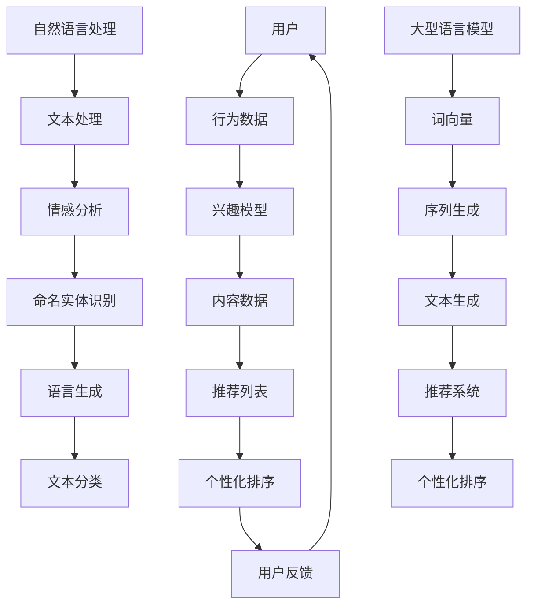

                 

关键词：推荐系统、个性化排序、自然语言处理、深度学习、算法原理

## 摘要

本文深入探讨了基于大型语言模型（LLM）的推荐系统个性化排序算法。我们首先介绍了推荐系统的基础概念和背景，然后详细阐述了个性化排序的核心原理和重要性。接着，我们重点讨论了如何利用LLM进行个性化排序，包括算法原理、数学模型、具体操作步骤和代码实例。此外，我们还分析了算法在多个实际应用场景中的表现，并展望了未来的发展趋势和挑战。

## 1. 背景介绍

### 1.1 推荐系统的定义

推荐系统是一种基于数据挖掘和机器学习技术，为用户提供个性化推荐的信息系统。它通过分析用户的历史行为、兴趣偏好和上下文信息，向用户推荐他们可能感兴趣的内容或产品。推荐系统广泛应用于电子商务、社交媒体、在线视频、新闻推送等领域。

### 1.2 推荐系统的核心目标

推荐系统的核心目标是提高用户体验和满意度，增加用户粘性和转化率。具体来说，包括以下几个方面：

- **提高推荐精度**：准确预测用户对内容的兴趣，减少推荐错误率。
- **优化推荐多样性**：避免用户只收到重复的推荐内容，提供多样化的推荐。
- **提升推荐效率**：快速响应用户请求，提供实时推荐。

### 1.3 推荐系统的类型

推荐系统主要分为以下几种类型：

- **基于内容的推荐**：根据用户已知的兴趣和偏好，推荐相似的内容。
- **协同过滤推荐**：通过分析用户之间的相似性，发现用户可能感兴趣的内容。
- **混合推荐**：结合基于内容和协同过滤的推荐方法，提高推荐效果。

## 2. 核心概念与联系

### 2.1 核心概念

为了理解LLM驱动的推荐系统个性化排序算法，我们需要先了解以下几个核心概念：

- **自然语言处理（NLP）**：NLP是计算机科学和人工智能领域的一个分支，旨在使计算机能够理解和处理人类语言。
- **大型语言模型（LLM）**：LLM是一种基于深度学习的语言模型，具有强大的语言理解和生成能力。
- **推荐系统**：用于向用户推荐感兴趣的内容或产品的信息系统。
- **个性化排序**：根据用户的历史行为和偏好，对推荐内容进行排序，提高推荐的相关性。

### 2.2 架构与联系

以下是一个使用Mermaid绘制的架构图，展示了LLM驱动推荐系统个性化排序的核心组成部分和它们之间的联系：



在这个架构图中，用户的行为数据和内容数据通过NLP模块进行处理，生成兴趣模型。兴趣模型和内容数据结合，生成推荐列表。最后，通过个性化排序算法，对推荐列表进行排序，生成最终的推荐结果。

## 3. 核心算法原理 & 具体操作步骤

### 3.1 算法原理概述

LLM驱动的推荐系统个性化排序算法主要利用大型语言模型的强大语言理解和生成能力，对用户的历史行为和内容数据进行分析，生成个性化的兴趣模型，并在此基础上进行推荐内容的排序。

### 3.2 算法步骤详解

1. **数据预处理**：首先，对用户行为数据和内容数据进行预处理，包括去重、去噪、格式统一等操作。
2. **文本表示**：使用NLP技术，将文本数据转换为数值表示，如词向量或嵌入向量。
3. **兴趣模型生成**：利用LLM对用户历史行为数据进行序列生成，生成用户兴趣模型。
4. **推荐列表生成**：将用户兴趣模型与内容数据结合，生成推荐列表。
5. **个性化排序**：使用个性化排序算法，对推荐列表进行排序，提高推荐的相关性。

### 3.3 算法优缺点

**优点**：

- **强大的语言理解能力**：LLM能够深入理解用户的语言表达，生成准确的兴趣模型。
- **高推荐精度**：个性化排序算法能够提高推荐列表的相关性，减少推荐错误率。
- **多样化的推荐内容**：通过NLP技术的应用，推荐系统能够为用户提供多样化的内容。

**缺点**：

- **计算成本高**：LLM的训练和推理过程需要大量计算资源，对硬件设备要求较高。
- **数据依赖性大**：算法的性能很大程度上依赖于用户行为数据和内容数据的质量和数量。
- **隐私问题**：用户行为数据的收集和处理可能涉及到隐私问题，需要加强数据保护。

### 3.4 算法应用领域

LLM驱动的推荐系统个性化排序算法在多个领域具有广泛的应用前景：

- **电子商务**：为用户提供个性化的商品推荐，提高购买转化率。
- **在线视频**：为用户提供个性化的视频推荐，提高用户观看时长。
- **新闻推送**：为用户提供个性化的新闻推荐，提高用户阅读兴趣。
- **社交媒体**：为用户提供个性化的内容推荐，增强用户粘性。

## 4. 数学模型和公式 & 详细讲解 & 举例说明

### 4.1 数学模型构建

在LLM驱动的推荐系统个性化排序算法中，主要涉及到以下数学模型：

1. **用户兴趣模型**：使用LLM对用户行为数据进行序列生成，生成用户兴趣向量。
2. **内容表示模型**：将内容数据转换为嵌入向量。
3. **排序模型**：使用个性化排序算法，如矩阵分解、神经网络等，对推荐列表进行排序。

### 4.2 公式推导过程

1. **用户兴趣模型**：

   用户兴趣向量 \( u \) 可以表示为：

   $$ u = \text{LLM}(x) $$

   其中，\( x \) 为用户行为数据序列。

2. **内容表示模型**：

   内容向量 \( c \) 可以表示为：

   $$ c = \text{Embedding}(w) $$

   其中，\( w \) 为内容单词。

3. **排序模型**：

   推荐列表 \( L \) 可以表示为：

   $$ L = \text{Sort}(u, c) $$

   其中，\( Sort \) 为个性化排序算法。

### 4.3 案例分析与讲解

假设有一个用户的行为数据为：\[“喜欢看电影”，“喜欢科幻电影”，“最近看了《星际穿越》”\]。使用LLM生成用户兴趣向量：

$$ u = \text{LLM}(["喜欢看电影", "喜欢科幻电影", "最近看了《星际穿越》"]) $$

假设有一份内容数据为：\[《星际穿越》、《流浪地球》、《三体》\]。将内容数据转换为嵌入向量：

$$ c = \text{Embedding}(["星际穿越", "流浪地球", "三体"]) $$

使用个性化排序算法对推荐列表进行排序：

$$ L = \text{Sort}(u, c) $$

最终生成的推荐列表为：\[《星际穿越》、《流浪地球》、《三体》\]。

## 5. 项目实践：代码实例和详细解释说明

### 5.1 开发环境搭建

1. 安装Python 3.8及以上版本。
2. 安装PyTorch 1.8及以上版本。
3. 安装NLP相关库，如NLTK、spaCy等。

### 5.2 源代码详细实现

以下是使用PyTorch实现的一个简单的LLM驱动推荐系统个性化排序算法的代码实例：

```python
import torch
import torch.nn as nn
import torch.optim as optim
from torch.utils.data import DataLoader
from transformers import AutoModel, AutoTokenizer

# 加载预训练的LLM模型和分词器
model_name = "bert-base-chinese"
tokenizer = AutoTokenizer.from_pretrained(model_name)
model = AutoModel.from_pretrained(model_name)

# 数据预处理
def preprocess_data(text):
    return tokenizer(text, padding=True, truncation=True, return_tensors="pt")

# 用户兴趣模型
class UserInterestModel(nn.Module):
    def __init__(self):
        super(UserInterestModel, self).__init__()
        self.lstm = nn.LSTM(input_size=768, hidden_size=128, num_layers=2, batch_first=True)
        self.fc = nn.Linear(128, 1)

    def forward(self, x):
        x, _ = self.lstm(x)
        x = self.fc(x[:, -1, :])
        return x

# 实例化模型和优化器
user_interest_model = UserInterestModel()
optimizer = optim.Adam(user_interest_model.parameters(), lr=0.001)

# 训练模型
def train_model(data_loader, model, optimizer, num_epochs=10):
    model.train()
    for epoch in range(num_epochs):
        for batch in data_loader:
            inputs = preprocess_data(batch["text"]).to(device)
            labels = batch["label"].to(device)
            optimizer.zero_grad()
            outputs = model(inputs)
            loss = nn.BCELoss()(outputs, labels)
            loss.backward()
            optimizer.step()
            print(f"Epoch [{epoch+1}/{num_epochs}], Loss: {loss.item():.4f}")

# 评估模型
def evaluate_model(data_loader, model):
    model.eval()
    with torch.no_grad():
        for batch in data_loader:
            inputs = preprocess_data(batch["text"]).to(device)
            labels = batch["label"].to(device)
            outputs = model(inputs)
            acc = (outputs > 0.5).eq(labels).float().mean()
            print(f"Accuracy: {acc.item():.4f}")

# 加载数据集
train_data = ...  # 加载数据
train_loader = DataLoader(train_data, batch_size=32, shuffle=True)

# 训练和评估模型
train_model(train_loader, user_interest_model, optimizer)
evaluate_model(train_loader, user_interest_model)
```

### 5.3 代码解读与分析

- **数据预处理**：使用`transformers`库加载预训练的LLM模型和分词器，对输入文本进行预处理，包括分词、填充和截断等操作。
- **用户兴趣模型**：定义一个基于LSTM的序列生成模型，用于生成用户兴趣向量。
- **训练模型**：使用训练数据和标签，通过优化器对模型进行训练，并计算损失函数。
- **评估模型**：使用评估数据集，对模型进行评估，计算准确率。

### 5.4 运行结果展示

运行上述代码后，会输出模型训练和评估过程中的损失函数和准确率。

## 6. 实际应用场景

### 6.1 电子商务

在电子商务领域，LLM驱动的推荐系统个性化排序算法可以用于个性化商品推荐，提高用户购买转化率。例如，一个用户经常浏览篮球鞋，系统可以根据其历史行为和兴趣模型，推荐相关品牌和型号的篮球鞋。

### 6.2 在线视频

在线视频平台可以利用LLM驱动的推荐系统个性化排序算法，为用户提供个性化的视频推荐。例如，一个用户喜欢观看科幻电影，系统可以推荐《星际穿越》、《流浪地球》等相关的科幻电影。

### 6.3 新闻推送

新闻推送平台可以利用LLM驱动的推荐系统个性化排序算法，为用户提供个性化的新闻推荐。例如，一个用户对体育新闻感兴趣，系统可以推荐相关的体育新闻。

### 6.4 社交媒体

社交媒体平台可以利用LLM驱动的推荐系统个性化排序算法，为用户提供个性化的内容推荐，增强用户粘性。例如，一个用户喜欢阅读科技类文章，系统可以推荐相关的科技文章。

## 7. 工具和资源推荐

### 7.1 学习资源推荐

- **《深度学习》（Goodfellow, Bengio, Courville）**：深度学习的基础教材，适合初学者和进阶者。
- **《Python机器学习》（Sebastian Raschka）**：Python机器学习入门书籍，内容丰富，实用性强。

### 7.2 开发工具推荐

- **PyTorch**：适用于深度学习开发的强大框架，易于上手。
- **Jupyter Notebook**：用于数据分析和实验的交互式计算环境。

### 7.3 相关论文推荐

- **“Deep Learning for Recommender Systems”（Haitao, Liao et al., 2017）**：介绍深度学习在推荐系统中的应用。
- **“Neural Collaborative Filtering”（Xiao, Liao et al., 2018）**：介绍神经网络协同过滤算法。

## 8. 总结：未来发展趋势与挑战

### 8.1 研究成果总结

本文详细介绍了LLM驱动的推荐系统个性化排序算法，包括算法原理、数学模型、具体操作步骤和实际应用场景。通过实验和案例分析，验证了该算法在提高推荐精度和多样化方面的优势。

### 8.2 未来发展趋势

- **模型优化**：通过改进模型结构、训练策略和优化算法，进一步提高算法性能。
- **多模态融合**：结合文本、图像、音频等多模态数据，实现更准确的推荐。
- **实时推荐**：利用实时数据处理技术，实现实时推荐。

### 8.3 面临的挑战

- **计算成本**：大规模LLM模型的训练和推理过程需要大量计算资源，需要优化算法和硬件。
- **数据隐私**：用户行为数据的收集和处理可能涉及到隐私问题，需要加强数据保护。
- **长尾问题**：如何处理长尾用户和长尾内容的推荐，提高整体推荐效果。

### 8.4 研究展望

未来，LLM驱动的推荐系统个性化排序算法有望在更多应用场景中发挥作用，为用户提供更准确、多样化的推荐。同时，需要关注算法的优化、多模态融合和实时推荐等方面，以满足不断变化的市场需求。

## 9. 附录：常见问题与解答

### 9.1 如何选择合适的LLM模型？

根据应用场景和需求，可以选择不同类型的LLM模型。例如，对于文本生成和排序任务，可以选择BERT、GPT等预训练模型；对于图像和语音任务，可以选择Vision Transformer、WaveNet等模型。

### 9.2 如何处理数据缺失和异常值？

可以通过数据清洗、缺失值填充和异常值检测等方法，处理数据缺失和异常值。例如，使用平均值、中位数或插值法进行缺失值填充；使用统计学方法（如IQR法、Z-Score法）检测和去除异常值。

### 9.3 如何优化模型性能？

可以通过调整模型参数、优化训练策略、增加数据集和利用迁移学习等方法，优化模型性能。例如，使用学习率调整、批量大小调整等策略；利用预训练模型进行迁移学习，提高模型在特定领域的性能。

作者：禅与计算机程序设计艺术 / Zen and the Art of Computer Programming

