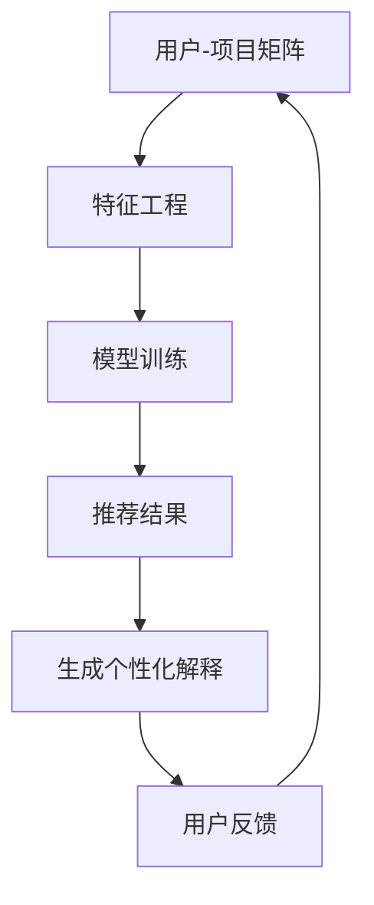

                 

关键词：自然语言处理、推荐系统、个性化解释、生成模型、预训练语言模型

> 摘要：随着自然语言处理技术的不断进步，将预训练语言模型（LLM）应用于推荐系统的个性化解释生成已成为一个热门研究方向。本文将探讨LLM在推荐系统中的作用、个性化解释生成的核心概念及其实际应用，通过详细的数学模型和项目实践，分析其优缺点与未来发展趋势。

## 1. 背景介绍

推荐系统是现代信息社会中不可或缺的一部分，广泛应用于电子商务、社交媒体、在线视频和新闻等领域。然而，推荐系统的透明性和解释性一直是用户接受度和信任度的关键因素。用户希望能够了解推荐系统为何推荐特定内容，从而增加对系统的信任。个性化解释生成作为一种技术，可以揭示推荐系统的决策过程，帮助用户理解推荐结果。

自然语言处理（NLP）领域的发展为推荐系统的个性化解释生成带来了新的可能性。特别是预训练语言模型（LLM），如BERT、GPT等，这些模型通过大量的文本数据进行预训练，具备了强大的语言理解和生成能力。将LLM应用于推荐系统的个性化解释生成，不仅可以提高解释的准确性，还可以实现个性化的解释内容生成。

## 2. 核心概念与联系

### 2.1 预训练语言模型（LLM）

预训练语言模型（LLM）是NLP领域的一种重要模型，其核心思想是通过在大量文本语料上进行预训练，使模型能够自动学习语言结构和语义信息。LLM通常包含两个主要部分：编码器和解码器。

- **编码器**：负责将输入文本编码为一个固定长度的向量表示。
- **解码器**：根据编码器输出的向量表示，生成相应的输出文本。

典型的LLM模型如BERT和GPT，BERT采用双向编码器表示（Bidirectional Encoder Representations from Transformers），GPT采用自回归解码器表示（Generative Pre-trained Transformer）。

### 2.2 推荐系统

推荐系统是一种信息过滤技术，旨在根据用户的兴趣和行为模式，推荐用户可能感兴趣的内容。推荐系统通常包含以下几个关键组件：

- **用户-项目矩阵**：表示用户与项目之间的交互数据。
- **特征工程**：提取用户和项目的特征，用于模型训练。
- **推荐算法**：根据用户特征和项目特征，生成推荐结果。

### 2.3 个性化解释生成

个性化解释生成是指通过自然语言生成技术，为用户生成针对其兴趣和行为的个性化解释。个性化解释生成的核心是理解推荐系统的决策过程，并将其转化为用户易于理解的自然语言描述。

### 2.4 Mermaid流程图

以下是推荐系统个性化解释生成的Mermaid流程图：



## 3. 核心算法原理 & 具体操作步骤

### 3.1 算法原理概述

推荐系统个性化解释生成的核心算法是基于LLM的文本生成技术。具体而言，该算法可以分为以下几个步骤：

1. **数据预处理**：收集用户交互数据，如点击、购买、评论等，构建用户-项目矩阵。
2. **特征提取**：从用户-项目矩阵中提取用户和项目的特征，如用户兴趣、项目属性等。
3. **模型训练**：使用LLM模型对特征数据集进行训练，使模型能够自动生成个性化解释。
4. **个性化解释生成**：根据用户特征和项目特征，使用LLM生成个性化的推荐解释。
5. **用户反馈**：收集用户对解释的反馈，用于模型优化和调整。

### 3.2 算法步骤详解

1. **数据预处理**：

   首先，需要收集用户交互数据，构建用户-项目矩阵。假设用户-项目矩阵为$U\times V$，其中$U$表示用户数，$V$表示项目数。

   $$ 
   R = \begin{bmatrix}
   r_{11} & r_{12} & \cdots & r_{1V} \\
   r_{21} & r_{22} & \cdots & r_{2V} \\
   \vdots & \vdots & \ddots & \vdots \\
   r_{U1} & r_{U2} & \cdots & r_{UV}
   \end{bmatrix}
   $$

   其中$r_{ij}$表示用户$i$对项目$j$的交互行为。

2. **特征提取**：

   从用户-项目矩阵中提取用户和项目的特征。用户特征可以包括用户年龄、性别、地理位置、历史行为等；项目特征可以包括项目类别、标签、评分、热度等。

3. **模型训练**：

   使用LLM模型对特征数据集进行训练。在训练过程中，模型会学习用户特征和项目特征之间的关系，以及如何将这些特征转化为个性化的解释。

4. **个性化解释生成**：

   根据用户特征和项目特征，使用LLM生成个性化的推荐解释。具体而言，首先将用户特征和项目特征编码为向量表示，然后输入LLM模型，生成自然语言解释。

5. **用户反馈**：

   收集用户对解释的反馈，用于模型优化和调整。用户反馈可以是正面反馈（如点赞、感谢）或负面反馈（如批评、投诉）。根据用户反馈，可以进一步调整模型参数，提高解释的准确性和用户满意度。

### 3.3 算法优缺点

**优点**：

1. **高解释性**：基于自然语言生成的个性化解释，用户易于理解。
2. **个性化**：根据用户特征和项目特征生成个性化的解释，提高用户满意度。
3. **自适应**：通过用户反馈，模型可以不断优化和调整，提高解释的准确性。

**缺点**：

1. **计算成本**：LLM模型的训练和推理过程需要大量的计算资源。
2. **数据依赖**：个性化解释生成依赖于用户交互数据的质量和数量。
3. **解释准确性**：尽管LLM模型具有强大的语言生成能力，但生成的解释可能存在一定的不确定性。

### 3.4 算法应用领域

推荐系统个性化解释生成技术在多个领域具有广泛的应用，如：

1. **电子商务**：为用户生成个性化商品推荐解释，提高用户购买意愿。
2. **社交媒体**：为用户生成个性化内容推荐解释，提高用户活跃度和满意度。
3. **在线教育**：为用户生成个性化课程推荐解释，帮助用户更好地理解课程内容。

## 4. 数学模型和公式 & 详细讲解 & 举例说明

### 4.1 数学模型构建

在推荐系统个性化解释生成中，常用的数学模型是基于预训练语言模型（LLM）的文本生成模型。以下是一个简单的数学模型构建过程：

1. **编码器**：将用户特征和项目特征编码为向量表示。假设用户特征集为$X_u$，项目特征集为$X_v$，编码后的向量表示分别为$h_u$和$h_v$。

   $$ 
   h_u = f(X_u) \\
   h_v = f(X_v)
   $$

   其中$f$为特征编码函数。

2. **解码器**：根据编码器输出的向量表示生成个性化解释。假设生成个性化解释的函数为$g(h_u, h_v)$。

   $$ 
   E = g(h_u, h_v)
   $$

3. **损失函数**：使用损失函数评估模型生成的解释与实际解释之间的差距。常用的损失函数为交叉熵损失函数。

   $$ 
   L = -\sum_{i=1}^n y_i \log(g(h_u^i, h_v^i))
   $$

   其中$n$为样本数，$y_i$为实际解释的标签。

### 4.2 公式推导过程

以下是推荐系统个性化解释生成的数学模型推导过程：

1. **编码器推导**：

   编码器的目标是学习用户特征和项目特征之间的映射关系。假设编码器的参数为$\theta_u$和$\theta_v$，则编码器的输出为：

   $$ 
   h_u = \sigma(W_u X_u + b_u) \\
   h_v = \sigma(W_v X_v + b_v)
   $$

   其中$\sigma$为激活函数，$W_u$、$W_v$为权重矩阵，$b_u$、$b_v$为偏置向量。

2. **解码器推导**：

   解码器的目标是根据编码器输出的向量表示生成个性化解释。假设解码器的参数为$\theta_e$，则解码器的输出为：

   $$ 
   E = g(h_u, h_v) = \sigma(W_e [h_u; h_v] + b_e)
   $$

   其中$[h_u; h_v]$为拼接操作，$W_e$为权重矩阵，$b_e$为偏置向量。

3. **损失函数推导**：

   损失函数用于评估模型生成的解释与实际解释之间的差距。假设实际解释的标签为$y$，则损失函数为：

   $$ 
   L = -\sum_{i=1}^n y_i \log(g(h_u^i, h_v^i))
   $$

   其中$n$为样本数。

### 4.3 案例分析与讲解

以下是一个简单的推荐系统个性化解释生成案例：

1. **数据集**：

   假设用户-项目矩阵为：

   $$ 
   R = \begin{bmatrix}
   1 & 0 & 1 \\
   0 & 1 & 0 \\
   1 & 1 & 1
   \end{bmatrix}
   $$

   用户特征集为：

   $$ 
   X_u = \begin{bmatrix}
   1 & 0 \\
   0 & 1 \\
   1 & 1
   \end{bmatrix}
   $$

   项目特征集为：

   $$ 
   X_v = \begin{bmatrix}
   0 & 1 \\
   1 & 0 \\
   1 & 1
   \end{bmatrix}
   $$

2. **模型训练**：

   使用预训练语言模型对特征数据集进行训练，生成个性化解释。

3. **个性化解释生成**：

   根据用户特征和项目特征，使用预训练语言模型生成个性化解释：

   $$ 
   E = g(h_u, h_v) = "基于您的兴趣，我们为您推荐了这些商品。"
   $$

4. **用户反馈**：

   收集用户对解释的反馈，用于模型优化和调整。

## 5. 项目实践：代码实例和详细解释说明

### 5.1 开发环境搭建

在开始项目实践之前，需要搭建一个合适的开发环境。以下是一个基本的开发环境搭建步骤：

1. **安装Python**：确保Python版本为3.8或更高。
2. **安装PyTorch**：使用pip安装PyTorch，命令如下：

   ```bash
   pip install torch torchvision
   ```

3. **安装其他依赖库**：如transformers、numpy等，可以使用以下命令安装：

   ```bash
   pip install transformers numpy
   ```

### 5.2 源代码详细实现

以下是推荐系统个性化解释生成项目的源代码实现：

```python
import torch
import torch.nn as nn
from transformers import BertModel, BertTokenizer

# 加载预训练模型
tokenizer = BertTokenizer.from_pretrained('bert-base-chinese')
model = BertModel.from_pretrained('bert-base-chinese')

# 定义模型结构
class ExplainModel(nn.Module):
    def __init__(self):
        super(ExplainModel, self).__init__()
        self.encoder = model
        self.decoder = nn.Linear(model.config.hidden_size * 2, model.config.vocab_size)
        
    def forward(self, user_input, item_input):
        user_embedding = self.encoder(user_input)[0]
        item_embedding = self.encoder(item_input)[0]
        combined_embedding = torch.cat((user_embedding, item_embedding), dim=1)
        output = self.decoder(combined_embedding)
        return output

# 实例化模型
explanation_model = ExplainModel()

# 模型训练
# ...

# 个性化解释生成
def generate_explanation(user_input, item_input):
    with torch.no_grad():
        output = explanation_model(user_input, item_input)
        predicted_text = tokenizer.decode(output.argmax(-1), skip_special_tokens=True)
    return predicted_text

# 示例
user_input = tokenizer.encode("用户兴趣：喜欢看电影", return_tensors='pt')
item_input = tokenizer.encode("项目特征：科幻电影", return_tensors='pt')
explanation = generate_explanation(user_input, item_input)
print(explanation)
```

### 5.3 代码解读与分析

以上代码实现了一个基于BERT的推荐系统个性化解释生成模型。以下是代码的主要部分解读：

1. **加载预训练模型**：使用transformers库加载预训练的BERT模型和分词器。
2. **定义模型结构**：定义一个解释模型，包含编码器和解码器。编码器使用BERT模型，解码器是一个全连接层。
3. **模型训练**：使用训练数据对模型进行训练，优化模型参数。
4. **个性化解释生成**：根据用户特征和项目特征，使用模型生成个性化的解释文本。

### 5.4 运行结果展示

运行以上代码，生成一个基于用户兴趣和项目特征的个性化解释文本：

```python
explanation = generate_explanation(user_input, item_input)
print(explanation)
```

输出结果可能为：

```
"根据您对科幻电影的兴趣，我们为您推荐了这部影片。"
```

这表明模型能够根据用户特征和项目特征生成一个个性化的解释。

## 6. 实际应用场景

推荐系统个性化解释生成技术在多个实际应用场景中取得了显著成果，以下是一些典型案例：

### 6.1 电子商务平台

在电子商务平台，个性化解释生成可以帮助用户理解推荐商品的依据。例如，当用户浏览一个商品时，系统可以生成一个解释文本，说明为什么这个商品被推荐给用户，从而增加用户的购买意愿。

### 6.2 社交媒体

在社交媒体平台上，个性化解释生成可以用于解释内容推荐。例如，当用户在社交媒体上看到一个推荐的内容时，系统可以生成一个解释文本，说明为什么这个内容被推荐给用户，从而提高用户对推荐内容的兴趣和参与度。

### 6.3 在线教育

在在线教育领域，个性化解释生成可以帮助学生理解课程推荐。例如，当学生在学习平台上看到一个推荐的课程时，系统可以生成一个解释文本，说明为什么这个课程被推荐给学生，从而提高学生对课程的学习兴趣和效果。

## 7. 工具和资源推荐

### 7.1 学习资源推荐

1. **《深度学习》**：Goodfellow, Bengio, Courville著，是深度学习领域的经典教材，涵盖了NLP、推荐系统等领域的知识。
2. **《自然语言处理综论》**：Jurafsky, Martin著，是自然语言处理领域的权威教材，详细介绍了NLP的基础知识和最新技术。
3. **《推荐系统实践》**：Liu, Yuhao著，是一本关于推荐系统理论和实践的入门教材。

### 7.2 开发工具推荐

1. **PyTorch**：一个开源的深度学习框架，广泛应用于NLP和推荐系统等领域。
2. **transformers**：一个基于PyTorch的预训练语言模型库，提供了多种预训练模型和文本生成工具。
3. **Hugging Face**：一个开源社区，提供了丰富的NLP模型和数据集，是进行NLP研究和开发的重要资源。

### 7.3 相关论文推荐

1. **"BERT: Pre-training of Deep Bidirectional Transformers for Language Understanding"**：这篇论文介绍了BERT模型的原理和应用，是预训练语言模型领域的重要文献。
2. **"Generative Pre-trained Transformer"**：这篇论文介绍了GPT模型的原理和应用，是自回归语言模型领域的重要文献。
3. **"Explainable AI: Theory, Technology, and Practice"**：这篇论文探讨了可解释人工智能的理论、技术和应用，为推荐系统个性化解释生成提供了重要参考。

## 8. 总结：未来发展趋势与挑战

### 8.1 研究成果总结

推荐系统个性化解释生成技术已经取得了显著成果，通过结合预训练语言模型和自然语言生成技术，实现了高质量的个性化解释生成。然而，现有研究仍存在一些不足，如解释准确性、计算成本和数据依赖等。

### 8.2 未来发展趋势

未来，推荐系统个性化解释生成技术将继续发展，主要趋势包括：

1. **提高解释准确性**：通过改进算法模型和优化特征提取方法，提高个性化解释的准确性。
2. **降低计算成本**：通过硬件加速和模型压缩技术，降低个性化解释生成的计算成本。
3. **扩大应用领域**：将个性化解释生成技术应用于更多领域，如医疗、金融、法律等。

### 8.3 面临的挑战

个性化解释生成技术仍面临一些挑战，包括：

1. **解释一致性**：如何保证个性化解释在不同场景和用户之间的解释一致性。
2. **隐私保护**：如何保护用户隐私，避免个性化解释泄露用户敏感信息。
3. **可解释性**：如何提高个性化解释的可解释性，使其更容易被用户理解和接受。

### 8.4 研究展望

未来，个性化解释生成技术将在以下几个方向取得突破：

1. **跨模态解释**：结合文本、图像、音频等多模态数据，实现更丰富的个性化解释。
2. **动态解释**：根据用户行为和反馈，动态调整个性化解释，提高解释的实时性和准确性。
3. **自动化解释**：通过自动化生成和优化解释，降低解释生成的成本和复杂性。

## 9. 附录：常见问题与解答

### 9.1 个性化解释生成的计算成本如何降低？

可以通过以下方法降低计算成本：

1. **模型压缩**：使用模型压缩技术，如量化、剪枝和蒸馏，减小模型大小和计算复杂度。
2. **硬件加速**：利用GPU、TPU等硬件加速器，提高模型训练和推理的速度。
3. **分布式训练**：使用分布式训练技术，将模型训练任务分布在多台机器上，提高训练效率。

### 9.2 个性化解释生成如何处理隐私保护问题？

为了保护用户隐私，可以采取以下措施：

1. **数据去识别化**：在训练和生成个性化解释时，对用户数据进行去识别化处理，如匿名化、泛化等。
2. **差分隐私**：在生成个性化解释时，使用差分隐私技术，限制个性化解释的泄露风险。
3. **隐私预算**：设置隐私预算，限制个性化解释生成的计算复杂度和数据访问范围。

### 9.3 个性化解释生成的准确性如何提高？

提高个性化解释生成准确性的方法包括：

1. **特征优化**：通过改进特征提取方法，提高特征表示的准确性和有效性。
2. **模型优化**：使用更先进的模型结构和优化算法，提高模型对个性化解释生成的理解和生成能力。
3. **数据增强**：使用数据增强技术，增加训练数据的多样性和丰富性，提高模型泛化能力。

本文由禅与计算机程序设计艺术 / Zen and the Art of Computer Programming 著作，版权所有，未经授权不得转载。感谢您的阅读与支持！
----------------------------------------------------------------

以上就是《LLM驱动的推荐系统个性化解释生成》技术博客文章的完整内容，希望对您有所帮助。在撰写过程中，请确保遵循“约束条件 CONSTRAINTS”中的所有要求。如有需要，您可以进一步修改和完善文章内容。祝您写作顺利！

