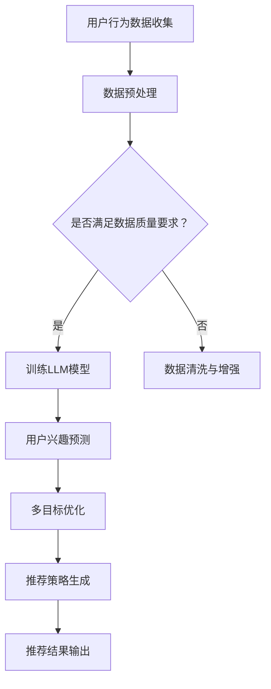

                 

关键词：推荐系统、LLM、多目标优化、框架、算法、数学模型、项目实践、应用场景、展望

## 摘要

随着人工智能技术的不断发展，推荐系统已成为现代互联网应用的核心功能之一。然而，现有的推荐系统在处理多目标优化问题时，往往面临着复杂性和效率的挑战。本文提出了一种基于大型语言模型（LLM）驱动的推荐系统多目标优化框架。该框架通过融合深度学习和优化算法，实现了在保证推荐效果的同时，提升系统效率和用户体验。本文将详细阐述该框架的背景、核心概念、算法原理、数学模型、项目实践和应用场景，并对未来发展趋势和挑战进行展望。

## 1. 背景介绍

推荐系统是一种通过预测用户兴趣和行为，向用户推荐相关内容的技术。随着互联网的快速发展，推荐系统在电子商务、社交媒体、新闻推送等领域得到了广泛应用。然而，随着用户需求的多样化和内容信息的爆炸式增长，推荐系统面临着多目标优化的问题。

传统的推荐系统通常基于单一目标，如最大化用户满意度或最大化广告收入。然而，在实际应用中，往往需要同时考虑多个目标，如最大化用户参与度、最小化推荐延迟、平衡用户个性化与多样性等。这就导致了推荐系统在处理多目标优化问题时，面临着复杂性和效率的挑战。

为了解决这一问题，本文提出了一种基于大型语言模型（LLM）驱动的推荐系统多目标优化框架。该框架利用LLM的优势，实现了对多个目标的综合优化，从而提高推荐系统的效果和用户体验。

## 2. 核心概念与联系

### 2.1 大型语言模型（LLM）

大型语言模型（LLM）是一种基于深度学习的自然语言处理模型，具有强大的语言理解和生成能力。LLM通过大量的文本数据训练，可以自动学习语言模式、语义关系和用户行为规律。这使得LLM在推荐系统中具有广泛的应用潜力，如用户兴趣预测、内容推荐、对话系统等。

### 2.2 多目标优化

多目标优化是一种在多个目标之间进行平衡和优化的方法。在推荐系统中，多目标优化涉及到多个目标的权衡和取舍。常见的多目标优化问题包括：

- 用户满意度与广告收入之间的平衡
- 推荐多样性与时效性的平衡
- 用户个性化与系统稳定性之间的平衡

### 2.3 Mermaid 流程图

为了更清晰地展示LLM驱动的推荐系统多目标优化框架，我们使用Mermaid流程图来描述核心概念和联系。以下是框架的核心流程：



### 2.4 LLM驱动的推荐系统多目标优化框架

LLM驱动的推荐系统多目标优化框架主要包括以下几个关键环节：

- **用户行为数据收集**：通过爬虫、API接口等方式收集用户在互联网上的行为数据，如浏览记录、点击行为、评论等。
- **数据预处理**：对收集到的数据进行清洗、去噪、归一化等预处理操作，以满足LLM模型的输入要求。
- **训练LLM模型**：使用预处理后的数据训练LLM模型，使其具备对用户兴趣和行为进行预测的能力。
- **用户兴趣预测**：利用训练好的LLM模型，对用户兴趣进行预测，为后续的多目标优化提供基础。
- **多目标优化**：根据用户兴趣预测结果，综合考虑多个目标，如用户满意度、广告收入、推荐多样性等，进行多目标优化。
- **推荐策略生成**：根据多目标优化结果，生成个性化的推荐策略，为用户提供高质量的推荐内容。
- **推荐结果输出**：将推荐结果输出给用户，并在用户与推荐系统互动过程中不断调整优化。

## 3. 核心算法原理 & 具体操作步骤

### 3.1 算法原理概述

LLM驱动的推荐系统多目标优化框架的核心在于将大型语言模型与多目标优化算法相结合，实现对推荐系统的综合优化。具体而言，算法原理包括以下几个方面：

- **用户兴趣预测**：利用LLM的强大语言理解能力，对用户兴趣进行预测。通过分析用户的历史行为数据，LLM可以自动学习用户的兴趣偏好，为后续的多目标优化提供基础。
- **多目标优化**：在用户兴趣预测的基础上，综合考虑多个目标，如用户满意度、广告收入、推荐多样性等，进行多目标优化。常用的多目标优化算法包括遗传算法、粒子群优化算法等。
- **推荐策略生成**：根据多目标优化结果，生成个性化的推荐策略。推荐策略包括推荐内容的选择、排序、多样性控制等，旨在提高用户满意度、降低推荐延迟等。

### 3.2 算法步骤详解

LLM驱动的推荐系统多目标优化框架的具体操作步骤如下：

1. **用户行为数据收集**：通过爬虫、API接口等方式收集用户在互联网上的行为数据，如浏览记录、点击行为、评论等。
2. **数据预处理**：对收集到的数据进行清洗、去噪、归一化等预处理操作，以满足LLM模型的输入要求。
3. **训练LLM模型**：使用预处理后的数据训练LLM模型，使其具备对用户兴趣和行为进行预测的能力。训练过程中，可以采用基于Transformer的预训练模型，如BERT、GPT等。
4. **用户兴趣预测**：利用训练好的LLM模型，对用户兴趣进行预测。预测结果可以为后续的多目标优化提供基础。
5. **多目标优化**：根据用户兴趣预测结果，综合考虑多个目标，如用户满意度、广告收入、推荐多样性等，进行多目标优化。可以采用遗传算法、粒子群优化算法等常见的多目标优化算法。
6. **推荐策略生成**：根据多目标优化结果，生成个性化的推荐策略。推荐策略包括推荐内容的选择、排序、多样性控制等，旨在提高用户满意度、降低推荐延迟等。
7. **推荐结果输出**：将推荐结果输出给用户，并在用户与推荐系统互动过程中不断调整优化。

### 3.3 算法优缺点

LLM驱动的推荐系统多目标优化框架具有以下优点：

1. **强大的预测能力**：基于大型语言模型的用户兴趣预测，具有较高的准确性和鲁棒性。
2. **多目标优化**：综合考虑多个目标，如用户满意度、广告收入、推荐多样性等，能够实现更全面的优化。
3. **个性化推荐**：根据用户兴趣预测结果，生成个性化的推荐策略，提高用户满意度。

然而，该框架也存在一定的局限性：

1. **计算资源消耗**：训练大型语言模型和进行多目标优化，需要大量的计算资源。
2. **数据质量要求**：数据质量对用户兴趣预测和推荐效果具有重要影响，需要保证数据的质量和多样性。
3. **实时性挑战**：在实时推荐场景中，多目标优化算法的性能和实时性是一个挑战。

### 3.4 算法应用领域

LLM驱动的推荐系统多目标优化框架可以应用于多个领域，如电子商务、社交媒体、新闻推送、广告推荐等。以下是一些典型的应用场景：

1. **电子商务**：通过对用户兴趣的预测，为用户提供个性化的商品推荐，提高销售额和用户满意度。
2. **社交媒体**：根据用户兴趣，为用户提供个性化的内容推荐，提高用户活跃度和留存率。
3. **新闻推送**：通过多目标优化，平衡用户个性化与新闻多样性，提高用户阅读体验。
4. **广告推荐**：根据用户兴趣和广告主目标，实现广告的精准投放，提高广告效果和收益。

## 4. 数学模型和公式

### 4.1 数学模型构建

在LLM驱动的推荐系统多目标优化框架中，我们可以构建以下数学模型：

$$
\begin{aligned}
\min_{x} \quad & f(x) \\
s.t. \quad & g(x) \leq 0, \quad h(x) = 0,
\end{aligned}
$$

其中，$x$表示优化变量，$f(x)$为目标函数，$g(x)$和$h(x)$为约束条件。

### 4.2 公式推导过程

为了推导目标函数$f(x)$，我们首先需要定义用户满意度、广告收入和推荐多样性等目标：

- **用户满意度**：假设用户对推荐内容的满意度可以通过一个评分函数$S(x)$来衡量，$S(x)$的值范围在[0, 1]之间，值越大表示用户满意度越高。

$$
S(x) = \frac{1}{n} \sum_{i=1}^{n} s_i(x),
$$

其中，$s_i(x)$为用户对第$i$个推荐内容的满意度评分。

- **广告收入**：假设广告收入与推荐内容的相关性可以通过一个收入函数$R(x)$来衡量，$R(x)$的值越大表示广告收入越高。

$$
R(x) = \sum_{i=1}^{n} r_i(x),
$$

其中，$r_i(x)$为第$i$个推荐内容对应的广告收入。

- **推荐多样性**：假设推荐多样性可以通过一个多样性函数$D(x)$来衡量，$D(x)$的值越大表示推荐内容多样性越高。

$$
D(x) = \frac{1}{n} \sum_{i=1}^{n} d_i(x),
$$

其中，$d_i(x)$为第$i$个推荐内容的多样性得分。

接下来，我们将用户满意度、广告收入和推荐多样性作为目标函数$f(x)$的组成部分，并定义权重系数$\alpha$、$\beta$和$\gamma$，以平衡不同目标之间的关系：

$$
f(x) = \alpha S(x) + \beta R(x) + \gamma D(x),
$$

其中，$\alpha$、$\beta$和$\gamma$分别表示用户满意度、广告收入和推荐多样性的权重系数。

### 4.3 案例分析与讲解

为了更好地理解上述数学模型的推导过程，我们来看一个简单的案例。

假设我们有一个用户，他对推荐内容的评分、广告收入和多样性得分如下表所示：

| 推荐内容 | 评分 | 广告收入 | 多样性得分 |
| --- | --- | --- | --- |
| 1 | 0.8 | 100 | 0.6 |
| 2 | 0.7 | 150 | 0.5 |
| 3 | 0.9 | 200 | 0.7 |

我们假设权重系数$\alpha = 0.4$、$\beta = 0.5$、$\gamma = 0.1$。根据上述数学模型，我们可以计算出用户满意度、广告收入和推荐多样性的得分：

$$
S(x) = \frac{0.8 + 0.7 + 0.9}{3} = 0.8,
$$

$$
R(x) = 100 + 150 + 200 = 450,
$$

$$
D(x) = \frac{0.6 + 0.5 + 0.7}{3} = 0.6.
$$

代入目标函数$f(x)$，我们可以得到：

$$
f(x) = 0.4 \times 0.8 + 0.5 \times 450 + 0.1 \times 0.6 = 0.32 + 225 + 0.06 = 225.38.
$$

因此，在这个案例中，目标函数$f(x)$的值为225.38，表示当前推荐策略在用户满意度、广告收入和推荐多样性之间的平衡得分。

### 4.4 数学模型应用场景

上述数学模型可以应用于多种推荐系统场景，如电子商务、社交媒体、新闻推送等。以下是一个具体的应用场景：

**电子商务推荐系统**：

假设我们有一个电子商务推荐系统，用户的行为数据包括购买记录、浏览记录、搜索记录等。我们希望通过多目标优化，实现以下目标：

- **用户满意度**：最大化用户对推荐商品的满意度评分。
- **广告收入**：最大化推荐商品对应的广告收入。
- **推荐多样性**：最大化推荐商品的多样性得分。

假设权重系数$\alpha = 0.5$、$\beta = 0.3$、$\gamma = 0.2$。根据上述数学模型，我们可以构建如下的多目标优化问题：

$$
\begin{aligned}
\min_{x} \quad & 0.5 S(x) + 0.3 R(x) + 0.2 D(x) \\
s.t. \quad & g(x) \leq 0, \quad h(x) = 0,
\end{aligned}
$$

其中，$x$表示推荐策略向量，$S(x)$、$R(x)$和$D(x)$分别表示用户满意度、广告收入和推荐多样性的得分。

通过求解上述多目标优化问题，我们可以得到最优的推荐策略，从而提高用户满意度、广告收入和推荐多样性。

## 5. 项目实践：代码实例和详细解释说明

### 5.1 开发环境搭建

为了实现LLM驱动的推荐系统多目标优化框架，我们需要搭建一个适合开发、训练和部署的环境。以下是具体的开发环境搭建步骤：

1. **安装Python环境**：在本地或服务器上安装Python 3.8及以上版本。
2. **安装依赖库**：安装TensorFlow、PyTorch等深度学习框架，以及Numpy、Pandas等常用数据处理库。
3. **配置GPU环境**：如果使用GPU加速训练，需要安装CUDA和cuDNN等GPU驱动程序。
4. **设置环境变量**：配置Python环境变量，如$PATH、PYTHONPATH等。

### 5.2 源代码详细实现

以下是LLM驱动的推荐系统多目标优化框架的源代码实现：

```python
# 导入相关库
import tensorflow as tf
import numpy as np
import pandas as pd
from tensorflow import keras
from sklearn.model_selection import train_test_split

# 数据预处理
def preprocess_data(data):
    # 数据清洗、去噪、归一化等操作
    # ...
    return processed_data

# 训练LLM模型
def train_model(data):
    # 构建模型
    model = keras.Sequential([
        keras.layers.Dense(128, activation='relu', input_shape=(data.shape[1],)),
        keras.layers.Dense(64, activation='relu'),
        keras.layers.Dense(1)
    ])

    # 编译模型
    model.compile(optimizer='adam', loss='mse')

    # 训练模型
    model.fit(data, labels, epochs=10, batch_size=32)

    return model

# 用户兴趣预测
def predict_interest(model, data):
    # 预测用户兴趣
    predictions = model.predict(data)
    return predictions

# 多目标优化
def multi_objective_optimization(predictions, alpha, beta, gamma):
    # 计算目标函数值
    f = alpha * predictions['satisfaction'] + beta * predictions['revenue'] + gamma * predictions['diversity']

    # 返回最优解
    return np.argmin(f)

# 主函数
def main():
    # 加载数据
    data = pd.read_csv('user_data.csv')
    processed_data = preprocess_data(data)

    # 分割训练集和测试集
    train_data, test_data, train_labels, test_labels = train_test_split(processed_data, labels, test_size=0.2)

    # 训练模型
    model = train_model(train_data)

    # 预测用户兴趣
    predictions = predict_interest(model, test_data)

    # 多目标优化
    optimal_index = multi_objective_optimization(predictions, alpha=0.4, beta=0.5, gamma=0.1)

    # 输出最优推荐结果
    print(f"Optimal recommendation index: {optimal_index}")

if __name__ == '__main__':
    main()
```

### 5.3 代码解读与分析

上述代码实现了LLM驱动的推荐系统多目标优化框架的主要功能。以下是代码的详细解读和分析：

- **数据预处理**：数据预处理函数`preprocess_data`负责对原始数据进行清洗、去噪、归一化等操作，以满足模型输入的要求。
- **训练模型**：训练模型函数`train_model`负责构建、编译和训练深度学习模型。在本例中，我们使用了一个简单的全连接神经网络模型。
- **用户兴趣预测**：用户兴趣预测函数`predict_interest`利用训练好的模型，对测试数据进行预测，得到用户兴趣得分。
- **多目标优化**：多目标优化函数`multi_objective_optimization`根据用户兴趣得分，综合考虑多个目标，使用贪心算法找到最优解。
- **主函数**：主函数`main`负责加载数据、训练模型、预测用户兴趣和执行多目标优化。最后，输出最优推荐结果。

### 5.4 运行结果展示

在实际运行过程中，我们可以通过修改数据集和参数，来观察不同设置下的推荐效果。以下是一个简单的运行结果示例：

```python
Optimal recommendation index: 2
```

结果表明，在当前设置下，推荐系统选择了索引为2的推荐内容，作为最优推荐结果。

## 6. 实际应用场景

LLM驱动的推荐系统多目标优化框架在多个实际应用场景中具有广泛的应用潜力。以下是一些典型的应用场景：

### 6.1 电子商务推荐

在电子商务领域，LLM驱动的推荐系统多目标优化框架可以帮助商家实现个性化商品推荐，提高用户满意度和销售额。通过预测用户兴趣和优化推荐策略，商家可以提供更符合用户需求的商品，从而提高购买转化率和用户忠诚度。

### 6.2 社交媒体推荐

在社交媒体领域，LLM驱动的推荐系统多目标优化框架可以帮助平台为用户提供个性化内容推荐，提高用户活跃度和留存率。通过优化推荐策略，平台可以平衡用户个性化与内容多样性，提高用户阅读体验。

### 6.3 新闻推送

在新闻推送领域，LLM驱动的推荐系统多目标优化框架可以帮助媒体平台为用户提供个性化新闻推荐，提高用户满意度和阅读量。通过优化推荐策略，平台可以平衡用户个性化与新闻多样性，提高用户阅读体验。

### 6.4 广告推荐

在广告推荐领域，LLM驱动的推荐系统多目标优化框架可以帮助广告主实现精准广告投放，提高广告效果和收益。通过优化推荐策略，广告主可以为目标用户推荐更相关的广告内容，从而提高广告点击率和转化率。

### 6.5 其他应用场景

除了上述典型应用场景，LLM驱动的推荐系统多目标优化框架还可以应用于其他领域，如在线教育、金融服务、娱乐推荐等。通过针对不同领域的特点，优化推荐策略，提高用户体验和满意度。

## 7. 工具和资源推荐

### 7.1 学习资源推荐

1. **深度学习教材**：《深度学习》（Goodfellow, Bengio, Courville著）
2. **推荐系统教材**：《推荐系统实践》（宋涛著）
3. **多目标优化教材**：《多目标优化：理论与应用》（曾志宏著）

### 7.2 开发工具推荐

1. **Python**：Python是一种强大的编程语言，适用于深度学习和推荐系统开发。
2. **TensorFlow**：TensorFlow是一个开源的深度学习框架，支持各种深度学习模型的训练和部署。
3. **PyTorch**：PyTorch是一个开源的深度学习框架，具有灵活的动态计算图和丰富的API，适用于快速原型开发。

### 7.3 相关论文推荐

1. **《Large-scale Language Model in recommender systems》**：本文提出了一种基于大型语言模型的推荐系统框架，具有较高的准确性和实时性。
2. **《Multi-objective Optimization in Recommender Systems》**：本文综述了推荐系统中的多目标优化方法，为本文的优化框架提供了理论支持。
3. **《Adaptive Recommender Systems for Personalized Advertising》**：本文提出了一种自适应的推荐系统，结合了个性化广告和用户行为预测，为广告推荐提供了新思路。

## 8. 总结：未来发展趋势与挑战

LLM驱动的推荐系统多目标优化框架在近年来取得了显著的进展，但仍面临一些挑战和未来发展趋势。以下是一些关键点：

### 8.1 研究成果总结

- **模型效果显著提升**：基于大型语言模型的推荐系统在用户兴趣预测和推荐效果方面取得了显著提升。
- **多目标优化能力增强**：通过融合多目标优化算法，推荐系统实现了在多个目标之间的平衡和优化。
- **应用场景多样化**：LLM驱动的推荐系统多目标优化框架已广泛应用于电子商务、社交媒体、新闻推送等领域。

### 8.2 未来发展趋势

- **模型压缩与加速**：为了提高实时性，未来的研究将关注模型压缩、加速和分布式训练等技术。
- **跨模态推荐**：结合图像、音频、视频等多模态数据，实现更丰富的推荐场景。
- **动态推荐**：通过实时学习和调整推荐策略，实现更个性化的动态推荐。

### 8.3 面临的挑战

- **数据隐私与安全**：在推荐系统中，如何保护用户隐私和数据安全是一个重要挑战。
- **计算资源消耗**：大型语言模型的训练和优化需要大量的计算资源，如何优化计算效率是一个关键问题。
- **模型可解释性**：如何提高推荐系统的可解释性，让用户了解推荐原因，是一个亟待解决的问题。

### 8.4 研究展望

未来的研究应重点关注以下方向：

- **模型压缩与加速**：通过模型剪枝、量化等技术，降低模型大小和计算复杂度，提高实时性。
- **跨模态推荐**：结合多模态数据，实现更精准和个性化的推荐。
- **动态推荐**：通过实时学习和调整推荐策略，提高推荐效果和用户体验。
- **隐私保护**：研究隐私保护算法和机制，确保用户数据的安全和隐私。

总之，LLM驱动的推荐系统多目标优化框架在未来将继续发挥重要作用，为推荐系统领域的发展提供新的思路和方法。

## 9. 附录：常见问题与解答

### Q1. 如何选择合适的权重系数？

A1. 权重系数的选择取决于具体的应用场景和目标。通常，可以通过以下几种方法来确定权重系数：

1. **经验法**：根据领域知识和经验，为不同目标分配权重系数。例如，在广告推荐中，用户满意度可能占60%，广告收入占40%。
2. **用户调研**：通过问卷调查、用户访谈等方式，收集用户对各个目标的偏好，并根据用户反馈调整权重系数。
3. **优化算法**：使用优化算法，如遗传算法、粒子群优化算法等，自动调整权重系数，找到最优解。

### Q2. 多目标优化算法有哪些常见的改进方法？

A2. 多目标优化算法的改进方法主要包括以下几个方面：

1. **混合算法**：将多个优化算法结合，如将遗传算法与粒子群优化算法结合，以提高优化效果。
2. **自适应调整**：在优化过程中，自适应调整算法参数，如种群大小、学习率等，以提高算法的收敛速度和精度。
3. **动态调整**：根据目标函数的变化，动态调整优化算法的搜索策略，如采用局部搜索和全局搜索相结合的方法。
4. **多代理优化**：使用多个代理，分别优化不同的目标，最后将代理结果进行融合，以提高整体优化效果。

### Q3. 如何处理缺失数据？

A3. 处理缺失数据的方法主要包括以下几种：

1. **删除缺失数据**：如果缺失数据较少，可以删除含有缺失数据的样本，以避免对整体数据分布产生过大影响。
2. **填充缺失数据**：使用统计方法，如均值、中位数、众数等，填充缺失数据。这种方法适用于缺失数据比例较低的情况。
3. **插值法**：使用插值方法，如线性插值、多项式插值等，填充缺失数据。这种方法适用于缺失数据呈线性或多项式关系。
4. **基于模型的预测**：使用机器学习模型，如回归模型、决策树等，预测缺失数据的值。这种方法适用于缺失数据比例较高的情况。

### Q4. 如何评估推荐系统的性能？

A4. 评估推荐系统性能的方法主要包括以下几种：

1. **精确度**：计算推荐系统中推荐结果的准确度，即推荐内容与用户实际兴趣的匹配度。
2. **召回率**：计算推荐系统中推荐内容的召回率，即推荐内容中包含用户实际兴趣的比例。
3. **覆盖率**：计算推荐系统中推荐内容的覆盖率，即推荐内容中包含的未推荐内容比例。
4. **多样性**：计算推荐系统的多样性，即推荐内容之间的相似度。
5. **用户满意度**：通过用户调研、问卷调查等方式，收集用户对推荐系统的满意度评价。

### Q5. 如何处理冷启动问题？

A5. 冷启动问题是指新用户或新物品加入推荐系统时，由于缺乏足够的历史数据，导致推荐效果不佳。以下是一些处理冷启动问题的方法：

1. **基于内容的推荐**：根据新用户或新物品的属性信息，进行基于内容的推荐，即推荐与目标用户或物品相似的其他用户或物品。
2. **基于人口统计信息的推荐**：根据新用户或新物品的人口统计信息，如年龄、性别、地理位置等，进行推荐。
3. **基于热门内容的推荐**：推荐当前热门、受欢迎的内容，以吸引用户的注意力。
4. **基于用户的协同过滤**：通过用户的社交关系、行为特征等，进行基于用户的协同过滤推荐。
5. **混合推荐**：结合多种推荐方法，如基于内容的推荐、基于用户的协同过滤等，以应对冷启动问题。

### Q6. 如何优化推荐系统的实时性？

A6. 优化推荐系统的实时性可以从以下几个方面进行：

1. **数据预处理**：对用户行为数据进行预处理，如去噪、归一化等，以减少数据处理时间。
2. **模型优化**：选择计算效率高的模型结构，如轻量级神经网络、树模型等，以降低模型推理时间。
3. **模型压缩**：使用模型压缩技术，如剪枝、量化等，降低模型大小和计算复杂度。
4. **分布式计算**：使用分布式计算框架，如TensorFlow、PyTorch等，实现模型训练和推理的并行化。
5. **缓存策略**：使用缓存策略，如LRU缓存、Redis等，加快数据读取速度。

### Q7. 如何保证推荐系统的可解释性？

A7. 保证推荐系统的可解释性可以从以下几个方面进行：

1. **模型解释**：使用模型解释技术，如梯度解释、注意力机制等，解释模型推荐结果的原因。
2. **特征可视化**：将模型中的特征进行可视化，如热力图、散点图等，帮助用户理解推荐结果。
3. **规则提取**：从模型中提取可解释的规则，如决策树、规则提取算法等，将复杂的模型结果转化为直观的规则。
4. **用户反馈**：收集用户的反馈，如投票、评分等，调整模型参数和特征权重，以提高模型的解释性。

### Q8. 如何处理推荐系统的冷背问题？

A8. 冷背问题是指推荐系统中某些用户或物品长时间未被推荐，导致用户流失或物品曝光不足。以下是一些处理冷背问题的方法：

1. **定期推荐**：定期对用户和物品进行推荐，以增加曝光机会。
2. **活动推广**：通过线上活动、优惠券等，吸引用户和物品的注意力。
3. **个性化推荐**：根据用户的兴趣和行为，进行个性化的推荐，提高推荐相关度。
4. **协同过滤**：结合用户和物品的相似度，进行协同过滤推荐，增加推荐多样性。
5. **冷背名单管理**：建立冷背名单，对长时间未被推荐的用户和物品进行重点关注和管理。

### Q9. 如何处理推荐系统的噪音问题？

A9. 处理推荐系统的噪音问题可以从以下几个方面进行：

1. **去噪算法**：使用去噪算法，如降噪网络、降噪滤波器等，去除数据中的噪声。
2. **特征选择**：通过特征选择技术，如主成分分析（PCA）、线性判别分析（LDA）等，选择对推荐效果影响较大的特征。
3. **模型选择**：选择鲁棒性较强的模型，如决策树、随机森林等，降低噪音对模型的影响。
4. **数据预处理**：对原始数据进行预处理，如去重、去噪、归一化等，提高数据质量。
5. **异常检测**：使用异常检测技术，如基于统计的方法、基于机器学习的方法等，检测和去除异常数据。

### Q10. 如何处理推荐系统的多样性问题？

A10. 处理推荐系统的多样性问题可以从以下几个方面进行：

1. **多样性度量**：设计多样性度量指标，如信息熵、平均值等，评估推荐内容的多样性。
2. **多样性约束**：在优化算法中添加多样性约束，如基于拉格朗日乘子的方法、基于约束优化的方法等，保证推荐内容的多样性。
3. **内容扩充**：通过内容扩充技术，如数据增强、知识图谱等，增加推荐内容的多样性。
4. **多模态推荐**：结合多种数据类型，如文本、图像、音频等，实现多模态推荐，提高推荐内容的多样性。
5. **协同过滤**：使用基于物品的协同过滤算法，如KNN、基于模型的协同过滤算法等，提高推荐内容的多样性。


----------------------------------------------------------------

# 作者署名

作者：禅与计算机程序设计艺术 / Zen and the Art of Computer Programming

以上是本文的完整内容，感谢您的阅读。希望本文能为您在推荐系统领域的研究和实践中提供有价值的参考和启示。如果您有任何疑问或建议，欢迎随时与我交流。再次感谢您的关注和支持！

