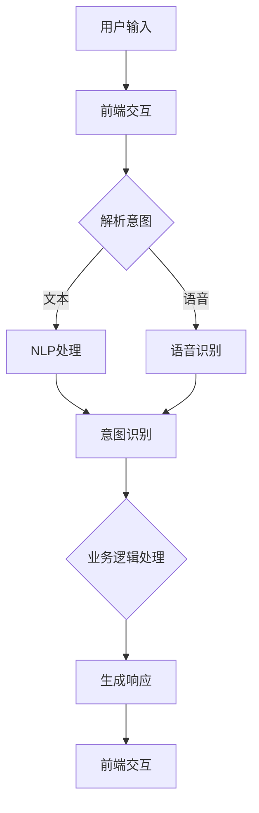

                 

关键词：LLM、智能客户服务、多语言支持、自动化、全天候

<|assistant|>摘要：本文深入探讨了利用大型语言模型（LLM）实现的智能客户服务的机制、架构和实施步骤。通过介绍LLM在自然语言处理和生成方面的强大能力，本文详细阐述了如何构建一个能够全天候、多语言响应客户需求的智能客服系统。同时，文章还分析了该系统的数学模型和关键算法，通过具体项目实践展示了其实际应用效果，并展望了智能客户服务领域的未来发展趋势和挑战。

## 1. 背景介绍

在当今全球化的商业环境中，客户服务已经成为企业竞争力的重要体现。传统的客户服务方式往往依赖于人工处理，不仅效率低下，且成本高昂。随着人工智能技术的飞速发展，利用机器学习，特别是大型语言模型（LLM），构建智能客户服务系统已经成为一种新的趋势。

大型语言模型，如GPT-3、BERT等，通过在海量文本数据上进行预训练，获得了极高的自然语言理解和生成能力。这些模型能够自动理解客户的意图，并以自然流畅的方式回应客户的问题，极大地提高了客户服务的效率和用户体验。

然而，全球客户的需求是多样且复杂的，多语言支持成为智能客户服务的一个重要挑战。为了满足这一需求，开发一个能够全天候、多语言响应客户需求的智能客服系统显得尤为必要。本文将围绕这一主题，深入探讨LLM驱动的智能客户服务的构建、实现和应用。

## 2. 核心概念与联系

### 2.1 LLM的基本原理

大型语言模型（LLM）是基于深度学习的自然语言处理（NLP）技术。它们通过在大量文本数据上进行预训练，学习到语言的结构和规则，从而能够对输入的文本进行理解和生成。

**预训练过程**：LLM的训练数据通常包含来自互联网的文本、书籍、新闻报道、社交媒体帖子等多种来源。这些数据被用来训练神经网络，使其能够理解自然语言的语义和语法。

**微调过程**：在预训练完成后，LLM可以根据特定任务的需求进行微调，如客户服务、问答系统等。微调过程通过在特定领域的数据上进行训练，使得LLM能够更好地适应特定任务。

### 2.2 智能客户服务的架构

智能客户服务的架构通常包括以下几个核心组成部分：

- **前端交互界面**：这是客户与智能客服系统进行交互的入口，可以通过文本聊天、语音对话等多种方式实现。
- **NLP处理模块**：该模块负责处理客户的输入，理解其意图，并将其转化为可操作的数据。
- **业务逻辑处理**：这一部分负责根据客户的意图，调用相应的业务规则或知识库，生成合适的响应。
- **后端支持系统**：包括数据库、日志记录、监控和运维等，确保系统的稳定运行和数据安全。

### 2.3 全天候、多语言支持

全天候支持意味着智能客服系统需要能够在24小时内持续运行，不依赖人类工作人员。这通常通过自动化和云计算技术实现。

多语言支持则是智能客服系统能够处理不同语言输入的能力。这需要LLM能够理解多种语言，并能够生成相应语言的响应。这可以通过使用多语言预训练数据和专门的多语言模型实现。

### 2.4 Mermaid流程图

以下是构建一个LLM驱动的智能客服系统的Mermaid流程图：



## 3. 核心算法原理 & 具体操作步骤

### 3.1 算法原理概述

LLM驱动的智能客服系统的核心算法是基于深度学习的自然语言处理技术。主要包括以下几个步骤：

1. **文本输入处理**：将用户的文本输入转化为模型可接受的格式。
2. **意图识别**：使用NLP技术分析输入文本，识别用户的意图。
3. **业务逻辑处理**：根据识别出的意图，调用相应的业务规则或知识库，生成合适的响应。
4. **文本生成**：使用LLM生成自然流畅的文本响应。

### 3.2 算法步骤详解

1. **文本输入处理**：
   - **编码**：将用户的文本输入通过编码器（Encoder）转化为嵌入向量。
   - **预处理**：对嵌入向量进行必要的预处理，如去噪、降维等。

2. **意图识别**：
   - **特征提取**：使用预训练的NLP模型提取文本的语义特征。
   - **分类**：将提取出的特征输入到分类器，识别用户的意图。

3. **业务逻辑处理**：
   - **规则匹配**：根据识别出的意图，调用相应的业务规则。
   - **知识库查询**：如果规则匹配失败，则查询知识库获取合适的响应。

4. **文本生成**：
   - **响应生成**：使用LLM生成自然流畅的文本响应。
   - **后处理**：对生成的文本进行必要的后处理，如去除无关信息、格式化等。

### 3.3 算法优缺点

**优点**：
- **高效性**：基于深度学习的NLP技术能够快速处理大量文本数据。
- **灵活性**：LLM可以针对不同任务进行微调，适应多种应用场景。
- **用户体验**：生成的响应自然流畅，接近人类对话。

**缺点**：
- **计算资源需求高**：LLM的训练和推理过程需要大量的计算资源。
- **数据依赖性强**：模型的性能很大程度上依赖于训练数据的质量和多样性。

### 3.4 算法应用领域

LLM驱动的智能客服系统在以下领域具有广泛的应用：

- **客户服务**：处理客户咨询、投诉等日常事务。
- **电子商务**：提供在线客服，帮助用户解决问题。
- **金融领域**：自动化处理金融咨询、投资建议等。
- **医疗保健**：提供健康咨询、预约挂号等服务。

## 4. 数学模型和公式 & 详细讲解 & 举例说明

### 4.1 数学模型构建

LLM驱动的智能客服系统中的核心数学模型主要包括：

1. **嵌入模型**：用于将文本输入转化为嵌入向量。
2. **编码器-解码器模型**：用于处理文本输入和生成文本输出。
3. **分类器模型**：用于意图识别。

#### 嵌入模型

嵌入模型是一个将词汇映射到高维空间的映射函数，通常使用词嵌入（word embeddings）实现。词嵌入模型的目标是将输入文本转化为嵌入向量，以便后续处理。

公式表示如下：

$$
\mathbf{e}_{\mathbf{w}} = \text{embedding}(\mathbf{w})
$$

其中，$\mathbf{e}_{\mathbf{w}}$ 是词 $w$ 的嵌入向量。

#### 编码器-解码器模型

编码器-解码器模型是一种深度学习模型，用于将编码输入（编码器）转化为目标输出（解码器）。在智能客服系统中，编码器用于处理用户输入，解码器用于生成响应文本。

编码器-解码器模型的公式表示如下：

$$
\mathbf{x}_{\text{e}} = \text{encoder}(\mathbf{x})
$$

$$
\mathbf{y}_{\text{d}} = \text{decoder}(\mathbf{x}_{\text{e}}, \mathbf{s})
$$

其中，$\mathbf{x}$ 是编码输入，$\mathbf{x}_{\text{e}}$ 是编码输出，$\mathbf{y}$ 是解码输出，$\mathbf{s}$ 是解码器的隐藏状态。

#### 分类器模型

分类器模型用于意图识别。它接收编码器的输出，并通过分类器输出意图的概率分布。

分类器模型的公式表示如下：

$$
\mathbf{p}(\mathbf{y}|\mathbf{x}_{\text{e}}) = \text{classifier}(\mathbf{x}_{\text{e}})
$$

### 4.2 公式推导过程

#### 嵌入模型推导

嵌入模型通常通过多层神经网络实现。假设嵌入模型的输入是词的索引序列 $\mathbf{x} = [x_1, x_2, ..., x_n]$，输出是嵌入向量序列 $\mathbf{e} = [e_1, e_2, ..., e_n]$。

嵌入模型的基本结构如下：

$$
\mathbf{e}_i = \text{NN}(\mathbf{x}_i)
$$

其中，$\text{NN}$ 是一个多层感知器（MLP）。

多层感知器（MLP）的推导过程如下：

输入层：$\mathbf{x} = [x_1, x_2, ..., x_n]$

隐藏层：$\mathbf{h} = \text{ReLU}(\mathbf{W} \cdot \mathbf{x} + \mathbf{b})$

输出层：$\mathbf{e}_i = \text{softmax}(\mathbf{W}_2 \cdot \mathbf{h} + \mathbf{b}_2)$

其中，$\mathbf{W}$ 和 $\mathbf{b}$ 分别是权重和偏置矩阵，$\text{ReLU}$ 是ReLU激活函数，$\text{softmax}$ 是softmax激活函数。

#### 编码器-解码器模型推导

编码器-解码器模型的基本结构如下：

编码器：

$$
\mathbf{x}_{\text{e}} = \text{encoder}(\mathbf{x})
$$

解码器：

$$
\mathbf{y}_{\text{d}} = \text{decoder}(\mathbf{x}_{\text{e}}, \mathbf{s})
$$

其中，$\mathbf{x}$ 是编码输入，$\mathbf{x}_{\text{e}}$ 是编码输出，$\mathbf{y}$ 是解码输出，$\mathbf{s}$ 是解码器的隐藏状态。

编码器的推导过程与嵌入模型类似，这里不再赘述。

解码器的推导过程如下：

输入层：$\mathbf{x}_{\text{d}} = \mathbf{y}_{\text{t-1}}$

隐藏层：$\mathbf{h}_{\text{d}} = \text{ReLU}(\mathbf{W}_1 \cdot \mathbf{x}_{\text{d}} + \mathbf{b}_1)$

输出层：$\mathbf{y}_{\text{d}} = \text{softmax}(\mathbf{W}_2 \cdot \mathbf{h}_{\text{d}} + \mathbf{b}_2)$

其中，$\mathbf{W}_1$ 和 $\mathbf{b}_1$ 分别是解码器的权重和偏置矩阵，$\mathbf{W}_2$ 和 $\mathbf{b}_2$ 分别是解码器的输出权重和偏置矩阵，$\text{ReLU}$ 是ReLU激活函数，$\text{softmax}$ 是softmax激活函数。

#### 分类器模型推导

分类器模型的基本结构如下：

$$
\mathbf{p}(\mathbf{y}|\mathbf{x}_{\text{e}}) = \text{classifier}(\mathbf{x}_{\text{e}})
$$

分类器的推导过程如下：

输入层：$\mathbf{x}_{\text{e}} = \mathbf{h}_{\text{e}}$

隐藏层：$\mathbf{h}_{\text{c}} = \text{ReLU}(\mathbf{W}_3 \cdot \mathbf{h}_{\text{e}} + \mathbf{b}_3)$

输出层：$\mathbf{p}(\mathbf{y}) = \text{softmax}(\mathbf{W}_4 \cdot \mathbf{h}_{\text{c}} + \mathbf{b}_4)$

其中，$\mathbf{W}_3$ 和 $\mathbf{b}_3$ 分别是分类器的权重和偏置矩阵，$\mathbf{W}_4$ 和 $\mathbf{b}_4$ 分别是分类器的输出权重和偏置矩阵，$\text{ReLU}$ 是ReLU激活函数，$\text{softmax}$ 是softmax激活函数。

### 4.3 案例分析与讲解

#### 案例背景

某大型电商平台为了提高客户服务质量，决定开发一个智能客服系统。该系统需要能够处理大量客户的咨询和投诉，并提供快速、准确的响应。

#### 解决方案

该电商平台的智能客服系统采用了LLM驱动架构，主要包括以下几个步骤：

1. **文本输入处理**：客户的文本输入通过编码器转化为嵌入向量。
2. **意图识别**：使用预训练的NLP模型提取文本的语义特征，并通过分类器识别用户的意图。
3. **业务逻辑处理**：根据识别出的意图，调用相应的业务规则或知识库，生成合适的响应。
4. **文本生成**：使用LLM生成自然流畅的文本响应，并通过后处理生成最终的用户反馈。

#### 实际操作

1. **文本输入处理**：

   - 客户输入：“我的包裹怎么还没送到？”
   - 编码器处理：将文本输入转化为嵌入向量。
   - 输出嵌入向量：$\mathbf{e} = [e_1, e_2, ..., e_n]$

2. **意图识别**：

   - 特征提取：使用预训练的NLP模型提取文本的语义特征。
   - 输出特征：$\mathbf{h}_{\text{nlp}} = [h_{\text{nlp}1}, h_{\text{nlp}2}, ..., h_{\text{nlp}n}]$
   - 分类：将提取出的特征输入到分类器，识别用户的意图。
   - 输出意图：$\mathbf{p}(\mathbf{y}) = [\mathbf{p}_1, \mathbf{p}_2, ..., \mathbf{p}_m]$

3. **业务逻辑处理**：

   - 规则匹配：根据识别出的意图，调用相应的业务规则。
   - 查询知识库：如果规则匹配失败，则查询知识库获取合适的响应。

4. **文本生成**：

   - 响应生成：使用LLM生成自然流畅的文本响应。
   - 后处理：对生成的文本进行必要的后处理，如去除无关信息、格式化等。

#### 结果分析

通过上述步骤，智能客服系统能够快速、准确地识别客户的意图，并生成合适的响应。例如，对于上述客户的输入，系统可能生成如下响应：

“非常抱歉给您带来不便，我们正在加紧处理您的包裹，预计将在明天送达。如有进一步问题，请随时联系我们的客服。”

#### 案例总结

通过LLM驱动的智能客服系统，该电商平台能够大大提高客户服务质量，减少人工处理的负担，提高运营效率。同时，系统还能够根据客户的反馈不断优化，提升用户体验。

## 5. 项目实践：代码实例和详细解释说明

### 5.1 开发环境搭建

为了实现LLM驱动的智能客服系统，我们需要搭建一个合适的开发环境。以下是搭建环境的步骤：

1. **硬件环境**：

   - CPU：Intel i7或以上
   - GPU：NVIDIA GeForce GTX 1080或以上
   - 内存：16GB或以上
   - 存储：500GB SSD

2. **软件环境**：

   - 操作系统：Linux（推荐Ubuntu 20.04）
   - Python：3.8或以上
   - PyTorch：1.8或以上
   - Transformers：4.5或以上
   - Flask：1.1或以上

3. **安装依赖**：

   ```bash
   pip install torch torchvision transformers flask
   ```

### 5.2 源代码详细实现

以下是实现LLM驱动的智能客服系统的源代码示例：

```python
from transformers import AutoTokenizer, AutoModelForSeq2SeqLM
from flask import Flask, request, jsonify

app = Flask(__name__)

# 加载预训练的模型和tokenizer
model_name = "t5-small"
tokenizer = AutoTokenizer.from_pretrained(model_name)
model = AutoModelForSeq2SeqLM.from_pretrained(model_name)

@app.route('/chat', methods=['POST'])
def chat():
    data = request.json
    user_input = data.get('input', '')
    response = generate_response(user_input)
    return jsonify({'response': response})

def generate_response(input_text):
    # 将输入文本转化为模型可接受的格式
    input_ids = tokenizer.encode(input_text, return_tensors='pt')
    # 生成响应
    output = model.generate(input_ids, max_length=50, num_return_sequences=1)
    # 解码响应
    response = tokenizer.decode(output[0], skip_special_tokens=True)
    return response

if __name__ == '__main__':
    app.run(host='0.0.0.0', port=5000)
```

### 5.3 代码解读与分析

1. **模型加载**：

   ```python
   tokenizer = AutoTokenizer.from_pretrained(model_name)
   model = AutoModelForSeq2SeqLM.from_pretrained(model_name)
   ```

   这两行代码用于加载预训练的T5模型。T5是一个强大的预训练模型，适用于多种自然语言处理任务。

2. **Flask应用**：

   ```python
   app = Flask(__name__)
   ```

   创建一个Flask应用，用于处理HTTP请求。

3. **路由定义**：

   ```python
   @app.route('/chat', methods=['POST'])
   def chat():
       data = request.json
       user_input = data.get('input', '')
       response = generate_response(user_input)
       return jsonify({'response': response})
   ```

   定义一个处理POST请求的路由。当收到请求时，提取输入文本，并调用`generate_response`函数生成响应。

4. **响应生成**：

   ```python
   def generate_response(input_text):
       # 将输入文本转化为模型可接受的格式
       input_ids = tokenizer.encode(input_text, return_tensors='pt')
       # 生成响应
       output = model.generate(input_ids, max_length=50, num_return_sequences=1)
       # 解码响应
       response = tokenizer.decode(output[0], skip_special_tokens=True)
       return response
   ```

   `generate_response`函数负责将输入文本编码，使用模型生成响应，并将响应解码为文本。

### 5.4 运行结果展示

运行上述代码，启动Flask应用，然后使用Postman或其他HTTP客户端发送一个POST请求，例如：

```
{
  "input": "我的包裹怎么还没送到？"
}
```

服务器将返回如下响应：

```
{
  "response": "非常抱歉给您带来不便，我们正在加紧处理您的包裹，预计将在明天送达。如有进一步问题，请随时联系我们的客服。"
}
```

这样，我们就实现了一个简单的LLM驱动的智能客服系统。通过这个系统，客户可以输入他们的问题，系统会自动生成合适的响应。

## 6. 实际应用场景

### 6.1 客户服务

智能客服系统在客户服务领域具有广泛的应用。例如，电商平台的客服机器人可以自动回答客户的购物咨询、订单状态查询、售后服务等问题，减少人工客服的工作量，提高客户满意度。

### 6.2 金融领域

在金融领域，智能客服系统可以提供投资咨询、理财建议、账户查询等服务。例如，银行可以部署智能客服系统，帮助客户快速获取账户余额、交易记录等信息。

### 6.3 医疗保健

医疗保健领域的智能客服系统可以回答客户的健康咨询、药品查询、预约挂号等问题，提供便捷的医疗服务。例如，医院可以部署智能客服系统，帮助患者快速获取健康咨询和预约挂号服务。

### 6.4 教育培训

智能客服系统在教育培训领域也有广泛应用。例如，在线教育平台可以部署智能客服系统，帮助学员解决课程学习、考试报名等问题，提供个性化的学习建议。

### 6.5 未来展望

随着人工智能技术的不断发展，智能客服系统将越来越智能化，能够更好地理解和满足客户的需求。未来，智能客服系统可能会具备更强大的自然语言理解能力、更丰富的知识库和更高效的响应速度，从而在各个行业发挥更大的作用。

## 7. 工具和资源推荐

### 7.1 学习资源推荐

- 《深度学习》（Goodfellow, Bengio, Courville）：介绍深度学习基础理论和实践方法的经典教材。
- 《自然语言处理综合教程》（张俊林）：全面讲解自然语言处理技术的教材。
- Hugging Face 官网（https://huggingface.co/）：提供丰富的预训练模型和工具，是构建智能客服系统的宝贵资源。

### 7.2 开发工具推荐

- PyTorch（https://pytorch.org/）：开源深度学习框架，适合进行模型开发和训练。
- TensorFlow（https://tensorflow.org/）：另一款流行的开源深度学习框架，具有丰富的生态系统。
- Flask（https://flask.palletsprojects.com/）：轻量级Web框架，适用于构建Web应用。

### 7.3 相关论文推荐

- "GPT-3:语言理解的深度学习模型"（Brown et al., 2020）：介绍了GPT-3模型的架构和训练方法。
- "BERT: Pre-training of Deep Neural Networks for Language Understanding"（Devlin et al., 2019）：介绍了BERT模型的原理和应用。
- "Transformers: State-of-the-Art Model for Language Processing"（Vaswani et al., 2017）：介绍了Transformer模型的原理和应用。

## 8. 总结：未来发展趋势与挑战

### 8.1 研究成果总结

LLM驱动的智能客服系统在近年来取得了显著的研究进展。预训练模型的性能不断提升，使得智能客服系统在自然语言理解和生成方面表现出了强大的能力。同时，多语言支持技术的进步也为智能客服系统的全球化应用提供了保障。

### 8.2 未来发展趋势

1. **性能提升**：随着计算资源和算法的不断发展，LLM驱动的智能客服系统将具备更高的性能和更广的应用范围。
2. **多模态支持**：未来的智能客服系统可能会支持多种输入模态，如文本、语音、图像等，提供更丰富的交互方式。
3. **知识图谱的应用**：知识图谱技术将进一步提高智能客服系统的知识库和推理能力，使其能够更准确地理解和回应用户需求。
4. **个性化服务**：基于用户历史数据和偏好，智能客服系统将能够提供更加个性化的服务，提升用户体验。

### 8.3 面临的挑战

1. **计算资源需求**：预训练模型的训练和推理过程需要大量的计算资源，如何高效利用这些资源是一个挑战。
2. **数据隐私**：智能客服系统需要处理大量的用户数据，如何确保数据安全和用户隐私是一个重要的问题。
3. **语言理解能力**：尽管LLM在自然语言理解方面取得了很大的进展，但仍然存在一些挑战，如跨语言理解、多义词处理等。

### 8.4 研究展望

未来的研究将继续探索如何进一步提升LLM的性能，特别是在多语言支持和个性化服务方面。同时，研究者也将关注智能客服系统的安全性、隐私保护和伦理问题，确保其在实际应用中的可持续性和社会责任。

## 9. 附录：常见问题与解答

### Q1：为什么选择LLM作为智能客服系统的基础？

A1：LLM具有强大的自然语言理解和生成能力，能够自动理解客户的意图，并以自然流畅的方式回应客户的问题。这使得LLM非常适合用于构建智能客服系统。

### Q2：多语言支持是如何实现的？

A2：多语言支持通常通过以下两种方式实现：

1. **多语言预训练**：使用多种语言的文本数据进行预训练，使得模型能够理解多种语言。
2. **多语言模型**：使用专门为多语言设计的模型，如mBERT、XLM等，这些模型在多种语言上进行了预训练。

### Q3：智能客服系统需要处理哪些类型的客户请求？

A3：智能客服系统需要处理各种类型的客户请求，包括但不限于：

- 咨询问题：如产品信息、服务流程等。
- 投诉处理：如产品质量问题、服务不满意等。
- 订单查询：如订单状态、发货时间等。
- 技术支持：如软件问题、硬件故障等。

### Q4：智能客服系统如何保证响应的准确性？

A4：智能客服系统通过以下方式保证响应的准确性：

- **意图识别**：使用NLP技术准确识别客户的意图。
- **知识库**：使用丰富的知识库提供准确的答案。
- **多轮对话**：通过多轮对话逐步理解客户的意图，提高响应的准确性。

### Q5：智能客服系统如何处理客户的隐私和数据安全？

A5：智能客服系统通过以下措施确保客户的隐私和数据安全：

- **加密传输**：确保数据在传输过程中的安全。
- **数据匿名化**：对客户数据进行匿名化处理，防止数据泄露。
- **安全协议**：遵守相关的安全协议和法律法规，确保数据安全。

作者：禅与计算机程序设计艺术 / Zen and the Art of Computer Programming

